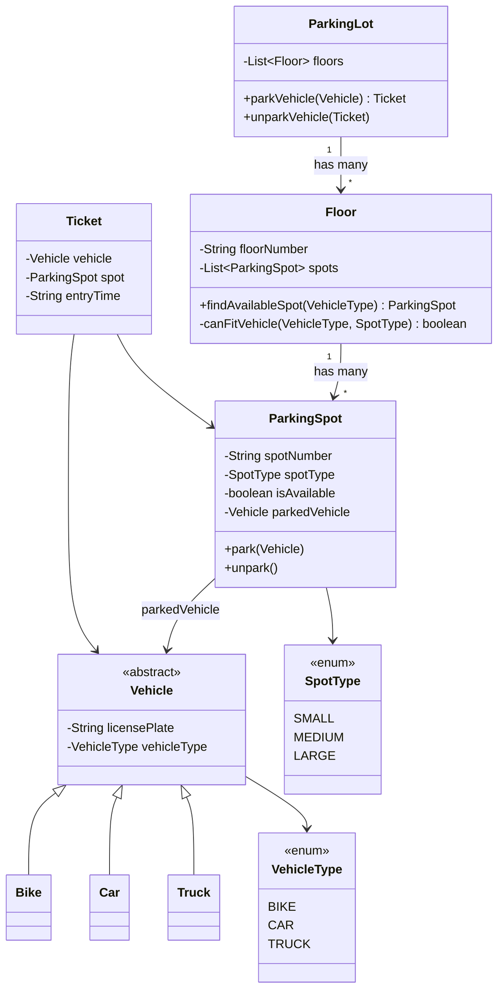
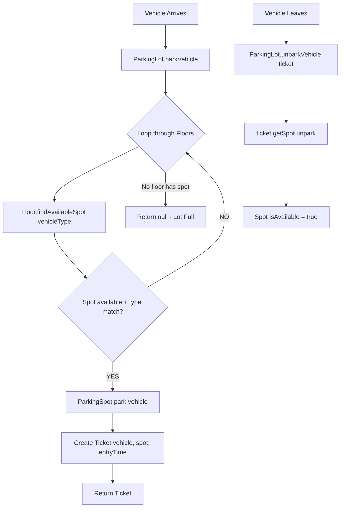

# LLD 01: Parking Lot Design

## Problem:
"Design a Parking Lot system" — interview mein seedha ye puchte.

## Pehle Requirements samjho:
- Multiple floors
- Har floor pe multiple spots
- 3 vehicle types: Bike, Car, Truck
- Bike → SMALL spot, Car → MEDIUM, Truck → LARGE
- Vehicle aaye → spot dhundh → park → ticket de
- Vehicle jaye → unpark → spot free

## Classes banaye (cheezein todo — SRP):

```
1. VehicleType (enum)    — BIKE, CAR, TRUCK
2. SpotType (enum)       — SMALL, MEDIUM, LARGE
3. Vehicle (abstract)    — licensePlate, vehicleType
4. Bike extends Vehicle
5. Car extends Vehicle
6. Truck extends Vehicle
7. ParkingSpot           — spotNumber, spotType, isAvailable, parkedVehicle
8. Ticket                — vehicle, spot, entryTime
9. Floor                 — floorNumber, List<ParkingSpot>
10. ParkingLot           — List<Floor>
```

## Key Methods:

**ParkingSpot:**
- `park(vehicle)` — isAvailable=false, parkedVehicle=vehicle
- `unpark()` — isAvailable=true, parkedVehicle=null

**Floor:**
- `findAvailableSpot(vehicleType)` — loop spots, available + sahi type → return
- `canFitVehicle(vehicleType, spotType)` — Bike→SMALL, Car→MEDIUM, Truck→LARGE match

**ParkingLot:**
- `parkVehicle(vehicle)` — har floor pe findAvailableSpot, mila → park → Ticket return. Nahi mila → null.
- `unparkVehicle(ticket)` — ticket se spot nikaal → unpark

## Flow:

```
Vehicle aaya
  → ParkingLot.parkVehicle(vehicle)
    → for har floor: floor.findAvailableSpot(vehicleType)
      → spot available + type match? → spot.park(vehicle) → Ticket bana → return

Vehicle gaya
  → ParkingLot.unparkVehicle(ticket)
    → ticket.getSpot().unpark() → spot free
```

## canFitVehicle — kyun zaroori:
```
Bina iske Bike LARGE spot mein park ho jayegi — space waste.
Bike → SMALL only
Car → MEDIUM only
Truck → LARGE only
```

## LLD ka core seekh:
**Cheezein todo — har class ka ek kaam.** Yehi Single Responsibility Principle hai. Poora parking ek class mein mat daalo.

## Galtiyan jo hui:
1. **MEDIM typo** — MEDIUM hona chahiye
2. **String use kiya enum ki jagah** — enum banaya lekin use nahi kiya pehle
3. **parkVehicle mein naya Floor bana raha** — existing floors pe loop chahiye
4. **unpark(Vehicle vec)** — parameter nahi chahiye, void unpark() kaafi
5. **Getter setter manual likha** — IDE se auto-generate theek hai, interview mein assume karo

---

## VISUALIZE

### Analogy: Mall Parking

```
Soch tu mall gaya. Gate pe guard hai.
Guard → ticket deta hai (vehicle type dekh ke)
Andar jaake → floor dhundh (1st, 2nd, 3rd...)
Floor pe → sahi size ka spot dhundh (bike ka chhota, car ka medium, truck ka bada)
Spot mila → park. Ticket sambhaal ke rakh.
Wapas jaate waqt → ticket dikha → spot free → nikal ja.
```

### Flow Diagram

```
  ┌─────────────┐
  │   Vehicle    │
  │  (Bike/Car/  │
  │   Truck)     │
  └──────┬───────┘
         │
         ↓
  ┌─────────────────┐
  │   ParkingLot     │
  │  parkVehicle()   │
  └──────┬───────────┘
         │  for each floor...
         ↓
  ┌─────────────────┐
  │     Floor        │
  │ findAvailable    │
  │   Spot()         │
  └──────┬───────────┘
         │  spot available + type match?
         ↓
  ┌─────────────────┐        ┌─────────────┐
  │   ParkingSpot    │───────→│   Ticket     │
  │   park(vehicle)  │  YES   │  (vehicle,   │
  │  isAvailable=    │        │   spot,      │
  │    false         │        │   entryTime) │
  └─────────────────┘        └─────────────┘

  UNPARK:
  ┌──────────┐      ┌─────────────────┐
  │  Ticket   │─────→│  ParkingSpot     │
  │  dikha    │      │  unpark()        │
  └──────────┘      │  isAvailable=    │
                    │    true          │
                    └─────────────────┘
```

### Class Relationships

```
  ┌─────────────────────────────────────────────────────┐
  │                    ParkingLot                        │
  │  List<Floor> floors                                 │
  │  parkVehicle(vehicle) → Ticket                      │
  │  unparkVehicle(ticket)                              │
  └────────────────────┬────────────────────────────────┘
                       │ has many
                       ↓
  ┌─────────────────────────────────────────────────────┐
  │                      Floor                          │
  │  floorNumber                                        │
  │  List<ParkingSpot> spots                            │
  │  findAvailableSpot(vehicleType) → ParkingSpot       │
  └────────────────────┬────────────────────────────────┘
                       │ has many
                       ↓
  ┌──────────────────────────────┐    ┌────────────────┐
  │         ParkingSpot          │    │    Vehicle      │
  │  spotNumber, spotType        │◄───│  (abstract)    │
  │  isAvailable, parkedVehicle  │    │  licensePlate  │
  │  park(vehicle)               │    │  vehicleType   │
  │  unpark()                    │    └───────┬────────┘
  └──────────────────────────────┘        ┌───┼───┐
                                          │   │   │
                                       Bike  Car  Truck

  ┌────────────────────────┐
  │        Ticket           │
  │  vehicle, spot,         │
  │  entryTime              │
  └────────────────────────┘

  VehicleType ←──→ SpotType MAPPING:
  ┌────────┐      ┌────────┐
  │  BIKE  │─────→│ SMALL  │
  │  CAR   │─────→│ MEDIUM │
  │  TRUCK │─────→│ LARGE  │
  └────────┘      └────────┘
```

---

## MERMAID DIAGRAMS

### Class Diagram



### Flow: Vehicle Arrives --> Park --> Ticket



---

## MERA CODE (Arpan ka handwritten — copy paste, fabricated nahi):

```java
import java.util.*;

// --- ENUMS ---
enum VehicleType {
    BIKE, CAR, TRUCK;
}

enum SpotType {
    SMALL, MEDIUM, LARGE;
}

// --- VEHICLE (abstract class) ---
abstract class Vehicle {
    String licensePlate;
    VehicleType vehicleType;

    Vehicle(String licensePlate,  VehicleType vehicleType) {
        this.licensePlate = licensePlate;
        this.vehicleType = vehicleType;
    }
}

class Bike extends Vehicle {
    Bike(String licensePlate, VehicleType vehicleType) {
        super(licensePlate, vehicleType);
    }
}

class Car extends Vehicle {
    Car(String licensePlate, VehicleType vehicleType) {
        super(licensePlate, vehicleType);
    }
}

class Truck extends Vehicle {
    Truck(String licensePlate, VehicleType vehicleType) {
        super(licensePlate, vehicleType);
    }
}

// --- PARKING SPOT ---
class ParkingSpot {
    String spotNumber;
    Vehicle parkedVehicle;
    boolean isAvailable;
    SpotType spotType;

    ParkingSpot(String spotNumber, Vehicle parkedVehicle, SpotType spotType, boolean isAvailable) {
        this.spotNumber = spotNumber;
        this.parkedVehicle = parkedVehicle;
        this.spotType = spotType;
        this.isAvailable = true;
    }

    String getSpotNumber() { return spotNumber; }
    SpotType getSpotType() { return spotType; }
    boolean getIsAvailable() { return isAvailable; }
    void setIsAvailable(boolean isAvailable) { this.isAvailable = isAvailable; }
    Vehicle getParkedVehicle() { return parkedVehicle; }
    void setParkedVehicle(Vehicle parkedVehicle) { this.parkedVehicle = parkedVehicle; }

    void park(Vehicle vec) {
        this.isAvailable = false;
        setParkedVehicle(vec);
    }

    void unpark(Vehicle vec) {
        this.isAvailable = true;
        setParkedVehicle(null);
    }
}

// --- TICKET ---
class Ticket {
    Vehicle vehicle;
    ParkingSpot spot;
    String entryTime;

    Ticket(Vehicle vehicle, ParkingSpot spot, String entryTime) {
        this.vehicle = vehicle;
        this.spot = spot;
        this.entryTime = entryTime;
    }

    Vehicle getVehicle() { return vehicle; }
    ParkingSpot getSpot() { return spot; }
    String getEntryTime() { return entryTime; }
}

// --- FLOOR ---
class Floor {
    String floorNumber;
    List<ParkingSpot> spots;

    Floor(String floorNumber) {
        this.floorNumber = floorNumber;
        this.spots = new ArrayList<>();
    }

    String getFloorNumber() { return floorNumber; }
    List<ParkingSpot> getSpots() { return spots; }

    ParkingSpot findAvailableSpot(VehicleType vehicleType) {
        for (ParkingSpot spot : spots) {
            if (spot.getIsAvailable() && canFitVehicle(vehicleType, spot.getSpotType())) {
                return spot;
            }
        }
        return null;
    }

    private boolean canFitVehicle(VehicleType vehicleType, SpotType spotType) {
        if (vehicleType == VehicleType.BIKE && (spotType == SpotType.SMALL)) return true;
        if (vehicleType == VehicleType.CAR && (spotType == SpotType.MEDIUM)) return true;
        if (vehicleType == VehicleType.TRUCK && spotType == SpotType.LARGE) return true;
        return false;
    }
}

// --- PARKING LOT ---
class ParkingLot {
    List<Floor> floors;

    ParkingLot(List<Floor> floors) {
        this.floors = floors;
    }

    Ticket parkVehicle(Vehicle vehicle) {
        for(Floor floor : floors){
            ParkingSpot p = floor.findAvailableSpot(vehicle.vehicleType);
            if(p != null){
                p.setParkedVehicle(vehicle);
                return new Ticket(vehicle, p, "now");
            }
        }
        return null;
    }

    void unparkVehicle(Ticket t) {
        t.getSpot().unpark(null);
    }
}

// --- MAIN ---
class Main {
    public static void main(String[] args) {
        Floor floor1 = new Floor("1");
        floor1.getSpots().add(new ParkingSpot("F1-S1", null, SpotType.SMALL, true));
        floor1.getSpots().add(new ParkingSpot("F1-M1", null, SpotType.MEDIUM, true));
        floor1.getSpots().add(new ParkingSpot("F1-L1", null, SpotType.LARGE, true));

        List<Floor> floors = new ArrayList<>();
        floors.add(floor1);
        ParkingLot lot = new ParkingLot(floors);

        Vehicle bike = new Bike("UP32-1234", VehicleType.BIKE);
        Ticket t1 = lot.parkVehicle(bike);
        System.out.println("Bike parked at: " + (t1 != null ? t1.getSpot().getSpotNumber() : "No spot"));

        Vehicle car = new Car("DL01-5678", VehicleType.CAR);
        Ticket t2 = lot.parkVehicle(car);
        System.out.println("Car parked at: " + (t2 != null ? t2.getSpot().getSpotNumber() : "No spot"));

        lot.unparkVehicle(t1);
        System.out.println("Bike unparked!");

        Vehicle bike2 = new Bike("UP32-9999", VehicleType.BIKE);
        Ticket t3 = lot.parkVehicle(bike2);
        System.out.println("Bike2 parked at: " + (t3 != null ? t3.getSpot().getSpotNumber() : "No spot"));

        System.out.println("Done!");
    }
}
```

---

## Ek Line Mein:
> LLD = **"Cheezein todo. Har class ka ek kaam. Relationships bana. Methods sahi jagah rakh."**
