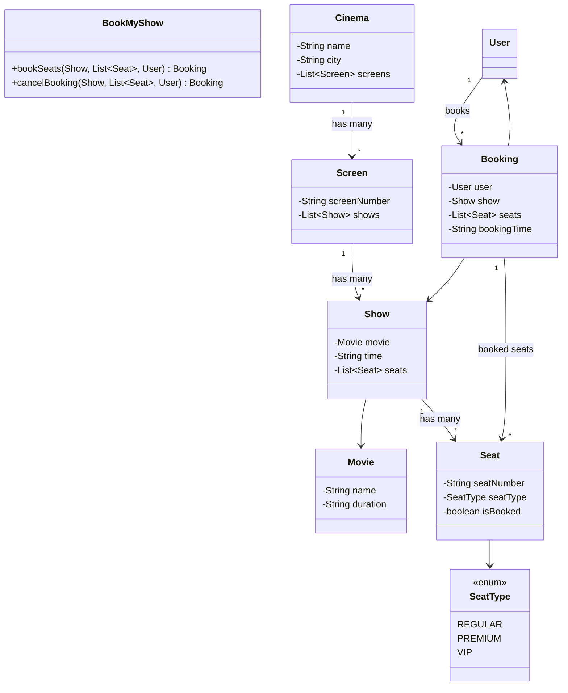
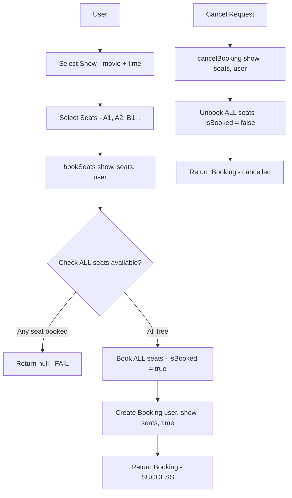

# LLD 02: BookMyShow Design

## Problem:
"Design a Movie Ticket Booking System" — BookMyShow jaisa.

## Requirements:
- Multiple cities → cinemas → screens → shows → seats
- 3 seat types: REGULAR, PREMIUM, VIP
- User seats select kare → book kare → booking confirm
- Booked seat dobaara available na ho
- Cancel kare → seats free

## Classes banaye:

```
1. SeatType (enum)     — REGULAR, PREMIUM, VIP
2. Movie               — name, duration
3. Seat                — seatNumber, seatType, isBooked
4. Show                — movie, time, List<Seat>
5. Screen              — screenNumber, List<Show>
6. Cinema              — name, city, List<Screen>
7. User                — user details
8. Booking             — user, show, List<Seat>, bookingTime
9. BookMyShow          — bookSeats(), cancelBooking()
```

## Key Methods:

**BookMyShow.bookSeats(show, selectedSeats, user):**
```
Step 1: Pehle SAB seats check — koi booked toh nahi?
        Agar koi bhi booked → return null (FAIL)
Step 2: SAB seats book karo (isBooked = true)
Step 3: Booking bana ke return
```

**IMPORTANT:** Pehle check, phir book. Ek saath. Agar beech mein book kiya aur baad mein koi booked mili toh galat.

**BookMyShow.cancelBooking(show, seats, user):**
```
Sab seats unbook (isBooked = false). Return booking.
```

## Flow:

```
User → Show choose → Seats select 
  → bookSeats(show, seats, user) 
    → sab available? → sab book → Booking return
    → koi booked? → null (FAIL)

Cancel:
  → cancelBooking(show, seats, user)
    → sab unbook → done
```

## Parking Lot se fark:

```
Parking Lot: Vehicle → Spot (1:1 mapping)
BookMyShow:  User → Multiple Seats (1:many mapping)
             + Shows ka concept (time based)
```

## Galtiyan jo hui:
1. **Pehli seat book hote hi return** — sab book karni hain pehle, phir return
2. **Cancel mein bhi pehli seat pe return** — sab unbook karo
3. **Ticket typo** — Tikcet likh diya
4. **Check nahi kiya booking se pehle** — pehle sab check, phir book

---

## VISUALIZE

### Analogy: Real Movie Theatre

```
Soch tu PVR gaya.
City mein cinema hai (PVR Noida).
Cinema mein screens hain (Screen 1, Screen 2...).
Screen pe shows chalte (Pushpa 2 at 7PM, RRR at 10PM).
Show mein seats hain (A1-Regular, B1-Premium, C1-VIP).
Tu seats choose karta → sab available? → book ho gayi → Booking mili.
Agar koi seat already booked → FAIL. Partial booking nahi — sab ya kuch nahi.
```

### Flow Diagram

```
  ┌──────┐
  │ User │
  └──┬───┘
     │
     ↓
  ┌──────────────────────┐
  │  Show choose karo     │
  │  (movie + time)       │
  └──────────┬────────────┘
             │
             ↓
  ┌──────────────────────┐
  │  Seats select karo    │
  │  (A1, A2, B1...)      │
  └──────────┬────────────┘
             │
             ↓
  ┌──────────────────────────────────┐
  │  bookSeats(show, seats, user)    │
  │                                  │
  │  Step 1: SAB seats check         │
  │  ┌──────┐ ┌──────┐ ┌──────┐     │
  │  │  A1  │ │  A2  │ │  B1  │     │
  │  │ free?│ │ free?│ │ free?│     │
  │  └──┬───┘ └──┬───┘ └──┬───┘     │
  │     │        │        │          │
  │     ↓        ↓        ↓          │
  │  SAB free ──────────→ Step 2     │
  │  Koi booked ────────→ FAIL null  │
  │                                  │
  │  Step 2: SAB book karo           │
  │  A1.booked=true                  │
  │  A2.booked=true                  │
  │  B1.booked=true                  │
  └──────────┬───────────────────────┘
             │
             ↓
  ┌──────────────────────┐
  │      Booking          │
  │  user, show, seats,   │
  │  bookingTime          │
  └───────────────────────┘
```

### Class Relationships

```
  ┌──────────────────────────────────────────────┐
  │                 BookMyShow                    │
  │  bookSeats(show, seats, user) → Booking      │
  │  cancelBooking(show, seats, user)             │
  └──────────────────────────────────────────────┘

  ┌──────────┐  has many  ┌──────────┐  has many  ┌──────────┐
  │  Cinema   │──────────→│  Screen   │──────────→│   Show    │
  │  name     │           │ screenNo  │           │  movie    │
  │  city     │           │           │           │  time     │
  └──────────┘           └──────────┘           │ List<Seat>│
                                                 └─────┬─────┘
                                                       │ has many
                                                       ↓
  ┌──────────┐           ┌──────────────────┐
  │   User    │           │      Seat        │
  │  name     │           │  seatNumber      │
  └─────┬────┘           │  seatType        │
        │                 │  isBooked        │
        │                 └──────────────────┘
        │       books
        └─────────────→ ┌──────────────────┐
                        │    Booking        │
                        │  user, show,      │
                        │  List<Seat>,      │
                        │  bookingTime      │
                        └──────────────────┘

  SeatType:
  ┌─────────┐  ┌─────────┐  ┌─────────┐
  │ REGULAR │  │ PREMIUM │  │   VIP   │
  │  sasti  │  │ thodi   │  │  sabse  │
  │         │  │ mehengi │  │ mehengi │
  └─────────┘  └─────────┘  └─────────┘
```

---

## MERMAID DIAGRAMS

### Class Diagram



### Flow: User Selects Show --> Selects Seats --> Book



---

## MERA CODE (Arpan ka handwritten):

```java
import java.util.*;

// --- ENUMS ---
// SeatType: REGULAR, PREMIUM, VIP
enum SeatType{
    REGULAR, PREMIUM, VIP;
}


// --- CLASSES ---
// Movie: name, duration
class Movie {
    String name, duration;

    public Movie(String name, String duration) {
        this.name = name;
        this.duration = duration;
    }

    public String getName() {
        return name;
    }

    public void setName(String name) {
        this.name = name;
    }

    public String getDuration() {
        return duration;
    }

    public void setDuration(String duration) {
        this.duration = duration;
    }
}


// Seat: seatNumber, seatType, isBooked
class Seat {
    String seatNumber;
    SeatType seatType;
    boolean isBooked;

    public Seat(String seatNumber, SeatType seatType, boolean isBooked) {
        this.seatNumber = seatNumber;
        this.seatType = seatType;
        this.isBooked = isBooked;
    }

    public String getSeatNumber() {
        return seatNumber;
    }

    public void setSeatNumber(String seatNumber) {
        this.seatNumber = seatNumber;
    }

    public SeatType getSeatType() {
        return seatType;
    }

    public void setSeatType(SeatType seatType) {
        this.seatType = seatType;
    }

    public boolean isBooked() {
        return isBooked;
    }

    public void setBooked(boolean booked) {
        isBooked = booked;
    }
    
}


// Show: movie, time, List<Seat>
class Show{
    Movie movie;
    String time;
    List<Seat> seats;

    public Show(Movie movie, String time, List<Seat> seats) {
        this.movie = movie;
        this.time = time;
        this.seats = seats;
    }

    public Movie getMovie() {
        return movie;
    }

    public void setMovie(Movie movie) {
        this.movie = movie;
    }

    public String getTime() {
        return time;
    }

    public void setTime(String time) {
        this.time = time;
    }

    public List<Seat> getSeats() {
        return seats;
    }

    public void setSeats(List<Seat> seats) {
        this.seats = seats;
    }
}


// Screen: screenNumber, List<Show>
class Screen{
    String screenNumber;
    List<Show> shows;

    public Screen(String screenNumber, List<Show> shows) {
        this.screenNumber = screenNumber;
        this.shows = shows;
    }

    public String getScreenNumber() {
        return screenNumber;
    }

    public void setScreenNumber(String screenNumber) {
        this.screenNumber = screenNumber;
    }

    public List<Show> getShows() {
        return shows;
    }

    public void setShows(List<Show> shows) {
        this.shows = shows;
    }
}


// Cinema: name, city, List<Screen>
class Cinema{
    String name, city;
    List<Screen> screens;

    public Cinema(String name, String city, List<Screen> screens) {
        this.name = name;
        this.city = city;
        this.screens = screens;
    }

    public String getName() {
        return name;
    }

    public void setName(String name) {
        this.name = name;
    }

    public String getCity() {
        return city;
    }

    public void setCity(String city) {
        this.city = city;
    }

    public List<Screen> getScreens() {
        return screens;
    }

    public void setScreens(List<Screen> screens) {
        this.screens = screens;
    }
}


// Booking: user, show, List<Seat>, bookingTime
class Booking{
    User user;
    Show show;
    List<Seat> seats;
    String bookingTime;

    public Booking(User user, Show show, List<Seat> seats, String bookingTime) {
        this.user = user;
        this.show = show;
        this.seats = seats;
        this.bookingTime = bookingTime;
    }

    public User getUser() {
        return user;
    }

    public void setUser(User user) {
        this.user = user;
    }

    public Show getShow() {
        return show;
    }

    public void setShow(Show show) {
        this.show = show;
    }

    public List<Seat> getSeats() {
        return seats;
    }

    public void setSeats(List<Seat> seats) {
        this.seats = seats;
    }

    public String getBookingTime() {
        return bookingTime;
    }

    public void setBookingTime(String bookingTime) {
        this.bookingTime = bookingTime;
    }
}

class BookMyShow{
    Seat seat;

    public BookMyShow(Seat seat) {
        this.seat = seat;
    }

    public Seat getSeat() {
        return seat;
    }

    public void setSeat(Seat seat) {
        this.seat = seat;
    }

    Booking bookSeats(Show show, List<Seat> selcetdSeats, User user){
        for(Seat s : selcetdSeats){
            if(s.isBooked()){
                return null;
            }
        }
        for(Seat s : selcetdSeats){
            if(!s.isBooked()){
                s.setBooked(true);
            }
        }
        return new Booking(user, show, selcetdSeats, "now");
    }

    Booking cancelBooking(Show show, List<Seat> selcetdSeats, User user){
        for(Seat s : selcetdSeats){
            if(s.isBooked()){
                s.setBooked(false);
            }
        }
        return new Booking(user, show, selcetdSeats, "user canceled");
    }
}

class User {

}


// Ticket: booking details
class Ticket{

}

// --- YAHAN APNA CODE LIKH ---


// --- END ---


class Main {
    public static void main(String[] args) {
        // Movie bana
        Movie movie = new Movie("Pushpa 2", "3hr");

        // Seats bana
        List<Seat> seats = new ArrayList<>();
        seats.add(new Seat("A1", SeatType.REGULAR, false));
        seats.add(new Seat("A2", SeatType.REGULAR, false));
        seats.add(new Seat("B1", SeatType.PREMIUM, false));
        seats.add(new Seat("C1", SeatType.VIP, false));

        // Show bana
        Show show = new Show(movie, "7:00 PM", seats);

        // Screen, Cinema
        List<Show> shows = new ArrayList<>();
        shows.add(show);
        Screen screen = new Screen("Screen 1", shows);

        // BookMyShow service
        BookMyShow bms = new BookMyShow(seats.get(0));

        // User
        User user = new User();

        // Book 2 seats
        List<Seat> selected = new ArrayList<>();
        selected.add(seats.get(0));
        selected.add(seats.get(1));
        Booking b1 = bms.bookSeats(show, selected, user);
        System.out.println("Booking: " + (b1 != null ? "SUCCESS — seats booked" : "FAILED"));

        // Dobaara same seats book — fail hona chahiye
        Booking b2 = bms.bookSeats(show, selected, user);
        System.out.println("Rebook: " + (b2 != null ? "SUCCESS" : "FAILED — already booked"));

        // Cancel
        bms.cancelBooking(show, selected, user);
        System.out.println("Cancelled!");

        // Dobaara book — ab hona chahiye
        Booking b3 = bms.bookSeats(show, selected, user);
        System.out.println("Rebook after cancel: " + (b3 != null ? "SUCCESS" : "FAILED"));

        System.out.println("BookMyShow Done!");
    }
}
```

## Ek Line Mein:
> BookMyShow = **"Pehle check sab available. Phir sab book. Ek bhi booked → FAIL."**
