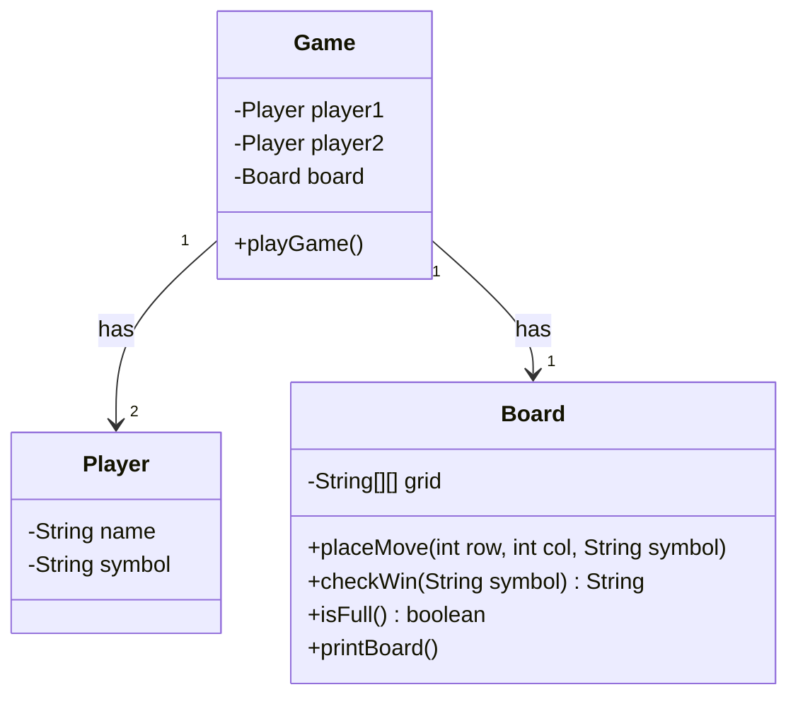
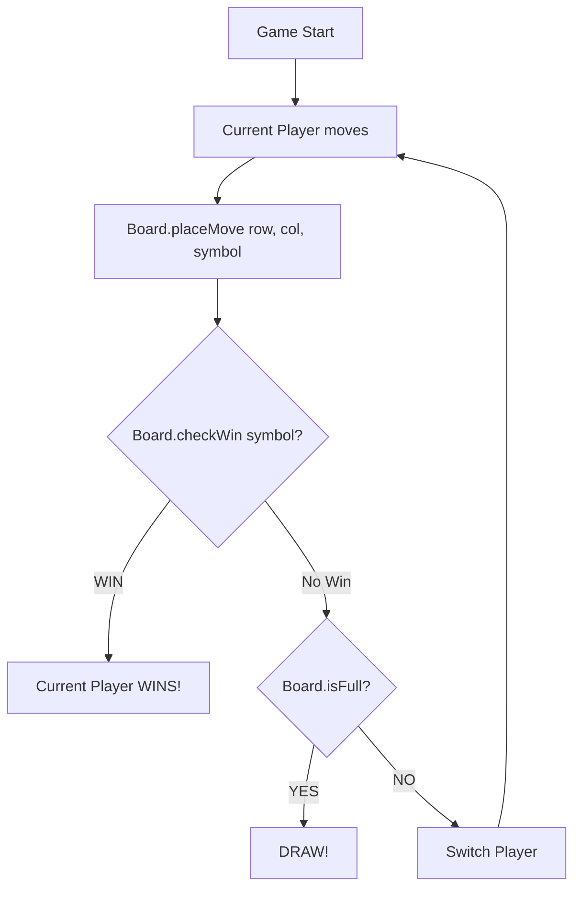

# LLD 03: Tic Tac Toe Design

## Problem:
"Design a Tic Tac Toe game" — 3x3 grid, 2 players, X aur O.

## Classes:

```
1. Player        — name, symbol (X/O)
2. Board         — 3x3 grid, placeMove(), checkWin(), isFull(), printBoard()
3. Game          — 2 players, board, playGame() (turn manage)
```

## Key Methods:

**Board.placeMove(row, col, symbol):**
- Seedha `grid[row][col] = symbol`. Loop nahi — row, col directly diya.

**Board.checkWin(symbol):**
```
3 checks:
1. Rows: grid[i][0] && grid[i][1] && grid[i][2] — teeno same
2. Columns: grid[0][j] && grid[1][j] && grid[2][j] — teeno same
3. Diagonals: grid[0][0],grid[1][1],grid[2][2] AUR grid[0][2],grid[1][1],grid[2][0]

Diagonal mein LOOP NAHI — values constant hain, seedha likh do.
```

**Board.isFull():**
- Koi khaali jagah? Nahi → true (draw). Haan → false.

**Game.playGame():**
- Turn by turn — current player move kare
- Har move ke baad checkWin + isFull
- Win → print winner. Full → DRAW. Warna next turn.

## Galtiyan:
1. **placeMove mein loop lagaya** — zaroorat nahi, row col seedha diya
2. **checkWin mein sirf ek cell check** — teeno same chahiye row/col mein
3. **String compare `==`** — Java mein `.equals()` use kar
4. **Diagonal mein loop** — constant values, seedha 2 if statements
5. **isFull mein `==` String compare** — `.equals()` use kar

## Parking Lot se fark:
```
Parking Lot: Entity manage (Vehicle, Spot) — CRUD operations
Tic Tac Toe: Game logic — state check (win/draw), turn manage
```

---

## VISUALIZE

### Board Grid (3x3)

```
         col0    col1    col2
       ┌───────┬───────┬───────┐
  row0 │   X   │   X   │   X   │  ← Row win (teeno same)
       ├───────┼───────┼───────┤
  row1 │   O   │   O   │       │
       ├───────┼───────┼───────┤
  row2 │       │       │   O   │
       └───────┴───────┴───────┘
```

### Win Conditions Visual

```
  ROWS (3 checks):              COLUMNS (3 checks):
  ┌───┬───┬───┐                 ┌───┬───┬───┐
  │ X │ X │ X │ ← row 0        │ X │   │   │
  ├───┼───┼───┤                 ├───┼───┼───┤
  │   │   │   │                 │ X │   │   │
  ├───┼───┼───┤                 ├───┼───┼───┤
  │   │   │   │                 │ X │   │   │
  └───┴───┴───┘                 └───┴───┴───┘
                                  ↑
                                col 0

  DIAGONAL 1:                   DIAGONAL 2:
  ┌───┬───┬───┐                 ┌───┬───┬───┐
  │ X │   │   │                 │   │   │ X │
  ├───┼───┼───┤                 ├───┼───┼───┤
  │   │ X │   │                 │   │ X │   │
  ├───┼───┼───┤                 ├───┼───┼───┤
  │   │   │ X │                 │ X │   │   │
  └───┴───┴───┘                 └───┴───┴───┘
  (0,0)(1,1)(2,2)               (0,2)(1,1)(2,0)

  NOTE: Diagonals mein LOOP NAHI — values constant hain!
```

### Game Flow

```
  ┌──────────┐
  │  Game    │
  │ Start    │
  └────┬─────┘
       │
       ↓
  ┌──────────────┐
  │  Player 1    │
  │  move (X)    │
  │  placeMove() │
  └────┬─────────┘
       │
       ↓
  ┌──────────────┐     YES    ┌──────────────┐
  │  checkWin()  │───────────→│  Player 1    │
  │  X jeet gaya?│            │  WINS!       │
  └────┬─────────┘            └──────────────┘
       │ NO
       ↓
  ┌──────────────┐     YES    ┌──────────────┐
  │  isFull()?   │───────────→│    DRAW!     │
  │  board bhara?│            └──────────────┘
  └────┬─────────┘
       │ NO
       ↓
  ┌──────────────┐
  │  Player 2    │
  │  move (O)    │
  │  placeMove() │
  └────┬─────────┘
       │
       ↓
  ┌──────────────┐     YES    ┌──────────────┐
  │  checkWin()  │───────────→│  Player 2    │
  │  O jeet gaya?│            │  WINS!       │
  └────┬─────────┘            └──────────────┘
       │ NO
       ↓
  ┌──────────────┐     YES    ┌──────────────┐
  │  isFull()?   │───────────→│    DRAW!     │
  └────┬─────────┘            └──────────────┘
       │ NO
       ↓
     (Player 1 ki baari phir se — loop)
```

---

## MERMAID DIAGRAMS

### Class Diagram



### Game Flow: Player Move --> Check Win --> Switch



---

## MERA CODE (Arpan ka handwritten):

```java
import java.util.*;

// --- Player: name, symbol (X/O) ---
class Player {
    String name;
    String symbol;

    Player(String name, String symbol) {
        this.name = name;
        this.symbol = symbol;
    }

    String getName() {
        return name;
    }

    void setName(String name) {
        this.name = name;
    }

    String getSymbol() {
        return symbol;
    }

    void setSymbol(String symbol) {
        this.symbol = symbol;
    }
}

// --- Board: 3x3 grid ---
// Methods: placeMove(row, col, symbol), checkWin(symbol), isFull(),
// printBoard()
class Board {
    String[][] grid = new String[3][3];

    Board() {
        for (int i = 0; i < 3; i++) {
            for (int j = 0; j < 3; j++) {
                grid[i][j] = " ";
            }
        }
    }

    void placeMove(int row, int col, String symbol) {
        grid[row][col] = symbol;
    }

    String checkWin(String symbol) {
        // row check
        for (int i = 0; i < 3; i++) {
            if (grid[i][0].equals(symbol) && grid[i][1].equals(symbol) && grid[i][2].equals(symbol)) {
                return "WIN";
            }
        }

        for (int j = 0; j < 3; j++) {
            if (grid[0][j].equals(symbol) && grid[1][j].equals(symbol) && grid[2][j].equals(symbol)) {
                return "WIN";
            }
        }

        if (grid[0][0].equals(symbol) && grid[1][1].equals(symbol) && grid[2][2].equals(symbol)) {
            return "WIN";
        }
        if (grid[0][2].equals(symbol) && grid[1][1].equals(symbol) && grid[2][0].equals(symbol)) {
            return "WIN";
        }

        return "LOOSE";
    }

    boolean isFull() {
        for (int i = 0; i < 3; i++) {
            for (int j = 0; j < 3; j++) {
                if (grid[i][j].equals(" ")) {
                    return false;
                }
            }
        }
        return true;
    }

    void printBoard() {
        for (int i = 0; i < 3; i++) {
            for (int j = 0; j < 3; j++) {
                System.out.println(grid[i][j]);
            }
        }
    }
}

// --- Game: 2 players, board, turn manage ---
// Methods: playGame()
class Game {
    Player player1;
    Player player2;
    Board board;

    Game(Player player1, Player player2) {
        this.player1 = player1;
        this.player2 = player2;
        this.board = new Board();
    }

    void playGame() {
        Player current = player1;
        // simulate moves
        int[][] moves = { { 0, 0 }, { 1, 1 }, { 0, 1 }, { 2, 2 }, { 0, 2 } }; // X wins row 0

        for (int[] move : moves) {
            board.placeMove(move[0], move[1], current.getSymbol());
            board.printBoard();
            System.out.println();

            if (board.checkWin(current.getSymbol()).equals("WIN")) {
                System.out.println(current.getName() + " WINS!");
                return;
            }
            if (board.isFull()) {
                System.out.println("DRAW!");
                return;
            }
            current = (current == player1) ? player2 : player1;
        }
    }
}

class Main {
    public static void main(String[] args) {
        Player p1 = new Player("Arpan", "X");
        Player p2 = new Player("Claude", "O");
        Game game = new Game(p1, p2);
        game.playGame();
    }
}
```

## Ek Line Mein:
> Tic Tac Toe = **"Board grid bana. placeMove seedha. checkWin rows+cols+diagonals teeno same. Turn manage."**
