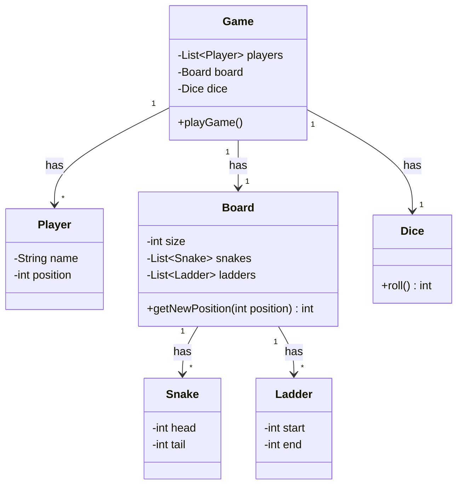
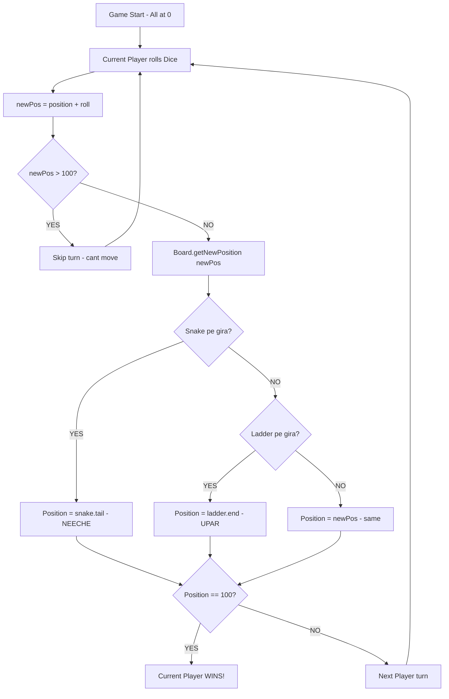

# LLD 04: Snake & Ladder Design

## Problem:
"Design Snake & Ladder game" — board game, dice, snakes neeche, ladders upar.

## Classes:

```
1. Player    — name, position (start 0)
2. Snake     — head (upar), tail (neeche)
3. Ladder    — start (neeche), end (upar)
4. Dice      — roll() → random 1-6
5. Board     — size (100), List<Snake>, List<Ladder>
6. Game      — List<Player>, Board, Dice, playGame()
```

## Key Methods:

**Dice.roll():**
- `(int)(Math.random() * 6) + 1` — 1 se 6 random

**Board.getNewPosition(position):**
```
Snakes check: position == snake.head → return snake.tail (neeche gaya)
Ladders check: position == ladder.start → return ladder.end (upar gaya)
Kuch nahi → return position (same raha)
```

**Game.playGame():**
```
while(true):
  current player = turn % players.size()
  roll dice
  newPos = position + roll
  newPos > 100? → skip (can't move)
  newPos = board.getNewPosition(newPos)  ← snake/ladder check
  player.setPosition(newPos)
  newPos == 100? → WIN! break.
  next turn.
```

## Galtiyan:
1. **Board mein snakes/ladders int rakha** — List<Snake>/List<Ladder> chahiye
2. **Duplicate Main class** — ek file mein 2 Main — compile error

## Pichle LLD se compare:

```
Parking Lot:    Entity manage — park/unpark
BookMyShow:     Booking system — book/cancel + availability check
Tic Tac Toe:    Game logic — win check (rows/cols/diagonals)
Snake & Ladder: Game logic — position update + snake/ladder check
```

---

## VISUALIZE

### Board with Snakes and Ladders

```
  ┌─────┬─────┬─────┬─────┬─────┬─────┬─────┬─────┬─────┬─────┐
  │ 100 │  99 │  98 │  97 │  96 │  95 │  94 │  93 │  92 │  91 │
  │FINISH│     │     │     │     │     │     │     │     │  ↑  │
  ├─────┼─────┼─────┼─────┼─────┼─────┼─────┼─────┼─────┼──L──┤
  │  81 │  82 │  83 │  84 │  85 │  86 │  87 │  88 │  89 │  90 │
  │     │     │     │     │     │     │     │ S↘  │     │     │
  ├─────┼─────┼─────┼─────┼─────┼─────┼─────┼─────┼─────┼─────┤
  │  ...│     │     │     │  74 │     │     │     │     │     │
  │     │     │     │     │  ↑  │     │     │     │     │     │
  ├─────┼─────┼─────┼─────┼──L──┼─────┼─────┼─────┼─────┼─────┤
  │     │  62 │     │     │     │     │     │     │     │     │
  │     │ S↘  │     │     │     │     │     │     │     │     │
  ├─────┼─────┼─────┼─────┼─────┼─────┼─────┼─────┼─────┼─────┤
  │     │     │     │     │  50 │     │     │     │     │     │
  │     │     │     │     │  L↑ │     │     │     │     │     │
  ├─────┼─────┼─────┼─────┼─────┼─────┼─────┼─────┼─────┼─────┤
  │     │     │     │     │     │  36 │     │     │     │     │
  │     │     │     │     │     │ S↘  │     │     │     │     │
  ├─────┼─────┼─────┼─────┼─────┼─────┼─────┼─────┼─────┼─────┤
  │     │  22 │     │  24 │     │     │     │     │     │     │
  │     │  ↑  │     │  ↙S │     │     │     │     │     │     │
  ├─────┼──L──┼─────┼─────┼─────┼─────┼─────┼─────┼─────┼─────┤
  │     │     │  13 │     │     │  17 │  19 │     │     │     │
  │     │     │     │     │     │  L↑ │  ↙S │     │     │     │
  ├─────┼─────┼─────┼─────┼─────┼─────┼─────┼─────┼─────┼─────┤
  │   1 │   2 │   3 │   4 │   5 │   6 │   7 │   8 │   9 │  10 │
  │START│     │  L↑ │     │     │ ↙S  │     │     │     │     │
  └─────┴─────┴─────┴─────┴─────┴─────┴─────┴─────┴─────┴─────┘

  S = Snake (head → tail = NEECHE gaya!)
      36→6, 62→19, 88→24
  L = Ladder (start → end = UPAR gaya!)
      3→22, 17→74, 50→91
```

### Game Flow

```
  ┌────────────┐
  │ Game Start │
  │ All at 0   │
  └─────┬──────┘
        │
        ↓
  ┌────────────────┐
  │ Current Player │
  │ rolls Dice     │
  │ (1 to 6)       │
  └─────┬──────────┘
        │
        ↓
  ┌────────────────────┐     YES    ┌──────────────┐
  │  newPos > 100?     │───────────→│  Skip turn   │
  │  (board se bahar?) │            │  (can't move)│
  └─────┬──────────────┘            └──────┬───────┘
        │ NO                               │
        ↓                                  │
  ┌────────────────────────┐               │
  │  board.getNewPosition  │               │
  │                        │               │
  │  Snake pe gira?        │               │
  │  ┌────────────────┐   │               │
  │  │ head=88 → tail │   │               │
  │  │ pos becomes 24 │   │               │
  │  └────────────────┘   │               │
  │                        │               │
  │  Ladder pe gira?       │               │
  │  ┌────────────────┐   │               │
  │  │ start=3 → end  │   │               │
  │  │ pos becomes 22 │   │               │
  │  └────────────────┘   │               │
  │                        │               │
  │  Kuch nahi → same pos  │               │
  └─────┬──────────────────┘               │
        │                                  │
        ↓                                  │
  ┌────────────────┐     YES    ┌─────────────────┐
  │  pos == 100?   │───────────→│  WINNER!        │
  │                │            │  Game Over      │
  └─────┬──────────┘            └─────────────────┘
        │ NO
        ↓
  ┌────────────────┐
  │  Next Player   │──→ (loop back to dice roll)
  └────────────────┘
```

### Player Journey Example

```
  Arpan ka safar:
  
  Position 0 ──roll 3──→ Position 3 ──LADDER!──→ Position 22
                                                       │
  Position 22 ──roll 5──→ Position 27 (normal)         │
                                                       │
  Position 27 ──roll 6──→ Position 33 (normal)
  
  Position 33 ──roll 3──→ Position 36 ──SNAKE!──→ Position 6
                                                       │
  Wapas neeche! Phir se chadho.                        │
  ...
  Position 95 ──roll 5──→ 100! WIN!
```

---

## MERMAID DIAGRAMS

### Class Diagram



### Game Flow: Roll --> Move --> Snake/Ladder Check --> Win Check



---

## MERA CODE (Arpan ka handwritten):

```java
import java.util.*;

// --- Player: name, position ---
class Player{
    String name;
    int position;

    Player(String name, int position) {
        this.name = name;
        this.position = position;
    }

    String getName() {
        return name;
    }

    void setName(String name) {
        this.name = name;
    }

    int getPosition() {
        return position;
    }

    void setPosition(int position) {
        this.position = position;
    }
}


// --- Snake: head (upar), tail (neeche) ---
class Snake{
    int head;
    int tail;

    Snake(int head, int tail) {
        this.head = head;
        this.tail = tail;
    }

    int getHead() {
        return head;
    }

    void setHead(int head) {
        this.head = head;
    }

    int getTail() {
        return tail;
    }

    void setTail(int tail) {
        this.tail = tail;
    }
}


// --- Ladder: start (neeche), end (upar) ---
class Ladder{
    int start;
    int end;

    Ladder(int start, int end) {
        this.start = start;
        this.end = end;
    }

    int getStart() {
        return start;
    }

    void setStart(int start) {
        this.start = start;
    }

    int getEnd() {
        return end;
    }

    void setEnd(int end) {
        this.end = end;
    }
}


// --- Dice: roll() → 1-6 ---
class Dice{
    int roll() {
        return (int)(Math.random() * 6) + 1;
    }
}


// --- Board: size, snakes, ladders ---
// Method: getNewPosition(position) — snake ya ladder pe hai?
class Board{
    int size;
    List<Snake> snakes;
    List<Ladder> ladders;

    Board(int size, List<Snake> snakes, List<Ladder> ladders) {
        this.size = size;
        this.snakes = snakes;
        this.ladders = ladders;
    }

    int getSize() {
        return size;
    }

    void setSize(int size) {
        this.size = size;
    }

    List<Snake> getSnakes() {
        return snakes;
    }

    void setSnakes(List<Snake> snakes) {
        this.snakes = snakes;
    }

    List<Ladder> getLadders() {
        return ladders;
    }

    void setLadders(List<Ladder> ladders) {
        this.ladders = ladders;
    }

    int getNewPosition(int position){
        for(Snake it : snakes){
            if(it.head == position){
                return it.tail;
            }
        }

        for(Ladder it : ladders){
            if(it.start == position){
                return it.end;
            }
        }
        return position;
    }
    
}


// --- Game: players, board, dice, playGame() ---
class Game{
    List<Player> players;
    Board board;
    Dice dice;

    Game(List<Player> players, Board board, Dice dice) {
        this.players = players;
        this.board = board;
        this.dice = dice;
    }

    List<Player> getPlayers() {
        return players;
    }

    void setPlayers(List<Player> players) {
        this.players = players;
    }

    Board getBoard() {
        return board;
    }

    void setBoard(Board board) {
        this.board = board;
    }

    Dice getDice() {
        return dice;
    }

    void setDice(Dice dice) {
        this.dice = dice;
    }

    void playGame() {
        int turn = 0;
        while (true) {
            Player current = players.get(turn % players.size());
            int roll = dice.roll();
            int newPos = current.getPosition() + roll;

            if (newPos > board.getSize()) {
                System.out.println(current.getName() + " rolled " + roll + " — can't move (over 100)");
                turn++;
                continue;
            }

            newPos = board.getNewPosition(newPos);
            current.setPosition(newPos);
            System.out.println(current.getName() + " rolled " + roll + " → position " + newPos);

            if (newPos == board.getSize()) {
                System.out.println(current.getName() + " WINS!");
                break;
            }
            turn++;
        }
    }
}

class Main {
    public static void main(String[] args) {
        List<Snake> snakes = new ArrayList<>();
        snakes.add(new Snake(36, 6));
        snakes.add(new Snake(62, 19));
        snakes.add(new Snake(88, 24));

        List<Ladder> ladders = new ArrayList<>();
        ladders.add(new Ladder(3, 22));
        ladders.add(new Ladder(17, 74));
        ladders.add(new Ladder(50, 91));

        Board board = new Board(100, snakes, ladders);
        Dice dice = new Dice();

        List<Player> players = new ArrayList<>();
        players.add(new Player("Arpan", 0));
        players.add(new Player("Claude", 0));

        Game game = new Game(players, board, dice);
        game.playGame();
    }
}
```

## Ek Line Mein:
> Snake & Ladder = **"Dice roll. Position update. Snake pe → neeche. Ladder pe → upar. 100 pe → WIN."**
