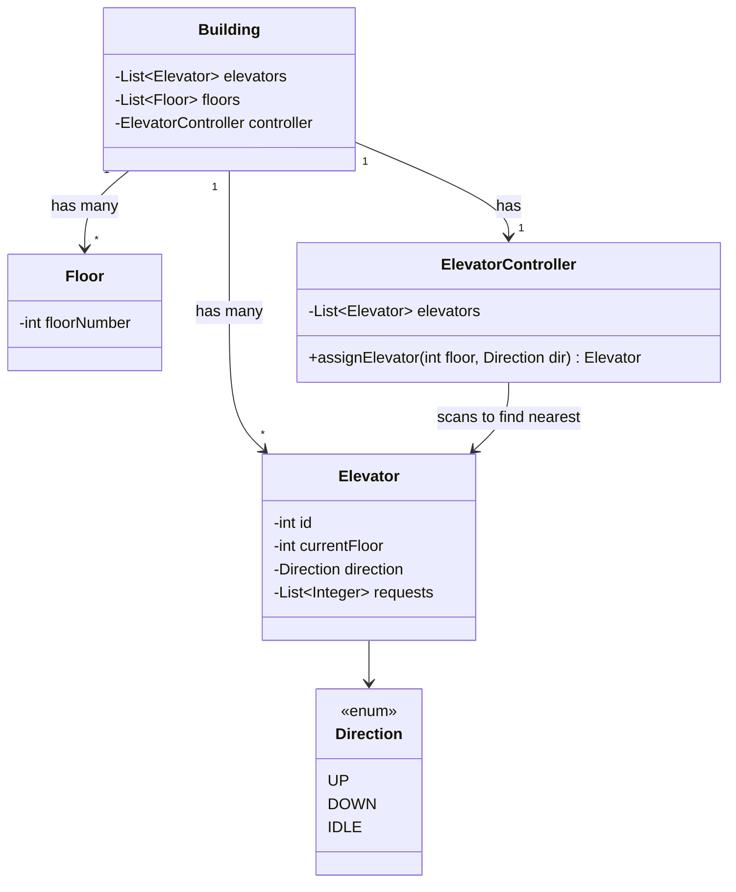
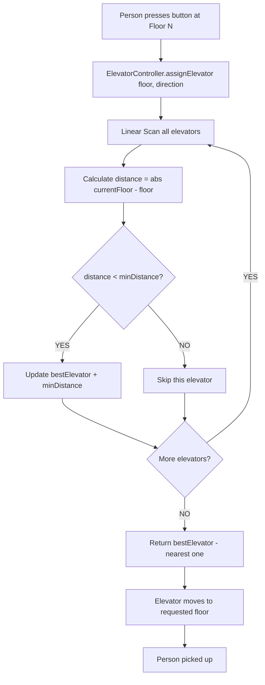

# LLD 06: Elevator System Design

## Problem:
"Design an Elevator System" — building mein multiple lifts, multiple floors, requests manage.

## Classes:

```
1. Direction (enum)      — UP, DOWN, IDLE
2. Elevator              — id, currentFloor, direction, requests
3. Floor                 — floorNumber
4. ElevatorController    — List<Elevator>, assignElevator(floor, direction)
5. Building              — List<Elevator>, List<Floor>, ElevatorController
```

## Key Method — assignElevator:

**Sabse paas wala elevator bhej:**
```
Elevator assignElevator(int floor, Direction direction):
    bestElevator = null
    minDistance = INT_MAX
    for har elevator:
        distance = abs(elevator.currentFloor - floor)
        agar distance < minDistance → update minDistance + bestElevator
    return bestElevator
```

**Ye Linear Scan pattern hai — min dhundh raha!** DSA ka pattern LLD mein use hua.

## Building Constructor — loop se elevators aur floors bana:
```
for(i = 0 to numElevators): elevators.add(new Elevator(i, 0))
for(i = 0 to numFloors): floors.add(new Floor(i))
```

## Galtiyan:
1. **Direction mein IDLE nahi tha** — elevator khada hai toh IDLE hona chahiye
2. **requests int tha** — List<Integer> chahiye (kaunse floors pe jaana)
3. **bestElevator save nahi kiya** — minDistance track kiya lekin elevator nahi
4. **Constructor mein loop hataya** — elevators add nahi hue, empty list
5. **abs method auto-generate** — IDE ne banaya, Math.abs() already tha

## Pichle LLD se compare:
```
Parking Lot:    Vehicle → Spot assign (1:1)
BookMyShow:     User → Seats book (1:many)
Tic Tac Toe:    Game logic — win check
Snake & Ladder: Game logic — position update
Elevator:       Request → Best elevator assign (optimization)
```

---

## VISUALIZE

### Analogy: Office Building Elevators

```
Soch tu office building mein hai.
3 lifts hain. 10 floors hain.
Tu 5th floor pe khada → button dabaya (UP chahiye).
Controller dekhta — kaunsi lift sabse paas?
  Lift A → 2nd floor pe hai (distance 3)
  Lift B → 7th floor pe hai (distance 2)  ← WINNER
  Lift C → 4th floor pe hai (distance 1)  ← WINNER (closest!)
Lift C assign hoti → tere paas aati.
```

### Building with Floors and Elevators

```
  ┌─────────────────────────────────────────────┐
  │                BUILDING                      │
  │                                              │
  │  Floor 9  ─── │     │     │     │ ───        │
  │  Floor 8  ─── │     │     │     │ ───        │
  │  Floor 7  ─── │ [B] │     │     │ ───        │
  │  Floor 6  ─── │     │     │     │ ───        │
  │  Floor 5  ─── │     │     │     │ ─── ← REQUEST HERE
  │  Floor 4  ─── │     │     │ [C] │ ───        │
  │  Floor 3  ─── │     │     │     │ ───        │
  │  Floor 2  ─── │ [A] │     │     │ ───        │
  │  Floor 1  ─── │     │     │     │ ───        │
  │  Floor 0  ─── │     │     │     │ ───        │
  │               Lift0  Lift1  Lift2             │
  │                                              │
  │  [A] = Elevator 0 at floor 2                 │
  │  [B] = Elevator 1 at floor 7                 │
  │  [C] = Elevator 2 at floor 4  ← NEAREST!    │
  └─────────────────────────────────────────────┘
```

### Request Flow

```
  ┌────────────────┐
  │  Person presses │
  │  button at      │
  │  Floor 5 (UP)   │
  └───────┬─────────┘
          │
          ↓
  ┌─────────────────────────────────────────┐
  │       ElevatorController                 │
  │       assignElevator(floor=5, UP)        │
  │                                          │
  │  Linear Scan — sabse paas dhundh:        │
  │  ┌──────────┬──────────┬──────────┐      │
  │  │ Lift 0   │ Lift 1   │ Lift 2   │      │
  │  │ floor=2  │ floor=7  │ floor=4  │      │
  │  │ dist=3   │ dist=2   │ dist=1   │      │
  │  │          │          │  MIN!    │      │
  │  └──────────┴──────────┴──────────┘      │
  └───────┬─────────────────────────────────┘
          │
          ↓
  ┌────────────────────┐
  │  Lift 2 assigned   │
  │  Move: floor 4 → 5 │
  │  Pick up person    │
  └────────────────────┘
```

### Class Relationships

```
  ┌──────────────────────────────────────────┐
  │               Building                    │
  │  List<Elevator> elevators                 │
  │  List<Floor> floors                       │
  │  ElevatorController controller            │
  └─────────┬──────────────┬─────────────────┘
            │              │
   has many │              │ has many
            ↓              ↓
  ┌──────────────┐  ┌──────────────┐
  │   Elevator    │  │    Floor     │
  │  id           │  │  floorNumber │
  │  currentFloor │  └──────────────┘
  │  direction    │
  │  requests     │
  └──────────────┘
         ↑
         │ uses (linear scan to find nearest)
  ┌──────────────────────────┐
  │   ElevatorController      │
  │  List<Elevator>            │
  │  assignElevator(floor,dir) │
  │  → return nearest elevator │
  └───────────────────────────┘

  Direction: UP | DOWN | IDLE
```

---

## MERMAID DIAGRAMS

### Class Diagram



### Flow: Request --> Controller --> Find Nearest --> Assign



---

## MERA CODE (Arpan ka handwritten):

```java
import java.util.*;

// --- Direction enum ---
enum Direction{
    UP, DOWN, IDLE;
}


// --- Elevator: id, currentFloor, direction, requests ---
class Elevator{
    int id, currentFloor;
    Direction direction;
    List<Integer> requests;

    public Elevator(int id, int currentFloor) {
        this.id = id;
        this.currentFloor = currentFloor;
        this.direction = Direction.UP;
        this.requests = new ArrayList<>();
    }

    public int getId() {
        return id;
    }

    public void setId(int id) {
        this.id = id;
    }

    public int getCurrentFloor() {
        return currentFloor;
    }

    public void setCurrentFloor(int currentFloor) {
        this.currentFloor = currentFloor;
    }

    public Direction getDirection() {
        return direction;
    }

    public void setDirection(Direction direction) {
        this.direction = direction;
    }

    public List<Integer> getRequests() {
        return requests;
    }

    public void setRequests(List<Integer> requests) {
        this.requests = requests;
    }

}


// --- Floor: floorNumber ---
class Floor{
    int floorNumber;

    public Floor(int floorNumber) {
        this.floorNumber = floorNumber;
    }

    public int getFloorNumber() {
        return floorNumber;
    }

    public void setFloorNumber(int floorNumber) {
        this.floorNumber = floorNumber;
    }
}


// --- ElevatorController: assign best elevator ---
class ElevatorController{
    List<Elevator> elevators;

    public ElevatorController(List<Elevator> elevators) {
        this.elevators = elevators;
    }

    public List<Elevator> getElevators() {
        return elevators;
    }

    public void setElevators(List<Elevator> elevators) {
        this.elevators = elevators;
    }

    Elevator assignElevator(int floor, Direction dircetion){
        Elevator bestElevator = null; 
        int minDistance = Integer.MAX_VALUE;
        for(Elevator it : elevators){
            if(Math.abs(it.currentFloor - floor) < minDistance){
                minDistance = Math.abs(it.currentFloor - floor);
                bestElevator = it;
            }
        }
        return bestElevator;
    }
}


// --- Building: elevators, floors ---
class Building{
    List<Elevator> elevators;
    List<Floor> floors;
    ElevatorController controller;

    public Building(int numElevator, int numFloor) {
        this.elevators = new ArrayList<>();
        this.floors = new ArrayList<>();
        this.controller = new ElevatorController(elevators);

        for(int i=0;i<numElevator;i++){
            elevators.add(new Elevator(i, 0));
        }

        for(int i=0;i<numFloor;i++){
            floors.add(new Floor(i));
        }
    }
   

    public List<Elevator> getElevators() {
        return elevators;
    }

    public List<Floor> getFloors() {
        return floors;
    }

    public ElevatorController getController() {
        return controller;
    }
}


class Main {
    public static void main(String[] args) {
        Building building = new Building(3, 10);

        ElevatorController controller = building.getController();

        // Elevator 0 floor 0, Elevator 1 floor 0, Elevator 2 floor 0
        // Set different positions
        building.getElevators().get(0).setCurrentFloor(2);
        building.getElevators().get(1).setCurrentFloor(7);
        building.getElevators().get(2).setCurrentFloor(4);

        // Floor 5 se request — sabse paas kaunsa?
        Elevator best = controller.assignElevator(5, Direction.UP);
        System.out.println("Request from floor 5 → Elevator " + best.getId() + " (at floor " + best.getCurrentFloor() + ")");

        // Floor 1 se request
        Elevator best2 = controller.assignElevator(1, Direction.UP);
        System.out.println("Request from floor 1 → Elevator " + best2.getId() + " (at floor " + best2.getCurrentFloor() + ")");

        // Floor 8 se request
        Elevator best3 = controller.assignElevator(8, Direction.DOWN);
        System.out.println("Request from floor 8 → Elevator " + best3.getId() + " (at floor " + best3.getCurrentFloor() + ")");

        System.out.println("Elevator System Done!");
    }
}
```

## Ek Line Mein:
> Elevator = **"Request aaye → sabse paas wala elevator dhundh (Linear Scan min distance) → assign."**
