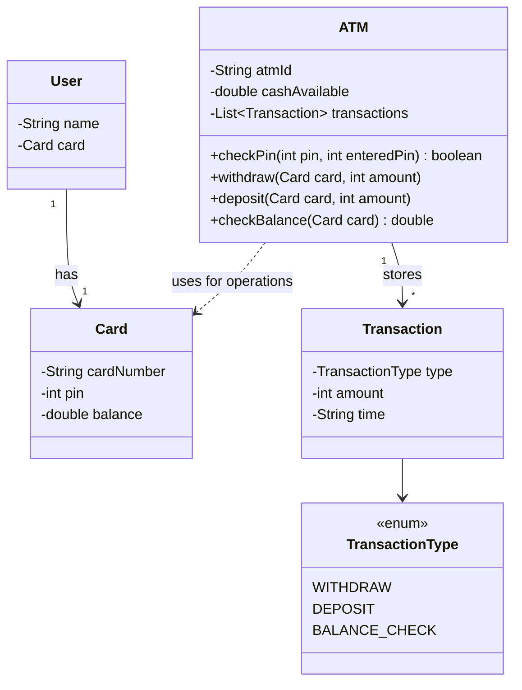
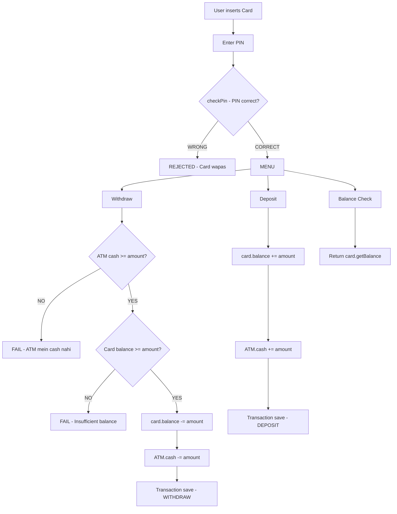

# LLD 07: ATM Machine Design

## Problem:
"Design an ATM Machine" — card daalo, PIN enter, withdraw/deposit/balance check.

## Requirements:
- User card daale → PIN verify
- Balance check kare
- Cash withdraw kare (ATM + card balance check)
- Cash deposit kare
- Transaction history maintain

## Classes banaye:

```
1. TransactionType (enum) — WITHDRAW, DEPOSIT, BALANCE_CHECK
2. Card                   — cardNumber, pin, balance
3. User                   — name, Card
4. Transaction            — type, amount, time
5. ATM                    — atmId, cashAvailable, List<Transaction>
```

## Key Methods:

**ATM.checkPin(pin, enteredPin):**
```
PIN match? → true/false. Simple.
```

**ATM.withdraw(card, amount):**
```
Step 1: ATM mein itna cash hai? (cashAvailable >= amount)
        NAHI → return (ATM mein cash nahi)
Step 2: Card mein itna balance hai? (card.balance >= amount)
        NAHI → return (insufficient balance)
Step 3: Dono haan →
        card.balance ghatao
        ATM cashAvailable ghatao
        Transaction save karo
```

**ATM.deposit(card, amount):**
```
card.balance badhao
ATM cashAvailable badhao
Transaction save karo
```

**ATM.checkBalance(card):**
```
card.getBalance() return. Bas.
```

## Flow:

```
User → Card daale → PIN enter
  → checkPin() → sahi? → menu dikhe
    → Withdraw → withdraw(card, amount)
      → ATM cash check → Card balance check → dono ghatao → Transaction save
    → Deposit → deposit(card, amount)
      → dono badhao → Transaction save
    → Balance → checkBalance(card) → print
  → PIN galat? → reject
```

## Galtiyan jo hui:
1. **bool likha boolean ki jagah** — Java mein boolean hota, bool nahi (C++ ka hai)
2. **Transaction mein time int rakha** — "now" String diya → type mismatch. String mein badla.
3. **Transaction save bhool gaya** — withdraw/deposit mein transactions.add() zaroori

## Ek Line Mein:
> ATM = **"PIN check. Withdraw = ATM cash + card balance dono check + dono ghatao. Deposit = dono badhao. Transaction save."**

---

## VISUALIZE

### Analogy: Real ATM Machine

```
Soch tu SBI ATM gaya.
Card daala → machine ne pucha PIN daalo.
PIN sahi → menu aaya (Withdraw / Deposit / Balance).
Withdraw:
  ATM sochta — mere paas itna cash hai? (ATM cash check)
  Phir sochta — iske account mein itna hai? (Card balance check)
  Dono haan → paisa nikla, dono ghat gaye, receipt mili (Transaction).
Deposit:
  Paisa daala → card balance badha, ATM cash badha, receipt mili.
Balance:
  Card ka balance dikha diya. Bas.
```

### ATM Flow

```
  ┌──────────┐
  │   User   │
  └────┬─────┘
       │
       ↓
  ┌──────────────┐
  │  Card daalo   │
  │  (cardNumber) │
  └────┬──────────┘
       │
       ↓
  ┌──────────────┐     WRONG    ┌──────────────┐
  │  PIN enter    │────────────→│   REJECTED   │
  │  checkPin()   │             │   Card wapas │
  └────┬──────────┘             └──────────────┘
       │ CORRECT
       ↓
  ┌──────────────────────────────────────────┐
  │              MENU                         │
  │                                           │
  │   ┌──────────┐  ┌─────────┐  ┌────────┐  │
  │   │ Withdraw │  │ Deposit │  │Balance │  │
  │   └────┬─────┘  └────┬────┘  └───┬────┘  │
  │        │              │           │        │
  └────────┼──────────────┼───────────┼────────┘
           │              │           │
           ↓              ↓           ↓
      (see below)    (see below)  card.getBalance()
```

### Withdraw Checks (2 gates)

```
  withdraw(card, amount=3000)
       │
       ↓
  ┌────────────────────────────┐
  │  GATE 1: ATM Cash Check    │
  │  ATM cash = 50000          │
  │  50000 >= 3000?  YES       │
  └──────────┬─────────────────┘
             │
             ↓
  ┌────────────────────────────┐
  │  GATE 2: Card Balance Check│
  │  Card balance = 10000      │
  │  10000 >= 3000?  YES       │
  └──────────┬─────────────────┘
             │ DONO PASS
             ↓
  ┌────────────────────────────────────────────────┐
  │  EXECUTE:                                       │
  │  card.balance   = 10000 - 3000 = 7000          │
  │  ATM.cash       = 50000 - 3000 = 47000         │
  │  Transaction saved: WITHDRAW, 3000, "now"       │
  └─────────────────────────────────────────────────┘

  FAIL CASES:
  ┌────────────────────────┐
  │ ATM cash = 2000        │
  │ amount   = 3000        │
  │ 2000 < 3000 → FAIL    │
  │ "ATM mein cash nahi"   │
  └────────────────────────┘

  ┌────────────────────────┐
  │ Card balance = 2000    │
  │ amount       = 3000    │
  │ 2000 < 3000 → FAIL    │
  │ "Insufficient balance" │
  └────────────────────────┘
```

### Transaction Save Visual

```
  ATM.transactions list:

  ┌──────────────────────────────────────────────┐
  │  List<Transaction>                            │
  │                                               │
  │  ┌─────────────────────────────────────────┐  │
  │  │ [0] WITHDRAW  │ amount: 3000 │ time: now│  │
  │  ├─────────────────────────────────────────┤  │
  │  │ [1] DEPOSIT   │ amount: 5000 │ time: now│  │
  │  ├─────────────────────────────────────────┤  │
  │  │ [2] WITHDRAW  │ amount: 1000 │ time: now│  │
  │  └─────────────────────────────────────────┘  │
  │                                               │
  │  Har withdraw/deposit ke baad → add hota hai  │
  └───────────────────────────────────────────────┘
```

---

## MERMAID DIAGRAMS

### Class Diagram



### Flow: Card --> PIN Check --> Menu --> Withdraw/Deposit/Balance



---

## MERA CODE (Arpan ka handwritten):

```java
import java.util.*;

// --- ENUMS ---
enum TransactionType{
    WITHDRAW, DEPOSIT, BALANCE_CHECK;
}

// --- CLASSES ---
// Card: cardNumber, pin, balance
class Card{
    private String cardNumber;
    private int pin;
    private double balance;

    public Card(String cardNumber, int pin, double balance) {
        this.cardNumber = cardNumber;
        this.pin = pin;
        this.balance = balance;
    }

    public String getCardNumber() { return cardNumber; }
    public int getPin() { return pin; }
    public double getBalance() { return balance; }
    public void setBalance(double balance) { this.balance = balance; }
}

// User: name, Card
class User{
    private String name;
    private Card card;

    public User(String name, Card card) {
        this.name = name;
        this.card = card;
    }

    public String getName() { return name; }
    public Card getCard() { return card; }
}

// Transaction: type, amount, time
class Transaction{
    TransactionType type;
    int amount;
    String time;

    public Transaction(TransactionType type, int amount, String time) {
        this.type = type;
        this.amount = amount;
        this.time = time;
    }

    public TransactionType getType() { return type; }
    public int getAmount() { return amount; }
    public String getTime() { return time; }
}

// ATM: atmId, cashAvailable
class ATM{
    private String atmId;
    private double cashAvailable;
    private List<Transaction> transactions;

    public ATM(String atmId, double cashAvailable) {
        this.atmId = atmId;
        this.cashAvailable = cashAvailable;
        this.transactions = new ArrayList<>();
    }

    public String getAtmId() { return atmId; }
    public double getCashAvailable() { return cashAvailable; }
    public List<Transaction> getTransactions() { return transactions; }

    boolean checkPin(int pin, int enteredPin){
        return pin == enteredPin;
    }

    void withdraw(Card card, int amount){
        if(amount > cashAvailable){
            return;
        }
        else if(card.getBalance() < amount){
            return;
        }
        else if(cashAvailable >= amount && card.getBalance() >= amount){
            card.setBalance(card.getBalance() - amount);
            cashAvailable = cashAvailable - amount;
            transactions.add(new Transaction(TransactionType.WITHDRAW, amount, "now"));
        }
        return;
    }

    void deposit(Card card, int amount){
        card.setBalance(card.getBalance() + amount);
        cashAvailable = cashAvailable + amount;
        transactions.add(new Transaction(TransactionType.DEPOSIT, amount, "now"));
        return;
    }

    double checkBalance(Card card){
        return card.getBalance();
    }
}

// --- MAIN ---
class Main {
    public static void main(String[] args) {
        Card card = new Card("1234-5678-9012", 1234, 10000);
        User user = new User("Arpan", card);
        ATM atm = new ATM("ATM-001", 50000);

        System.out.println("PIN correct? " + atm.checkPin(card.getPin(), 1234));
        System.out.println("PIN correct? " + atm.checkPin(card.getPin(), 9999));
        System.out.println("Balance: " + atm.checkBalace(card));

        atm.withdraw(card, 3000);
        System.out.println("After withdraw 3000 → Balance: " + card.getBalance() + ", ATM cash: " + atm.getCashAvailable());

        atm.withdraw(card, 20000);
        System.out.println("After withdraw 20000 → Balance: " + card.getBalance() + " (should be same — failed)");

        atm.deposit(card, 5000);
        System.out.println("After deposit 5000 → Balance: " + card.getBalance() + ", ATM cash: " + atm.getCashAvailable());

        System.out.println("Final balance: " + atm.checkBalace(card));
        System.out.println("Total transactions: " + atm.getTransactions().size());
        for (Transaction t : atm.getTransactions()) {
            System.out.println("  " + t.getType() + " → " + t.getAmount());
        }
        System.out.println("ATM Machine Done!");
    }
}
```

---

## Ek Line Mein:
> ATM = **"PIN check. Withdraw = ATM cash + card balance dono check + dono ghatao. Deposit = dono badhao. Transaction save."**
