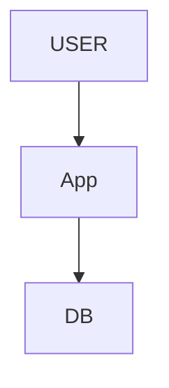
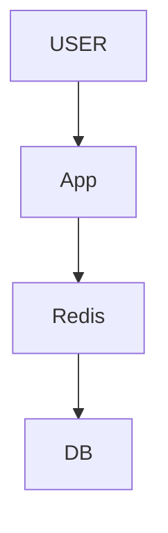
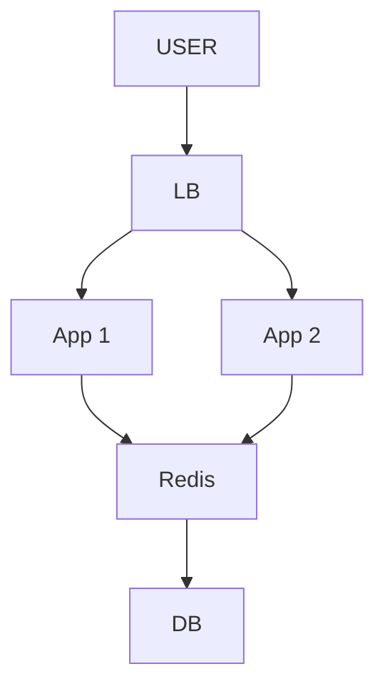
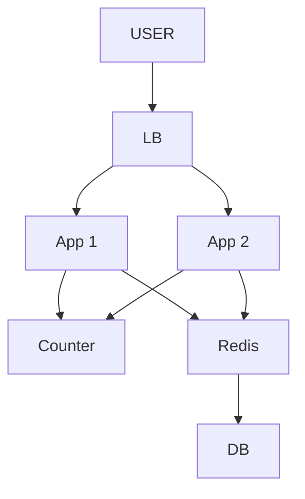
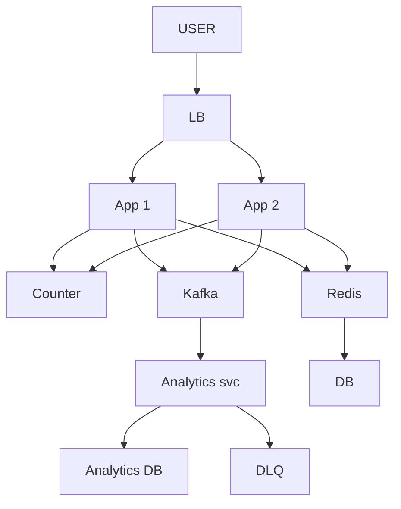
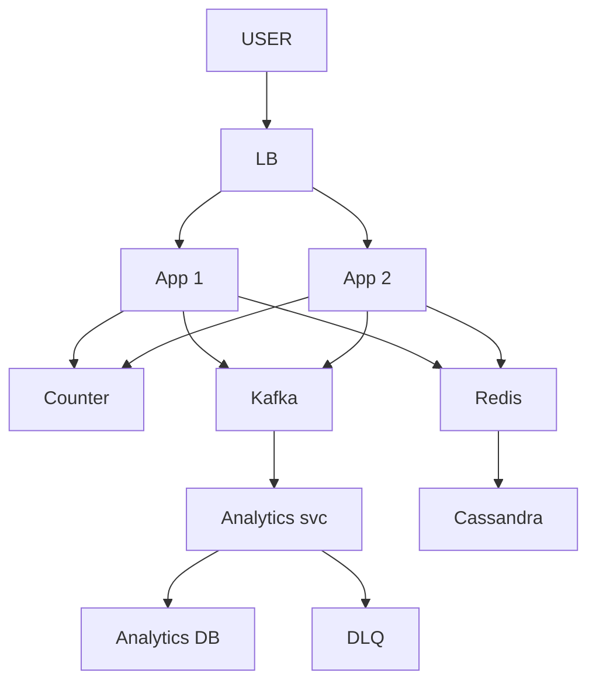
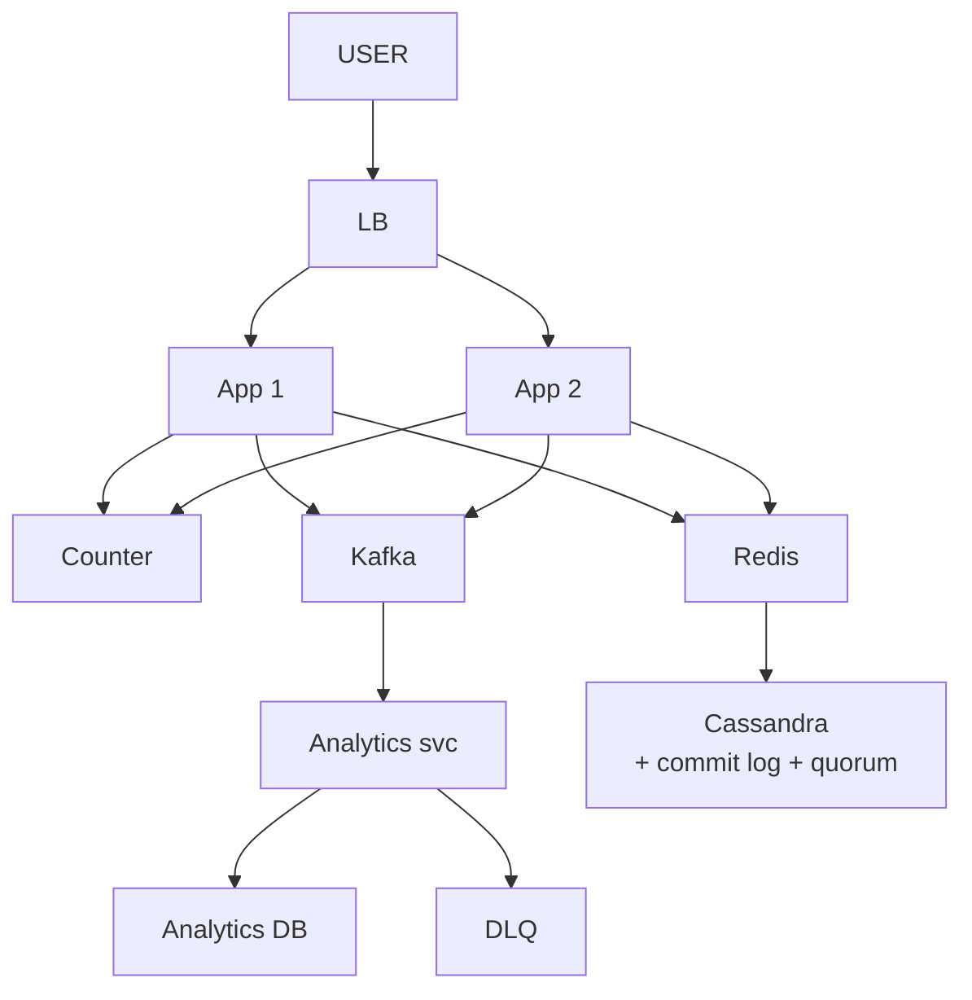
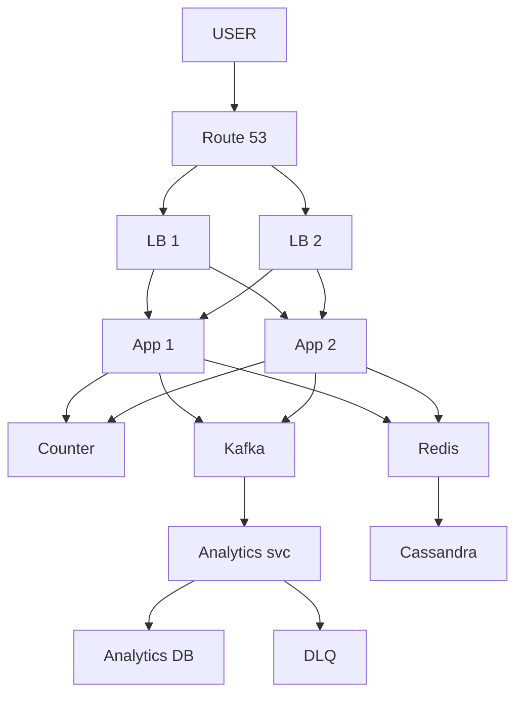
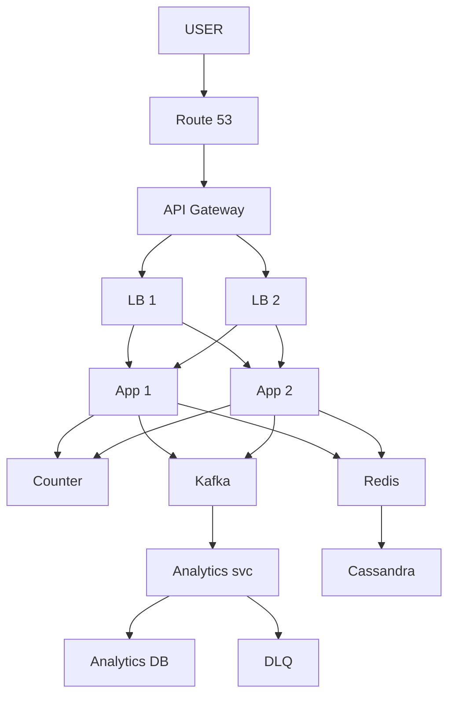

# URL Shortener

> Long URL -> chhota 7 char code banao · short pe click -> original pe REDIRECT (302).
> Is design ka dil: **chhota UNIQUE code** + **redirect tez** (read 100:1).

---

## TASVEER (ByteByteGo / Alex Xu · CC BY-NC-ND 4.0)


Source: [Explaining 5 Unique ID Generators](https://bytebytego.com/guides/explaining-5-unique-id-generators-in-distributed-systems/)
(code kahan se aaye — UUID / Snowflake / DB auto-increment / range. Code = ID ka base62.)

---

## SHURU — poocho + numbers

```
POOCHO:  "Link banana, redirect, analytics, custom alias, expiry — kis pe focus karein?"
         -> banana + redirect. Analytics dashboard / custom alias scope se bahar (USSE poocho, khud mat kaato)
         "~100M link / din, read:write 100:1 maan raha hoon — theek?"
         pata na ho -> "ye maine use nahi kiya" bolna THEEK, wo khud bhar dega (be open about limits)

FR:      long -> short banao · short -> original redirect
NFR:     redirect p99 < 200ms · hamesha up · read >> write · code UNIQUE
         (in 4 pe ungli rakh ke: "har faisla inhi me se kisi se justify karunga")

NUMBERS: writes 100M / din = 10^8 / 10^5 = ~1,000 / sec      (1 din ~ 10^5 sec)
         reads  100x = ~1 lakh / sec
         row ~500 B · 5 saal = 100M x 365 x 5 = ~180 billion row = ~90 TB
         62^7 = ~3.5 trillion -> 7 char kaafi (100+ saal)

HAR NUMBER SE FAISLA:  100:1 -> CACHE · 90 TB -> SHARD · 7 char -> lambai ka jhagda khatam
         modest maano (1 billion URL = ~500 GB) -> ek DB me fit, shard NAHI. farak sirf assumption ka.
         "Asli Bitly ~500 GB hai, single DB me aa jaata — bina zaroorat shard mat karo."
         scaling ka poora ganit ABHI nahi ("you don't necessarily have to go into the details of scaling at this point")
         estimate SKIP mat karo (Zomato me ek banda isi pe reject), par exact ganit me mat atko.
         ⚠ "100M/din" maana to poora per-DAY raho (3 TB wala galat jawab = per-month maan liya tha)

KYUN:    Twitter / SMS limit · marketing tracking · QR / print · saaf dikhna
```

---

## DABBA 0 — sabse simple

```
SOLUTION: App code banaye, DB me save · click pe DB se nikaal ke redirect
```


---

## DIKKAT 1 — har click DB pe, redirect 200ms se tez chahiye

```
DIKKAT:   har click seedha DB pe -> 1 lakh read / sec, DB pe bojh, redirect slow.

SOLUTION: (1) CACHE (Redis), cache-aside: pehle Redis, na mile to DB se lo aur Redis me daal do.
              Read >> write, to lagbhag saare click Redis se nikalte.
          (2) Redis TTL = link ki expiry (warna expire hua link bhi chalta rahega).
          (3) DB me shortCode = primary key -> miss pe bhi lookup tez.

NAYA:     Redis

KYUN YE:  read replica kyun nahi -> replica bhi DB hai, disk se padhta (ms), Redis RAM se (<1ms)
          har App me apna local cache kyun nahi -> har box ki alag copy, link badla/expire hua to kahin purana
```
```
BOARD PE: read : write = 100 : 1 -> ~95% read Redis se

POOCHEGA: "What if the cache goes down?"
DHYAAN:   95% read seedha DB pe -> DB bhi gir sakta. "kuch nahi hoga" mat bolna
BOL:      "Redis runs as a replicated cluster. If it still goes down, the DB takes the load, so I shed load
           and let only one request rebuild a hot key, not a thousand at once."

AGLA SAWAAL (tere jawab se):
  "Cache me kya rakhoge, sab 180 billion link?"
   -> nahi, sirf HOT link. LRU: jagah bhari to sabse kam-chhua link nikalo. Miss pe DB se, phir cache me
  "Link delete / expire ho gaya par cache me pada hai?"
   -> TTL = expiry, apne aap gayab. Delete pe cache key bhi DEL (pehle DB, phir cache)
```


---

## DIKKAT 2 — ek App 1 lakh / sec nahi jhel raha, aur wo gira to site band

```
DIKKAT:   ek App box pe saara bojh, aur wahi gira to poori site band (SPOF)

SOLUTION: App ke kai box lagao, aage LOAD BALANCER. App STATELESS rakho (saara data Redis / DB me), taaki
          koi bhi box koi bhi request le sake.

NAYA:     LB
BADLA:    App ek se DO — bojh bat gaya, ek gire to doosra chale (asal me zaroorat jitne, diagram me 2)

KAISE:    LB har request ko baari-baari (round-robin) ya jiske paas kam connection (least-conn) bhejta
          har ~5 sec health check (GET /health) -> jawab nahi = us box ko list se bahar, theek hua to wapas
KYUN YE:  ek bada server (vertical) kyun nahi -> had hai + wahi ek SPOF; chhote kai box = bojh bhi bata, ek gire chalta
```
```
AGLA SAWAAL (tere jawab se):
  "Stateless kyun zaroori?"
   -> agar session App ki RAM me ho to agli request doosre box pe gayi = user ka data gayab
      sab Redis / DB me -> koi bhi box koi bhi request le sake
  "Ek box dheema hai (mara nahi), LB ko kaise pata?"
   -> health check + response time / error rate dekh ke; least-conn khud kam bhejta
```


---

## DIKKAT 3 — ab kai App hain, do App ek hi code bana denge

```
DIKKAT:   kai App box, har ek apna counter -> do box ek hi number se code bana dete -> COLLISION.

SOLUTION: (1) RANGE ALLOCATION: COUNTER service (ZooKeeper / DB table) har App ko numbers ki ALAG range
              deti -> takraav ho hi nahi sakta. Counter se baat sirf range khatam hone pe.
          (2) Number -> BASE62 -> 7 char ka code (detail neeche POOCHE TO).

NAYA:     Counter (har App ko number ki range dene wala, aksar ZooKeeper / DB table)
```
```
BOARD PE: bina range: S1 counter=5, S2 counter=5 -> dono ne "6" banaya
          range se: App-1 ko 1..1000 · App-2 ko 1001..2000

POOCHEGA: "That server crashed at 400 — what about the rest of its range?"
DHYAAN:   pehle dohra lo KIS box ka crash: "app server jiske paas 1-1000 thi, sahi?" (Redis ka jawab alag)
BOL:      "The restarted server asks for a new range, so 401 to 1000 are wasted. I accept that on purpose —
           3.5 trillion codes, a few thousand lost is nothing. Making every number crash-proof would need
           coordination on every request and kill the benefit of ranges."

AGLA SAWAAL (tere jawab se):
  "Counter service khud gir gaya?"
   -> Apps ke paas abhi ki range bachi hai (1000 number), kaam chalta rehta; tab tak counter ka backup (2 node) uth jaata
  "Code se pata chal jaayega kitne link bane (sequential)?"
   -> haan, ye keemat hai. Chahiye to number ko shuffle / XOR karke base62 karo, phir bhi unique
```


---

## DIKKAT 4 — har click pe analytics likhna hai

```
DIKKAT:   har click pe analytics likhna hai; usi request me likha to redirect slow — aur yahan latency hi
          sab kuch hai

SOLUTION: click ka event KAFKA me daal do aur turant 302 de do. Analytics service peeche se aaram se
          padhe. Koi event baar-baar fail ho to DLQ me.

NAYA:     Kafka · Analytics svc · Analytics DB · DLQ

KAISE:    Kafka = disk pe append-only log. App event ko topic ke end me likh deta (tez, wait nahi)
          Analytics svc apni jagah (offset) yaad rakhta, wahan se padhta; crash hua to wahin se dobara
          kai baar fail -> event DLQ topic me daalo, aage badho (ek kharab event poori line na roke)
KYUN YE:  App ke andar async thread -> App crash = memory ke event gaye
          SQS bhi chalta; Kafka isliye ki click bahut zyada + replay chahiye (naya report purane clicks pe)
```
```
AGLA SAWAAL (tere jawab se):
  "Kafka hi down hai to redirect rukega?"
   -> nahi, redirect pehle. Event bhejna fail -> chhota local buffer / chhod do (analytics thoda kam, redirect nahi rukta)
  "Ek click do baar gina gaya?"
   -> Kafka at-least-once -> event pe clickId, Analytics svc duplicate skip kare
```


---

## DIKKAT 5 — 5 saal ka ~90 TB ek machine me nahi aayega

```
DIKKAT:   5 saal ka ~90 TB ek machine me nahi aayega, aur wo machine mari to sab gaya.

SOLUTION: (1) SHARD by shortCode -> jagah + likhne ka load bant-ta.
          (2) Har shard ki 3 REPLICA, alag AZ me -> bachav + padhne ka load. (Replica likhne ka load nahi baantti.)
          (3) Naya node jode -> consistent hashing, thodi keys hi khiskti.

BADLA:    DB -> Cassandra (shard by shortCode + 3 replica)

KAISE:    consistent hashing = ek gol RING. Har node ring pe kisi jagah, har shortCode ka hash bhi ring pe
          key clockwise chal ke jo pehla node mile, uska. Naya node juda -> sirf uske aur pichle node ke
          beech wali keys khiski
KYUN YE:  hash % N -> N=3 se 4 kiya to lagbhag har key ka node badla = poora data shift
```
```
BOARD PE: naya node -> sirf ~K/N keys hilti (K = keys, N = nodes)

POOCHEGA: "The database is too big / takes too many writes. What do you do?"
DHYAAN:   "write replica" NAHI — write scale = SHARDING. key = shortCode (country / date = skew)
BOL:      "I shard by short code, so every redirect goes to exactly one shard, and keep three replicas
           of each shard in different zones."

AGLA SAWAAL (tere jawab se):
  "Ek node pe zyada keys aa gayi (ring pe bura bata)?"
   -> virtual nodes: har machine ring pe 100-200 jagah baithti -> load barabar
  "Ek link viral (hot key) -> ek shard garam?"
   -> wo Redis se hi serve hota (cache), shard tak kam aata
```


---

## DIKKAT 6 — write ho rahi thi, beech me ek replica node gira — data gaya?

```
DIKKAT:   likh hi raha tha aur ek replica node gir gaya -> likha hua data khona nahi chahiye.

SOLUTION: (1) DB har write pehle LOG me disk pe likhta (Cassandra commit log / Postgres WAL), phir table me.
              Node gira -> uthte hi log padh ke wapas.
          (2) Write "done" tabhi jab zyada replica haan bolein (QUORUM) -> ek gira to bhi data safe.

NAYA:     koi dabba nahi — Cassandra ke andar log + quorum
```
```
BOARD PE: 3 replica me se 2 ne haan bola = done -> 1 gira, data 2 pe phir bhi hai

POOCHEGA: "What happens if a DB node goes down mid-write?"
DHYAAN:   KAFKA nahi — Kafka extra dabba hai, DB ka kaam DB ka log karta
BOL:      "The DB writes to its commit log before applying, and I ack writes on quorum, so losing one
           node doesn't lose committed data. Redirects keep working from Redis meanwhile."

AGLA SAWAAL (tere jawab se):
  "Quorum me 3 me se 2 kyun, sab 3 kyun nahi?"
   -> 3 ka intezaar = ek dheema node sabko dheema kare; 2 = 1 gire tab bhi likh sakte
  "2 node gir gaye to?"
   -> quorum nahi bana -> write fail (ya ONE level pe likho, risk ke saath). Tab tak read Redis se
```


---

## DIKKAT 7 — naya link banaya, turant click -> 404

```
DIKKAT:   naya link banaya, turant click -> 404, kyunki copy abhi replica tak pahunchi hi nahi.

SOLUTION: (1) Link banate hi Redis me bhi daal do -> click Redis se mil jaata.
          (2) Ya QUORUM write + QUORUM read -> kam se kam ek node common -> taaza value.
              (Cassandra leaderless hai, primary hota hi nahi.)

NAYA:     koi dabba nahi

KAISE (quorum kyun taaza deta):
          N=3 copy · write W=2 pe done · read R=2 se padho -> W + R = 4 > 3
          matlab read wale 2 node me kam se kam 1 wahi hai jisme naya write hai -> wahi latest value
```
```
POOCHEGA: "The user created a link but gets 404 / old value. Why?"
BOL:      "Replication lag. The write path also puts the link in Redis, and with quorum reads and
           writes the read always sees the latest write."

AGLA SAWAAL (tere jawab se):
  "Quorum read dheema to nahi?"
   -> haan, 2 node se jawab. Isliye pehle Redis: naya link write pe hi cache me, read wahin se
  "R=1 rakh do (tez), phir?"
   -> W=2 + R=1 = 3, overlap pakka nahi -> purana dikh sakta (yahi 404 wali dikkat)
```


---

## DIKKAT 8 — LB khud gir gaya

```
DIKKAT:   App, Redis, DB sab zinda, par traffic dene wala LB hi mar gaya -> site DOWN.

SOLUTION: (1) Do LB + aage DNS (Route 53) health-check: mara LB hata ke doosre pe bhejo.
              (Sirf do rakhna kaafi nahi, koi dekhne wala chahiye jo traffic mode.)
          (2) Poora region gaya -> Route 53 doosre region pe. Data async copy, to aakhri kuch link kho sakte.

NAYA:     Route 53
BADLA:    LB ek se DO — ek mare to Route 53 doosre pe bheje (diagram me 2)

KYUN YE:  DNS TTL ki wajah se failover turant nahi (TTL 60 sec -> user kuch der purane LB pe)
          isliye cloud me LB khud multi-AZ managed (AWS ALB) hota; floating IP (keepalived) = data center me
```
```
POOCHEGA: "What if a whole region goes down?"
BOL:      "Inside a region I'm multi-AZ. If the region dies, Route 53 health checks send users to another
           region; data is copied there asynchronously, so a few of the newest links may be lost."

AGLA SAWAAL (tere jawab se):
  "Route 53 ko kaise pata LB mara?"
   -> har ~30 sec health check, 3 baar fail = unhealthy -> DNS jawab me us LB ka IP hata deta
  "Region switch me data?"
   -> doosre region me async copy -> aakhri kuch second ke naye link gaye (maana hua)
```


---

## DIKKAT 9 — ek bande ne script se raat me 10 lakh link bana diye

```
DIKKAT:   ek bande ne script se raat me 10 lakh link bana diye -> counter ranges khatam, DB me kachra.

SOLUTION: (1) RATE LIMIT per user / IP / API key, EK jagah = API GATEWAY (har App me alag = alag ginti).
              Auth aur routing bhi gateway pe.
          (2) Long URL ko malware / phishing list se milao; edge pe WAF bots / bad IP roke.
          (Poora rate limiter = 02_rate_limiter.)

NAYA:     API Gateway
```
```
POOCHEGA: "How do you stop abuse?"
BOL:      "Rate limiting per user and IP at the API gateway, auth there too, a WAF at the edge, and I
           check long URLs against a malware / phishing list before shortening."

AGLA SAWAAL (tere jawab se):
  "Gateway me limit ginti kahan rakhoge (kai gateway box)?"
   -> shared Redis counter (INCR + TTL) -> sab box ek hi ginti dekhein (poora 02_rate_limiter)
  "Bot alag IP se aa raha?"
   -> IP pe nahi, API key / user_id pe limit + WAF bot rules
```


---

## 10x SCALE — har dabba alag

```
Route 53       -> GEO-ROUTING, paas wala region
App            -> stateless -> box badhao · READ aur WRITE App alag (100:1 -> read 20, write 2;
                  ek gire to doosra chale)
Redis          -> sab URL nahi samaate -> HOT rakho, COLD nikaalo (LRU + TTL)
                  viral song / WhatsApp forward = HOT -> Redis me · log dekhna band = COLD -> bahar,
                  Cassandra me to hai, agli miss pe wapas
Cassandra      -> SHARD by shortCode + read replica
Counter        -> coordinator khud SPOF -> 2 node (active-passive); range waise bhi tolerate karti
Kafka          -> partition badhao

SHARD KEY = shortCode, GEO NAHI:
   read hamesha code se (GET /abc123) -> shortCode shard = seedha ek shard
   geo shard -> code kis region me? pata nahi -> saare shard poocho (scatter-gather)
   geo ka kaam = LATENCY (geo replication), jagah baantna nahi. dono saath chal sakte.

POOCHEGA: "How would you scale this to 10x?"           -> user ka raasta chalo, pehle jo toote wahi ilaaj
POOCHEGA: "What's the single point of failure?"        -> har box pe "ye gira to?"
POOCHEGA: "How do you know it's working?"              -> p99 · error rate · Kafka lag · alert
```

---

## POOCHE TO (deep-dive)

Jo wo poochhe wahi kholo — sab ek saath mat bol dena.

```
API:      BANANA = POST /api/shorten { long_url, custom_code? } -> { short_url, expires_at }
          LAANA  = GET /abc123 -> 302 Found + Location: <long_url>
          (ulta mat bolna: banana POST, laana GET)

302 vs 301:  301 = permanent, browser cache -> server tak aata hi nahi -> click count gaya, expiry toot-ti
             302 = har baar server -> analytics chalta (bit.ly 302)

ROW:      short_code (partition key) · long_url · created_at · expires_at
          GET /abc123 -> seedha ek partition -> point read

KAUNSA DB:  join nahi · transaction nahi · INSERT ek baar + SELECT WHERE short_code = ? · 90 TB
            -> Cassandra / DynamoDB (key-value at scale)
            MySQL relational ~1B tak chal jaata · Mongo document ~10B tak · Cassandra wide-col / DynamoDB K-V
            trillions = best · Redis = sirf cache layer, hamesha saath
            "NoSQL powerful hai" MAT bolna — ACCESS PATTERN + SCALE wajah hai (ye write-heavy nahi, read-heavy)

CODE KAISE:
   MD5 / random   -> collision -> har baar "exists?" DB read   (length 6-7)
   counter        -> collision nahi, par length VARIABLE
   counter+base62 -> repeat kabhi nahi -> collision nahi, check nahi   <- YAHI
   counter hai to code RANDOM nahi
   base62: 0-9 (10) + a-z (26) + A-Z (26) · baar-baar /62, remainder ULTA padho
           1,000,000,000 -> "15FTGg" (6 char) · 125 -> "21"
   WORD-FREEZE FALLBACK (term bhool jaao -> CONCEPT bol do, atko mat):
      "MD5 / hash" bhoola -> "long URL ka ek HASH lo, uske pehle 7 character"
      "Base62" bhoola     -> "62 character hain (a-z, A-Z, 0-9) — ID ko un 62 me ENCODE, chhoti string"
      "Counter" bhoola    -> "ek global auto-increment ID"
      interviewer ko WORD nahi, SAMAJH chahiye — concept bolo, naam wo khud bol dega

DISTRIBUTED COUNTER:  DB atomic (har write, slow) · Redis INCR (har write) · RANGE (per batch, 1000x kam) <- YAHI

CUSTOM CODE:  validate (lambai · reserved nahi · gaali nahi · unique) -> conflict = 409
              reserved: admin · api · login · settings · help · docs · pricing · blog
              RACE: do log same code -> dono "available?" haan -> DUPLICATE
                    -> DB UNIQUE constraint / INSERT IF NOT EXISTS -> ek ko 409

GOTCHA:   cache TTL = link expiry (SET ... EX) · counter range me lo, har request pe nahi ·
          shortCode UNIQUE constraint = safety net (pehle "exists?" padhna nahi)
```

---

## AAKHRI DABBA + WRAP

```
Route 53 = DNS + health-check + region · API Gateway = rate limit + auth · LB = 2 copy (ek mare, doosra chale) · App = stateless
Counter = range + base62 · Redis = 95% read, TTL = expiry · Cassandra = shard by shortCode + 3 replica + quorum
Kafka = analytics async, DLQ
```
```
READ (click):  LB -> App -> Redis hit? -> 302 · miss -> Cassandra -> Redis me daalo -> 302 · async -> Kafka
WRITE (naya):  LB -> App -> Counter range + base62 (123456 -> "w7e") -> Redis + Cassandra -> short URL wapas
```
```
BOL: "Short code is a counter in base62, with ranges handed to each server so there's no collision.
      Reads are 100 to 1, so Redis serves most redirects; Cassandra sharded by short code holds the
      rest with three replicas. Redirect is a 302 and click analytics go async through Kafka. Route 53
      and two load balancers remove the single points of failure, and the gateway rate-limits abuse.
      Next I'd add custom aliases, expiry cleanup and geo-distribution."
```


ARCHETYPE F (infra/component) · CONCEPTS: [ID-gen](../../FOUNDATIONS/13_distributed_id_snowflake.md) · [caching](../../FOUNDATIONS/04_caching.md) · [sharding](../../FOUNDATIONS/06_database_sharding.md) · [← MASTER SHEET](../../00_MASTER_SHEET.md)
