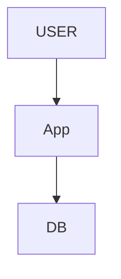
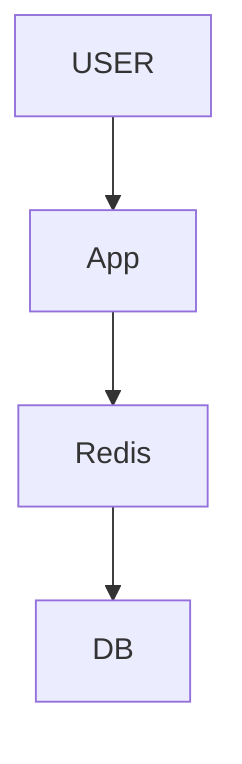
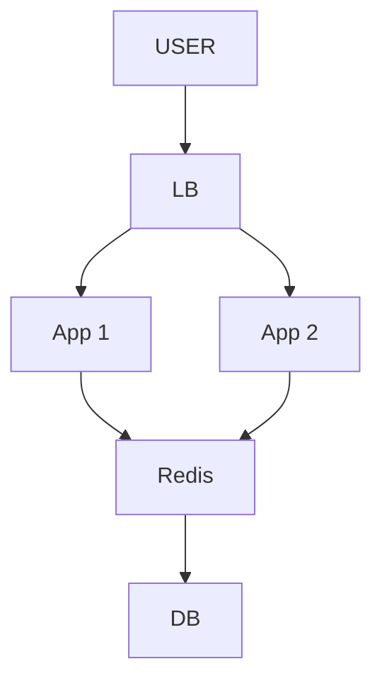
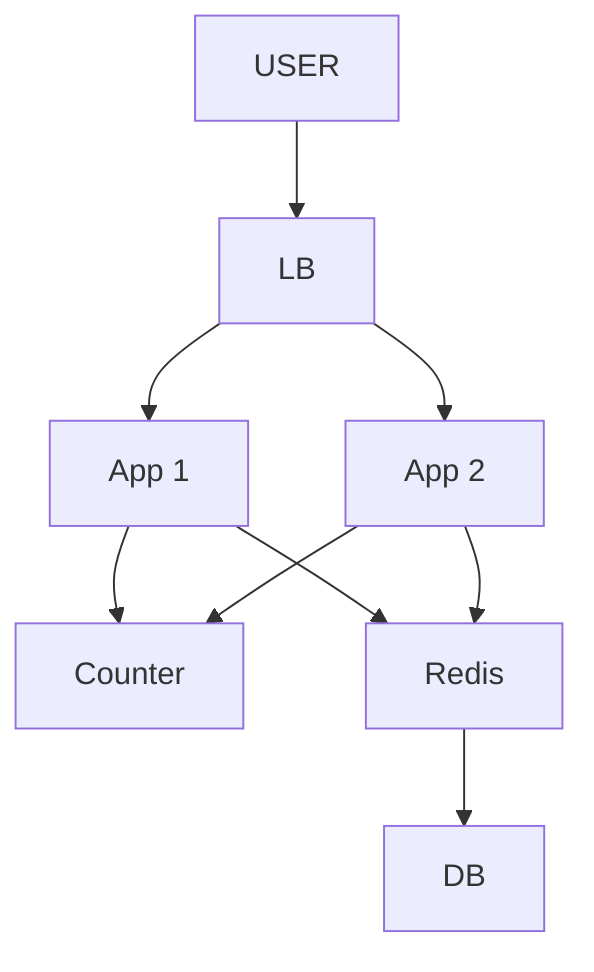
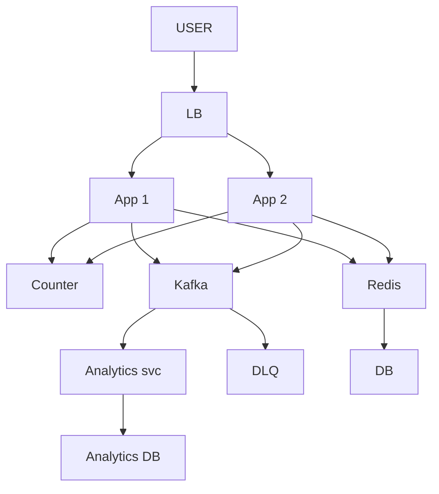
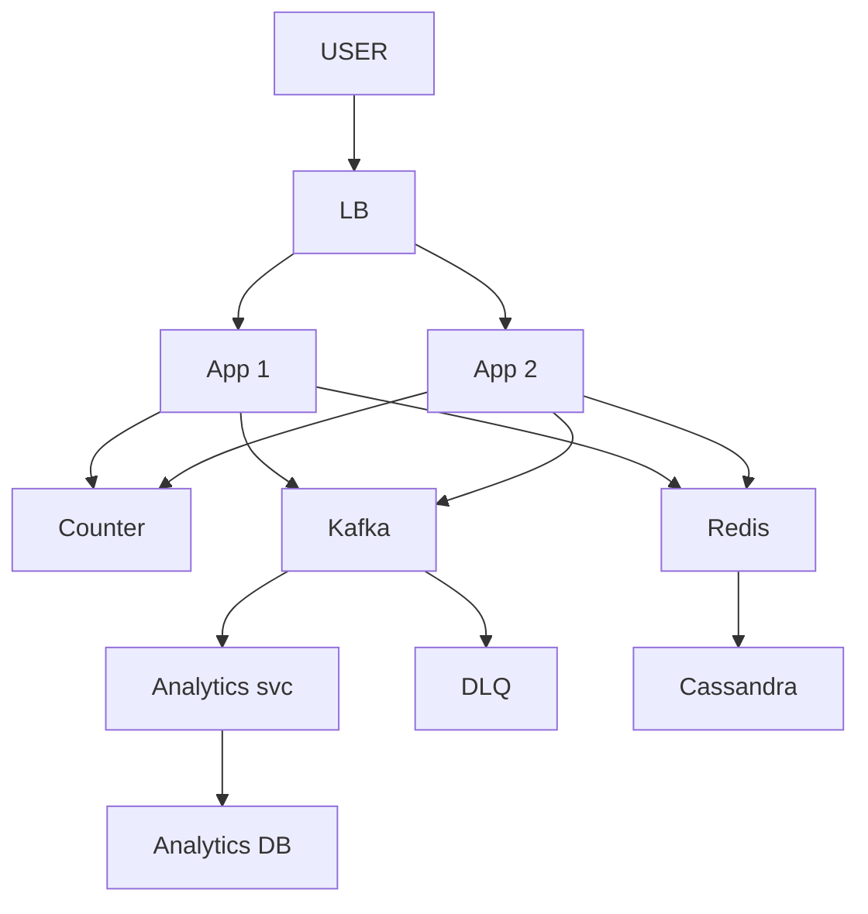
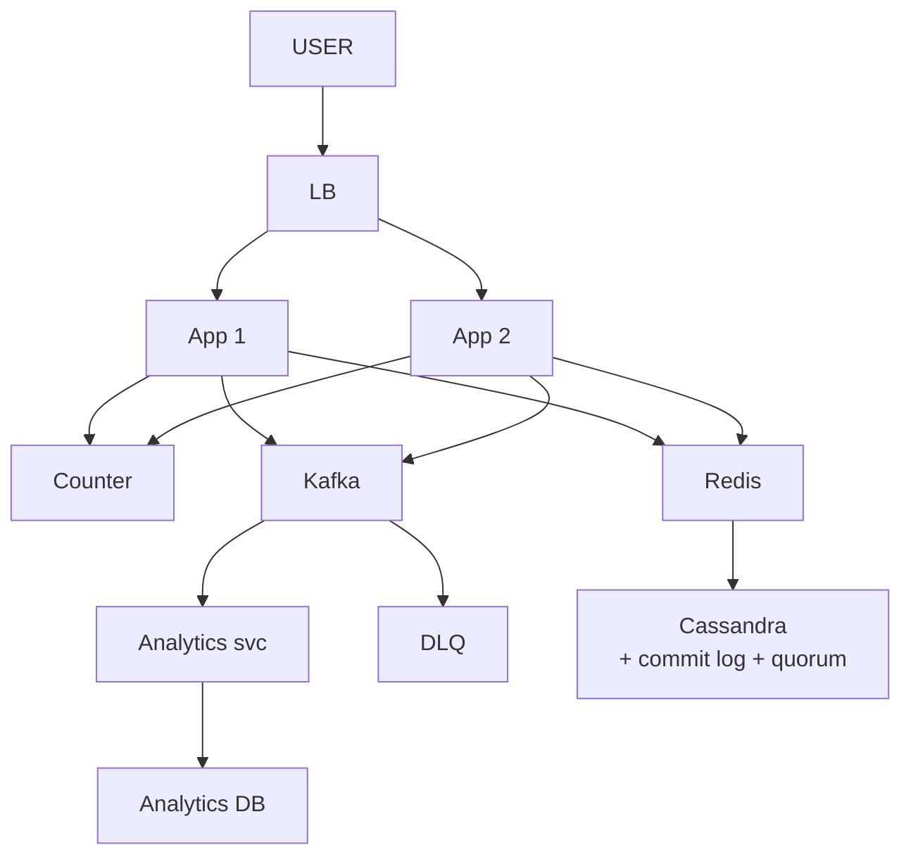
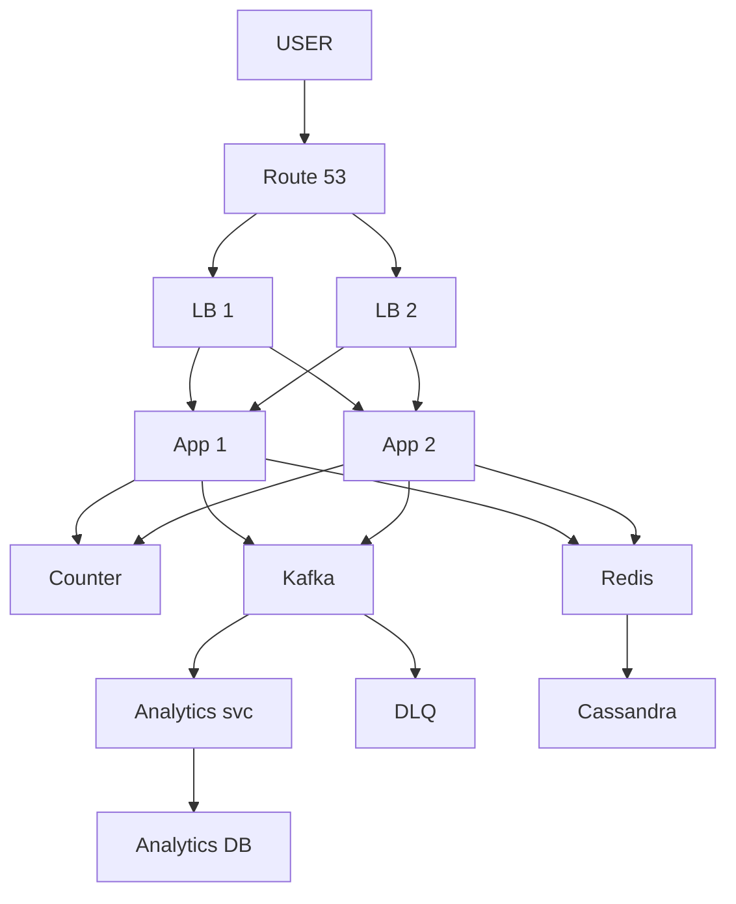
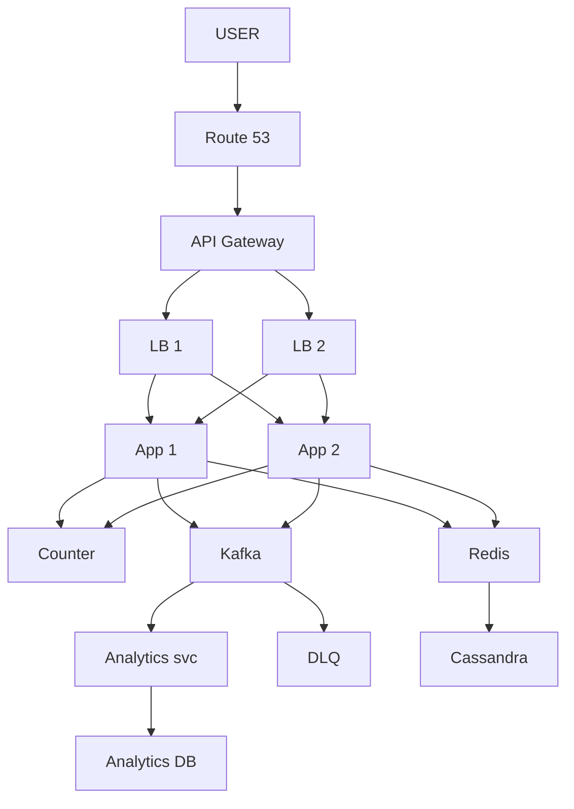

# URL Shortener

> Long URL -> chhota 7 char code banao · short pe click -> original pe REDIRECT (302).
> Is design ka dil: **chhota UNIQUE code** + **redirect tez** (read 100:1).

---

## TASVEER (ByteByteGo / Alex Xu · CC BY-NC-ND 4.0)


Source: [Explaining 5 Unique ID Generators](https://bytebytego.com/guides/explaining-5-unique-id-generators-in-distributed-systems/)
(code kahan se aaye — UUID / Snowflake / DB auto-increment / range. Code = ID ka base62.)

---

## SHURU — poocho + numbers

```
POOCHO:  "Link banana, redirect, analytics, custom alias, expiry — kis pe focus karein?"
         -> banana + redirect. Analytics dashboard / custom alias scope se bahar (USSE poocho, khud mat kaato)
         "~100M link / din, read:write 100:1 maan raha hoon — theek?"
         pata na ho -> "ye maine use nahi kiya" bolna THEEK, wo khud bhar dega (be open about limits)

FR:      long -> short banao · short -> original redirect
NFR:     redirect p99 < 200ms · hamesha up · read >> write · code UNIQUE
         (in 4 pe ungli rakh ke: "har faisla inhi me se kisi se justify karunga")

NUMBERS: writes 100M / din = 10^8 / 10^5 = ~1,000 / sec      (1 din ~ 10^5 sec)
         reads  100x = ~1 lakh / sec
         row ~500 B · 5 saal = 100M x 365 x 5 = ~180 billion row = ~90 TB
         62^7 = ~3.5 trillion -> 7 char kaafi (100+ saal)

HAR NUMBER SE FAISLA:  100:1 -> CACHE · 90 TB -> SHARD · 7 char -> lambai ka jhagda khatam
         modest maano (1 billion URL = ~500 GB) -> ek DB me fit, shard NAHI. farak sirf assumption ka.
         "Asli Bitly ~500 GB hai, single DB me aa jaata — bina zaroorat shard mat karo."
         scaling ka poora ganit ABHI nahi ("you don't necessarily have to go into the details of scaling at this point")
         estimate SKIP mat karo (Zomato me ek banda isi pe reject), par exact ganit me mat atko.
         ⚠ "100M/din" maana to poora per-DAY raho (3 TB wala galat jawab = per-month maan liya tha)

KYUN:    Twitter / SMS limit · marketing tracking · QR / print · saaf dikhna
```

---

## DABBA 0 — sabse simple

```
SOLUTION: App code banaye, DB me save · click pe DB se nikaal ke redirect
```


---

## DIKKAT 1 — har click DB pe, redirect 200ms se tez chahiye

```
DIKKAT:   1 lakh read / sec seedha DB pe -> slow + DB pe bojh

SOLUTION: CACHE (Redis) — cache-aside: pehle Redis, miss -> DB -> Redis me daalo
          read:write 100:1 -> ~95% read Redis se hi
          TTL = link ki expiry (warna expired link bhi serve hota rahega)
          DB me short_code PRIMARY KEY -> miss pe bhi tez lookup

NAYA:     Redis
```

```
POOCHEGA: "What if the cache goes down?"
DHYAAN:   95% read seedha DB pe -> DB bhi gir sakta. "kuch nahi hoga" mat bolna
BOL:      "Redis runs as a replicated cluster. If it still goes down, the DB takes the load, so I shed load
           and let only one request rebuild a hot key, not a thousand at once."
```

---

## DIKKAT 2 — ek App 1 lakh / sec nahi jhel raha, aur wo gira to site band

```
DIKKAT:   ek box pe bojh + wahi SPOF

SOLUTION: App ke kai box, aage LOAD BALANCER
          App STATELESS (sab Redis / DB me) -> koi bhi box koi bhi request le

NAYA:     LB
BADLA:    App ek se DO — bojh bat gaya, ek gire to doosra chale (asal me zaroorat jitne, diagram me 2)
```


---

## DIKKAT 3 — ab kai App hain, do App ek hi code bana denge

```
DIKKAT:   S1 counter=5, S2 counter=5 -> dono ne "6" banaya -> do URL ka EK code = COLLISION

SOLUTION: RANGE ALLOCATION — COUNTER service (aksar ZooKeeper / ek DB counter-table)
          App-1 ko 1..1000 · App-2 ko 1001..2000 -> range alag = takraav ho hi nahi sakta
          coordinator se baat sirf har BLOCK pe, har request pe nahi
          number -> BASE62 -> 7 char code   (detail neeche POOCHE TO)

NAYA:     Counter (har App ko number ki range dene wala, aksar ZooKeeper / DB table)
```

```
POOCHEGA: "That server crashed at 400 — what about the rest of its range?"
DHYAAN:   pehle dohra lo KIS box ka crash: "app server jiske paas 1-1000 thi, sahi?" (Redis ka jawab alag)
BOL:      "The restarted server asks for a new range, so 401 to 1000 are wasted. I accept that on purpose —
           3.5 trillion codes, a few thousand lost is nothing. Making every number crash-proof would need
           coordination on every request and kill the benefit of ranges."
```

---

## DIKKAT 4 — har click pe analytics likhna hai

```
DIKKAT:   sync likha -> redirect slow -> aur latency hi dil hai

SOLUTION: event KAFKA me daalo, turant 302 do · Analytics service peeche se padhe
          baar-baar fail event -> DLQ

NAYA:     Kafka · Analytics svc · Analytics DB · DLQ
```


---

## DIKKAT 5 — 5 saal ka ~90 TB ek machine me nahi aayega

```
DIKKAT:   ek DB me jagah nahi + wo machine mari to sab gaya

SOLUTION: SHARD by shortCode (data ke TUKDE) + har tukde ki 3 REPLICA (copy)
          shard   = tukde -> jagah + WRITE scale
          replica = copy  -> bachav + READ scale   (write ko replica se scale NAHI karte)
          naya node juda -> consistent hashing (Cassandra ring) -> sirf ~K/N key hilti
          teeno copy ALAG AZ me

BADLA:    DB -> Cassandra (shard by shortCode + 3 replica)
```

```
POOCHEGA: "The database is too big / takes too many writes. What do you do?"
DHYAAN:   "write replica" NAHI — write scale = SHARDING. key = shortCode (country / date = skew)
BOL:      "I shard by short code, so every redirect goes to exactly one shard, and keep three replicas
           of each shard in different zones."
```

---

## DIKKAT 6 — replica update ho rahi thi, beech me primary gira — data gaya?

```
DIKKAT:   likha hua data khona nahi chahiye

SOLUTION: DB ka apna LOG — write PEHLE disk pe log (Cassandra = commit log, Postgres / MySQL = WAL)
          -> phir table · gira -> uthte hi log padh ke wapas
          write "DONE" tabhi jab ZYADA replica haan bolein (QUORUM): 3 me se 2 -> 1 gira bhi to data safe

NAYA:     koi dabba nahi — Cassandra ke andar log + quorum
```

```
POOCHEGA: "What happens if a DB node goes down mid-write?"
DHYAAN:   KAFKA nahi (1-Oct mock me bola tha) — Kafka extra dabba hai, DB ka kaam DB ka log karta
BOL:      "The DB writes to its commit log before applying, and I ack writes on quorum, so losing one
           node doesn't lose committed data. Redirects keep working from Redis meanwhile."
```

---

## DIKKAT 7 — naya link banaya, turant click -> 404

```
DIKKAT:   replica tak abhi pahuncha nahi -> purana / khaali dikha

SOLUTION: write ke saath link Redis me bhi daalo (click Redis se hi mil jaata)
          naye link ka read primary se (read-your-own-writes)
          ya QUORUM write + QUORUM read = taaza value

NAYA:     koi dabba nahi
```
```
POOCHEGA: "The user created a link but gets 404 / old value. Why?"
BOL:      "Replication lag. The write path also puts the link in Redis, and with quorum reads and
           writes the read always sees the latest write."
```

---

## DIKKAT 8 — LB khud gir gaya

```
DIKKAT:   App, Redis, DB sab zinda -> par traffic dene wala hi mara -> site DOWN

SOLUTION: LB do · ROUTE 53 (DNS) + health-check -> mara hua LB hata ke doosre pe bhejo
          sirf do rakhna kaafi nahi — koi DEKHNE wala chahiye jo traffic mode (Redis me Sentinel yahi)
          poora region gaya -> Route 53 doosra region · data async copy -> aakhri kuch link kho sakte (maana)

NAYA:     Route 53
BADLA:    LB ek se DO — ek mare to Route 53 doosre pe bheje (diagram me 2)
```

```
POOCHEGA: "What if a whole region goes down?"
BOL:      "Inside a region I'm multi-AZ. If the region dies, Route 53 health checks send users to another
           region; data is copied there asynchronously, so a few of the newest links may be lost."
```

---

## DIKKAT 9 — ek bande ne script se raat me 10 lakh link bana diye

```
DIKKAT:   counter range tez khatam · DB me kachra · asli user line me

SOLUTION: RATE LIMIT (per user / IP / API key)
          har App me alag likha -> har App apna ginega -> EK jagah rakho = API GATEWAY (auth + routing bhi)
          bad URL check: long_url ko malware / phishing list se milao · WAF edge pe (bot / bad IP)
          poora rate limiter = alag design -> 02_rate_limiter

NAYA:     API Gateway
```

```
POOCHEGA: "How do you stop abuse?"
BOL:      "Rate limiting per user and IP at the API gateway, auth there too, a WAF at the edge, and I
           check long URLs against a malware / phishing list before shortening."
```

---

## 10x SCALE — har dabba alag

```
Route 53       -> GEO-ROUTING, paas wala region
App            -> stateless -> box badhao · READ aur WRITE App alag (100:1 -> read 20, write 2;
                  ek gire to doosra chale)
Redis          -> sab URL nahi samaate -> HOT rakho, COLD nikaalo (LRU + TTL)
                  (ye example Arpan ka apna) viral song / WhatsApp forward = HOT -> Redis me · log dekhna band = COLD -> bahar,
                  Cassandra me to hai, agli miss pe wapas
Cassandra      -> SHARD by shortCode + read replica
Counter        -> coordinator khud SPOF -> 2 node (active-passive); range waise bhi tolerate karti
Kafka          -> partition badhao

SHARD KEY = shortCode, GEO NAHI:
   read hamesha code se (GET /abc123) -> shortCode shard = seedha ek shard
   geo shard -> code kis region me? pata nahi -> saare shard poocho (scatter-gather)
   geo ka kaam = LATENCY (geo replication), jagah baantna nahi. dono saath chal sakte.

POOCHEGA: "How would you scale this to 10x?"           -> user ka raasta chalo, pehle jo toote wahi ilaaj
POOCHEGA: "What's the single point of failure?"        -> har box pe "ye gira to?"
POOCHEGA: "How do you know it's working?"              -> p99 · error rate · Kafka lag · alert
```

---

## POOCHE TO (deep-dive)

Jo wo poochhe wahi kholo — sab ek saath mat bol dena.

```
API:      BANANA = POST /api/shorten { long_url, custom_code? } -> { short_url, expires_at }
          LAANA  = GET /abc123 -> 302 Found + Location: <long_url>
          (galti ho chuki: GET / POST ulta bola tha — banana POST, laana GET)

302 vs 301:  301 = permanent, browser cache -> server tak aata hi nahi -> click count gaya, expiry toot-ti
             302 = har baar server -> analytics chalta (bit.ly 302)

ROW:      short_code (partition key) · long_url · created_at · expires_at
          GET /abc123 -> seedha ek partition -> point read

KAUNSA DB:  join nahi · transaction nahi · INSERT ek baar + SELECT WHERE short_code = ? · 90 TB
            -> Cassandra / DynamoDB (key-value at scale)
            MySQL relational ~1B tak chal jaata · Mongo document ~10B tak · Cassandra wide-col / DynamoDB K-V
            trillions = best · Redis = sirf cache layer, hamesha saath
            "NoSQL powerful hai" MAT bolna — ACCESS PATTERN + SCALE wajah hai (ye write-heavy nahi, read-heavy)

CODE KAISE:
   MD5 / random   -> collision -> har baar "exists?" DB read   (length 6-7)
   counter        -> collision nahi, par length VARIABLE
   counter+base62 -> repeat kabhi nahi -> collision nahi, check nahi   <- YAHI
   counter hai to code RANDOM nahi (1-Oct mock me dono saath bol diye the)
   base62: 0-9 (10) + a-z (26) + A-Z (26) · baar-baar /62, remainder ULTA padho
           1,000,000,000 -> "15FTGg" (6 char) · 125 -> "21"
   WORD-FREEZE FALLBACK (term bhool jaao -> CONCEPT bol do, atko mat):
      "MD5 / hash" bhoola -> "long URL ka ek HASH lo, uske pehle 7 character"
      "Base62" bhoola     -> "62 character hain (a-z, A-Z, 0-9) — ID ko un 62 me ENCODE, chhoti string"
      "Counter" bhoola    -> "ek global auto-increment ID"
      interviewer ko WORD nahi, SAMAJH chahiye — concept bolo, naam wo khud bol dega

DISTRIBUTED COUNTER:  DB atomic (har write, slow) · Redis INCR (har write) · RANGE (per batch, 1000x kam) <- YAHI

CUSTOM CODE:  validate (lambai · reserved nahi · gaali nahi · unique) -> conflict = 409
              reserved: admin · api · login · settings · help · docs · pricing · blog
              RACE: do log same code -> dono "available?" haan -> DUPLICATE
                    -> DB UNIQUE constraint / INSERT IF NOT EXISTS -> ek ko 409

GOTCHA:   cache TTL = link expiry (SET ... EX) · counter range me lo, har request pe nahi ·
          shortCode UNIQUE constraint = safety net (pehle "exists?" padhna nahi)
```

---

## AAKHRI DABBA + WRAP

```
Route 53 = DNS + health-check + region · API Gateway = rate limit + auth · LB = 2 copy (ek mare, doosra chale) · App = stateless
Counter = range + base62 · Redis = 95% read, TTL = expiry · Cassandra = shard by shortCode + 3 replica + quorum
Kafka = analytics async, DLQ
```

```
READ (click):  LB -> App -> Redis hit? -> 302 · miss -> Cassandra -> Redis me daalo -> 302 · async -> Kafka
WRITE (naya):  LB -> App -> Counter range + base62 (123456 -> "w7e") -> Redis + Cassandra -> short URL wapas
```
```
BOL: "Short code is a counter in base62, with ranges handed to each server so there's no collision.
      Reads are 100 to 1, so Redis serves most redirects; Cassandra sharded by short code holds the
      rest with three replicas. Redirect is a 302 and click analytics go async through Kafka. Route 53
      and two load balancers remove the single points of failure, and the gateway rate-limits abuse.
      Next I'd add custom aliases, expiry cleanup and geo-distribution."
```

ARCHETYPE F (infra/component) · CONCEPTS: [ID-gen](../../FOUNDATIONS/13_distributed_id_snowflake.md) · [caching](../../FOUNDATIONS/04_caching.md) · [sharding](../../FOUNDATIONS/06_database_sharding.md) · [← MASTER SHEET](../../00_MASTER_SHEET.md)
