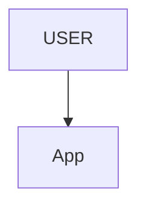
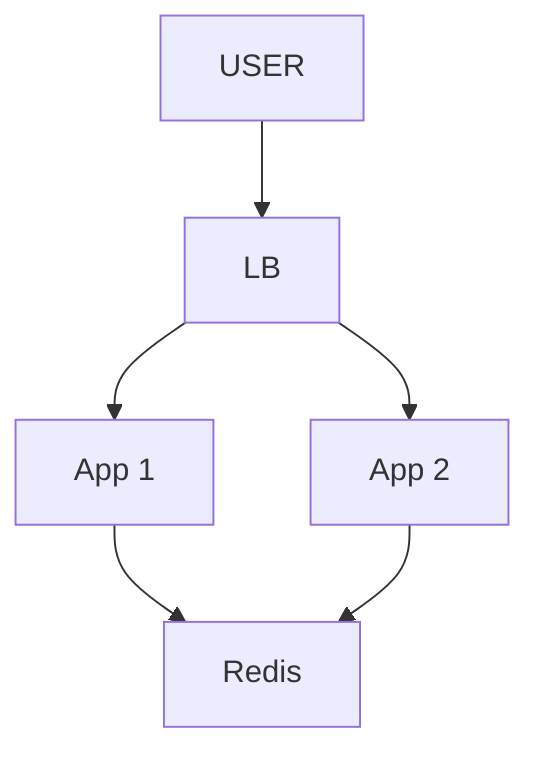
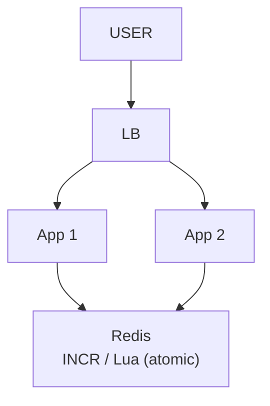
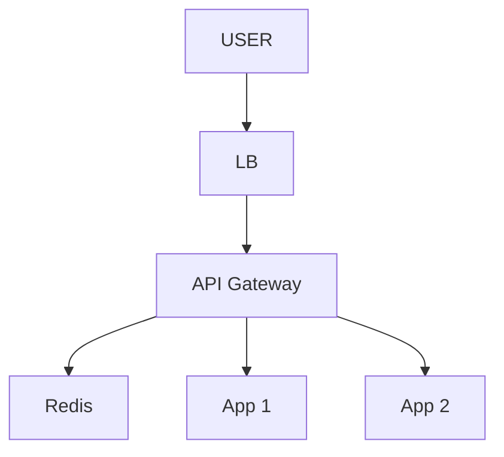
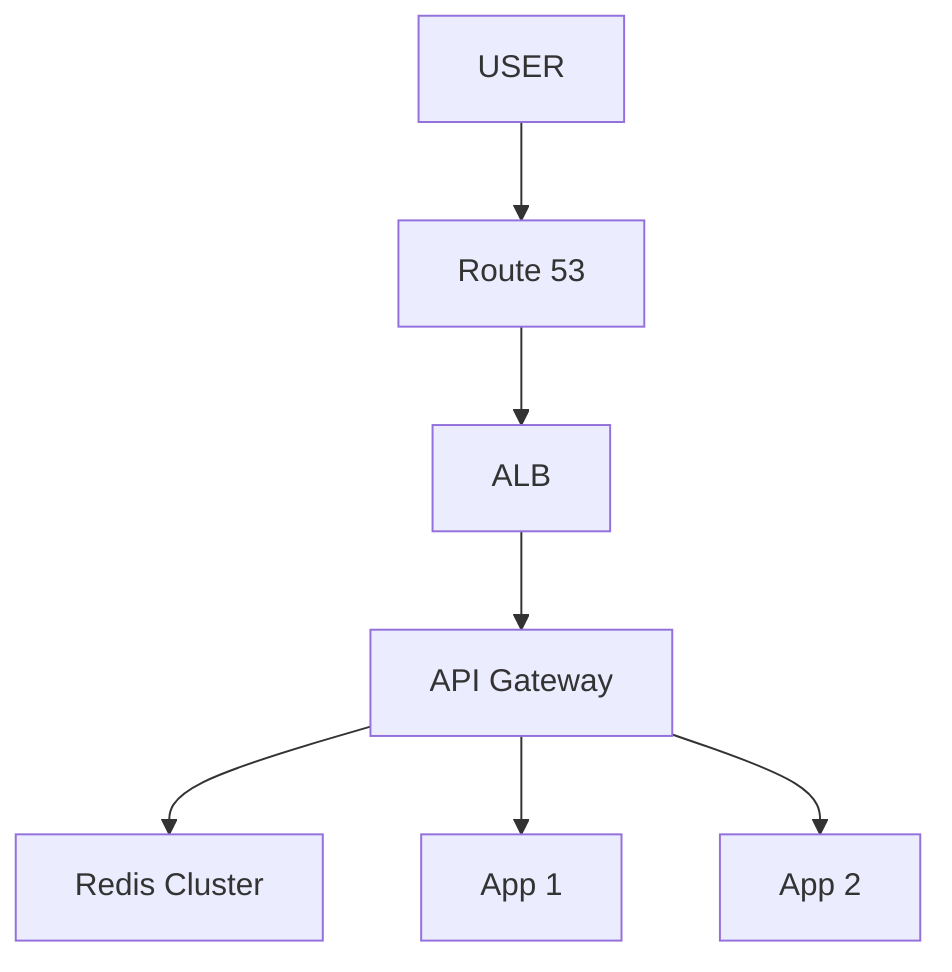
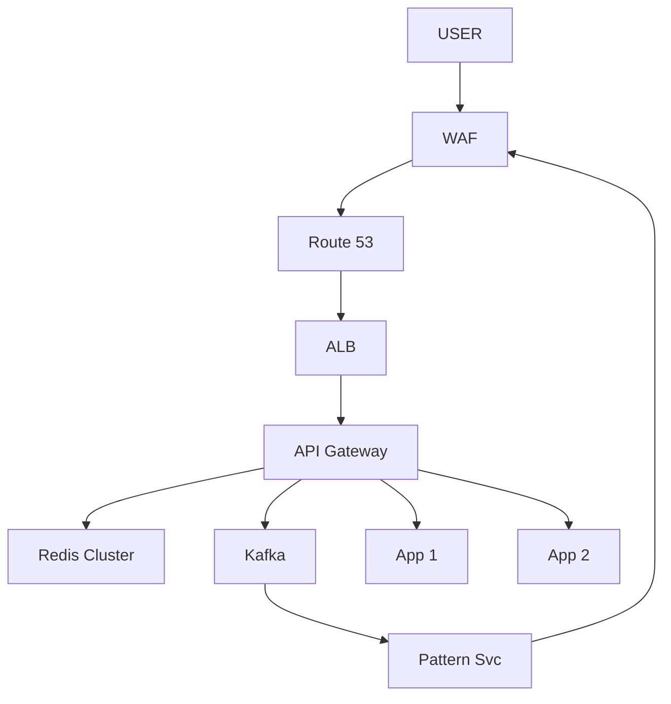
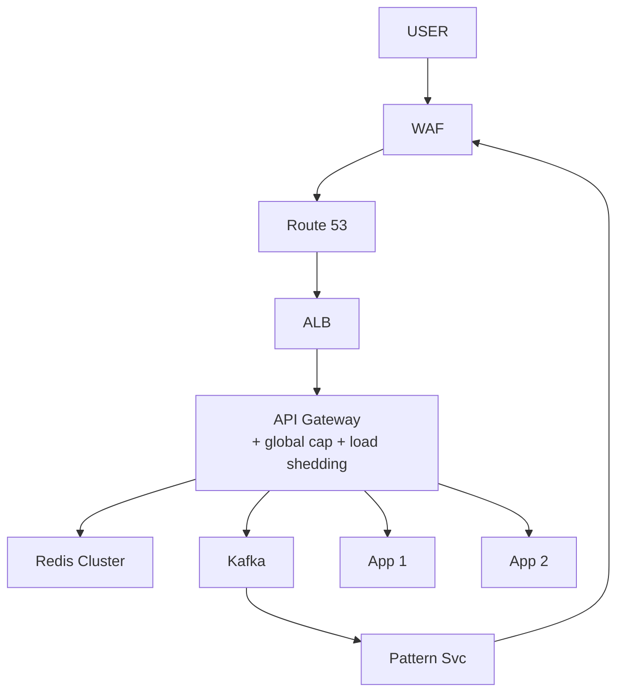
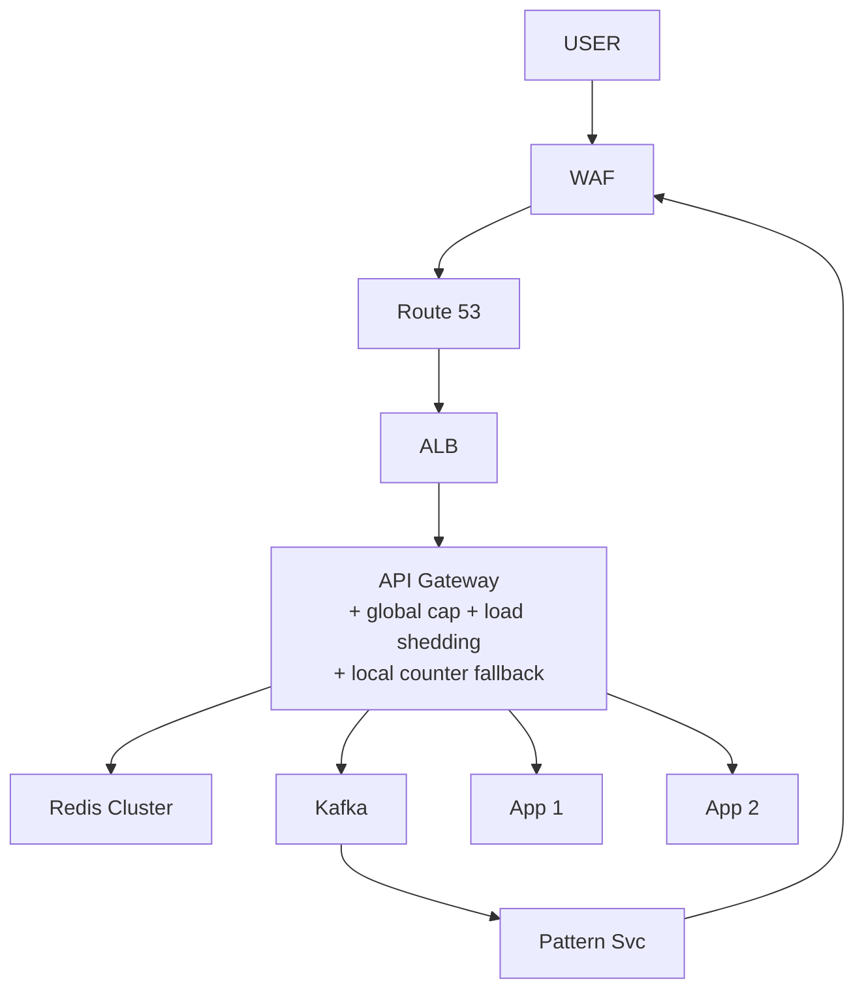

# Rate Limiter

> Limit se upar wali request REJECT (429), legit ALLOW. Misaal: "5 login / min per IP".
> Is design ka dil: **har request ke saamne baitha hai -> <1ms** + **ginti sab server pe EK** + **khud mare to site na mare**.

```
PUBLIC NAL: normal banda 1 bottle · pagal banda 10 truck -> paani khatam, asli user khaali haath
            -> park ka niyam "5 bottle / din per banda" = RATE LIMITING
            API pe: bot 10K login / sec (brute force) -> "5 / min per IP"
```

---

## TASVEER (ByteByteGo / Alex Xu · CC BY-NC-ND 4.0)


Source: [How Does Redis Persist Data?](https://bytebytego.com/guides/how-does-redis-persist-data/)
(HANDS-ON #3 CASE C — persistence band thi, restart pe ginti gayab. RDB / AOF yahi hain.)

---

## SHURU — poocho + numbers

```
POOCHO:  limit KIS PE? IP / user_id / API key · har endpoint alag (login 5/min, search 60/min)?
         tiered plan (free / pro / enterprise)?
         ★ maqsad SERVER BACHANA hai ya PAISA / SECURITY?  <- sabse zaroori, yahi aage ka trade-off tay karta
           soft -> thoda over-allow chalega · paisa / security -> bilkul exact

USE CASE: login 5/min per IP · password-reset 3/hr per email · public API 100/min per key ·
          signup 10/day per IP · search 60/min per user

FR:      rule (kya limit) · counter (kitni hui) · window (kis samay me) · over -> 429
NFR:     LOW LATENCY <1ms (har request ke saamne, slow = poora API slow) · FAIL-OPEN (limiter mare -> allow;
         payment / auth / OTP pe FAIL-CLOSED) · kai server pe bhi sahi ginti

NUMBERS: storage ka hisaab bekaar — per key ek counter + TTL, bas
         asli = OPS RATE: gateway pe baitha = system ka sabse high-QPS dabba (millions / sec)
         -> ye STORAGE nahi LATENCY problem -> in-memory (Redis), DB nahi · check ATOMIC
```

---

## DABBA 0 — sabse simple

```
SOLUTION: counter App ki memory me · count++ · limit paar -> 429
```


---

## DIKKAT 1 — teen server, ginti bat gayi

```
DIKKAT:   LB ne baanta: App-1 = 3, App-2 = 4, App-3 = 2 -> total 9, limit 5
          par kisi EK ko 5 paar dikha hi nahi -> LIMIT TOOT GAYI

SOLUTION: counter EK central jagah — in-memory, kyunki har request pe hit -> REDIS (single source of truth)
          counter + TTL

NAYA:     LB · Redis
BADLA:    App ek se DO — bojh bat gaya, ek gire to doosra chale (asal me zaroorat jitne, diagram me 2) · counter ab App ke andar nahi

KAISE:    key = rate:{endpoint}:{user}  (jaise rate:login:user42), value = ginti
          har request -> INCR · pehli baar EXPIRE 60 -> 60 sec baad key apne aap gayab = nayi window, ginti 0
          ginti > limit -> 429
KYUN YE:  sticky LB (ek user hamesha ek App pe) kyun nahi -> wo App gira = ginti gayi,
          naya App juda to users ka bantwara badla = ginti phir bati
```

```
AGLA SAWAAL (tere jawab se):
  "Fixed window me 59th sec pe 100 aur 61st sec pe 100 -> 2 sec me 200?"
   -> haan, fixed window ki kamzori. Sliding window (pichhle 60 sec ki asli ginti) ya token bucket se theek
  "Har request pe Redis call = latency?"
   -> Redis RAM me, ~1ms, App ke paas same AZ me. Itna chalta
```

---

## DIKKAT 2 — do request ek saath, dono ko jagah mil gayi

```
DIKKAT:   A padha 4 -> +1 -> likha 5 · B padha 4 -> +1 -> likha 5 -> limit 5, 6 ghus gayi

SOLUTION: padho-badhao-likho = EK ATOMIC kaam
          Redis single-threaded -> INCR apne aap atomic
          token bucket jaisa kai step (refill + check + ghatao) -> LUA SCRIPT (poora ek unit)
            count = INCR rate:login:userX
            if count == 1 then EXPIRE rate:login:userX 60 end      <- EXPIRE sirf PEHLI baar
          ★ JAAL: har request pe EXPIRE 60 -> TTL har baar 60 pe dhakelta -> key kabhi expire nahi
                  -> user hamesha block. (Redis 7+: EXPIRE key 60 NX bhi yahi)
          CONNECT (2-Sep): wahi race jo idempotency me (HDFC double-payment: containsKey + put ka gap -> double charge)
                  wahan putIfAbsent, yahan INCR / Lua — ilaaj same: teen step EK unit

NAYA:     koi dabba nahi — Redis me INCR / Lua
```

```
POOCHEGA: "Two requests come at the same time — what happens?"
DHYAAN:   2 user ek cheez = atomic / lock · 1 user ka retry = idempotency (dono alag)
BOL:      "Redis is single-threaded, so INCR is atomic. For token bucket I use a Lua script, so the
           check and the decrement run as one unit and there's no read-modify-write race."

AGLA SAWAAL (tere jawab se):
  "Token bucket me Redis me kya rakhoge?"
   -> do cheez: tokens bache + aakhri refill ka time. Lua me: (abhi - last) x rate jitne token jodo,
      1 ghatao, dono save -> ek hi unit
  "Lua script dheema / atak gaya to?"
   -> Redis single thread -> lamba script sabko rokega. Isliye script chhota, koi loop nahi
```

---

## DIKKAT 3 — limiter App ke andar: reject hone wali request bhi poore system me ghoom aayi

```
DIKKAT:   jise reject karna hai uspe backend ka compute kyun jale

SOLUTION: limiter SABSE AAGE — API GATEWAY pe, 429 wahin, backend tak jaane hi nahi
          3 jagah ho sakti: gateway · alag service · app library -> GATEWAY sabse common
          (chaaho to gateway pe mota global limit + service ke andar baarik limit)

NAYA:     API Gateway (limiter iske andar)
```

```
AGLA SAWAAL (tere jawab se):
  "429 pe client ko kya bataoge?"
   -> header Retry-After: 30 (kitni der baad aao) + X-RateLimit-Remaining (kitni bachi)
  "Gateway khud gir gaya?"
   -> gateway bhi 2+ box, aage LB (DIKKAT 4 wali SPOF chain)
```

---

## DIKKAT 4 — Redis hi gir gaya

```
DIKKAT:   har request ka faisla Redis pe tha

SOLUTION: (1) REPLICA + auto failover (Sentinel / cluster) -> replica ALAG AZ me
          (2) poori Redis layer gayi -> FAIL-OPEN (sab allow) · payment / auth / OTP -> FAIL-CLOSED
          (3) Redis pe bojh -> SHARD (Redis Cluster key ko CRC16(key) se 16384 slot me baantta, slot -> node)
              shard = scale + alag-alag · replica = bachav
          SPOF chain: har layer >= 2 + AUTO failover. sirf copy rakhna kaafi nahi — koi DEKHE aur MODE
              Redis = Sentinel (bina cluster) / Redis Cluster me masters khud vote se replica promote · LB = Route 53 / VIP · cloud ALB khud multi-AZ · Route 53 khud global

NAYA:     Route 53
BADLA:    Redis -> Redis Cluster (replica + shard) · LB -> ALB (multi-AZ)
```

```
POOCHEGA: "What if Redis goes down?"
DHYAAN:   faisla PEHLE se code me likha ho — fail-open ya fail-closed, endpoint ke hisaab se
BOL:      "Redis has a replica with automatic failover in another zone. If the whole layer is gone I
           fail open for normal APIs so the site stays up, and fail closed for login and OTP."

AGLA SAWAAL (tere jawab se):
  "Kaise pata primary mara, aur kaun promote karta?"
   -> Redis Cluster: baaki masters gossip se dekhte, majority bole "mara" -> vote se uska replica promote
      (bina cluster wale setup me yahi kaam 3 Sentinel karte: 2 of 3 bolein "mara" -> promote + clients ko naya pata)
  "Failover me aakhri kuch counts gaye?"
   -> haan, replica async thi -> kuch request ki ginti kho sakti. Rate limit ke liye chalta (paisa nahi)
```

---

## DIKKAT 5 — ek user Bangalore + Berlin + US-VPN se maar raha

```
DIKKAT:   INDIA 50 + EU 50 + US 50 = 150, limit 100 -> har region ko apna hi dikha

SOLUTION: teen raaste:
          1. CENTRAL Redis        -> exact, par ek jagah + door wale region ko latency
          2. LOCAL + async sync   -> tez, par thoda OVER-ALLOW
          3. REGION-STICKY (best) -> hash(user_id) % regions = HOME region, uske saare raaste wahin
                                     -> local Redis ke paas poori ginti
          ACCURACY vs LATENCY:
             soft / server bachana          -> local + async chalega
             paisa / security ("3 OTP", "10 free call phir charge", withdrawal) -> CENTRAL ATOMIC (Redis + Lua)

NAYA:     koi dabba nahi — routing ka niyam

KAISE (region-sticky):
          user kisi bhi region me aaye -> wahan ka gateway hash(user_id) se HOME region nikaalta
          -> request home region ke gateway / Redis tak forward -> ginti hamesha ek jagah
          keemat: door ke user ko ek cross-region hop (~100-200 ms) har request pe
```
```
POOCHEGA: "What if a whole region goes down?"
BOL:      "Route 53 sends the user to another region and the count starts from zero there, so the limit
           is loose for one window. For a rate limiter that's fine — it's only a minute of counting."

AGLA SAWAAL (tere jawab se):
  "Har request pe 200ms ka hop to dheema ho gaya?"
   -> haan, isliye sirf paisa / security wale endpoint pe sticky / central. Baaki pe local + async sync
  "Local + async sync me kitna over-allow?"
   -> sync interval jitna (jaise 1 sec) -> us beech har region apni poori limit de sakta. Soft limit ke liye theek
```

---

## DIKKAT 6 — ek hi banda baar-baar maar raha, 429 se ruk hi nahi raha

```
DIKKAT:   rate limit = sirf "60 sec baad aao", wo phir aa jaata

SOLUTION: LAYERED: (1) rate limit = soft, 429
                   (2) event KAFKA -> Pattern service ("ye baar-baar?")
                   (3) WAF / IP blocklist = PERMANENT ban
          turant permanent kyun nahi: asli user tez click · ek NAT IP ke peeche 100 log · sale ka legit burst
          -> limit maafi wali, ban sirf pakke abuse pe

NAYA:     Kafka · Pattern Svc (baar-baar maarne wala pakde) · WAF (edge pe IP / bot ko permanent rokne wali deewar)

KAISE:    Gateway har 429 ka event Kafka me daalta (ip, user, endpoint, time)
          Pattern svc window me ginta: "is IP ke 10 min me 500 se zyada 429?" -> had paar = WAF blocklist me IP
          WAF edge pe hai -> agli request server tak pahunchti hi nahi
KYUN YE:  Gateway se seedha Pattern svc ko call kyun nahi -> har request pe extra call = gateway ka raasta dheema
          Kafka me daal ke bhool jao, Pattern svc apni speed se padhe
```

```
AGLA SAWAAL (tere jawab se):
  "Galat banda ban ho gaya (office ka NAT IP)?"
   -> ban pe TTL (jaise 24 ghante), apne aap hatega + manual unblock raasta
  "Pattern svc peeche reh gaya (Kafka lag)?"
   -> ban kuch minute late lagega; tab tak rate limit to rok hi raha hai
```

---

## DIKKAT 7 — limiter sahi chal raha, phir bhi server gira (BHEED)

```
DIKKAT:   limit 100 / min per user · server ki had 5,000 / sec
          ek abuser -> 100 pe ruka ✓
          10,000 ASLI user, har ek limit ke ANDAR -> 12,000 / sec -> SERVER GIRA ✗
          limiter ne kuch galat nahi kiya — har user niyam me tha

SOLUTION: RATE LIMIT = "kis USER ne kitni"  (abuse / fairness)
          LOAD SHEDDING = "SYSTEM abhi kitna jhel sakta" (bachna)  <- ye alag cheez hai
          poore system ka GLOBAL CAP / concurrency limit · sehat dekh ke shedding ("CPU 90% -> nayi mat lo")
          QUEUE burst pakad leti · pata ho kab aayega (12 baje sale) -> PEHLE scale out
          (autoscale ko minute lagte, spike second me aata)

NAYA:     koi dabba nahi — Gateway me global cap + shedding
```

```
POOCHEGA: "What if traffic suddenly spikes 10x?"
DHYAAN:   "rate limiter laga hai" kaafi NAHI — per-user limit bheed nahi rokti
BOL:      "A per-user limit doesn't stop a crowd where everyone is under their limit. For that I need a
           global cap and load shedding based on system health, plus a queue for the burst and
           pre-scaling when I know the spike is coming."

AGLA SAWAAL (tere jawab se):
  "Shedding me kaunsi request phenkoge?"
   -> priority: login / payment rakho, recommendations / analytics pehle girao
  "Queue me request kitni der rakhoge?"
   -> chhota timeout (jaise 2 sec). User wait karke chala gaya to uska kaam karna bekaar
```

---

## DIKKAT 8 — attack aaya, aur limiter USI WAQT gayab

```
DIKKAT:   attack -> traffic 50x -> Redis pe bhi 50x -> Redis down -> FAIL-OPEN -> sab allow
          limiter tabhi gaya jab sabse zyada zaroorat thi

SOLUTION: fail-open ke SAATH local fallback:
          Redis zinda -> poori global ginti · Redis gaya -> har node APNI memory se motamoti rok
          exact nahi (har node apna ginega), par attack me "kuch nahi" se bahut behtar

NAYA:     koi dabba nahi — App / Gateway me local counter fallback

KAISE:    har node ki local limit = global limit / kitne node (100 / 10 node = har node 10)
          node apni RAM me ginta (simple counter + TTL), Redis wapas aaya to phir global
```

```
AGLA SAWAAL (tere jawab se):
  "Node badh gaye (autoscale), local limit?"
   -> node count config / service discovery se lo, divide dobara
  "Ek user ki saari request ek node pe aayi?"
   -> us node pe 10 pe ruka, doosre node pe aur 10 -> motamoti, exact nahi (maana hua)
```

---

## DIKKAT 9 — IP pe gin rahe the

```
DIKKAT:   NAT: ek office / mobile network ke HAZAAR log ek IP -> ek ne limit khaayi, sab block
          BOTNET: hazaar IP, har IP se 5 -> kisi ki limit nahi tooti -> ruka hi nahi

SOLUTION: logged-in -> user_id / API key pe gino, IP pe NAHI
          login / signup se pehle (pehchaan nahi) -> IP majboori -> limit DHEELI + asli faisla WAF / bot detection

NAYA:     koi dabba nahi
```
```
AGLA SAWAAL (tere jawab se):
  "Login se pehle botnet (hazaar IP) se password guess?"
   -> IP limit kaam nahi aayegi -> account pe limit (is username pe 5 galat = thodi der lock / CAPTCHA)
  "API key chori ho gayi?"
   -> key pe limit uska nuksaan seemit karti; key rotate / revoke ka raasta
```

---

## 10x SCALE — har dabba alag

```
API Gateway    -> har request pe limiter -> in-memory + atomic, gateway box badhao
Redis          -> SHARD (user / region) · REPLICA + failover · phir fail-open + local fallback
multi-region   -> REGION-STICKY hashing
abuser         -> Kafka pattern -> WAF ban
bheed          -> global cap + load shedding + queue + pre-scale

POOCHEGA: "How would you scale this to 10x?"       -> request ka raasta chalo, har dabbe pe "kya toota"
POOCHEGA: "What's the single point of failure?"    -> Redis (cluster + failover), LB (Route 53)
POOCHEGA: "How do you know it's working?"          -> p99 limiter latency · 429 rate · Redis errors · alert
```

---

## POOCHE TO (deep-dive)

```
RESPONSE:  OK  -> aage bhejo + X-RateLimit-Limit: 100 · X-RateLimit-Remaining: 47 · X-RateLimit-Reset: <unix time>
           HIT -> 429 Too Many Requests + Retry-After: 30 + Remaining: 0
           sirf "na" mat bolo — kitna bacha + kab aao batao, warna client turant retry maarta
           ★ Retry-After me JITTER (28, 33...) — warna sab theek 30 sec baad EK SAATH -> nayi laher

POOCHEGA:  "The provider returns 429 — what now?"  (notification wala ulta sawaal)
BOL:       "I respect Retry-After, back off exponentially with jitter, and throttle my own sends."

REDIS KEY: rate:{endpoint}:{user} -> count · TTL = window (60 sec) -> key gayab = window reset, cleanup job nahi
           rate:login:192.168.1.5 -> 4 · rate:signup:user_456 -> 2 · rate:search:apikey_xyz -> 47

FLOW:      user pehchano (IP / user / key) -> INCR (atomic) + EXPIRE -> count > limit ? 429 + Retry-After : App
EK LINE:   User -> Route53 -> ALB -> API Gateway rate-limiter -> Redis atomic INCR+EXPIRE ->
           limit-andar? App | limit-cross? 429 + Retry-After | abuse-pattern? Kafka | repeat-offender? WAF ban

ALGORITHM:
  TOKEN BUCKET  (AWS / Stripe)  bucket me token bharte (1/sec, max N) · request = 1 token · khaali -> reject
                                asli traffic SPIKY -> jama token se burst nikal jaata  <- YAHI LUNGA
  LEAKY BUCKET                  andar girti, neeche se FIXED rate · bhara -> reject · smooth par burst BLOCK
  FIXED WINDOW  (GitHub)        per-minute counter · EDGE BUG: 10:00:59 pe 5 + 10:01:00 pe 5 = 2 sec me 10
  SLIDING LOG               "last 60 sec" ke timestamp · sahi + smooth, par memory bhaari
  SLIDING WINDOW COUNTER (Cloudflare) 2 counter (is minute + pichhla) weighted jod · memory kam, lagbhag sahi
     BUS-STAND: register "last 1 ghanta me 5 max" · 11:00 -> 10:00 ke baad 5 -> REJECT
                11:10 -> 10:10 ke baad gino, Ramesh (10:05) bahar -> 4 -> ALLOW
                window SHIFT request aane pe hoti, koi timer / job nahi

  Bursts / Smooth / Memory:  token YES / variable / low · leaky NO / YES / low ·
                             fixed edge-fail / NO / lowest · sliding smooth / YES / high

GINTI vs LOAD:  100 chhoti request (5ms) = 0.5 sec kaam · 100 report query (30 sec) = 50 MINUTE kaam
                limiter ke liye barabar -> bhaari endpoint pe alag kadi limit / request ko WAZAN
                (report = 50 token, login = 1) / CONCURRENCY limit ("ek user ki 2 bhaari query ek waqt")

EK HI SHAKAL (poore HLD me ghoomti):
           LB me      "BACHANE wali cheez ne maara" (health check / retry / sticky)
           cache me   "TEZ karne wali cheez ne raasta roka" (slow Redis + no timeout)
           limiter me "ROKNE wali cheez ne bheed roki hi nahi" (per-user vs aggregate) + "attack me khud gayab" (fail-open)
           poora dhaancha: FOUNDATIONS/03_load_balancing.md "CHHE TARIKE" + 04_caching.md "REDIS LAGATE HI SERVER DOWN"

TIERED:    anonymous 60/hr · free 5,000/hr · pro 10,000/hr · enterprise custom -> tier DB se, Redis me usi limit se compare
```

---

## AAKHRI DABBA + WRAP

```
Route 53 = DNS + health-check · ALB = multi-AZ · API Gateway = limiter sabse aage, reject early
Redis Cluster = single source of truth, <1ms, atomic INCR / Lua, replica + shard
Kafka -> Pattern Svc -> WAF = baar-baar wale ka permanent ban
```

```
BOL: "The limiter sits in the API gateway, in front of everything, so rejected requests never reach the
      backend. Counts live in Redis with an atomic INCR or a Lua script, keyed by endpoint and user,
      with a TTL as the window. I use token bucket because real traffic is bursty. Over the limit it's a
      429 with Retry-After. Redis is replicated and sharded, fails open for normal APIs and closed for
      login and OTP. Users stick to a home region, repeat abusers go through Kafka to a WAF ban, and a
      global cap with load shedding protects against a legit crowd."
```

---

## HANDS-ON #1 — Nginx limiter LIVE (21-Aug, isi folder ki `nginx.conf`)

```
docker run -d --name rl -p 8080:80 -v "<path>\nginx.conf:/etc/nginx/nginx.conf:ro" nginx
   -d background · --name rl · -p laptop 8080 -> container 80 · -v apni conf andar MOUNT (ro) · nginx = image

nginx.conf ki 2 asli line:
   limit_req_zone $binary_remote_addr zone=mylimit:10m rate=1r/m;    <- har IP ka bucket, refill 1 / min
   limit_req zone=mylimit burst=5 nodelay;                           <- bucket SIZE 5, burst turant serve
   rate = kis speed se nikalti · burst = kitni ruk sakti
   + location / { ... root /usr/share/nginx/html; index index.html; }  <- content serve
   koi program NAHI likha — sirf ready tool (Nginx, rate limiter built-in) on kiya + config + hammer -> 503
   SACH: nginx docs isko LEAKY BUCKET kehte; nodelay se bartaav token bucket JAISA. 503 = limit_req_status default.

HAMMER:  for /L %i in (1,1,30) do @curl -s -o nul -w "%{http_code} " http://localhost:8080
         (1,1,30) = 30 baar · -s -o nul = chup, body phenk do · -w = sirf status code
DIKHA:   200 200 200 200 200 200 503 503 503 ...
LOG:     (Docker Desktop -> Containers -> rl -> Logs) "GET / HTTP/1.1" 503 197
         [error] limiting requests, excess: 5.774 by zone "mylimit", client: 172.17.0.1
         (excess = bucket se kitna upar · client = Docker gateway IP, sab ek IP = ek bucket)

GOTCHA:  1. 503 tabhi jab ARRIVAL > rate (rate=2r/s pe dheere loop -> sab 200, refill pakad leta)
         2. burst=N -> spike me N+1 pass (burst=5 -> 6, 100 -> 101); textbook N, nginx N+1, timing se 21 / 22 bhi
         3. 1 IP = 1 bucket
         4. config badla -> docker restart rl
CHALAO:  docker start rl · curl http://localhost:8080 · docker logs rl · docker restart rl · docker stop rl
```

---

## HANDS-ON #2 — App ke andar fixed window (usercrud, 26-Aug)

```java
@RestController
public class RateLimitController {
    private int LIMIT = 5;
    private long windowStart = 0;
    private int count = 0;

    @GetMapping("/rate-demo")
    public synchronized ResponseEntity<String> hit() {          // synchronized: shared counter
        long now = System.currentTimeMillis();
        if (now - windowStart > 1000) { windowStart = now; count = 0; }   // window reset
        count++;
        if (count > LIMIT)
            return ResponseEntity.status(HttpStatus.TOO_MANY_REQUESTS).body("429 - limit paar");
        return ResponseEntity.ok("OK - request #" + count);
    }
}
// SecurityConfig: .requestMatchers("/rate-demo").permitAll()
// ResponseEntity KYUN: status-code (200/429) khud set karne ko
```
```
LIVE:  1..10 | % { curl.exe -s http://localhost:8080/rate-demo; "" }
       OK #1..#5 · 429 (6..10) · 1 sec baad window reset -> phir OK
EDGE:  fixed window boundary: 999ms pe 5 + 1001ms pe 5 = ~2ms me 10
PROD:  single node memory -> restart pe reset + har server apna count -> Redis INCR + EXPIRE
       per user / IP -> map<key, counter> · lib: Bucket4j (token bucket) / Redis + Lua
BOL:   "I built a fixed-window counter in usercrud — five OK, then 429. In production I'd use token
        bucket (Bucket4j) with a shared Redis counter; Nginx limit_req does it at the edge."
```

---

## HANDS-ON #3 — Redis KHUD maara: kaise tootta (30-Sep)

CODE: `04_HLD/HANDS_ON/01_rate_limiter_redis/RateLimiterDemo.java` · `04_HLD/HANDS_ON/02_incr_expire_crash/IncrExpireCrash.java`
(koi library nahi, socket se Redis, `java File.java`)

```
docker run -d --name demo-redis -p 6390:6379 redis:7 redis-server --save "" --appendonly no
   (RDB + AOF band -> sirf memory, restart = sab gaya, jaan-boojh ke)
docker stop / start demo-redis · docker exec demo-redis redis-cli TTL rl:user:1 · ... DEL rl:user:1

CODE KA DIL (user:1 ko 60 sec me 5):
   count = INCR KEY · if count == 1 -> EXPIRE KEY 60 · count <= 5 ALLOW else 429
   catch IOException -> FAIL_OPEN ? ALLOW : BLOCK
```
```
CASE A  chalta kaise  req 1..9:  count 1 TTL 60 ALLOW · 2/57 ALLOW · 3/56 ALLOW · 4/49 ALLOW · 5/48 ALLOW ·
                                 6/47 429 · 7/45 429 · 8/45 429 · 9/44 429     (window PEHLI request se)

CASE B  docker stop   "REDIS SE BAAT NAHI HUI: Connection refused" -> FAIL_OPEN = true -> ALLOW (2 baar)
                      fail-open = site chale, limit nahi · fail-closed = abuse nahi, site band
                      ("server ne haath khade kar diye, sab jao")

CASE C  docker start  GET rl:user:1 -> khaali · user (pehle count 7, BLOCK) -> count 1 ALLOW, 2 ALLOW
                      persistence band -> ginti gayab -> blocked ko 5 nayi mil gayi

CASE D  INCR ke baad, EXPIRE se pehle crash (USE_LUA = false)
                      RUN 1: count 1, CRASH · TTL -> -1
                      RUN 2: count 2..5 ALLOW, 6..7 429, har baar TTL -1 -> key KABHI nahi mitegi, HAMESHA block
FIX D   USE_LUA = true   req 10..14: count 10 TTL 58 · 11/57 · 12/56 · 13/56 · 14/55 -> 1 min me free

TTL:  -1 = key hai, timer nahi · -2 = key hi nahi · 58 = 58 sec baaki
```
```
FIX:  B -> faisla pehle se: fail-open (aam API) / fail-closed (login, OTP) + replica
      C -> replica / AOF on. limiter me aksar chalne do (1 min ki ginti, paisa nahi). paisa hota to nahi.
      D -> Lua: INCR + EXPIRE ek command, Redis single-thread -> script beech me nahi rukti (ya EXPIRE 60 NX)
           pehle:  app --INCR--> Redis  [crash]  app --EXPIRE--> Redis
           Lua:    app --EVAL(INCR + EXPIRE)--> Redis
```
```lua
local c = redis.call('INCR', KEYS[1])
if c == 1 then redis.call('EXPIRE', KEYS[1], ARGV[1]) end
return c
```
```
BOL: "If Redis is down the limiter fails open so the site stays up, and fails closed on login and OTP.
      A Redis restart resets counters — acceptable for a limiter, a replica reduces it. INCR and EXPIRE
      sent separately can leave a key with no TTL after a crash and block a user forever, so I send both
      in one Lua script. I killed a Docker Redis myself to see all three."
```

ARCHETYPE F · CONCEPTS: [caching/Redis](../../FOUNDATIONS/04_caching.md) · [load-balancing](../../FOUNDATIONS/03_load_balancing.md) · [SPOF](../../FOUNDATIONS/11_reliability_spof_cloud.md) · [← MASTER SHEET](../../00_MASTER_SHEET.md)
