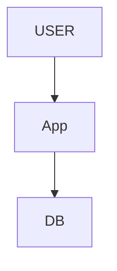
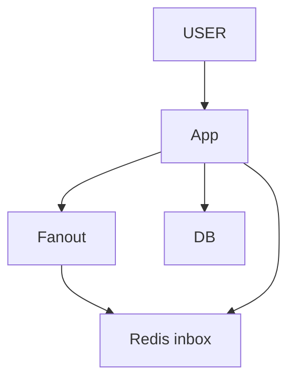
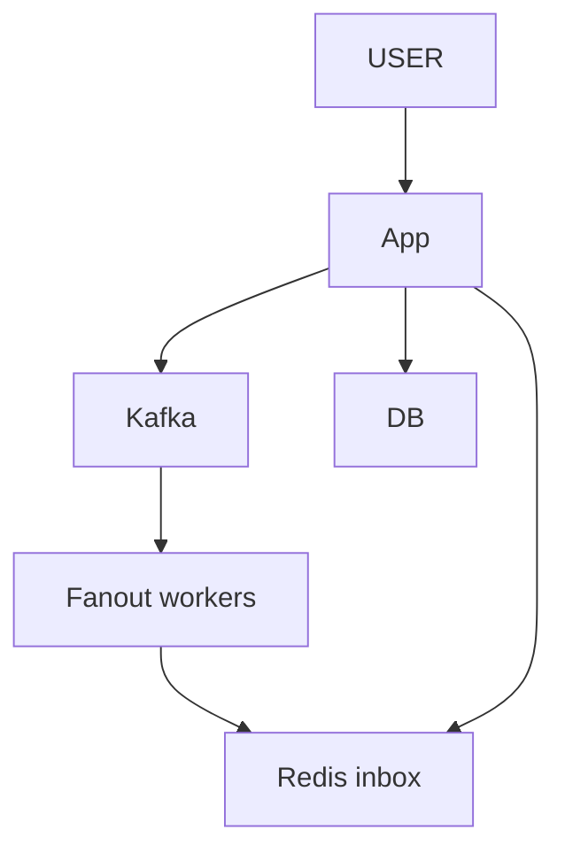
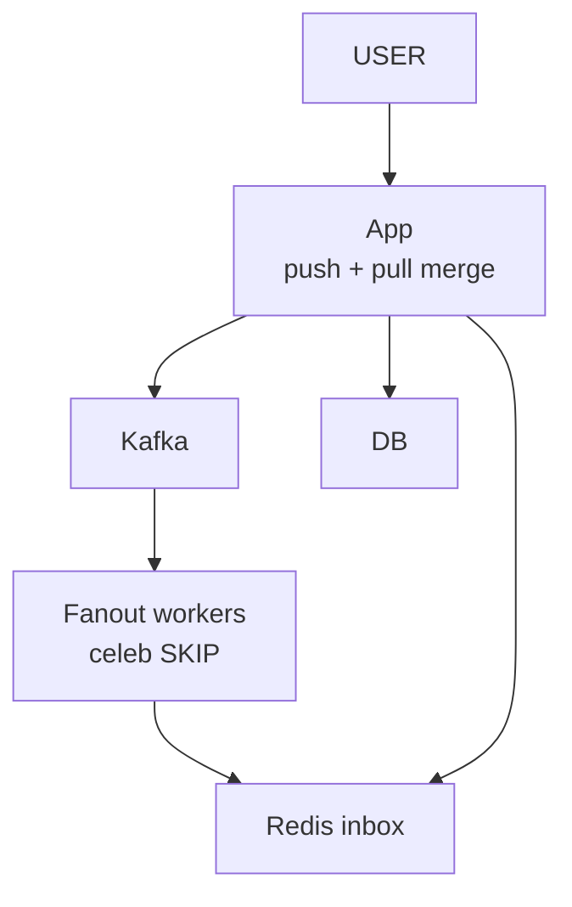
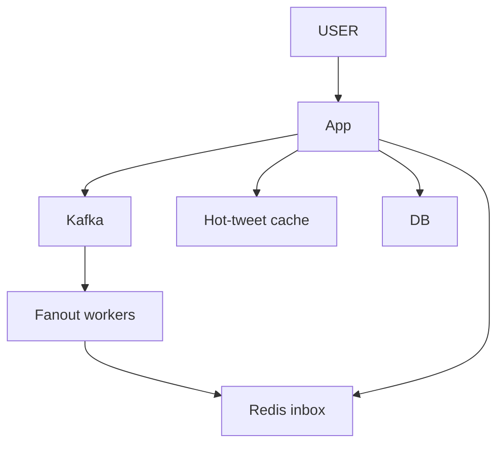
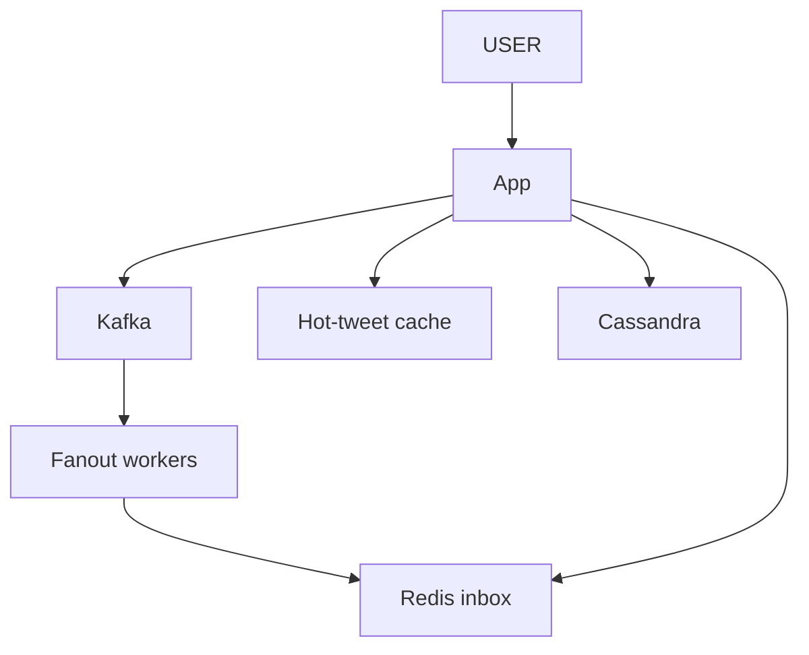
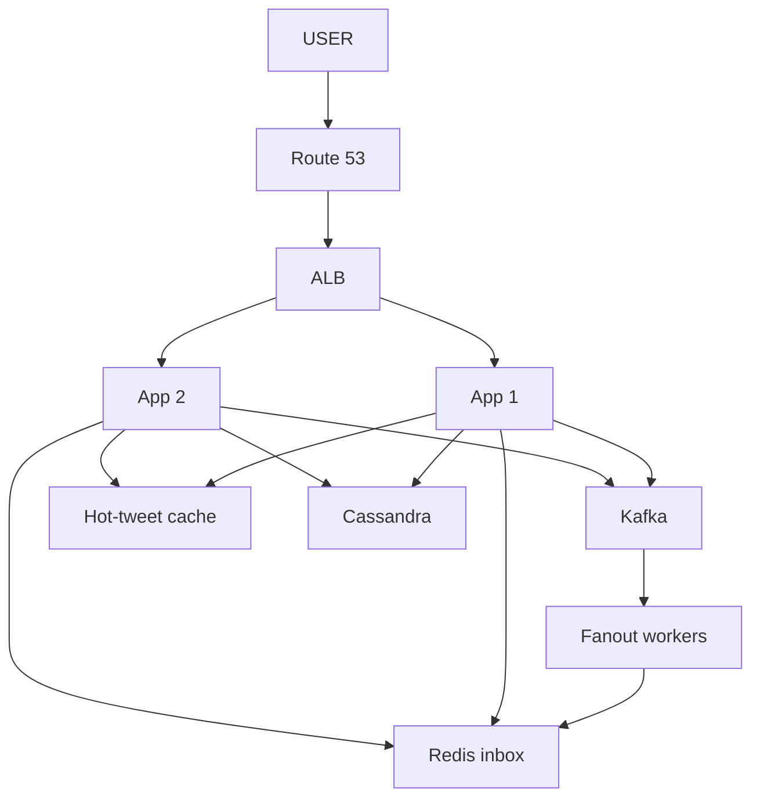
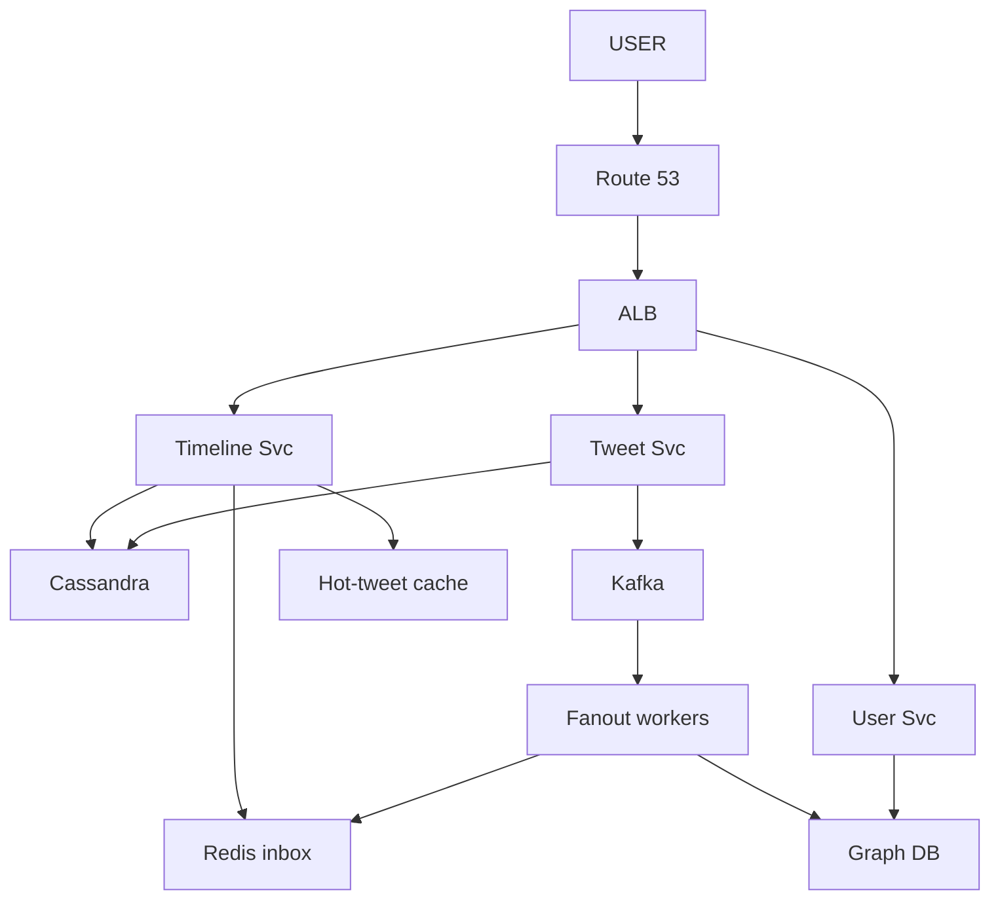
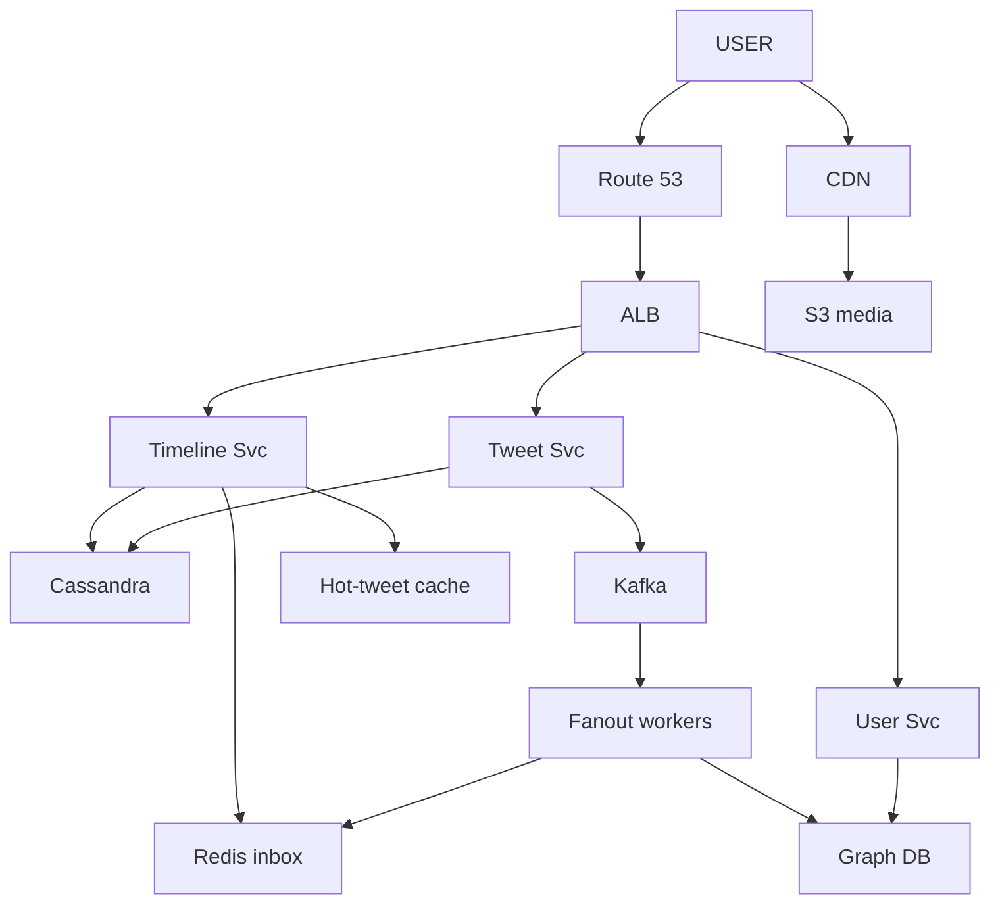

# Twitter Feed

> App khole -> HOME TIMELINE (jinko follow karta unke tweet, latest pehle). Tweet POST bhi.
> Misaal: app khola -> Virat "Match great" · Sachin "Watching IPL" · Dhoni "Practice" (jinhe TU follow karta).
> Is design ka dil: **read SASTA** (50:1, pehle se bana ke rakho) + **CELEB ka tweet** (10 crore follower).

```
ROYAL KINGDOM (poori file isi se jodo):
   Notice Board = Redis inbox per user   · Town Crier   = Fanout service
   Palace Board = tweet store (Cassandra)· Royal Scribe = Tweet service
   News reader  = Timeline service       · Register     = Graph DB (kaun kisko follow)
   Newspaper truck = Kafka
```

---

## TASVEER (ByteByteGo / Alex Xu · CC BY-NC-ND 4.0)


Source: [Twitter Architecture 2022 vs. 2012](https://bytebytego.com/guides/twitter-architecture-2022-vs-2012/)
(asli Twitter ka naksha — timeline service, fan-out, cache. Ye design uska chhota roop.)

---

## SHURU — poocho + numbers

```
POOCHO:  "Timeline, post, search, trending, DM, notification — kis pe focus? Main home timeline + post pe."
         ~500M user maan lun? · CELEBRITY handle karna hai? (10 crore follower)  <- design ka asli mod
         bilkul real-time ya kuch second purana chalega? (haan -> precompute ka raasta khulta)
         media scope me ya sirf text?

FR:      tweet POST · HOME TIMELINE (follow kiye logon ke, latest pehle) · profile tweets
         scope bahar: search · trending · DM · notification
NFR:     feed < 200ms · READ-HEAVY · 500M user · EVENTUAL OK (2 sec purana chalega)

NUMBERS: 500M user · 500M tweet / din = ~5,800 / sec · avg follow ~200 · celeb 10 crore · read:write ~50:1
         50:1     -> har read pe compute MAT karo, PEHLE se bana ke rakho (precompute)
         celeb    -> ek tweet pe 10 crore kaam? -> asli mod
         eventual -> precompute + cache chalega
```
```
POOCHEGA: "Consistency or availability — which do you pick?"
BOL:      "For the feed and like counts, availability. A feed a couple of seconds old is fine; a feed
           that doesn't load is not."
```

---

## DABBA 0 — sabse simple

```
SOLUTION: tweets table + follows table · feed = jinko follow karta unke tweet nikaalo, time se sort, top 50
```


---

## DIKKAT 1 — har baar app kholne pe 200 logon ka data joda ja raha

```
DIKKAT:   app khuli -> 200 follow -> sabke tweet -> sort -> top 50 · har user, har baar, 50:1 pe -> FEED SLOW

SOLUTION: read pe mat jodo — POST ke waqt hi har follower ke INBOX me daal do (PRECOMPUTE / fan-out on write)
          Virat tweet -> Fanout -> redis:inbox:arpan = [t9, t7, t3, ...]
          app khuli -> sirf apna inbox padho -> INSTANT
          tweet ek baar banta, 50 baar padha jaata -> mehnat LIKHTE waqt
          (Town Crier har ghar ke Notice Board pe parcha chipkata)

NAYA:     Fanout (tweet ko har follower ke inbox me daalne wala) · Redis inbox (har user ki ready feed, sirf tweet_id)
```

```
AGLA SAWAAL (tere jawab se):
  "Inbox me sirf tweet_id, to feed dikhate waqt poora tweet kahan se?"
   -> inbox se 50 id -> ek saath batch me tweet store / hot cache se laao (MGET), ek-ek nahi
  "Kisi ko unfollow kiya, uske tweet inbox me pade hain?"
   -> padhte waqt follow list se filter, ya peeche se saaf. Turant poora inbox nahi badalte
```

---

## DIKKAT 2 — tweet ka button 3 sec ghoomta raha (200 inbox likhe ja rahe the)

```
DIKKAT:   precompute ka saara kaam POST karne wale ke sar · Redis zara slow -> POST hi FAIL,
          jabki tweet ban chuka tha, sirf baantna baaki tha

SOLUTION: tweet DB me likho -> EVENT Kafka pe -> user ko TURANT "ho gaya"
          FANOUT WORKERS peeche se inbox bharte
          post ab do hisse: "tweet bana" (turant) · "sab tak pahuncha" (peeche, dheere bhi chalega)
          worker gira bhi -> tweet nahi khoya, event Kafka me, wapas aa ke wahin se

NAYA:     Kafka
BADLA:    Fanout -> Fanout workers (Kafka se padhte)
```

```
POOCHEGA: "I just tweeted but don't see it in my own feed. Why?"
DHYAAN:   fanout PEECHE chalta hai — isliye. "bug hai" nahi
BOL:      "Read-your-own-writes: the author's new tweet is added to their own feed directly, without
           waiting for fan-out."

AGLA SAWAAL (tere jawab se):
  "Fanout worker beech me gira (100 me se 60 inbox likhe)?"
   -> Kafka offset commit nahi hua -> event dobara aata, worker phir se likhta. Inbox me id dobara na aaye
      -> inbox Redis LIST hai (LPUSH dobara = id do baar) -> LPUSH se pehle idempotency check (SET eventId NX)
      ya inbox ko sorted set banao (ZADD same id = ek hi, score = time)
  "Kafka me partition kaise baante?"
   -> key = author_id -> ek author ke tweet ek partition, kram me; workers partitions baant lete
```

---

## DIKKAT 3 — Bieber ne tweet kiya: 10 CRORE inbox

```
DIKKAT:   ek tweet -> 100,000,000 inbox write -> Town Crier CHOKED -> poora system atka

SOLUTION: HYBRID
          NORMAL (< 10K follower) -> PUSH (fan-out on write)
          CELEB  (> 10K)          -> PULL (sirf tweet store me, fanout NAHI)
          read pe: apna inbox (push) + jin celeb ko follow karta unke tweet (pull) -> MERGE + SORT
          misaal: Arpan follows Virat (celeb) + Suresh -> Suresh = inbox se · Virat = tweet store se
          CROSSOVER: 8K pe push · 10.5K hua -> aage ke tweet pull. system khud dekhta rehta
          trade-off: push = read instant, celeb pe write-storm · pull = write bacha, har read mehnga

NAYA:     koi dabba nahi — Fanout celeb ko SKIP karta, App read pe merge karta
```

```
POOCHEGA: "What about a celebrity / hot key / hot partition?"
DHYAAN:   GALAT RAASTE: "user_id pe shard hi galat" (baaki crore ke liye theek, dikkat EK key ki) ·
          "celeb ko alag server" (wo bhi EK server). consistent hashing ek hot key ko nahi bachata
BOL:      "Sharding by user id is fine for everyone else; the problem is one hot key, and consistent
           hashing doesn't fix that. For reads I'd replicate that key in the cache across many nodes
           and add a local cache on each app server, with media on a CDN. For the feed, celebrities
           use fan-out on read. If writes are hot, like likes, I'd split the key into buckets
           (tweet123#0..#9) and sum on read."

AGLA SAWAAL (tere jawab se):
  "Merge kahan hota aur kitna mehnga?"
   -> Timeline svc me: inbox (50 id) + celeb list (aksar 10-20 celeb, har ek ke latest kuch) -> time se sort
      -> chhota kaam, celeb ke tweet hot cache se
  "Koi 9,999 se 10,001 follower pe aaya-gaya baar-baar?"
   -> beech me gap rakho (12K se upar gaya to pull · 8K se neeche aaya tabhi wapas push) taaki baar-baar palti na ho
```

---

## DIKKAT 4 — Virat ka tweet 10 crore log ek saath padh rahe

```
DIKKAT:   pull wale saare read tweet store pe -> DB CRASH

SOLUTION: HOT-TWEET CACHE — bestseller front counter pe (cache), baaki kitaab peeche shelf (DB)
          recent celeb tweet, TTL 1 hr (SETEX ... 3600) · 95% HIT · miss -> DB -> cache me daalo
          < 1 hr = HOT -> cache · purana = COLD -> seedha DB

NAYA:     Hot-tweet cache (celeb ke naye tweet RAM me, sab wahin se padhein)

KYUN YE:  Cassandra ke read replica kyun nahi -> wo bhi disk se (ms), cache RAM se (<1ms), aur replica 10 crore read nahi jhelta
          cache miss pe 1000 request ek saath DB pe na jaayein -> sirf EK DB jaaye, baaki cache bharne ka intezaar (lock)
```

```
POOCHEGA: "What if traffic suddenly spikes 10x?"
BOL:      "Kafka holds the fan-out burst. If I know when it's coming, like an IPL final, I scale out and
           pre-warm the hot-tweet cache beforehand — autoscaling takes minutes, the spike takes seconds."

AGLA SAWAAL (tere jawab se):
  "Virat ne tweet edit / delete kiya, cache purana?"
   -> delete / edit pe us tweet ki cache key bhi DEL, agla read DB se naya
  "Ek hi tweet ki key ek Redis node pe -> wahi node garam?"
   -> us key ki kai copy (tweet:123#1..#5), read random copy se + App me chhota local cache
```

---

## DIKKAT 5 — 500M inbox Redis me? memory phat jaayegi

```
DIKKAT:   har user ka poora feed memory me

SOLUTION: DO ALAG CACHE (ghaalmel mat karo):
          INBOX (per user, push):  sirf tweet_ID, poora tweet nahi · LTRIM 800 -> ~6.4 KB / inbox
                                   500M x 6.4 KB = ~3.2 TB -> Redis cluster me chal jaata
          HOT-TWEET (shared, pull): ~500K recent x 500 B = ~250 MB -> ek node
          INACTIVE: 30 din se nahi khola -> inbox DELETE · wapas aaya -> DB se REBUILD (ek baar)

NAYA:     koi dabba nahi
```
```
POOCHEGA: "What if the cache goes down?"
DHYAAN:   Redis gira -> har feed DB se banana -> mehnga -> DB bhi gir sakta
BOL:      "Redis is a replicated cluster. If it fails, I shed load, let one request rebuild each hot
           key instead of thousands, and warm inboxes back up gradually."

AGLA SAWAAL (tere jawab se):
  "Inactive user wapas aaya, rebuild me kitna time?"
   -> pehli baar feed pull se bana do (follows ke latest tweet), phir inbox bhar do -> ek baar dheema, phir tez
  "LTRIM 800 ke baad purana scroll?"
   -> 800 ke aage scroll = DB se pull (bahut kam log itna neeche jaate)
```

---

## DIKKAT 6 — saare tweets ek DB me nahi aayenge

```
DIKKAT:   petabytes + bahut writes

SOLUTION: CASSANDRA — write-heavy, LSM tree = fast write, simple key access
          SHARD:  by tweet_id   -> load even, par user ke tweet bikhre -> profile = scatter-gather
                  by user_id    -> user ke saare ek shard, profile fast  <- PEHLA chunaav
                                   par hot user (Bieber) ka shard hammer
                  user_id + time -> hot user bhi time se bata, purana cold storage
          HOT USER: Bieber ke tweet KAI shard pe replicate -> read bat gaye
          replica sirf READ baantta, write ke liye SHARD · country / date = bura key (skew)

BADLA:    DB -> Cassandra (shard by user_id + time)

KAISE (LSM = tez write):
          write -> pehle commit log (disk pe sirf append) + RAM ki memtable -> user ko "done"
          memtable bhari -> disk pe SSTable file seedha likh deta. Purana data badalta nahi, bas nayi file
          peeche se chhoti files mila di jaati (compaction)
KYUN YE:  MySQL me har write = B-tree index me jagah dhoondh ke badlo (random disk write) -> itne writes pe dheema
          join / transaction yahan chahiye hi nahi, bas "user ke tweet time ke kram me" 
```

```
POOCHEGA: "The database is too big / takes too many writes. What do you do?"
BOL:      "Shard by user id so a user's tweets sit together and the profile page is one shard, add time
           as a sub-key so hot users spread out, and replicate the hottest users' tweets for reads."

AGLA SAWAAL (tere jawab se):
  "LSM me read dheema kyun ho sakta?"
   -> ek key kai SSTable me bikhri ho sakti -> sab dekhna padta. Bloom filter + compaction se kam
  "Partition key aur clustering key kya?"
   -> partition = (user_id, month) -> kis node pe · clustering = tweet time DESC -> andar kram
```

---

## DIKKAT 7 — India ka user US ke shard se padh raha (200ms)

```
DIKKAT:   door ka data

SOLUTION: GEO SHARDING (India / EU / US) — chaaron wajah bolo:
          LATENCY 5ms vs 200ms · COMPLIANCE (GDPR, EU data EU me) · LOAD (peak alag waqt) · FAILURE (ek region gira, baaki chale)
          Indian banda Bieber (US) ko follow -> Bieber ke HOT tweet India ke Redis me copy (hot data paas laao)

BADLA:    Cassandra ab region-wise (India / EU / US)

KAISE:    user region tak kaise -> Route 53 latency / geo routing: DNS jawab me paas wale region ka pata
          Bieber ke tweet India tak kaise -> Cassandra multi-DC replication: har region ek DC, likha hua
          doosre DC me async copy (us DC ke liye alag replication factor)
```
```
POOCHEGA: "What if a whole region goes down?"
BOL:      "Route 53 health checks move users to the nearest healthy region. Data is copied there
           asynchronously, so the feed may be a little stale after failover — we already accepted
           eventual consistency."

AGLA SAWAAL (tere jawab se):
  "India ka user US travel kar raha, data kahan?"
   -> uska data home region me hi, request wahan forward ya paas wali copy se read (thoda purana chalega)
  "Do region me ek saath likha (conflict)?"
   -> tweet naya hi banta (update kam) -> conflict kam. Ho to last-write-wins timestamp se
```

---

## DIKKAT 8 — sab EK App box me: bojh bhi, SPOF bhi

```
DIKKAT:   ek box lakhon user nahi jhelta, gira to sab band · ek LB / region gira to site gayi

SOLUTION: App ke kai box + aage ALB · App stateless (state Redis / DB me)
          ROUTE 53: DNS + health-check, mara hua hatao, paas wala region do

NAYA:     Route 53 · ALB
BADLA:    App ek se DO — bojh bat gaya, ek gire to doosra chale (asal me zaroorat jitne, diagram me 2)

KAISE:    ALB har box pe health check (GET /health har ~10 sec) -> fail = box list se bahar, theek = wapas
          Route 53 bhi isi tarah poore region / ALB ko dekhta
KYUN YE:  ek bada server (vertical) kyun nahi -> ek had ke baad mehnga aur wahi SPOF
```

```
AGLA SAWAAL (tere jawab se):
  "Naya box juda, uski cache khaali -> pehli requests dheemi?"
   -> App box me state nahi (Redis alag), isliye farak kam; LB naye box ko dheere-dheere traffic de (slow start)
  "Deploy karte waqt sab box restart?"
   -> rolling deploy: ek-ek box nikaalo, update, wapas. Site kabhi band nahi
```

---

## DIKKAT 9 — likhna aur padhna ek hi box me (1:50)

```
DIKKAT:   feed ka rush tweet-post ko bhi dheema kare · follow-graph har fanout pe chahiye

SOLUTION: TWEET SERVICE (write, royal scribe) · TIMELINE SERVICE (read, merge push + pull) — alag scale
          USER SERVICE + GRAPH DB (kaun kisko follow)
          graph: 1-hop follow list = simple adjacency table / Cassandra kaafi
                 Neo4j tabhi jab "dost ke dost" jaise kai-hop sawaal

BADLA:    App -> teen ALAG service: Tweet Svc + Timeline Svc + User Svc (har ek ke kai box, diagram me ek-ek)
NAYA:     Graph DB (kaun kisko follow karta)
```

```
AGLA SAWAAL (tere jawab se):
  "Timeline svc ko follow list kahan se?"
   -> User/Graph svc se, par har read pe call nahi -> follow list Redis me cache
  "Fanout ko har baar 10K followers ki list?"
   -> Graph store se pages me (1000-1000) padh ke inbox likhta
```

---

## DIKKAT 10 — photo / video duniya bhar se, har baar humare server se

```
DIKKAT:   media bhaari + door

SOLUTION: CDN (CloudFront) — media user ke paas wali edge se

NAYA:     CDN

KAISE:    tweet me media ka URL CDN ka hota (cdn.twitter.com/img/abc.jpg)
          user ki request paas wali EDGE pe -> wahan hai (hit) to wahin se · nahi (miss) -> edge ORIGIN (S3) se
          laata, apne paas TTL tak rakhta, phir aage sab ko wahin se
KYUN YE:  seedha S3 se -> door ke user ko dheema + S3 / bandwidth ka kharcha har baar
          (dhyaan: CDN media ke raaste pe hai, origin S3; API ke raaste pe nahi)
```

```
AGLA SAWAAL (tere jawab se):
  "Photo delete ki, CDN pe abhi bhi dikh rahi?"
   -> CDN invalidation call ya chhota TTL; ya URL me version (abc_v2.jpg) -> naya URL = naya file
  "Private photo CDN pe sabko mil jaayegi?"
   -> signed URL (expiry ke saath) -> sirf jisko link mila, thodi der ke liye
```

---

## 10x SCALE — har dabba alag

```
Timeline Svc   -> har read pe 200 ka join? -> INBOX precompute (ho gaya) · box badhao
Redis inbox    -> 500M inbox -> LTRIM 800 + inactive delete · cluster + replica
celeb reads    -> HOT-TWEET cache 95% hit · hot key kai node pe copy + App me L1 local cache
Cassandra      -> shard by user_id (+ time) · Bieber shard hammer -> hot user replicate
doosre desh    -> GEO shard + hot data region me copy
Kafka          -> partition badhao · fanout workers badhao
REAL TWITTER = multi-dimensional: user_id shard + time sub-shard + geo replication + hot data global cache

POOCHEGA: "How would you scale this to 10x?"      -> user ka raasta chalo, pehle jo toote wahi ilaaj
POOCHEGA: "What's the single point of failure?"   -> har box pe "ye gira to?"
POOCHEGA: "How do you know it's working?"         -> feed p99 · error rate · Kafka lag (fanout peeche?) · alert
```

---

## POOCHE TO (deep-dive)

```
API:      POST /tweet { content } -> tweetId · GET /feed?limit=50 -> home timeline · GET /user/{id}/tweets

DB:       TWEET  -> Cassandra (massive, simple, write-heavy, LSM, user_id shard)
          INBOX  -> Redis list per user: LPUSH likhte · LRANGE padhte · LTRIM 800
                    sirf ID — warna ek tweet 200 jagah copy, memory phat-ti
          GRAPH  -> Graph DB (Neo4j) ya Cassandra (followers / following)

PUSH vs PULL:
          PUSH (fan-out on write) -> read instant, celeb pe choke
          PULL (fan-out on read)  -> write bacha, har read query
          HYBRID <- industry me yahi: normal push, celeb pull, read pe merge

WRITE:    Virat -> Tweet Svc -> Cassandra SAVE (tweet_id, user_id, content, ts)
                             -> event Kafka -> Fanout: followers nikaalo, celeb FILTER, har normal:
                                LPUSH redis:inbox:userX tweet_id
READ:     Timeline Svc -> LRANGE Redis inbox (push) + celeb ke tweet (hot cache / Cassandra, pull)
                       -> MERGE + SORT -> HYDRATE (tweet_id -> content) -> top 50
```

---

## AAKHRI DABBA + WRAP

```
Route 53 = DNS + health · CDN = media · ALB · Tweet Svc = likhna · Kafka = fanout async
Fanout workers = normal ke inbox, celeb skip · Redis inbox = sirf ID, LTRIM 800 · Hot-tweet cache = celeb read
Timeline Svc = push + pull merge · Cassandra = sab tweet, user_id + time + geo · User Svc + Graph DB = follow
```

```
BOL: "On write, the Tweet service saves to Cassandra and puts an event on Kafka; fan-out workers push the
      tweet id into each normal follower's Redis inbox. On read, the Timeline service takes the inbox,
      pulls celebrity tweets from a hot-tweet cache, merges, sorts, hydrates and returns the top 50.
      Hybrid push / pull handles celebrities, Cassandra is sharded by user id and time with geo copies.
      Next I'd add ML ranking, trending and search."
```

ARCHETYPE A (read-heavy/feed) · CONCEPTS: [caching](../../FOUNDATIONS/04_caching.md) · [sharding](../../FOUNDATIONS/06_database_sharding.md) · [replication](../../FOUNDATIONS/05_database_replication.md) · [← MASTER SHEET](../../00_MASTER_SHEET.md)
