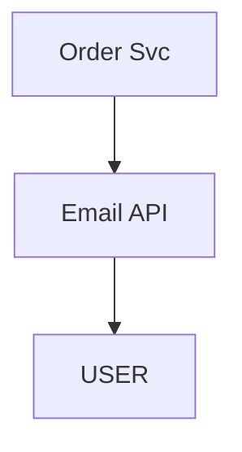
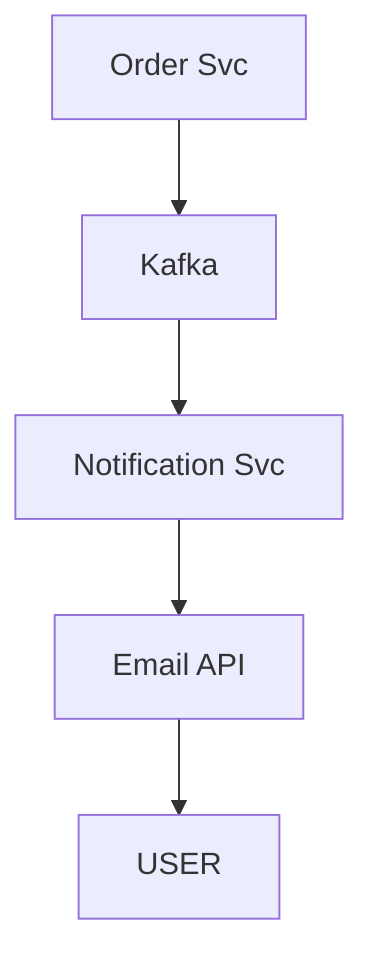
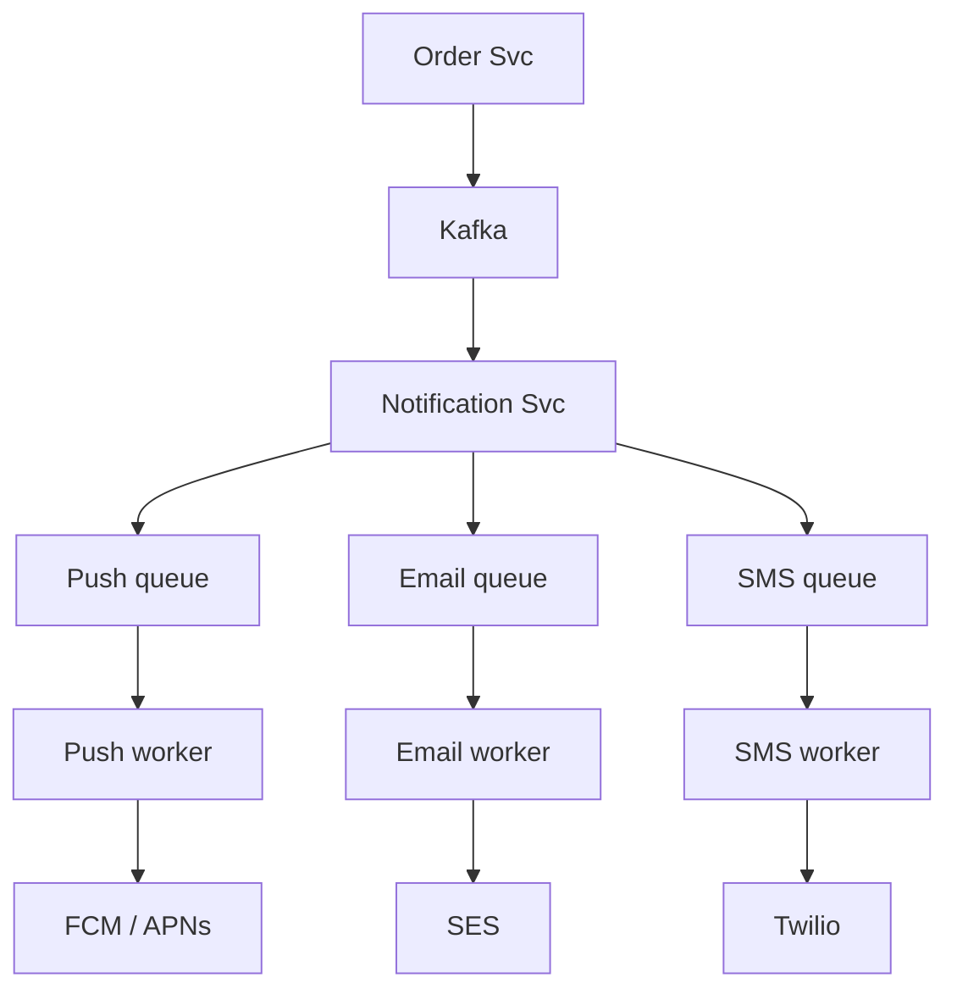
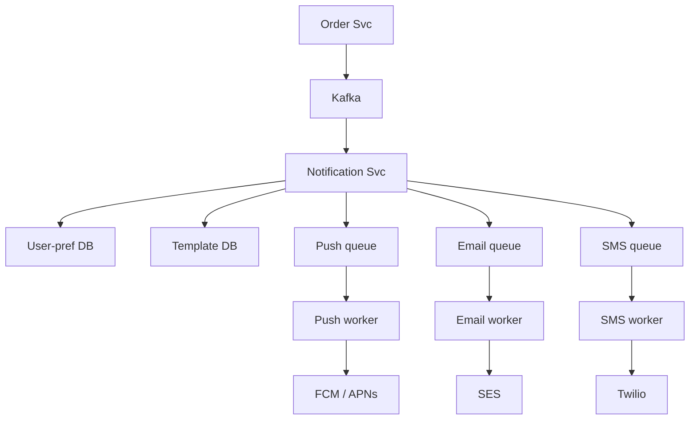
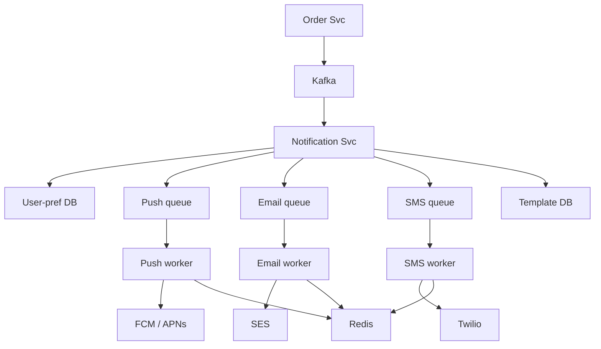
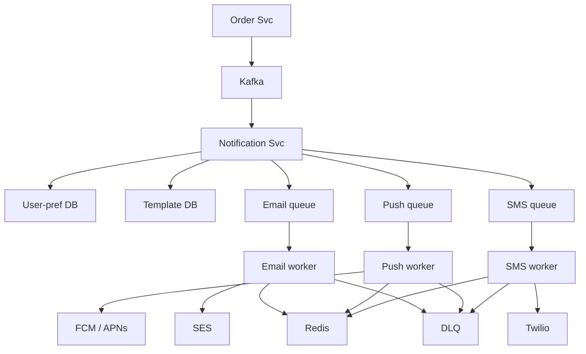
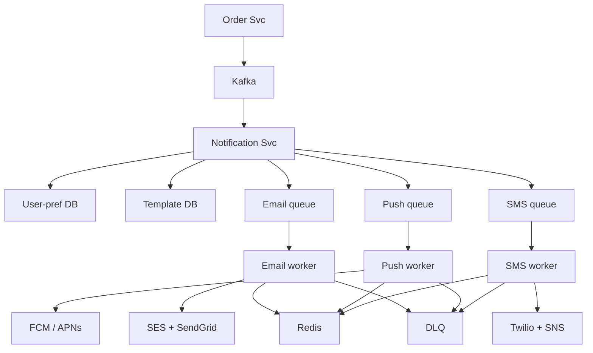
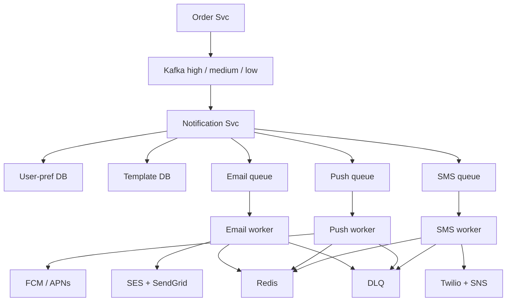
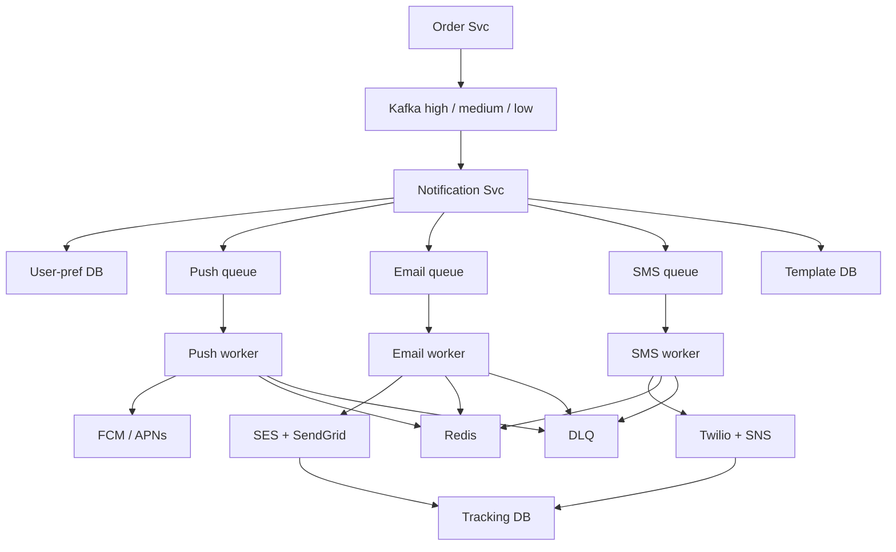

# Notification System

> Event aaye -> sahi CHANNEL -> sahi USER -> sahi TIME, bharose ke saath, scale pe.
> Is design ka dil: **ek event -> kai channel / kai user (fanout)** + **kabhi khoye nahi, do baar jaaye nahi** + **OTP turant**.

```
Amazon order placed -> Push + Email + SMS + In-app = EK event, KAI channel
SHAADI-CARD: 1 shaadi -> 500 log, sabko alag raaste se nyota:
   family = WhatsApp (in-app) · office = email · padosi = card (SMS) · VIP = phone (priority)
   notification system = shaadi ka planner
```

---

## TASVEER (ByteByteGo / Alex Xu · CC BY-NC-ND 4.0)


Source: [How Does a Typical Push Notification System Work?](https://bytebytego.com/guides/how-does-a-typical-push-notification-system-work/)
(poora naksha: event -> notification service -> queue -> worker -> provider FCM / APNs / SMS)

---

## SHURU — poocho + numbers

```
POOCHO:  "Sirf delivery pipeline, ya preferences + template bhi?"
         CHANNEL kaunse? push / email / SMS / in-app · user ko din me kitni? (~5)
         PRIORITY tiers? (OTP turant, marketing ruk sakti)  <- zaroori: ek queue = OTP 10 min late = asli fail
         real-time ya thodi der chalegi?

USE CASE: order placed -> push + email · OTP -> SMS turant · sale offer -> push, ruk sakta
          scope bahar: analytics dashboard

NFR (core 6): FANOUT (1 event -> kai user + channel) · ASYNC (producer ruke na) · RELIABLE (retry + DLQ)
              SCALE (~100K / sec) · PRIORITY (OTP fast lane) · PREFERENCE (user ki marzi)

NUMBERS: 100M user x 5 / din = 500M / din = ~5,800 / sec avg · SALE PEAK 10x = ~58,000 / sec
         fanout se aur: 58K x 3 channel = ~1.75 lakh / sec Kafka me -> partition + worker PEAK pe, avg pe nahi
         1 worker ~1000 / sec -> peak pe ~175 worker (channel-wise bata)
         tracking ~90 TB / saal (Cassandra) · Kafka 7 din retention ~3 TB
         spiky -> QUEUE (Kafka) · write-heavy tracking -> NoSQL
```
```
POOCHEGA: "What if traffic suddenly spikes 10x?"
BOL:      "Kafka absorbs the burst and workers drain at their own pace. Sale time is known, so I scale
           workers before 12 — autoscaling takes minutes, the spike takes seconds — and cap them at what
           the DB and providers can take."
```

---

## DABBA 0 — sabse simple

```
SOLUTION: Order service seedha email API call kare
```


---

## DIKKAT 1 — Order email ke intezaar me ruka, email down = ORDER fail

```
DIKKAT:   Order service email bhejne tak ruki rehti; email service down = order hi fail. Koi retry nahi.

SOLUTION: (1) Beech me QUEUE: Order service event Kafka pe daal ke turant laut jaaye.
          (2) Email down -> event queue me pada rahega, wapas aane pe nikal jaayega.

NAYA:     Kafka · Notification Svc

KAISE:    Kafka = disk pe append-only log (topic). Order svc event ko end me likh ke laut aata
          Notification svc apni jagah (offset) yaad rakhta -> wahan se padhta. Email down -> offset aage nahi
          badha -> wapas aane pe wahin se. Event retention tak (jaise 7 din) pada rehta
KYUN YE:  Order svc ke andar hi retry kyun nahi -> order request utni der atki + Order svc gira = retry bhi gaya
          SQS / RabbitMQ bhi chalte; Kafka isliye ki bahut zyada event + replay + partition se ek user ka kram
```
```
AGLA SAWAAL (tere jawab se):
  "Kafka me event likhne se pehle Order svc gira (order DB me ban gaya)?"
   -> order bana, notification gaya hi nahi. Ilaaj = outbox: order + event EK DB transaction me, relay
      baad me Kafka bheje
  "Notification svc kitne box? Kafka ko kaise baant-te?"
   -> sab ek consumer group me; har partition ek box ko -> box badhao = partitions bat jaate
```


---

## DIKKAT 2 — teen channel, SMS slow to push / email bhi atke

```
DIKKAT:   push, email, SMS teeno ek line me -> SMS slow hua to push aur email bhi atke.

SOLUTION: (1) Notification service FANOUT kare: har channel ki apni queue + apne worker.
          (2) Push -> FCM / APNs · email -> SES / SendGrid · SMS -> Twilio / SNS.

NAYA:     Push / Email / SMS queue · Push / Email / SMS worker
BADLA:    Email API -> FCM / SES / Twilio (har channel ka provider)

KAISE:    har channel ka alag Kafka topic (push / email / sms) + apna consumer group (apne workers)
          SMS dheema -> sirf sms topic ka lag badhta, email workers apni speed se
          har channel ke workers alag ginti me (email 10, sms 3) -> jiski zaroorat, wahi badhao
```
```
AGLA SAWAAL (tere jawab se):
  "Ek event ko teen channel chahiye -> teen baar banega?"
   -> Notification svc ek event se teen chhote message banata, har topic me ek; har ek ki apni key (eventId + channel)
  "Push token kahan se (kis phone pe bhejein)?"
   -> app install pe device token (FCM / APNs) user ke saath save; token invalid aaya to hata do
```


---

## DIKKAT 3 — user ko SMS chahiye hi nahi tha, aur raat 2 baje bhej diya

```
DIKKAT:   user ne SMS band kar rakha tha, phir bhi bhej diya, aur raat 2 baje.

SOLUTION: Bhejne se pehle Notification service:
          (1) PREFERENCE dekhe: kaunse channel on, quiet hours, kis topic se unsubscribe.
          (2) TEMPLATE le: message ka saancha, user ki bhasha me.
          (3) CHANNEL tay kare.
          Preference + template har event pe chahiye -> cache.

NAYA:     User-pref DB (user ko kaunsa channel, quiet hours) · Template DB (message ka saancha, {{orderId}} jaisa)
```
```
BOARD PE: user 123 = push ON · email ON · SMS OFF · quiet 10pm-8am
          template: "Order #{{orderId}} confirmed" (Hindi / English) -> channel: push + email (SMS skip)

AGLA SAWAAL (tere jawab se):
  "Quiet hours me aaya notification phenk doge?"
   -> nahi. Marketing -> subah tak rok (delay queue / schedule). OTP / security -> quiet hours me bhi
  "User ne pref badla, cache purana?"
   -> pref update pe cache key DEL + chhota TTL
```


---

## DIKKAT 4 — ack kho gaya, retry hua, user ko DO email

```
DIKKAT:   provider ne message le liya, par uska "ho gaya" raaste me kho gaya -> retry -> user ko DO email.

SOLUTION: (1) Worker IDEMPOTENT: bhejne se pehle Redis me event ID "set if not exists" (atomic).
              Naya -> bhejo · pehle se -> skip.
          (2) Key = event ki APNI ID (har retry pe wahi). Har baar naya UUID = dedup kabhi nahi pakdega.
          (Wahi race aur wahi ilaaj jo payment idempotency me.)

NAYA:     Redis (idempotency key)
```
```
BOARD PE: SET notification:abc123 sent NX EX 86400
          "OK" -> naya -> BHEJO · nil -> pehle ho chuka -> SKIP   (SET ... NX "OK" deta; "1" purane SETNX ka jawab)

POOCHEGA: "What if the same event comes twice / the worker retries?"
BOL:      "Delivery is at-least-once, so the worker is idempotent: it does SET NX on the event id in Redis
           and skips if the key already exists."

AGLA SAWAAL (tere jawab se):
  "Redis hi gir gaya, idempotency kaise?"
   -> DB me UNIQUE(eventId, channel) wali table, Redis sirf tez raasta
  "24 ghante ke baad wahi event aaya?"
   -> key expire ho chuki -> dobara bhejega. Kafka retention 7 din (replay ke liye) rehne do; pakka dedup = DB UNIQUE(eventId, channel), Redis key sirf tez raasta
```


---

## DIKKAT 5 — key laga di, par provider call FAIL

```
DIKKAT:   dedup key laga di, phir provider call FAIL. Retry aaya, key pehle se -> skip.
          Email gaya hi nahi, par system maan raha "bhej diya" = MESSAGE KHO GAYA.

SOLUTION: (Sirf "fail pe key hata do" kaafi nahi: worker hi crash hua to key hatane wala koi nahi.)
          Key ki DO haalat:
          (1) Bhejne se pehle "sending" (chhoti expiry). Success pe "sent" (lambi expiry).
          (2) Worker beech me mara -> "sending" khud mit jaata -> retry chal jaata.
          (3) Send fail + worker zinda -> key turant hatao.
          Retry ko "sending" mile -> thoda ruk ke dobara. Skip sirf "sent" pe.

NAYA:     koi dabba nahi
```
```
BOARD PE: SET NX -> "OK" · provider FAIL · retry: SET NX -> nil -> SKIP -> message kho gaya
          pehle:      SET abc-123 "sending" NX EX 60     (chhoti expiry)
          success pe: SET abc-123 "sent" EX 86400        (lambi)

POOCHEGA: "You set the idempotency key, but then the send failed. Now what?"
DHYAAN:   payment me bhi yahi: key lagi, PSP fail -> IN_PROGRESS -> DONE
BOL:      "I don't want the key to block the retry. I set it as 'sending' with a short TTL, and mark it
           'sent' only after the provider accepts. If the send fails I delete the key; if the worker dies, the
           short TTL expires it — either way the retry goes through. I only skip when the key says 'sent'."

AGLA SAWAAL (tere jawab se):
  "60 sec ki 'sending' chhoti ho gayi (provider 70 sec me jawab de)?"
   -> TTL provider timeout se lambi rakho (timeout 10 sec -> TTL 60)
  "Provider ne bheja par humein jawab nahi aaya?"
   -> phir bhi do email ho sakte. jo provider idempotency key leta ho wahan bhejo; SES / Twilio pe ye nahi -> duplicate ka chhota risk maana hua
```


---

## DIKKAT 6 — provider fail ho raha, hum turant retry maar rahe

```
DIKKAT:   provider fail ho raha aur hum turant retry maar rahe -> marte hue provider pe aur hathoda.

SOLUTION: (1) Retry ke beech BACKOFF (dugna intezaar) + JITTER (thoda random) -> sab ek saath wapas nahi.
          (2) Fail -> retry queue -> had paar -> DLQ -> manual review + alert (galat email, invalid phone).
          (3) Kafka offset kaam ke BAAD commit (crash = event dobara, khoya nahi). Producer acks=all.

NAYA:     DLQ
```
```
BOARD PE: 1s -> 2s -> 4s -> 8s · wait = base x 2^n + random(0..1000ms)
          main queue -> fail -> retry queue (delayed) -> max retry -> DLQ

POOCHEGA: "How do you make sure no message is lost?"
BOL:      "Producers write with acks=all to replicated Kafka. Workers commit the offset only after the
           provider call, so a crash means a redelivery, not a loss — and that's why they're idempotent.
           Retries back off with jitter, and after max retries the message goes to a DLQ, never dropped."

AGLA SAWAAL (tere jawab se):
  "Kafka me 'delayed' retry queue kaise banti (Kafka me delay nahi)?"
   -> alag retry topics (retry-1m, retry-10m). Worker message me 'kab chalana' ka time dekhta, abhi nahi to
      ruk ke / dobara daal deta
  "DLQ me pade message ka kya?"
   -> alert + dashboard, theek karke wapas main topic me daalne ka tool (replay)
```


---

## DIKKAT 7 — provider slow, saare worker uske 30 sec timeout me phase

```
DIKKAT:   provider slow, har call 30 sec atki -> saare worker phase, system thapp.
          Slow provider down provider se bhi BURA.

SOLUTION: (1) Har provider call pe CHHOTA timeout.
          (2) Har channel ke do provider (SMS: Twilio + SNS · email: SES + SendGrid).
          (3) CIRCUIT BREAKER: kai baar fail -> circuit khula, us provider pe call band, backup pe bhejo.
              Thodi der baad ek test call; theek to wapas chalu.

BADLA:    email + SMS ka ek provider -> do (SES + SendGrid · Twilio + SNS); push ka backup nahi (FCM = Android, APNs = iOS, alag platform)
```
```
BOARD PE: CLOSED --N fail--> OPEN (call band, backup pe) --thodi der--> HALF-OPEN (ek test call)
          theek -> CLOSED · fail -> wapas OPEN

POOCHEGA: "What if the provider is slow?"
BOL:      "Short timeouts, a circuit breaker per provider, and a second provider per channel. When the
           circuit opens, workers stop calling it and route to the backup instead of hanging."

AGLA SAWAAL (tere jawab se):
  "Circuit OPEN se HALF-OPEN kab?"
   -> tay waqt (jaise 30 sec) baad ek-do test call. Chali to CLOSED, fail to phir OPEN
  "Dono provider down?"
   -> message queue me ruke (drop nahi), backoff, circuit khulne ka intezaar; OTP ke liye alert
```


---

## DIKKAT 8 — OTP marketing ke 50,000 message ke peeche

```
DIKKAT:   ek hi topic me sab -> OTP marketing ke 50,000 message ke peeche khada.

SOLUTION: (1) PRIORITY LANES: alag Kafka topic + alag worker pool -> OTP (ms) · order update (sec) ·
              marketing (minute). Kafka me priority hoti hi nahi, isliye alag topic.
              (Java PriorityBlockingQueue sirf ek process ke andar, distributed me nahi.)
          (2) Channel queue bhi priority-wise (SMS high / low), warna OTP SMS phir peeche atkega.

BADLA:    Kafka -> 3 topic (high / medium / low)
```
```
BOARD PE: HIGH OTP / 2FA -> notif-high · MEDIUM order update -> notif-medium · LOW marketing -> notif-low
          sms-high / sms-low (alag workers)

POOCHEGA: "How do you prioritize urgent work, like OTPs?"
BOL:      "Separate topics per priority with their own worker pools, so an OTP never waits behind a
           marketing blast."

AGLA SAWAAL (tere jawab se):
  "High topic khaali, low me bheed -> high ke workers baithe rahenge?"
   -> haan, thoda bekaar. Chahe to high workers khaali hon tab medium bhi padhein (par kabhi ulta nahi)
  "OTP ka bhi provider limit laga?"
   -> OTP ke liye alag provider account / short code -> marketing usse kha na sake
```


---

## DIKKAT 9 — burst gaya, provider ne 429 diya, sab fail

```
DIKKAT:   ek saath bahut message, provider ne apni limit pe 429 de diya, sab fail.

SOLUTION: (1) Worker khud raftaar kam kare (token bucket), provider ki limit ke andar.
          (2) 429 -> backoff + jitter, provider ka Retry-After maano. Message queue me rukta, drop nahi.
          ★ Yahan fail-open nahi: provider ka darwaza hum nahi khol sakte. (HANDS-ON neeche.)

NAYA:     koi dabba nahi — worker me throttle

KAISE (throttle sab workers me):
          har worker ne provider ki poori rate li to 100 worker = 100x -> phir 429
          (1) har worker ko hissa: rate / workers (100 / sec, 10 worker = 10 / sec har ek)
          (2) ya Redis me EK shared token bucket -> har worker bhejne se pehle token le (Lua, atomic)
```
```
BOARD PE: FCM ~6 lakh / min per project (~10K / sec) · SES ~14 / sec (naye account ka default, badhwa sakte)
          Twilio short code ~100 / sec, long code ~1 / sec · naive me 1000 me se 700 phenke

POOCHEGA: "The provider returns 429 — you're sending too fast. What now?"
BOL:      "Workers throttle themselves with a token bucket at the provider's rate. On a 429 they back off
           with jitter and respect Retry-After; messages wait in the queue and go to a DLQ after max
           retries, never dropped."

AGLA SAWAAL (tere jawab se):
  "Workers badhe (autoscale), hissa kaun badlega?"
   -> isliye shared Redis bucket behtar: kitne bhi worker, total rate wahi
  "Provider ki limit hi kam hai (SES 14 / sec) aur 1 lakh email?"
   -> limit badhwao (request) + kai account / provider; tab tak queue dheere khaali
```


---

## DIKKAT 10 — "bhej diya" ka matlab "mil gaya" nahi

```
DIKKAT:   worker ne bheja = provider ne le liya. User tak pahuncha ya nahi, pata hi nahi.

SOLUTION: (1) Provider WEBHOOK (delivered / failed / bounced) -> TRACKING DB me likho
              (sent, delivered, opened, clicked, failed).
          (2) Failed (galat number / bounce) -> retry, doosra channel, ya failed mark.
          (3) Push me webhook nahi -> app khulne pe app khud ack event bheje.

NAYA:     Tracking DB (har message ka haal: sent / delivered / failed)

KAISE:    bhejte waqt provider jo message_id deta (SES MessageId / Twilio SID) wo Tracking DB me apne
          notificationId ke saath save -> webhook aaya to message_id se row dhoondh ke status update
KYUN YE:  status API ko baar-baar poochna (poll) -> lakhon message x har kuch sec = provider limit + kharcha
          webhook = provider khud batata, sirf jab badla
```
```
AGLA SAWAAL (tere jawab se):
  "Webhook nakli (koi aur bhej de)?"
   -> provider ka signature verify (HMAC / SNS signature), warna reject
  "Webhook aaya hi nahi?"
   -> kuch ghante baad 'sent' pe atke message ke liye ek baar status API poll (sirf bache hue)
```


---

## 10x SCALE — har dabba alag

```
Kafka            -> peak 10x -> partitions pehle se extra · partition by hash(user_id)
Notification Svc -> pref / template CACHE · box badhao
channel queue    -> alag queue (ho gaya) + priority lane
worker           -> peak pe badhao (1 worker ~1000 / sec) · circuit breaker + multi-provider · throttle
Tracking DB      -> 90 TB / saal -> Cassandra + row pe TTL / purana cold storage
                    (retention size ghatata · shard load baant-ta — dono alag)

POOCHEGA: "Data keeps growing — what happens in 3 years?"
BOL:      "Tracking rows get a TTL and old data moves to cold storage; the live table stays small."

POOCHEGA: "How would you scale this to 10x?"      -> event ka raasta chalo, pehle jo toote
POOCHEGA: "What's the single point of failure?"   -> provider (multi-provider), Kafka (replication)
POOCHEGA: "How do you know it's working?"         -> "bheja" nahi — webhook se delivered / failed ·
                                                     Kafka consumer lag · DLQ size · alert
```

---

## POOCHE TO (deep-dive)

```
EVENT:    producer Kafka pe { event: "ORDER_PLACED", userId: 123, orderId: 999 }
          (andar ke liye REST bhi: POST /notify { userId, type, channel?, payload })

CHANNEL:  Push FCM (Android) / APNs (iOS) · Email SES / SendGrid / Mailgun · SMS Twilio / SNS / MSG91
          In-app DB + WebSocket · Voice Twilio · Slack webhook

DB:       USER-PREF: user_id -> channels · quiet hours · unsubscribed topics
          TEMPLATE:  template_id -> format · i18n · variables {{name}} {{orderId}}
          TRACKING:  sent / delivered / opened / clicked / failed -> Cassandra
                     (bahut + simple + write-heavy, ACID nahi chahiye, horizontal scale)

100K / sec:  ~100 worker · topic "notifications" P0 -> W1 ... P99 -> W100
             partition by hash(user_id) -> ek user ke event EK partition -> ORDER bana rahe
             (warna "shipped" pehle, "placed" baad me)

WALKTHROUGH:  order -> Order Svc Kafka pe { ORDER_PLACED, 123, 999 } -> Notif Svc uthaye -> pref
              (push ON, email ON, SMS OFF) -> template bhare -> push + email queue -> worker -> provider
              -> user -> webhook -> Tracking DB · fail -> retry -> DLQ
```

---

## AAKHRI DABBA + WRAP

```
Kafka = decouple + spike + priority topic · Notification Svc = pref + template + fanout
channel queue = apni speed · worker = idempotent (SET NX) + backoff / jitter + circuit breaker + throttle
DLQ = poison baaki ko na roke · Tracking DB = "bheja" vs "mila"
```
```
BOL: "Services publish events to Kafka. The notification service checks preferences, fills the template
      and fans out to per-channel queues. Workers are idempotent with Redis SET NX, retry with backoff and
      jitter, throttle to the provider's limit, use a circuit breaker with a backup provider, and send to
      a DLQ after max retries. OTPs have their own topic. Partitioning by user id keeps per-user order,
      and provider webhooks update the tracking DB. Next: quiet hours, i18n templates, open / click analytics."
     (asli duniya: Uber ride notification · Amazon order update · Slack · WhatsApp · bank alert)
```


---

## HANDS-ON — provider ne 429 diya: chala ke dekha

> Grill me galti: 429 pe "fail-open" bola. Fail-open HUMARE limiter ka faisla (Redis gira to); yahan limiter
> PROVIDER ka, uska darwaza hum nahi khol sakte -> dheema HUMEIN hona padega.
> CODE: `04_HLD/HANDS_ON/03_provider_429/Sms429Demo.java` (Docker nahi, time nakli) · line 21 `SMART = false / true` -> `java Sms429Demo.java`

```
SETUP:  1000 SMS ek saath · provider 100 / sec · t=3,4 pe 50 / sec
NAIVE:  sab ek saath, 429 pe agle second turant retry, 3 fail -> PHENK DO
SMART:  apni taraf 100 / sec (token bucket) · 429 pe 1s, 2s, 4s · kabhi phenko mat
```
```
NAIVE      t | provider | queue | bheje | 200 | 429 | chhode | pahunche
           0 |  100/sec |  1000 |  1000 | 100 | 900 |      0 | 100
           1 |  100/sec |   900 |   900 | 100 | 800 |      0 | 200
           2 |  100/sec |   800 |   800 | 100 | 700 |    700 | 300
           PAHUNCHE 300 / 1000 · CHHODE 700 · call 2700 (429 = 2400)

SMART      t | provider | queue | bheje | 200 | 429 | chhode | pahunche
           0 |  100/sec |  1000 |   100 | 100 |   0 |      0 | 100
           1 |  100/sec |   900 |   100 | 100 |   0 |      0 | 200
           2 |  100/sec |   800 |   100 | 100 |   0 |      0 | 300
           3 |   50/sec |   700 |   100 |  50 |  50 |      0 | 350
           4 |   50/sec |   650 |   100 |  50 |  50 |      0 | 400
           5 |  100/sec |   600 |   100 | 100 |   0 |      0 | 500
           6 |  100/sec |   500 |   100 | 100 |   0 |      0 | 600
           7 |  100/sec |   400 |   100 | 100 |   0 |      0 | 700
           8 |  100/sec |   300 |   100 | 100 |   0 |      0 | 800
           9 |  100/sec |   200 |   100 | 100 |   0 |      0 | 900
          10 |  100/sec |   100 |   100 | 100 |   0 |      0 | 1000
           PAHUNCHE 1000 / 1000 · CHHODE 0 · call 1100 (429 = 100)

           NAIVE 3 sec, jaldi par 700 kabhi nahi milenge · SMART 11 sec, dheere par sab pahunche
DARWAZA:   1 sec me 100 nikal sakte · 1000 dhakka maarein -> 100 nikle, baaki 3 dhakke ke baad ghar
           SMART = line lagwao, 100-100
```
```
THROTTLE  raftaar provider ki limit pe baandho
BACKOFF   429 pe 1s, 2s, 4s · Retry-After aaye to wahi
JITTER    thoda random farak (simulation me nahi, time poore second me)
QUEUE     jo abhi nahi ja sakta wo queue me ruke · max try ke baad DLQ, drop nahi

BOL: "I simulated it: naive retry dropped 700 of 1000, throttle plus backoff delivered all 1000."
```

ARCHETYPE B (ingest) · CONCEPTS: [message-queues](../../FOUNDATIONS/07_message_queues.md) · [ms-communication](../../FOUNDATIONS/10_ms_communication.md) · saath: [12 message-queue](../12_message_queue_kafka/12_message_queue_kafka.md) · [← MASTER SHEET](../../00_MASTER_SHEET.md)
