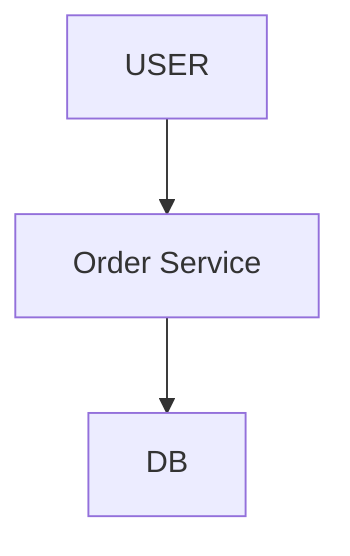
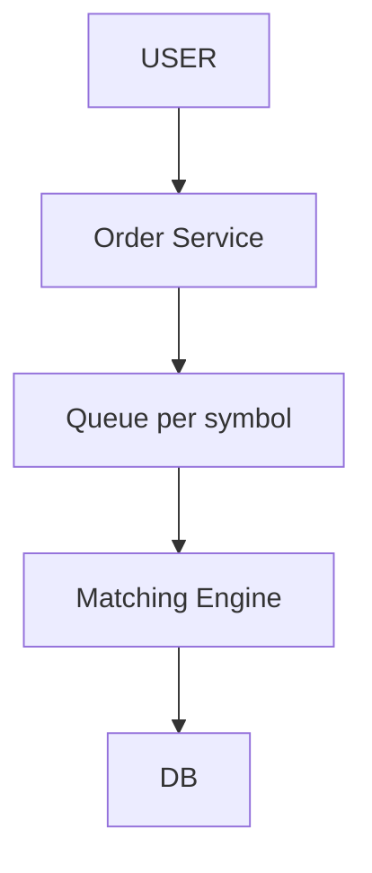
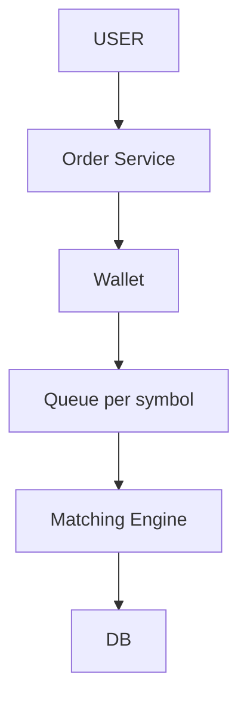
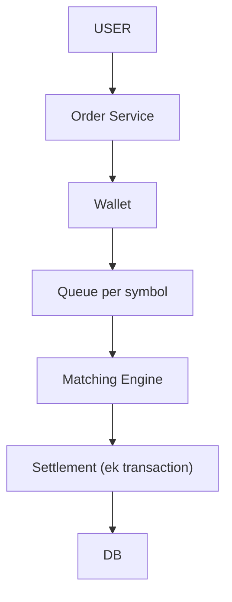
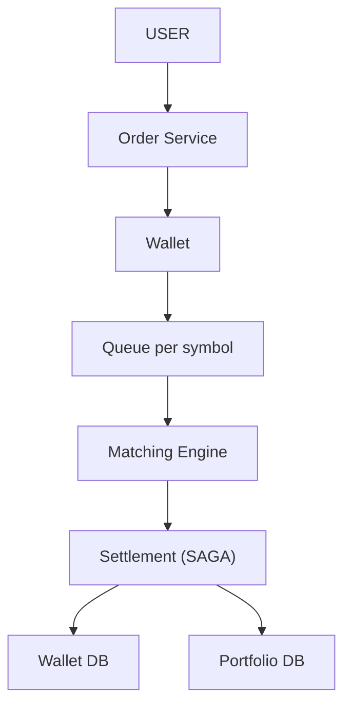
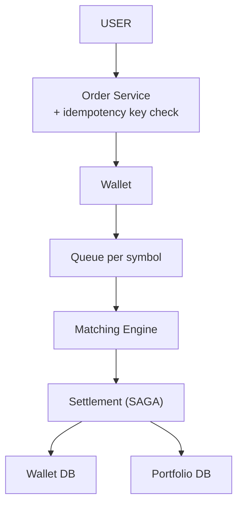
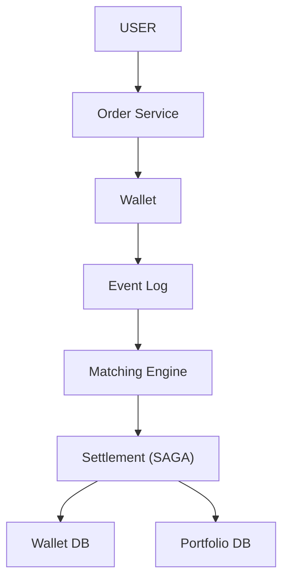
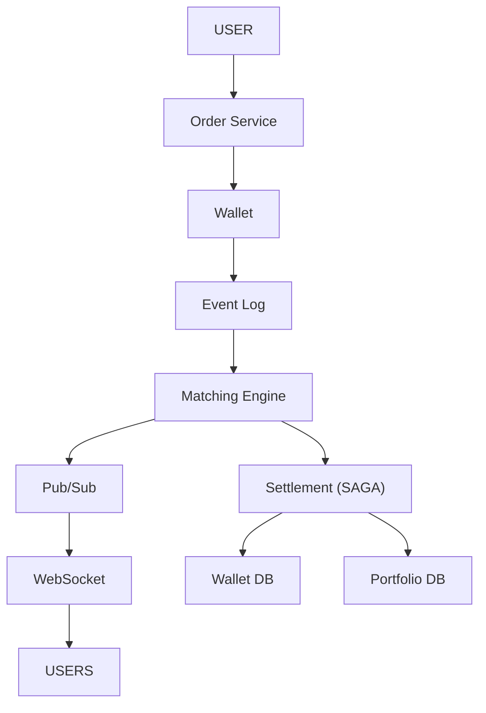
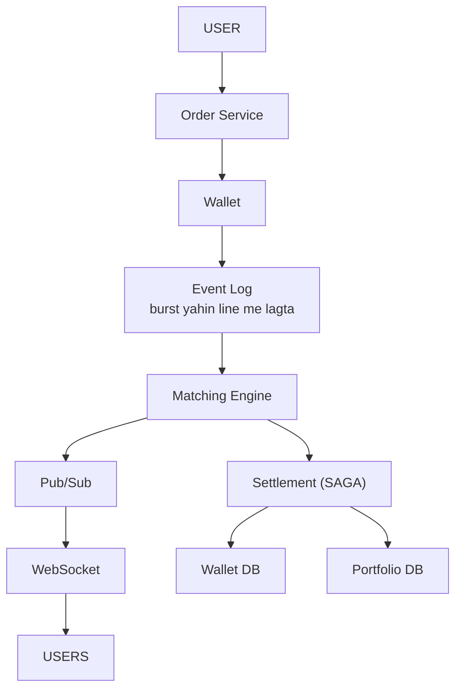

# Stock Broker / Trading Platform

> User BUY / SELL order de -> system MATCH kare -> paisa + share sahi move ho -> live price dikhe.
> Is design ka dil: **paisa = strong consistency** + **matching = microseconds**.
> Finance interview GOLD (JP / GS): consistency, ACID, idempotency, ledger, audit — FAANG-hyperscale nahi. Konovo fraud-domain se bridge.

---

## TASVEER (ByteByteGo / Alex Xu · CC BY-NC-ND 4.0)


Source: [Design Stock Exchange](https://bytebytego.com/guides/design-stock-exchange/)


Source: [Low Latency Stock Exchange](https://bytebytego.com/guides/low-latency-stock-exchange/)

---

## SHURU — poocho + numbers

```
POOCHO:  "Trading bada hai — matching, price feed, risk, settlement. Kis pe focus karein?"
         -> order MATCHING + paise / share ka SETTLEMENT. Risk / margin / IPO / mutual funds scope me nahi.
         LIMIT + MARKET dono? · PARTIAL fill chalega? · hum EXCHANGE hain ya BROKER (jo exchange ko bhejta)?

FR:      buy / sell · order match · paisa + share move · live price · cancel / status
NFR:     paisa CONSISTENT (strong, kabhi eventual nahi) · FAST · FAIR (pehle aaya pehle) · audit

NUMBERS: ~50 lakh users · ~50 lakh orders / din · normal ~250 / sec, market khulte hi PEAK 10,000+ burst
         price feed = CRORE reads / sec (sab dekh rahe)
         -> matching RAM me · price feed PUSH (poll nahi) · paisa SQL + ACID
         speed wala + temporary (order book) = RAM · paisa wala + permanent (wallet / ledger) = SQL / ACID
```

---

## DABBA 0 — sabse simple

```
SOLUTION: order DB me rakho, milta-julta sell dhoondho -> match
```


---

## DIKKAT 1 — do order ek hi stock pe ek saath (RACE)

```
DIKKAT:   do log ek hi stock pe ek saath order daalte — do thread dono ko match kar dein to jitne
          share the usse zyada bik jaate = DOUBLE MATCH

SOLUTION: har stock (symbol) ki EK queue aur EK thread — orders ek ke baad ek match hote, to race ho hi
          nahi sakti, lock bhi nahi chahiye. Order book RAM me, microseconds me kaam.
          Lock kyun nahi: exchange ki speed pe lock = slow + deadlock ka darr; ek line me race possible hi
          nahi. Ye har trading system ka niyam hai.

NAYA:     Queue per symbol · Matching Engine (buy aur sell order milaane wala, order book RAM me)
```

```
BOARD PE: seller ke 10 share · Ramesh BUY 10 + Mohan BUY 10 ek saath -> 20 bik gaye, the 10
          TCS -> T1 · INFY -> T2

POOCHEGA: "Two users order the same stock at the same time — what happens?"
DHYAAN:   "DB ACID rok dega" NAHI — matching DB me hai hi nahi, aur ACID akela check-phir-write race nahi rokta
BOL:      "Orders for one symbol go into one queue handled by one thread, so they're matched one after
           the other, never in parallel — no lock needed."

AGLA SAWAAL (tere jawab se):
  "Hazaar symbol = hazaar thread?"
   -> nahi, thode thread, har thread kai symbol (hash(symbol) % threads). Ek symbol hamesha ek hi thread pe
  "Woh thread hi atak gaya (GC pause)?"
   -> us symbol ke order line me rukenge; isliye Java me chhoti memory / low-GC, aur ek standby jo log se uth sake
```

---

## DIKKAT 2 — wallet me 50k, banda 30k-30k ke DO order daal de (DOUBLE SPEND)

```
DIKKAT:   wallet me jitna paisa hai usse zyada ke do order ek saath daal diye, dono match ho gaye
          = DOUBLE SPEND

SOLUTION: order lagte hi paisa BLOCK karo, kaato nahi — hotel / petrol pump ke deposit jaisa. Available
          = total minus blocked; kam pada to doosra order reject. Match hua tab sach me kato, cancel hua to
          unblock, pending hai to blocked hi pada rahe.
          DB me ek hi atomic update: block tabhi badhe jab available bacha ho — 0 row badli = reject.

NAYA:     Wallet (user ka paisa: total / blocked / available)
```

```
BOARD PE: total 50k · blocked 30k · available 20k -> 30k ka doosra order REJECT
          UPDATE wallet SET blocked = blocked + x WHERE total - blocked >= x   (0 row = reject)

AGLA SAWAAL (tere jawab se):
  "Block kiya, order 3 din pending pada raha?"
   -> order ki expiry (day order shaam ko khatam) -> unblock
  "Partial match (10 me se 6 bike)?"
   -> 6 ka paisa kato, baaki 4 ka blocked wahi rahe
```

---

## DIKKAT 3 — settlement ke beech crash

```
DIKKAT:   settlement ke beech crash — buyer ka paisa kat gaya, seller ko milne se pehle crash
          -> paisa gayab

SOLUTION: saare step EK transaction me (ACID) — sab hoga ya kuch nahi, crash hua to rollback.
          Spring me @Transactional yahi karta.
          LEDGER double-entry: jitna ek se gaya utna doosre ko mila, total same — audit ke liye.
          Like-count jaisi cheez eventual chal jaati, PAISA hamesha strong consistency.

NAYA:     Settlement (match ke BAAD paisa + share sach me badalne wala dabba — kaam ka naam; yahan wo kaam
          EK TRANSACTION se hota. dikkat 4 me do DB ho jaate, tab wahi kaam SAGA se. Settlement = KYA, transaction / SAGA = KAISE)
```

```
BOARD PE: BEGIN  buyer -30k +10 share · seller +30k -10 share  COMMIT

AGLA SAWAAL (tere jawab se):
  "Double-entry ledger kaise dikhta?"
   -> har settlement ki do row: buyer DEBIT 30k, seller CREDIT 30k. Sab rows ka jod hamesha 0 -> galti turant dikhe
  "Balance ledger se har baar jodoge?"
   -> nahi, balance alag column jo ussi transaction me badalta; ledger = sach ka record / audit
```

---

## DIKKAT 4 — paisa Wallet DB me, share Portfolio DB me (alag DB)

```
DIKKAT:   paisa Wallet DB me, share Portfolio DB me — do alag DB pe ek transaction chal hi nahi sakti.
          Wallet se paisa kata, portfolio me share dalne se pehle crash = paisa gaya, share nahi.

SOLUTION: SAGA: bada kaam chhote local steps me todo, har step apne DB me commit. Koi step fail hua to
          pichhle steps ka ULTA step chalao (compensate) — jaise flight ho gayi, hotel nahi mila, to flight
          cancel + refund.
          ACID = ek DB, turant · SAGA = kai service, code se undo.

BADLA:    ek [ DB ] -> do me bata: Wallet DB + Portfolio DB · Settlement ab SAGA chalata

KYUN SAGA (2PC nahi):
          2PC: coordinator dono DB se "ready?" poochta, dono lock pakad ke rukte, phir "commit"
          -> coordinator beech me gira to dono DB lock pakde atke · har step pe network intezaar = dheema
          SAGA: har step apna local commit turant, fail pe ulta step -> koi lamba lock nahi
          keemat: beech me thodi der galat haalat dikh sakti (paisa kata, share abhi nahi)
KAISE (state kahan):
          orchestrator (Settlement) har step ka haal apne DB me likhta: STARTED -> WALLET_DONE -> PORTFOLIO_DONE
          orchestrator gira -> uthte hi DB dekh ke wahin se aage / ulta
```

```
BOARD PE: wallet -30k ✓ -> portfolio +10 ✗ -> COMPENSATE: wallet +30k wapas

AGLA SAWAAL (tere jawab se):
  "Compensation (wallet +30k wapas) bhi fail ho gaya?"
   -> retry karte raho (idempotent step) + alert; paisa ka ulta step chhodna nahi
  "Orchestration ya choreography?"
   -> orchestration (ek Settlement sab chalaye) -> paisa me saaf dikhta kaun-sa step kahan atka
      choreography = har service event sun ke apna kare, simple flow me theek
```

---

## DIKKAT 5 — user ne BUY do baar daba diya / network ne retry maara

```
DIKKAT:   user ne BUY do baar daba diya, ya network ne retry maara -> ek order do baar laga, do baar paisa

SOLUTION: IDEMPOTENCY KEY: har request ke saath ek unique key. Server yaad rakhta "ye key ho chuki" —
          dobara aayi to wahi purana result, naya order nahi. (GPay pe double click = ek hi charge.)

NAYA:     koi dabba nahi — Order Service me key check juda

KAISE:    client har order pe ek key banata (UUID), retry pe WAHI key
          server: INSERT idempotency(key, response) -> key UNIQUE constraint
          naya = insert ho gaya, order lagao, response save · pehle se = UNIQUE fail -> saved response wapas
          do request ek saath aayi -> DB unique ek ko hi jeetne deta (atomic check-and-set)
```

```
AGLA SAWAAL (tere jawab se):
  "Pehli request abhi chal hi rahi thi aur retry aa gaya?"
   -> key ka status IN_PROGRESS -> retry ko '409 / thoda ruko' -> DONE hone pe saved result
  "Key kitne din rakhoge?"
   -> 24 ghante jaisa (retry window), phir saaf
```

---

## DIKKAT 6 — order book RAM me hai, server crash = sab gayab

```
DIKKAT:   order book RAM me hai — matching server gira to book aur saare pending order gayab

SOLUTION: EVENT LOG / SEQUENCER: har order PEHLE append-only log me (disk / Kafka), sequence number ke
          saath, PHIR book me. Crash hua to naya server log dobara chalata (replay) — ek thread hai, to book
          bilkul waisi hi ban jaati. Ye wahi write-ahead log wala tareeka hai.
          (Cricket: scoreboard gaya, scorer ke register se sab wapas.)
          Order sirf ek stock ke andar chahiye, poore market ka nahi — isliye key = symbol, alag stocks
          parallel chal sakte.
          Bonus: yahi log AUDIT trail bhi hai. Logging = engineer ke debug ke liye, kuch din, badal sakte.
          Audit = regulator ke liye, kaun-kya-kab, saalon tak, badla nahi ja sakta. Ek log, do kaam.

BADLA:    Queue per symbol -> Event Log (wahi queue, ab disk pe likhi jaati + seq no. + key = symbol)
```

```
BOARD PE: Ramesh 10:00:01, Mohan 10:00:02, dono BUY TCS @3000 -> Ramesh = #501, Mohan = #502
          key = TCS -> ek partition, isi kram me -> #501 pehle = Ramesh ko share

POOCHEGA: "How do you keep orders in the right sequence?"
DHYAAN:   TIMESTAMP nahi — do server ki ghadi alag, do order same millisecond
BOL:      "A sequencer stamps every order with an increasing sequence number and writes it to the log,
           keyed by symbol so one stock's orders stay in one partition, in order."

POOCHEGA: "What if the server crashes in the middle?"
DHYAAN:   DO jagah: (1) matching (RAM) -> log replay   (2) settlement (DB) -> rollback / SAGA
          sirf ek bola to AADHA · pehle matching (design ka dil)
MISAAL:   10:15 pe matching server gira, TCS book me 4,000 pending order
          naya server -> log #1 se #9,87,654 tak replay -> book bilkul waisi (single thread = same result)
          usi waqt ek settlement aadha (buyer -30k, seller +30k nahi) -> DB rollback -> dono wapas
BOL:      "If the matching engine dies, I rebuild the book by replaying the event log. If settlement
           dies midway, a single-DB transaction rolls back; across services a saga compensates."

AGLA SAWAAL (tere jawab se):
  "Replay me 1 crore event, kitna time?"
   -> roz/har kuch minute book ka SNAPSHOT + uske baad ka log -> replay chhota
  "Hot standby rakhoge?"
   -> haan, doosra server log padhta rehta (book RAM me taiyaar), primary gira to seconds me le leta
```

---

## DIKKAT 7 — lakhon log live price dekh rahe

```
DIKKAT:   lakhon log live price dekh rahe, har client baar-baar poochh raha (polling) -> lakhon
          request / sec -> server dead

SOLUTION: WEBSOCKET + PUB/SUB: connection ek baar khulta, price badle tab server khud bhejta.
          Price me sirf LATEST chahiye, purana store nahi karna (WhatsApp jaisa nahi) — reconnect pe user
          current price le leta.

NAYA:     Pub/Sub (ek price update, sab subscriber tak) · WebSocket (khula connection, server khud price bheje)

KAISE:    har symbol = ek channel (price:TCS)
          WebSocket server pe jis user ne TCS dekha, wo server price:TCS SUBSCRIBE karta
          price feed -> price:TCS pe PUBLISH -> Redis sab subscribed servers ko deta -> wo apne users ko push
          Redis kuch store nahi karta -> reconnect pe user current price alag se le leta
KYUN YE:  Kafka -> store + replay karta, yahan purana price bekaar, sirf latest chahiye
          SSE bhi chal jaata (sirf server -> client); WebSocket isliye ki order bhi isi connection pe
```

```
AGLA SAWAAL (tere jawab se):
  "Price second me 1000 baar badla, sab bhejoge?"
   -> nahi, conflate: har ~100ms sirf latest bhejo, beech ke chhodo
  "Ek WebSocket server pe kitne user?"
   -> lakh ke aas paas (event loop); zyada user = zyada servers, LB se baant
```

---

## DIKKAT 8 — market khulte hi AKELE TCS pe lakhon order

```
DIKKAT:   market khulte hi akele ek hi stock pe lakhon order — "stock ke hisaab se baanto" yahan kaam
          nahi aata, ek stock = ek thread

SOLUTION: book ko mat todo — ek book do thread me = double match wapas, aur pehle-aaya-pehle-paaya kram
          toot jaata. Ek thread RAM me, bina lock ke, bahut tez chalta (LMAX ka design yahi).
          Aage ka event log burst sambhaal leta: order line me lagte, thread apni speed se uthata
          (BACKPRESSURE). Spike me kuch drop nahi hota, bas thodi latency.
          Scale stocks ke beech karo (alag thread), ek stock ke andar kabhi nahi.

NAYA:     koi dabba nahi — Event Log hi kaam aaya
```

```
AGLA SAWAAL (tere jawab se):
  "Ek thread kitna jhel leta?"
   -> RAM me, lock ke bina -> lakhon order / sec (LMAX ka design yahi)
  "Event log me order kitni der line me rahe to user ko kya?"
   -> order 'ACCEPTED' turant, 'FILLED' jab match hua -> user ko dono status dikhte
```

---

## 10x SCALE — har dabba alag

```
Order Service (stateless)   -> zyada server + LOAD BALANCER
Portfolio / history         -> READ REPLICA (AWS RDS)
Matching (stateful)         -> LB + copy NAHI (do copy = do book = double match)
                               -> SHARD BY SYMBOL: TCS ek engine pe, INFY doosre pe
Kafka                       -> khud scale nahi hota -> PARTITION badhao (key = symbol)
Price feed                  -> WebSocket server badhao

POOCHEGA: "How would you scale this to 10x users?"
BOL:      "Stateless services scale horizontally behind a load balancer, read-heavy data gets replicas.
           The matching engine is stateful, so I shard it by symbol — each symbol lives on one engine."
```

---

## POOCHE TO (deep-dive)

```
ORDER BOOK:  SELLERS: sasta upar (3001, 3003...)   BUYERS: mehnga upar (2998, 2995...)
             match jab  best-bid >= best-ask
             PRICE-TIME priority: behtar price pehle, same price -> jo pehle aaya

LIMIT  = "3000 ya behtar, warna rukunga"   -> price pakka
MARKET = "jo bhav hai, abhi do"             -> time pakka
kab kya: sahi daam chahiye, jaldi nahi -> LIMIT · turant ghusna / nikalna -> MARKET

PARTIAL FILL: BUY 10, mile 6 -> 6 match, 4 pending -> naya seller @3000 aaya -> 4 bhi bhare
              FILLED / PARTIALLY FILLED / OPEN (Zerodha / Groww / NSE / BSE me yahi)

DB: money / orders = SQL + ACID · order book = RAM · ledger = append-only

API: POST /order {stock, side, qty, price, type, idempotencyKey} · DELETE /order/{id} · GET /order/{id}
     WS /prices?symbol=
```

---

## AAKHRI DABBA + WRAP

```
Order Service = validate + idempotency · Wallet = paisa BLOCK · Event Log = seq no. + replay + audit
Matching = 1 thread / symbol, book RAM, shard by symbol · Settlement = ek txn / kai DB = SAGA
```

```
BOL: "Order Service validates and checks the idempotency key, Wallet blocks the money, every order
      goes into an append-only log with a sequence number, and a single-threaded matching engine per
      symbol keeps the book in memory. Settlement is one transaction, or a saga across services.
      Prices go out over WebSocket via pub/sub. The log gives crash recovery and an audit trail.
      Next: stop-loss, circuit breakers, real-time risk checks, regulatory reporting."
```

ARCHETYPE C (transactional) · CONCEPTS: [db-what-when](../../FOUNDATIONS/09_databases_what_when.md) · [CAP](../../FOUNDATIONS/08_cap_theorem.md) · saath: [payment](../06_payment_system/06_payment_system.md) · [← MASTER SHEET](../../00_MASTER_SHEET.md)
