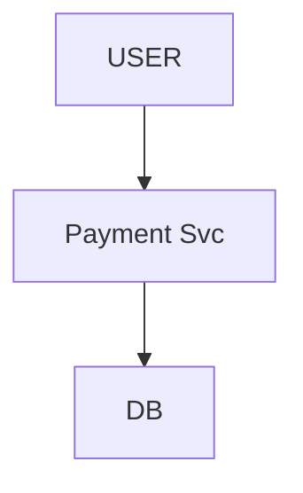
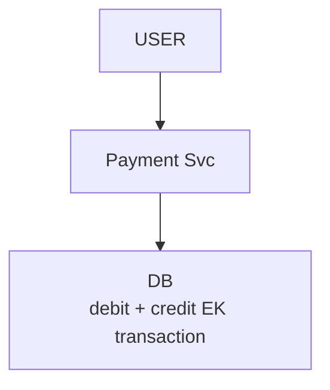
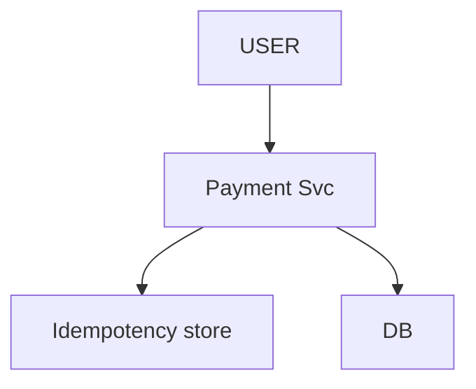
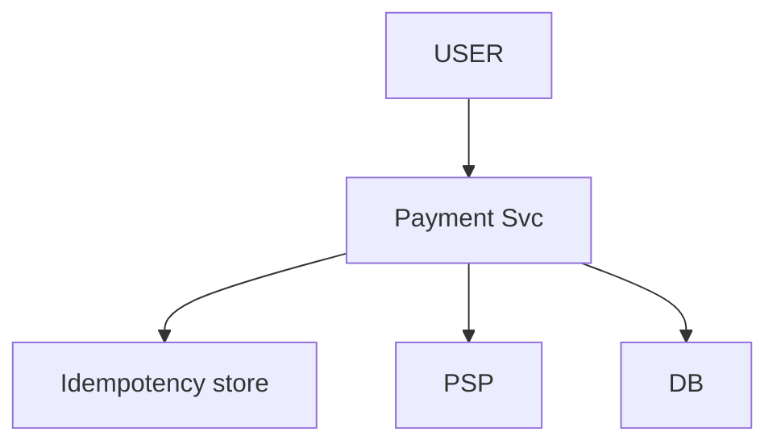
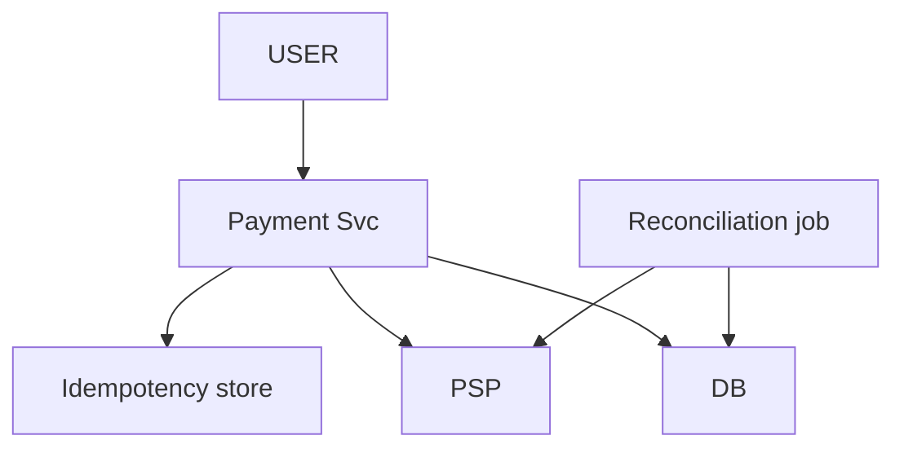
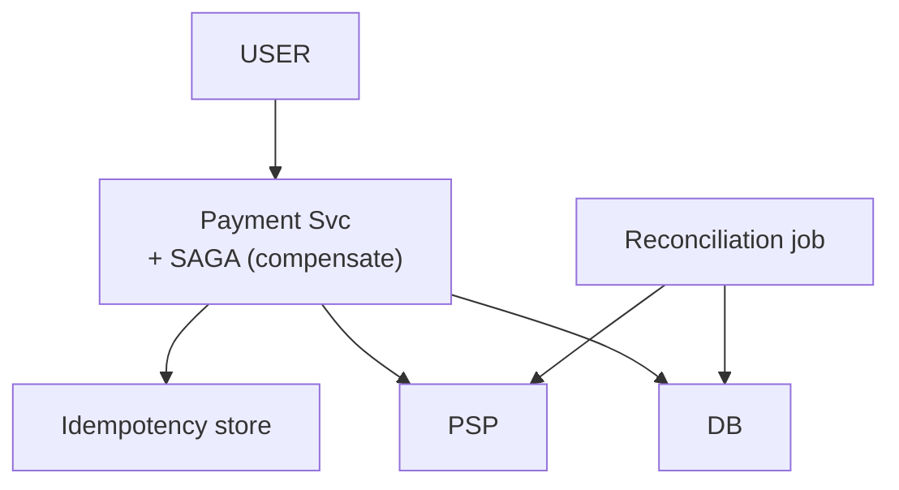
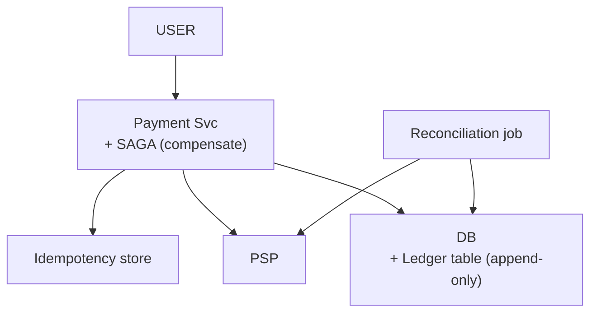
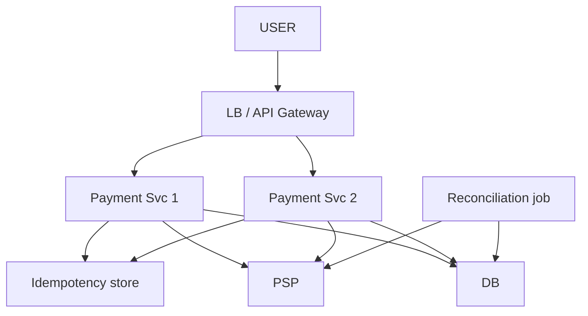
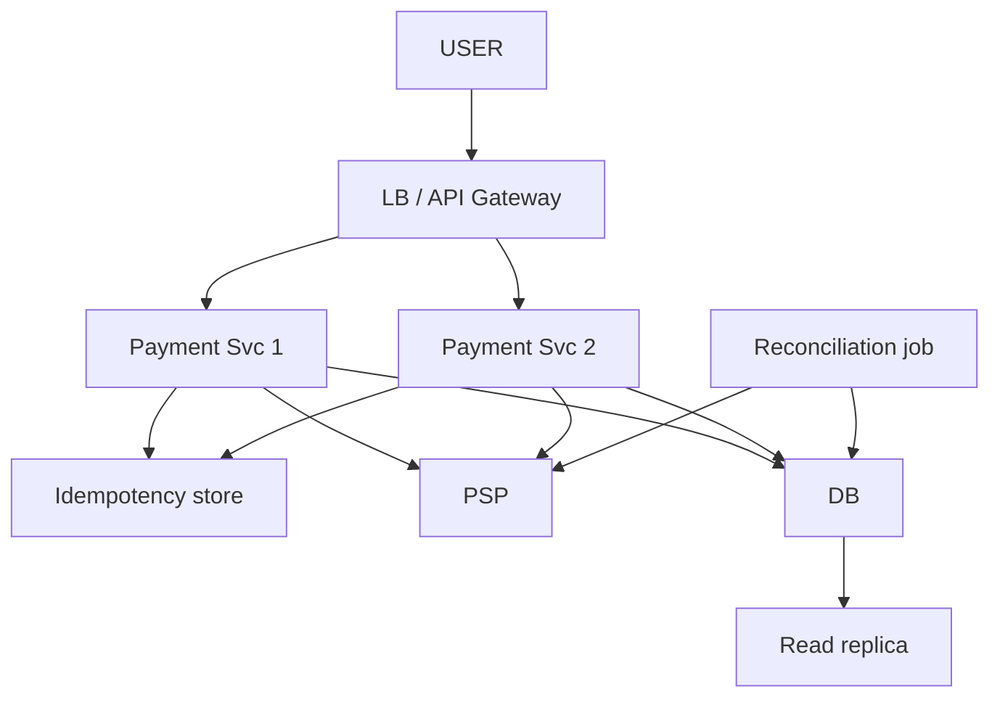
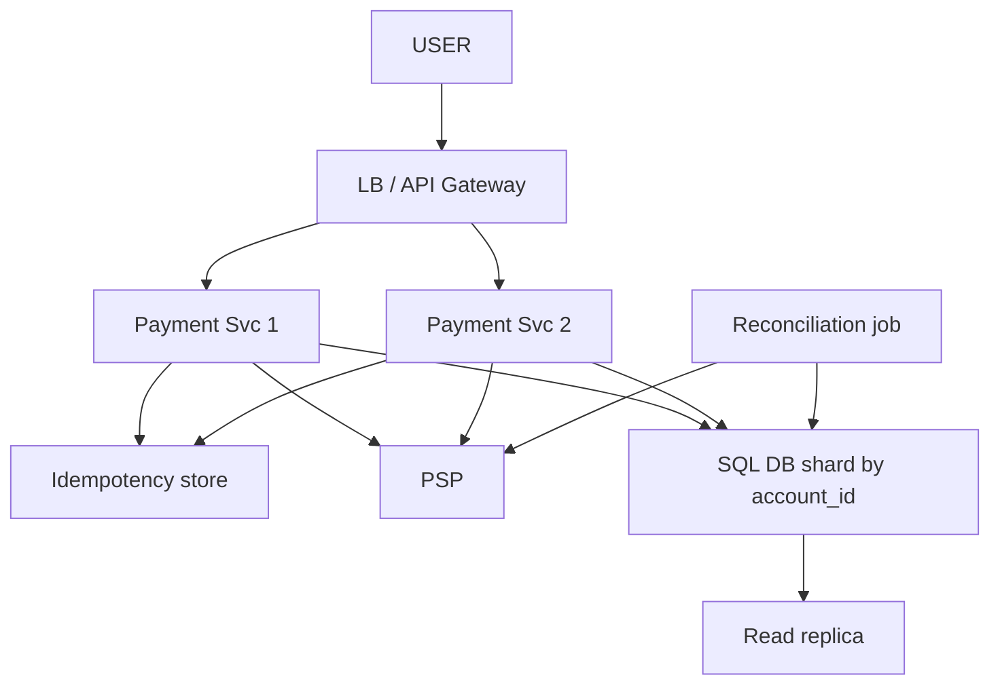

# Payment System (UPI-style)

> User A -> User B / merchant ko paisa bheje, BHAROSE ke saath. Misaal: Arpan -> merchant Rs. 500.
> Is design ka dil: **paisa DO BAAR na kate** + **kabhi GUM na ho**. Finance HLD ka core, JP / GS ka favourite.

```
CHAAR HARD PROBLEM (poori file inhi ke ird-gird):
   IDEMPOTENCY · CONSISTENCY · FAILURE HANDLING · LEDGER / AUDIT
```

---

## TASVEER (ByteByteGo / Alex Xu · CC BY-NC-ND 4.0)


Source: [How to Avoid Double Payment](https://bytebytego.com/guides/how-to-avoid-double-payment/)
(retry pe do baar na kate = IDEMPOTENCY KEY)


Source: [Reconciliation in Payment](https://bytebytego.com/guides/reconciliation-in-payment/)
(PENDING / crash ke baad asli haal PSP se milaana = RECONCILIATION)

---

## SHURU — poocho + numbers

```
POOCHO:  "P2P, merchant, refund, settlement, fraud — kis pe? Main ek user se doosre tak paisa bhejne pe."
         ★ dono account EK system / bank me ya ALAG?  <- poora design badalta:
           ek DB -> ek TRANSACTION (ACID) kaafi · alag bank -> SAGA / 2PC ka khel
         refund / chargeback scope me? · external PSP (Razorpay / Stripe) ya khud settle? · audit / regulatory?

FR:      A se B ko bhejo · retry pe dobara na kate · fail ho to paisa wapas · har paisa traceable
         scope bahar: fraud engine · multi-currency · chargeback
NFR:     PAISE KE 4 NIYAM: KHO na sake (debit hua credit nahi) · ATAK na sake (network beech me mara)
                           DUPLICATE na ho (Rs. 1000) · TRACEABLE (audit)
         shabd: atomicity · idempotency · strong consistency · durability

NUMBERS: ~100M user · avg low-hundreds / sec · peak few-thousand / sec (sale / festival)
         ★ "Payment high-THROUGHPUT nahi, high-CORRECTNESS problem hai. Scale se pehle ATOMIC + IDEMPOTENT + LEDGER."
         -> SQL / RDBMS (ACID, strong consistency, multi-row txn) + append-only LEDGER · NoSQL nahi
```
```
POOCHEGA: "Consistency or availability — which do you pick?"
BOL:      "Consistency for money — during a partition I'd rather reject than give a wrong answer. The same
           system can keep dashboards and reports available and eventually consistent."
```

---

## DABBA 0 — sabse simple

```
SOLUTION: Arpan -= 500 · Merchant += 500
```


---

## DIKKAT 1 — beech me crash: Arpan -500 hua, merchant +500 nahi

```
DIKKAT:   Rs. 500 GAYAB

SOLUTION: dono ek ATOMIC step — DB TRANSACTION (ACID)
            BEGIN  Arpan -= 500 · Merchant += 500  COMMIT   (dono ya koi nahi -> ROLLBACK)
          SEE-SAW: debit + credit saath hilte · paisa na banta na marta, sirf MOVE
          INVARIANT: sum(debits) == sum(credits) HAMESHA — na mile to turant pakdo

NAYA:     koi dabba nahi — DB transaction
```

```
AGLA SAWAAL (tere jawab se):
  "Crash pe DB rollback kaise karta (aadha likha kahan gaya)?"
   -> DB pehle WAL / undo log me likhta. Uthte hi: COMMIT wale txn redo, bina COMMIT wale undo -> aadha kuch nahi bachta
  "Do log ek saath Arpan ke account se?"
   -> row lock / UPDATE ... WHERE balance >= 500 -> ek hi jeetega (DIKKAT 2 ka teesra sawaal)
```

---

## DIKKAT 2 — do baar tap / app ne retry maara -> Rs. 1000 kate

```
DIKKAT:   tap 1 -> 500 · tap 2 -> 500 aur = DOUBLE CHARGE

SOLUTION: IDEMPOTENCY KEY — client har NAYE payment pe UUID, RETRY pe WAHI
          server: key nahi -> process + key aur RESULT store · key hai -> process MAT, STORED RESULT wapas
                  (block nahi, DEDUP)
          RACE: same key ki do request ek saath -> dono "naya" -> double
                -> check + store EK atomic step: DB UNIQUE constraint (durable) + Redis SETNX (tez, in-flight)
                -> status IN_PROGRESS -> DONE
          TRAP: kaam ke baad key DELETE mat karo -> late retry (30 sec baad) = dobara charge -> TTL ~24h + result
          100 + 100 do genuine payment -> alag key -> dono hote ✓ · retry -> wahi key -> ek baar
          (DSA: register = hashmap "pehle dekha?")

NAYA:     Idempotency store (key -> result yaad rakhne wala; Redis + DB unique)
```

```
POOCHEGA: "What if the same request comes twice / the client retries?"
BOL:      "Same key, same outcome. The client sends an idempotency key, the server stores the key with its
           result under a unique constraint, and a retry gets the stored result instead of a second charge."

POOCHEGA: "You set the idempotency key, but then the PSP call failed. Now what?"
DHYAAN:   DONE sirf PSP ke haan ke BAAD · IN_PROGRESS chhoti TTL se khud mite, warna retry SKIP -> payment atki
BOL:      "The key goes in as IN_PROGRESS with a short expiry and becomes DONE only after the PSP confirms,
           so a failed or crashed attempt doesn't block the retry."

POOCHEGA: "Two users do this at the same time — what happens?"
DHYAAN:   2 user ek cheez = atomic / lock · 1 user ka retry = idempotency (alag cheez)
BOL:      "For a shared balance I use a conditional update — UPDATE ... WHERE balance >= amount — so only
           one of them succeeds."

AGLA SAWAAL (tere jawab se):
  "Key client kyun banaye, server kyun nahi?"
   -> retry client karta hai; server ko pata hi nahi ye wahi request hai. Client ki key hi do request ko jodti
  "Redis aur DB dono kyun?"
   -> Redis = tez, chal rahi request pakde (IN_PROGRESS) · DB UNIQUE = pakka record, Redis gira tab bhi
```

---

## DIKKAT 3 — asli paisa hamara server hilata hi nahi

```
DIKKAT:   settlement bank rails pe hota

SOLUTION: external PSP / GATEWAY (Razorpay / Stripe / bank rails) asli paisa move karta
          call external + async -> PENDING state chahiye
          STATE: INITIATED -> PENDING (PSP ko bheja) -> SUCCESS / FAILED

NAYA:     PSP (Payment Service Provider — Razorpay / Stripe / bank, asli paisa wahi hilata)

KAISE (circuit breaker):
          CLOSED = normal call · lagatar N fail (jaise 5) -> OPEN = PSP ko call hi nahi, turant fail / PENDING
          kuch der (30 sec) baad HALF-OPEN = ek test call -> chali to CLOSED, fail to wapas OPEN
          fayda: marte PSP pe hathoda nahi, aur hamare thread intezaar me nahi atakte
```

```
POOCHEGA: "What if the PSP is slow?"
DHYAAN:   bina timeout har thread atka = poora system thapp (slow = down se BURA)
BOL:      "Short timeout and a circuit breaker. For money I don't blindly retry — I keep it PENDING and let
           reconciliation settle it."

AGLA SAWAAL (tere jawab se):
  "Timeout hua, to user ko kya dikhaoge?"
   -> 'processing' (PENDING), 'fail' nahi. Paisa shayad kat chuka ho -> reconciliation pakka karegi
  "Do PSP rakhoge?"
   -> haan, ek down to doosra; par ek payment hamesha EK PSP pe, beech me badalna nahi (double charge)
```

---

## DIKKAT 4 — PSP call kiya aur crash: paisa gaya ya nahi, pata hi nahi

```
DIKKAT:   debit hua tha ya sirf RESPONSE kho gaya? -> "bas rollback kar do" SAFE NAHI
          niyam: kabhi ASSUME mat karo — RECORD karo, phir RESOLVE

SOLUTION: 1. STATUS (write-ahead): kuch karne se PEHLE "PENDING" durable likho -> koi payment GUM nahi
          2. WEBHOOK (PSP push): kaam hote hi call-back -> turant status
          3. RECONCILIATION (pull, safety net): pending dhoondho -> PSP se poocho
             hui -> SUCCESS · nahi hui -> retry (idempotent hai) · pakka fail -> FAILED + refund
          push + pull DONO rakhne
          COURIER: har parcel ka tracking number + status — courier gira, parcel gum nahi

NAYA:     Reconciliation job (PENDING payment dhoondh ke PSP se asli haal milaane wala) · webhook (PSP khud call karke bataye)

KYUN DONO (push + pull):
          sirf webhook -> webhook kho sakta / late / hamara server us waqt down -> payment PENDING me atki
          sirf polling -> der se pata + har pending ke liye PSP pe baar-baar call (limit / kharcha)
          webhook = tez raasta, reconciliation = jaal jo chhoota hua pakde
```

```
POOCHEGA: "What if the server crashes in the middle?"
BOL:      "I never assume. Every payment is written as PENDING before I call the PSP. The PSP's webhook
           updates it, and a reconciliation job checks anything still pending. Money is always done,
           undone, or being checked — never lost."

POOCHEGA: "How do you know the system is working?"
BOL:      "Reconciliation against the PSP and bank, plus p99 latency, error rate and queue lag with alerts,
           and a trace id to follow one payment end to end."

AGLA SAWAAL (tere jawab se):
  "Webhook do baar aaya?"
   -> status update idempotent: PENDING -> SUCCESS ek hi baar; SUCCESS pe dobara aaya to ignore
  "Reconciliation kitni baar chalti?"
   -> har kuch minute pending (5 min se purane) ke liye + roz raat PSP / bank file se poora milaan
```

---

## DIKKAT 5 — A aur B alag bank me: ek DB transaction possible hi nahi

```
DIKKAT:   Bank A me Arpan -500 · Bank B me Merchant +500 · ek transaction nahi

SOLUTION: SAGA (compensating) — ek DB me rollback FREE, alag DB me apna UNDO khud likho
            trip: flight ✓ hotel ✓ cab ✗ -> ulta kram: hotel cancel -> flight cancel
            BankA -500 ✓ · BankB +500 ✗ -> COMPENSATE: BankA +500 wapas
            undo DB nahi, HAMARA code chalata · loose + scalable, par EVENTUAL (beech me thodi der farak)
          2PC: PREPARE (sab lock + "YES / NO") -> COMMIT / ABORT
            participants LOCK pakde rehte · coordinator crash -> sab ATKE -> scale pe SAGA
          TRADE-OFF: 2PC = strict, sync, locking, slow · SAGA = async undo, eventual, no long lock

NAYA:     koi dabba nahi — Payment Svc saga chalata
```

```
AGLA SAWAAL (tere jawab se):
  "SAGA ka state kahan rakhoge (Payment svc beech me gira)?"
   -> saga table: har step ka haal (DEBITED, CREDIT_PENDING...) -> uthte hi wahan se aage / ulta
  "Beech ke waqt user ko kya dikhega?"
   -> 'processing' -> eventual: thodi der me SUCCESS ya paisa wapas
```

---

## DIKKAT 6 — regulator: "ye paisa kahan se aaya, kahan gaya?"

```
DIKKAT:   har paisa kab-kahan-kyun traceable (RBI / SEC)

SOLUTION: LEDGER — PERMANENT, IMMUTABLE (delete / edit nahi)
          DOUBLE-ENTRY: har txn = 1 DEBIT + 1 CREDIT · sum(debits) = sum(credits)
          pen ki diary: galti -> NAYI correction entry, purani mat mitao -> poori history = audit trail
          ★ JAAL (26-Sep mix hua): ledger "DB fail ho to backup" NAHI. USI SQL DB, USI transaction me likha.
            crash recovery = PENDING + webhook + reconciliation (dikkat 4). ledger = HISAAB / AUDIT.

NAYA:     koi alag dabba nahi — DB me Ledger table (append-only)

KYUN YE (balance column + alag audit_log kyun nahi):
          balance UPDATE se purana number mit jaata; audit_log alag likha to dono me farak aa sakta
          (ek likha, doosra fail) -> ledger hi sach: har move ki entry, balance = entries ka jod
KAISE (balance kaise nikle):
          har baar jodna mehnga -> balance column USI transaction me update + ledger me 2 entry
          raat ko job: sum(ledger) == balance? farak = alert
```

```
POOCHEGA: "Data keeps growing — what happens in 3 years?"
BOL:      "Partition by month, detach old partitions to cold storage like S3 Glacier. Payment records are
           archived, never deleted."

AGLA SAWAAL (tere jawab se):
  "Galat entry ho gayi, delete kar doge?"
   -> nahi, ULTI entry (reversal) likho. Purani rahegi -> audit me dono dikhte
  "Ledger bahut bada?"
   -> month partition, purana cold storage (upar POOCHEGA)
```

---

## DIKKAT 7 — festival, 3000 txn / sec, ek Payment Svc box ka CPU khatam

```
DIKKAT:   queue -> timeout -> user ne DOBARA tap · wahi box gira = poora payment band

SOLUTION: Payment Svc pehle se STATELESS (state DB + idempotency store me) -> kai box + aage LB / API Gateway
          (stateless na hoti to LB se kuch na hota — isliye wo faisla pehle liya)
          gateway: authN (JWT) · rate limit per user · WAF edge pe · TLS
          har /pay pe OWNER CHECK: "from" account isi user ka? (warna kisi aur ke account se paisa)

NAYA:     LB / API Gateway
BADLA:    Payment Svc ek se DO — bojh bat gaya, ek gire to doosra chale (asal me zaroorat jitne, diagram me 2)
```

```
POOCHEGA: "How do you secure it / stop abuse?"
BOL:      "Authentication at the gateway, an ownership check on every payment, rate limiting per user,
           and a WAF at the edge."

AGLA SAWAAL (tere jawab se):
  "LB ko kaise pata box mara?"
   -> health check (GET /health), fail = list se bahar
  "Owner check kaise?"
   -> JWT se userId -> "from" account ka owner_id == userId? nahi to 403
```

---

## DIKKAT 8 — merchant dashboard ki report query usi DB pe, asli txn ka write ruk raha

```
DIKKAT:   bhaari read + paise ka write ek jagah

SOLUTION: READ REPLICA — dashboard / report replica se
          ★ PAYMENT ka read replica se NAHI — balance + txn status HAMESHA primary
            (lag me ek rupaye ka farak bhi nahi chalega)

NAYA:     Read replica

KAISE:    primary har change WAL me likhta -> replica wo WAL stream padh ke apne pe lagati (ASYNC)
          isliye replica thodi peeche (lag) -> report me 1-2 sec purana chalta, balance me nahi
KYUN YE:  bahut bhaari report (mahine ka sab) -> replica bhi dhime -> tab alag WAREHOUSE (CDC se data, OLAP)
          dashboard ke liye replica kaafi, analytics ke liye warehouse
```

```
POOCHEGA: "The user paid but still sees the old balance. Why?"
BOL:      "That read came from a lagging replica. Balance and payment status are always read from the
           primary; replicas only serve dashboards."

AGLA SAWAAL (tere jawab se):
  "Replica kitni peeche hai, kaise pata?"
   -> replication lag metric (seconds / bytes) pe alert
  "Primary gira?"
   -> ek replica promote (managed: RDS Multi-AZ khud karta). Paisa ke liye sync replica -> kuch nahi khota
```

---

## DIKKAT 9 — ek DB me 50 crore txn row, likhai dheemi

```
DIKKAT:   ek primary pe saare write

SOLUTION: SHARD by account_id
          NAYA dard: A aur B alag shard -> transfer ab LOCAL transaction nahi -> wapas SAGA (dikkat 5)
          asli bottleneck throughput nahi, DISTRIBUTED TRANSACTION

BADLA:    DB -> SQL DB (shard by account_id)

KAISE (request sahi shard tak):
          shard = hash(account_id) % N, ya lookup table (account -> shard) jo badla ja sake
          consistent hashing -> shard jude to kam account khiskein
KYUN account_id (txn_id ya time nahi):
          ek account ka balance + uski saari history ek shard pe -> debit ek hi jagah atomic
          txn_id -> ek account ki txn bikhar jaati, balance kahan? · time -> aaj ka shard garam
```

```
AGLA SAWAAL (tere jawab se):
  "Bada merchant (Amazon) ka account -> ek shard garam?"
   -> merchant ke kai sub-account (shard me baante), report me jodo
  "Cross-shard transfer?"
   -> SAGA (DIKKAT 5) -> debit shard A, credit shard B, fail pe ulta
```

---

## 10x SCALE — har dabba alag

```
Gateway           -> abuse / flood -> rate limit
Payment Svc       -> stateless -> box badhao
Idempotency       -> do request ek saath -> unique constraint / SETNX
SQL DB            -> debit + credit ek txn · read load -> replica · write -> shard by account_id
PSP               -> slow / down -> PENDING + circuit breaker · jawab nahi -> webhook + reconcile
Ledger            -> append-only, month partition, purana cold storage
ASLI BOTTLENECK   -> distributed transaction (alag bank / shard), raw throughput nahi

POOCHEGA: "How would you scale this to 10x?"      -> paise ka raasta chalo, har dabbe pe "kya toota"
POOCHEGA: "What's the single point of failure?"   -> DB primary (sync replica promote), PSP (second PSP)
```

---

## POOCHE TO (deep-dive)

```
API:      POST /pay { from, to, amount } + header Idempotency-Key: <UUID>  -> { status, txn_id }

KEY KAB BANTI (28-Aug confusion saaf):
          key = RANDOM, "Pay" TAP ke pal banti (bhejte waqt nahi). naya tap = naya dice
          (A) do baar TU tap -> key 555, key 888 -> 100 + 100 = 200 ✓
          (B) ek tap + network RETRY -> wahi 555 dobara -> "aa chuka" -> pehla result -> 100 ✓
          farak = KAUN dobara bhej raha: TU (nayi key, naya payment) · SYSTEM retry (same key, dedup)
          (retry me tu button dobara nahi dabata)
          maqsad do baar pay rokna NAHI, sirf network retry ko do baar count hone se rokna
          CHEQUE: key = cheque number · do cheque = dono cash · ek number do baar = nahi
                  bank amount nahi, NUMBER dekhta

DATA:     LEDGER double-entry, immutable · IDEMPOTENCY key -> { status, result } TTL ~24h ·
          TXN STATUS INITIATED -> PENDING -> SUCCESS / FAILED · INVARIANT debits == credits

SCAM 1992 (Arpan ne khud joda — ledger ka asli wazan):
          1990-91 PAPER ledger + manual Bank Receipt (BR) -> editable, forge, koi real-time check nahi
          FAKE / khaali BR + settlement ka "float" market me + der se pakda (~Rs. 4000 cr)
          fake entry       -> INVARIANT + backed-only
          paisa gaya, share nahi -> ATOMIC settlement (ACID / SAGA)
          editable BR      -> IMMUTABLE double-entry + audit trail
          float gap        -> real-time RECONCILIATION
          paper -> digital: ledger mara nahi, kaagaz ka roop mara · blockchain = extreme tamper-proof ledger
          baad me: SEBI ko kanooni taakat (1992) · NSE screen trading (1994) · NSDL demat (1996) · T+2 (2003) · T+1 (2021-23)
```

---

## AAKHRI DABBA + WRAP

```
Gateway = auth + rate limit + owner check · Payment Svc = stateless, saga · Idempotency = same key ek baar
SQL DB = ACID debit + credit + ledger, shard by account · PSP = asli paisa, PENDING · webhook = push
Reconciliation = pull safety net · Read replica = sirf dashboard
```

```
idempotency  -> same key, paisa EK baar          (hashmap "pehle dekha?")
consistency  -> debit + credit ek atomic flip    (see-saw; ACID ya SAGA)
failure      -> PENDING + webhook + RECONCILE    (courier tracking — gum kabhi nahi)
ledger       -> immutable double-entry           (permanent diary)
```
```
BOL: "Every payment carries an idempotency key, stored with its result under a unique constraint, so a
      retry never charges twice. Debit and credit happen in one ACID transaction with a double-entry
      ledger; across banks or shards I use a saga with compensation. The PSP moves the real money, so I
      write PENDING first and resolve it through webhooks and a reconciliation job. Next: fraud checks,
      multi-currency and chargebacks."
```

---

## HANDS-ON — Idempotency LIVE (usercrud, 27-Aug)

> Arpan ki line: "map me key hai? -> kuch mat karo, wahi wapas. Nahi? -> process + map me daal do."

```java
@RestController
public class IdempotencyController {

    // key -> pehle jo result diya (duplicate pe wahi wapas)
    private final ConcurrentHashMap<String, String> processed = new ConcurrentHashMap<>();
    // asli orders ka counter (SAABIT karega double hua ya nahi)
    private final AtomicInteger orderCounter = new AtomicInteger(0);

    @PostMapping("/pay")
    public String pay(@RequestHeader("Idempotency-Key") String key,
                      @RequestParam int amount) {

        // ATOMIC claim: key hai? -> existing wapas | nahi? -> "PROCESSING" daal + null return
        String existing = processed.putIfAbsent(key, "PROCESSING");
        if (existing != null) {
            return "DUPLICATE (key already claimed) -> " + existing
                 + "  | total orders = " + orderCounter.get();
        }

        // yahan sirf EK thread pahunchega (jisne putIfAbsent race JEETI)
        int orderId = orderCounter.incrementAndGet();
        String result = "Order #" + orderId + " created, amount=" + amount;

        processed.put(key, result);   // "PROCESSING" ko asli result se replace

        return "OK -> " + result + "  | total orders = " + orderCounter.get();
    }
}
// SecurityConfig: .requestMatchers("/pay").permitAll()
```
```
SEQUENTIAL:  A key abc-123, 100 -> OK Order #1, total 1
             B wahi dobara      -> DUPLICATE Order #1, total 1   (2 NAHI)
             C key xyz-999, 200 -> OK Order #2, total 2

RACE:        naive containsKey + put = 2 step, GAP -> A "nahi", B "nahi" -> dono order = DOUBLE
             putIfAbsent = 1 ATOMIC step -> sirf ek jeet-ta
             atomicity NAAM se nahi, ConcurrentHashMap se (bucket lock / CAS). plain HashMap = thread-safe nahi

20 PARALLEL, same key "race-1":
             1..20 | ForEach-Object { Start-Job { curl.exe -s -X POST ".../pay?amount=100" -H "Idempotency-Key: race-1" } } | Wait-Job | Receive-Job
             BROKEN (containsKey + put + sleep 50) -> Order #1 AUR #2 -> total 2 = DOUBLE CHARGE live
             ATOMIC (putIfAbsent) -> 1 OK, 19 DUPLICATE -> total 1
             pehli DUPLICATE "-> PROCESSING" = reserve-then-fill live dikha

PROD:        Redis / DB unique constraint (memory restart pe udti) + key TTL · PROCESSING placeholder
BOL:         "Naive check-then-put races; putIfAbsent on a ConcurrentHashMap makes check and insert one
              step, so only one request wins. In production the store is Redis or a DB unique constraint
              with a TTL. I fired 20 parallel requests: broken version made two orders, atomic made one."
```

ARCHETYPE C · CONCEPTS: [db-what-when](../../FOUNDATIONS/09_databases_what_when.md) · [CAP](../../FOUNDATIONS/08_cap_theorem.md) · [saga/ms-comm](../../FOUNDATIONS/10_ms_communication.md) · saath: [bookmyshow](../09_bookmyshow/09_bookmyshow_INTERVIEW.md) · [stock-broker](../05_stock_broker_trading/05_stock_broker_trading.md) · [← MASTER SHEET](../../00_MASTER_SHEET.md)
