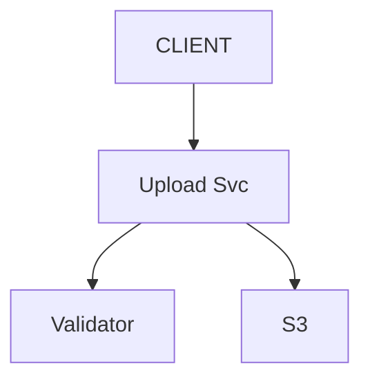
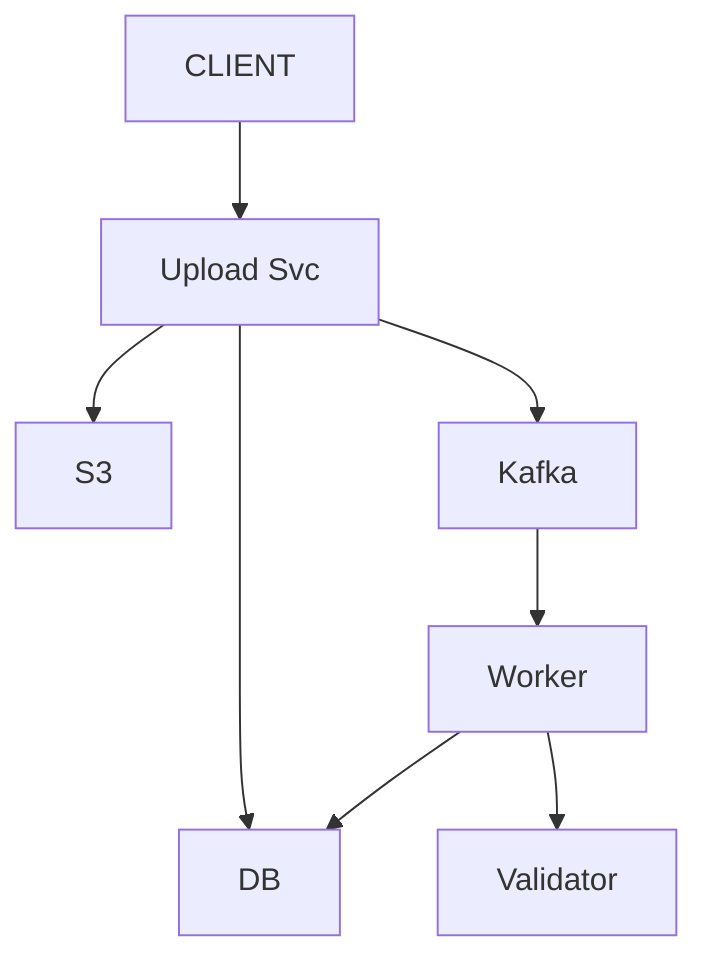
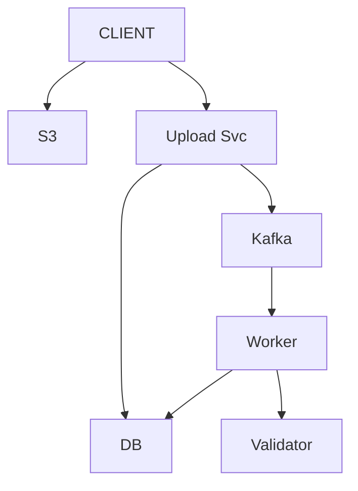
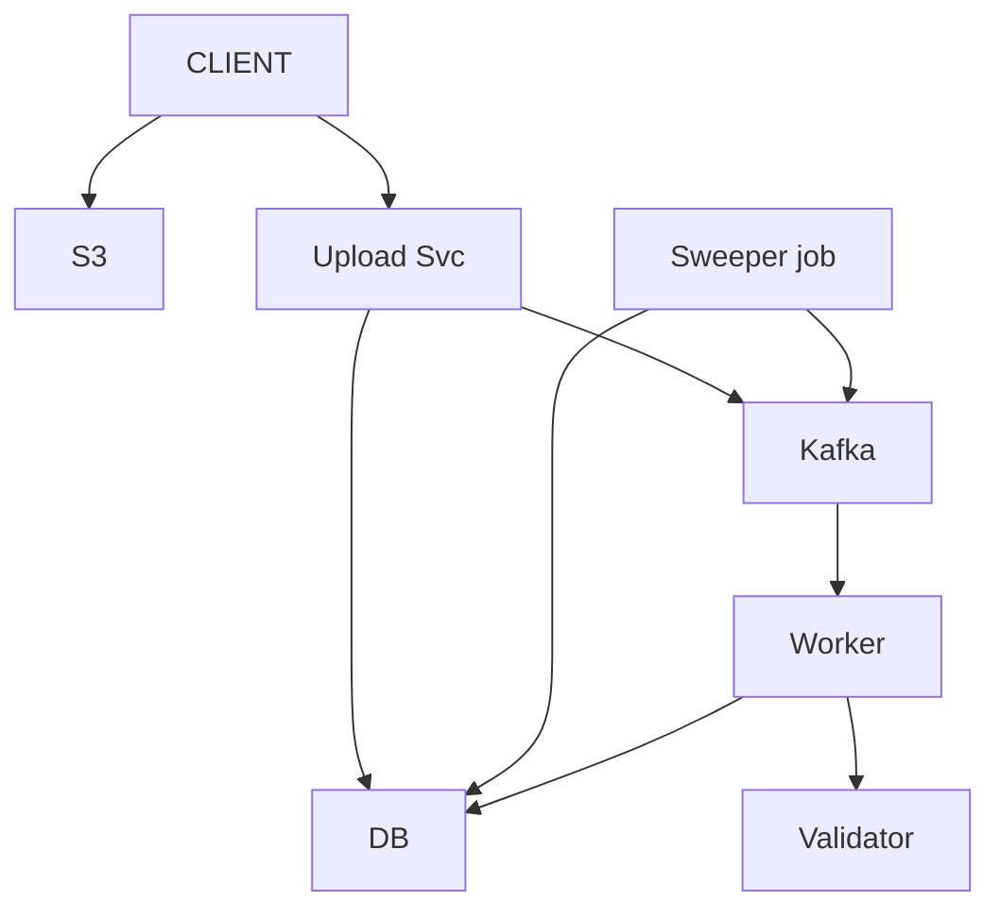
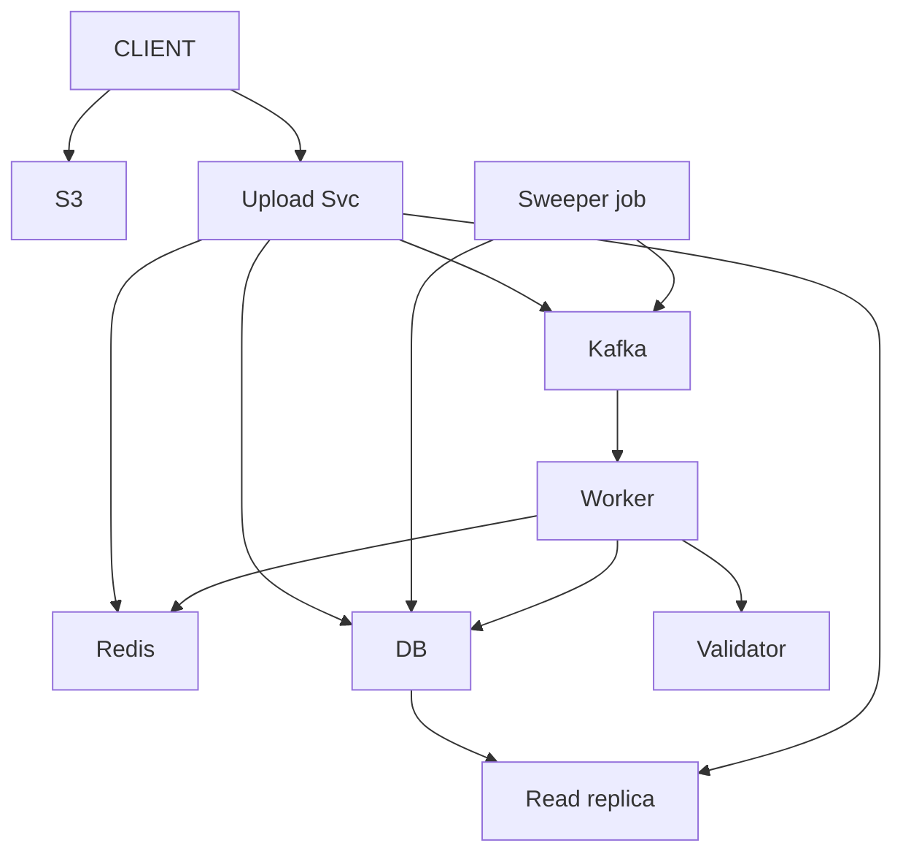
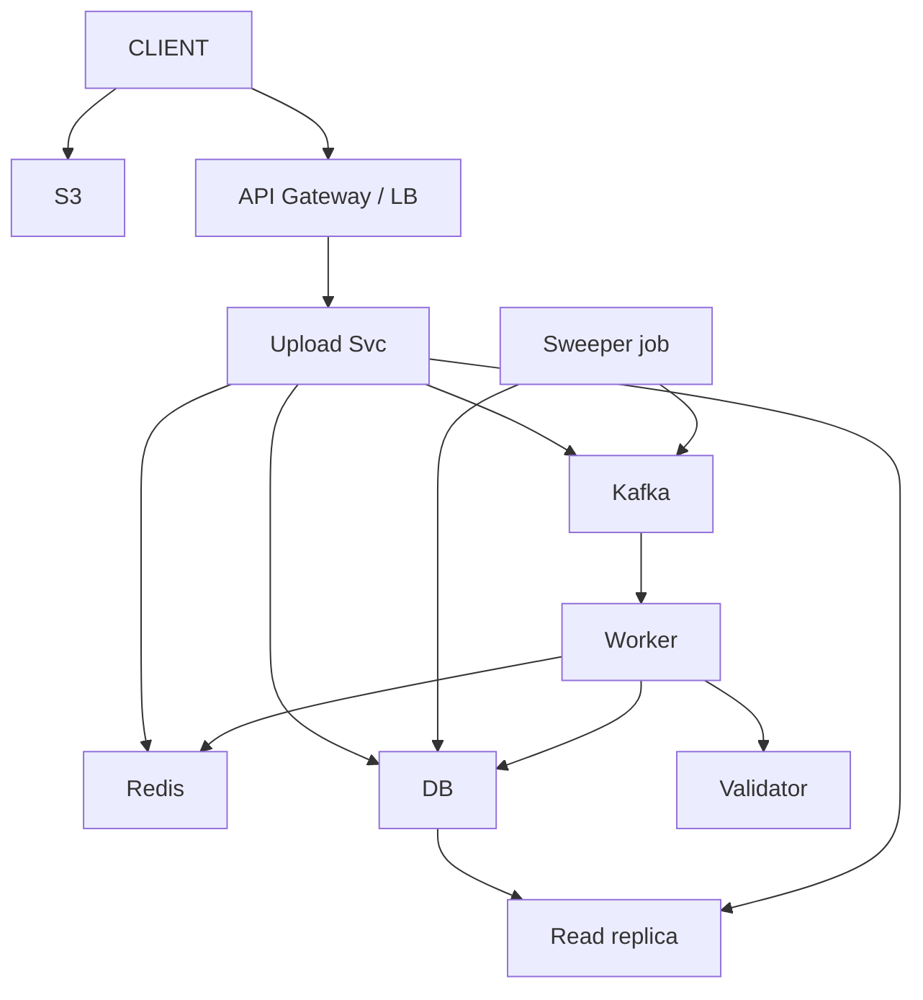
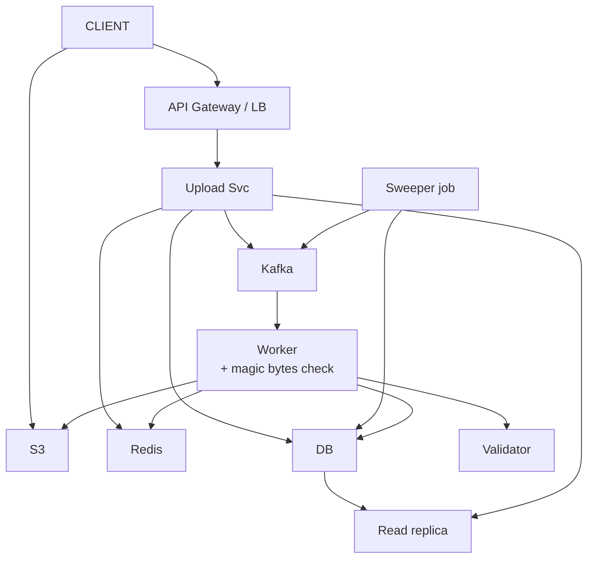
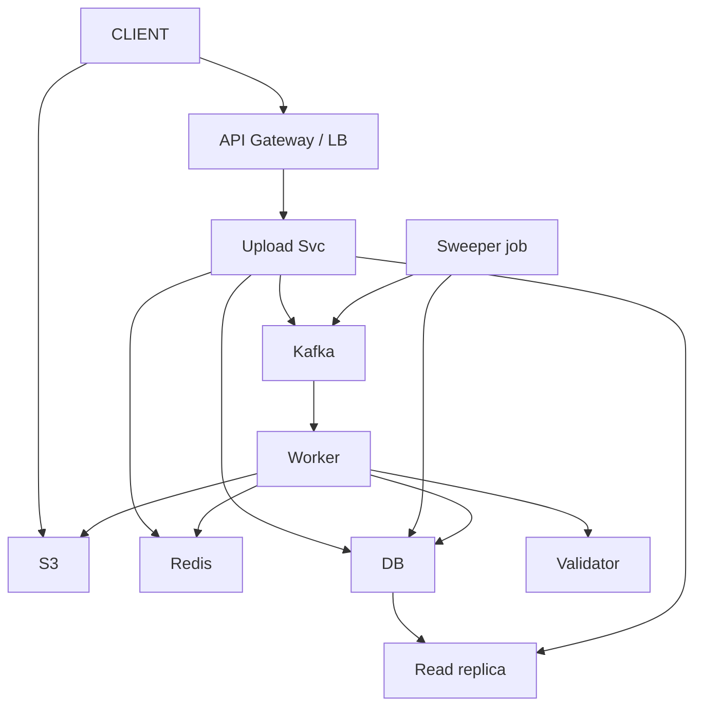

# File Upload + Validate + Track

> File / folder lo -> third-party se VALIDATE (2-3 sec) -> store -> user ko TRACKING link do.
> JP ne ye ACTUALLY poocha tha (asli SDE-3 writeup). General product design, finance nahi.
> Is design ka dil: **user WAIT na kare** (async + trackingId) + **bytes server se na guzrein** (presigned URL) + **status hamesha pata**.

---

## TASVEER (ByteByteGo / Alex Xu · CC BY-NC-ND 4.0)


Source: [How to Upload a Large File to S3](https://bytebytego.com/guides/how-to-upload-a-large-file-to-s3/)
(bada file -> presigned URL + MULTIPART: tukdon me, tukda fail to sirf wahi dobara)

---

## SHURU — poocho + numbers

```
POOCHO:  file SIZE limit? (10 MB ya 5 GB — design badal jaata)  <- bada = presigned + multipart
         kaunse TYPE allow? · validation kitna time? (2-3 sec) · sirf FILE ya FOLDER bhi?
         result turant chahiye ya baad me status?  <- turant nahi = async + tracking

FR:      upload · third-party VALIDATE · store · tracking link / status
         scope bahar: editing · sharing · versioning
NFR:     user WAIT na kare (dil) · data LOST na ho · status HAMESHA pata (kahan tak pahuncha) · scale + secure

NUMBERS: 1 lakh file / din -> ~1-2 write / sec (kam)       (1 din ~ 1,00,000 sec)
         par status BAAR-BAAR check -> READ-HEAVY
         reads >> writes -> status ke liye CACHE + read replica
         bada file       -> bytes DB me nahi, BLOB (S3)
         validation slow -> QUEUE + worker
```

---

## DABBA 0 — sabse simple

```
SOLUTION: client file server ko de · server S3 me rakhe · validator call kare (2-3 sec) · jawab wapas
```


---

## DIKKAT 1 — user 2-3 sec ruka, server ka thread bhi block

```
DIKKAT:   har upload pe validation ka intezaar -> user 2-3 sec ruka, server ka thread bhi block.

SOLUTION: ASYNC + POLLING:
          (1) Upload pe turant trackingId + status "VALIDATING".
          (2) Validation peeche queue + worker me; worker DB me DONE / FAILED likhta.
          (3) User status poochta rahe.
          (SYNC = user ruke, nahi · WEBHOOK = UX behtar, setup zyada.)

NAYA:     Kafka · Worker · DB (status)
BADLA:    Validator ab Upload Svc nahi, Worker call karta

KAISE (Kafka + worker):
          Upload svc /complete pe event {trackingId, s3_key} topic me likhta, turant laut-ta
          workers ek consumer group me -> har partition ek worker. Worker validate kare, DB status update
          ★ offset commit DB update ke BAAD -> worker beech me mara = event dobara aayega, khoyega nahi
KYUN YE:  1-2 upload / sec ke liye SQS / RabbitMQ bhi poora kaafi (simple, managed)
          Kafka tab jab bahut zyada event ya replay chahiye; interview me dono bolo + chuno kyun
```

```
AGLA SAWAAL (tere jawab se):
  "Ek hi file do baar validate ho gayi (event dobara aaya)?"
   -> validation idempotent: status pehle se DONE to skip; dobara chalana nuksaan nahi
  "Polling har 2 sec bahut zyada?"
   -> backoff (2s, 4s, 8s) ya baad me webhook / SSE (DIKKAT 5 me cache se sasta)
```

---

## DIKKAT 2 — 5 GB file ke bytes mere app server se guzar rahe

```
DIKKAT:   5 GB file ke bytes mere app server se guzar rahe (client -> server -> S3).
          Bandwidth double, thread block, server scale karna pada bina kuch kiye.

SOLUTION: PRESIGNED URL:
          (1) Client: "ye file daalni hai" -> server chhoti umar ka signed URL + trackingId deta.
          (2) Client bytes SEEDHE S3 pe bhejta, phir server ko "ho gaya" -> queue me.
          Server sirf metadata + URL, bandwidth aadhi, S3 khud scale. Download bhi presigned GET URL se.

BADLA:    S3 ka raasta: Upload Svc -> S3  ->  CLIENT -> S3 (seedha)

KAISE (presigned URL):
          server apni AWS secret key se ek URL SIGN karta = (method PUT + bucket/key + expiry 10 min) ka hash
          client us URL pe seedha PUT karta -> S3 khud signature dobara bana ke milata + expiry dekhta
          match -> upload allow. Client ko AWS ki chaabi kabhi nahi milti, sirf ek file ka 10 min ka paas
```

```
BOARD PE: pehle: CLIENT --5 GB--> server --5 GB--> S3
          ab: 1 client -> server "upload karni" · 2 server -> signed URL + trackingId
              3 client -> S3 bytes seedhe · 4 client -> server /upload/complete -> queue

AGLA SAWAAL (tere jawab se):
  "Client ne URL se 50 GB daal di (limit 5 GB)?"
   -> sign karte waqt content-length range / POST policy me max size; S3 bada reject kare
  "Client ne /complete bola hi nahi?"
   -> S3 event notification (object created) se bhi trigger kar sakte, ya sweeper (DIKKAT 4)
```

---

## DIKKAT 3 — 5 GB file 90% pe toot gayi

```
DIKKAT:   5 GB file 90% pe toot gayi -> poori dobara? user maar dega.

SOLUTION: MULTIPART / RESUMABLE: file chhote tukdon me, jo tukda fail sirf wahi dobara.
          Saare pahunche -> S3 ko "complete", S3 khud jodta. Server sirf har tukde ka presigned URL deta.

NAYA:     koi dabba nahi

KAISE (multipart):
          1. initiate -> S3 ek uploadId deta
          2. har tukda (partNumber 1..N) apne presigned URL pe -> S3 har part ka ETag lautata
             tukde PARALLEL bhi ja sakte (tez)
          3. complete(uploadId, [partNumber + ETag list]) -> S3 usi kram me jod ke ek file
```

```
BOARD PE: tukde 5 MB · tukda 3 fail -> sirf 3 dobara

AGLA SAWAAL (tere jawab se):
  "Client band ho gaya, kal resume?"
   -> server ke paas uploadId + kaunse part ho chuke (ListParts) -> sirf bache part bhejo
  "Tukda kitna bada?"
   -> S3 me kam se kam 5 MB (aakhri chhod ke), max 10,000 part -> badi file = bada tukda
```

---

## DIKKAT 4 — init kiya, complete kabhi nahi / beech me crash

```
DIKKAT:   upload shuru hua, "complete" kabhi nahi aaya / crash -> bytes S3 me padi, DB status adhoora = ORPHAN.
          VALIDATING me atki file koi dhoondhta hi nahi.

SOLUTION: (1) Upload pehle TMP jagah me, validate hone pe hi asli jagah.
          (2) S3 LIFECYCLE rule: tmp ki purani file + adhoore multipart apne aap delete.
              Par lifecycle dino me chalta, ghanton me nahi, aur DB status nahi dekh sakta. Isliye:
          (3) SWEEPER job: der se VALIDATING / UPLOADING me atki file -> S3 me bytes hain? Haan = queue me
              dobara · nahi = FAILED.
          Validation fail -> delete ya quarantine bucket + FAILED.

NAYA:     Sweeper job (der se atki file dhoondh ke dobara chalane / FAILED karne wala)
```

```
BOARD PE: tmp/ me 1 din se purana -> DELETE · abort incomplete multipart (din me)
          sweeper: VALIDATING / UPLOADING + updatedAt 10 min se purana

POOCHEGA: "What if the server crashes in the middle?"
DHYAAN:   status likhna kaafi nahi — koi use DHOONDHE bhi
BOL:      "Every file has a status, UPLOADING to VALIDATING to DONE or FAILED. A sweeper finds files stuck
           too long — VALIDATING for ten minutes when validation takes three seconds — and requeues them
           or marks them failed. S3 lifecycle rules clean up abandoned uploads."

AGLA SAWAAL (tere jawab se):
  "Sweeper khud do box pe chala, ek file dobara queue me do baar?"
   -> ek hi sweeper chale (lock / leader) ya requeue idempotent (status check karke)
  "Quarantine ki file ka kya?"
   -> alag bucket, koi download nahi, kuch din baad delete / security team dekhe
```

---

## DIKKAT 5 — sab har 2 sec status poll kar rahe

```
DIKKAT:   sab har 2 sec status poll kar rahe, har poll DB pe.

SOLUTION: (1) CACHE (Redis) + baaki reads ke liye READ REPLICA.
          ★ JAAL: worker ne DONE kiya, cache me abhi "VALIDATING" -> worker update ke saath cache bhi
            update / delete kare (ya bahut chhota TTL).

NAYA:     Redis · Read replica

KAISE (read ka kram):
          GET /status -> Redis me hai? -> wahin se · nahi -> replica se padho -> Redis me daalo (TTL chhota)
          worker DONE likhe -> USI waqt Redis key update / DEL (write-through / invalidate)
          ★ dusra JAAL: replica bhi peeche (lag) -> miss pe replica ne purana VALIDATING diya, wahi cache me
            -> status jaisa taaza chahiye wo PRIMARY se, ya worker khud Redis me naya status likhe
KYUN DONO:  Redis = har 2 sec ke poll ko DB tak jaane se roke · replica = baaki reads (list, history) ka bojh
```

```
AGLA SAWAAL (tere jawab se):
  "Poll ki jagah push?"
   -> SSE / WebSocket: status badla to server khud bheje -> poll hi khatam
  "Redis gira to?"
   -> poll seedha DB (replica) pe -> dheema par chalta; rate limit poll pe
```

---

## DIKKAT 6 — prompt me FOLDER bhi tha

```
DIKKAT:   upload me ek file nahi, poora FOLDER bhi aa sakta (kai files).

SOLUTION: (1) Ek PARENT trackingId + har file ka child trackingId.
          (2) Parent ka status bachchon se: sab DONE = DONE · koi FAILED = PARTIAL / FAILED.
          Bahut chhoti files -> client zip kare, server unzip.

NAYA:     koi dabba nahi
```

```
AGLA SAWAAL (tere jawab se):
  "Rollup kab update hoga?"
   -> har child DONE / FAILED pe parent ka counter badhao (done_count); sab ho gaye to parent final
  "1000 file ka folder, 1000 /init calls?"
   -> ek batch init: 1000 presigned URL ek jawab me
```

---

## DIKKAT 7 — kisi ne DOOSRE ka trackingId daal ke file maang li

```
DIKKAT:   kisi ne doosre ka trackingId daal ke uski file maang li (ID guess ho sakta).

SOLUTION: (1) Upload shuru pe user logged-in (JWT, gateway pe) -> record me ownerId likho.
          (2) Status / download pe: maangne wala = owner? Warna 403.
          AUTHN ("tum kaun") = filter / JWT. AUTHZ ("is file pe haq?") = service me (filter ID dekhta hi nahi).
          (PR review me sabse upar: request me kisi cheez ki ID aayi -> owner check kahan hai?)

NAYA:     API Gateway / LB (auth + traffic)
```

```
AGLA SAWAAL (tere jawab se):
  "trackingId guess na ho, phir bhi owner check kyun?"
   -> random id leak ho sakti (log, link share) -> asli rok owner check hai, id ki randomness nahi
  "Admin ko sab dekhna?"
   -> role check: owner YA admin role -> warna 403
```

---

## DIKKAT 8 — owner ko S3 ka SEEDHA link diya, usne aage bhej diya

```
DIKKAT:   owner ko S3 ka seedha link diya, usne aage bhej diya -> link hamesha chalta, kisi ke bhi haath me.

SOLUTION: (1) Presigned URL ki umar chhoti (kuch minute). URL tabhi banta jab owner check paas ho.
              URL "chaabi" nahi, "5 minute ka paas" hai.
          (2) DB me URL nahi, file ki S3 KEY rakho; URL har maang pe naya.

NAYA:     koi dabba nahi
```

```
BOARD PE: presigned URL umar 5-15 MINUTE

AGLA SAWAAL (tere jawab se):
  "5 min me download poora nahi hua (badi file)?"
   -> expiry sirf SHURU karne ki hai; chalu download beech me nahi kat-ta
  "URL kisi ne 5 min ke andar aage bheja?"
   -> 5 min ka risk maana; zyada sensitive -> CloudFront signed URL + IP restriction; ek-baar-use chahiye to apna token check (built-in nahi)
```

---

## DIKKAT 9 — naam .pdf, Content-Type application/pdf, par asal me EXE — aur S3 me pad chuki

```
DIKKAT:   naam .pdf, type bhi PDF, par andar EXE, aur S3 me pahunch bhi chuki. Naam + type client ne bheje.

SOLUTION: (1) Worker file ke PEHLE kuch BYTE padhe (magic number), type khud tay kare.
          (2) Mel nahi -> REJECTED + delete / quarantine.
          Client ka bheja kabhi sach mat maano, na naam na type.

NAYA:     koi dabba nahi — Worker me check
```

```
BOARD PE: PDF %PDF- · PNG \x89PNG · EXE MZ

POOCHEGA: "How do you secure it / stop abuse?"
BOL:      "JWT at the gateway and an owner check on every status and download. Short-lived presigned URLs.
           The worker checks magic bytes instead of trusting the name or Content-Type. Per-user rate limit
           against upload floods, WAF at the edge, TLS, secrets in a vault."

AGLA SAWAAL (tere jawab se):
  "Magic bytes PDF jaise, par andar virus / JS?"
   -> antivirus scan (ClamAV) worker me, ya S3 malware scanning service
  "5 GB file ke saare byte padhoge?"
   -> magic bytes ke liye pehle kuch byte kaafi (S3 range GET); virus scan poora
```

---

## 10x SCALE — har dabba alag

```
Upload Svc   -> stateless, kai box + LB
S3           -> managed, khud scale · popular download -> CDN (CloudFront)
DB           -> status polling -> CACHE + READ REPLICA · bahut files -> SHARD (trackingId)
Redis        -> purana status -> write-through / invalidate
Kafka        -> validation backlog -> WORKER auto-scale (queue depth pe)
orphan       -> S3 lifecycle + sweeper

POOCHEGA: "How would you scale this to 10x?"      -> file ka raasta chalo, pehle jo toote
POOCHEGA: "What's the single point of failure?"   -> validator (third-party): circuit breaker + backup provider
POOCHEGA: "How do you know it's working?"
          MISAAL: raat ko validator SLOW, queue me 50,000 atki
          health check "slow" nahi pakadta (ping ka jawab aa jaata) -> APNA METRIC pakadta:
             queue depth / lag · validator p99 + error rate · VALIDATING me purani files ki ginti
             -> had paar = alert (CloudWatch alarm / PagerDuty), user ke complain se pehle
          peeche: 3 fail -> CIRCUIT BREAKER -> BACKUP PROVIDER (third-party ki replica hum nahi chala sakte)
BOL:      "I'd alert on our own metrics — queue depth, p99 and error rate of validator calls, and files stuck
           in VALIDATING. A health check only tells me it's up, not that it's slow. Behind that, a circuit
           breaker and a fallback provider."
```

---

## POOCHE TO (deep-dive)

```
API:      POST /upload/init { fileName, size }  -> presigned S3 URL + trackingId (server sirf URL deta)
          -> client SEEDHA S3 pe PUT
          POST /upload/complete { trackingId }   -> "ho gaya, validate karo" (queue)
          GET  /status/{trackingId}              -> VALIDATING / DONE / FAILED
          GET  /download/{trackingId}            -> presigned GET URL -> seedha S3

DB:       files: trackingId (KEY) | fileName | ownerId | status | s3_key | createdAt | updatedAt
          status: UPLOADING -> VALIDATING -> DONE / FAILED  ("kahan tak pahuncha" = failure handling ki buniyaad)
          PostgreSQL: simple key lookup par status ko ACID chahiye
          (bahut bada + pure key-value -> NoSQL bhi chalta · paisa hota -> hamesha SQL)

DEDUP:    content ka hash (MD5 / SHA) -> pehle se hai to dobara store nahi -> storage bachi
```

---

## AAKHRI DABBA + WRAP

```
Gateway / LB = auth · Upload Svc = metadata + presigned URL, bytes ko haath nahi · S3 = bytes, tmp/ + lifecycle
DB = trackingId + status + owner · Kafka + Worker = slow validation alag, magic bytes · Redis + replica = polling
Sweeper = atki file
```

```
BOL: "The client asks the upload service for a presigned URL and sends the bytes straight to S3 — multipart
      for big files. Validation takes two to three seconds, so it's async: the user gets a tracking id
      immediately, a worker validates from a queue, checks magic bytes and updates the status. Status is
      read-heavy, so Redis and a read replica, invalidated on every update. Owner checks and short-lived
      URLs secure it, lifecycle rules and a sweeper clean up. Next: retries on failure and a CDN for downloads."
```

ARCHETYPE B+F · CONCEPTS: [message-queues](../../FOUNDATIONS/07_message_queues.md) · [reliability/SPOF](../../FOUNDATIONS/11_reliability_spof_cloud.md) · [← MASTER SHEET](../../00_MASTER_SHEET.md)
