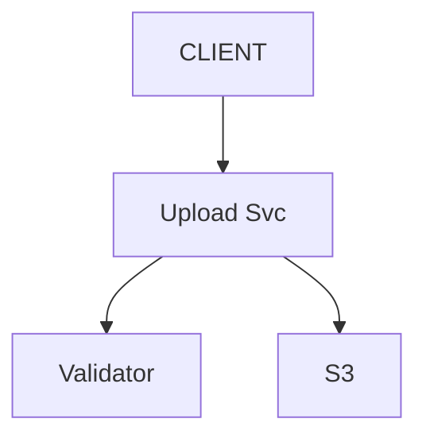
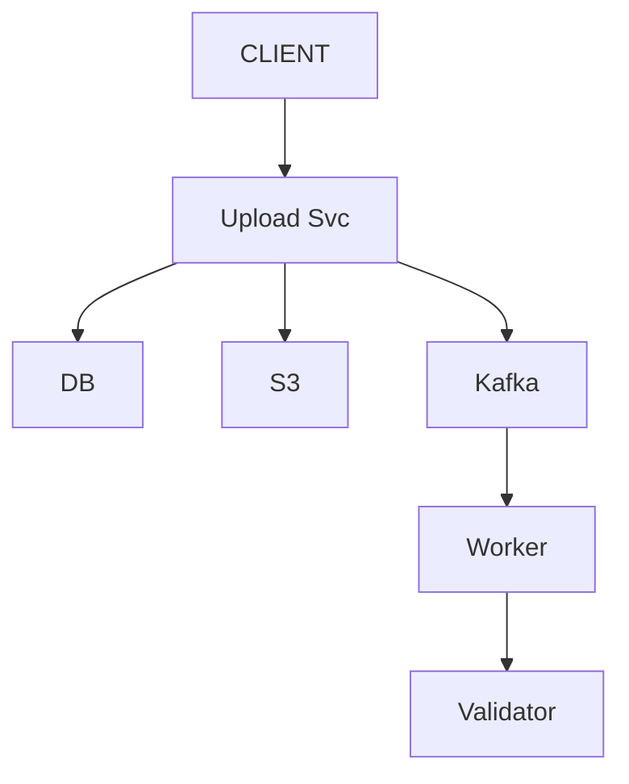
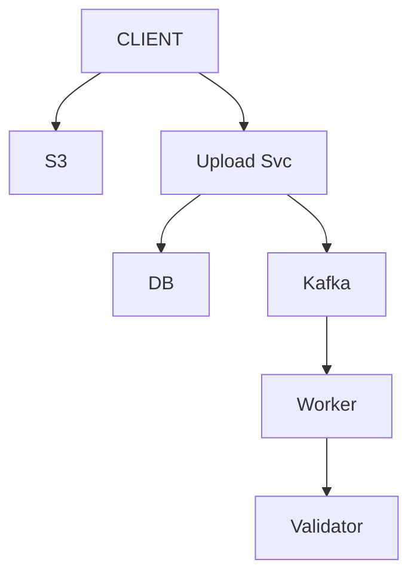
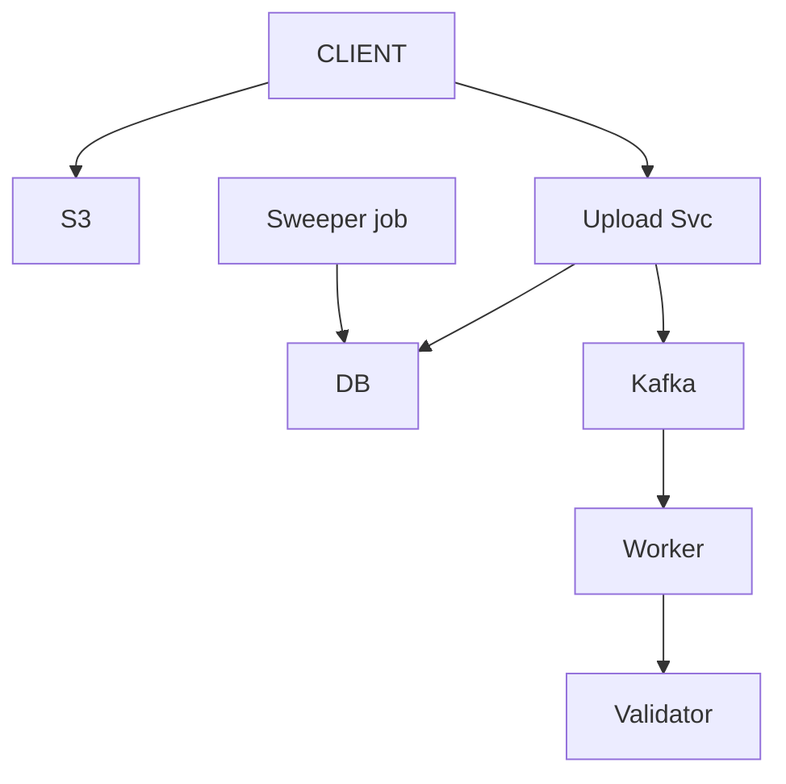
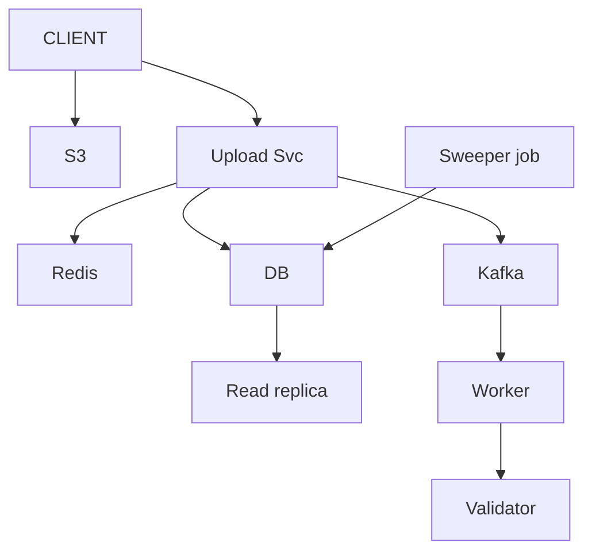
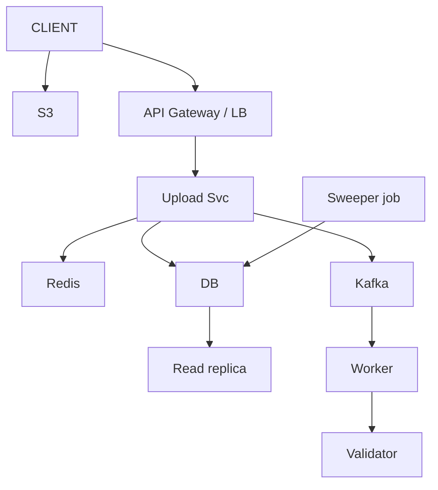
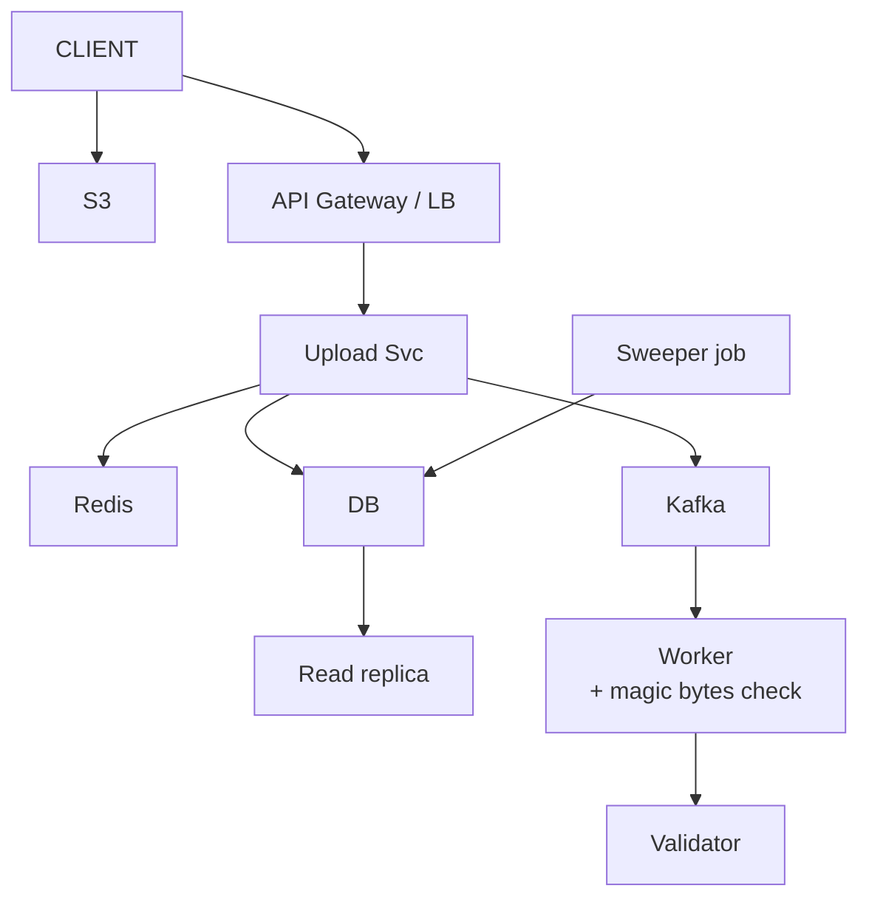

# File Upload + Validate + Track

> File / folder lo -> third-party se VALIDATE (2-3 sec) -> store -> user ko TRACKING link do.
> JP ne ye ACTUALLY poocha tha (asli SDE-3 writeup). General product design, finance nahi.
> Is design ka dil: **user WAIT na kare** (async + trackingId) + **bytes server se na guzrein** (presigned URL) + **status hamesha pata**.

---

## TASVEER (ByteByteGo / Alex Xu · CC BY-NC-ND 4.0)


Source: [How to Upload a Large File to S3](https://bytebytego.com/guides/how-to-upload-a-large-file-to-s3/)
(bada file -> presigned URL + MULTIPART: tukdon me, tukda fail to sirf wahi dobara)

---

## SHURU — poocho + numbers

```
POOCHO:  file SIZE limit? (10 MB ya 5 GB — design badal jaata)  <- bada = presigned + multipart
         kaunse TYPE allow? · validation kitna time? (2-3 sec) · sirf FILE ya FOLDER bhi?
         result turant chahiye ya baad me status?  <- turant nahi = async + tracking

FR:      upload · third-party VALIDATE · store · tracking link / status
         scope bahar: editing · sharing · versioning
NFR:     user WAIT na kare (dil) · data LOST na ho · status HAMESHA pata (kahan tak pahuncha) · scale + secure

NUMBERS: 1 lakh file / din -> ~1-2 write / sec (kam)       (1 din ~ 1,00,000 sec)
         par status BAAR-BAAR check -> READ-HEAVY
         reads >> writes -> status ke liye CACHE + read replica
         bada file       -> bytes DB me nahi, BLOB (S3)
         validation slow -> QUEUE + worker
```

---

## DABBA 0 — sabse simple

```
SOLUTION: client file server ko de · server S3 me rakhe · validator call kare (2-3 sec) · jawab wapas
```


---

## DIKKAT 1 — user 2-3 sec ruka, server ka thread bhi block

```
DIKKAT:   har upload pe validation ka intezaar

SOLUTION: teen option bolo, phir chuno:
          1. SYNC               -> user ruke, server block -> NAHI
          2. ASYNC + POLLING    -> upload pe TURANT trackingId + status "VALIDATING"
                                   validation peeche (queue + worker) · user GET /status poll kare  <- YAHI
          3. ASYNC + WEBHOOK    -> khatam hone pe notify (UX behtar, setup zyada)
          worker validate kare -> DB me status DONE / FAILED
          queue se validation ka load smooth

NAYA:     Kafka · Worker · DB (status)
BADLA:    Validator ab Upload Svc nahi, Worker call karta
```


---

## DIKKAT 2 — 5 GB file ke bytes mere app server se guzar rahe

```
DIKKAT:   CLIENT --5 GB--> server --5 GB--> S3 · bandwidth DOUBLE, thread block,
          server scale karna pada jabki usne kuch kiya hi nahi = ANTI-PATTERN

SOLUTION: PRESIGNED URL — client SEEDHA S3 pe
          1. client -> server: "ye file upload karni"
          2. server -> client: short-lived SIGNED URL + trackingId
          3. client -> S3: bytes SEEDHE
          4. client -> server: "ho gaya" (/upload/complete) -> queue me
          server sirf metadata + URL · bandwidth aadhi · S3 khud scale
          download bhi: presigned GET URL -> seedha S3 se

BADLA:    S3 ka raasta: Upload Svc -> S3  ->  CLIENT -> S3 (seedha)
```


---

## DIKKAT 3 — 5 GB file 90% pe toot gayi

```
DIKKAT:   poori dobara? user maar dega

SOLUTION: MULTIPART / RESUMABLE — chunks (5 MB) · chunk 3 fail -> sirf wahi retry
          sab ho gaye -> S3 ko "complete multipart" -> wo jodta
          multipart CLIENT aur S3 ke beech · server sirf har tukde ka presigned URL deta

NAYA:     koi dabba nahi
```

---

## DIKKAT 4 — init kiya, complete kabhi nahi / beech me crash

```
DIKKAT:   bytes S3 me padi, DB status adhoora = ORPHAN (paisa + gandagi)
          VALIDATING me atki file — koi dhoondhe hi nahi

SOLUTION: upload pehle tmp/ prefix me -> VALIDATE hone pe asli jagah copy
          S3 LIFECYCLE: "tmp/ me 1 DIN se purana -> DELETE" + "abort incomplete multipart" (ye bhi din me)
          lifecycle GHANTON me nahi, DINO me (kam se kam 1 din), aur DB status nahi dekh sakta
          -> SWEEPER job: status VALIDATING / UPLOADING + updatedAt 10 min se purana (normal 2-3 sec)
             -> S3 me bytes hain? -> queue me dobara, warna FAILED
          validation FAILED -> delete ya QUARANTINE bucket + status FAILED
          (ye edge case interviewer kuredega — khud bol do)

NAYA:     Sweeper job (der se atki file dhoondh ke dobara chalane / FAILED karne wala)
```

```
POOCHEGA: "What if the server crashes in the middle?"
DHYAAN:   status likhna kaafi nahi — koi use DHOONDHE bhi
BOL:      "Every file has a status, UPLOADING to VALIDATING to DONE or FAILED. A sweeper finds files stuck
           too long — VALIDATING for ten minutes when validation takes three seconds — and requeues them
           or marks them failed. S3 lifecycle rules clean up abandoned uploads."
```

---

## DIKKAT 5 — sab har 2 sec status poll kar rahe

```
DIKKAT:   har poll DB pe

SOLUTION: CACHE (Redis) + READ REPLICA
          ★ JAAL — STALENESS: worker ne VALIDATING -> DONE kiya, cache me purana "VALIDATING"
            -> worker update ke SAATH cache write-through / invalidate (ya bahut chhota TTL)
          normal cache se alag: yahan purana = seedha user ko galat status

NAYA:     Redis · Read replica
```


---

## DIKKAT 6 — prompt me FOLDER bhi tha

```
DIKKAT:   folder = N file

SOLUTION: PARENT trackingId -> har file ka child trackingId (apna /upload/init)
          parent status = ROLLUP: saare DONE -> DONE · koi FAILED -> PARTIAL / FAILED
          bahut chhoti files -> client zip kare -> ek upload -> server unzip

NAYA:     koi dabba nahi
```

---

## DIKKAT 7 — kisi ne DOOSRE ka trackingId daal ke file maang li

```
DIKKAT:   trackingId ek anuman-layak (guessable) string, aur usme "kiski file" likha hi nahi

SOLUTION: /upload/init pe user authenticated (JWT, gateway pe) -> record me ownerId likho
          /status + /download pe: maangne wala == owner? warna 403
          AUTHN "tum kaun" -> filter / JWT, ek jagah · AUTHZ "IS file pe haq?" -> filter nahi kar sakta,
          usne trackingId dekha hi nahi -> service me
          (PR review checklist me sabse upar: request me kisi ki CHEEZ ka naam -> maalik check kahan?)

NAYA:     API Gateway / LB (auth + traffic)
```


---

## DIKKAT 8 — owner ko S3 ka SEEDHA link diya, usne aage bhej diya

```
DIKKAT:   link hamesha chalta -> kisi ko bhi · owner check beech me aata hi nahi

SOLUTION: PRESIGNED URL chhoti umar (5-15 MINUTE, din nahi)
          owner check AB BHI hum karte — URL tabhi banta jab check paas
          URL "chaabi" nahi, "5 minute ka PAAS"
          DB me URL NAHI (mar jaata) — s3_key rakho, URL har maang pe NAYA

NAYA:     koi dabba nahi
```

---

## DIKKAT 9 — naam .pdf, Content-Type application/pdf, par asal me EXE — aur S3 me pad chuki

```
DIKKAT:   dono client ne bheje -> bharosa nahi · direct-to-S3 me file PEHLE girti, pakdi BAAD me

SOLUTION: worker PEHLE BYTE padhe (magic number), type KHUD tay kare
            PDF %PDF- · PNG \x89PNG · EXE MZ
          mel nahi -> REJECTED + delete / quarantine
          client ka bheja KABHI sach nahi — naam bhi nahi, Content-Type bhi nahi

NAYA:     koi dabba nahi — Worker me check
```

```
POOCHEGA: "How do you secure it / stop abuse?"
BOL:      "JWT at the gateway and an owner check on every status and download. Short-lived presigned URLs.
           The worker checks magic bytes instead of trusting the name or Content-Type. Per-user rate limit
           against upload floods, WAF at the edge, TLS, secrets in a vault."
```

---

## 10x SCALE — har dabba alag

```
Upload Svc   -> stateless, kai box + LB
S3           -> managed, khud scale · popular download -> CDN (CloudFront)
DB           -> status polling -> CACHE + READ REPLICA · bahut files -> SHARD (trackingId)
Redis        -> purana status -> write-through / invalidate
Kafka        -> validation backlog -> WORKER auto-scale (queue depth pe)
orphan       -> S3 lifecycle + sweeper

POOCHEGA: "How would you scale this to 10x?"      -> file ka raasta chalo, pehle jo toote
POOCHEGA: "What's the single point of failure?"   -> validator (third-party): circuit breaker + backup provider
POOCHEGA: "How do you know it's working?"
          MISAAL: raat ko validator SLOW, queue me 50,000 atki
          health check "slow" nahi pakadta (ping ka jawab aa jaata) -> APNA METRIC pakadta:
             queue depth / lag · validator p99 + error rate · VALIDATING me purani files ki ginti
             -> had paar = alert (CloudWatch alarm / PagerDuty), user ke complain se pehle
          peeche: 3 fail -> CIRCUIT BREAKER -> BACKUP PROVIDER (third-party ki replica hum nahi chala sakte)
BOL:      "I'd alert on our own metrics — queue depth, p99 and error rate of validator calls, and files stuck
           in VALIDATING. A health check only tells me it's up, not that it's slow. Behind that, a circuit
           breaker and a fallback provider."
```

---

## POOCHE TO (deep-dive)

```
API:      POST /upload/init { fileName, size }  -> presigned S3 URL + trackingId (server sirf URL deta)
          -> client SEEDHA S3 pe PUT
          POST /upload/complete { trackingId }   -> "ho gaya, validate karo" (queue)
          GET  /status/{trackingId}              -> VALIDATING / DONE / FAILED
          GET  /download/{trackingId}            -> presigned GET URL -> seedha S3

DB:       files: trackingId (KEY) | fileName | ownerId | status | s3_key | createdAt | updatedAt
          status: UPLOADING -> VALIDATING -> DONE / FAILED  ("kahan tak pahuncha" = failure handling ki buniyaad)
          PostgreSQL: simple key lookup par status ko ACID chahiye
          (bahut bada + pure key-value -> NoSQL bhi chalta · paisa hota -> hamesha SQL)

DEDUP:    content ka hash (MD5 / SHA) -> pehle se hai to dobara store nahi -> storage bachi
```

---

## AAKHRI DABBA + WRAP

```
Gateway / LB = auth · Upload Svc = metadata + presigned URL, bytes ko haath nahi · S3 = bytes, tmp/ + lifecycle
DB = trackingId + status + owner · Kafka + Worker = slow validation alag, magic bytes · Redis + replica = polling
Sweeper = atki file
```

```
BOL: "The client asks the upload service for a presigned URL and sends the bytes straight to S3 — multipart
      for big files. Validation takes two to three seconds, so it's async: the user gets a tracking id
      immediately, a worker validates from a queue, checks magic bytes and updates the status. Status is
      read-heavy, so Redis and a read replica, invalidated on every update. Owner checks and short-lived
      URLs secure it, lifecycle rules and a sweeper clean up. Next: retries on failure and a CDN for downloads."
```

ARCHETYPE B+F · CONCEPTS: [message-queues](../../FOUNDATIONS/07_message_queues.md) · [reliability/SPOF](../../FOUNDATIONS/11_reliability_spof_cloud.md) · [← MASTER SHEET](../../00_MASTER_SHEET.md)
