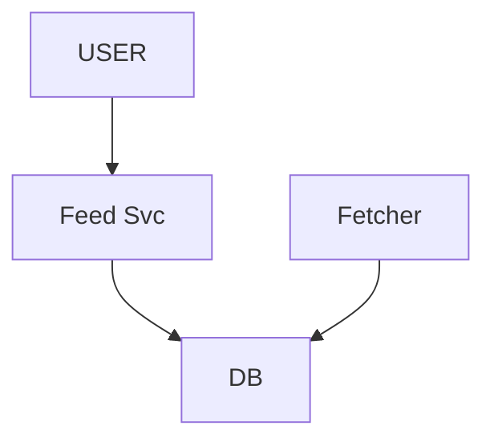
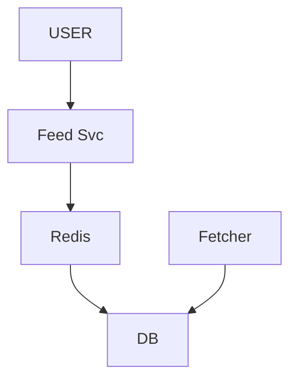
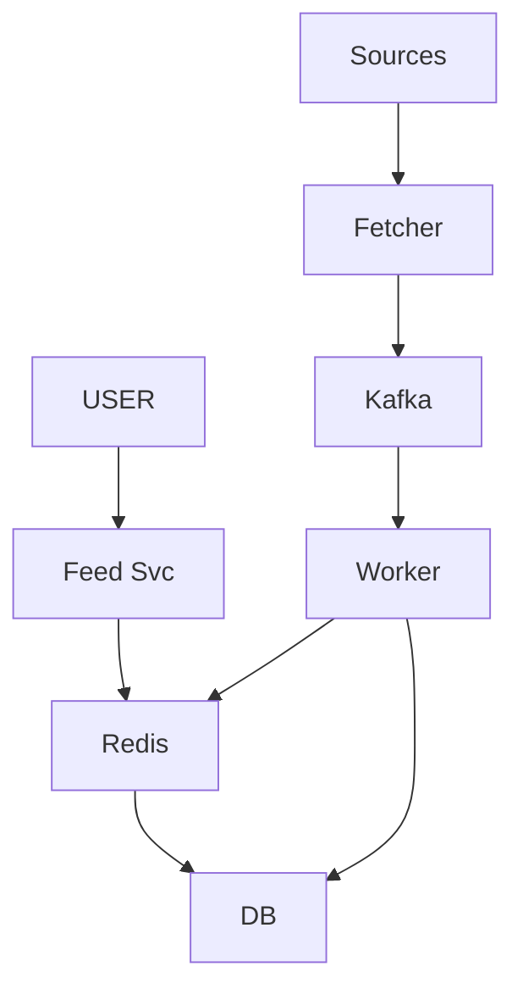
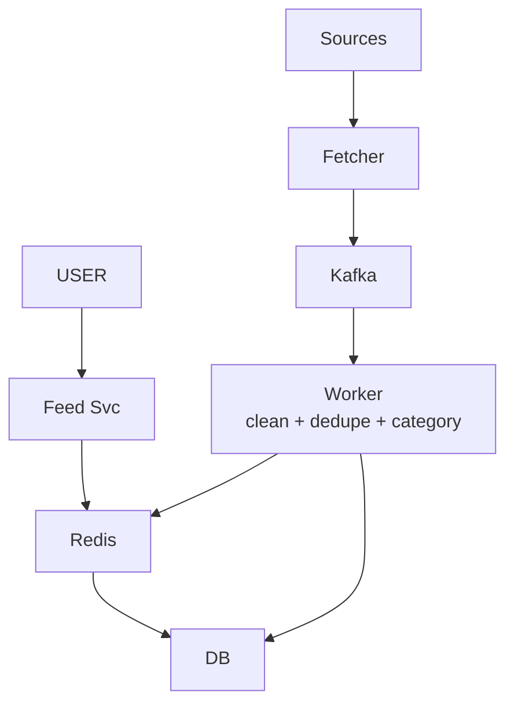
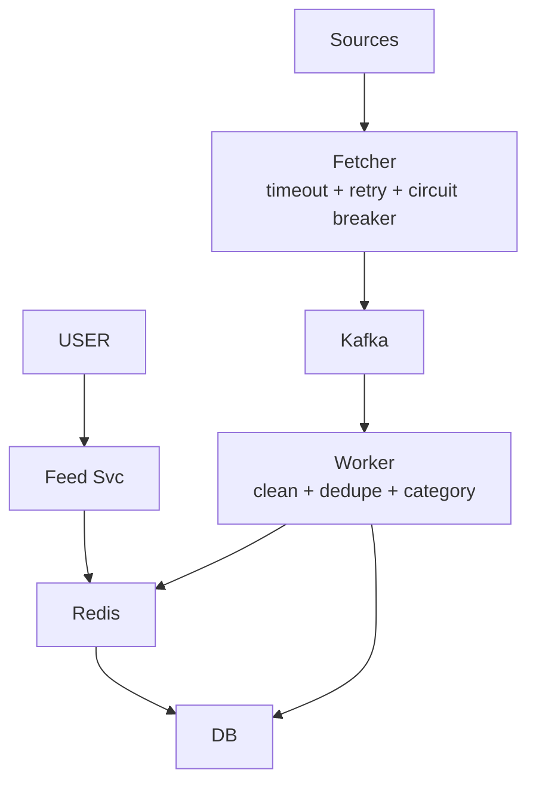
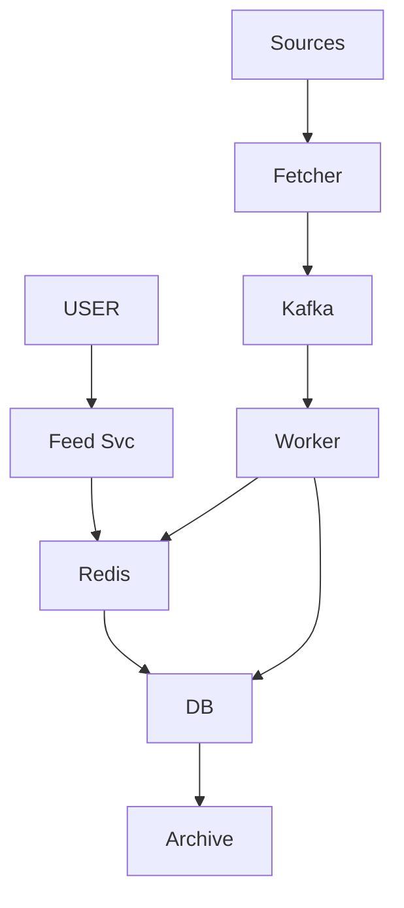
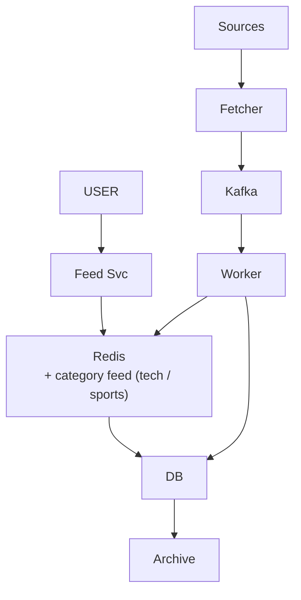
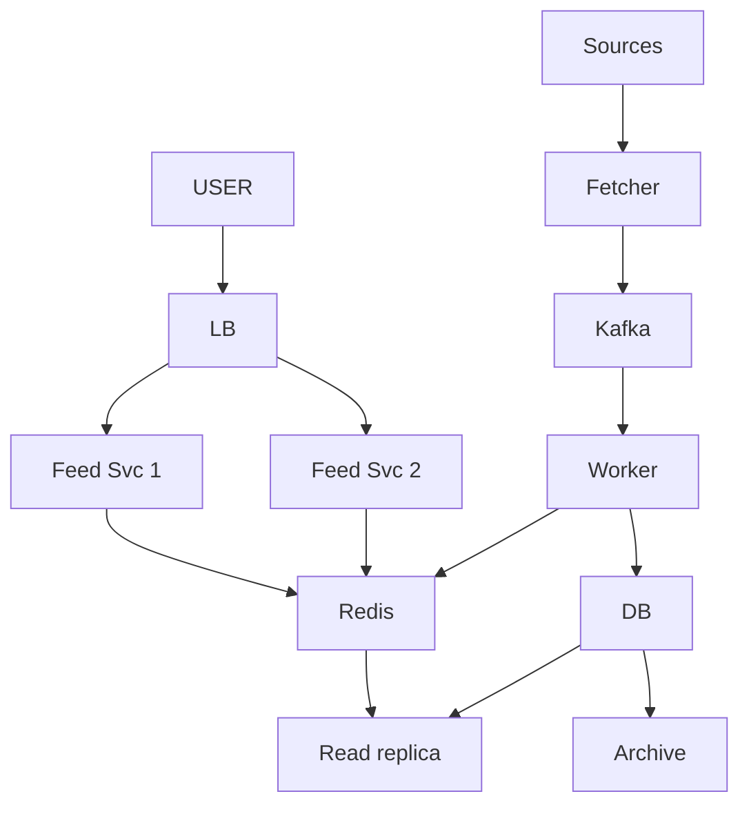
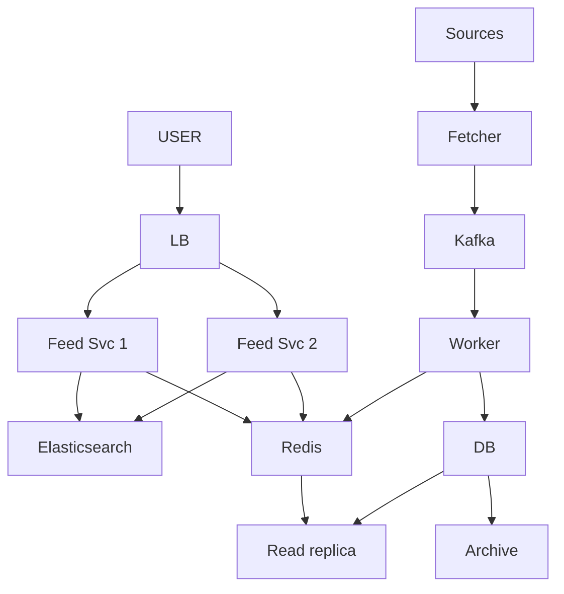

# News Aggregator

> Alag-alag source se news kheencho -> store -> user ko EK feed (Google News / Inshorts jaisa). JP general-product design.
> Is design ka dil: **READ >> WRITE** + **WRITE path aur READ path ALAG** + **feed precompute + cache**.

---

## TASVEER (ByteByteGo / Alex Xu · CC BY-NC-ND 4.0)


Source: [How to Avoid Crawling Duplicate URLs at Google Scale?](https://bytebytego.com/guides/how-to-avoid-crawling-duplicate-urls-at-google-scale/)
(crawler + DEDUPE — BLOOM FILTER: "ye URL pehle dekha?" kam memory me; kabhi galat haan, galat na kabhi nahi)

---

## SHURU — poocho + numbers

```
POOCHO:  "Do hisse: news andar laana (ingestion) aur feed dikhana — kis pe focus?"
         kitne SOURCE? 10 ya 10,000? · kitni FRESH? real-time ya 5 min purani chalegi?  <- haan = precompute + cache
         feed sabko SAME ya PERSONALIZED? · kitne user, kitni news / din?

FR:      sources se kheencho · store · FEED (latest list) · (optional) category / search
         scope bahar: comments · ML ranking
NFR:     feed FAST (dil) · news FRESH · lakhon user · ek SOURCE down ho to system na gire
         KEY SOCH: "har user feed kholta, news gine-chune source se -> READS >> WRITES"

NUMBERS: 10 lakh user x 5 / din = 50 lakh read / din = ~50 / sec (spike 5-10x = ~500 / sec)
         1000 source, har 5 min = ~3 lakh write / din = ~3 / sec          (1 din ~ 1,00,000 sec)
         reads >> writes   -> CACHE + READ REPLICA (dil)
         writes background -> QUEUE
         data badhta       -> ARCHIVE (+ bade scale pe SHARD)
```

---

## DABBA 0 — sabse simple

```
SOLUTION: Fetcher source se kheenche, DB me daale · Feed Svc "latest 20" nikaal ke de
```


---

## DIKKAT 1 — har request pe DB se "latest 20"

```
DIKKAT:   50 / sec, spike 500 / sec sab DB pe · aur sabko LAGBHAG WAHI feed chahiye thi

SOLUTION: teen option bolo, phir chuno:
          1. ON-THE-FLY (har request DB)  -> simple + fresh, spike pe DB down -> NAHI
          2. PRECOMPUTE + CACHE           -> ready feed (latest 20) Redis me, nayi news pe refresh  <- YAHI
                                             5 min purani chalegi (news me theek; paisa hota to nahi)
          3. FANOUT (har user ki feed)    -> fast + personal, par 10 lakh feed mehnga -> sirf tab jab personalization asli
          sabko same feed -> EK cache sab use karein
          user -> cache (99%) -> miss -> DB -> wapas cache

NAYA:     Redis
```


---

## DIKKAT 2 — 1000 source ek saath, fetch slow

```
DIKKAT:   user ki request pe fetch -> user ruka · 1000 ek saath -> spike

SOLUTION: WRITE PATH aur READ PATH bilkul ALAG (core decision)
          WRITE (background, slow): Sources -> Fetcher -> Kafka -> Worker -> DB + cache refresh
          READ (fast): User -> Feed Svc -> cache -> miss -> DB
          queue = 1000 ek saath aaye to absorb, worker apni raftaar se

NAYA:     Kafka · Worker
BADLA:    Fetcher ab seedha DB me nahi, Kafka me daalta
```


---

## DIKKAT 3 — ek hi khabar paanch source se aa gayi

```
DIKKAT:   feed me wahi news 5 baar

SOLUTION: WORKER ke andar 3 kaam:
          CLEAN (ads / HTML hatao, title / content nikaalo)
          DEDUPE (ek khabar 5 source pe -> ek) · URL dedupe = Bloom filter (tasveer)
          CATEGORY (tech / sports / politics tag)

NAYA:     koi dabba nahi — Worker me
```


---

## DIKKAT 4 — ek source down ya bahut slow

```
DIKKAT:   fetcher us pe atka -> baaki 999 ki news bhi ruki

SOLUTION: har source ka fetch alag (parallel), azaad · TIMEOUT · fail -> RETRY -> phir bhi nahi -> SKIP
          CIRCUIT BREAKER per source: N fail -> OPEN (call band, fail-fast) -> HALF-OPEN (ek test) -> CLOSED
          queue backlog spike sambhaale

NAYA:     koi dabba nahi — Fetcher me
```

```
POOCHEGA: "What if a source is slow or down?"
BOL:      "Each source is fetched independently with a timeout, retries, and a circuit breaker; if it keeps
           failing I skip it. One bad source can't block the other 999."
```

---

## DIKKAT 5 — 6 mahine me 5 crore row: disk, backup, kharcha badhta

```
DIKKAT:   ORDER BY published_at DESC LIMIT 20
          ★ SACH: published_at pe index -> 5 crore pe bhi MILLISECONDS (index ke sire se 20)
          query slow NAHI · asli = table + index + backup + restore sab 5 crore ka
          20 row nayi, baaki 4.99 crore koi padhta hi nahi

SOLUTION: RETENTION: latest ~7 din = garam table (chhoti) · purana = cold storage / archive
          time se PARTITION (mahina) -> purana DETACH -> S3 / Glacier · bilkul nahi chahiye -> TTL
          ye SHARDING nahi, RETENTION (aksar ek saans me bol dete)

NAYA:     Archive (purana data sasti jagah, jaise S3 Glacier)
```

```
POOCHEGA: "Data keeps growing — what happens in 3 years?"
BOL:      "Only the last week is hot. I partition by month and move old partitions to cold storage, with a
           TTL on what we never need. That's retention, not sharding."
```

---

## DIKKAT 6 — (sirf BADE scale pe) ek DB box likhai + data nahi jhel raha

```
DIKKAT:   source 100x / user-generated content

SOLUTION: IMAANDARI: humare number (3 write / sec, 7 din garam) pe ek box chal jaata -> SHARD ki zaroorat NAHI
          bolo: "is scale pe shard nahi; source 100x ya UGC aaye tab"
          tab: SHARD by date (ya category)
          date shard ka asar: saari NAYI likhai aaj wale shard pe -> HOT PARTITION

NAYA:     koi dabba nahi
```

---

## DIKKAT 7 — user ko apni pasand ki feed

```
DIKKAT:   per-user fanout mehnga (10 lakh feed)

SOLUTION: CATEGORY-WISE CACHE (beech ka raasta): feed:tech · feed:sports · feed:politics
          user prefs -> 2-3 category ki cached feed MERGE

NAYA:     koi dabba nahi — Redis me category keys
```


---

## DIKKAT 8 — subah 8 baje sab ek saath: ek Feed Svc ka CPU khatam

```
DIKKAT:   spike (subah / lunch / raat) · wahi box gira = feed band
          cache MISS seedha PRIMARY pe -> wahin fetcher 1000 source likh raha -> padhne ne likhne ko dheema kiya

SOLUTION: kai FEED SVC + LB -> spike + ek gire to baaki (stateless, feed cache me)
          cache-miss read -> READ REPLICA se, primary nahi -> padhna aur likhna alag raaste
          replica cache ki jagah nahi leti: cache 99% rokti, replica bache 1% ko primary se door rakhti
          ye READ spike hai -> Redis + replica jhelte; Kafka write path pe hai, read spike nahi jhelta

NAYA:     LB · Read replica
BADLA:    Feed Svc ek se DO — bojh bat gaya, ek gire to doosra chale (asal me zaroorat jitne, diagram me 2)
```


---

## DIKKAT 9 — "cricket" search karna hai

```
DIKKAT:   LIKE '%cricket%' = poora scan

SOLUTION: alag SEARCH INDEX (Elasticsearch, inverted index)
          worker article store kare -> saath me index update (async)
          search -> Elasticsearch -> matching ids -> content DB / cache se
          index thoda peeche chalega (1 min baad search me dikhe — theek)
          detail: [FOUNDATIONS/12_elasticsearch_search](../../FOUNDATIONS/12_elasticsearch_search.md)

NAYA:     Elasticsearch
```


---

## 10x SCALE — har dabba alag

```
READ:   Feed Svc  -> kai box + LB
        Redis     -> gira? cluster + replica, miss pe read replica
        DB        -> READ REPLICA · storage -> ARCHIVE (+ bade scale pe shard by date / category)
WRITE:  Fetcher   -> source down / slow -> timeout + retry + skip + circuit breaker
        Kafka     -> 1000 ek saath -> backlog absorb, partition badhao
        Worker    -> kai worker parallel
AAGE:   personalized (category cache) · images CDN · ML ranking · breaking news real-time push

POOCHEGA: "How would you scale this to 10x?"      -> dono raaste alag chalao, pehle jo toote
POOCHEGA: "What's the single point of failure?"   -> "ek box gira to sab?" -> wahi replicate
POOCHEGA: "How do you know it's working?"         -> feed p99 · cache hit rate · Kafka lag · source error rate · alert
```

---

## POOCHE TO (deep-dive)

```
API:      GET /feed?page=1&category=tech -> latest list (PAGED, infinite scroll; 10,000 ek saath nahi)
          GET /article/{id} · GET /search?q=cricket · POST /ingest { source data } (andar, background)
          GET = padhna · POST = state badalna (swap mat karna)

DB:       ARTICLE: id | title | content | sourceId | category | publishedAt | url
          SOURCE:  id | name | rssUrl | lastFetchedAt
          USER_PREFS (optional): userId | categories[] | savedArticles[]
          NoSQL (Mongo / Cassandra): bahut + simple + read-heavy + ACID nahi chahiye -> horizontal scale + flexible schema, eventual chalega
          CONTRAST: news -> NoSQL · PAISA / ledger -> HAMESHA SQL + ACID ("data ka nature dekho, phir DB")
          Cassandra ki asli taakat = LIKHNA (write-heavy, scale); read-heavy hissa Redis aage se sambhaalta
```

---

## AAKHRI DABBA + WRAP

```
WRITE: Sources -> Fetcher (timeout / retry / skip) -> Kafka (spike) -> Worker (clean + dedupe + category) -> DB + cache
READ:  LB -> Feed Svc (kai box) -> Redis (99%) -> miss pe Read replica · Elasticsearch = search · Archive = purana
```

```
BOL: "I keep the write path and read path separate. Sources are fetched in the background, go through Kafka
      to workers that clean, dedupe and categorise, and land in a NoSQL store — massive, simple data with no
      need for ACID; money would be SQL. Everyone wants roughly the same latest feed, so I precompute it in
      Redis and serve 99% from cache, with a read replica for misses. Feed services scale behind a load
      balancer, old news goes to cold storage, and search runs on Elasticsearch."
```

ARCHETYPE A+E · CONCEPTS: [elasticsearch](../../FOUNDATIONS/12_elasticsearch_search.md) · [caching](../../FOUNDATIONS/04_caching.md) · saath: [twitter-feed](../03_twitter_feed/03_twitter_feed.md) · [← MASTER SHEET](../../00_MASTER_SHEET.md)
