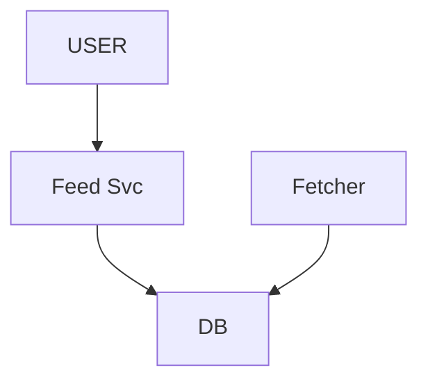
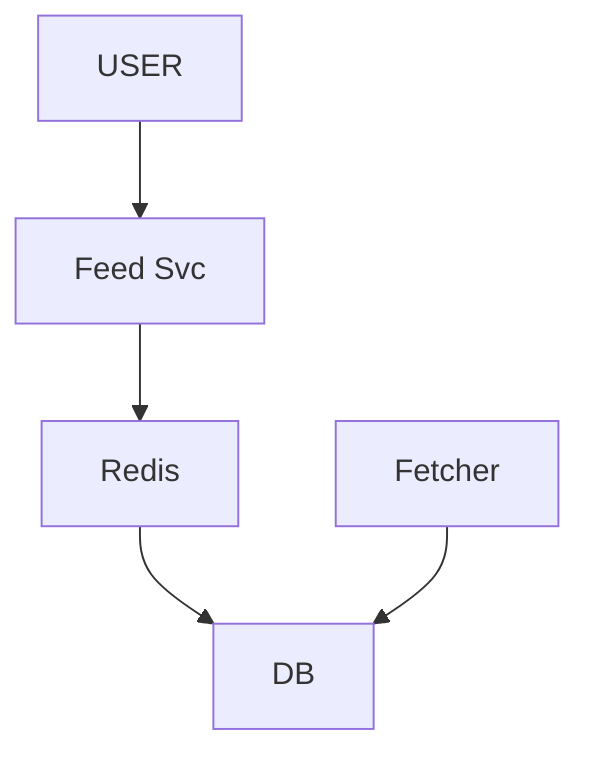
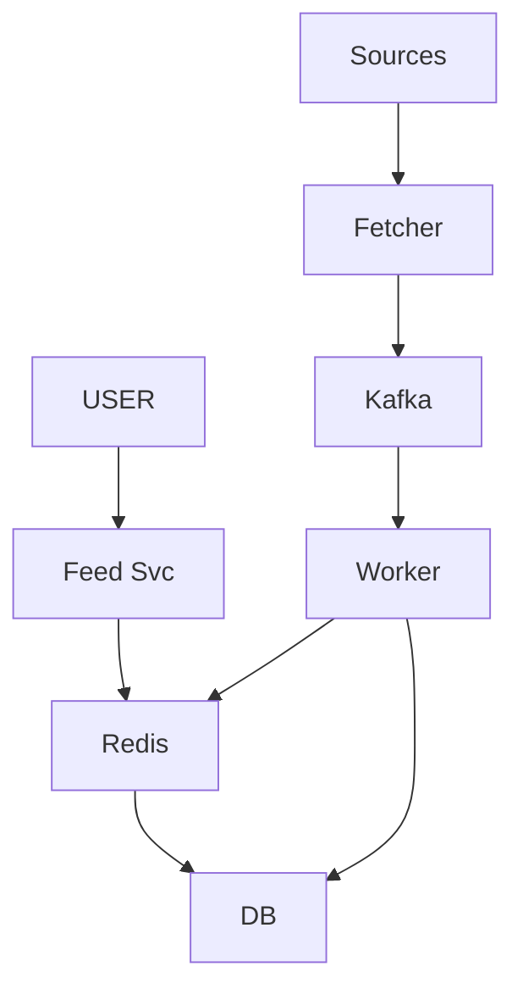
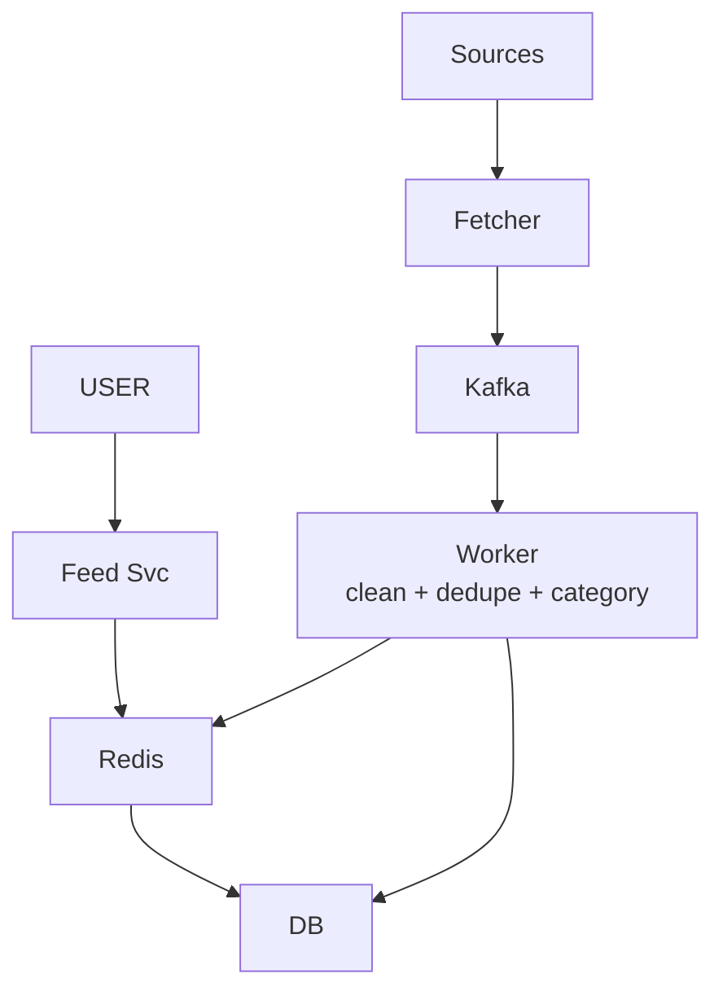
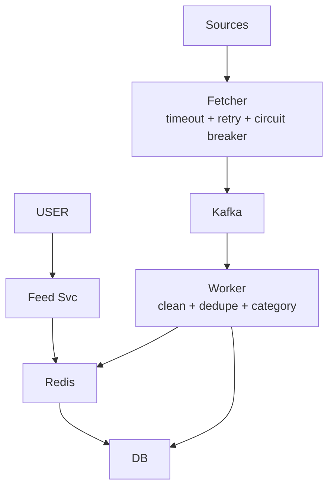
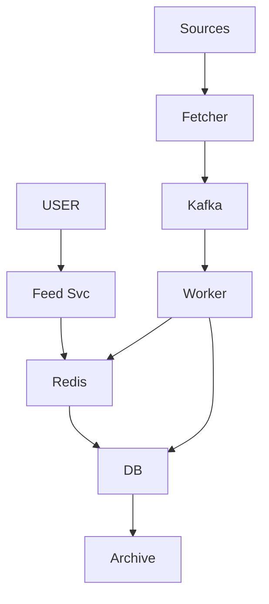
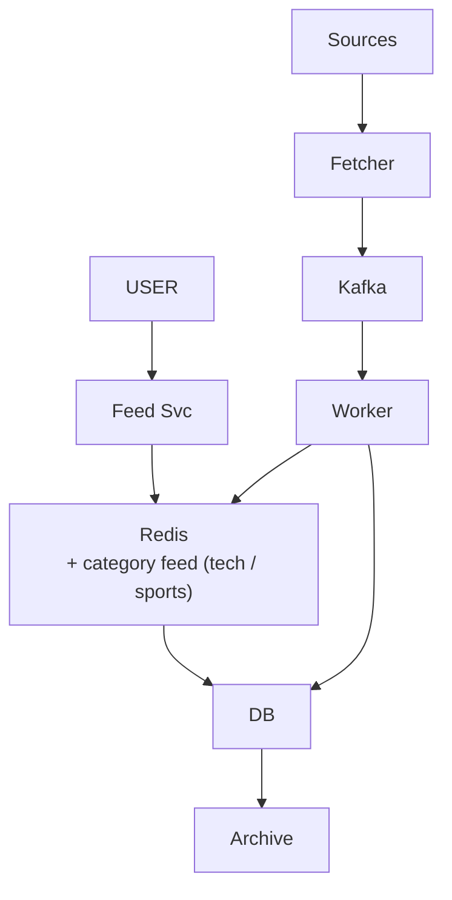
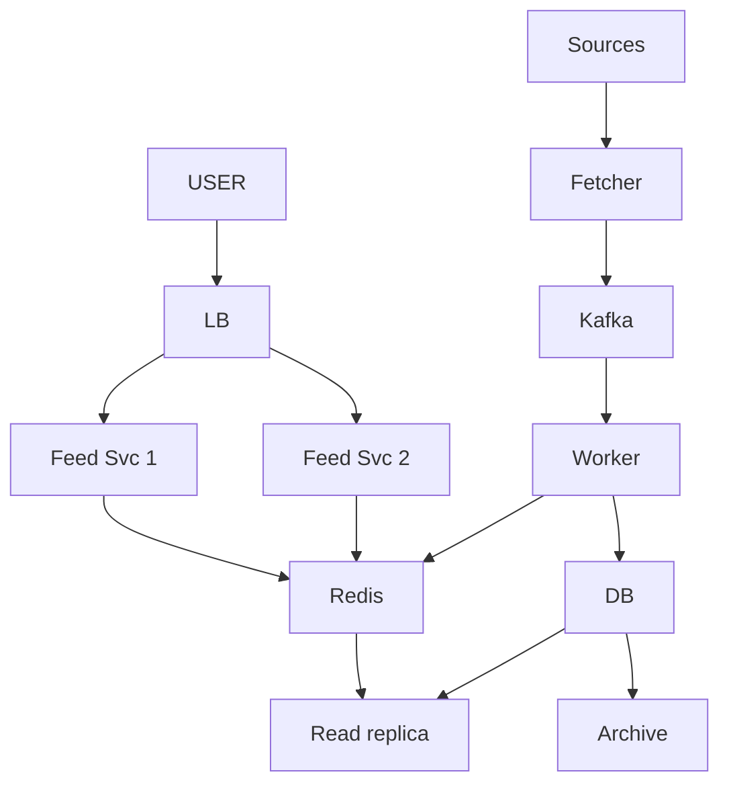
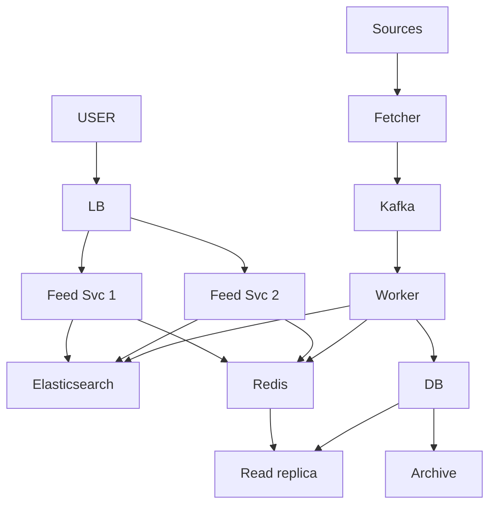

# News Aggregator

> Alag-alag source se news kheencho -> store -> user ko EK feed (Google News / Inshorts jaisa). JP general-product design.
> Is design ka dil: **READ >> WRITE** + **WRITE path aur READ path ALAG** + **feed precompute + cache**.

---

## TASVEER (ByteByteGo / Alex Xu · CC BY-NC-ND 4.0)


Source: [How to Avoid Crawling Duplicate URLs at Google Scale?](https://bytebytego.com/guides/how-to-avoid-crawling-duplicate-urls-at-google-scale/)
(crawler + DEDUPE — BLOOM FILTER: "ye URL pehle dekha?" kam memory me; kabhi galat haan, galat na kabhi nahi)

---

## SHURU — poocho + numbers

```
POOCHO:  "Do hisse: news andar laana (ingestion) aur feed dikhana — kis pe focus?"
         kitne SOURCE? 10 ya 10,000? · kitni FRESH? real-time ya 5 min purani chalegi?  <- haan = precompute + cache
         feed sabko SAME ya PERSONALIZED? · kitne user, kitni news / din?

FR:      sources se kheencho · store · FEED (latest list) · (optional) category / search
         scope bahar: comments · ML ranking
NFR:     feed FAST (dil) · news FRESH · lakhon user · ek SOURCE down ho to system na gire
         KEY SOCH: "har user feed kholta, news gine-chune source se -> READS >> WRITES"

NUMBERS: 10 lakh user x 5 / din = 50 lakh read / din = ~50 / sec (spike 5-10x = ~500 / sec)
         1000 source, har 5 min = ~3 lakh write / din = ~3 / sec          (1 din ~ 1,00,000 sec)
         reads >> writes   -> CACHE + READ REPLICA (dil)
         writes background -> QUEUE
         data badhta       -> ARCHIVE (+ bade scale pe SHARD)
```

---

## DABBA 0 — sabse simple

```
SOLUTION: Fetcher source se kheenche, DB me daale · Feed Svc "latest 20" nikaal ke de
```


---

## DIKKAT 1 — har request pe DB se "latest 20"

```
DIKKAT:   har request pe DB se "latest 20" -> spike me DB pe bojh. Aur sabko lagbhag WAHI feed chahiye.

SOLUTION: PRECOMPUTE + CACHE:
          (1) Ready feed Redis me, nayi news aane pe refresh. Sab EK cache use karein.
          (2) user -> cache -> miss -> DB -> wapas cache.
          Thodi purani feed news me chal jaati (paisa hota to nahi).
          (Har request pe DB = spike pe gira · har user ki alag feed = mehngi, sirf personalization pe.)

NAYA:     Redis

KAISE (Redis me feed):
          SORTED SET feed:latest -> member = articleId, score = publishedAt
          nayi news: ZADD feed:latest <time> <id> · purana kaato: ZREMRANGEBYRANK (sirf top 500 rakho)
          padhna: ZREVRANGE feed:latest 0 19 -> sabse nayi 20 id -> article ka data alag hash / cache se
```
```
BOARD PE: 50 / sec, spike 500 / sec · cache hit ~99% · feed 5 min purani chalegi

AGLA SAWAAL (tere jawab se):
  "5 min purani chalegi kaha, par breaking news turant chahiye?"
   -> worker nayi news aate hi ZADD karta -> asal me turant; 5 min = sabse bura haal
  "Page 2 (21-40)?"
   -> ZREVRANGE 20 39, ya cursor (aakhri dekhi news ka time) -> uske baad ki 20
```


---

## DIKKAT 2 — 1000 source ek saath, fetch slow

```
DIKKAT:   1000 source se news laana slow. User ki request pe laaye to user ruka; 1000 ek saath = spike.

SOLUTION: LIKHNE aur PADHNE ka raasta ALAG (core faisla):
          (1) Likhna peeche: sources -> fetcher -> Kafka -> worker -> DB + cache refresh.
          (2) Padhna tez: user -> feed service -> cache -> miss -> DB.
          Queue 1000 ek saath aayi news jhel leti, worker apni raftaar se.

NAYA:     Kafka · Worker
BADLA:    Fetcher ab seedha DB me nahi, Kafka me daalta

KAISE (Kafka spike kaise jhelta):
          Fetcher article ko topic me likh ke bhool jaata (disk pe log, ruka hua)
          workers apne offset se apni speed se padhte -> 1000 ek saath aaye to log lamba hua, kuch gira nahi
          partitions = kitne worker parallel (10 partition -> 10 worker)
KYUN YE:  SQS bhi chal jaata (simple); Kafka isliye ki baad me doosra consumer (search index, analytics) bhi
          wahi stream alag group se padh sake + replay
```
```
AGLA SAWAAL (tere jawab se):
  "Fetcher ek source ko kitni baar dekhe?"
   -> scheduler har source ka interval (bade source 1 min, chhote 15 min) + RSS ka ETag / Last-Modified
      -> kuch naya nahi to download hi nahi
  "Worker ne ek article do baar likha (event dobara)?"
   -> Mongo: URL / content hash pe unique index -> dobara insert fail = skip · Cassandra: hash ko primary key -> dobara likha = overwrite (idempotent, fail nahi)
```


---

## DIKKAT 3 — ek hi khabar paanch source se aa gayi

```
DIKKAT:   ek hi khabar paanch source se aa gayi -> feed me wahi news 5 baar.

SOLUTION: Worker ke andar:
          (1) CLEAN: ads / HTML hatao, title + content nikaalo.
          (2) DEDUPE: ek khabar kai source pe -> ek (URL dedupe ke liye Bloom filter).
          (3) CATEGORY tag: tech / sports / politics.

NAYA:     koi dabba nahi — Worker me

KAISE (same khabar, alag URL kaise pakde):
          title normalize (lowercase, chinh hatao) + hash -> same hash = same khabar
          thoda alag likha ho -> SimHash / MinHash: milte-julte text ke hash paas-paas -> "90% same" = duplicate
KAISE (Bloom filter):
          bit array + k hash function. URL aaya -> k jagah bit 1. Check: k me se koi 0 = pakka naya;
          sab 1 = SHAYAD dekha (false positive ho sakta, false negative kabhi nahi)
KYUN YE:  crore URL Redis SET me = bahut RAM; Bloom thodi si memory me. DB UNIQUE = har baar DB call
          false positive se ek naya URL kabhi chhoot sakta -> news me chalta
```
```
AGLA SAWAAL (tere jawab se):
  "Bloom filter me delete?"
   -> normal Bloom me nahi. Purane din ka filter hi phenk do (roz naya), ya counting Bloom
  "Duplicate me kaunsa source dikhaye?"
   -> pehle aaya / bada source; baaki 'aur sources' me link
```


---

## DIKKAT 4 — ek source down ya bahut slow

```
DIKKAT:   ek source down / bahut slow -> fetcher us pe atka, baaki sab ki news bhi ruki.

SOLUTION: (1) Har source ka fetch alag + parallel. Timeout, fail pe retry, phir bhi nahi to skip.
          (2) Har source pe CIRCUIT BREAKER: baar-baar fail -> call band, thodi der baad test call.

NAYA:     koi dabba nahi — Fetcher me
```
```
BOARD PE: CLOSED --N fail--> OPEN (fail-fast) --> HALF-OPEN (ek test) --> CLOSED

POOCHEGA: "What if a source is slow or down?"
BOL:      "Each source is fetched independently with a timeout, retries, and a circuit breaker; if it keeps
           failing I skip it. One bad source can't block the other 999."

AGLA SAWAAL (tere jawab se):
  "Source ne 429 diya (zyada maar rahe)?"
   -> us source ka interval badhao + Retry-After maano
  "Source permanent band?"
   -> kuch din circuit OPEN raha -> alert, source list se hatao
```


---

## DIKKAT 5 — 6 mahine me 5 crore row: disk, backup, kharcha badhta

```
DIKKAT:   6 mahine me crore-on rows -> disk, backup, kharcha badhta. (Query slow NAHI: published_at pe
          index hai.) Latest 20 ke alawa purana koi padhta hi nahi.

SOLUTION: RETENTION (ye sharding nahi):
          (1) Haal ka data (jaise 7 din) garam table me.
          (2) Table time se PARTITION (mahine wise), purana partition -> S3 / Glacier; nahi chahiye to TTL.
          NoSQL (Mongo / Cassandra) me har row pe TTL.

NAYA:     Archive (purana data sasti jagah, jaise S3 Glacier)
```
```
BOARD PE: ORDER BY published_at DESC LIMIT 20 -> index se ms me (5 crore pe bhi)
          partition by month -> purana DETACH -> S3 / Glacier

POOCHEGA: "Data keeps growing — what happens in 3 years?"
BOL:      "Only the last week is hot. I partition by month and move old partitions to cold storage, with a
           TTL on what we never need. That's retention, not sharding."

AGLA SAWAAL (tere jawab se):
  "Koi purani news ka link khole (archive me hai)?"
   -> article page archive / S3 se (dheema chalega) ya chhota 'purana' table
  "Partition DETACH karte waqt table lock?"
   -> normal DETACH parent table pe chhota ACCESS EXCLUSIVE lock leta (lambi query ke peeche rukega).
      PG 14+ me DETACH PARTITION ... CONCURRENTLY -> bina block. Copy pehle se kar lo
```


---

## DIKKAT 6 — (sirf BADE scale pe) ek DB box likhai + data nahi jhel raha

```
DIKKAT:   (sirf bade scale pe) ek DB box likhai + data nahi jhel raha (source 100x / user content).

SOLUTION: (1) Humare number pe ek box chal jaata, SHARD ki zaroorat NAHI. Ye imaandari se bolo.
          (2) Zaroorat aaye tab date / category se shard. ★ Date se shard = saari nayi likhai aaj wale
              shard pe (hot partition).

NAYA:     koi dabba nahi

KYUN YE (date ka hot partition kaise theek):
          hash(article_id) se shard -> likhai sab shards pe barabar
          keemat: "latest 20" ab har shard se thoda-thoda laana padta (scatter-gather) -> par wo Redis se aata hi hai
          date chuna to sirf isliye ki purana shard poora uthake archive (retention aasaan)
```
```
BOARD PE: ~3 write / sec · 7 din garam -> ek box kaafi

AGLA SAWAAL (tere jawab se):
  "Category se shard karo to?"
   -> sports / politics bade, baaki chhote -> bojh barabar nahi (skew)
  "Shard badhane pe data khiskana?"
   -> consistent hashing -> kam data hilta
```


---

## DIKKAT 7 — user ko apni pasand ki feed

```
DIKKAT:   user ko apni pasand ki feed chahiye, par har user ki alag feed (fanout) bahut mehngi.

SOLUTION: Har CATEGORY ki alag cached feed (tech, sports...). User ki 2-3 category utha ke milao.

NAYA:     koi dabba nahi — Redis me category keys
```
```
BOARD PE: feed:tech · feed:sports · feed:politics -> user prefs -> 2-3 merge

AGLA SAWAAL (tere jawab se):
  "Merge kaise (teen category ki 20-20)?"
   -> teeno sorted set se top 20 lo, time se merge (ya Redis ZUNIONSTORE), top 20 dikhao
  "Har user ki pasand alag-alag weight?"
   -> tab asli personalization -> per-user feed / ranking service (abhi scope se bahar)
```


---

## DIKKAT 8 — subah 8 baje sab ek saath: ek Feed Svc ka CPU khatam

```
DIKKAT:   subah 8 baje sab ek saath -> ek Feed service ka CPU khatam, wahi gira to band.
          Cache miss seedha primary pe, jahan fetcher likh raha -> padhne ne likhne ko dheema kiya.

SOLUTION: (1) Kai Feed service box (stateless) + LB.
          (2) Cache miss wala read READ REPLICA se, primary se nahi.
          Cache zyada-tar read rokta, replica bache hue ko primary se door rakhti. (Kafka read spike nahi jhelta.)

NAYA:     LB · Read replica
BADLA:    Feed Svc ek se DO — bojh bat gaya, ek gire to doosra chale (asal me zaroorat jitne, diagram me 2)
```
```
AGLA SAWAAL (tere jawab se):
  "Subah 8 baje pata hai spike aayega?"
   -> 7:45 pe pehle se box badhao (scheduled scaling) + cache warm
  "Replica kitni peeche?"
   -> kuch second, news ke liye chalta
```


---

## DIKKAT 9 — "cricket" search karna hai

```
DIKKAT:   "cricket" search -> DB me LIKE '%cricket%' = poori table scan.

SOLUTION: (1) Alag SEARCH INDEX (Elasticsearch, inverted index). Worker save ke saath index bhi update (async).
          (2) Search ES se matching IDs, content DB / cache se. Index thoda peeche, theek hai.
          Detail: [FOUNDATIONS/12_elasticsearch_search](../../FOUNDATIONS/12_elasticsearch_search.md)

NAYA:     Elasticsearch

KAISE (inverted index):
          article ke text ko shabdon me todo -> har shabd ki list: "cricket" -> [a12, a45, a90]
          search "cricket kohli" -> dono list ka intersection -> score (kitni baar, kahan) se sort
KYUN YE:  Postgres full-text (GIN index) bhi chalta chhote scale pe -> ES isliye ki ranking, typo, bahut data,
          aur DB pe search ka bojh nahi
```
```
AGLA SAWAAL (tere jawab se):
  "ES aur DB me data alag-alag ho gaya?"
   -> DB = sach. ES dobara bana sakte (reindex). Worker ES likhne me fail -> retry queue
  "Typo (crikcet)?"
   -> ES fuzzy search (1-2 akshar ka farak)
```


---

## 10x SCALE — har dabba alag

```
READ:   Feed Svc  -> kai box + LB
        Redis     -> gira? cluster + replica, miss pe read replica
        DB        -> READ REPLICA · storage -> ARCHIVE (+ bade scale pe shard by date / category)
WRITE:  Fetcher   -> source down / slow -> timeout + retry + skip + circuit breaker
        Kafka     -> 1000 ek saath -> backlog absorb, partition badhao
        Worker    -> kai worker parallel
AAGE:   personalized (category cache) · images CDN · ML ranking · breaking news real-time push

POOCHEGA: "How would you scale this to 10x?"      -> dono raaste alag chalao, pehle jo toote
POOCHEGA: "What's the single point of failure?"   -> "ek box gira to sab?" -> wahi replicate
POOCHEGA: "How do you know it's working?"         -> feed p99 · cache hit rate · Kafka lag · source error rate · alert
```

---

## POOCHE TO (deep-dive)

```
API:      GET /feed?page=1&category=tech -> latest list (PAGED, infinite scroll; 10,000 ek saath nahi)
          GET /article/{id} · GET /search?q=cricket · POST /ingest { source data } (andar, background)
          GET = padhna · POST = state badalna (swap mat karna)

DB:       ARTICLE: id | title | content | sourceId | category | publishedAt | url
          SOURCE:  id | name | rssUrl | lastFetchedAt
          USER_PREFS (optional): userId | categories[] | savedArticles[]
          NoSQL (Mongo / Cassandra): bahut + simple + read-heavy + ACID nahi chahiye -> horizontal scale + flexible schema, eventual chalega
          CONTRAST: news -> NoSQL · PAISA / ledger -> HAMESHA SQL + ACID ("data ka nature dekho, phir DB")
          Cassandra ki asli taakat = LIKHNA (write-heavy, scale); read-heavy hissa Redis aage se sambhaalta
          "primary + read replica" wala dhaancha = Mongo (replica set); Cassandra me primary hota hi nahi, har node padh-likh leta
```

---

## AAKHRI DABBA + WRAP

```
WRITE: Sources -> Fetcher (timeout / retry / skip) -> Kafka (spike) -> Worker (clean + dedupe + category) -> DB + cache
READ:  LB -> Feed Svc (kai box) -> Redis (99%) -> miss pe Read replica · Elasticsearch = search · Archive = purana
```
```
BOL: "I keep the write path and read path separate. Sources are fetched in the background, go through Kafka
      to workers that clean, dedupe and categorise, and land in a NoSQL store — massive, simple data with no
      need for ACID; money would be SQL. Everyone wants roughly the same latest feed, so I precompute it in
      Redis and serve 99% from cache, with a read replica for misses. Feed services scale behind a load
      balancer, old news goes to cold storage, and search runs on Elasticsearch."
```


ARCHETYPE A+E · CONCEPTS: [elasticsearch](../../FOUNDATIONS/12_elasticsearch_search.md) · [caching](../../FOUNDATIONS/04_caching.md) · saath: [twitter-feed](../03_twitter_feed/03_twitter_feed.md) · [← MASTER SHEET](../../00_MASTER_SHEET.md)
