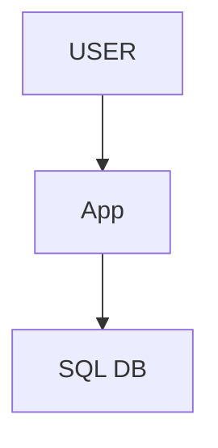
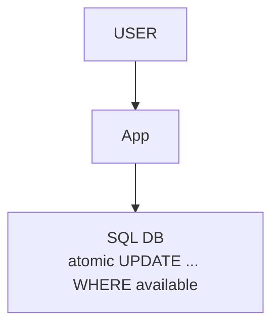
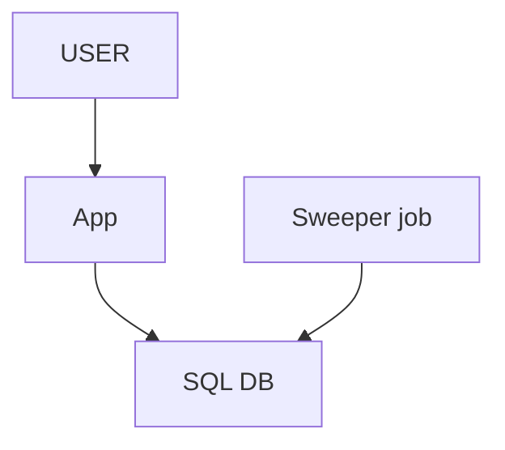
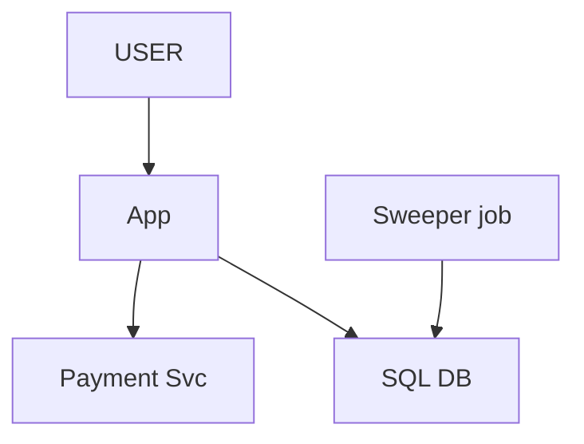
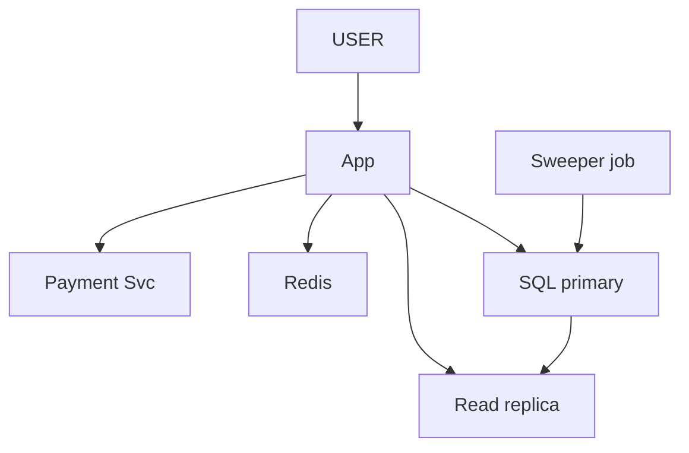
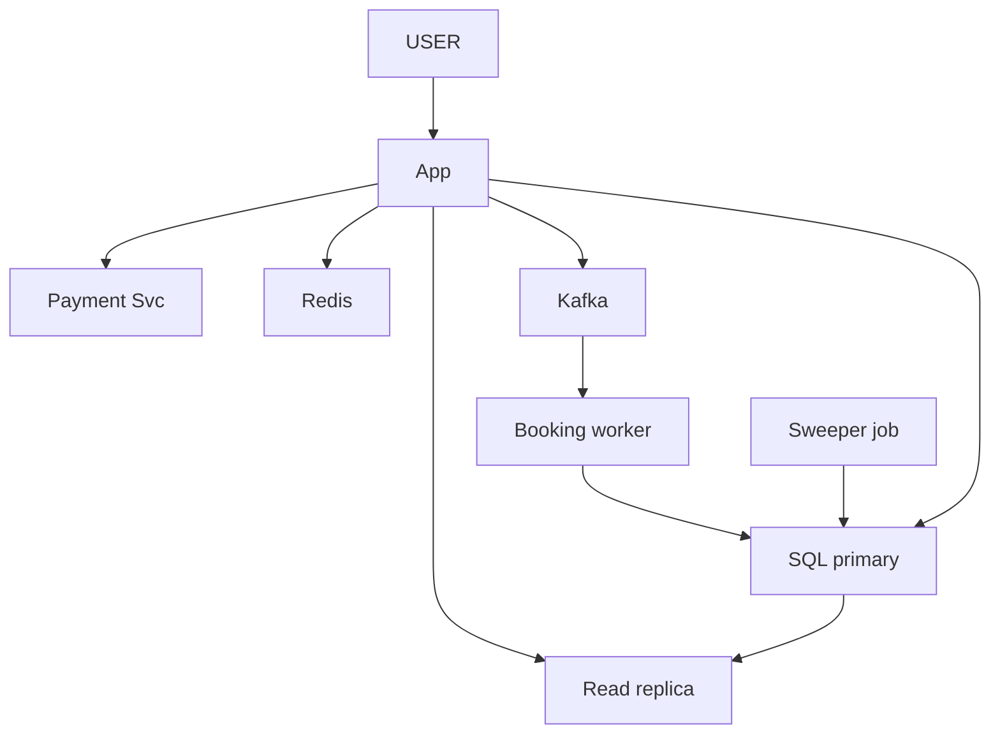
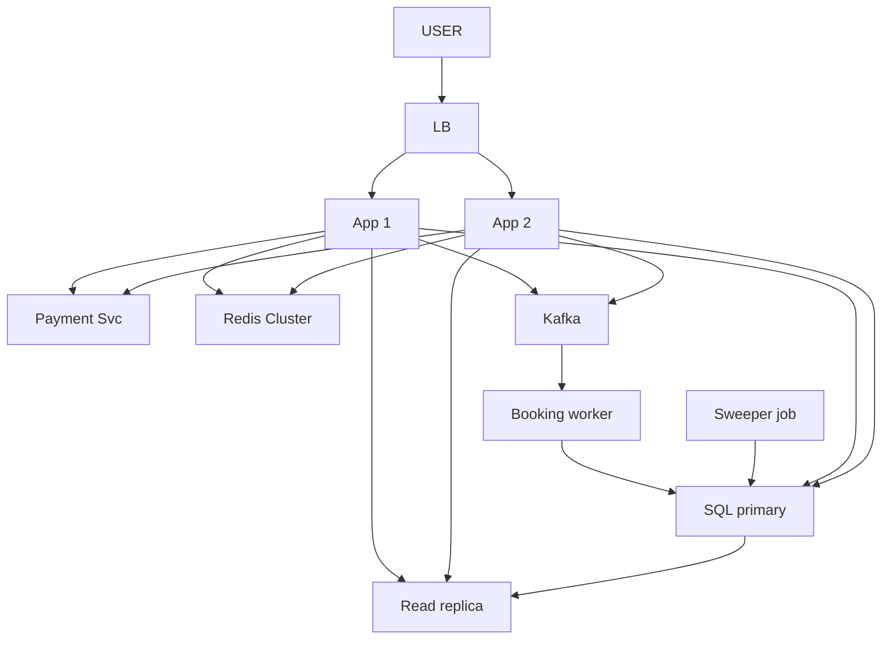

# BookMyShow (Ticket Booking)

> Movie / show dekho -> seat chuno -> pay -> ticket. JP-relevant: consistency-critical (trading ke no-double-spend jaisa).
> Is design ka dil: **do log EK seat na lein** (concurrency) + **popular release ki bheed**.

---

## TASVEER (ByteByteGo / Alex Xu · CC BY-NC-ND 4.0)


Source: [CAP Theorem: One of the Most Misunderstood Terms](https://bytebytego.com/guides/cap-theorem-one-of-the-most-misunderstood-terms/)
(booking CP, search AP)


Source: [Pessimistic vs Optimistic Locking](https://bytebytego.com/guides/pessimistic-vs-optimistic-locking/)
(ek seat do log = SELECT FOR UPDATE (pessimistic) ya version check (optimistic))

---

## SHURU — poocho + numbers

```
POOCHO:  "Browse, booking, payment, refund, recommendation — main seat BOOKING pe, asli dikkat wahin."
         popular release pe ek saath kitne log same show pe?  <- spike = doosra bada dushman (pehla: double booking)
         payment khud ya external gateway? · seat chunne ke baad kitni der HOLD? · refund scope me?

FR:      movies / shows dekho · seat map · seat BOOK (payment) · ticket confirm
         scope bahar: refund · recommendation · review
NFR:     EK seat DO ko na bike (CONSISTENCY, dil) · browse fast · popular show ki bheed jhele · reliable

NUMBERS: 10M user · DO ALAG load (ek number mat bolo):
         BROWSE (shows / seat map) = sab karte -> lakhon read -> READ-HEAVY -> CACHE + READ REPLICA
         BOOKING = kam log, par concurrency-critical + SPIKY (same seat pe ek saath) -> QUEUE
         data chhota (movies / shows / seats gine-chune) -> SHARDING KI ZAROORAT NAHI (ye bolna)
```
```
POOCHEGA: "Consistency or availability — which do you pick?"  (chhota: "network toota, aakhri seat pe do log — C ya A?")
DHYAAN:   ek hi system me dono: BOOKING = CP (partition me ek side REJECT) · SEARCH = AP (seat count 2 sec purana chalega)
BOL:      "For the booking itself I'd pick consistency: I'd rather reject a write than double-book the seat.
           The search path stays available and eventually consistent."
```

---

## DABBA 0 — sabse simple

```
SOLUTION: seats(seat_id, show_id, status) · "book" dabao -> status = 'booked'
```


---

## DIKKAT 1 — do ALAG user ne EK SAATH A1 book kar di

```
DIKKAT:   do alag user ne ek saath ek hi seat book kar di — dono ne dekha "khali hai", dono ne book kiya =
          ek seat do ko (check-then-act race)

SOLUTION: check aur book ek hi ATOMIC step me: ek conditional UPDATE — "seat book karo, SIRF agar abhi
          bhi available hai". DB me sirf ek ka lagega, doosre ka 0 row badlega -> "seat ja chuki, doosri chuno".
          Doosre raaste: row lock (SELECT ... FOR UPDATE) ya optimistic (version column). Conditional
          update sabse accha.

NAYA:     koi dabba nahi — SQL ka atomic update

KAISE (DB andar kya karta):
          X aur Y ka UPDATE ek saath -> X ne A1 row ka lock liya, Y ruka
          X commit (status = booked) -> Y ka lock mila, WHERE dobara check: status ab 'available' nahi -> 0 row
KYUN conditional UPDATE (baaki do kyun nahi):
          FOR UPDATE -> SELECT + UPDATE = do round-trip, lock poore beech pakda -> dheema, deadlock ka risk
          OPTIMISTIC (version) -> haara wala retry kare; seat pe retry bekaar (seat gayi to gayi)
          conditional UPDATE -> EK statement, lock sabse chhota, haara turant "taken" 
```

```
BOARD PE: X: "A1 available?" haan · Y: "A1 available?" haan · X book · Y book = A1 do ko
          UPDATE seats SET status = 'booked', user_id = X
           WHERE seat_id = 'A1' AND status = 'available'      -> doosre ko 0 row

POOCHEGA: "Two users book the same seat at the same time — what happens?"
DHYAAN:   2 user ek cheez = atomic / lock · 1 user ka retry = idempotency (dikkat 3)
BOL:      "Doing it in two steps always leaves a gap, so I put the condition inside the UPDATE — WHERE
           status is available. The database lets only one win; the other gets zero rows and 'seat taken'."

AGLA SAWAAL (tere jawab se):
  "User ne 4 seat ek saath chuni, 3 mili 1 nahi?"
   -> chaaron EK transaction me: UPDATE ... WHERE seat_id IN (...) AND available -> rows 4 nahi to ROLLBACK
      deadlock na ho isliye seat_id ke kram me lock (A1, A2, A3...)
  "Ek seat ki row pe itna lock, DB slow?"
   -> lock milliseconds ka (ek statement); bheed DIKKAT 5 me queue se
```

---

## DIKKAT 2 — seat chuni, ab 3 min payment kar raha

```
DIKKAT:   seat chuni, user 3 min payment kar raha. Available rakhi to koi aur le gaya; booked kar di to
          payment fail hone pe seat hamesha ke liye block.

SOLUTION: SEAT HOLD + expiry: chunte hi 'held' aur kab tak (5 min). Payment ho gaya -> 'booked', time
          nikla -> seat wapas khuli.
          ★ Par SQL me TTL nahi hota — row apne aap nahi badalti, time nikalne
          ke baad bhi 'held' likha rahega.
          Kisi ko karna padta.
          Raasta 1: booking ka UPDATE hi expire hua hold khaali maane — "available ho, YA held ho par time
          nikal gaya". Ye atomic hai, sahi-pan yahi deta.
          Raasta 2: SWEEPER job har minute expire hue hold wapas available kare — safai ke liye. Kami: ~1
          min tak 'held' dikh sakti.
          Dono saath: update ka check = sahi-pan, sweeper = safai.

NAYA:     Sweeper job (har minute expired hold ko wapas available karne wala)

KYUN YE (hold Redis SET NX EX 300 se kyun nahi):
          Redis hold + DB booking = do jagah sach -> Redis ne hold diya, DB me kisi aur ka booked -> farak
          DB me hold = seat ka haal EK row me, ek atomic UPDATE me -> hamesha ek hi sach
          Redis tab theek jab sirf hold (waiting room) ho aur booking DB pe dobara check kare
```

```
BOARD PE: UPDATE seats SET status = 'held', user_id = 'B', held_until = now() + INTERVAL 5 MINUTE
           WHERE seat_id = 'A1'
             AND ( status = 'available' OR (status = 'held' AND held_until < now()) );
          B aaya 10:06 -> purana WHERE status = 'available' -> 0 row -> galti se "taken"
          sweeper: UPDATE seats SET status = 'available', user_id = NULL, held_until = NULL
                    WHERE status = 'held' AND held_until < now();

POOCHEGA: "Who releases the hold after 5 minutes?"
BOL:      "SQL has no TTL, so either the booking UPDATE treats an expired hold as free — status held and
           held_until before now — or a sweeper job flips expired holds back every minute. I'd put the check
           in the UPDATE for correctness and keep the sweeper for cleanup."

AGLA SAWAAL (tere jawab se):
  "Hold khatam hone ke 1 sec baad payment aayi?"
   -> payment confirm karte waqt bhi UPDATE ... WHERE status = 'held' AND user = X AND held_until > now()
      -> 0 row = seat gayi -> paisa refund
  "User 5 min me 10 seat hold karke chala gaya (seat rokna)?"
   -> per-user hold limit + rate limit
```

---

## DIKKAT 3 — payment page pe "Pay" do baar daba diya

```
DIKKAT:   payment page pe "Pay" do baar daba diya -> ek booking ka do baar charge

SOLUTION: IDEMPOTENCY KEY (payment wala tool): client key banata, retry pe wahi. Server atomic claim
          karta (unique constraint / Redis SET NX); dobara aaye to saved result, error nahi.
          ★ Do alag cheez, confuse mat karna: do ALAG user, ek seat = users ke beech race -> atomic mark
          (dikkat 1). Ek hi user, duplicate request = retry -> idempotency (ye).
          ("seat mark-booked kar do, doosra taken dekhe" = atomic mark hai, idempotency nahi.)

NAYA:     Payment Svc (external, idempotency key ke saath)
```

```
POOCHEGA: "What if the user clicks Pay twice / the client retries?"
BOL:      "The client sends the same idempotency key on a retry; the server claims it atomically with a
           unique constraint and returns the stored result the second time."

AGLA SAWAAL (tere jawab se):
  "Payment success par booking UPDATE fail (hold gaya)?"
   -> refund flow (paisa wapas) + user ko batao. Payment aur seat ka faisla saga jaisa
  "Payment webhook late aaya?"
   -> booking 'PAYMENT_PENDING', hold thoda badhao ya reconciliation
```

---

## DIKKAT 4 — book koi-koi karta, seat map SAB dekh rahe

```
DIKKAT:   book koi-koi karta, par seat map sab dekh rahe — lakhon read aur nazuk booking ek hi DB pe

SOLUTION: dono raaste alag: browse -> Redis (seat map + show data) + read replica. Booking -> SQL primary
          (atomic update). Seat map thoda purana dikhe to chalega, booking pe asli check hota hi hai.

NAYA:     Redis · Read replica

KAISE (seat map fresh kaise):
          read: Redis seatmap:show42 -> miss -> replica se banao -> Redis me (TTL chhota, jaise 5 sec)
          booking hua -> worker seatmap:show42 ki key DEL (ya us seat ka bit update)
          agla read naya map bana leta. Thoda purana dikhe to bhi booking ka UPDATE asli check karta
```

```
BOARD PE: browse ~99% Redis hit

AGLA SAWAAL (tere jawab se):
  "Seat map live update (seat lal ho jaye)?"
   -> WebSocket / SSE: booking pe event -> us show ke users ko push
  "Ek popular show ki key pe lakhon read?"
   -> key ki kai copy + App me 1-2 sec ka local cache
```

---

## DIKKAT 5 — popular release: lakhon log, wahi show, wahi seat

```
DIKKAT:   popular release: lakhon log, wahi show, wahi seats -> spike seedha DB pe, ek hi rows pe ladaai,
          DB thapp

SOLUTION: QUEUE (Kafka) + har show ka worker: us show ki requests ek-ek karke, atomic update, ladaai kam.
          Queue kyun, replica / LB kyun nahi: replica READ scale karti, likhne ka spike queue jhelti.
          VIRTUAL WAITING ROOM ("aapka number 12,340") se load smooth.
          IDEA = darwaze pe ginti (admission control): jitni seat utne andar, baaki ko turant
          "housefull" / waiting room — log bekaar line me nahi phanste. Counter bhi atomic (Redis DECR).
          ★ Par BookMyShow me user KHAAS seat chunta: ginti batati "kitni bachi", ye nahi "teri wali bachi".
          Isliye turant "booked" mat bolo (warna baad me "sorry, cancel" = sabse bura UX) — pehle "booking
          in progress", worker ka update jeete tab "confirmed", haare to "ye seat gayi".
          Seat number nahi (concert standing, sale stock) -> ye idea jaisa hai poora sahi.
          "BookMyShow aise karta" mat bolo — bolo "a common pattern in flash sales".

NAYA:     Kafka · Booking worker (ek show ki request ek-ek karke atomic update kare) · gate counter (Redis me, darwaze pe ginti)

KAISE (per-show worker):
          Kafka key = show_id -> ek show ki saari request EK partition me, kram se
          ek partition = ek consumer -> wo show ki request ek-ek karke chalata -> DB pe us show ka contention khatam
          alag show = alag partition = parallel
```

```
BOARD PE: seat 3000, user 5000 -> pehle 3000 andar, 2000 ko turant housefull
          pehle 3000 me X aur Y dono A1 -> Y ka UPDATE 0 row
          1 gate counter · 2 "Booking in progress..." · 3 worker atomic UPDATE · 4 confirmed / ye seat gayi

POOCHEGA: "What if traffic suddenly spikes 10x?"
BOL:      "I'd put a counter at the door so only as many users as there are seats get in, and the rest see
           'sold out' right away. But since users pick specific seats, I only confirm a booking after that
           seat's atomic UPDATE wins — until then the user sees 'in progress' and gets the result by polling
           or a push. Plus per-user rate limits and pre-scaling before a known release."

AGLA SAWAAL (tere jawab se):
  "Ek hi show itna bada ki ek worker dheema?"
   -> ek DB UPDATE ~ms -> ek worker hazaar / sec; zyada ho to show ko section (balcony / stall) me baanto
  "Gate counter Redis restart pe gaya?"
   -> counter = sirf darwaza; asli sach DB ki seats. Restart pe DB se gin ke counter dobara set
```

---

## DIKKAT 6 — Redis restart: 99% browse seedha primary pe, booking ke update ruk gaye

```
DIKKAT:   Redis restart hua -> saara browse seedha primary pe -> booking ke update ruk gaye.
          Browse ki kharabi ne booking maar di (halke ne bhaari ko dooba diya).

SOLUTION: Redis CLUSTER — ek node mare, baaki chalein. Browse ka read replica se, booking primary pe —
          dono raaste alag rakho. SQL me replica + auto-failover (Patroni / RDS Multi-AZ).
          Cache khaali hone pe sab ek saath DB pe na toot padein (stampede): sirf EK rebuild kare, baaki
          ruk ke cache se padhein (mutex).

BADLA:    Redis -> Redis Cluster · SQL primary ab auto-failover ke saath

KAISE:    Redis Cluster: keys 16384 hash slots me bati, har master kuch slots ka malik + har master ka replica
          master gira -> baaki masters vote se uska replica promote
          SQL failover: Patroni / RDS health check karta, primary mara -> replica promote + DB endpoint (DNS) naye pe
          STAMPEDE mutex: SET lock:seatmap:42 1 NX EX 5 -> jo jeeta wo DB se bana ke cache bhare,
          baaki 50-100 ms ruk ke cache dobara padhein. Lock pe EX isliye ki jeetne wala mara to lock khud chhoote
```

```
POOCHEGA: "What if the cache goes down?"
BOL:      "Redis runs as a cluster. Browse reads fall back to the read replica, never the primary, so
           bookings keep working, and one request rebuilds a hot key while others wait."

AGLA SAWAAL (tere jawab se):
  "Failover me kitni der booking band?"
   -> 10-30 sec; us beech booking request retry (idempotent) / 'thodi der me try karein'
  "Replica pe promote hua par aakhri write replica tak nahi pahunchi?"
   -> booking DB ke liye sync replica (RDS Multi-AZ) -> committed booking nahi khoti
```

---

## DIKKAT 7 — ek App box pe 500 log seat chun rahe, box gira

```
DIKKAT:   ek App box pe 500 log seat chun rahe the, box gira — unke hold ka kya?

SOLUTION: hold DB me hai (held + kab tak), box ki memory me nahi — seat abhi bhi held, time pe chhutegi.
          User dobara aaya to doosre box pe wahi hold dikhega.
          Kai App + LB (stateless hai isliye chalta), health check fail = pool se bahar.
          Ye sirf isliye chala ki hold box ke BAHAR rakha tha (dikkat 2 ka faisla). Copies alag AZ me.

NAYA:     LB
BADLA:    App ek se DO — bojh bat gaya, ek gire to doosra chale (asal me zaroorat jitne, diagram me 2)
```

```
POOCHEGA: "What happens if an app server goes down?"
BOL:      "Holds live in the database, not in the box, so they survive. The load balancer health-checks the
           box out and the user's next request goes to another instance and sees the same hold."

AGLA SAWAAL (tere jawab se):
  "Health check kya dekhta?"
   -> GET /health: box zinda + DB / Redis tak pahunch -> 2-3 baar fail = bahar
  "Box gira tab payment chal rahi thi?"
   -> payment idempotency key client ke paas -> doosre box pe retry, double charge nahi
```

---

## 10x SCALE — har dabba alag

```
App          -> stateless, box badhao
browse       -> Redis cluster (99%) + read replica
booking      -> atomic conditional UPDATE / row lock · HOLD + TTL
popular show -> Kafka + per-show serialize + gate counter + waiting room · hot row = ek hi jeete
payment      -> idempotency key
SQL          -> replica + auto-failover · data chhota, shard NAHI
AAGE:        virtual waiting room · kai DB / shard ho to seat ka faisla usi shard ke atomic UPDATE se (Redlock = Redis masters ka lock, DB ka nahi) · seat TTL tune · popular show analytics

POOCHEGA: "How would you scale this to 10x?"      -> user ka raasta chalo, pehle jo toote
POOCHEGA: "What's the single point of failure?"   -> SQL primary (failover), Redis (cluster)
POOCHEGA: "How do you know it's working?"         -> booking p99 · 0-row (taken) rate · Kafka lag · hold expiry count · alert
```

---

## POOCHE TO (deep-dive)

```
API:      GET /movies?city=BLR · GET /shows?movieId=X · GET /shows/{id}/seats (available / held / booked)
          POST /bookings { showId, seats, user } -> seat HOLD (atomic) -> bookingId + TTL
          POST /bookings/{id}/pay -> success 'booked' · fail release

DB:       seats(seat_id, show_id, status ['available' / 'held' / 'booked'], user_id, held_until, version)
          bookings(booking_id, user_id, show_id, seat_ids, status, created_at)
          SQL kyun: consistency = dil -> ACID + row lock -> double booking assambhav
                    NoSQL eventual = do node alag-alag "available" keh sakte -> RISKY
          version = optimistic locking (row lock ki jagah chuno to)
          data chhota -> SHARDING NAHI (bina zaroorat shard = over-engineering)

DOUBLE BOOKING (dil):  UPDATE ... WHERE seat_id = 'A1' AND status = 'available'
                       ek -> 1 row SUCCESS · doosra -> 0 row "taken" · ya SELECT ... FOR UPDATE
```

---

## AAKHRI DABBA + WRAP

```
LB · App = stateless · Redis Cluster = browse 99% · Read replica = baaki browse
Kafka + Booking worker = spike + per-show serialize · SQL primary = ACID, atomic UPDATE, failover
Sweeper = expired hold saaf · Payment Svc = external, idempotency key
```

```
BOL: "Browse goes to Redis and a read replica; booking goes to the SQL primary with an atomic conditional
      UPDATE, so one seat can never go to two people. Selecting a seat holds it for five minutes — the
      UPDATE treats an expired hold as free and a sweeper cleans up. A queue with per-show workers absorbs
      the release-day spike, and payment uses an idempotency key. SQL because consistency is the heart of
      it; the data is small, so no sharding."
```

Block kab lagana (need -> block) = MASTER SHEET §4 BLOCK MENU.

ARCHETYPE C · CONCEPTS: [db-what-when](../../FOUNDATIONS/09_databases_what_when.md) · [CAP](../../FOUNDATIONS/08_cap_theorem.md) · saath: [payment](../06_payment_system/06_payment_system.md) · [← MASTER SHEET](../../00_MASTER_SHEET.md)
