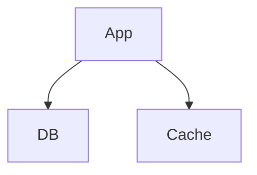
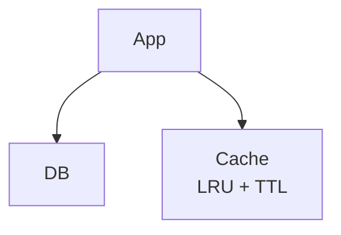
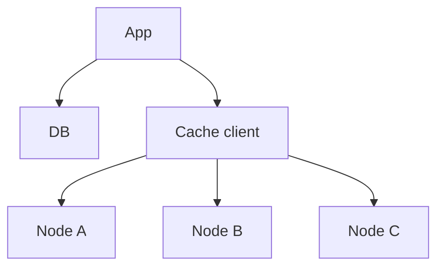
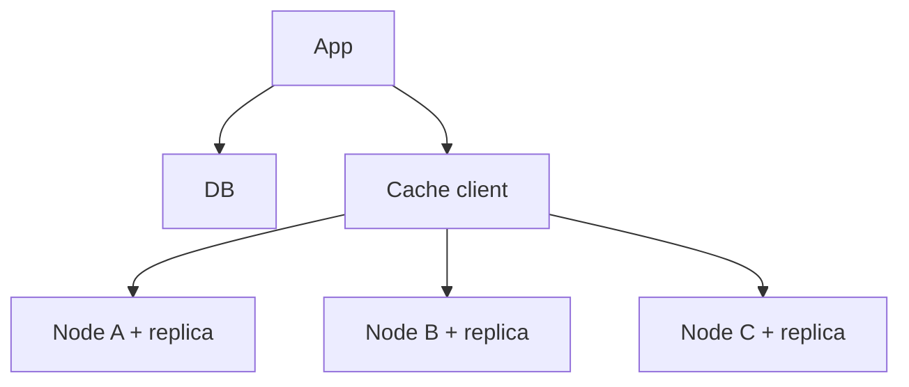
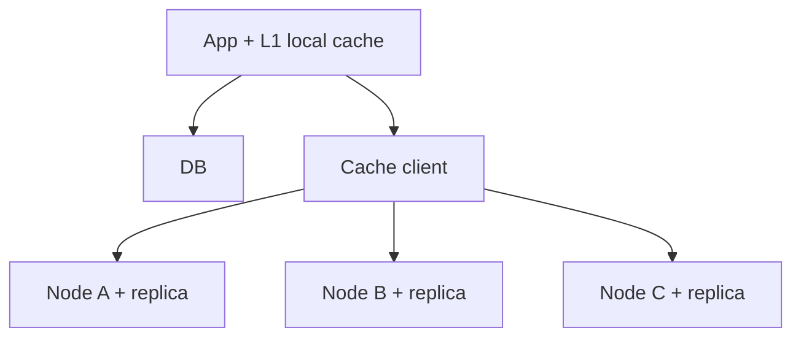

# Distributed Cache (Redis-jaisa)

> Tez in-memory key-value store jo ek machine se bada ho, aur node mare to bhi chale. Concept detail = FOUNDATIONS/04_caching.md
> Is design ka dil: **SPEED (<1ms)** + **node mare to chale**. Booking ka ULTA: wahan consistency dil, yahan speed.

```
LIBRARY DESK: 10,000 kitaab godaam me (DB = slow, poora) · top-100 front desk pe (cache = RAM, tez)
   ek desk me saari nahi aati + banda beemar (node down)
   -> kai desk (nodes) + kaunsi kitaab kis desk (sharding) + backup banda (replication) = DISTRIBUTED CACHE
```

---

## TASVEER (ByteByteGo / Alex Xu · CC BY-NC-ND 4.0)


Source: [How Can Cache Systems Go Wrong?](https://bytebytego.com/guides/how-can-cache-systems-go-wrong/)
(thundering herd / penetration / breakdown / crash)


Source: [Consistent Hashing Explained](https://bytebytego.com/guides/consistent-hashing/)
(node jude ya gire to sirf thodi keys khiskein — ring)

---

## SHURU — poocho + numbers

```
POOCHO:  "Ek node ka cache (eviction, TTL) ya distributed (sharding, replication) — kis pe?"
         kaisa data, read-heavy? · STALENESS kitni chalegi? (5 min purana?)  <- invalidation isi se tay
         eviction pasand (LRU / LFU)? · cache DB ke aage ya khud primary store?

FR:      get(key) · put(key, value, ttl) · delete(key)
         scope bahar: persistence · pub/sub · transactions
NFR:     <1ms (dil) · HA (node mare to chale) · TBs data · consistency EVENTUAL (asli sach DB me, cache tez copy)

NUMBERS: ~1 TB · ~1M QPS · read-heavy
         1 TB     -> ek node ki RAM me nahi -> SHARDING
         1M QPS   -> ek node itna nahi deti -> nodes me baanto
         node mara -> saara load DB pe -> REPLICATION
         teeno milke single node khaarij -> DISTRIBUTED justify
```

---

## DABBA 0 — sabse simple

```
SOLUTION: ek machine, ek HashMap (RAM) · O(1) get / put · CACHE-ASIDE: hit -> return · miss -> DB -> cache me PUT -> return
```


---

## DIKKAT 1 — RAM bhar gayi, kya hatayein?

```
DIKKAT:   RAM bhar gayi — naya daalne ke liye kya hatayein?

SOLUTION: EVICTION policy: LRU = jo sabse lambe samay se nahi chhua wo hatao ("kab"). LFU = jo sabse kam
          baar chhua wo hatao ("kitni baar").
          LRU banta HashMap + doubly linked list se: jo chhua wo aage, jagah chahiye to peeche wala hatao
          — dono O(1). (LeetCode 146.)
          Saath me TTL: har entry ki expiry. Do tareeke se hatti — access pe check (lazy) aur background
          me safai (active).
          LRU isliye ki wahi bache jo abhi kaam aa raha; frequency zyada maayne rakhe to LFU.

NAYA:     koi dabba nahi — node ke andar
```

```
BOARD PE: get(x) -> FRONT laao · jagah nahi -> TAIL hatao
          [FRONT] x <-> b <-> a <-> z <-> ... <-> q [TAIL, ye nikalega]

AGLA SAWAAL (tere jawab se):
  "Redis sach me poora LRU rakhta (har key ki list)?"
   -> nahi, memory bachane ko 'approximate LRU': kuch random keys uthata, unme sabse purani hatata
  "LFU me purana famous key hamesha rahega?"
   -> isliye LFU ginti ko waqt ke saath ghatata (decay) -> kal ka hero aaj nikal sake
```

---

## DIKKAT 2 — 1 TB ek node me nahi: key kis node pe?

```
DIKKAT:   1 TB ek node me nahi aata, kai node chahiye — har key kis node pe jaaye, ye tay karna

SOLUTION: seedha hash % N kiya to node juda ya gaya -> N badla -> lagbhag saari keys ka node badal gaya
          -> sab miss -> sab DB pe -> DB crash. Isliye nahi.
          CONSISTENT HASHING: ek gol ring, node aur key dono ring pe; key ghadi ki disha me jo pehla node
          mile uska. Node juda / gaya to sirf uske hisse ki thodi keys hilti. Yahi chunte.
          VIRTUAL NODES: ek machine ring pe kai jagah, taaki load barabar bate.
          (Wahi tool sharded DB aur LB me bhi.)
          Range se baantna (A-M / N-Z) simple hai, par ek range garam ho jaati — nahi.
          App ke andar CACHE CLIENT library key dekh ke sahi node chunti, app ko nodes ginne nahi padte.

NAYA:     Cache client (app ke andar library, key dekh ke sahi node chunti)
BADLA:    Cache -> Node A / B / C
```

```
BOARD PE: RING 0 .. 2^32 · node juda / gaya -> sirf us arc ki ~K/N keys hilti

AGLA SAWAAL (tere jawab se):
  "Cache client ko kaise pata kaun-se node zinda hain?"
   -> config service / cluster ka topology (Redis Cluster khud batata: 'ye key us node pe hai, MOVED')
  "Naya node juda, uski key khaali -> miss?"
   -> haan, sirf us arc ki ~K/N key ka ek baar miss -> DB pe thoda bojh, poora nahi
```

---

## DIKKAT 3 — ek node mara, uski saari key gayab, load DB pe

```
DIKKAT:   ek node mara, uski saari keys gayab, saara load DB pe — node ek shard ka akela ghar tha

SOLUTION: REPLICATION: har shard ki 1-2 copy. Primary mara to replica ko primary bana do (promote).
          Replica alag AZ me, warna ek AZ gaya to dono saath gaye.
          Keemat: replica thoda peeche chalti (lag), thodi der purana data — cache me eventual chal jaata.

BADLA:    Node A / B / C -> Node + replica

KAISE (kaun pakadta, kaun promote):
          Redis Sentinel (alag 3 process) ya Cluster ke baaki masters primary ko ping karte (gossip)
          zyada (quorum) bolein "mara" -> vote se ek replica ko primary banaya, clients ko naya pata
KYUN ASYNC replication (sync nahi):
          sync = har write pe replica ke "haan" ka intezaar -> cache ka <1ms toot jaata
          keemat: primary mara to aakhri kuch write replica tak nahi pahunche -> cache me chalta (DB me sach hai)
```

```
POOCHEGA: "What happens if a cache node goes down?"
BOL:      "Each shard has a replica in another zone that gets promoted, and with consistent hashing only that
           node's keys are affected."

AGLA SAWAAL (tere jawab se):
  "Network toota, purana primary bhi zinda samjha raha (do primary)?"
   -> split brain. Quorum + jo minority me hai wo write lena band kare (min-replicas)
  "Failover me kitni der?"
   -> ~10-30 sec; us beech us shard ki key DB se (thoda dheema)
```

---

## DIKKAT 4 — DB me update, cache purana (STALE)

```
DIKKAT:   DB me value update hui, par cache me abhi bhi purani (STALE)

SOLUTION: CACHE-ASIDE: DB update karo, phir cache ki key DELETE karo — agli read DB se taaza laayegi.
          Sabse common. WRITE-THROUGH: cache aur DB dono ek saath — hamesha taaza, par har write slow.
          TTL = kitna purana chalega uski had.
          Production me TTL + khud invalidate dono ("cache invalidation is one of the hardest problems").
          Key DELETE karo, UPDATE nahi — do write ulte kram me pahunche to galat value baith jaati.
          Doosri wajah replica lag: jisne abhi likha use thodi der primary se padhao (read-your-own-writes).

NAYA:     koi dabba nahi
```

```
POOCHEGA: "The user updated something but still sees the old value. Why?"
BOL:      "On update I delete the cache key rather than overwrite it, and keep a TTL as a safety net. If it's
           replica lag, the writer reads from the primary for a short while."

AGLA SAWAAL (tere jawab se):
  "DB update hua, cache DELETE fail ho gaya?"
   -> TTL bachata (max utni der purana). Pakka chahiye -> DB change event (CDC) se delete ka retry
  "DELETE ke baad koi purani value phir se cache me daal de (race)?"
   -> chhota delay ke baad dobara delete (double delete) ya version / TTL se
```

---

## DIKKAT 5 — super-hot key expire, 1000 request ek saath MISS

```
DIKKAT:   bahut garam key expire hui, hazaar request ek saath miss -> sab DB pe -> DB crash (STAMPEDE /
          thundering herd)

SOLUTION: MUTEX: sirf EK request DB se dobara banaye, baaki ruk ke cache se padhein.
          SOFT-TTL: expire hone se PEHLE hi background me refresh.
          Bahut garam key ko expire hi mat hone do, background me update karo.
          Pata ho kab aayega (sale, WC final, iPhone launch) -> pehle se cache bharo (pre-warm)
          aur servers pehle badhao. Pata na ho (viral tweet) -> upar ke teen.
          Twitter ka hot tweet TTL khatam + lakhon padh rahe = wahi stampede; asli me kam dikhta kyunki
          badi site ilaaj pehle lagaati.

NAYA:     koi dabba nahi

KAISE (mutex):
          miss hua -> SET lock:key 1 NX EX 5
          jeeta (OK) -> DB se laao, cache bharo, lock DEL
          haara (nil) -> 50-100 ms ruko, cache dobara padho (tab tak jeetne wale ne bhar diya)
          lock pe EX kyun: jeetne wala beech me mara to lock 5 sec me khud chhoote, warna sab hamesha atke
```

```
POOCHEGA: "What if the cache goes down / a hot key expires?"
DHYAAN:   poora cache gaya -> DB fallback, par load shedding / rate limit ke saath — warna chhupa load ek saath DB pe
BOL:      "For known events I'd pre-warm the cache and scale up in advance. For unpredictable spikes I still
           need stampede protection: a lock so only one request rebuilds the key, and early background refresh
           before the TTL expires."

AGLA SAWAAL (tere jawab se):
  "Haarne wale kitni der rukenge?"
   -> chhota wait + kuch retry; phir bhi nahi to purani value (stale) do, DB pe mat bhejo
  "Soft-TTL kaise?"
   -> value ke saath 'refresh_after' time; padhne wala dekhe time nikal gaya -> background me ek refresh,
      tab tak purani value hi do
```

---

## DIKKAT 6 — ek key itni popular, uska shard akela mar raha

```
DIKKAT:   ek key itni popular ki uska node akela mar raha (HOT KEY). Consistent hashing ne use ek
          node pe daala — ★ consistent hashing ek hot key ko nahi bachata.

SOLUTION: (1) hot key ki kai node pe copy, padhte waqt koi bhi random copy — read bat gaye.
          (2) L1 LOCAL CACHE: app ke andar hi chhota cache, request Redis tak jaati hi nahi.
          Garam LIKHNA ho to key ko tukdon me baanto, kisi ek me likho, padhte waqt jodo.
          Pehchaan: key KHAALI aur sab DB bhage = stampede (dikkat 5, mutex). Key BHARI aur ek node read
          se mar raha = hot key (ye, L1 + copies).
          Misaal: IPL live score — crore log ek key. Har app server pe 1-2 sec ka L1 sabse bada ilaaj
          (score thoda purana chalega). Page / image CDN se.

NAYA:     L1 local cache (har App server ki apni memory me chhota cache)
BADLA:    App -> App + L1 local cache
```

```
BOARD PE: read copies: score#1..#10 · write buckets: key#0..#9
          L1 app (nano-sec) -> L2 distributed (micro-sec) -> DB (milli-sec)

POOCHEGA: "What about a hot key / celebrity / hot partition?"
BOL:      "The key is there, one node just can't take the reads. I'd put a 1-2 second local cache on each app
           server so most reads never reach Redis, and copy the key across replicas so the rest are spread
           out. A slightly stale score is fine here. If the key were missing instead, that's a stampede — one
           request rebuilds, the rest wait."

AGLA SAWAAL (tere jawab se):
  "Hot key pehchanoge kaise?"
   -> node ke metrics (ek key pe ops/sec), Redis --hotkeys, client side ginti -> had paar = copy / L1 me
  "L1 me purana score kitni der?"
   -> L1 TTL 1-2 sec -> utna purana chalta (score ke liye theek, paisa ke liye nahi)
```

---

## 10x SCALE — har dabba alag

```
Cache client  -> node juda / gaya -> consistent hashing + virtual nodes
Node          -> RAM bhari -> LRU + TTL · mara -> replica promote · data badha -> node jodo
hot key       -> copies + L1 local cache
expiry        -> mutex · soft-TTL · never-expire · pre-warm
DB            -> stale -> invalidate + TTL
AAGE:         write-back (write-heavy ho to) · multi-region cache

POOCHEGA: "How would you scale this to 10x?"      -> request ka raasta chalo
POOCHEGA: "What's the single point of failure?"   -> node (replica), cache client config (sab app me copy)
POOCHEGA: "How do you know it's working?"         -> HIT RATIO sabse zaroori (gira = kuch toota) · p99 · evictions · alert
```

---

## POOCHE TO (deep-dive)

```
API:      GET key · PUT key value ttl · DELETE key
          jaan-boojh ke chhoti — query nahi, sirf key se -> index / planner nahi -> isiliye tez

NODE KE ANDAR:  HashMap key -> value (O(1)) · LRU = HashMap + DLL · TTL lazy + active
                in-memory KV (Redis-jaisa), DB peeche source of truth
                <1ms -> RAM (disk nahi) · join nahi -> KV kaafi

KEY BAANTNA:    hash % N -> sab shift -> NAHI · CONSISTENT HASHING -> ring + clockwise + virtual nodes <- YAHI
                range -> hot range -> NAHI

TRADE-OFF:      speed vs consistency — cache AP ki taraf, eventual chalta (CAP ka spirit)
```

---

## AAKHRI DABBA + WRAP

```
App + L1 = nano-sec, hot key ka pehla ilaaj · Cache client = consistent hashing, key -> node
Node = HashMap + DLL (LRU) + TTL, primary + replica (alag AZ) · DB = source of truth, miss pe
```

```
SINGLE node : HashMap + DLL (LRU) + TTL
DISTRIBUTE  : consistent hashing (shard) + replication (HA)
READ        : cache-aside (~90% hit, DB load 10x kam)
STALE       : TTL + explicit invalidation
STAMPEDE    : mutex / soft-TTL
HOT KEY     : copies / L1 local
```
```
BOL: "A distributed cache is an in-memory key-value store, sharded with consistent hashing and replicated for
      availability. Cache-aside with LRU and TTL is the production combo. The two hard parts are invalidation —
      TTL plus explicit deletes — and stampedes — a lock or early refresh. Hot keys get a local L1 cache and
      copies. It's a speed versus consistency trade-off, decided by the use case."
```

ARCHETYPE F · CONCEPTS: [caching](../../FOUNDATIONS/04_caching.md) · [sharding](../../FOUNDATIONS/06_database_sharding.md) · [replication](../../FOUNDATIONS/05_database_replication.md) · [← MASTER SHEET](../../00_MASTER_SHEET.md)
