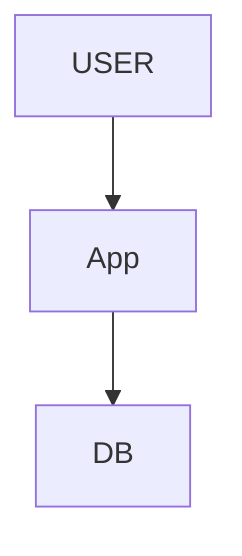
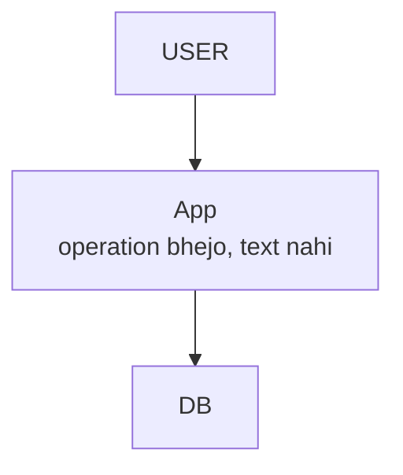
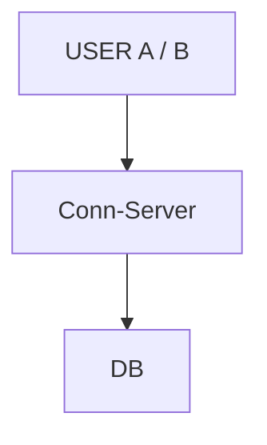
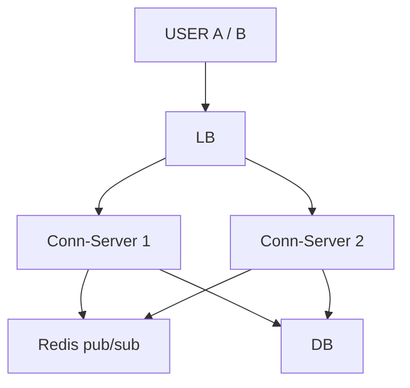
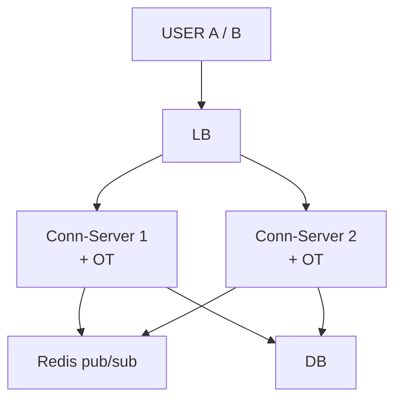
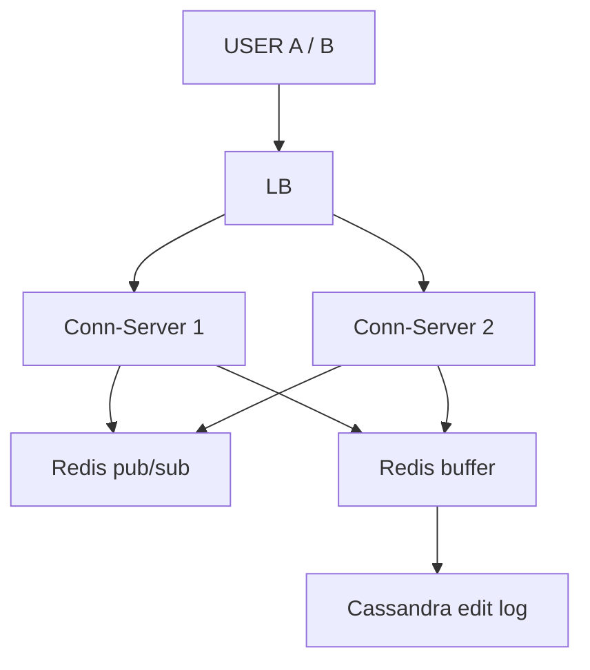
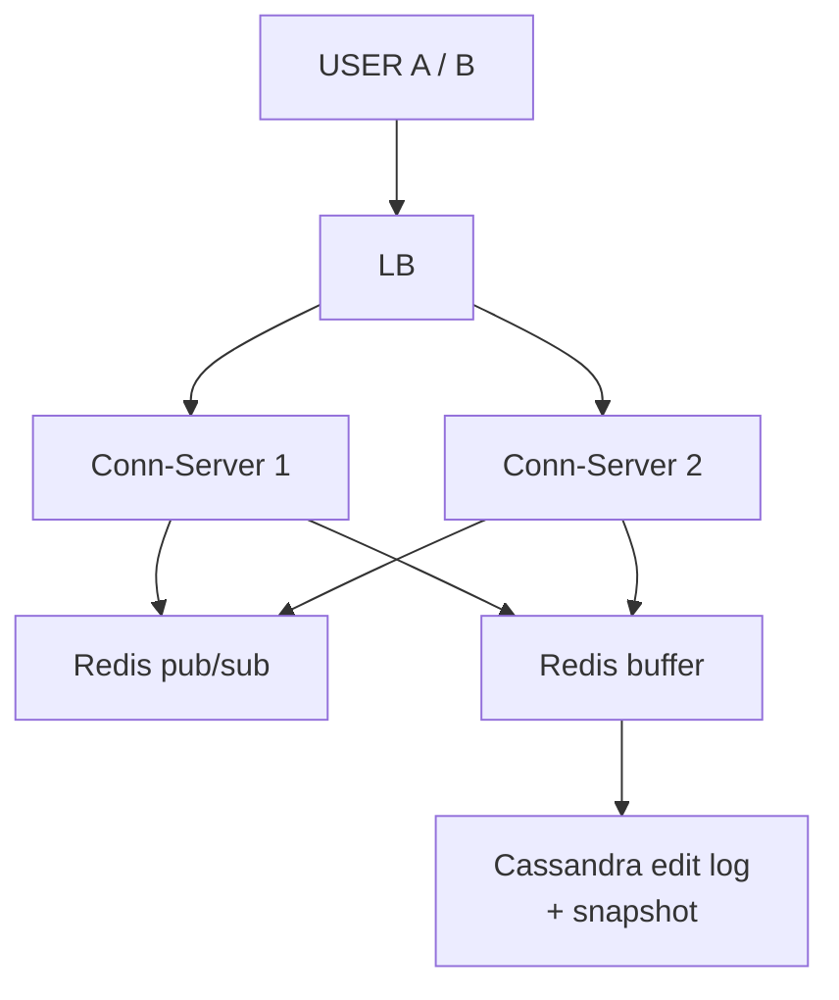
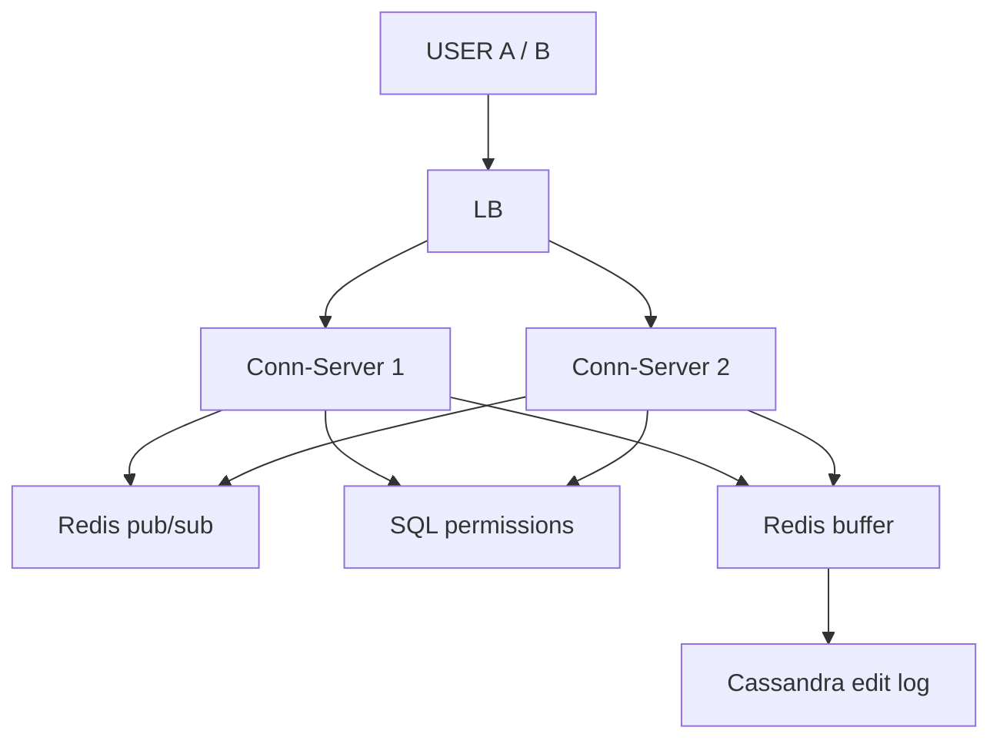
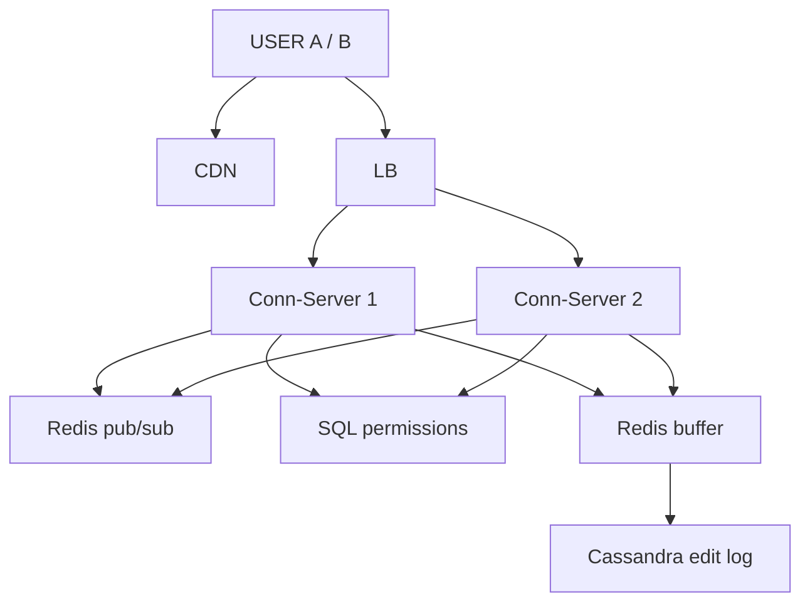

# Google Docs (Collaborative Editor)

> 2+ log ek doc EK SAATH edit karein -> koi clash / override na ho, likha kho na jaaye, turant dikhe, aakhir me sabka doc SAME.
> Is design ka dil: **real-time concurrent edit + koi write lost nahi + CONVERGENCE**.
> 3-Sep MOCK me Arpan ne khud derive kiya (novel design) — 3 naye tool: per-component CAP · WebSocket + Redis pub/sub · OT / CRDT.

---

## TASVEER (ByteByteGo / Alex Xu · CC BY-NC-ND 4.0)


Source: [How to Design Google Docs](https://bytebytego.com/guides/how-to-design-google-docs/)
(WebSocket + collaboration service + OT / CRDT + ops log — poora design ek tasveer me)

---

## SHURU — poocho + numbers

```
POOCHO:  "Editing, comments, sharing / permissions, version history, offline — main real-time collaborative EDITING pe."
         ek doc pe ek saath kitne? (2-3 ya 100) · OFFLINE chahiye?  <- iska jawab poora CAP faisla tay karta
         permissions scope me? · rich text ya plain?

FR:      kai log EK doc saath edit · doosron ke edit TURANT dikhein · koi edit clash / override na ho
         scope bahar: comments · version history · rich-text formatting
NFR:     LOW LATENCY (typing instant, dil) · HIGH AVAILABILITY (typing kabhi na ruke, offline bhi)
         CONVERGENCE (sab aakhir me same doc) — strong consistency se NAHI, convergence se

NUMBERS: ~100M user · ~30-40M DAU · edits / sec BAHUT — WRITE-DOMINATED (har keystroke ek event)
         -> buffering + sharding chahiye (exact number yahan maayne nahi rakhta)
```

---

## DABBA 0 — sabse simple

```
SOLUTION: doc ka poora text DB me · "Save" dabao -> poora text overwrite
```


---

## DIKKAT 1 — do log ne saath save kiya, baad wale ne pehle ka MITA diya

```
DIKKAT:   A "HELLO WORLD" save · B "HELLO THERE" save -> A ka kaam GAYAB = LAST-WRITE-WINS, collab me fail

SOLUTION: poora TEXT mat bhejo — sirf OPERATION bhejo
          A: { insert "X", position 0 } · B: { delete position 5 } -> dono apply ho sakte, kisi ka khoya nahi

NAYA:     koi dabba nahi — data ki shakal badli (text -> operation)
```

```
DHYAAN:   Last-Write-Wins (3-Sep mock ki galti) -> kisi ka likha KHO jaata
```

---

## DIKKAT 2 — B ko A ka edit kab dikhega? refresh pe?

```
DIKKAT:   HTTP request-response se server khud nahi bhej sakta

SOLUTION: WEBSOCKET — do-tarfa zinda connection, dono taraf se push
          do-tarfa chahiye: user type bhi karta, doosron ke edit receive bhi
          (sirf server -> client hota to SSE halka padta)

BADLA:    App -> Conn-Server (connection server: user ka WebSocket pakad ke rakhta)
```


---

## DIKKAT 3 — ek Conn-Server itne socket nahi jhelta -> kai lagaye -> A server-1 pe, B server-2 pe

```
DIKKAT:   memory / file-descriptor ki had -> kai Conn-Server (aage LB)
          par ek doc ke do editor ALAG box pe -> dono ek doosre ko jaante hi nahi

SOLUTION: REDIS PUB/SUB (server-to-server fanout)
          A -> Conn-Server-1 -> publish -> Redis pub/sub -> Conn-Server-2 -> B
          WebSocket = browser tak · pub/sub = server se server (do alag kaam)

NAYA:     LB · Redis pub/sub
BADLA:    Conn-Server ek se DO — bojh bat gaya, ek gire to doosra chale (asal me zaroorat jitne, diagram me 2)
```


---

## DIKKAT 4 — dono ne EK SAATH position 0 pe type kiya

```
DIKKAT:   base "HELLO" · A insert("X", 0) · B insert("Y", 0) ek hi waqt
          seedha apply -> A ke paas "XHELLO", B ke paas "YHELLO" = DO ALAG DOC, diverge

SOLUTION: OPERATIONAL TRANSFORMATION (OT) — winner mat chuno, TRANSFORM karo
          A ke paas: A apply "XHELLO" -> B ka op aaya (pos 0), A pehle 0 pe daal chuka
                     -> B ka op SHIFT pos 0 -> 1 -> insert("Y", 1) -> "XYHELLO"
          B ke paas: B apply "YHELLO" -> A ka op aaya, tie-break: A pehle -> insert("X", 0) -> "XYHELLO"
          DONO "XYHELLO" — converge, dono akshar bache, kuch lost nahi
          XY vs YX = deterministic tie-break (userId / timestamp), par dono zinda
          CRDT = doosra raasta: har char ki unique id / position -> merge commutative, central transform nahi
          (implement nahi karna — bas ye samajh bolni hai)

NAYA:     koi dabba nahi — Conn-Server me OT
```

```
POOCHEGA: "Two people type at the same position at the same time — what happens?"
BOL:      "I send operations, not snapshots, and transform concurrent operations with OT or merge them with a
           CRDT. Everyone converges to the same document and no write is lost."
```

---

## DIKKAT 5 — har keystroke pe DB hit

```
DIKKAT:   har akshar = ek write · 40M DAU x har keystroke -> DB khatam

SOLUTION: BUFFER + BATCH: op -> Redis buffer me jama -> thodi der me BATCH -> NoSQL edit log
          real-time hissa memory / pub-sub se, DB me batch — user wait nahi, DB pe hathoda nahi
          EDIT LOG = Cassandra: partition key = docId, clustering = timestamp ("ek doc ke saare edit, time order me")
          batch ke baad bhi bada -> docId se SHARD (ek doc ke saare op ek shard)
          replica sirf READ baantti, write ke liye SHARD · country / date = bura key (skew)

NAYA:     Redis buffer (edits thodi der jama, phir ek saath DB me)
BADLA:    DB -> Cassandra edit log (docId shard)
```

```
POOCHEGA: "The database takes too many writes. What do you do?"
DHYAAN:   (mock galti) "consistency chahiye = SQL" -> NAHI, DB data ki SHAKAL se aata · "relations nahi" -> NoSQL ki taraf
          (mock galti) har keystroke DB hit -> nahi, buffer + batch
BOL:      "Real-time edits go through memory and pub/sub; I buffer operations in Redis and write them in batches
           to Cassandra, partitioned by doc id and ordered by time, so one doc's ops stay on one shard."
```

---

## DIKKAT 6 — doc kholne pe 10 lakh operation replay

```
DIKKAT:   doc = saare ops kram se apply -> 10 lakh op = kholna SLOW

SOLUTION: SNAPSHOT (poora text, har X ops baad) + uske baad ke thode ops
          doc load = latest snapshot + baad ke ops apply (append log + periodic compaction ka funda)

NAYA:     koi dabba nahi — edit log ke saath snapshot
```


---

## DIKKAT 7 — network ek second blip hua: typing ruk jaayegi?

```
DIKKAT:   CAP — partition pe kya chunein

SOLUTION: pehli soch "consistency chahiye -> CP" = GALAT nikli (3-Sep mock)
          CP rakha to partition pe TYPING RUKEGI · asli Docs me offline bhi type, baad me sync -> ye AP
          "sabko same doc" strong consistency se nahi, CONVERGENCE (OT / CRDT) se
          PER-COMPONENT CAP (poore system pe ek CAP nahi):
             doc edits             -> AP (available, append log, OT se converge)
             permissions / owner   -> CP (hataye gaye user ko TURANT block) -> alag SQL store
          CAP ka faisla SIRF partition ke waqt; partition nahi to dono milte

NAYA:     SQL (permissions / ownership)
```

```
POOCHEGA: "Consistency or availability — which do you pick?"
DHYAAN:   ek CAP poore system pe NAHI — per component
BOL:      "Per component. Edits are AP: you keep typing through a network blip and OT or CRDTs make everyone
           converge. Permissions are CP: a removed user must be blocked immediately."
```

---

## DIKKAT 8 — crore WebSocket connection

```
DIKKAT:   kai Conn-Server aa chuke, par crore connection sahi baantne hain

SOLUTION: (1) alag CONNECTION TIER — sirf socket pakadne wale, alag scale
              connection STATEFUL -> LB CONSISTENT ROUTING (user usi server pe wapas)
          (2) SHARD KEY = docId — ek doc ke saare editor + op stream + OT EK shard pe (OT serialize hona chahiye)
              alag doc -> alag shard -> load bata
              pub/sub ab bhi kyun: reconnect / box badalne ke beech koi doosre box pe aa sakta -> uska bachav
              (routing pakka ho to pub/sub ka kaam bahut kam)
          (3) hot doc bounded (Google ~100 editor ki cap) -> per-doc OT ek server pe theek
          (4) spike -> queue absorb · Redis pub/sub replicate + horizontally scale
          (5) app ki static files -> CDN
          KRAM: SERVER deta (har op ko doc ka agla version / sequence number), client ki ghadi nahi

NAYA:     CDN
BADLA:    LB -> LB (docId se consistent routing)
```

```
POOCHEGA: "How do you keep edits in order?"
BOL:      "The server assigns each operation the doc's next version number, never the client clock, and all
           ops for one doc go to one shard where OT runs serially."
```

---

## 10x SCALE — har dabba alag

```
WebSocket      -> crore connection -> alag CONNECTION TIER + consistent routing
Conn-Server    -> OT kahan? -> SHARD by docId (ek doc = ek jagah)
Redis pub/sub  -> spike -> replicate + horizontal scale
DB writes      -> har keystroke? -> buffer + batch, docId shard
doc load       -> 10 lakh op replay? -> SNAPSHOT + baad ke ops

POOCHEGA: "How would you scale this to 10x?"      -> user ka raasta chalo, pehle jo toote
POOCHEGA: "What's the single point of failure?"   -> Conn-Server (reconnect doosre pe), Redis (replica)
POOCHEGA: "How do you know it's working?"         -> edit propagation p99 · WebSocket drop rate · buffer lag · alert
```

---

## POOCHE TO (deep-dive)

```
API:      GET /documents/{docId} -> snapshot + baad ke ops · POST /documents/{docId}/edits -> ek operation
          WebSocket /documents/{docId} -> real-time 2-taraf channel

DATA:     har edit = OPERATION event: { docId, userId, opType (insert / delete), position, char / text, timestamp }
          current doc = us doc ke saare ops ORDER me apply
          Cassandra fit (append-heavy log) · Mongo bhi chalega · permissions = alag SQL (relations + CP)

EK EDIT KA SAFAR:
          1. A ne akshar type -> op { docId, userId, insert, pos, char, ts }
          2. WebSocket se A ke Conn-Server tak
          3. OT transform (concurrent ops ke against) -> apply
          4. Redis pub/sub publish -> baaki Conn-Servers -> unke client (B) ko PUSH
          5. Redis buffer -> BATCH -> Cassandra edit log
          6. B ke client ne op liya -> apni taraf transform -> screen update

OT vs CRDT: OT = ops bhejo, concurrent ko TRANSFORM, sab converge · CRDT = har char unique id, merge commutative
```

---

## AAKHRI DABBA + WRAP

```
CDN = static app · LB = docId se consistent routing · Conn-Server = WebSocket + OT + buffer
Redis pub/sub = server-to-server fanout · Redis buffer = batch write · Cassandra = op log (docId, timestamp) + snapshot
SQL = permissions (CP)
```

```
BOL: "Clients hold a WebSocket to a connection server, routed by doc id. Every keystroke is an operation; the
      server transforms concurrent operations with OT, so nothing is lost and everyone converges, then fans out
      to other servers through Redis pub/sub. Operations are buffered and batched into Cassandra by doc id, with
      snapshots so a doc loads fast. Edits are AP — typing never stops — while permissions are CP in SQL."
```

ARCHETYPE D (real-time) · CONCEPTS: [CAP](../../FOUNDATIONS/08_cap_theorem.md) · [pubsub/queues](../../FOUNDATIONS/07_message_queues.md) · [← MASTER SHEET](../../00_MASTER_SHEET.md)
