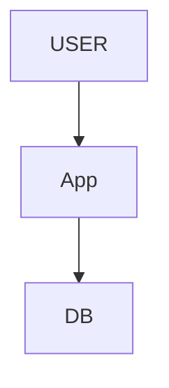
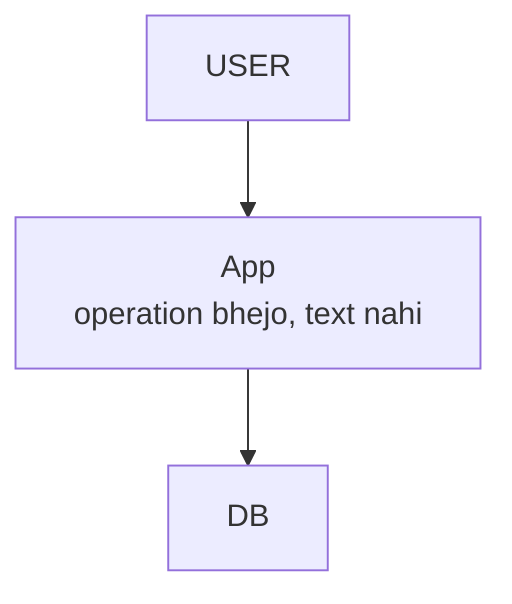
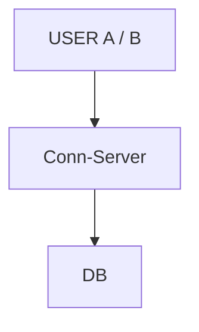
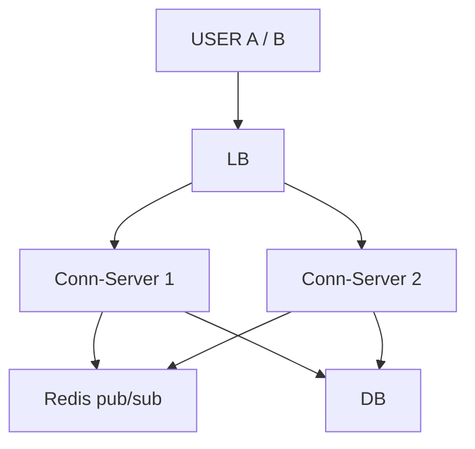
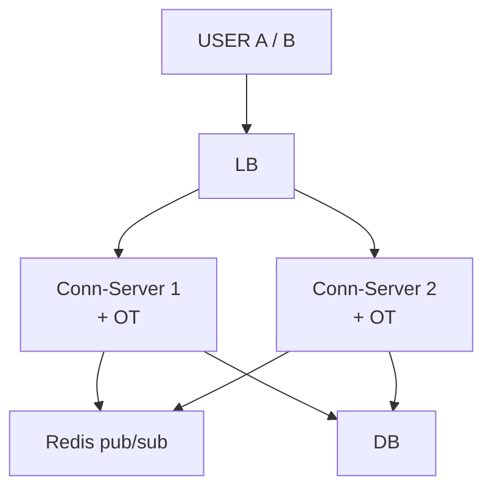
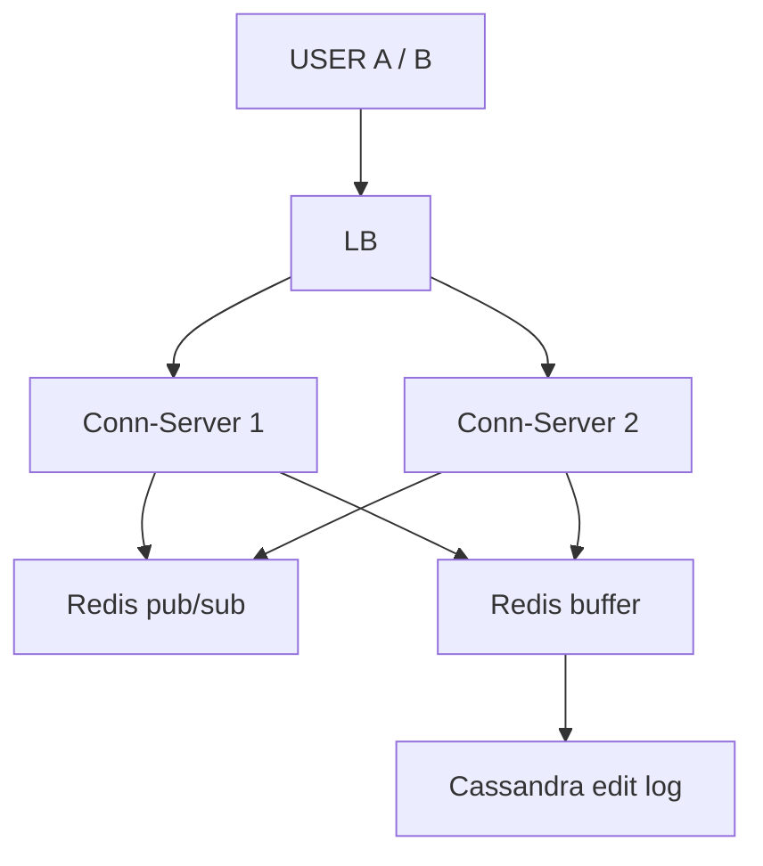
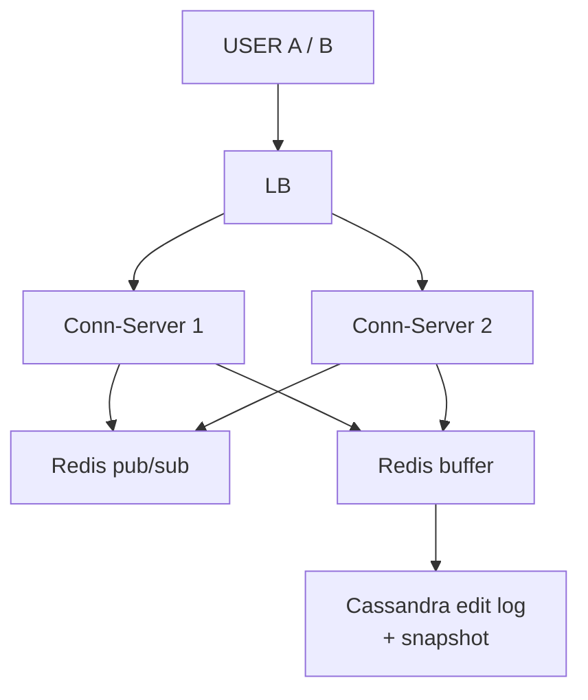
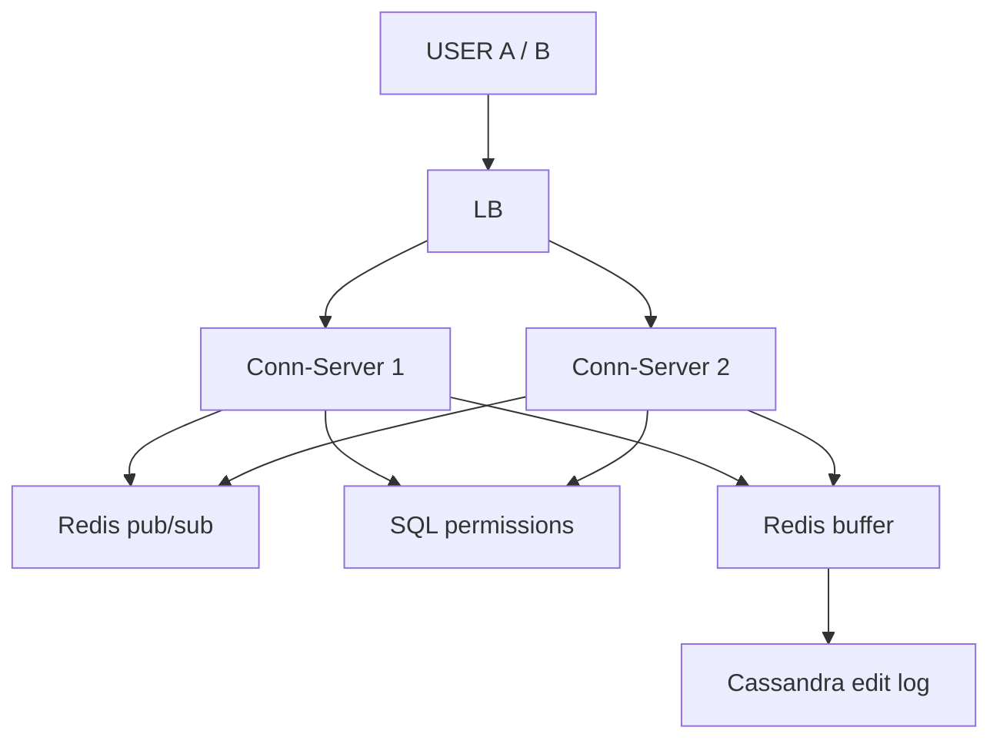
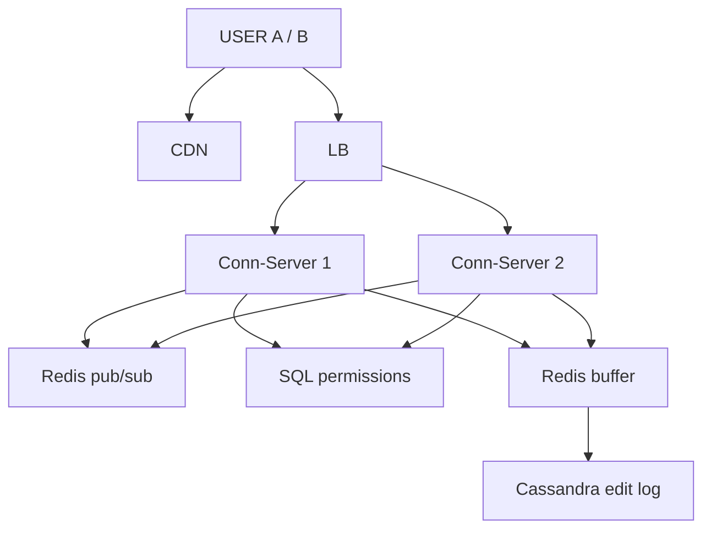

# Google Docs (Collaborative Editor)

> 2+ log ek doc EK SAATH edit karein -> koi clash / override na ho, likha kho na jaaye, turant dikhe, aakhir me sabka doc SAME.
> Is design ka dil: **real-time concurrent edit + koi write lost nahi + CONVERGENCE**.
> 3-Sep MOCK me Arpan ne khud derive kiya (novel design) — 3 naye tool: per-component CAP · WebSocket + Redis pub/sub · OT / CRDT.

---

## TASVEER (ByteByteGo / Alex Xu · CC BY-NC-ND 4.0)


Source: [How to Design Google Docs](https://bytebytego.com/guides/how-to-design-google-docs/)
(WebSocket + collaboration service + OT / CRDT + ops log — poora design ek tasveer me)

---

## SHURU — poocho + numbers

```
POOCHO:  "Editing, comments, sharing / permissions, version history, offline — main real-time collaborative EDITING pe."
         ek doc pe ek saath kitne? (2-3 ya 100) · OFFLINE chahiye?  <- iska jawab poora CAP faisla tay karta
         permissions scope me? · rich text ya plain?

FR:      kai log EK doc saath edit · doosron ke edit TURANT dikhein · koi edit clash / override na ho
         scope bahar: comments · version history · rich-text formatting
NFR:     LOW LATENCY (typing instant, dil) · HIGH AVAILABILITY (typing kabhi na ruke, offline bhi)
         CONVERGENCE (sab aakhir me same doc) — strong consistency se NAHI, convergence se

NUMBERS: ~100M user · ~30-40M DAU · edits / sec BAHUT — WRITE-DOMINATED (har keystroke ek event)
         -> buffering + sharding chahiye (exact number yahan maayne nahi rakhta)
```

---

## DABBA 0 — sabse simple

```
SOLUTION: doc ka poora text DB me · "Save" dabao -> poora text overwrite
```


---

## DIKKAT 1 — do log ne saath save kiya, baad wale ne pehle ka MITA diya

```
DIKKAT:   do log ne ek saath poora doc save kiya, baad wale ne pehle wale ka kaam mita diya
          (LAST-WRITE-WINS) — collaboration me nahi chalta

SOLUTION: poora TEXT mat bhejo, sirf OPERATION bhejo ("yahan ye daala", "yahan se ye hataya").
          Dono ke operation apply ho sakte, kisi ka likha nahi khota.

NAYA:     koi dabba nahi — data ki shakal badli (text -> operation)
```

```
BOARD PE: A "HELLO WORLD" save · B "HELLO THERE" save -> A ka kaam gayab
          A: { insert "X", position 0 } · B: { delete position 5 }

DHYAAN:   Last-Write-Wins (3-Sep mock ki galti) -> kisi ka likha KHO jaata

AGLA SAWAAL (tere jawab se):
  "Operation me kya-kya bhejoge?"
   -> { docId, userId, type (insert / delete), position, char, baseVersion }
      baseVersion = client ne kis version ko dekh ke op banaya -> isi se pata chalta kaun-se ops concurrent the
  "Delete ka kya? A ne 'L' mitaya, B ne usi jagah type kiya?"
   -> delete bhi ek op {delete, pos}. OT dono ko transform karta: B ka insert khisakta, A sahi char mitata
```

---

## DIKKAT 2 — B ko A ka edit kab dikhega? refresh pe?

```
DIKKAT:   B ko A ka edit kab dikhega — refresh karne pe? Normal HTTP me server khud nahi bhej sakta.

SOLUTION: WEBSOCKET: do-tarfa zinda connection, dono taraf se kabhi bhi bhej sakte. Do-tarfa chahiye
          kyunki user type bhi karta aur doosron ke edit bhi leta. (Sirf server se client hota to SSE
          halka padta.)

BADLA:    App -> Conn-Server (connection server: user ka WebSocket pakad ke rakhta)

KAISE:    pehle normal HTTP request "Upgrade: websocket" -> server "101 Switching Protocols"
          -> wahi TCP connection khula rehta, ab dono taraf kabhi bhi chhota frame bhej sakte
KYUN YE:  polling (har 1 sec "kuch naya?") = 40M user x har sec bekaar request, phir bhi 1 sec der
          long polling = har message pe naya request + header ka bojh · SSE = sirf server -> client
```

```
AGLA SAWAAL (tere jawab se):
  "Connection beech me toot gaya to?"
   -> client reconnect kare (backoff ke saath) + apna aakhri version bataye ("main v120 pe tha")
      server v120 ke baad ke ops (v121 se aage) bhej de -> kuch nahi chhoota
  "Server ko kaise pata client zinda hai?"
   -> heartbeat (ping / pong) har ~30 sec · jawab nahi = connection band, uski jagah saaf
```

---

## DIKKAT 3 — ek Conn-Server itne socket nahi jhelta -> kai lagaye -> A server-1 pe, B server-2 pe

```
DIKKAT:   ek Conn-Server itne connection nahi jhelta -> kai lagaye. Par ek doc ke do editor alag box pe —
          dono box ek doosre ko jaante hi nahi.

SOLUTION: REDIS PUB/SUB — server se server tak bhejne ke liye. A ka edit uske server se Redis pe
          publish hota, Redis us doc ko sun rahe saare servers ko deta, wo apne users ko.
          WebSocket = browser tak, pub/sub = server se server — do alag kaam.

NAYA:     LB · Redis pub/sub
BADLA:    Conn-Server ek se DO — bojh bat gaya, ek gire to doosra chale (asal me zaroorat jitne, diagram me 2)

KAISE:    har doc = ek CHANNEL (doc:123)
          jis Conn-Server pe us doc ka koi user khula hai -> wo server channel SUBSCRIBE karta
          A ne type kiya -> Server-1 "doc:123" pe PUBLISH -> Redis turant saare subscribed servers ko deta

            Server-1 --publish doc:123--> [ Redis ] --> Server-2 (subscribed) --> B
                                                    --> Server-5 (subscribed) --> C

          Redis kuch STORE nahi karta: jo us waqt sun raha tha usi ko mila (fire-and-forget)
          -> pub/sub sirf "turant dikhana" hai, data bachana nahi (wo buffer / DB ka kaam, DIKKAT 5)
KYUN YE:  Kafka bhi chal sakta, par Kafka store karta + thoda dheema -> live typing ko replay nahi, speed chahiye
          servers ek doosre ko seedha HTTP -> kisko bhejna pata nahi, N x N jaal
```

```
BOARD PE: A -> Conn-Server-1 -> publish -> Redis pub/sub -> Conn-Server-2 -> B

AGLA SAWAAL (tere jawab se):
  "Us waqt koi server sun nahi raha tha (restart ho raha tha) -> message gaya?"
   -> haan, pub/sub me gaya. Par edit DB / log me hai: client reconnect pe apna version bataye,
      baaki ops wahan se le le (DIKKAT 2 wala reconnect)
  "Redis pub/sub hi gir gaya?"
   -> replica pe switch (Sentinel); beech ke kuch second live update ruke, edit kho nahi (log me hai)
```

---

## DIKKAT 4 — dono ne EK SAATH position 0 pe type kiya

```
DIKKAT:   dono ne ek saath ek hi jagah type kiya -> seedha apply kiya to dono ke paas alag doc ban gaya
          (diverge)

SOLUTION: OPERATIONAL TRANSFORMATION (OT): kisi ek ko jeetne mat do — doosre ke operation ko TRANSFORM
          karo. A pehle hi us jagah kuch daal chuka, to B ka operation ek jagah aage khiska do. Dono taraf
          same niyam -> dono ke paas ek hi doc, dono ke akshar bache.
          Kiska pehle aaye, ye ek fixed niyam se (userId / time) — par dono zinda rehte.
          CRDT doosra raasta: har akshar ki apni unique id, merge kisi bhi kram me same nikalta, central
          transform nahi chahiye. (Implement nahi karna, bas samajh bolni hai.)

NAYA:     koi dabba nahi — Conn-Server me OT

KYUN OT (CRDT nahi):
          hamare paas central server hai (har op usi se guzarta) -> OT seedha baithta, Google Docs bhi OT
          CRDT tab jab central server na ho (offline-first, peer-to-peer) · keemat: har char ki id = memory zyada
```

```
BOARD PE: base "HELLO" · A insert("X", 0) · B insert("Y", 0) ek saath
          seedha apply -> A: "XHELLO", B: "YHELLO" = diverge
          A ke paas: B ka op shift 0 -> 1 -> insert("Y", 1) -> "XYHELLO"
          B ke paas: tie-break A pehle -> insert("X", 0) -> "XYHELLO"   -> dono same

POOCHEGA: "Two people type at the same position at the same time — what happens?"
BOL:      "I send operations, not snapshots, and transform concurrent operations with OT or merge them with a
           CRDT. Everyone converges to the same document and no write is lost."

AGLA SAWAAL (tere jawab se):
  "Transform kaun karta — client ya server?"
   -> dono. Server KRAM tay karta (har op ko agla version no.) aur aaye op ko beech ke ops ke against
      transform karta. Client apne pending ops ko server se aaye ops ke against transform karta.
  "Do server pe ek doc ka OT alag-alag chala to?"
   -> kram toot jaayega. Isliye ek doc ke saare ops EK jagah (docId se ek server / shard) -> DIKKAT 8
```

---

## DIKKAT 5 — har keystroke pe DB hit

```
DIKKAT:   har keystroke pe DB write -> crore users ke har akshar se DB khatam

SOLUTION: BUFFER + BATCH: operation pehle Redis buffer me jama, thodi der me ek saath batch me DB
          (edit log) me. Live dikhana memory / pub-sub se, DB me batch — user ruke nahi, DB pe hathoda nahi.
          Edit log CASSANDRA me: ek doc ke saare edit ek jagah, version number ke kram me (server deta).
          Timestamp nahi — ek hi millisecond pe do operation = same key = Cassandra chupchap overwrite,
          operation kho jaata.
          Batch ke baad bhi bada -> docId se SHARD (ek doc ke saare operation ek shard pe).
          Replica sirf read baantti, write ke liye shard.

NAYA:     Redis buffer (edits thodi der jama, phir ek saath DB me)
BADLA:    DB -> Cassandra edit log (docId shard)

KAISE:    op aaya -> Redis LIST me RPUSH (doc ke hisaab se)
          flusher worker har ~1 sec ya 500 op pe list se uthata -> Cassandra me EK batch write
          Cassandra write tez kyun: pehle commit log (disk pe sirf append) + RAM ki memtable
          -> memtable bhari to disk pe SSTable seedha likh deta. Purana data badalta nahi, bas append = tez
KYUN YE:  MySQL me har op = index update + random disk write -> itne writes pe dheema
          buffer Kafka me bhi ho sakta (durable bhi) -> crash wala sawaal neeche
```

```
BOARD PE: partition key = docId · clustering = version (server ka seq no.)

POOCHEGA: "The database takes too many writes. What do you do?"
DHYAAN:   (mock galti) "consistency chahiye = SQL" -> NAHI, DB data ki SHAKAL se aata · "relations nahi" -> NoSQL ki taraf
          (mock galti) har keystroke DB hit -> nahi, buffer + batch
BOL:      "Real-time edits go through memory and pub/sub; I buffer operations in Redis and write them in batches
           to Cassandra, partitioned by doc id and ordered by time, so one doc's ops stay on one shard."

AGLA SAWAAL (tere jawab se):
  "Op abhi Redis buffer me hai, Cassandra me nahi gaya, aur Redis crash ho gaya. Op gaya?"
          (7-Oct mock: SPOF socha, replica bola = sahi pehla qadam)
          Replica poora nahi bachata: Redis replica ko ASYNC bhejta -> primary gira to aakhri kuch op replica tak pahunche hi nahi
          Cassandra log bhi nahi bachata: jo op batch hi nahi hua wo log me hai hi nahi
          ILAAJ:  (1) client har op apne paas rakhe jab tak server ACK na de -> ack nahi aaya to reconnect pe dobara bhejo
                  (2) op pe unique opId -> dobara aaya to server skip kare (idempotent, do baar apply nahi)
                  (3) server ACK tabhi de jab op DURABLE jagah likh gaya (Kafka acks=all, ya Redis AOF fsync always + replica WAIT), sirf memory me nahi
          JODA:   yahi client-side pending ops = OFFLINE sync wala hissa bhi (DIKKAT 7)
BOL:      "Redis is replicated, but replication is async, so I don't ack an op until it's durably written.
           The client keeps unacked ops and resends them with an op id, so nothing is lost or applied twice."
```

---

## DIKKAT 6 — doc kholne pe 10 lakh operation replay

```
DIKKAT:   doc kholne pe shuru se saare operation (laakhon) dobara chalane padte -> kholna slow

SOLUTION: SNAPSHOT: har kuch hazaar operation ke baad poora text save kar lo. Doc kholna = aakhri
          snapshot + uske baad ke thode operation. (Append log + kabhi-kabhi compaction wala funda.)

NAYA:     koi dabba nahi — edit log ke saath snapshot
```

```
AGLA SAWAAL (tere jawab se):
  "Snapshot banate waqt naye edit aa rahe hon to?"
   -> snapshot ek version tak ka hota (v1000). Load = snapshot v1000 + v1000 ke baad ke ops (v1001 se aage).
      Naye ops log me aate rehte, kuch nahi rukta.
  "Snapshot kitni baar?"
   -> har N ops (jaise 1000) ya har kuch minute, jo pehle ho
```

---

## DIKKAT 7 — network ek second blip hua: typing ruk jaayegi?

```
DIKKAT:   network ek second ko toota — typing ruk jaayegi? CAP me kya chunein?

SOLUTION: pehli soch thi "consistency chahiye -> CP" — galat nikli (3-Sep mock). CP rakha to network
          toot-te hi typing rukegi. Asli Docs me offline bhi type kar sakte, baad me sync -> ye AP hai.
          "Sabko ek jaisa doc" strong consistency se nahi, CONVERGENCE (OT / CRDT) se aata hai.
          Poore system ka ek CAP nahi — har hissa alag: doc edits = AP (available, OT se mil jaate).
          Permissions / owner = CP (jise hataya use TURANT rokna) -> alag SQL store.
          CAP ka faisla sirf network toot-ne ke waqt; network theek ho to dono milte.

NAYA:     SQL (permissions / ownership)
```

```
POOCHEGA: "Consistency or availability — which do you pick?"
DHYAAN:   ek CAP poore system pe NAHI — per component
BOL:      "Per component. Edits are AP: you keep typing through a network blip and OT or CRDTs make everyone
           converge. Permissions are CP: a removed user must be blocked immediately."

AGLA SAWAAL (tere jawab se):
  "Offline 1 ghanta type kiya, wapas aaya — kaise milega?"
   -> client ke paas pending ops + aakhri version. Wapas aate hi bhejta; server beech ke ops ke against
      transform karta (OT), client server ke ops apne pe -> dono same
  "Access hata diya aur wo user offline type kar raha tha?"
   -> reconnect pe pehle permission check (SQL, CP) -> access nahi to uske pending ops reject
```

---

## DIKKAT 8 — crore WebSocket connection

```
DIKKAT:   crore WebSocket connection sahi tarah baantne hain

SOLUTION: (1) alag CONNECTION tier — sirf connection pakadne wale servers, alag scale. Connection
          stateful hai, to LB user ko hamesha usi server pe bheje.
          (2) docId se baanto: ek doc ke saare editor aur unka OT ek hi server pe (OT ek jagah kram se
          chalna chahiye). Alag doc alag server -> load bata. Pub/sub ab bhi rakho: reconnect me koi
          doosre box pe aa gaya to wahi bachata (routing pakka ho to pub/sub ka kaam bahut kam).
          (3) ek doc pe editor ki had hoti (Google ~100), to ek doc ka OT ek server pe theek.
          (4) spike -> queue jhele, Redis pub/sub replicate aur scale.
          (5) app ki static files CDN se.
          Kram SERVER deta (har operation ka agla version number), client ki ghadi nahi.

NAYA:     CDN
BADLA:    LB -> LB (docId se consistent routing)

KAISE (docId se routing):
          URL me docId (/documents/{docId}) -> LB hash(docId) se server chunta
          consistent hashing ring: server ring pe baithe, doc clockwise agle server pe
          server juda / gira -> sirf uske hisse ke doc khiskte, baaki wahin
KYUN YE:  hash(docId) % N -> N badla (server juda) to lagbhag har doc ka server badal jaata = sab reconnect
```

```
POOCHEGA: "How do you keep edits in order?"
BOL:      "The server assigns each operation the doc's next version number, never the client clock, and all
           ops for one doc go to one shard where OT runs serially."

AGLA SAWAAL (tere jawab se):
  "Jis server pe doc tha wo gir gaya?"
   -> ring pe agla server doc le leta. Clients reconnect, naya server doc = snapshot + ops se load,
      client apna version bata ke baaki ops le leta
  "Ek doc pe 100 log, server garam?"
   -> 100 ka cap hai, ek server jhel leta. Zyada ho to sirf-dekhne-wale alag, unhe pub/sub se updates
```

---

## 10x SCALE — har dabba alag

```
WebSocket      -> crore connection -> alag CONNECTION TIER + consistent routing
Conn-Server    -> OT kahan? -> SHARD by docId (ek doc = ek jagah)
Redis pub/sub  -> spike -> replicate + horizontal scale
DB writes      -> har keystroke? -> buffer + batch, docId shard
doc load       -> 10 lakh op replay? -> SNAPSHOT + baad ke ops

POOCHEGA: "How would you scale this to 10x?"      -> user ka raasta chalo, pehle jo toote
POOCHEGA: "What's the single point of failure?"   -> Conn-Server (reconnect doosre pe), Redis (replica)
POOCHEGA: "How do you know it's working?"         -> edit propagation p99 · WebSocket drop rate · buffer lag · alert
```

---

## POOCHE TO (deep-dive)

```
API:      GET /documents/{docId} -> snapshot + baad ke ops · POST /documents/{docId}/edits -> ek operation
          WebSocket /documents/{docId} -> real-time 2-taraf channel

DATA:     har edit = OPERATION event: { docId, userId, opType (insert / delete), position, char / text, baseVersion }
          server har op ko agla version deta (kram); timestamp sirf dikhane ke liye
          current doc = us doc ke saare ops ORDER me apply
          Cassandra fit (append-heavy log) · Mongo bhi chalega · permissions = alag SQL (relations + CP)

EK EDIT KA SAFAR:
          1. A ne akshar type -> op { docId, userId, insert, pos, char, ts }
          2. WebSocket se A ke Conn-Server tak
          3. OT transform (concurrent ops ke against) -> apply
          4. Redis pub/sub publish -> baaki Conn-Servers -> unke client (B) ko PUSH
          5. Redis buffer -> BATCH -> Cassandra edit log
          6. B ke client ne op liya -> apni taraf transform -> screen update

OT vs CRDT: OT = ops bhejo, concurrent ko TRANSFORM, sab converge · CRDT = har char unique id, merge commutative
```

---

## AAKHRI DABBA + WRAP

```
CDN = static app · LB = docId se consistent routing · Conn-Server = WebSocket + OT + buffer
Redis pub/sub = server-to-server fanout · Redis buffer = batch write · Cassandra = op log (docId, timestamp) + snapshot
SQL = permissions (CP)
```

```
BOL: "Clients hold a WebSocket to a connection server, routed by doc id. Every keystroke is an operation; the
      server transforms concurrent operations with OT, so nothing is lost and everyone converges, then fans out
      to other servers through Redis pub/sub. Operations are buffered and batched into Cassandra by doc id, with
      snapshots so a doc loads fast. Edits are AP — typing never stops — while permissions are CP in SQL."
```

ARCHETYPE D (real-time) · CONCEPTS: [CAP](../../FOUNDATIONS/08_cap_theorem.md) · [pubsub/queues](../../FOUNDATIONS/07_message_queues.md) · [← MASTER SHEET](../../00_MASTER_SHEET.md)
