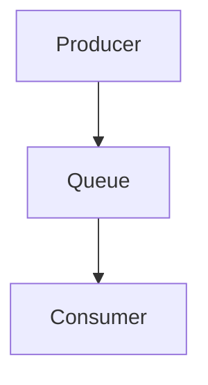
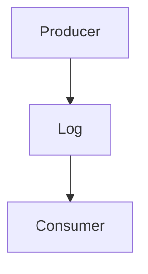
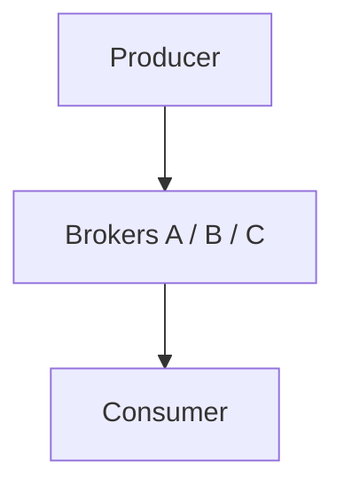
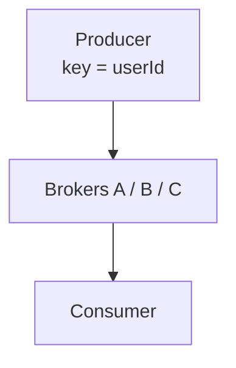
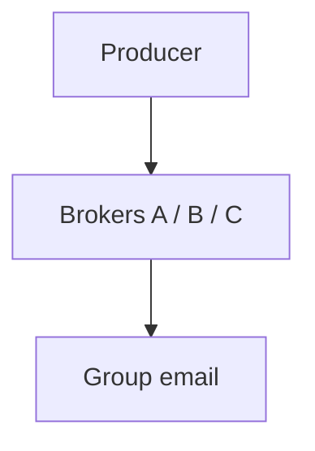
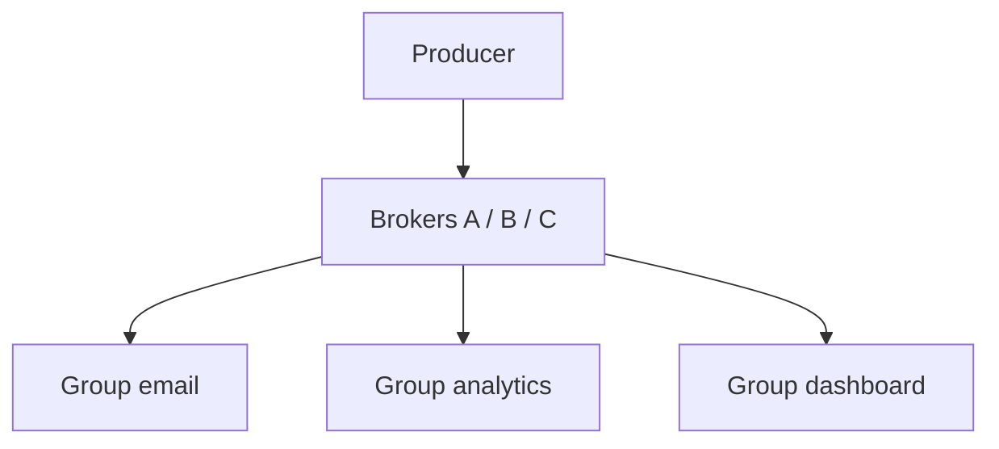
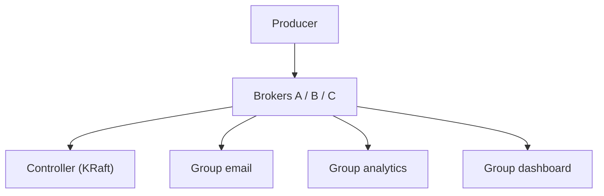
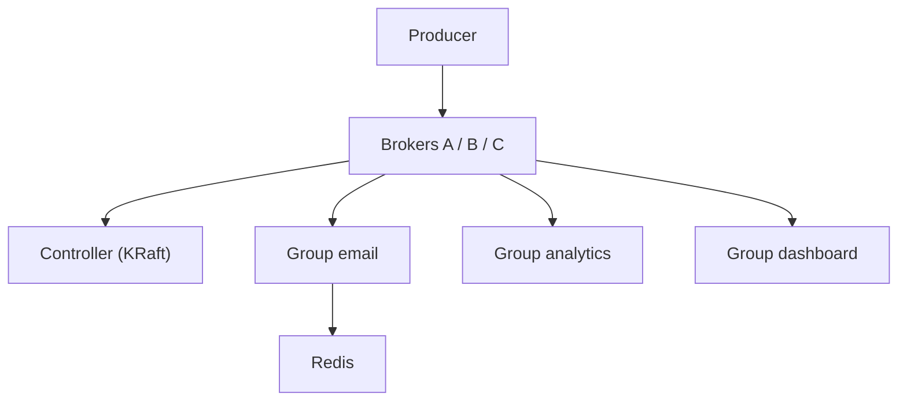
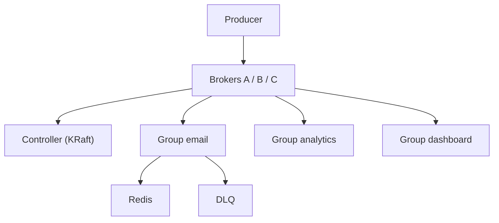

# Design a Message Queue (Kafka-jaisa)

> Ek dabba jo events le le aur kai services ko apni-apni raftaar se de de — bina kisi ko roke, bina kuch khoye.
> Is design ka dil: **kisi ko roko mat (throughput) + kuch kho na jaaye (durability) + per-key order**.

---

## TASVEER (ByteByteGo / Alex Xu · CC BY-NC-ND 4.0)


Source: [Can Kafka Lose Messages?](https://bytebytego.com/guides/can-kafka-lose-messages/)
(HANDS-ON — event kahan khota: producer / broker / consumer, wahi 3 jagah)


Source: [Delivery Semantics](https://bytebytego.com/guides/delivery-semantics/)
(at-most-once / at-least-once / exactly-once — offset commit PEHLE ya BAAD)

---

## SHURU — poocho + numbers

```
POOCHO:  "Ordering, durability, delivery guarantee, replay — kis pe focus?"
         message KHO sakta hai ya bilkul nahi?  · ORDER poore topic ka ya per-user kaafi?
         ek message KAI consumer ko (broadcast) ya ek ko?  · purane dobara padhne (replay)?
         (pehla aur teesra poora design badalte)

FR:      producer DAALE · consumer UTHAYE · EK message KAI consumer tak (email + dashboard + analytics)
         purane dobara padhein · ek user ke event ORDER me
NFR:     DURABILITY · HA · HIGH THROUGHPUT (lakhon / sec, dil) · LOW LATENCY (daalna ms me)
         ORDERING per key · RETENTION / REPLAY · CONSISTENCY = EVENTUAL
         (consistency yahan = message khoye nahi + order na toote; consumer thoda peeche (lag) THEEK)

★ "DUPLICATE NA HO" MAT BOLNA (15-Sep mock me phasa): baad me "at-least-once, duplicate aayega" bola
  -> dono kaatte -> "aapne no-duplicate bola tha?"
  SAHI: "No message loss. Duplicates ARE possible, and we handle them with idempotent consumers —
         so the EFFECT is exactly-once."

NUMBERS: 100M msg / din -> ~1,200 / sec -> peak 3-5x -> ~5,000 / sec
         ~1 KB -> ~1.2 MB / sec -> ~100 GB / din · retention 7 din ~700 GB · x3 replication ~2 TB
         ~2 TB -> ek broker ~1-2 TB -> 3-4 BROKER  ·  parallelism ki ikai partition -> har topic 3-6 PARTITION
         (ye aakhri do line 15-Sep me chhoot gayi thi)
         MQ ka asli number STORAGE (Kafka delete nahi karta, RAKHTA) — log ise sirf "pipe" samajh lete
```

---

## DABBA 0 — sabse simple

```
SOLUTION: ek machine, memory me queue
```


---

## DIKKAT 1 — consumer band tha, restart hua, message gayab

```
DIKKAT:   memory me tha -> restart -> SAB GAYAB

SOLUTION: queue ko LOG banao — disk pe APPEND-ONLY file + har message ka OFFSET
          P0: [0][1][2][3][4][5] — naya hamesha END me · consumer yaad rakhe kahan tak (offset = 2)
          padhne ke baad DELETE NAHI -> restart pe wahin se + offset peeche = REPLAY
          ★ APPEND-ONLY FILE, DB NAHI (sabse bada trap):
            SQL insert = har row pe index (B-tree) + txn + lock = RANDOM write (disk ka sabse slow)
            append = hamesha END = SEQUENTIAL write (disk ka sabse tez, 100s MB / sec)
            DB isliye hota ki POOCH sako (WHERE email = x) — queue me kuch poochte hi nahi, "offset 500 ke baad do"
            offset = KRAM-number (0, 1, 2 ...), byte position nahi · chhota sparse .index file offset -> byte bata deta

BADLA:    Queue (memory) -> Log (disk, append-only)
```

```
AGLA SAWAAL (tere jawab se):
  "Disk pe likhna to dheema hoga?"
   -> sirf end me append (sequential) -> disk ke liye sabse tez kaam; OS page cache se read RAM jaisa
  "Offset kaun yaad rakhta?"
   -> consumer group ka offset Kafka khud ek topic me rakhta (__consumer_offsets)
```

---

## DIKKAT 2 — ek machine me 2 TB aur 5,000 / sec nahi aayega

```
DIKKAT:   jagah + likhne ka load

SOLUTION: topic ko TUKDON me — PARTITION, alag broker pe (har partition apna append-only log)
          TOPIC user-signup: P0 -> Broker A · P1 -> Broker B · P2 -> Broker C

BADLA:    Log -> Brokers A / B / C (har ek pe ek partition)
```

```
POOCHEGA: "One machine can't hold the data or take the writes. What do you do?"
DHYAAN:   replica sirf READ baantti, write ke liye SHARD (partition) · country / date = bura key (skew)
BOL:      "I split the topic into partitions spread across brokers, so both storage and writes scale out."

AGLA SAWAAL (tere jawab se):
  "Kitne partition rakhoge?"
   -> jitne consumer parallel chahiye + aage ki growth (jaise 12-30). Baad me badhaye to key ka partition badlega
  "Ek partition garam (ek key ke bahut event)?"
   -> us key me thoda tukda jodo (userId#bucket) agar kram us key pe zaroori nahi
```

---

## DIKKAT 3 — user-123 ke teen event teen partition me

```
DIKKAT:   signup -> P0 · profile-update -> P2 · delete -> P1 -> delete pehle process ho gaya!
          ORDER sirf EK PARTITION ke andar. POORE topic ka global order Kafka DETA HI NAHI

SOLUTION: KEY do: partition = hash(key) % numPartitions, key = userId
          -> us user ke SAARE event ek partition -> order pakka
          global order chahiye -> sirf ek partition -> throughput khatam -> per-key kaafi

NAYA:     koi dabba nahi — producer key bhejta
```

```
POOCHEGA: "How do you keep messages in order?"
DHYAAN:   partition BADHAYE to hash(key) % n badla -> key doosri partition -> order toot sakta
          -> shuru me thode extra partition
BOL:      "Ordering is per partition, so I key by user id and all of one user's events land in one partition.
           Global order would mean one partition and no throughput."

AGLA SAWAAL (tere jawab se):
  "Partition badhaye to user-123 ka partition badal gaya?"
   -> haan, hash % n badla -> naye event naye partition me, kram thodi der toota. Isliye shuru me hi zyada partition
  "Producer retry me kram ulta (msg 1 fail, msg 2 gaya, phir 1)?"
   -> idempotent producer (enable.idempotence) -> sequence number se kram + dedup
```

---

## DIKKAT 4 — email-service ke 3 instance: teeno ne padha, user ko 3 email

```
DIKKAT:   har instance poora topic padh raha

SOLUTION: CONSUMER GROUP — "ek team hain, kaam BAANT lo"
          GROUP email-service: P0 -> C1 · P1 -> C2 · P2 -> C3
          NIYAM: ek partition -> group me SIRF EK consumer
          PARALLELISM KI LIMIT = PARTITION COUNT (3 partition, 5 consumer -> 2 khaali)

BADLA:    Consumer -> Group email (C1 / C2 / C3)

KYUN EK partition = EK consumer:
          do consumer ek partition padhein to kram toota + kaun-sa message kisne liya, iska har message pe
          hisaab / lock chahiye. Partition poora ek ko -> ek offset, kram pakka, koi tala-mel nahi
          RabbitMQ / SQS ulta: har MESSAGE alag consumer ko (competing consumers) -> kram ki guarantee nahi
```

```
AGLA SAWAAL (tere jawab se):
  "3 partition, kaam zyada, consumer badhane hain?"
   -> partition badhao (consumer > partition = khaali baithenge)
  "Ek message bahut dheema (5 min), poora partition atka?"
   -> haan, head-of-line. Dheema kaam alag topic / worker pool ko, ya partition ke andar parallel (kram chhod ke)
```

---

## DIKKAT 5 — ek hi event email, analytics, dashboard TEENO ko chahiye

```
DIKKAT:   broadcast

SOLUTION: EK topic, TEEN consumer GROUP — har group ko poora topic, har group ka apna offset
          SAME group = kaam BAANTO (load-share) · ALAG group = sabko POORA (broadcast)
          OFFSET kahan: Kafka ka internal topic __consumer_offsets, key = (group, topic, partition)
                        -> value = offset (compaction se sirf latest)

NAYA:     Group analytics · Group dashboard
```

```
DHYAAN:   (15-Sep mock galti) "har service ka alag TOPIC" -> NAHI. producer ko ek event TEEN baar bhejna padta
          -> "ek message kai consumer tak" wali requirement hi toot gayi. MQ ka dil, interviewer yahin ungli rakhta
BOL:      "One topic, one consumer group per service. Within a group partitions are shared; across groups
           everyone gets the whole stream, each with its own offset."

AGLA SAWAAL (tere jawab se):
  "Naya group aaj juda, purane 7 din ke event padhega?"
   -> auto.offset.reset = earliest -> shuru se · latest -> sirf ab ke baad ke
  "Analytics group peeche hai, email ko farak?"
   -> nahi, har group ka apna offset -> ek dheema, doosra apni speed
```

---

## DIKKAT 6 — Broker A ki disk gayi, us partition ka SAARA data gaya

```
DIKKAT:   har partition ki ek hi copy

SOLUTION: REPLICATION — har partition ka LEADER (saara read / write) + FOLLOWERS (leader se kheench ke copy)
          leader mara -> ek follower naya leader (faisla CONTROLLER: purana Zookeeper, naya KRaft)
          ISR = In-Sync Replicas (saath-saath chal rahe) · naya leader SIRF ISR se
               (peeche wala leader bana = uske paas kuch event hi nahi = DATA LOSS)
          acks (producer kab maane "likh gaya") — TRADE-OFF:
               acks=0 daal ke bhaaga (tez, kho sakta) · acks=1 leader ne likha · acks=all leader + saare ISR (safe, thoda slow)
               "payment / order -> acks=all, click / log -> acks=1"
          copies ALAG rack / AZ (broker.rack) — warna ek AZ = leader + follower saath gaye
          CONTROLLER metadata (kaun leader, ISR me kaun) = chhota par 100% sahi -> split-brain roko

NAYA:     Controller (KRaft) (kaun leader, kaun ISR me — ye hisaab rakhne wala)
BADLA:    Brokers A / B / C -> har partition ka leader + 2 follower (alag broker / AZ)
```

```
POOCHEGA: "What happens if a broker goes down?"
BOL:      "Each partition has a leader and followers on other brokers in different zones. If the leader dies,
           the controller promotes an in-sync follower, so nothing acknowledged is lost. Producers use
           acks=all for important events."

AGLA SAWAAL (tere jawab se):
  "acks=all aur min.insync.replicas=2 ka matlab?"
   -> leader + kam se kam 1 follower ke paas likha tab 'done' -> leader mara to bhi data follower pe
  "ISR me ek hi bacha?"
   -> min.insync=2 se kam -> producer ko error (likhna band), data kho jaane se behtar
```

---

## DIKKAT 7 — kaam ho gaya par commit se pehle crash (ya ulta)

```
DIKKAT:   A) padha offset 5 -> email bheja -> CRASH (commit nahi) -> restart pe WAHI event -> EMAIL DO BAAR
          B) padha 5 -> commit -> kaam se PEHLE crash -> restart 6 se -> event 5 KHO GAYA

SOLUTION: TEEN GUARANTEE:
            AT-MOST-ONCE  pehle commit, phir kaam  -> duplicate nahi, LOSS ho sakta
            AT-LEAST-ONCE pehle kaam, phir commit  -> loss nahi, DUPLICATE ho sakta   <- DEFAULT
            EXACTLY-ONCE  na loss na duplicate     -> mehnga + slow, har jagah nahi
          ★ "Kafka at-least-once deta; exactly-once EFFECT CONSUMER-SIDE IDEMPOTENCY se"
             consumer: Redis me eventId? hai -> SKIP · nahi -> kaam + id daalo (TTL ~24h)
          ★ DO ALAG KEY (kam log bolte):
             partition key = userId (ordering) · dedup key = eventId (duplicate)
             userId ko dedup key banaya = us user ka doosra legit event bhi skip = BUG
          dedup cache CONSUMER-side, queue ke andar nahi (Kafka disk pe append + OS page cache se tez)
          PRODUCER side: DB write + event dono chahiye -> OUTBOX (event usi DB txn me outbox table, relay bheje)
          poora "kuch na khoye" = producer acks=all + ISR · consumer offset BAAD + idempotent · fail -> DLQ (dikkat 8)

NAYA:     Redis (dedup, consumer side)

KAISE (outbox relay):
          raasta 1 POLLING: relay har ~1 sec: SELECT * FROM outbox WHERE sent = false -> Kafka bhejo -> sent = true
          raasta 2 CDC (Debezium): DB ka log (binlog / WAL) padh ke outbox ki nayi row seedha Kafka me
          relay bheja par 'sent' likhne se pehle mara -> dobara bhejega -> isliye consumer idempotent
```

```
POOCHEGA: "How do you make sure no message is lost?"
MISAAL 1 (consumer crash, Swiggy): order_placed uthaya, SMS se pehle crash -> offset BAAD me -> event dobara aayega
          SMS gaya + commit se pehle crash -> 2 SMS -> idempotent (eventId) · galat number baar-baar fail -> backoff -> DLQ
BOL:      "I commit the offset only after the SMS is sent, so a crash means the event is redelivered, not lost.
           That makes it at-least-once, so the consumer is idempotent - it records the event ID and skips
           duplicates - and a message that keeps failing goes to a DLQ."

POOCHEGA: "The order is saved but the server crashes before sending the event. Now what?"
MISAAL 2 (producer crash, e-commerce): OUTBOX, DB ke SAATH, EK transaction:
          BEGIN -> INSERT order -> INSERT outbox_event -> COMMIT ; relay -> outbox padhe -> Kafka -> "sent"
          "order placed" user ko COMMIT ke BAAD hi
          commit se PEHLE crash -> rollback (dono nahi) -> error -> user dobara
          commit ke BAAD, jawab se pehle crash -> dono saved, relay bhejega; user dobara dabaye -> IDEMPOTENCY KEY
          (checkout pe bani) -> wahi purana order
BOL:      "The API only returns 'order placed' after the transaction commits. A crash before commit rolls back
           both the order and the outbox row, so the user sees an error and retries. A crash after commit
           leaves both saved, the relay still sends the event, and an idempotency key stops the retry from
           creating a duplicate order."

POOCHEGA: "What if the same event comes twice?"
BOL:      "Expected with at-least-once. The consumer dedups on event id, not on the partition key."

AGLA SAWAAL (tere jawab se):
  "Exactly-once Kafka me hota hi nahi?"
   -> Kafka transactions + idempotent producer -> Kafka-se-Kafka exactly-once. Bahar (SMS, DB) ke liye
      consumer idempotency hi raasta
  "Outbox table bahut badi?"
   -> 'sent' rows roz saaf / partition drop
```

---

## DIKKAT 8 — consumer mar gaya / peeche chal raha

```
DIKKAT:   kaam ruka ya lag badhta

SOLUTION: REBALANCE: C1->P0, C2->P1, C3->P2 · C2 mara -> coordinator (ek broker) ko heartbeat band
                     -> partitions dobara bante: C1->P0,P1 · C3->P2 (kaam ruka nahi) · naya consumer -> phir rebalance
          COST: purana (eager) rebalance = poora group thodi der RUKTA (stop-the-world)
                Kafka 2.4+ cooperative = sirf badli partitions rukti -> baar-baar restart mat karo
          CONSUMER LAG (production ka sabse zaroori metric — tera 700-ticket zone):
                lag = latest offset - group ka committed offset = "kitna peeche"
                badh raha -> consumer slow / kam -> badhao (partition se zyada nahi) -> alert
          RETRY + DLQ (usercrud me KAR chuka — confidence se bolo):
                fail -> backoff retry -> N fail -> DEAD-LETTER TOPIC -> baaki atke nahi, DLQ alag dekho / replay

NAYA:     DLQ
```

```
AGLA SAWAAL (tere jawab se):
  "Rebalance me sab consumer ruk jaate?"
   -> purana (eager) haan; cooperative rebalance -> sirf jinke partition badle wahi ruke
  "Lag badh raha, kya karoge?"
   -> consumer badhao (partition tak), dheema kaam alag, alert lag pe
```

---

## DIKKAT 9 — 7 din ka data rakhoge to disk bharegi

```
DIKKAT:   ye QUEUE nahi, LOG hai — padhne ke baad delete nahi

SOLUTION: RETENTION: time ("7 din", default, sabse common) · size ("partition 100 GB se bada -> purana kaato")
                     COMPACTION: per KEY sirf LATEST ("user-123 ka current address" jaisa STATE)
          isi se REPLAY: naya group offset 0 se poora itihaas · bug fix -> offset peeche -> dobara
          purana SEGMENT poori file delete (row-by-row nahi) -> sasta

NAYA:     koi dabba nahi
```

```
AGLA SAWAAL (tere jawab se):
  "Compaction kab?"
   -> jab har key ka sirf latest chahiye (user profile, config) -> purani value kaati, aakhri rakhi
  "7 din ke baad consumer ne padha hi nahi tha?"
   -> data gaya. Isliye lag pe alert, retention consumer ki sabse lambi chhutti se zyada
```

---

## 10x SCALE — har dabba alag

```
partitions     -> consumer badhaye par partition 3 hi -> extra KHAALI, lag badhta -> PARTITION BADHAO
                  ★ "Adding partitions changes hash(key) % n, so an existing key can move to a different partition
                     and its ordering can break — that's why we start with a few extra partitions." (15-Sep chhooti thi)
slow consumer  -> downstream (email API / DB) slow -> consumer scale (partition tak) · batch · bhaari kaam alag topic
HOT PARTITION  -> ek bade customer ki key pe saara -> key todo (userId#1..4), us key ka strict order chhodo
                  (ya us tenant ka alag topic) · consistent hashing ek hot key ko nahi bachata
broker disk    -> 2 TB tha, 10x = 20 TB -> retention 7 -> 2-3 din · compaction · broker add · tiered storage / S3
rebalance storm-> baar-baar deploy -> session-timeout tuning · static membership · rolling deploy
producer       -> acks=all har jagah = latency -> event ke hisaab se (payment = all, logs = 1)

POOCHEGA: "What about a hot key / hot partition?"   -> upar HOT PARTITION
POOCHEGA: "How would you scale this to 10x?"        -> message ka raasta chalo
POOCHEGA: "What's the single point of failure?"     -> leader (ISR promote), controller (KRaft quorum)
POOCHEGA: "How do you know it's working?"           -> CONSUMER LAG · under-replicated partitions · DLQ size · alert
```

---

## POOCHE TO (deep-dive)

```
API:      PRODUCER  send(topic, key, value) -> (partition, offset) receipt · acks = 0 / 1 / all
          CONSUMER  subscribe(topic, groupId) · poll(timeout) batch · commit(offset) · seek(partition, offset) = REPLAY
          ADMIN     createTopic(name, partitions, replicationFactor) / deleteTopic / describeTopic
          PULL hai, PUSH nahi: consumer apni raftaar se, slow consumer dab ke nahi marta
                               keemat: agle poll tak thodi latency (push hota to broker apni raftaar se dhakelta -> dheema CONSUMER overload)
          send() BATCH karta -> isliye throughput high
          "The queue's own API is deliberately tiny — send, poll, commit, seek. All the business logic lives
           in the consumer, not in the broker. That's why the broker can be so fast."

MESSAGE:  offset (BROKER deta) · timestamp · key (hash(key) % n) · value (JSON / Avro) · headers (traceId, eventType, retryCount)
DISK:     /topic-user-signup/partition-0/
             00000000000000000000.log     messages, append-only (segment ~1 GB)
             00000000000000000000.index   offset -> byte position
             00000000000512340000.log     segment bhara -> naya

DATA 3 KISM:  MESSAGES (bahut, tez) -> append-only file, safety = replication + acks (DB nahi)
              METADATA (kam, 100% sahi: topic / partition / leader / ISR) -> strongly consistent (Zookeeper / KRaft-Raft)
                        kyun: do broker khud ko ek partition ka leader samjhein = SPLIT-BRAIN = data corrupt
              CONSUMER OFFSETS -> __consumer_offsets

KAB KAFKA:    caller ko jawab ka intezaar nahi (signup ke baad email / analytics) · EK event KAI consumer
              high throughput + replay (logs, clickstream, audit) · producer / consumer speed alag (spike buffer)
KAB NAHI:     TURANT jawab -> REST / gRPC · strict GLOBAL order · simple task queue + per-message retry
              -> RabbitMQ / SQS (Kafka overkill) · chhota system, 2 service -> ek aur moving part mehnga
KEEMAT:       eventually consistent (LAG) · duplicate handle karna padta · debug mushkil (flow bikhra)
              · ek aur cluster paalna (partition / retention / lag monitoring)

WORD-FREEZE FALLBACK (term atke to bina term bolo):
   partition      -> "the topic is split into parts, and each part sits on a different machine"
   offset         -> "each part is like a numbered list, and every consumer remembers which number it has read up to"
   consumer group -> "a set of consumers that act as one team and divide the parts among themselves"
   ISR            -> "the copies that are fully caught up with the main one"
   idempotent     -> "even if the same event comes twice, the work happens only once, because we store the event id"
   compaction     -> "for each key we keep only the latest value and throw away the older ones"
```

---

## AAKHRI DABBA + WRAP

```
Producer = key + acks · Brokers = partition (append-only log + offset), leader + ISR followers, retention
Controller = metadata, split-brain roko · Groups = ek group me baantna, alag group = broadcast
Redis = eventId dedup · DLQ = poison alag
```

```
FLOW: producer -> key se partition -> LEADER pe append (offset) -> follower copy (ISR)
      -> har group apne offset se padhe -> kaam -> commit -> event 7 din pada (replay)

1 KYUN        sync coupling todna -> producer fire-and-forget, consumer apni raftaar
2 TOPIC/PART  partition = scale + append-only log + offset · key -> order PER-PARTITION (global nahi)
3 GROUP       group ke andar baanto · alag group = broadcast · parallelism limit = partition count
4 REPLICATION leader / follower · naya leader sirf ISR · acks 0 / 1 / all = speed vs safety
5 DELIVERY    at-least-once + idempotent consumer = exactly-once EFFECT · retention -> replay
6 TRADE-OFF   async + broadcast + replay -> Kafka · sync jawab / global order -> Kafka NAHI
```
```
BOL: "Producers write keyed events to partitioned, append-only logs spread across brokers, so ordering is
      per key. Each partition is replicated; a new leader comes only from the in-sync replicas, and important
      events use acks=all. Each service is its own consumer group, so one event reaches all of them. Delivery
      is at-least-once: consumers commit after processing, are idempotent on event id, and send poison
      messages to a DLQ. Retention keeps the log so we can replay."
```

---

## HANDS-ON — EVENT KAHAN KHOTA HAI: 3 jagah crash karwa ke dekha (30-Sep)

> Grill sawaal (bank): "paisa kata -> event SMS / fraud / statement tak. Ek bhi event kho na jaaye, kaise?"
> Maine SAGA bola tha -> galat dabba: saga = faile kaam ko ULTA karna. Yahan ulta nahi, event RASTE me kho raha.
> Sahi soch jo thi: "pehle pakka likho" = OUTBOX.
> CODE: `04_HLD/HANDS_ON/04_event_loss/EventLossDemo.java` (nakli, Docker nahi) · line 24 `FIX = false / true` -> `java EventLossDemo.java`

```
[Bank DB] --1--> [Kafka] --2--> (replica) --3--> [SMS service]
1 e3: paisa kata, event bhejne se PEHLE app crash          (producer)
2 e4: leader ne liya, replica se PEHLE leader gira          (broker)
3 e2: SMS service ne offset commit kiya, SMS se PEHLE crash (consumer)
```
```
ROUND 1  FIX = false
  e1 DB + Kafka · e2 DB + Kafka · e3 DB, CRASH bhejne se pehle -> event kabhi nahi gaya
  e4 DB, Kafka acks=1 leader memory me "OK", CRASH replica se pehle -> e4 GAYA (producer ko laga bhej diya)
  e5 DB + Kafka
  consumer: e1 commit(1) SMS · e2 commit(2) CRASH SMS se pehle -> restart 2 ke aage -> e2 CHHOOTA · e5 commit(3) SMS
  NATEEJA: DB [e1..e5] · Kafka [e1, e2, e5] · SMS [e1, e5] · KHOYE [e2, e3, e4]

ROUND 2  FIX = true
  e1..e5 DB debit + OUTBOX row, ek transaction · e3 CRASH bhejne se pehle -> outbox me pada
  relay (restart ke baad bhi) outbox -> Kafka: e1, e2, e3 pahunche
  e4 acks=all leader + replica dono pe, TAB "OK" · CRASH leader -> replica naya leader, e4 uske paas · e5 pahuncha
  consumer: e1 SMS, commit(1) · e2 SMS, CRASH commit se pehle -> e2 PHIR aaya -> eventId dekha -> DUPLICATE chhoda
            e3 SMS commit(3) · e4 SMS commit(4) · e5 SMS commit(5)
  NATEEJA: DB [e1..e5] · Kafka [e1..e5] · SMS [e1..e5] · KHOYE []
```
```
               FIX = false                                   FIX = true
e3 producer    debit hua, bhejne se pehle crash -> KHOYA     debit + outbox EK txn, relay ne bheja -> BACHA
e4 Kafka       acks=1 leader "OK", replica se pehle -> KHOYA acks=all replica ke baad "OK" -> BACHA
e2 consumer    pehle commit, SMS se pehle crash -> KHOYA     pehle SMS, baad commit, phir aaya, dedup -> BACHA

EK NIYAM: "ho gaya" tabhi bolo jab sach me PAKKA
OUTBOX      chhota LEDGER: "ye bhejna hai" debit ke SAATH, USI ek txn -> "paisa kata, likha nahi" ho hi nahi sakta
acks=all    replica pe likhne ke BAAD "OK" (acks=1 = leader ki memory pe "OK" -> leader gira = gaya)
OFFSET BAAD kaam PEHLE, commit BAAD -> crash = event phir aayega (at-least-once)
IDEMPOTENT  eventId yaad, dobara aaye to chhodo
DLQ         baar-baar fail -> retry ke baad DLQ, baaki na ruke (simulation me nahi)
SAGA ≠ ye   saga kaam ULTA karta (refund). Yahan sirf raste me khona rokna.

BOL: "At-least-once delivery: an outbox so the debit and the event commit in the same transaction, acks=all
      with replication on Kafka, and consumers that commit the offset only after processing. Consumers are
      idempotent on event id, and poison messages go to a DLQ. I simulated a crash at each of the three
      points: without these, 3 of 5 events were lost; with them, none."
```

ARCHETYPE B/F · CONCEPTS: [message-queues](../../FOUNDATIONS/07_message_queues.md) · [replication](../../FOUNDATIONS/05_database_replication.md) · [sharding/partition](../../FOUNDATIONS/06_database_sharding.md) · saath: [notification](../04_notification_system/04_notification_system.md) · [← MASTER SHEET](../../00_MASTER_SHEET.md)
