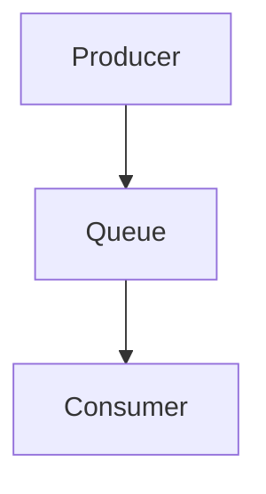
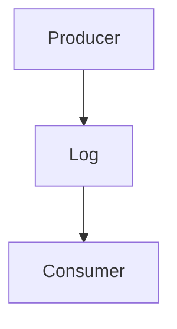
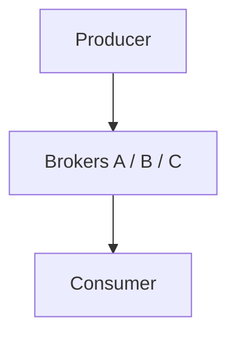
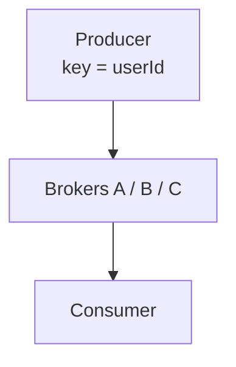
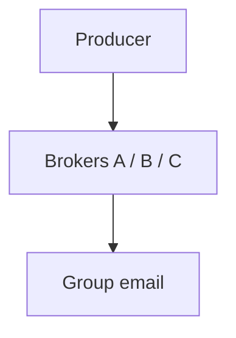
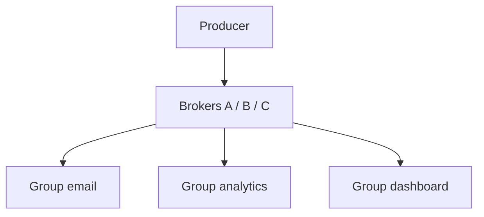
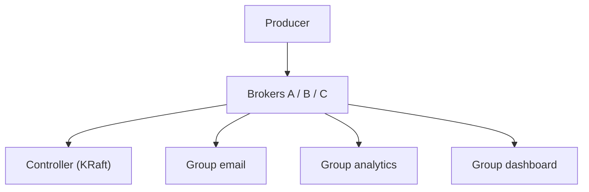
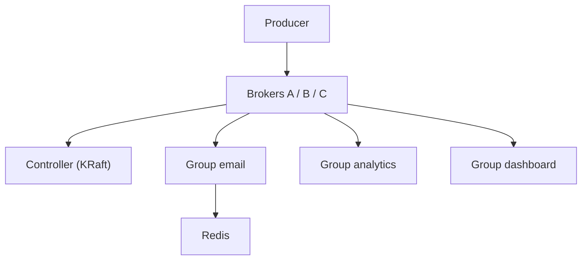
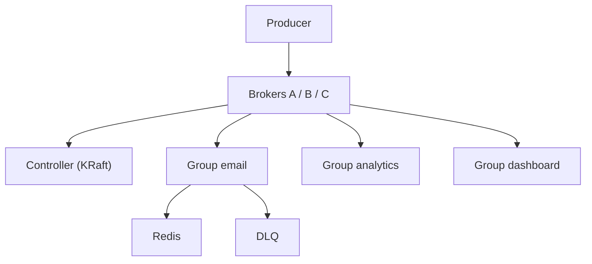

# Design a Message Queue (Kafka-jaisa)

> Ek dabba jo events le le aur kai services ko apni-apni raftaar se de de — bina kisi ko roke, bina kuch khoye.
> Is design ka dil: **kisi ko roko mat (throughput) + kuch kho na jaaye (durability) + per-key order**.

---

## TASVEER (ByteByteGo / Alex Xu · CC BY-NC-ND 4.0)


Source: [Can Kafka Lose Messages?](https://bytebytego.com/guides/can-kafka-lose-messages/)
(HANDS-ON — event kahan khota: producer / broker / consumer, wahi 3 jagah)


Source: [Delivery Semantics](https://bytebytego.com/guides/delivery-semantics/)
(at-most-once / at-least-once / exactly-once — offset commit PEHLE ya BAAD)

---

## SHURU — poocho + numbers

```
POOCHO:  "Ordering, durability, delivery guarantee, replay — kis pe focus?"
         message KHO sakta hai ya bilkul nahi?  · ORDER poore topic ka ya per-user kaafi?
         ek message KAI consumer ko (broadcast) ya ek ko?  · purane dobara padhne (replay)?
         (pehla aur teesra poora design badalte)

FR:      producer DAALE · consumer UTHAYE · EK message KAI consumer tak (email + dashboard + analytics)
         purane dobara padhein · ek user ke event ORDER me
NFR:     DURABILITY · HA · HIGH THROUGHPUT (lakhon / sec, dil) · LOW LATENCY (daalna ms me)
         ORDERING per key · RETENTION / REPLAY · CONSISTENCY = EVENTUAL
         (consistency yahan = message khoye nahi + order na toote; consumer thoda peeche (lag) THEEK)

★ "DUPLICATE NA HO" MAT BOLNA (15-Sep mock me phasa): baad me "at-least-once, duplicate aayega" bola
  -> dono kaatte -> "aapne no-duplicate bola tha?"
  SAHI: "No message loss. Duplicates ARE possible, and we handle them with idempotent consumers —
         so the EFFECT is exactly-once."

NUMBERS: 100M msg / din -> ~1,200 / sec -> peak 3-5x -> ~5,000 / sec
         ~1 KB -> ~1.2 MB / sec -> ~100 GB / din · retention 7 din ~700 GB · x3 replication ~2 TB
         ~2 TB -> ek broker ~1-2 TB -> 3-4 BROKER  ·  parallelism ki ikai partition -> har topic 3-6 PARTITION
         (ye aakhri do line 15-Sep me chhoot gayi thi)
         MQ ka asli number STORAGE (Kafka delete nahi karta, RAKHTA) — log ise sirf "pipe" samajh lete
```

---

## DABBA 0 — sabse simple

```
SOLUTION: ek machine, memory me queue
```


---

## DIKKAT 1 — consumer band tha, restart hua, message gayab

```
DIKKAT:   message memory me tha -> consumer restart hua -> sab gayab

SOLUTION: queue ko memory se hata ke disk pe LOG banao — append-only file, naya message hamesha end me.
          Har message ka ek number hota hai (OFFSET), consumer bas yaad rakhta "kahan tak padha".
          Padhne ke baad delete nahi hota, to restart pe wahin se chalu, aur offset peeche karke dobara
          bhi padh sakte (REPLAY).
          ★ DB kyun nahi (sabse bada trap): DB me har insert pe index + lock = random write, slow. Append
          = hamesha end me = sequential write, disk ka sabse tez kaam. Queue me kuch dhoondhna (WHERE)
          hota hi nahi, bas "offset X ke baad do".

BADLA:    Queue (memory) -> Log (disk, append-only)
```

```
BOARD PE: P0: [0][1][2][3][4][5] -> naya hamesha END me · consumer ka offset = 2
          offset = kram-number (0, 1, 2), byte nahi · chhota .index file offset -> byte bata deta

AGLA SAWAAL (tere jawab se):
  "Disk pe likhna to dheema hoga?"
   -> sirf end me append (sequential) -> disk ke liye sabse tez kaam; OS page cache se read RAM jaisa
  "Offset kaun yaad rakhta?"
   -> consumer group ka offset Kafka khud ek topic me rakhta (__consumer_offsets)
```

---

## DIKKAT 2 — ek machine me 2 TB aur 5,000 / sec nahi aayega

```
DIKKAT:   ek machine me itna data (2 TB) nahi samaata, aur 5,000 / sec likhna bhi akeli machine nahi jhel
          paati

SOLUTION: topic ko tukdon me baant do, har tukda = PARTITION. Har partition alag machine (broker) pe,
          aur har partition ka apna append-only log. Ab data aur likhne ka load dono kai machines me
          bat gaye. Load badhe to aur broker aur partition jod do.

BADLA:    ek Log -> kai Brokers
```

```
BOARD PE: TOPIC user-signup: P0 -> Broker A · P1 -> Broker B · P2 -> Broker C

POOCHEGA: "One machine can't hold the data or take the writes. What do you do?"
DHYAAN:   replica sirf READ baantti, write ke liye SHARD (partition) · country / date = bura key (skew)
BOL:      "I split the topic into partitions spread across brokers, so both storage and writes scale out."

AGLA SAWAAL (tere jawab se):
  "Kitne partition rakhoge?"
   -> jitne consumer parallel chahiye + aage ki growth (jaise 12-30). Baad me badhaye to key ka partition badlega
  "Ek partition garam (ek key ke bahut event)?"
   -> us key me thoda tukda jodo (userId#bucket) agar kram us key pe zaroori nahi
```

---

## DIKKAT 3 — user-123 ke teen event teen partition me

```
DIKKAT:   ek user ke events alag-alag partition me gaye -> delete pehle process ho gaya, signup baad me.
          Kafka order sirf EK partition ke andar deta hai, poore topic ka nahi.

SOLUTION: producer har message ke saath KEY bheje (userId). Kafka key ka hash le ke partition chunta,
          to ek user ke saare events hamesha ek hi partition me -> unka order pakka.
          Poore topic ka order chahiye to ek hi partition rakhna padega -> throughput khatam.
          Isliye per-user order kaafi hai.

NAYA:     koi dabba nahi — producer key bhejta
```

```
BOARD PE: bina key: signup -> P0 · profile-update -> P2 · delete -> P1
          key ke saath: partition = hash(userId) % numPartitions -> user-123 ke teeno ek hi partition me

POOCHEGA: "How do you keep messages in order?"
DHYAAN:   partition BADHAYE to hash(key) % n badla -> key doosri partition -> order toot sakta
          -> shuru me thode extra partition
BOL:      "Ordering is per partition, so I key by user id and all of one user's events land in one partition.
           Global order would mean one partition and no throughput."

AGLA SAWAAL (tere jawab se):
  "Partition badhaye to user-123 ka partition badal gaya?"
   -> haan, hash % n badla -> naye event naye partition me, kram thodi der toota. Isliye shuru me hi zyada partition
  "Producer retry me kram ulta (msg 1 fail, msg 2 gaya, phir 1)?"
   -> idempotent producer (enable.idempotence) -> sequence number se kram + dedup
```

---

## DIKKAT 4 — email-service ke 3 instance: teeno ne padha, user ko 3 email

```
DIKKAT:   email-service ke 3 instance, teeno poora topic padh rahe -> user ko 3 email

SOLUTION: teeno ko ek CONSUMER GROUP me daalo — "ek team hain, kaam baant lo".
          Group ke andar ek partition ko sirf EK consumer padhta, to har message ek hi baar process hota.
          Isliye parallel kitne consumer chal sakte = jitne partitions. Zyada consumer = khaali baithe.
          Ek partition ek hi consumer ko kyun: do padhein to order toot jaayega, aur har message pe
          "kisne liya" ka hisaab / lock lagega. Ek ko poora diya -> ek offset, order pakka.
          (RabbitMQ / SQS me ulta: har message alag consumer ko -> order ki guarantee nahi.)

BADLA:    Consumer -> Group email (C1 / C2 / C3)
```

```
BOARD PE: GROUP email-service: P0 -> C1 · P1 -> C2 · P2 -> C3
          3 partition + 5 consumer -> 2 consumer khaali

AGLA SAWAAL (tere jawab se):
  "3 partition, kaam zyada, consumer badhane hain?"
   -> partition badhao (consumer > partition = khaali baithenge)
  "Ek message bahut dheema (5 min), poora partition atka?"
   -> haan, head-of-line. Dheema kaam alag topic / worker pool ko, ya partition ke andar parallel (kram chhod ke)
```

---

## DIKKAT 5 — ek hi event email, analytics, dashboard TEENO ko chahiye

```
DIKKAT:   ek hi event email, analytics, dashboard teeno ko chahiye (broadcast)

SOLUTION: topic ek hi rakho, har service ka apna CONSUMER GROUP. Har group ko poora topic milta, apne alag
          offset ke saath.
          Yaad rakhne ka niyam: SAME group = kaam baanto · ALAG group = sabko poora.
          Offset Kafka khud rakhta hai, ek internal topic me, group + partition ke hisaab se.

NAYA:     Group analytics · Group dashboard
```

```
BOARD PE: __consumer_offsets: key = (group, topic, partition) -> value = offset (compaction, sirf latest)

DHYAAN:   (15-Sep mock galti) "har service ka alag TOPIC" -> NAHI. producer ko ek event TEEN baar bhejna padta
          -> "ek message kai consumer tak" wali requirement hi toot gayi. MQ ka dil, interviewer yahin ungli rakhta
BOL:      "One topic, one consumer group per service. Within a group partitions are shared; across groups
           everyone gets the whole stream, each with its own offset."

AGLA SAWAAL (tere jawab se):
  "Naya group aaj juda, purane 7 din ke event padhega?"
   -> auto.offset.reset = earliest -> shuru se · latest -> sirf ab ke baad ke
  "Analytics group peeche hai, email ko farak?"
   -> nahi, har group ka apna offset -> ek dheema, doosra apni speed
```

---

## DIKKAT 6 — Broker A ki disk gayi, us partition ka SAARA data gaya

```
DIKKAT:   har partition ki ek hi copy -> Broker A ki disk gayi, us partition ka saara data gaya

SOLUTION: REPLICATION: har partition ka ek LEADER (saare read / write) aur followers, jo leader se copy
          kheenchte. Leader mara to ek follower naya leader banta — ye faisla CONTROLLER leta (pehle
          Zookeeper, ab KRaft).
          Naya leader sirf unme se jo saath-saath chal rahe (ISR). Peeche wala leader bana to uske paas
          kuch events hi nahi = data loss.
          Producer kab maane "likh gaya" (acks): payment / order pe acks=all (leader + saare ISR),
          click / log pe acks=1. Safety vs speed ka trade-off.
          Copies alag rack / AZ me rakho, warna ek AZ gaya to leader aur follower dono gaye.

NAYA:     Controller (KRaft) (kaun leader, kaun ISR me — ye hisaab rakhne wala)
BADLA:    Brokers A / B / C -> har partition ka leader + 2 follower (alag broker / AZ)
```

```
BOARD PE: acks=0 daal ke bhaaga (tez, kho sakta) · acks=1 leader ne likha · acks=all leader + saare ISR
          broker.rack = AZ · controller ka metadata chhota par 100% sahi -> split-brain roko

POOCHEGA: "What happens if a broker goes down?"
BOL:      "Each partition has a leader and followers on other brokers in different zones. If the leader dies,
           the controller promotes an in-sync follower, so nothing acknowledged is lost. Producers use
           acks=all for important events."

AGLA SAWAAL (tere jawab se):
  "acks=all aur min.insync.replicas=2 ka matlab?"
   -> leader + kam se kam 1 follower ke paas likha tab 'done' -> leader mara to bhi data follower pe
  "ISR me ek hi bacha?"
   -> min.insync=2 se kam -> producer ko error (likhna band), data kho jaane se behtar
```

---

## DIKKAT 7 — kaam ho gaya par commit se pehle crash (ya ulta)

```
DIKKAT:   kaam karke commit se pehle crash -> restart pe wahi event dobara -> email do baar.
          Ulta: commit karke kaam se pehle crash -> restart aage se -> event kho gaya.

SOLUTION: teen raaste: AT-MOST-ONCE (pehle commit, phir kaam -> kho sakta) · AT-LEAST-ONCE (pehle kaam,
          phir commit -> duplicate aa sakta, Kafka ka default) · EXACTLY-ONCE (dono nahi, mehnga + slow).
          ★ Hum at-least-once lete aur consumer ko IDEMPOTENT banate: har event ka eventId, pehle dekh
          liya to skip. Asar exactly-once jaisa.
          ★ DO ALAG KEY (kam log bolte): order ke liye key = userId, duplicate pakadne ke liye key =
          eventId — dono alag.
          userId se dedup kiya to us user ka doosra sahi event bhi skip ho jaayega.
          Producer side: DB me save + event bhejna dono chahiye -> OUTBOX: event usi DB transaction me
          outbox table me likho, ek relay use Kafka bheje.
          Poora "kuch na khoye" = producer acks=all + consumer kaam ke baad commit + idempotent + fail pe DLQ.

NAYA:     Redis (dedup, consumer side)

KAISE (outbox relay):
          raasta 1 POLLING: relay har ~1 sec: SELECT * FROM outbox WHERE sent = false -> Kafka bhejo -> sent = true
          raasta 2 CDC (Debezium): DB ka log (binlog / WAL) padh ke outbox ki nayi row seedha Kafka me
          relay bheja par 'sent' likhne se pehle mara -> dobara bhejega -> isliye consumer idempotent
```

```
BOARD PE: A) padha offset 5 -> email bheja -> CRASH (commit nahi) -> restart pe phir 5 -> email do baar
          B) padha 5 -> commit -> CRASH -> restart 6 se -> event 5 kho gaya
          consumer: Redis me eventId? hai -> SKIP · nahi -> kaam + id daalo (TTL ~24h)

POOCHEGA: "How do you make sure no message is lost?"
MISAAL 1 (consumer crash, Swiggy): order_placed uthaya, SMS se pehle crash -> offset BAAD me -> event dobara aayega
          SMS gaya + commit se pehle crash -> 2 SMS -> idempotent (eventId) · galat number baar-baar fail -> backoff -> DLQ
BOL:      "I commit the offset only after the SMS is sent, so a crash means the event is redelivered, not lost.
           That makes it at-least-once, so the consumer is idempotent - it records the event ID and skips
           duplicates - and a message that keeps failing goes to a DLQ."

POOCHEGA: "The order is saved but the server crashes before sending the event. Now what?"
MISAAL 2 (producer crash, e-commerce): OUTBOX — ek order le ke chalte hain, order #101, aur dekhte hain crash kab hua.

          Pehle samajh le: server ke paas do jagah hain jahan cheez likhi jaati hai:

          DB (MySQL)                              Kafka
            orders table                            topic "order-events"
            outbox table: event_id | payload | sent

          Normal din, koi crash nahi:

          STEP A   BEGIN
          STEP B   INSERT orders (101)
          STEP C   INSERT outbox (E-101, "order 101 placed", sent = false)
          STEP D   COMMIT                       <- yahan dono DB me pakke ho gaye
          ---- relay (alag thread, har 1 sec) ----
          STEP E   outbox se sent = false wali row uthai -> Kafka.send(E-101)
          STEP F   Kafka ka ACK aaya ("mil gaya")
          STEP G   UPDATE outbox SET sent = true WHERE event_id = E-101

          Ab crash in steps ke beech kahin bhi ho sakta hai. Restart ke baad server sirf DB dekh sakta hai,
          uski memory saaf ho chuki hai.

          CASE 1: crash STEP D (COMMIT) se pehle

          DB:     orders me 101 NAHI · outbox me E-101 NAHI   (transaction rollback, aadha kuch nahi)
          Kafka:  kuch nahi

          Restart ke baad DB me kuch hai hi nahi. User ko "order placed" mila hi nahi tha, kyunki ye jawab
          COMMIT ke baad hi jaata hai. User ko error dikha, wo dobara order karega. Kuch nahi khoya, kyunki
          kuch bana hi nahi tha.

          CASE 2: crash STEP D ke baad, STEP E (send) se pehle

          DB:     orders me 101 HAI · outbox me E-101, sent = false
          Kafka:  kuch nahi (bheja hi nahi tha)

          Restart -> relay chalu -> outbox me sent = false wali row dekhi: E-101 -> Kafka bheja -> ACK ->
          sent = true. Event late gaya, par khoya nahi, kyunki DB me likha pada tha.

          CASE 3: send ho gaya, ACK aa gaya, par STEP G (sent = true) likhne se pehle crash

          DB:     outbox me E-101, sent = false     <- DB ko khabar hi nahi ki bhej diya tha
          Kafka:  E-101 PAHUNCH CHUKA hai (copy 1)

          Restart -> relay outbox me sent = false dekhta -> "abhi nahi gaya" samajhta -> E-101 DOBARA bhejta:

          Kafka:  E-101 (copy 1), E-101 (copy 2)

          Consumer (jaise email service) ke paas processedIds register hai:

          copy 1 aayi -> E-101 register me nahi -> email bhejo -> register me E-101 likho
          copy 2 aayi -> E-101 register me HAI   -> skip (dobara email nahi)

          Natija: user ko EK hi email.

          Teeno ek saath:

          crash kahan          DB me kya            Kafka me kya     restart pe        natija
          1 commit se pehle    kuch nahi            kuch nahi        kuch nahi         user dobara karega
          2 commit ke baad     order + sent=false   kuch nahi        relay bhejta      late, par pahuncha
          3 send ke baad       order + sent=false   1 copy           relay phir bhejta 2 copy -> consumer skip

          Nichod:
            - server kabhi "yaad" nahi rakhta -> DB ka sent column yaad rakhta
            - shaq ho to DOBARA bhejo -> event kabhi khota nahi, kabhi kabhi duplicate
            - duplicate ka ilaaj consumer ke paas: event_id dekh ke skip
          COMMIT ke baad, user ko jawab jaane se pehle crash -> user dobara dabaye -> IDEMPOTENCY KEY
            (checkout pe bani) -> wahi purana order, naya nahi

          Misaal: courier wala register. Parcel register me likha hai par "dispatched" tick nahi -> dobara
          bhej deta. Customer ke ghar pe guard (consumer) parcel number dekh ke "ye aa chuka" -> lauta deta.
DHYAAN:   yahan OFFSET ka jawab nahi chalta. Offset = CONSUMER side (kaam ke baad aage badhao).
          Is sawaal me event Kafka tak PAHUNCHA HI NAHI -> koi offset hai hi nahi -> ilaaj PRODUCER side = outbox.
BOL:      "The API only returns 'order placed' after the transaction commits. A crash before commit rolls back
           both the order and the outbox row, so the user sees an error and retries. A crash after commit
           leaves both saved, the relay still sends the event, and an idempotency key stops the retry from
           creating a duplicate order."

POOCHEGA: "What if the same event comes twice?"
BOL:      "Expected with at-least-once. The consumer dedups on event id, not on the partition key."

AGLA SAWAAL (tere jawab se):
  "Exactly-once Kafka me hota hi nahi?"
   -> Kafka transactions + idempotent producer -> Kafka-se-Kafka exactly-once. Bahar (SMS, DB) ke liye
      consumer idempotency hi raasta
  "Outbox table bahut badi?"
   -> 'sent' rows roz saaf / partition drop
```

---

## DIKKAT 8 — consumer mar gaya / peeche chal raha

```
DIKKAT:   consumer mar gaya (kaam ruka) ya peeche chal raha (lag badh raha)

SOLUTION: consumer mara to uski heartbeat band hoti, group coordinator (ek broker) uski partitions
          baaki consumers me dobara baant deta = REBALANCE. Kaam rukta nahi.
          Purana rebalance poore group ko thodi der rok deta; naya (cooperative) sirf badli partitions
          rokta. Phir bhi baar-baar restart / deploy mat karo.
          Peeche chalna CONSUMER LAG se dikhta (production ka sabse zaroori metric — tera 700-ticket zone):
          latest offset minus padha hua offset. Badh raha -> consumer badhao (partitions tak) aur alert lagao.
          Koi message baar-baar fail -> backoff ke saath retry, N baar ke baad DEAD-LETTER topic me.
          Baaki atke nahi, DLQ alag dekho ya replay karo. (usercrud me khud lagaya hai.)

NAYA:     DLQ
```

```
BOARD PE: C1->P0, C2->P1, C3->P2 · C2 mara -> C1->P0,P1 · C3->P2
          lag = latest offset - group ka committed offset · cooperative rebalance = Kafka 2.4+

AGLA SAWAAL (tere jawab se):
  "Rebalance me sab consumer ruk jaate?"
   -> purana (eager) haan; cooperative rebalance -> sirf jinke partition badle wahi ruke
  "Lag badh raha, kya karoge?"
   -> consumer badhao (partition tak), dheema kaam alag, alert lag pe
```

---

## DIKKAT 9 — 7 din ka data rakhoge to disk bharegi

```
DIKKAT:   Kafka padhne ke baad delete nahi karta (ye queue nahi, LOG hai) -> 7 din rakhoge to disk bharegi

SOLUTION: RETENTION: purana data time se kaato (7 din, sabse common) ya size se (partition 100 GB se bada).
          Jahan sirf latest value chahiye (user ka current address) wahan COMPACTION: har key ka sirf
          aakhri message bachta.
          Isi rakhe hue data se REPLAY hota: naya group shuru se padhe, ya bug fix ke baad offset peeche
          karke dobara.
          Delete poori purani file (segment) ka hota, row-by-row nahi — isliye sasta.

NAYA:     koi dabba nahi
```

```
AGLA SAWAAL (tere jawab se):
  "Compaction kab?"
   -> jab har key ka sirf latest chahiye (user profile, config) -> purani value kaati, aakhri rakhi
  "7 din ke baad consumer ne padha hi nahi tha?"
   -> data gaya. Isliye lag pe alert, retention consumer ki sabse lambi chhutti se zyada
```

---

## 10x SCALE — har dabba alag

```
partitions     -> consumer badhaye par partition 3 hi -> extra KHAALI, lag badhta -> PARTITION BADHAO
                  ★ "Adding partitions changes hash(key) % n, so an existing key can move to a different partition
                     and its ordering can break — that's why we start with a few extra partitions." (15-Sep chhooti thi)
slow consumer  -> downstream (email API / DB) slow -> consumer scale (partition tak) · batch · bhaari kaam alag topic
HOT PARTITION  -> ek bade customer ki key pe saara -> key todo (userId#1..4), us key ka strict order chhodo
                  (ya us tenant ka alag topic) · consistent hashing ek hot key ko nahi bachata
broker disk    -> 2 TB tha, 10x = 20 TB -> retention 7 -> 2-3 din · compaction · broker add · tiered storage / S3
rebalance storm-> baar-baar deploy -> session-timeout tuning · static membership · rolling deploy
producer       -> acks=all har jagah = latency -> event ke hisaab se (payment = all, logs = 1)

POOCHEGA: "What about a hot key / hot partition?"   -> upar HOT PARTITION
          TERA JAWAB: "pehle bada karo (vertical), phir usi dabbe ko kai hisson me todo" -> TODNA = sahi direction
          VERTICAL KYUN KAAFI NAHI: group me ek partition ko EK hi consumer padhta -> machine badi, padhne wala phir bhi ek
          MISAAL: user-9 ke saare event P2 pe -> key = "user-9#" + (eventId % 4) -> 4 partition, 4 consumer saath padhein
          KEEMAT: user-9 ka POORA strict order gaya (har tukde ke andar bacha)
                  order sach me chahiye -> key chhoti cheez pe rakho (orderId / accountId), jahan order chahiye bas wahan
          BOL: "A hot key pins one partition and one consumer, so a bigger box doesn't help much.
                I'd salt that key into N sub-keys to spread it over N partitions, accepting that strict
                ordering for that one customer is lost — or key by a finer id where ordering actually matters."
POOCHEGA: "How would you scale this to 10x?"        -> message ka raasta chalo
POOCHEGA: "What's the single point of failure?"     -> leader (ISR promote), controller (KRaft quorum)
POOCHEGA: "How do you know it's working?"           -> CONSUMER LAG · under-replicated partitions · DLQ size · alert
```

---

## POOCHE TO (deep-dive)

```
API:      PRODUCER  send(topic, key, value) -> (partition, offset) receipt · acks = 0 / 1 / all
          CONSUMER  subscribe(topic, groupId) · poll(timeout) batch · commit(offset) · seek(partition, offset) = REPLAY
          ADMIN     createTopic(name, partitions, replicationFactor) / deleteTopic / describeTopic
          PULL hai, PUSH nahi: consumer apni raftaar se, slow consumer dab ke nahi marta
                               keemat: agle poll tak thodi latency (push hota to broker apni raftaar se dhakelta -> dheema CONSUMER overload)
          send() BATCH karta -> isliye throughput high
          "The queue's own API is deliberately tiny — send, poll, commit, seek. All the business logic lives
           in the consumer, not in the broker. That's why the broker can be so fast."

MESSAGE:  offset (BROKER deta) · timestamp · key (hash(key) % n) · value (JSON / Avro) · headers (traceId, eventType, retryCount)
DISK:     /topic-user-signup/partition-0/
             00000000000000000000.log     messages, append-only (segment ~1 GB)
             00000000000000000000.index   offset -> byte position
             00000000000512340000.log     segment bhara -> naya

DATA 3 KISM:  MESSAGES (bahut, tez) -> append-only file, safety = replication + acks (DB nahi)
              METADATA (kam, 100% sahi: topic / partition / leader / ISR) -> strongly consistent (Zookeeper / KRaft-Raft)
                        kyun: do broker khud ko ek partition ka leader samjhein = SPLIT-BRAIN = data corrupt
              CONSUMER OFFSETS -> __consumer_offsets

KAB KAFKA:    caller ko jawab ka intezaar nahi (signup ke baad email / analytics) · EK event KAI consumer
              high throughput + replay (logs, clickstream, audit) · producer / consumer speed alag (spike buffer)
KAB NAHI:     TURANT jawab -> REST / gRPC · strict GLOBAL order · simple task queue + per-message retry
              -> RabbitMQ / SQS (Kafka overkill) · chhota system, 2 service -> ek aur moving part mehnga
KEEMAT:       eventually consistent (LAG) · duplicate handle karna padta · debug mushkil (flow bikhra)
              · ek aur cluster paalna (partition / retention / lag monitoring)

WORD-FREEZE FALLBACK (term atke to bina term bolo):
   partition      -> "the topic is split into parts, and each part sits on a different machine"
   offset         -> "each part is like a numbered list, and every consumer remembers which number it has read up to"
   consumer group -> "a set of consumers that act as one team and divide the parts among themselves"
   ISR            -> "the copies that are fully caught up with the main one"
   idempotent     -> "even if the same event comes twice, the work happens only once, because we store the event id"
   compaction     -> "for each key we keep only the latest value and throw away the older ones"
```

---

## AAKHRI DABBA + WRAP

```
Producer = key + acks · Brokers = partition (append-only log + offset), leader + ISR followers, retention
Controller = metadata, split-brain roko · Groups = ek group me baantna, alag group = broadcast
Redis = eventId dedup · DLQ = poison alag
```

```
FLOW: producer -> key se partition -> LEADER pe append (offset) -> follower copy (ISR)
      -> har group apne offset se padhe -> kaam -> commit -> event 7 din pada (replay)

1 KYUN        sync coupling todna -> producer fire-and-forget, consumer apni raftaar
2 TOPIC/PART  partition = scale + append-only log + offset · key -> order PER-PARTITION (global nahi)
3 GROUP       group ke andar baanto · alag group = broadcast · parallelism limit = partition count
4 REPLICATION leader / follower · naya leader sirf ISR · acks 0 / 1 / all = speed vs safety
5 DELIVERY    at-least-once + idempotent consumer = exactly-once EFFECT · retention -> replay
6 TRADE-OFF   async + broadcast + replay -> Kafka · sync jawab / global order -> Kafka NAHI
```
```
BOL: "Producers write keyed events to partitioned, append-only logs spread across brokers, so ordering is
      per key. Each partition is replicated; a new leader comes only from the in-sync replicas, and important
      events use acks=all. Each service is its own consumer group, so one event reaches all of them. Delivery
      is at-least-once: consumers commit after processing, are idempotent on event id, and send poison
      messages to a DLQ. Retention keeps the log so we can replay."
```

---

## HANDS-ON — EVENT KAHAN KHOTA HAI: 3 jagah crash karwa ke dekha (30-Sep)

> Grill sawaal (bank): "paisa kata -> event SMS / fraud / statement tak. Ek bhi event kho na jaaye, kaise?"
> Maine SAGA bola tha -> galat dabba: saga = faile kaam ko ULTA karna. Yahan ulta nahi, event RASTE me kho raha.
> Sahi soch jo thi: "pehle pakka likho" = OUTBOX.
> CODE: `04_HLD/HANDS_ON/04_event_loss/EventLossDemo.java` (nakli, Docker nahi) · line 24 `FIX = false / true` -> `java EventLossDemo.java`

```
[Bank DB] --1--> [Kafka] --2--> (replica) --3--> [SMS service]
1 e3: paisa kata, event bhejne se PEHLE app crash          (producer)
2 e4: leader ne liya, replica se PEHLE leader gira          (broker)
3 e2: SMS service ne offset commit kiya, SMS se PEHLE crash (consumer)
```
```
ROUND 1  FIX = false
  e1 DB + Kafka · e2 DB + Kafka · e3 DB, CRASH bhejne se pehle -> event kabhi nahi gaya
  e4 DB, Kafka acks=1 leader memory me "OK", CRASH replica se pehle -> e4 GAYA (producer ko laga bhej diya)
  e5 DB + Kafka
  consumer: e1 commit(1) SMS · e2 commit(2) CRASH SMS se pehle -> restart 2 ke aage -> e2 CHHOOTA · e5 commit(3) SMS
  NATEEJA: DB [e1..e5] · Kafka [e1, e2, e5] · SMS [e1, e5] · KHOYE [e2, e3, e4]

ROUND 2  FIX = true
  e1..e5 DB debit + OUTBOX row, ek transaction · e3 CRASH bhejne se pehle -> outbox me pada
  relay (restart ke baad bhi) outbox -> Kafka: e1, e2, e3 pahunche
  e4 acks=all leader + replica dono pe, TAB "OK" · CRASH leader -> replica naya leader, e4 uske paas · e5 pahuncha
  consumer: e1 SMS, commit(1) · e2 SMS, CRASH commit se pehle -> e2 PHIR aaya -> eventId dekha -> DUPLICATE chhoda
            e3 SMS commit(3) · e4 SMS commit(4) · e5 SMS commit(5)
  NATEEJA: DB [e1..e5] · Kafka [e1..e5] · SMS [e1..e5] · KHOYE []
```
```
               FIX = false                                   FIX = true
e3 producer    debit hua, bhejne se pehle crash -> KHOYA     debit + outbox EK txn, relay ne bheja -> BACHA
e4 Kafka       acks=1 leader "OK", replica se pehle -> KHOYA acks=all replica ke baad "OK" -> BACHA
e2 consumer    pehle commit, SMS se pehle crash -> KHOYA     pehle SMS, baad commit, phir aaya, dedup -> BACHA

EK NIYAM: "ho gaya" tabhi bolo jab sach me PAKKA
OUTBOX      chhota LEDGER: "ye bhejna hai" debit ke SAATH, USI ek txn -> "paisa kata, likha nahi" ho hi nahi sakta
acks=all    replica pe likhne ke BAAD "OK" (acks=1 = leader ki memory pe "OK" -> leader gira = gaya)
OFFSET BAAD kaam PEHLE, commit BAAD -> crash = event phir aayega (at-least-once)
IDEMPOTENT  eventId yaad, dobara aaye to chhodo
DLQ         baar-baar fail -> retry ke baad DLQ, baaki na ruke (simulation me nahi)
SAGA ≠ ye   saga kaam ULTA karta (refund). Yahan sirf raste me khona rokna.

BOL: "At-least-once delivery: an outbox so the debit and the event commit in the same transaction, acks=all
      with replication on Kafka, and consumers that commit the offset only after processing. Consumers are
      idempotent on event id, and poison messages go to a DLQ. I simulated a crash at each of the three
      points: without these, 3 of 5 events were lost; with them, none."
```

ARCHETYPE B/F · CONCEPTS: [message-queues](../../FOUNDATIONS/07_message_queues.md) · [replication](../../FOUNDATIONS/05_database_replication.md) · [sharding/partition](../../FOUNDATIONS/06_database_sharding.md) · saath: [notification](../04_notification_system/04_notification_system.md) · [← MASTER SHEET](../../00_MASTER_SHEET.md)
