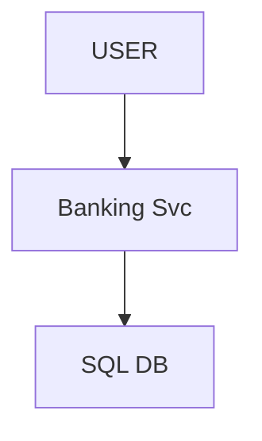
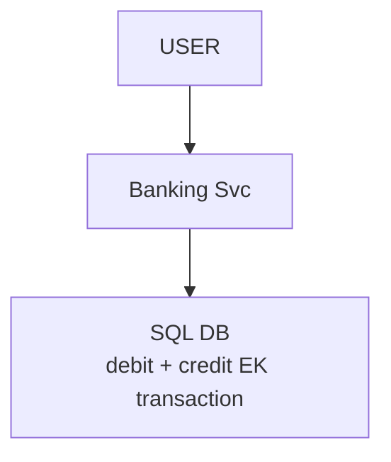
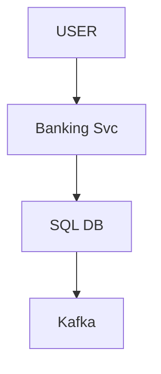
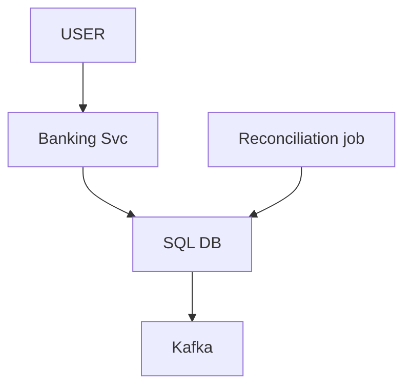
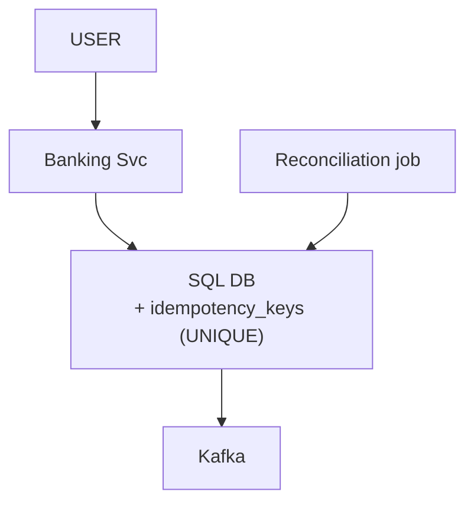
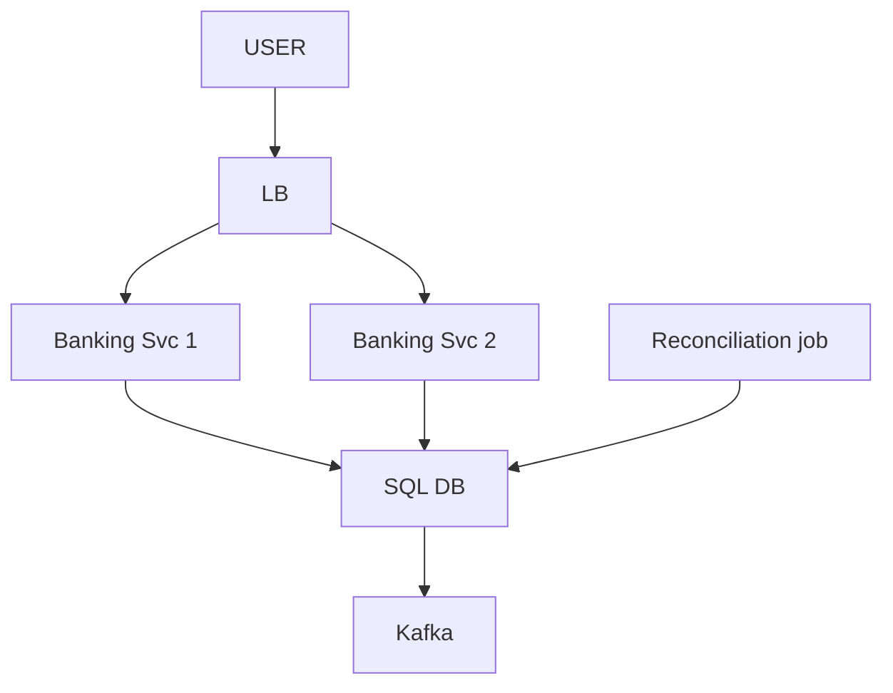
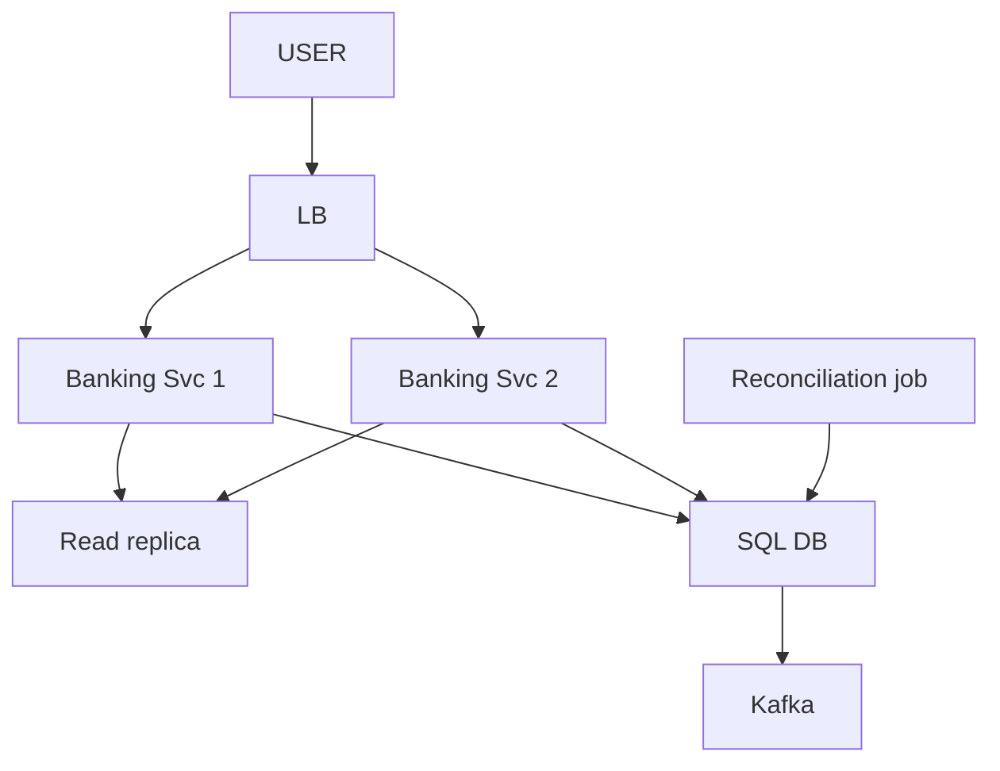
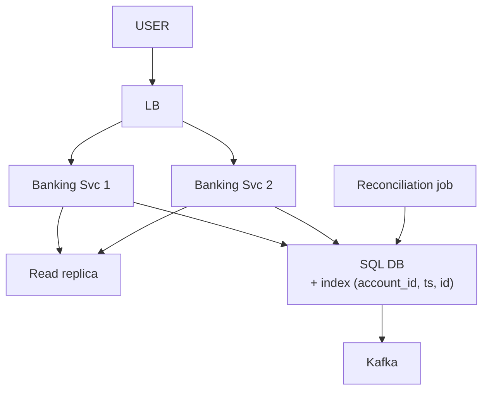
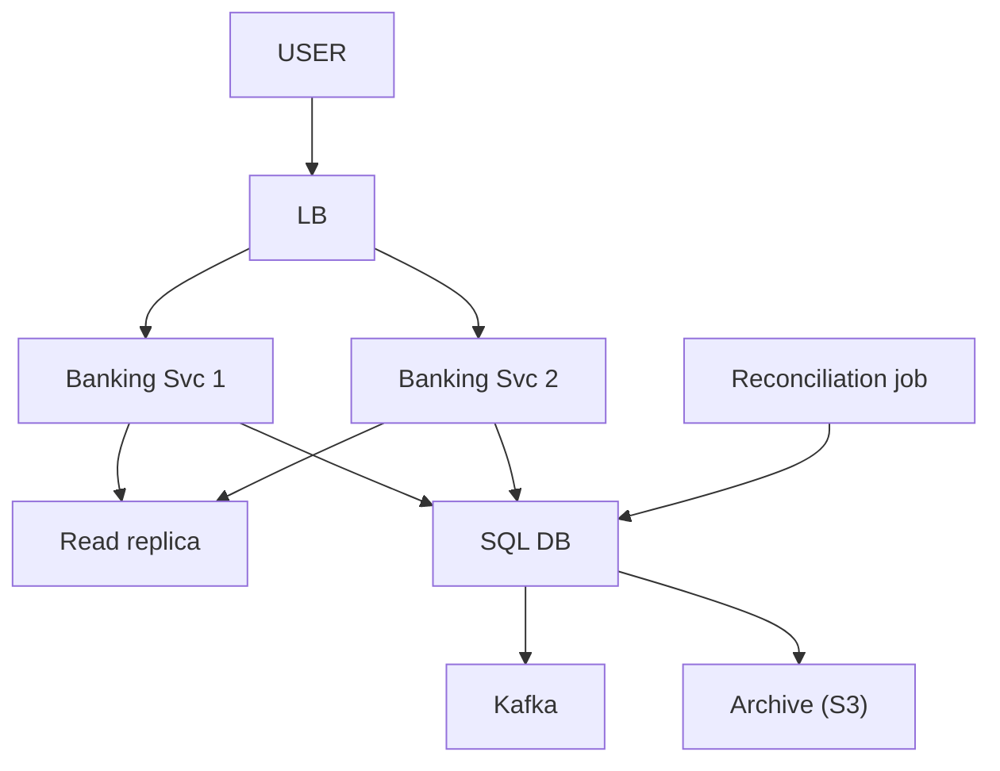

# Mini Banking System (accounts · transactions · balances)

> Ek bank ke andar accounts, un pe paisa daalo / nikaalo / bhejo, aur balance dikhao.
> Is design ka dil: **ledger SACH hai, balance sirf NATEEJA** + paisa na bane na mare.
> KYUN YE DESIGN: candidates report karte: payment flow · transaction ledger · ATM · do account ke beech
> internal transfer. JP ka sabse sambhavit HLD.
> (detail: `JP_INTERVIEW_INTEL.md` section 0e)

```
PAANCH CHEEZ JINPE YE ROUND TAY HOTA (source: "ye interview INHI se tay hote hain"):
   IDEMPOTENCY · TRANSACTIONS · QUEUES · RECONCILIATION · AUDIT
   + ACID vs eventual (partition me CORRECTNESS chuno, availability ki keemat pe)
   + core ledger ke liye RELATIONAL DB preferred, NoSQL nahi
```

---

## TASVEER (ByteByteGo / Alex Xu · CC BY-NC-ND 4.0)


Source: [Read Replica Pattern](https://bytebytego.com/guides/read-replica-pattern/)
(dikkat 7 — transfer ke baad purana balance = replica lag; ilaaj: turant wala read PRIMARY se)

---

## SHURU — poocho + numbers

```
POOCHO:  "Bahut bada hai — use-cases baandh lete hain. Ek hi bank ke andar, ya doosre bank ko bhi?"
         ("let's discuss use cases first" — scope pehle,
          warna interviewer jitna bada system chaahe sar pe daal dega)

FR:      user ke ek / kai ACCOUNT · DEPOSIT · WITHDRAW · TRANSFER A -> B (DONO isi bank) · BALANCE · HISTORY
         ★ "dono isi bank" — ye ek shabd poora design badalta (dikkat 1)
         bahar: doosra bank · loan · interest · card · KYC
NFR:     CORRECTNESS sabse upar (paisa na GUM, na BANE, hisaab har waqt barabar) · har paisa TRACEABLE (audit)
         retry pe DOBARA nahi (idempotent) · balance dekhna TEZ (sabse hot read)

NUMBERS: 5M account · 10M txn / din -> 10^7 / 86400 ~ 120 write / sec · read >> write (balance check zyada)
         120 / sec = ek theek-thaak Postgres box ka DAS-VA hissa -> SHARDING KI ZAROORAT NAHI, primary + replica kaafi

DATA SE TEEN SAWAAL (jawab dikkat me):
   1. transfer me DO row badalti -> dono ya koi nahi, kaun sambhalega?   (dikkat 1)
   2. ek account pe do transfer ek saath -> kaun rokega?                 (dikkat 5)
   3. balance -ve na ho -> niyam kahan likha?                            (dikkat 5)
```

---

## DABBA 0 — sabse simple

```
SOLUTION: Banking Service (business logic) -> SQL DB · jaan-boojh ke seedha
```


---

## DIKKAT 1 — transfer ke beech system gira: A ka -500 hua, B ka +500 nahi

```
DIKKAT:   transfer ke beech system gira: A se 500 kat gaye, B ko mile nahi -> paisa gayab.

SOLUTION: (1) Dono account EK DB me -> EK local transaction (@Transactional): debit + credit dono commit,
              ya dono rollback. Aadha ho hi nahi sakta.
          (2) DB = RELATIONAL (Postgres / MySQL): transaction + constraints native. NoSQL me txn seemit.
          ★ Ek DB me SAGA / queue mat ghusao -> debit aur credit alag ho jaate, dikkat khud ban jaati.
            SAGA sirf tab: alag service / alag DB / doosra bank (PENDING + undo khud likhna padta).

NAYA:     koi dabba nahi — DB transaction
```

```
BOARD PE: BEGIN;
            UPDATE accounts SET balance = balance - 500 WHERE id = A;
            UPDATE accounts SET balance = balance + 500 WHERE id = B;
          COMMIT;

POOCHEGA: "What if the server crashes in the middle of a transfer?"
BOL:      "Both accounts are in one database, so the debit and credit are one local transaction — it commits
           fully or rolls back. A saga only comes in when the two sides belong to different services or banks."

POOCHEGA: "Consistency or availability — which do you pick?"
BOL:      "Transfer and balance are CP — I'd rather reject than give a wrong balance. SMS, statements and
           analytics after the commit are AP; a couple of seconds late is fine."

AGLA SAWAAL (tere jawab se):
  "Crash pe DB ko kaise pata kya wapas karna hai?"
   -> DB pehle WAL me likhta ("A -500, B +500, COMMIT"). Uthte hi WAL padhta: COMMIT wala txn poora,
      bina COMMIT wala undo -> aadha kabhi nahi
  "A aur B alag bank me?"
   -> tab ek txn nahi -> PENDING + SAGA / reconciliation (payment wala raasta)
```

---

## DIKKAT 2 — regulator: "paisa kahan se aaya, kahan gaya?" + transfer ke baad SMS / fraud / statement

```
DIKKAT:   (1) regulator: "paisa kahan se aaya, kahan gaya?"
          (2) transfer ke baad SMS / fraud / statement chahiye. Ye ruke ya gire, to transfer na ruke.

SOLUTION: (1) LEDGER = DB ki table. Har transfer ki 2 entry: A -500, B +500 (jod = 0).
              Sirf INSERT hota hai, update / delete kabhi nahi.
          (2) OUTBOX = DB ki table. Event usme likho -> commit ke BAAD relay use Kafka bhejta hai
              -> SMS / fraud / statement.

          ledger + balance + outbox = EK hi transaction me.

          ★ Kafka sirf khabar pahunchata hai. Ledger Kafka me NAHI hota.
          KYUN OUTBOX: commit ke baad seedha Kafka bhejte, aur beech me app gir jaata, to event gayab.
                       Outbox usi transaction me likha gaya hai, isliye kho nahi sakta.

NAYA:     Kafka (outbox relay ke through)

KAISE (outbox relay):
          relay har ~1 sec: SELECT * FROM outbox WHERE sent = false ORDER BY id -> Kafka (acks=all) -> sent = true
          ya CDC (Debezium): DB ka WAL padh ke outbox ki nayi row seedha Kafka me (polling ka bojh nahi)
          relay 'sent' likhne se pehle gira -> event dobara -> consumers eventId se idempotent
```

```
BOARD PE: A -500, B +500 -> jod = 0
          commit -> outbox row -> relay -> Kafka (acks=all) -> SMS / fraud / statement · fail -> DLQ

POOCHEGA: "How do you make sure the SMS / fraud event is never lost?"
BOL:      "The event is written to an outbox table in the same transaction as the transfer, and a relay
           publishes it to Kafka with acks=all. Consumers are idempotent on event id and failures go to a DLQ."

AGLA SAWAAL (tere jawab se):
  "SMS ka kram (pehle debit SMS, phir credit)?"
   -> Kafka key = account_id -> ek account ke event ek partition me kram se
  "Outbox table bhar jaayegi?"
   -> sent rows roz saaf ya partition drop
  "Ledger Kafka me pehle likha, phir DB txn rollback (balance kam tha) -> ledger kya bolega?"
   -> isiliye ledger Kafka me NAHI, DB ki table me, usi txn me (rollback = ledger entry bhi gayab).
      Kafka + DB ek txn me ho hi nahi sakte (do alag system) -> Kafka sirf commit ke BAAD, outbox se.
      BOL pehli line me hi: "ledger is a table in the same DB transaction; Kafka only gets the event after commit"
```

---

## DIKKAT 3 — balance aata kahan se? (is design ka ASLI sawaal)

```
DIKKAT:   balance kahan se? (a) balance column: padhna sasta, par galat bhi ho sakta.
          (b) ledger ki saari entries ka jod: hamesha sach, par har baar hazaaron row jodna dheema.

SOLUTION: (1) DONO rakho: ledger = sach, balance column = uska joda hua nateeja (cache).
          (2) Ledger entry + balance update = EK hi transaction -> dono kabhi alag nahi hote.
          (3) RECONCILIATION (raat ko): har account ka ledger jod vs balance. Farak = ALERT, LEDGER jeetega.
              Chupchap theek mat karo, pehle KYUN dhoondo (bug abhi zinda hai).

NAYA:     Reconciliation job (raat ko ledger ka jod aur balance milaane wala)
```

```
BOARD PE: 10M / din -> 3 saal ~11 arab txn = ~22 arab row · purana account 5,000-50,000 entry
          BEGIN;
            INSERT INTO ledger_entries (...)   -- A: -500
            INSERT INTO ledger_entries (...)   -- B: +500
            UPDATE accounts SET balance = balance - 500 WHERE id = A;
            UPDATE accounts SET balance = balance + 500 WHERE id = B;
          COMMIT;

POOCHEGA: "How do you know the system is working?"
BOL:      "Ledger is the source of truth and balance is its derived cache; I write both in one transaction, so
           they never drift. Reads hit the balance — one row. A nightly reconciliation compares them, and on a
           mismatch the ledger wins. Plus p99, error rate, queue lag, DB connections with alerts, and a trace id
           per transfer."

AGLA SAWAAL (tere jawab se):
  "Reconciliation me farak mila, kya karoge?"
   -> alert + us account ko ruk ke dekho (freeze?), KYUN farak (bug) dhoondho, phir ledger se balance theek
  "~22 arab row (11 arab txn) pe raat ka SUM har account ka?"
   -> snapshot + sirf aaj ki entries jodo (DIKKAT 9 wala snapshot), poora nahi
```

---

## DIKKAT 4 — do baar tap / client retry -> Rs. 1000 kat gaye

```
DIKKAT:   do baar tap / client retry -> ek transfer do baar, paisa do baar kata.

SOLUTION: (1) IDEMPOTENCY KEY har transfer ke saath. Key pehle dekhi -> purana result. Nahi -> kaam + record.
          (2) Key pe DB UNIQUE constraint -> insert khud lock jaisa, do server pe bhi ek hi jeetega.
              App me "check phir insert" likha = race.
          ★ @Transactional = "aadha nahi hoga". Idempotency = "dobara nahi hoga". Dono chahiye.
          (hands-on, 20 concurrent same key: payment design, dikkat 2)

NAYA:     koi dabba nahi — DB me idempotency_keys (UNIQUE)
```

```
AGLA SAWAAL (tere jawab se):
  "Same key, par body alag (amount 500 ki jagah 5000)?"
   -> key ke saath request ka hash bhi rakho -> mismatch = 422 error, purana result nahi
  "Key table hamesha badhegi?"
   -> 24-48 ghante baad saaf (retry window ke baad kaam ki nahi)
```

---

## DIKKAT 5 — ek hi account pe DO transfer ek saath

```
DIKKAT:   ek hi account pe do transfer ek saath.

SOLUTION: (1) balance = balance - 500 DB ke andar hota -> row lock, dono line me -> lost update nahi.
              (Race tab hoti jab app padhe, jode, phir likhe.)
          (2) -ve balance ka check DB me: ... WHERE balance >= 500 (0 row = reject).
              App me check kiya to dono transfer purana balance dekh lete.
              Niyam code me nahi DB me: raaste kai (API / batch / manual), DB ek.
          (3) DEADLOCK (A->B aur B->A ek saath): lock hamesha tay kram me lo (chhoti account id pehle).

NAYA:     koi dabba nahi
```

```
BOARD PE: A ke paas 300, 200-200 ek saath, check app me -> dono 300 dekhe -> -100
          UPDATE accounts SET balance = balance - 200 WHERE id = A AND balance >= 200;  (0 row = REJECT)
          Txn1 A->B (A lock, B ka intezaar) · Txn2 B->A (B lock, A ka) -> MySQL 1213 (09_DATABASE/08_deadlock.md)

POOCHEGA: "Two transfers hit the same account at the same time — what happens?"
DHYAAN:   2 user ek cheez = atomic / lock · 1 user ka retry = idempotency
BOL:      "Concurrency doesn't need extra locking — the UPDATE does the math inside the database, so there's no
           lost update. Two things matter: the balance check lives in the database, WHERE balance >= amount, and
           locks are always taken in a fixed order so transfers can't deadlock."

AGLA SAWAAL (tere jawab se):
  "WHERE balance >= 200 ne 0 row diya, user ko kya?"
   -> 'insufficient balance' (422), aur txn rollback (credit wala UPDATE bhi nahi)
  "Deadlock fir bhi aaya (kram ke bawajood)?"
   -> DB victim ko rollback karta -> app chhota retry (idempotent key ke saath)
```

---

## DIKKAT 6 — salary day: ek Banking Svc bhara, wahi gira to bank band

```
DIKKAT:   salary day: ek Banking service bhar gayi, aur wahi giri to bank band.

SOLUTION: (1) Kai Banking service (stateless) + aage LB. Health check fail = pool se bahar.
          (2) DB primary gira -> SYNC (ya semi-sync) replica promote, alag AZ me.
              Async hoti to aakhri transfer kho sakta.

NAYA:     LB
BADLA:    Banking Svc ek se DO — bojh bat gaya, ek gire to doosra chale (asal me zaroorat jitne, diagram me 2)

KAISE (failover kaun karta):
          Patroni (Postgres) / RDS Multi-AZ: health check primary pe -> mara -> sync replica promote
          -> app jis DB address (DNS / endpoint) pe likhta wo naye primary pe point -> ~30-60 sec me wapas
          SYNC kyun: commit tabhi jab replica ne bhi likha -> promote hone wale ke paas har confirmed transfer
```

```
POOCHEGA: "What happens if a server or the DB goes down?"
BOL:      "Services are stateless behind a load balancer with health checks. The primary has a synchronous
           replica in another zone that's promoted, so a confirmed transfer is never lost."

AGLA SAWAAL (tere jawab se):
  "Sync replica = har transfer dheema?"
   -> haan, thoda (ek network hop). Paisa me ye keemat theek; async me aakhri transfer kho sakta
  "Failover ke 30 sec me transfer?"
   -> error -> client retry (same idempotency key) -> double nahi
```

---

## DIKKAT 7 — sab balance / history PRIMARY pe padh rahe, transfer dheeme

```
DIKKAT:   sab balance / history primary se padh rahe -> transfer dheeme (read >> write, sab ek box pe).

SOLUTION: (1) READ REPLICA: balance / history replica se, write primary pe.
          ★ JAAL: transfer ke turant baad balance replica se padha -> PURANA dikha (replica peeche)
            -> user sochega paisa gaya hi nahi, dobara bhejega.
          (2) READ-YOUR-OWN-WRITES: jisne abhi likha, uska balance PRIMARY se.

NAYA:     Read replica

KAISE (replica peeche kyun + read-your-own-writes):
          primary WAL ko replica pe stream karta (async) -> replica thodi peeche (~ms se sec)
          app ko kaise pata 'ye user abhi likh chuka': session / token me 'last_write_at'
          -> uske N sec (jaise 5) tak us user ke reads PRIMARY se, baaki replica se
          (ya replica ka WAL position >= user ke write ka position tabhi replica se)
```

```
BOARD PE: replica ~200 ms peeche: primary 4000, replica 5000

POOCHEGA: "I transferred money but my balance still shows the old value. Why?"
BOL:      "Most likely replica lag: the write went to the primary, the read hit a replica that hadn't caught up.
           For balance I read from the primary, at least for the user who just wrote. If it were a failover
           losing writes, sync replication fixes that."

AGLA SAWAAL (tere jawab se):
  "Doosre device se khola (session alag)?"
   -> last_write_at user ke account pe (Redis) rakho, device pe nahi
  "Replica bahut peeche (minute)?"
   -> lag metric pe alert; had paar -> us replica ko read pool se hatao
```

---

## DIKKAT 8 — ~22 arab row (11 arab txn) pe history ka page

```
DIKKAT:   arabon rows me history ka page, OFFSET se. DB skip nahi karta, PADH ke PHENKTA hai
          -> page 5000 pe lakh row padh ke 20 deta. Beech me nayi entry aayi -> sab khisak gaya, entry dobara.

SOLUTION: (1) CURSOR / KEYSET pagination: pichhle page ki aakhri entry (ts, id) yaad rakho, agla page
              "usse purana". Index se seedha wahan -> page 1 ho ya 5000, kharcha wahi, kuch nahi khiskta.
          (2) Index (account_id, ts DESC, id DESC) zaroori.
          Keemat: "page 500 pe jao" nahi, sirf agla / pichhla (jaise YouTube scroll). Statement me theek.

NAYA:     koi dabba nahi — query + index
```

```
BOARD PE: SELECT * FROM ledger_entries WHERE account_id = ? ORDER BY ts DESC LIMIT 20 OFFSET 100000;
            -> 1,00,020 row padhi, 20 di
          page 1: ... ORDER BY ts DESC, id DESC LIMIT 20;   aakhri (ts, id) = cursor
          page 2: ... AND (ts, id) < (:last_ts, :last_id) ORDER BY ts DESC, id DESC LIMIT 20;

AGLA SAWAAL (tere jawab se):
  "Same ts pe do entry, cursor me koi chhoot jaaye?"
   -> isliye (ts, id) dono cursor me -> id tie todti, kuch nahi chhoota
  "Cursor client ko kaise doge?"
   -> (ts, id) ko base64 string bana ke 'next_cursor' -> client agli baar bheje
```

---

## DIKKAT 9 — 5 saal purana data, sab ek table me

```
DIKKAT:   5 saal ka data ek table me. Roz sirf pichhle kuch mahine dekhte, par har query / index / backup
          arabon rows ke saath. Bank me DELETE nahi kar sakte (kanoon saalon tak rakhwata).

SOLUTION: (1) Table ko MAHINE-MAHINE partition. Purana partition DETACH (turant) -> cold storage
              (S3 Parquet), zaroorat pe query / restore. DELETE nahi (crore rows = ghanton lock).
              "Pichhle 3 mahine" ki query baaki partitions chhooti hi nahi.
          (2) ★ Archive ke baad reconciliation ledger adhoora dekhega -> har account mismatch.
              Ilaaj: OPENING BALANCE SNAPSHOT, har period ke end ka (kabhi archive nahi).
              Reconciliation = snapshot + uske baad ki entries. (Bank statement ke upar "opening balance" isi wajah se.)
          Archive != sharding: archive size ghatata, shard likhne ka load baant-ta.

NAYA:     Archive (S3)
```

```
BOARD PE: ledger_2026_07, ledger_2026_08 ... -> DETACH (metadata, turant) -> cold storage -> drop
          account_balance_snapshot (account_id, period_end, balance) · 31-Mar-2023 A = 45,000

POOCHEGA: "Data keeps growing — what happens in 3 years?"
BOL:      "Partition the ledger by month and detach closed months to cold storage — nothing is ever deleted. An
           opening-balance snapshot per period keeps reconciliation correct after archiving."

AGLA SAWAAL (tere jawab se):
  "Regulator ne 2021 ka statement maanga?"
   -> S3 ke Parquet pe Athena query ya us mahine ka partition restore
  "Archive file badal na sake (audit)?"
   -> S3 Object Lock (WORM) -> likhi file na delete na badle, saalon tak
```

---

## 10x SCALE — har dabba alag

```
KRAM:  sasta pehle, SHARD aakhir
  1. READ REPLICA (pehla kadam, read >> write) · keemat lag -> apna abhi-kiya txn PRIMARY se
  2. PARTITION by month (archive + query dono)
  3. SHARD by account_id = AAKHRI, keemat badi: A shard-1, B shard-2 -> transfer LOCAL txn NAHI -> wapas SAGA / 2PC
     -> dikkat 1 ki saari problem khud wapas · humare 120 / sec pe sawaal hi nahi; pehle vertical + replica
  WRITES se DB maar kha raha (replica ke baad bhi): cache / index sirf READ ilaaj (har naya index INSERT dheema)
     -> SHARD by account_id (ek account ke saare txn ek shard) · non-critical writes (statement, SMS) queue pe
  BADI TABLE (size) -> month partition + archive (DELETE nahi)
  ✗ "badi transaction chhoti karo" = galat: debit + credit EK txn me hi
  replica sirf READ baantti, write ke liye SHARD · country / date = bura key (skew)

POOCHEGA: "Replicas are in, but writes are still killing the DB. What now?"
BOL:      "Replicas only spread reads, and caching or extra indexes help reads, not writes; extra indexes actually
           slow inserts. For write volume at this scale I'd shard by account id, so each account's transactions live
           on one shard, and move non-critical writes like statements to a queue. For table size, partition by month
           and archive closed months to cold storage; nothing is ever deleted."
POOCHEGA: "How would you scale this to 10x?"      -> pehle jo toote (reads -> replica, size -> partition, writes -> shard)
POOCHEGA: "What's the single point of failure?"   -> DB primary (sync replica), Banking Svc (LB + N)
```

---

## POOCHE TO (deep-dive)

```
API:      GET /accounts/{id}/balance · GET /accounts/{id}/transactions?cursor=...&limit=20
          POST /transfers { from, to, amount } · POST /accounts/{id}/deposit { amount } · POST /accounts/{id}/withdraw { amount }
          har POST me Idempotency-Key header

DB:       ledger_entries (SACH, append-only, month partition) · accounts.balance (CACHE, derived)
          idempotency_keys (UNIQUE) · outbox · account_balance_snapshot (period_end ka balance)
```

---

## AAKHRI DABBA + WRAP

```
LB · Banking Svc = stateless, idempotency check · SQL DB = EK local txn (ledger + balance + key + outbox)
Kafka = commit ke BAAD (SMS / fraud / analytics / statement) · Read replica = balance / history (apna txn primary se)
Reconciliation = snapshot + live entries vs balance -> ALERT · Archive (S3) = band mahine, delete kabhi nahi
```

```
beech me crash        -> ek local transaction (@Transactional), ek DB me SAGA nahi
dobara tap / retry    -> Idempotency-Key + DB UNIQUE
paisa kahan gaya      -> append-only LEDGER, double-entry (jod zero)
balance tez           -> balance = derived CACHE, ledger ke SAATH usi txn
cache vs sach         -> raat ka RECONCILIATION, ledger jeetega
-ve balance           -> check DB me (WHERE balance >= x / CHECK)
ulte kram ke transfer -> lock TAY KRAM (id sort) -> deadlock nahi
11 arab history       -> CURSOR + index (account_id, ts DESC, id DESC)
purana data           -> month PARTITION -> DETACH -> cold storage, DELETE kabhi nahi
archive ke baad       -> OPENING BALANCE snapshot
load badha            -> replica -> partition -> (aakhir) shard
```
```
BOL: "Everything for a transfer — both ledger entries, both balance updates, the idempotency key and an outbox
      event — commits in one local transaction in a relational database, so money is never lost or created.
      The ledger is the truth and balance is a cache of it; a nightly reconciliation checks them. Balance checks
      and lock ordering live in the database. Reads go to a replica, history uses cursor pagination, old months
      are archived with opening-balance snapshots, and side effects go out through Kafka after the commit."
```

ARCHETYPE C · CONCEPTS: [db-what-when](../../FOUNDATIONS/09_databases_what_when.md) · [CAP](../../FOUNDATIONS/08_cap_theorem.md) · [saga/ms-comm](../../FOUNDATIONS/10_ms_communication.md) · [caching](../../FOUNDATIONS/04_caching.md) · saath: [payment-system](../06_payment_system/06_payment_system.md) (iska bada bhai) · [stock-broker](../05_stock_broker_trading/05_stock_broker_trading.md) · [← MASTER SHEET](../../00_MASTER_SHEET.md)
