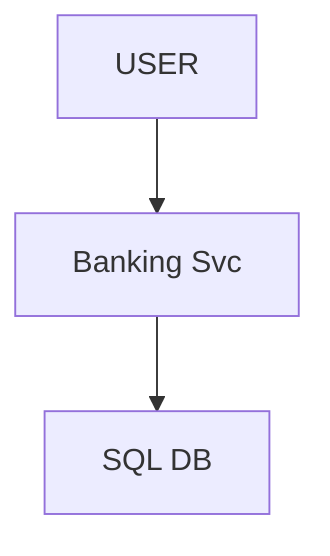
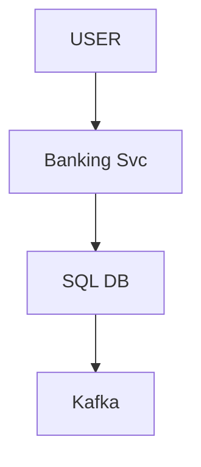
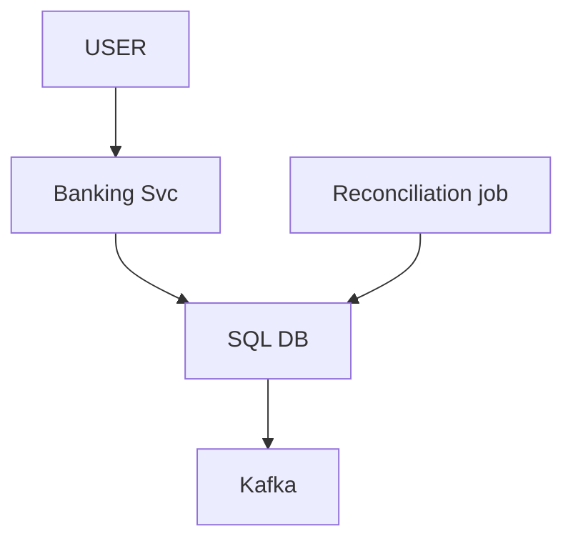
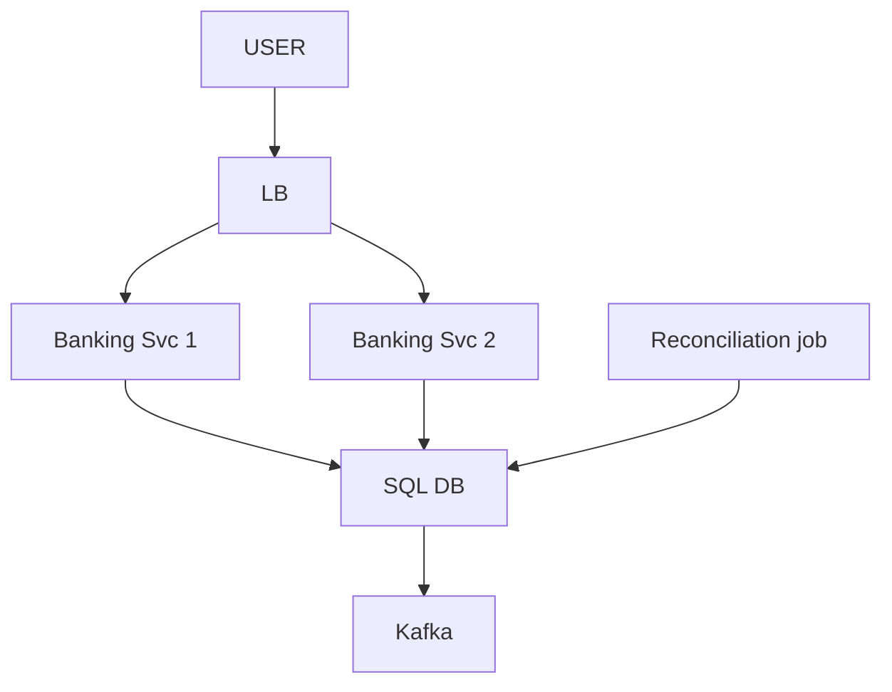
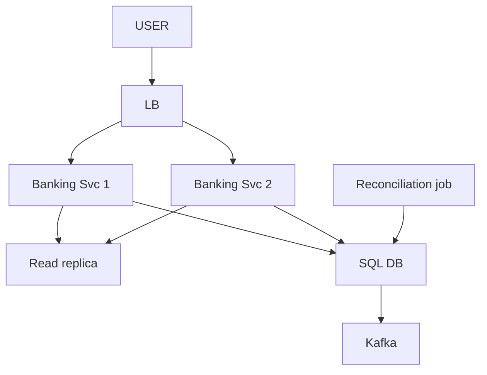
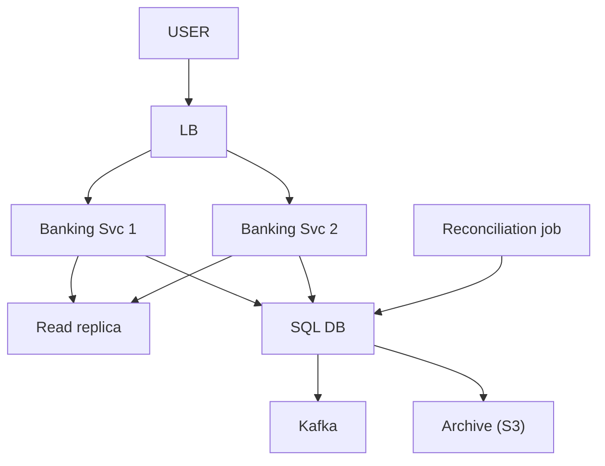

# Mini Banking System (accounts · transactions · balances)

> Ek bank ke andar accounts, un pe paisa daalo / nikaalo / bhejo, aur balance dikhao.
> Is design ka dil: **ledger SACH hai, balance sirf NATEEJA** + paisa na bane na mare.
> KYUN YE DESIGN (19-Sep): Arpan ek reel se laaya, net pe verify kiya — candidates report karte: payment flow · transaction
> ledger · ATM · do account ke beech internal transfer. JP ka sabse sambhavit HLD, Arpan ki sabse majboot zameen.
> (detail: `JP_INTERVIEW_INTEL.md` section 0e)

```
PAANCH CHEEZ JINPE YE ROUND TAY HOTA (source: "ye interview INHI se tay hote hain"):
   IDEMPOTENCY · TRANSACTIONS · QUEUES · RECONCILIATION · AUDIT
   + ACID vs eventual (partition me CORRECTNESS chuno, availability ki keemat pe)
   + core ledger ke liye RELATIONAL DB preferred, NoSQL nahi
```

---

## TASVEER (ByteByteGo / Alex Xu · CC BY-NC-ND 4.0)


Source: [Read Replica Pattern](https://bytebytego.com/guides/read-replica-pattern/)
(dikkat 7 — transfer ke baad purana balance = replica lag; ilaaj: turant wala read PRIMARY se)

---

## SHURU — poocho + numbers

```
POOCHO:  "Bahut bada hai — use-cases baandh lete hain. Ek hi bank ke andar, ya doosre bank ko bhi?"
         (Arpan ne asli mock me sabse pehle yahi poocha: "let's discuss use cases first" — scope pehle,
          warna interviewer jitna bada system chaahe sar pe daal dega)

FR:      user ke ek / kai ACCOUNT · DEPOSIT · WITHDRAW · TRANSFER A -> B (DONO isi bank) · BALANCE · HISTORY
         ★ "dono isi bank" — ye ek shabd poora design badalta (dikkat 1)
         bahar: doosra bank · loan · interest · card · KYC
NFR:     CORRECTNESS sabse upar (paisa na GUM, na BANE, hisaab har waqt barabar) · har paisa TRACEABLE (audit)
         retry pe DOBARA nahi (idempotent) · balance dekhna TEZ (sabse hot read)

NUMBERS: 5M account · 10M txn / din -> 10^7 / 86400 ~ 120 write / sec · read >> write (balance check zyada)
         120 / sec = ek theek-thaak Postgres box ka DAS-VA hissa -> SHARDING KI ZAROORAT NAHI, primary + replica kaafi
         (Arpan khud: "mere number itne bade nahi, normal DB chalega" — SAHI call; log bina zaroorat shard ghusa dete)

DATA SE TEEN SAWAAL (jawab dikkat me):
   1. transfer me DO row badalti -> dono ya koi nahi, kaun sambhalega?   (dikkat 1)
   2. ek account pe do transfer ek saath -> kaun rokega?                 (dikkat 5)
   3. balance -ve na ho -> niyam kahan likha?                            (dikkat 5)
```

---

## DABBA 0 — sabse simple

```
SOLUTION: Banking Service (business logic) -> SQL DB · jaan-boojh ke seedha
```


---

## DIKKAT 1 — transfer ke beech system gira: A ka -500 hua, B ka +500 nahi

```
DIKKAT:   paisa gayab

SOLUTION: ★ ARPAN KA NIYAM (is design ki reedh): "ek DB me -> @Transactional. cross-service -> SAGA."
          dono account EK DB me -> EK LOCAL TRANSACTION, bas:
            BEGIN;
              UPDATE accounts SET balance = balance - 500 WHERE id = A;
              UPDATE accounts SET balance = balance + 500 WHERE id = B;
            COMMIT;
          beech me girne ki jagah hi nahi
          ★ SABSE BADI GALTI: ek DB me bhi SAGA / queue / event ghusa dena -> debit aur credit alag
            -> "kata phir fail?" "kata, consumer down?" = dikkat DESIGN ne banayi, problem ne nahi
          SAGA kab: do side ALAG maalik (alag service / DB / DOOSRA BANK) -> compensating undo
                    (scope bahar; poora = payment dikkat 5) · bahar call -> PENDING pehle + webhook + reconciliation
          DB FAISLA: RELATIONAL (Postgres / Oracle / MySQL) — BEGIN..COMMIT = ACID ka wada
                    NoSQL me kamzor / seemit (Mongo 4.0+, DynamoDB TransactWriteItems hai, par constraints + joins
                    ke saath relational native) -> wahan app sambhalta = bina zaroorat SAGA
                    (source-confirmed: JP core ledger ke liye relational) -> SAWAAL 1 band

NAYA:     koi dabba nahi — DB transaction
```
```
POOCHEGA: "What if the server crashes in the middle of a transfer?"
BOL:      "Both accounts are in one database, so the debit and credit are one local transaction — it commits
           fully or rolls back. A saga only comes in when the two sides belong to different services or banks."

POOCHEGA: "Consistency or availability — which do you pick?"
BOL:      "Transfer and balance are CP — I'd rather reject than give a wrong balance. SMS, statements and
           analytics after the commit are AP; a couple of seconds late is fine."
```

---

## DIKKAT 2 — regulator: "paisa kahan se aaya, kahan gaya?" + transfer ke baad SMS / fraud / statement

```
DIKKAT:   audit chahiye · aur baaki kaam ke liye transfer ruke nahi, unme koi gire to transfer na gire

SOLUTION: ★ ARPAN NE LOG aur LEDGER alag bola (bahut kam log karte):
             LOG    = DEBUGGING ("kya chal raha"), rotate / delete hota, farak nahi
             LEDGER = SACH, APPEND-ONLY (kisne, kab, kitna, kyun), mitega nahi, badlega nahi
          DOUBLE-ENTRY: har txn = DO entry, jod hamesha ZERO (A -500, B +500) -> paisa sirf HILTA
                        poore ledger ka jod = bank ka kul paisa, mismatch turant pakda
          Arpan ka KAFKA jod: Kafka bhi append-only, padhne se mitta nahi — shakal sahi
          ★ HADD: LEDGER KA GHAR = DB, Kafka NAHI: (1) ledger pe QUERY ("pichhle mahine ka hisaab")
                  (2) ledger USI txn me likhna jisme paisa hila — Kafka us txn ka hissa nahi
          KAFKA KA KAAM: COMMIT ke BAAD khabar bahar -> notification · fraud-check · analytics · statement (eventual chalta)
          ★ JAAL: commit hua, Kafka se pehle app gira -> event GAYAB -> OUTBOX: event USI txn me outbox table, relay bheje
                  relay "sent" se pehle gira -> dobara jaayega -> consumers eventId se idempotent · acks=all · fail -> DLQ

NAYA:     Kafka (outbox relay ke through)
```

```
POOCHEGA: "How do you make sure the SMS / fraud event is never lost?"
BOL:      "The event is written to an outbox table in the same transaction as the transfer, and a relay
           publishes it to Kafka with acks=all. Consumers are idempotent on event id and failures go to a DLQ."
```

---

## DIKKAT 3 — balance aata kahan se? (is design ka ASLI sawaal)

```
DIKKAT:   (a) accounts.balance COLUMN: padhna sasta, par likha hua number (galat / purana / bug)
          (b) SUM(ledger entries): hamesha sach, par 10M / din -> 3 saal ~11 ARAB txn = ~22 ARAB row,
              purana account 5,000-50,000 entry, balance sabse zyada dekha jaata -> har baar 20,000 jodna = NAHI
          Arpan ne (b) chuna — "ledger main source of truth, DB dhoka de sakta" — soch SAHI

SOLUTION: DONO RAKHO (19-Sep yahan seekha): ledger_entries = SACH · accounts.balance = CACHE (pehle se joda nateeja)
          ★ TRICK — dono EK HI TRANSACTION:
            BEGIN;
              INSERT INTO ledger_entries (txn_id, account_id, amount, type, ts);   -- A: -500
              INSERT INTO ledger_entries (txn_id, account_id, amount, type, ts);   -- B: +500
              UPDATE accounts SET balance = balance - 500 WHERE id = A;
              UPDATE accounts SET balance = balance + 500 WHERE id = B;
            COMMIT;
          balance = 1 ROW · ek commit me = alag ho hi nahi sakte ("cache stale" yahan hai hi nahi)
          kabhi farak (bug, manual edit, migration) -> LEDGER JEETEGA, balance ledger se dobara
          isliye yahan QUEUE NAHI — "baad me" = alag ho jaayenge
          RECONCILIATION (source ka grading point): raat ko har account SUM(ledger) vs balance -> farak = ALERT
          ★ chupchap theek MAT karo — pehle KYUN (bug abhi zinda)

NAYA:     Reconciliation job
```

```
POOCHEGA: "How do you know the system is working?"
BOL:      "Ledger is the source of truth and balance is its derived cache; I write both in one transaction, so
           they never drift. Reads hit the balance — one row. A nightly reconciliation compares them, and on a
           mismatch the ledger wins. Plus p99, error rate, queue lag, DB connections with alerts, and a trace id
           per transfer."
```

---

## DIKKAT 4 — do baar tap / client retry -> Rs. 1000 kat gaye

```
DIKKAT:   ek transfer do baar (Arpan ne mock me ye #1 pain point khud pakda)

SOLUTION: IDEMPOTENCY KEY — har POST me Idempotency-Key · pehle dekhi -> purana result · nahi -> kaam + record
          SABSE ACCHA: DB UNIQUE CONSTRAINT us key pe (insert khud lock, do me se ek jeete;
          app ka "check phir insert" = race)
          @Transactional idempotency ki jagah NAHI: txn = "aadha nahi hoga" · idempotency = "dobara nahi hoga" — dono chahiye
          poora + hands-on (20 concurrent, same key): payment dikkat 2 + HANDS-ON

NAYA:     koi dabba nahi — DB me idempotency_keys (UNIQUE)
```

---

## DIKKAT 5 — ek hi account pe DO transfer ek saath

```
DIKKAT:   maine "locking chahiye" bola — Arpan ne kaata (19-Sep), wo SAHI tha:
          "DB atomic hai, do transaction ko ek saath modify karne hi nahi dega"
          UPDATE ... SET balance = balance - 500 -> hisaab DB khud, row LOCK ke saath -> KATAAR me
          LOST UPDATE ho hi nahi sakta · race tab jab app PADHE -> JODE -> LIKHE (bal = read; bal -= 500; write)
          SANSHODHAN: "concurrency ke liye locking chahiye" = GALAT (file me tha, Arpan ne hatwaya)

SOLUTION: do chhoti par asli cheez bachti:
          (a) balance >= 0 ka CHECK kahan? A ke paas 300, 200-200 ek saath, check APP me -> dono 300 dekhe -> -100
              -> DB se: UPDATE accounts SET balance = balance - 200 WHERE id = A AND balance >= 200;  (0 row = REJECT)
                 ya CHECK (balance >= 0) constraint
              niyam CODE me nahi DB me (API / batch / manual — raaste kai, DB ek) -> SAWAAL 3 band
          (b) DEADLOCK atomic UPDATE ke baad bhi: Txn1 A->B (A lock, B ka intezaar) · Txn2 B->A (B lock, A ka) = circular wait
              DB ek ko maarta (MySQL 1213, victim rollback) — Arpan ne LIVE dekha: 09_DATABASE/08_deadlock.md
              ilaaj: lock hamesha TAY KRAM (account id sort, chhota pehle) — kaam ulta, lock ka kram wahi

NAYA:     koi dabba nahi
```
```
POOCHEGA: "Two transfers hit the same account at the same time — what happens?"
DHYAAN:   2 user ek cheez = atomic / lock · 1 user ka retry = idempotency
BOL:      "Concurrency doesn't need extra locking — the UPDATE does the math inside the database, so there's no
           lost update. Two things matter: the balance check lives in the database, WHERE balance >= amount, and
           locks are always taken in a fixed order so transfers can't deadlock."
```

---

## DIKKAT 6 — salary day: ek Banking Svc bhara, wahi gira to bank band

```
DIKKAT:   bojh + SPOF

SOLUTION: kai Banking Svc + aage LB · STATELESS (sab DB me) · health check 2-3 fail = pool se bahar
          DB PRIMARY gira -> SYNC / semi-sync replica promote (async pe aakhri transfer kho sakta) · replica ALAG AZ

NAYA:     LB
BADLA:    Banking Svc ek se DO — bojh bat gaya, ek gire to doosra chale (asal me zaroorat jitne, diagram me 2)
```

```
POOCHEGA: "What happens if a server or the DB goes down?"
BOL:      "Services are stateless behind a load balancer with health checks. The primary has a synchronous
           replica in another zone that's promoted, so a confirmed transfer is never lost."
```

---

## DIKKAT 7 — sab balance / history PRIMARY pe padh rahe, transfer dheeme

```
DIKKAT:   read >> write, ek hi box pe

SOLUTION: READ REPLICA — balance / history replica se, write primary pe (shard abhi NAHI)
          ★ JAAL: transfer kiya, turant balance -> PURANA (replica ~200ms peeche: primary 4000, replica 5000)
                  -> user ko "paisa gaya hi nahi" -> dobara bhejega
          READ-YOUR-OWN-WRITES: jisne abhi likha uska balance PRIMARY se (balance jaisi cheez hamesha primary bhi chalega)
          doosri wajah FAILOVER (write replica tak nahi pahuncha, wahi promote) -> SYNC replication

NAYA:     Read replica
```

```
POOCHEGA: "I transferred money but my balance still shows the old value. Why?"
BOL:      "Most likely replica lag: the write went to the primary, the read hit a replica that hadn't caught up.
           For balance I read from the primary, at least for the user who just wrote. If it were a failover
           losing writes, sync replication fixes that."
```

---

## DIKKAT 8 — 11 arab row pe history ka page

```
DIKKAT:   SELECT * FROM ledger_entries WHERE account_id = ? ORDER BY ts DESC LIMIT 20 OFFSET 100000;
          Arpan ne OFFSET ka matlab sahi bola ("skip karna"); jo chhoota: DB skip KAISE karta
          -> koodta NAHI, PADHTA phir PHENKTA: 1,00,020 row ka kaam 20 dene ke liye
          page 5000 pe atakta · page 1 dekhte nayi txn aayi -> sab khiske -> page 2 pe WAHI entry DOBARA

SOLUTION: CURSOR / KEYSET — "kahan chhoda" yaad rakho:
            page 1: ... ORDER BY ts DESC, id DESC LIMIT 20;   aakhri (ts, id) = cursor client ko
            page 2: ... AND (ts, id) < (:last_ts, :last_id) ORDER BY ts DESC, id DESC LIMIT 20;
          index (account_id, ts DESC, id) pe SEEDHA koodta · page 1 ho ya 5000, kharcha wahi · kuch khiskta nahi
          ★ Arpan ka anchor: "cursor based, jaise YouTube" — page number nahi, sirf SCROLL = cursor
             (YouTube / Instagram / Twitter) · wo missing feature nahi, FAISLA (har page ek jaisa tez)
             ULTA: Google me page number kyunki top ~1000 se aage jaane nahi dete (hadd = offset chalta)
          KEEMAT: "page 500 pe jao" nahi, sirf agla / pichhla (statement me theek; admin panel me offset chalega)
          index (account_id, ts DESC, id) ke bina dono nahi chalenge — 11 arab scan

NAYA:     koi dabba nahi — query + index
```

---

## DIKKAT 9 — 5 saal purana data, sab ek table me

```
DIKKAT:   3 mahine roz dekhte, 3 saal purana saal me ek baar / regulator maange · har query, index, backup 11 arab ke saath
          Arpan: "purana hatao, archive, on-demand wapas. DELETE nahi kar sakte" — DELETE wali baat sabse zaroori,
          bank me delete hota hi nahi (kanoon saalon tak)

SOLUTION: (a) DELETE se nahi (30 crore row = table lock, txn log full, ghante)
              MAHINE-MAHINE PARTITION (ledger_2026_07, _08 ...) -> archive = partition DETACH (metadata, TURANT)
              -> file cold storage -> partition drop · DELETE = row-by-row, DETACH = poore tukde pe nishaan
              BONUS: "pichhle 3 mahine" -> baaki 33 partition chhuta hi nahi
          (b) ghar: S3 (Parquet) ya alag cold DB · on-demand Athena jaisa / restore
          (c) ★ SAATH ME TOOTEGA: reconciliation SUM(ledger) ab ADHOORA -> har account mismatch
              -> OPENING BALANCE SNAPSHOT: account_balance_snapshot (account_id, period_end, balance)
                 31-Mar-2023 A = 45,000 (kabhi archive nahi)
                 reconciliation: snapshot + uske BAAD ki live entries = aaj ka balance
              bank statement ke upar "opening balance" isi wajah se
          retention / archive != sharding (archive SIZE ghatata, shard WRITES baant-ta)

NAYA:     Archive (S3)
```

```
POOCHEGA: "Data keeps growing — what happens in 3 years?"
BOL:      "Partition the ledger by month and detach closed months to cold storage — nothing is ever deleted. An
           opening-balance snapshot per period keeps reconciliation correct after archiving."
```

---

## 10x SCALE — har dabba alag

```
Arpan: "dabba bada hua to shard + replication — wo to har design me ho gaya"
KRAM:  sasta pehle, SHARD aakhir
  1. READ REPLICA (pehla kadam, read >> write) · keemat lag -> apna abhi-kiya txn PRIMARY se
  2. PARTITION by month (archive + query dono)
  3. SHARD by account_id = AAKHRI, keemat badi: A shard-1, B shard-2 -> transfer LOCAL txn NAHI -> wapas SAGA / 2PC
     -> dikkat 1 ki saari problem khud wapas · humare 120 / sec pe sawaal hi nahi; pehle vertical + replica
  WRITES se DB maar kha raha (replica ke baad bhi): cache / index sirf READ ilaaj (har naya index INSERT dheema)
     -> SHARD by account_id (ek account ke saare txn ek shard) · non-critical writes (statement, SMS) queue pe
  BADI TABLE (size) -> month partition + archive (DELETE nahi)
  ✗ "badi transaction chhoti karo" = galat: debit + credit EK txn me hi
  replica sirf READ baantti, write ke liye SHARD · country / date = bura key (skew)

POOCHEGA: "Replicas are in, but writes are still killing the DB. What now?"
BOL:      "Replicas only spread reads, and caching or extra indexes help reads, not writes; extra indexes actually
           slow inserts. For write volume at this scale I'd shard by account id, so each account's transactions live
           on one shard, and move non-critical writes like statements to a queue. For table size, partition by month
           and archive closed months to cold storage; nothing is ever deleted."
POOCHEGA: "How would you scale this to 10x?"      -> pehle jo toote (reads -> replica, size -> partition, writes -> shard)
POOCHEGA: "What's the single point of failure?"   -> DB primary (sync replica), Banking Svc (LB + N)
```

---

## POOCHE TO (deep-dive)

```
API:      GET /accounts/{id}/balance · GET /accounts/{id}/transactions?cursor=...&limit=20
          POST /transfers { from, to, amount } · POST /accounts/{id}/deposit { amount } · POST /accounts/{id}/withdraw { amount }
          har POST me Idempotency-Key header (Arpan: "ye to aasan hai" — sahi, yahan ruko mat)

DB:       ledger_entries (SACH, append-only, month partition) · accounts.balance (CACHE, derived)
          idempotency_keys (UNIQUE) · outbox · account_balance_snapshot (period_end ka balance)
```

---

## AAKHRI DABBA + WRAP

```
LB · Banking Svc = stateless, idempotency check · SQL DB = EK local txn (ledger + balance + key + outbox)
Kafka = commit ke BAAD (SMS / fraud / analytics / statement) · Read replica = balance / history (apna txn primary se)
Reconciliation = snapshot + live entries vs balance -> ALERT · Archive (S3) = band mahine, delete kabhi nahi
```

```
beech me crash        -> ek local transaction (@Transactional), ek DB me SAGA nahi
dobara tap / retry    -> Idempotency-Key + DB UNIQUE
paisa kahan gaya      -> append-only LEDGER, double-entry (jod zero)
balance tez           -> balance = derived CACHE, ledger ke SAATH usi txn
cache vs sach         -> raat ka RECONCILIATION, ledger jeetega
-ve balance           -> check DB me (WHERE balance >= x / CHECK)
ulte kram ke transfer -> lock TAY KRAM (id sort) -> deadlock nahi
11 arab history       -> CURSOR + index (account_id, ts DESC, id)
purana data           -> month PARTITION -> DETACH -> cold storage, DELETE kabhi nahi
archive ke baad       -> OPENING BALANCE snapshot
load badha            -> replica -> partition -> (aakhir) shard
```
```
BOL: "Everything for a transfer — both ledger entries, both balance updates, the idempotency key and an outbox
      event — commits in one local transaction in a relational database, so money is never lost or created.
      The ledger is the truth and balance is a cache of it; a nightly reconciliation checks them. Balance checks
      and lock ordering live in the database. Reads go to a replica, history uses cursor pagination, old months
      are archived with opening-balance snapshots, and side effects go out through Kafka after the commit."
```

ARCHETYPE C · CONCEPTS: [db-what-when](../../FOUNDATIONS/09_databases_what_when.md) · [CAP](../../FOUNDATIONS/08_cap_theorem.md) · [saga/ms-comm](../../FOUNDATIONS/10_ms_communication.md) · [caching](../../FOUNDATIONS/04_caching.md) · saath: [payment-system](../06_payment_system/06_payment_system.md) (iska bada bhai) · [stock-broker](../05_stock_broker_trading/05_stock_broker_trading.md) · [← MASTER SHEET](../../00_MASTER_SHEET.md)
