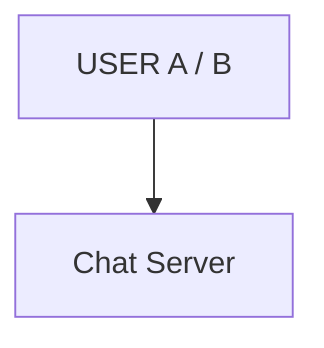
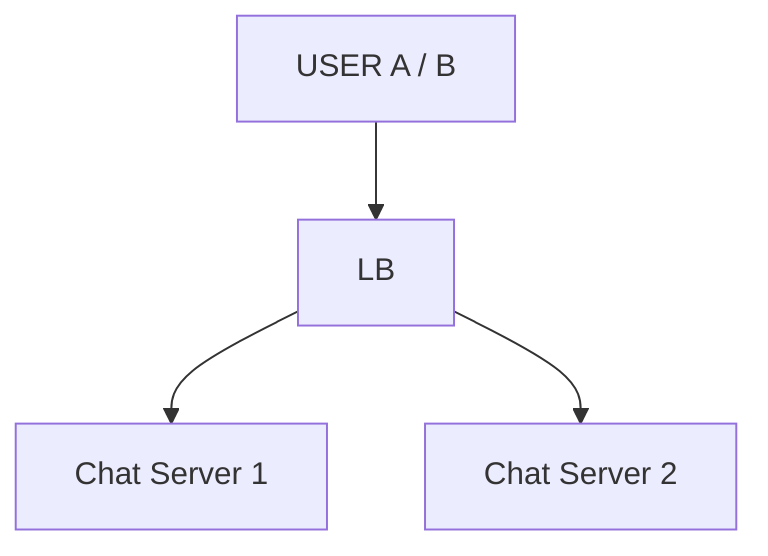
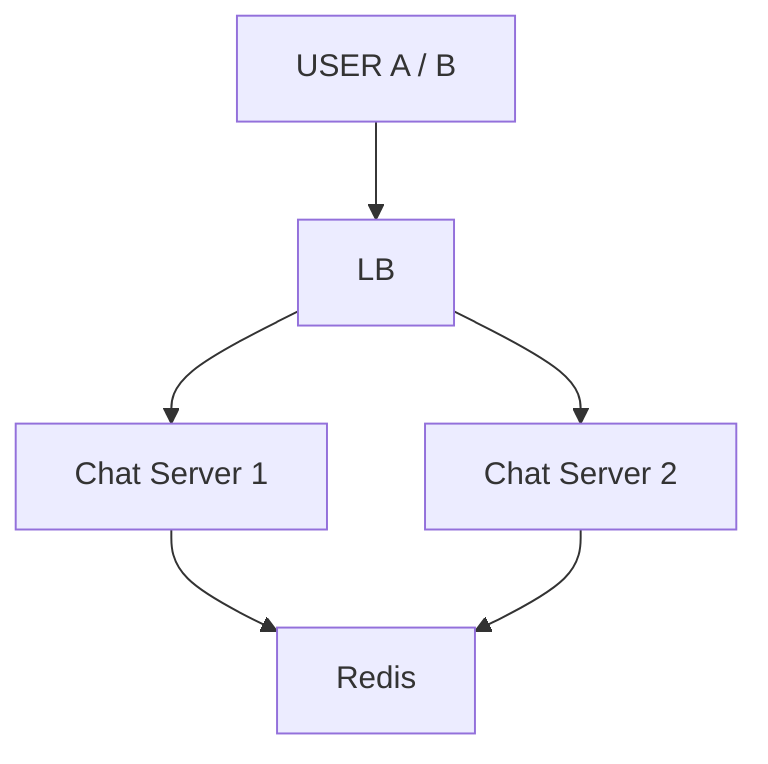
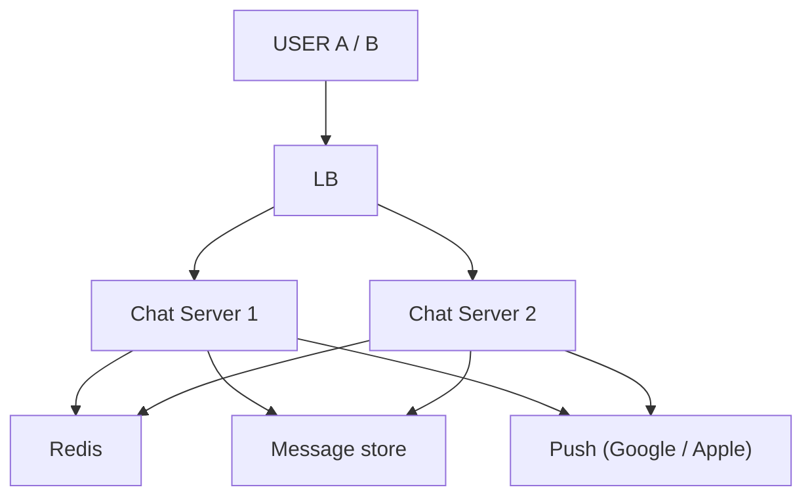
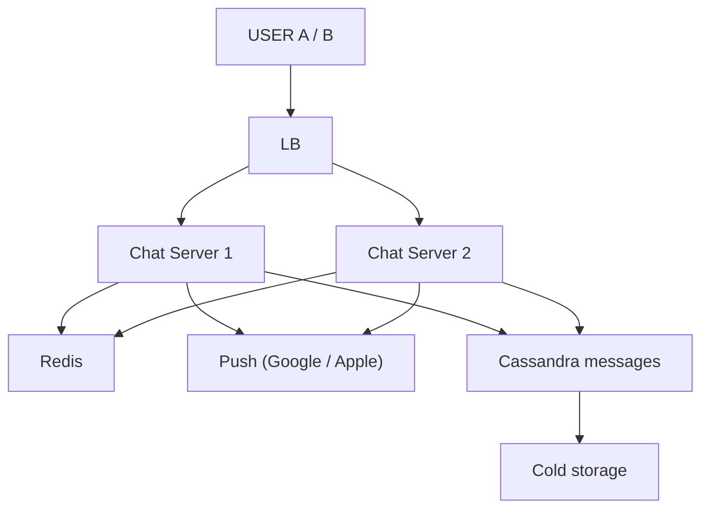
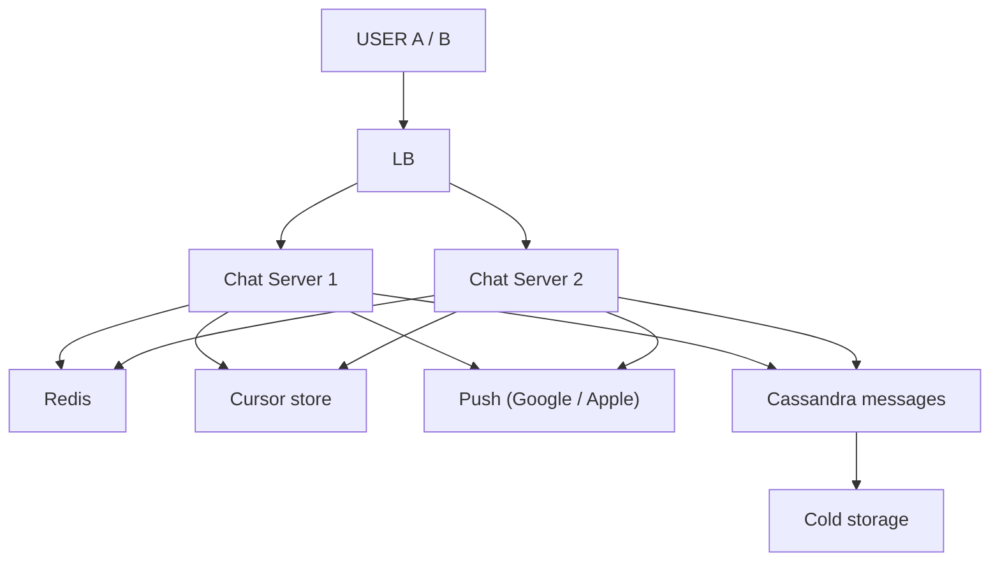
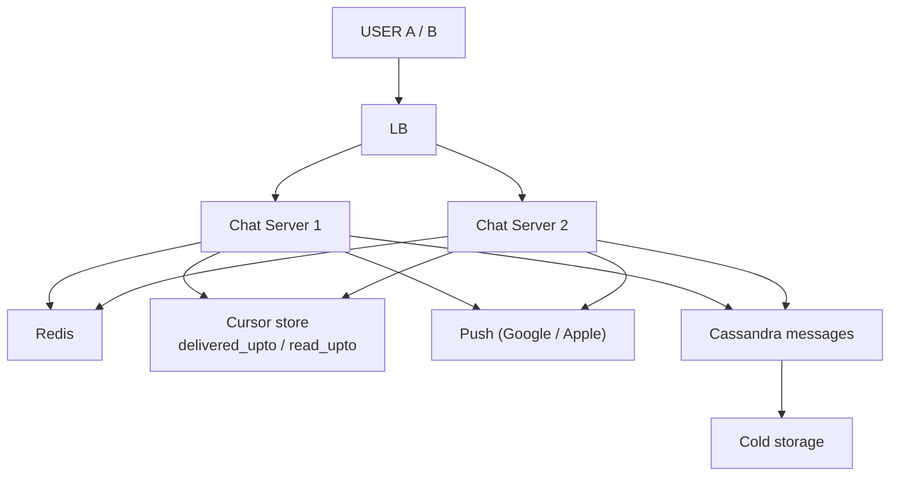
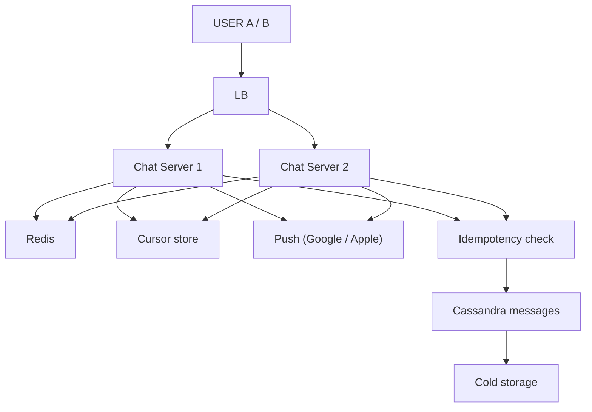
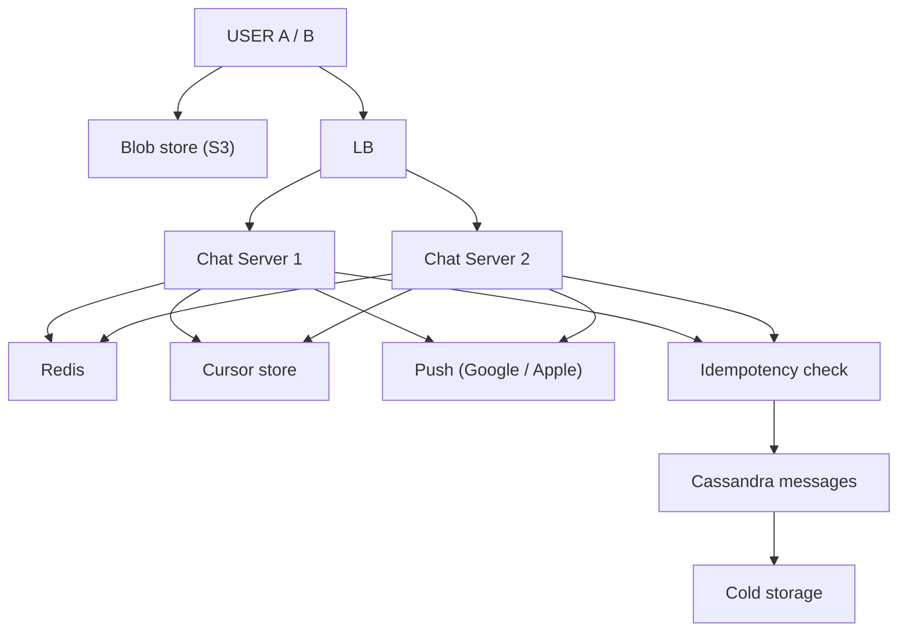
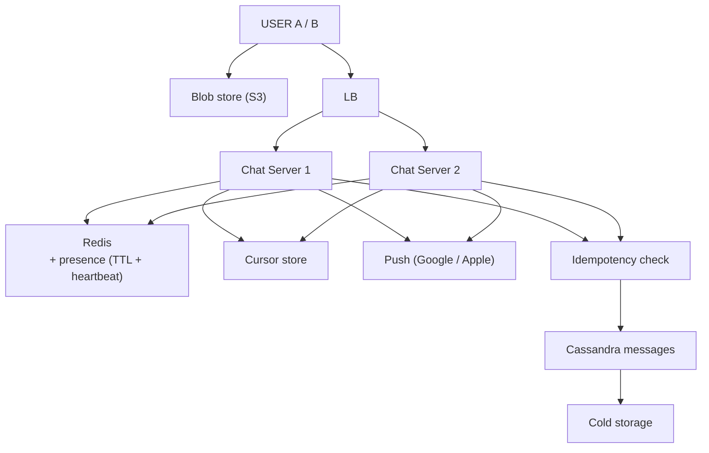

# Chat / Messaging System

> A ne message bheja -> B tak TURANT, chahe B ne kuch na maanga ho · offline ho to baad me mile · kuch na khoye.
> Is design ka dil: **"banda KAHAN hai"** (baaki designs me "data kahan rakhein") + **khuli connection**.
> 21-Sep: ye padh ke nahi bana — ek chhota server aur do browser tab chala ke bana. Jahan aankh se dekha, wahan **★ DEKHA:**

```
JAD KI BAAT — chat baaki har design se KYUN alag:
   ab tak (url shortener, feed, payment, banking): user ne MAANGA -> server ne diya -> connection BAND
   chat: A ne bheja -> B ne kuch nahi maanga -> phir bhi B tak TURANT
   HTTP me server sirf JAWAB de sakta, AWAAZ nahi -> do nayi cheez:
   1. CONNECTION KHULI rakhni (WebSocket — ek baar judo, dono taraf baat)
   2. REGISTER "kaun kahan juda hai" (10 chat server, B kis se?) -> yahi chat ka DIL
```

---

## TASVEER (ByteByteGo / Alex Xu · CC BY-NC-ND 4.0)


Source: [What is the Journey of a Slack Message?](https://bytebytego.com/guides/what-is-the-journey-of-a-slack-message/)
(ek message sender se receiver tak — WebSocket, server, fan-out)


Source: [Short/long polling, SSE, WebSocket](https://bytebytego.com/guides/shortlong-polling-sse-websocket/)
(chat me WebSocket kyun — polling / long polling / SSE se farak)

---

## SHURU — poocho + numbers

```
POOCHO (6, inme 2 poora design badalte):
   1. 1-to-1 ya GROUP? (group = ek message, 500 pahunchai)
   2. ★ HISTORY kahan, kitni der? WhatsApp = phone pe, pahunchte hi server se DELETE (server = DAAK-GHAR)
                                  Slack = server pe HAMESHA, 3 saal purana bhi search
                                  -> ye EK jawab storage 100 GB se 100 TB banata
   3. ★ END-TO-END encryption? haan -> server PADH hi nahi sakta -> server search khatam · naya member
        purane message nahi dekh sakta · key ka poora system — sabse bada scope-changer
   4. RECEIPT? ek tick (server) · do tick (phone) · neeli (padh li) · online / last-seen
      har tick ek ULTA message -> traffic KAI GUNA
   5. MEDIA? message ke saath nahi, blob store me, message me sirf PATA
   6. OFFLINE banda? message kahan ruke, kab tak, push notification?

MAAN KE CHALO (bol ke): 1-to-1 + chhote group (500 tak) · history SERVER pe (Slack model, design zyada dikhta)
                        · E2E abhi NAHI ("scope se bahar") · receipts sent / delivered / read

FR:      1-to-1 · group 500 · offline ko baad me · purani history · tick sent / delivered / read · online / last-seen
         scope bahar: E2E · voice / video · bade broadcast group
NFR:     TURANT (<1 sec) · KABHI na khoye · KRAM na bigde (ek chat ke andar) · DUPLICATE na dikhe
         · 2 crore EK SAATH jude · server gire to doosra sambhale

NUMBERS: 50 crore user, 10 crore roz · 40 msg / din -> ~400 crore / din
         WRITE 4 x 10^9 / 86400 ~ 46,000 / sec (peak 2-3x ~1.5 lakh) · READ catch-up + history, tick guna karte
         ONLINE ek waqt ~2 CRORE KHULI CONNECTION  <- ★ asli paimana ("kitni request / sec" nahi,
                "kitni connection KHULI" — har khuli connection memory khaati, message aaye ya na aaye)
         STORAGE 4 x 10^9 x ~300 B ~ 1.2 TB / din -> 1 saal ~440 TB (Slack) · WhatsApp model ~ZERO

TEEN FAISLE:
   1. CONNECTION ka apna TIER: 2 crore / ~1 lakh per box = ~200 CHAT SERVER (sirf taar pakde)
      -> API / business server se ALAG · event loop (Netty type), "ek connection = ek thread" nahi
   2. STORAGE ek box ka NAHI (banking ka ULTA: 120 / sec vs 46,000 / sec + 1.2 TB roz) — DB dikkat 4 me
   3. HISTORY MODEL storage ka dhaancha tay karta (sawaal 2) — yahan SLACK model

DO BLOCK JO DESIGN CHALATE:
   CONNECTION (khuli) = har online user ka taar, isi raaste server user tak
   REGISTER (kaun kis taar ke peeche) = MEMORY me, DB me nahi (taar khud memory me)
```

---

## DABBA 0 — sabse simple: EK server, do user

```
SOLUTION: A /connect?user=A (BAND NAHI hoti) -> register A -> penA · B /connect -> B -> penB
          A /send?to=B&text=hi (normal request) -> register.get("B") -> penB me likho -> B ko "A: hi"
          `pen` DATA nahi, B tak PAHUNCHNE KA RAASTA · message B ke PURANE khule taar se gaya · B ne kabhi nahi poocha
★ DEKHA:  B ki screen pe message aa gaya, B ne kuch maanga hi nahi. Screen pe "JUD GAYA — ye connection ab khuli padi hai",
          console pe `[JUDA] B   register ab = [A, B]`
```


---

## DIKKAT 1 — 2 crore connection KHULI, har ek memory kha rahi

```
DIKKAT:   crore connection khuli rehti, har ek memory khaati (file descriptor, socket buffer, app object).
          Sirf haath pakad ke rakhne me GB chale jaate -> sau-do sau server.
★ DEKHA:  server ki ginti jaan-boojh ke TEEN rakhi. Teen connection ne jagah bhar di -> send request server tak
          PAHUNCHI HI NAHI. Console pe `[JUDA]` teen, `[SEND]` EK BHI nahi. Na error, na crash, CPU khaali.
          Khuli connection bina kuch kiye jagah gherti.

SOLUTION: (1) EVENT LOOP (Netty jaisa): kuch hi thread, laakhon connection.
          (2) Server gira -> uske lakh user ek saath wapas -> client reconnect me BACKOFF + JITTER.
              (FOUNDATIONS/14_jab_ilaaj_hi_bimari_bane.md)
          (3) Deploy: REST restart me kuch retry, chat restart = lakh disconnect -> thode-thode server karke,
              pehle connection hatao (DRAINING).
          Aage LB connection ko kisi chat server pe bithata.

NAYA:     LB
BADLA:    Chat Server ek se KAI — asal me ~200 (event loop), diagram me 2 dikhaye

KAISE (event loop):
          thread-per-connection: har connection ka ek thread, zyada time baitha intezaar karta (khaali)
          event loop: kuch thread (CPU jitne). OS (epoll) batata "in 5 socket pe data aaya" -> sirf unpe kaam
          -> 1 thread hazaaron socket dekhta, khaali socket pe koi kharcha nahi
KYUN YE:  thread-per-connection: har thread ka stack ~1 MB -> 1 lakh connection = ~100 GB sirf stack + context switch
```
```
BOARD PE: ek connection ~10-50 KB · 1 lakh x ~30 KB = ~3 GB · 2 crore / 1 lakh = ~200 server

POOCHEGA: "What happens if a chat server goes down?"
BOL:      "Its connections drop and clients reconnect to another server with backoff and jitter, so they don't
           stampede. No message is lost — it was written to the database before delivery — and on reconnect the
           client asks for everything after its last message id."

AGLA SAWAAL (tere jawab se):
  "LB WebSocket ko kaise bithata (lambi connection)?"
   -> L4 / L7 LB connection ek baar kisi server pe, phir wahi rehti (sticky by connection). Naya connection = naya chunaav
  "Server pe kitne connection, kaise pata bhar gaya?"
   -> metric: open connections + memory; had paar -> LB naye connection doosre servers ko
```


---

## DIKKAT 2 — A server-1 pe, B server-7 pe: server-1 ki diary me B hai hi nahi

```
DIKKAT:   A ek server pe, B doosre pe. Har server ko sirf apne jude logon ka pata -> A ke server ko laga
          B offline, jabki B doosre server pe online tha.
★ DEKHA:  wahi program do port pe. A ki screen `(server bola: B OFFLINE hai)`, B us waqt online.

SOLUTION: (1) SAANJHI DIARY (Redis): "B kis server pe" (sirf pata, connection nahi). Mera server Redis se
              poochhe, us server ko seedha call kare, wo local connection pe daale.
              Connection kabhi Redis me nahi (zinda taar, sirf usi server ki memory me).
              Server mara, entry padi -> TTL + heartbeat.
          (2) PUB-SUB: B ka server "B" channel sunta, mera server us pe daalta. Par pub-sub bhej ke bhool
              jaata -> offline iske bharose nahi.
          Mel: kaun kahan = Redis · server se server = seedhi call / pub-sub · offline = DB + push.
          (Har message pe saare servers se poochhna = kharij.)

NAYA:     Redis (presence / routing + pub-sub)
```
```
BOARD PE: server-1 diary {A -> penA} · server-7 {B -> penB} · A ka message server-1 pe -> "B OFFLINE"
          Redis: B -> server-7 -> server-1 seedha server-7 ko -> penB

AGLA SAWAAL (tere jawab se):
  "Redis routing diary me B ka server galat (B abhi khiska)?"
   -> server-7 pe B nahi mila -> message DB me pada hi hai -> B ke naye server pe judte hi catch-up
  "Redis hi gir gaya?"
   -> replica pe failover; beech me routing nahi -> messages DB me, push + reconnect se pahunchenge
```


---

## DIKKAT 3 — B offline: pen hi nahi, message jaaye kahan?

```
DIKKAT:   B offline, connection hi nahi -> message jaaye kahan?
          Galat soch: pehle B ko bhejo, na pahunche to DB.

SOLUTION: (1) Pehle DB me LIKHO (ID ke saath), PHIR bhejne ki koshish. B juda -> bhejo · nahi -> DB me pada
              + push notification. Offline me "kho gaya" hota hi nahi.
          (2) B wapas: "mere paas aakhri id ye, uske baad ka do" (nishaan client rakhta, Kafka offset jaisa).
              Ek baar catch-up, uske baad server khud bhejta (polling nahi).
          Push = Google / Apple ke through phone OS tak, app band ho tab bhi.

NAYA:     Message store · Push (Google / Apple)

KAISE (push ghanti):
          app install / login pe phone ka DEVICE TOKEN (FCM / APNs se) server pe user ke saath save
          B offline -> server us token pe Google / Apple ko bhejta -> wo phone OS tak
          token badla / app uninstall -> provider 'invalid' bolta -> token hatao
```
```
BOARD PE: /send: 1 ID + DB me likho (pakka) · 2 B juda -> pen me · nahi -> DB + push
          B wapas: "aakhri id 4417, uske BAAD ka do" -> 4418 se aage
          polling: har 5 sec "kuch aaya?" = 100 request, 1 kaam ki

POOCHEGA: "How do you make sure no message is lost?"
DHYAAN:   beech me Kafka ho: producer acks=all · offset kaam ke BAAD · message id se idempotent · fail -> DLQ
BOL:      "I write the message to the database first and only then try to deliver it. If the receiver is offline
           it simply waits there and a push notification goes out; when they reconnect they ask for everything
           after their last message id."

AGLA SAWAAL (tere jawab se):
  "B ke 3 device (phone, laptop, web)?"
   -> har device ka apna connection + apna cursor; message sab pe, read ek pe hua to baaki pe bhi neeli
  "Push me poora message bhejoge?"
   -> chhota preview (ya sirf 'naya message'), privacy ke liye; asli message app khulne pe server se
```


---

## DIKKAT 4 — 1.2 TB roz aur 46,000 write / sec: ek DB box nahi

```
DIKKAT:   roz ~1 TB, hazaaron write / sec -> ek DB box nahi jhelega. Kis cheez se baantein?

SOLUTION: (1) Chat me padhna = "is chat ke aakhri 50". To PARTITION KEY = chat_id, SORT KEY = message_id.
              (user_id se baante to ek baatcheet do jagah.)
          (2) Message ID = SNOWFLAKE: har server khud banata, time ke saath badhta. Wahi kram + cursor.
              (Auto-increment = ek counter, sab us pe atkenge.)
          (3) DB = WIDE-COLUMN (Cassandra / Scylla): likhai bahut, padhai saadi, key pe sorted.
              Relational nahi: yahan ek message ek row, koi multi-row atomic / constraint nahi.
          Purana: WhatsApp pahunchte hi delete, Slack hamesha rakhta -> cold storage. Ye shuru me poochho.

BADLA:    Message store -> Cassandra (chat_id partition, message_id sort)
NAYA:     Cold storage

KAISE (Cassandra me write tez kyun):
          write -> commit log (disk pe sirf append) + RAM memtable -> 'done'
          memtable bhari -> disk pe SSTable seedha · purana badla nahi jaata -> sirf append = 46K / sec jhel leta
KAISE (snowflake id):
          64 bit = [ time ms (41 bit) | machine id (10 bit) | us ms me ginti (12 bit) ]
          har server khud banata, kisi se poochhe bina · time aage = id badi = kram
```
```
BOARD PE: ~1.2 TB roz · ~46,000 write / sec
          WHERE chat_id = ? AND id < 4417 ORDER BY id DESC LIMIT 50   (keyset; OFFSET 200000 ghatak)

POOCHEGA: "The database is too big / takes too many writes. What do you do?"
BOL:      "Wide-column store partitioned by chat id and sorted by a snowflake message id, so the last fifty messages
           of a chat are one read and writes spread across nodes. Old data moves to cold storage."

POOCHEGA: "What about a hot partition — one very active group?"
DHYAAN:   chat_id + MAHINA sirf partition ka SIZE baandhta, abhi ka BOJH nahi (is mahine sab ek dabbe me)
          consistent hashing ek hot key ko nahi bachata
BOL:      "I'd add a random bucket to the key, chat id plus 0 to 9, and merge on read, or cap group size and rate."

POOCHEGA: "Data keeps growing — what happens in 3 years?"
BOL:      "It depends on the model we picked: WhatsApp-style deletes after delivery; Slack-style keeps everything,
           so older months move to cold storage."

AGLA SAWAAL (tere jawab se):
  "Do server ki ghadi alag, snowflake ka kram?"
   -> thoda idhar-udhar ho sakta (ms ka farak); ek chat ka kram per-chat seq se pakka (DIKKAT 10)
  "Ek group ki partition bahut badi (saalon ke message)?"
   -> partition key = (chat_id, month) -> size bandha
```


---

## DIKKAT 5 — 500 ka group: ek message, likhai 500 baar?

```
DIKKAT:   500 logon ka group -> ek message ke liye 500 jagah likhna?

SOLUTION: EK hi copy chat ke neeche (fan-out on READ), sab wahi padhein.
          Bhejna = register se har member ki connection pe (connection pe likhna sasta, DB likhai ek).
          Twitter se ulta kyun: Twitter feed 200 logon ki milawat (pehle banani padti) + crore follower.
          Group sabke liye ek jaisa, 500 member.

NAYA:     koi dabba nahi
```
```
AGLA SAWAAL (tere jawab se):
  "500 me 300 online, 300 server tak bhejna kaise?"
   -> routing diary se members ke servers nikaalo -> har server ko EK call 'ye message, in members ko'
      (server ke hisaab se group karo, 300 alag call nahi)
  "Naya member juda, purane message dikhenge?"
   -> uske joining id se pehle wale nahi (cursor joining id pe), ya settings ke hisaab
```


---

## DIKKAT 6 — 500 member: kiske kitne unread, kahan rakhoge?

```
DIKKAT:   500 member: kiske kitne unread, kahan rakhoge?

SOLUTION: Har member ka EK NISHAAN (cursor): "Arpan is group me yahan tak padh chuka". Unread = uske baad kitne.
          (Cursor = har chat ka apna +1 wala number, dikkat 10. Snowflake me gap hote.)
          (Har message x har member ka record = 500-guna likhai wapas. Sirf tick ke liye chahiye.)

NAYA:     Cursor store (har user ka har chat me "kahan tak padha / mila" wala number)
```
```
BOARD PE: A: 500 x 50 = 25,000 record · B: 500 row ("Arpan 4417 tak padh chuka")

AGLA SAWAAL (tere jawab se):
  "Unread count kaise (4417 ke baad kitne)?"
   -> chat ka aakhri seq - mera read seq = unread (ghatao, gino nahi). Cursor SEQ pe, message id sirf laane ke liye
  "Cursor kahan rakhoge?"
   -> Cassandra (user_id, chat_id) -> read_upto; hot wala Redis me
```


---

## DIKKAT 7 — do tick aur neeli tick: server ko pata kaise?

```
DIKKAT:   do tick aur neeli tick, server ko pata kaise? Ek tick = server tak (sasta).
          Do tick = B ka app bole "mil gaya". Neeli = app bole jab chat screen pe khuli.

SOLUTION: Wahi CURSOR: har chat me har bande ke do number, "yahan tak mila" aur "yahan tak padha".
          B ne 50 padhe -> ek hi baat "yahan tak padha" -> A ko ek push -> 50 neeli ek saath.
          (Har message ka alag flag = 50 ack, 50 push.)
          ★ Tick + group unread + offline catch-up = ek hi cheez: ek nishaan aage khiskta.

NAYA:     koi dabba nahi — Cursor store
```
```
BOARD PE: A->server · server->B · B->server "mil gaya" · server->A "delivered" · B->server "padh liya" · server->A "read"
          delivered_upto = 4417 · read_upto = 4410 -> B ne 50 padhe -> "read_upto 4467" -> A ko EK push

AGLA SAWAAL (tere jawab se):
  "Do tick ka 'mil gaya' ack hi kho gaya?"
   -> B agli baar judta hai to apna delivered_upto bhejta -> cursor aage, A ko tick
  "Group me do tick kab?"
   -> sab members ka delivered_upto >= message id -> sabse chhota cursor dekho
```


---

## DIKKAT 8 — 10 lakh ka broadcast group: tick ka kya?

```
DIKKAT:   10 lakh ka broadcast group -> tick ka kya? Har member ka record 500 pe chalta, 10 lakh pe nahi.

SOLUTION: Feature utna rakho jitna scale jhele:
          (1) WhatsApp group size bandha (~1000); do tick = sabko mila, neeli = sabne padha.
          (2) Channel / broadcast me tick band. Slack me sirf channel ka unread (ek cursor).

NAYA:     koi dabba nahi
```
```
AGLA SAWAAL (tere jawab se):
  "Channel me 10 lakh ko message pahunchana kaise?"
   -> fan-out workers (Kafka se) members ke pages me; jo online unhe push, baaki catch-up pe
  "Seema kaun tay karta?"
   -> product + engineering saath: feature ki keemat batao (10 lakh x tick = kitne write)
```


---

## DIKKAT 9 — A ka net slow, app ne dobara bheja, B ko EK baat DO baar

```
DIKKAT:   A ka net slow, timeout pe app ne dobara bheja, pehla pahunch chuka tha -> B ko ek baat do baar.

SOLUTION: (1) IDEMPOTENCY KEY = clientMsgId. Pehle aayi -> purana lautao · nahi -> naya.
          (2) ID CLIENT banata (retry bhi client karta; server banata to har retry nayi ID).
          (3) "Pehle aayi?" + insert = ek atomic step (unique constraint / Redis SET NX).

NAYA:     Idempotency check (clientMsgId pehle aaya? to naya message mat banao)
```
```
BOARD PE: { chatId, text, clientMsgId: "a7f3-91" }

POOCHEGA: "What if the client retries and sends the same message twice?"
BOL:      "The client generates a clientMsgId and reuses it on retry; the server claims it atomically and returns
           the existing message instead of creating a second one."

AGLA SAWAAL (tere jawab se):
  "clientMsgId kitni der yaad rakhoge?"
   -> retry window (kuch minute-ghante) -> Redis SET NX EX 3600, ya DB me (chat_id, clientMsgId) UNIQUE
  "Retry pe purana message wapas diya, uska id?"
   -> pehli baar wala server id -> A ke app me wahi bubble, do nahi
```


---

## DIKKAT 10 — kram kis se tay hoga, kiska time maanoge?

```
DIKKAT:   kram kis se tay hoga, kiska time maanoge? (1) ek chat ke andar kram. (2) do logon me kiska pehle:
          jo server pe pehle pahuncha, sabko ek jaisa dikhe, itna kaafi.

SOLUTION: (1) Snowflake ID time se badhti + ek chat ek partition -> ek kram (dikkat 4).
          ★ JAAL: kram client ke time se MAT (phone ki ghadi galat ho sakti). Kram server ki ID se,
            client time sirf dikhane ke liye. Ulta pahunche -> B ka app ID se lagaye.
          (2) Gayab pakadna: har chat ka apna +1 number; beech ka nahi aaya -> catch-up.
          (3) Kafka beech me ho -> key = chatId.
          "Ye to WhatsApp me hota hai" (doosra pehle chala gaya) -> jaan-boojh ke: strict kram = pehla atka
          to doosra bhi roko (head-of-line blocking). Chuna: kram thoda idhar-udhar, par message ruke nahi.

NAYA:     koi dabba nahi

KAISE (per-chat seq kaun deta):
          Redis INCR seq:chat123 -> atomic +1 -> 15, 16, 17 (do server ek saath maange to bhi alag number)
          ya chat ka partition-owner server memory me ginti rakhe (ek chat ek jagah)
```
```
BOARD PE: per-chat seq: 15, 17 aaya, 16 nahi -> catch-up

POOCHEGA: "How do you keep messages in order?"
BOL:      "Order comes from a server-assigned id, never the client clock. One chat lives in one partition, and with
           Kafka I key by chat id, so a chat stays in order while different chats run in parallel. A per-chat
           sequence number lets the client spot a gap and catch up."

AGLA SAWAAL (tere jawab se):
  "Seq wala Redis restart, ginti 0 se?"
   -> restart pe DB se chat ka max seq padh ke wahan se aage (ya Redis persistence)
  "16 nahi aaya, client kya kare?"
   -> chhota intezaar (shayad raste me), phir server se '15 ke baad ke do' -> 16 mil gaya
```


---

## DIKKAT 11 — 5 MB ka video bhi isi raaste se?

```
DIKKAT:   5 MB ka video bhi chat server ke raaste se? Connection + thread atkenge.

SOLUTION: (1) Client file S3 me daale (presigned URL), message me sirf PATA (type, url, size, thumbnail).
          (2) Download = chhoti umar ka presigned URL.
          (3) Thumbnail client banata (kuch KB) -> B ko turant kuch dikhe. Group me file ek baar, 500 ko wahi pata.

NAYA:     Blob store (S3)

KAISE (pre-signed URL):
          server apni secret key se sign karta: (PUT, bucket/key, expiry 10 min) -> URL
          client us URL pe seedha S3 me upload, S3 signature + expiry khud check karta
          client ko AWS ki chaabi nahi milti, sirf is ek file ka chhota paas
```
```
BOARD PE: { type: image, url, size, thumbnail }

AGLA SAWAAL (tere jawab se):
  "Same video 1000 log forward kare -> 1000 copy?"
   -> file ka content hash -> pehle se hai to wahi purani file ka pata (dedup), naya upload nahi
  "End-to-end encryption me thumbnail server dekh sakta?"
   -> nahi, client file encrypt karke upload, chaabi message ke saath (server sirf band dabba dekhe)
```


---

## DIKKAT 12 — online / last-seen: sabko sabka status

```
DIKKAT:   online / last-seen: status har waqt badalta, sabke contacts ko chahiye.
          Har connect / disconnect pe saare contacts ko batao = crore x 500 = bakwaas.

SOLUTION: (1) TTL se apne aap marna: Redis me "B online" chhoti TTL, app heartbeat se refresh kare.
              App band -> heartbeat ruka -> TTL khatam -> apne aap offline ("offline" message bhejna hi nahi).
          (2) Poocho, batao mat: B ka status tabhi jab B ki chat khuli ho.
          Last seen = usi key ka aakhri update time. Chhupaya hai to mat dikhao (privacy layer).

NAYA:     koi dabba nahi — Redis presence
```
```
BOARD PE: presence:B = online, TTL 30 sec · app har 15 sec heartbeat

AGLA SAWAAL (tere jawab se):
  "Heartbeat har 15 sec = 2 crore / 15 = 13 lakh / sec Redis pe?"
   -> heartbeat chat server tak hi (connection pe ping); server apne saare users ka presence batch me Redis me
  "B ka status live badalta dikhe (typing...)?"
   -> sirf khuli chat ke liye subscribe; typing = chhota event, store nahi, bhej ke bhool jao
```


---

## 10x SCALE — har dabba alag

```
Chat Server   -> 2 crore khuli = ~200 box sirf haath pakadne · event loop, warna thread khatam
REGISTER      -> memory me, server gira to gaya -> Redis TTL entry + dhadkan
RECONNECT     -> ek server gira = 1 lakh ek saath -> backoff + jitter · deploy pe draining
Cassandra     -> chat_id partition · hot group -> bucket (chat_id + 0..9) / had · purana cold storage
Push          -> Google / Apple bahar ki cheez -> apna retry / queue
Redis         -> replica, ALAG AZ · message store bhi replica, alag AZ

POOCHEGA: "How would you scale this to 10x?"      -> user ka raasta chalo, pehle jo toote
POOCHEGA: "What's the single point of failure?"   -> chat server (reconnect), Redis (replica)
POOCHEGA: "How do you know it's working?"         -> delivery p99 · open connections per box · reconnect rate · push failures · alert
```

---

## POOCHE TO (deep-dive)

```
API:      GET /connect (BAND nahi hoti — WebSocket / SSE) · POST /messages { chatId, text, clientMsgId }
          GET /messages?chatId=&before= (catch-up + history, cursor) · POST /messages/{id}/read (receipt)

DO DUNIYA:  ZINDA TAAR (memory, ek server ki, mar sakti) = register / pen
            PAKKA MAAL (DB, sab jagah se dikhta) = message
            jo pen ko Redis me rakhne ki koshish kare — ho hi nahi sakta
            ek user -> KAI pen (phone + laptop + tab) — ★ dekha
```

---

## AAKHRI DABBA + WRAP

```
LB = connection ko chat server pe bithaye · Chat Server = khuli connection + local register (pen), event loop
Redis = kaun kis server (TTL + dhadkan) + pub-sub + presence · Push = app band pe ghanti (phone OS se)
Idempotency = clientMsgId · Cassandra = chat_id / message_id, pehle LIKHO phir bhejo · Cold storage = purana
Cursor store = delivered_upto / read_upto · Blob store = media, message me sirf pata
```
```
BOL: "Each user holds an open WebSocket to one of ~200 chat servers, and Redis records which server each user is on.
      A message is deduped on clientMsgId, written first to Cassandra partitioned by chat id with a snowflake id,
      then routed to the receiver's server; if they're offline it waits and a push notification goes out, and on
      reconnect they ask for everything after their last id. Receipts and unread counts are just cursors per user per
      chat, presence is a TTL key kept alive by heartbeats, and media goes to S3 with only a link in the message."
```


[← SYSTEM_DESIGNS](..) · [← Home README](../../../README.md) · [← MASTER SHEET](../../00_MASTER_SHEET.md)
