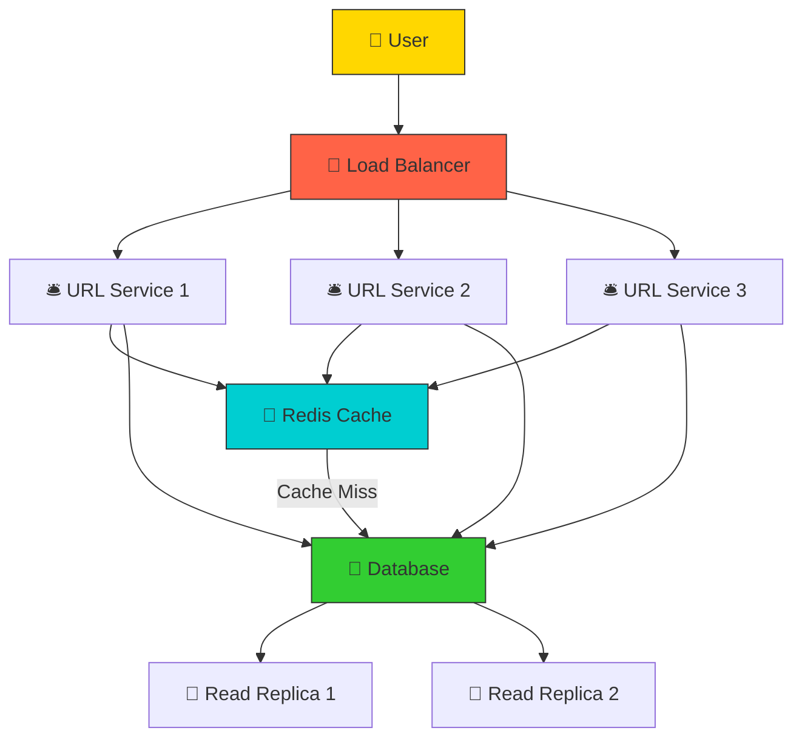
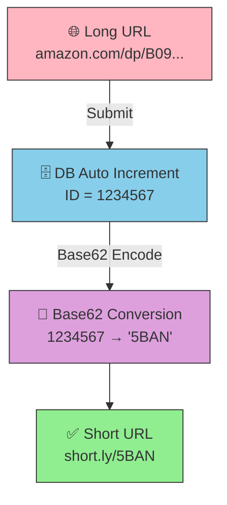
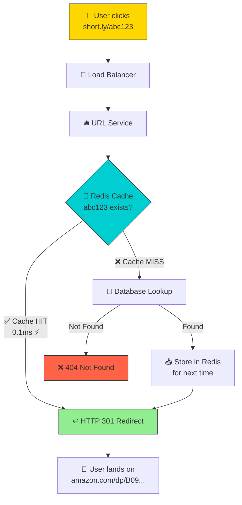

# HLD 01: URL Shortener (bit.ly)
### By Arpan Maheshwari

---

## KYA KARNA HAI?
```
Long URL → Short URL → Click kare → Original pe redirect

https://www.amazon.com/dp/B09V3KXJPB/ref=cm_sw_r_cp_api  (LAMBA)
                              ↓
                    short.ly/abc123  (CHHOTA)
                              ↓
                    Click → Amazon page khule
```

---

## POORA SYSTEM — EK PICTURE MEIN

```
                         ┌─────────────────────────────────┐
                         │        URL SHORTENER             │
                         │                                  │
  ┌──────┐    ┌────────────────┐    ┌────────────────────┐ │
  │ USER │───→│  LOAD BALANCER │───→│    URL SERVICE     │ │
  │      │    │  (Traffic cop) │    │  (Worker bees)     │ │
  └──────┘    │                │    │  Instance 1        │ │
              │  Kisko bhejun? │    │  Instance 2        │ │
              │  1? 2? 3?     │    │  Instance 3        │ │
              └────────────────┘    └─────────┬──────────┘ │
                                              │            │
                                    ┌─────────┴─────────┐  │
                                    ↓                   ↓  │
                              ┌──────────┐      ┌──────────┐
                              │  REDIS   │      │    DB    │
                              │ (Fridge) │      │ (Market) │
                              │ Fast!    │      │ Permanent│
                              └──────────┘      └──────────┘
                         └─────────────────────────────────┘
```

---

## VISUALIZE 1 — SYSTEM KO RESTAURANT SAMJHO

```
  ┌──────────────────────────────────────────────────────────┐
  │                    RESTAURANT                             │
  │                                                          │
  │  👤 CUSTOMERS (Users)                                    │
  │   │                                                      │
  │   ↓                                                      │
  │  🚦 GUARD (Load Balancer)                                │
  │   "Counter 1 pe jao, aap counter 2 pe, aap 3 pe"        │
  │   Bina guard: sab ek counter pe → LAMBI LINE             │
  │   │                                                      │
  │   ↓                                                      │
  │  🛎️ COUNTER 1, 2, 3 (URL Service instances)             │
  │   Har counter same kaam karta.                           │
  │   Ek band? Baaki 2 chalu. = HIGH AVAILABILITY            │
  │   │                                                      │
  │   ↓                                                      │
  │  🧊 FRIDGE (Redis Cache)                                 │
  │   "Coke chahiye? Fridge mein hai → LE LO 2 sec"         │
  │   "Nahi hai? Kitchen se mangwao (DB) → 30 sec"          │
  │   Fridge = FAST. Kitchen = SLOW but sab hai.             │
  │   │                                                      │
  │   ↓                                                      │
  │  🍳 KITCHEN (Database)                                   │
  │   Sab recipes (URLs) yahan stored.                       │
  │   HEAD CHEF (Master) = naya recipe likhe (WRITE)         │
  │   HELPERS (Slaves) = existing recipe padhe (READ)        │
  │   Sab kaam chef kare → slow.                             │
  │   Helpers padhe, chef likhe → FAST.                      │
  └──────────────────────────────────────────────────────────┘
```

---

## VISUALIZE 2 — SHORT CODE KAISE BANTA?

```
  GHAR NUMBERING SYSTEM:

  Colony mein naya ghar bana → number mile:
    Ghar 1 → "1"
    Ghar 2 → "2"
    ...
    Ghar 62 → "10" (Base62 mein)
    Ghar 1234567 → "5BAN"

  Base62 = a-z (26) + A-Z (26) + 0-9 (10) = 62 chars
  7 chars = 62^7 = 3.5 TRILLION unique codes. Kabhi khatam nahi.

  ┌────────────┐         ┌──────────────┐         ┌──────────┐
  │ Long URL   │────────→│ ID = 1234567 │────────→│ "5BAN"   │
  │ amazon.com │  DB ne  │ auto increment│ Base62  │ short.ly │
  │ /dp/B09... │  diya   │              │ encode  │ /5BAN    │
  └────────────┘         └──────────────┘         └──────────┘

  Collision? ZERO. Har ID unique → har code unique.
```

---

## VISUALIZE 3 — REQUEST KA SAFAR (Redirect)

```
  User ne click kiya: short.ly/abc123

  Step 1: 🚦 Load Balancer
          "Server 2 pe bhejo — wo kam busy hai"
                    │
                    ↓
  Step 2: 🛎️ URL Service (Server 2)
          "abc123 ka long URL chahiye"
                    │
                    ↓
  Step 3: 🧊 Redis Cache check
          "abc123 mere paas hai? ......HAI!"
          → "https://amazon.com/dp/B09..." → return
          → CACHE HIT = 0.1ms ⚡ FAST
                    │
          (agar nahi hota toh ↓)
                    │
  Step 4: 🍳 DB check (sirf cache MISS pe)
          SELECT long_url FROM urls WHERE short_code = 'abc123'
          → mila → Redis mein rakh (next time fast)
          → return
                    │
                    ↓
  Step 5: ↩️ HTTP 301 Redirect
          Browser ko bolo: "https://amazon.com/dp/B09..." pe jao
                    │
                    ↓
  Step 6: 👤 User Amazon page pe pahunch gaya!

  TOTAL TIME: <50ms (cache hit pe)
```

---

## VISUALIZE 4 — CACHE = FRIDGE vs MARKET

```
  BINA CACHE:
  ┌──────┐     ┌────────┐
  │ User │────→│   DB   │  Har baar MARKET ja (slow)
  │      │←────│        │  100 requests = 100 DB trips
  └──────┘     └────────┘  = SLOW (5ms each = 500ms)

  WITH CACHE:
  ┌──────┐     ┌────────┐     ┌────────┐
  │ User │────→│ REDIS  │     │   DB   │
  │      │←────│(Fridge)│     │(Market)│
  └──────┘     └────────┘     └────────┘
                 ↑ HIT!          ↑ sirf MISS pe
                 99 baar         1 baar

  Doodh chahiye?
    Fridge kholo → hai? → le lo (0.1ms)
    Nahi? → Market ja → le aao → fridge mein rakh
    Next 99 baar fridge se → FAST
```

---

## VISUALIZE 5 — SCALE KAISE?

```
  VERTICAL SCALING = EK BANDA STRONG KARO:
  ┌──────────┐
  │ Server   │  RAM: 8GB → 64GB
  │ (akela)  │  CPU: 4 → 32 cores
  │          │  LIMIT HAI — ek machine ki max capacity
  └──────────┘

  HORIZONTAL SCALING = TEAM BADHAO:
  ┌────────┐ ┌────────┐ ┌────────┐ ┌────────┐
  │Server 1│ │Server 2│ │Server 3│ │Server 4│
  └────────┘ └────────┘ └────────┘ └────────┘
  Unlimited! Jitne chahiye utne add karo.
  Load Balancer distribute kare.

  VISUALIZE:
    Vertical = Ek HULK — strong but akela
    Horizontal = AVENGERS TEAM — har koi thoda kare, saath mein powerful
```

---

## VISUALIZE 6 — READ REPLICAS

```
  PROBLEM: 10K reads + 1K writes = DB OVERLOAD

  ┌──────────────────────────────────────────┐
  │                                          │
  │  WRITE ────→ 👨‍🍳 MASTER DB (Chef)        │
  │              "Naya URL save karo"        │
  │                    │                     │
  │                    │ copy                 │
  │              ┌─────┴─────┐               │
  │              ↓           ↓               │
  │  READ ──→ 📖 SLAVE 1  📖 SLAVE 2        │
  │           "URL dhundho" "URL dhundho"    │
  │                                          │
  └──────────────────────────────────────────┘

  Master = SIRF write. Slaves = SIRF read.
  10K reads / 2 slaves = 5K each. Handle ho gaya.

  ANALOGY:
    Newspaper EDITOR (master) = articles LIKHE
    READERS (slaves) = articles PADHE
    Editor pe sab load daalo → crash
    Readers alag → editor free for writing
```

---

## VISUALIZE 7 — DATABASE SHARDING

```
  Billions URLs → ek DB mein fit nahi

  SHORT CODE se decide kaunsi DB:

  ┌─────────┐     ┌─────────┐     ┌─────────┐
  │ a - m   │     │ n - z   │     │ 0 - 9   │
  │ SHARD 1 │     │ SHARD 2 │     │ SHARD 3 │
  └─────────┘     └─────────┘     └─────────┘

  "abc123" → first char 'a' → SHARD 1 mein dhundho
  "xyz789" → first char 'x' → SHARD 2 mein dhundho

  ANALOGY:
    LIBRARY mein sections:
    A-M books → RACK 1
    N-Z books → RACK 2
    Poori library scan nahi — seedha sahi rack pe jao. FAST.
```

---

## EDGE CASES — INTERVIEW MEIN POOCHTE

```
  Q: Same URL 2 baar submit?
  ┌──────────┐     ┌──────────┐
  │ amazon   │────→│ DB check │───→ Already hai? → same short URL return
  │ .com/... │     │          │───→ Nahi? → naya bana
  └──────────┘     └──────────┘

  Q: URL expire?
  ┌──────────┐     ┌──────────┐
  │ abc123   │────→│ DB check │───→ expires_at < now? → 404 Not Found
  │ click    │     │          │───→ valid? → redirect
  └──────────┘     └──────────┘

  Q: Viral URL — millions clicks?
  ┌──────────┐     ┌──────────┐
  │ millions │────→│  REDIS   │───→ Cache mein hai → DB touch NAHI
  │ requests │     │  (hero)  │     Redis handle kar lega
  └──────────┘     └──────────┘
```

---

## INTERVIEW MEIN YE BOLO (6 lines)
```
1. Base62 encoding — unique short codes, no collision
2. Redis cache — 80% requests cache se, DB skip
3. Master-Slave DB — read heavy, slaves read handle
4. Load Balancer — multiple instances, traffic distribute
5. API Gateway — rate limiting, abuse prevent
6. Horizontal scaling — servers badhao, not RAM
```

---

## EK PICTURE MEIN POORA SYSTEM
```
  👤 User
   │
   ↓
  🚦 Load Balancer ── "kisko bhejun?"
   │
   ├──→ 🛎️ Service 1 ──┐
   ├──→ 🛎️ Service 2 ──┤──→ 🧊 Redis (Fridge) ──→ ⚡ FAST return
   └──→ 🛎️ Service 3 ──┘         │
                              MISS?↓
                            🍳 Master DB (write)
                            📖 Slave DB (read)
                                  │
                            ↩️ Redirect → User Amazon pe
```

---

## MERMAID DIAGRAMS

### System Architecture



### Short Code Generation Flow



### Redirect Flow



---

*HLD 01 — URL Shortener | by Arpan Maheshwari*
*"Restaurant samjho — Guard, Counter, Fridge, Kitchen. Bas yehi hai."*
