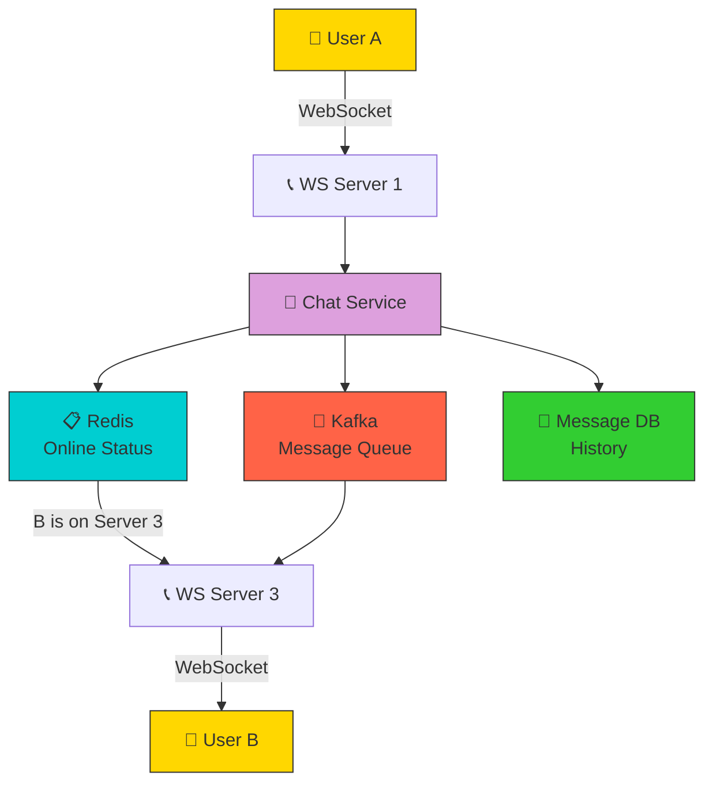
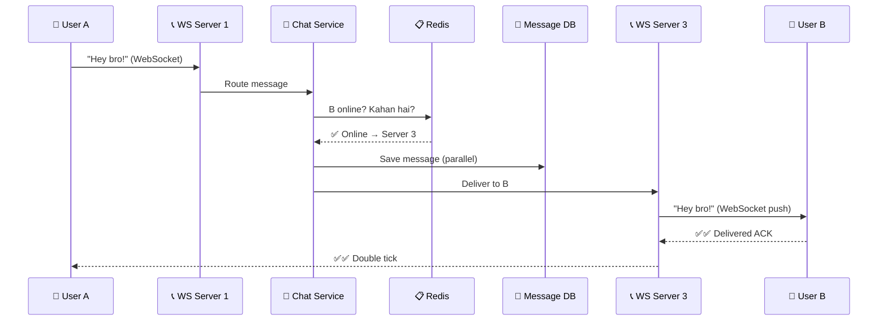
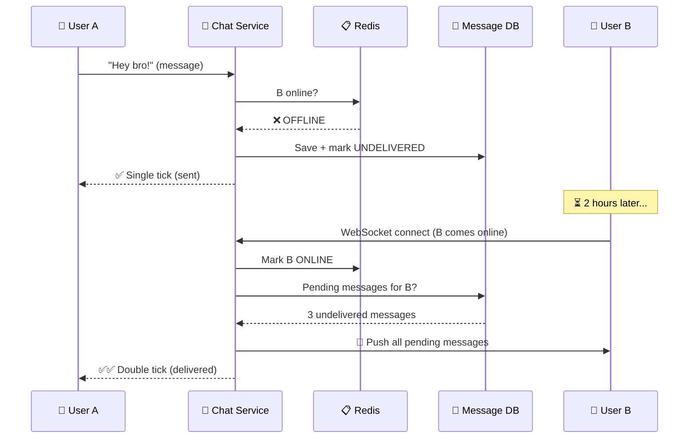
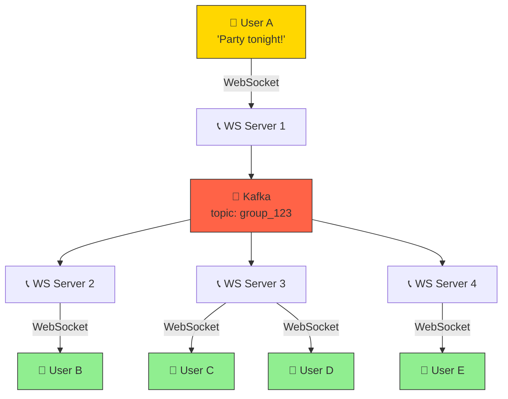

# HLD 02: Chat System (WhatsApp)
### By Arpan Maheshwari

---

## KYA KARNA HAI?
```
User A message bheje → User B ko turant mile (real-time)
Online/Offline status dikhe
Group chat bhi ho
Media bhi bhej sake (photo, video)
```

---

## VISUALIZE 1 — PROBLEM KYA HAI?

```
NORMAL API (REST):
  User A bole "Hi" → Server pe save →
  User B ko KAISE pata chalega?

  B har 1 sec mein pooche: "mere liye koi message?" (POLLING)
  = 86,400 requests/day PER USER. 10M users = 864 BILLION requests.
  = SERVER DEAD.

  ANALOGY:
    Tu har 1 minute post office ja ke pooche: "mera letter aaya?"
    Din mein 1440 baar. Bekar. Thakaan.

FIX — WEBSOCKET:
  Ek baar connection kholo → DONO side se message bhej sakte
  Server ko message aaya → seedha User B ko push
  B ne poocha nahi — server ne KHUD bheja.

  ANALOGY:
    Post office wala PHONE kar de: "tera letter aaya, le ja."
    Tu poochne nahi gaya — usne bataya. = WEBSOCKET.
```

---

## VISUALIZE 2 — POORA SYSTEM EK PICTURE

```
  👤 User A (sender)                    👤 User B (receiver)
   │                                           ↑
   │ WebSocket                        WebSocket │
   ↓                                           │
  ┌──────────────────────────────────────────────────┐
  │                 CHAT SYSTEM                       │
  │                                                   │
  │  ┌──────────┐    ┌──────────┐    ┌──────────┐   │
  │  │WEBSOCKET │    │  CHAT    │    │WEBSOCKET │   │
  │  │ SERVER   │───→│ SERVICE  │───→│ SERVER   │   │
  │  │(A se msg │    │(logic +  │    │(B ko msg │   │
  │  │ receive) │    │ route)   │    │ deliver) │   │
  │  └──────────┘    └─────┬────┘    └──────────┘   │
  │                        │                         │
  │              ┌─────────┼─────────┐               │
  │              ↓         ↓         ↓               │
  │        ┌─────────┐┌────────┐┌────────┐           │
  │        │ MESSAGE ││ REDIS  ││ KAFKA  │           │
  │        │   DB    ││(Online ││(Queue) │           │
  │        │(History)││Status) ││        │           │
  │        └─────────┘└────────┘└────────┘           │
  └──────────────────────────────────────────────────┘
```

---

## VISUALIZE 3 — TELEPHONE EXCHANGE ANALOGY

```
  POORA SYSTEM = TELEPHONE EXCHANGE

  ┌─────────────────────────────────────────────────────┐
  │              TELEPHONE EXCHANGE                      │
  │                                                     │
  │  📞 User A call kare (WebSocket connect)            │
  │   │                                                 │
  │   ↓                                                 │
  │  👷 OPERATOR (Chat Service)                         │
  │   "A ka message B ke liye hai"                      │
  │   "B ONLINE hai? Check karo"                        │
  │   │                                                 │
  │   ├──→ 📋 DIRECTORY (Redis)                         │
  │   │    "B online hai? HAAN → Server 3 pe"           │
  │   │    "B offline hai? → message LOCKER mein rakh"  │
  │   │                                                 │
  │   ├──→ 📞 B ko connect karo (WebSocket push)        │
  │   │    "B sun! A ne bola: Hi"                       │
  │   │                                                 │
  │   ├──→ 📦 LOCKER (Message DB)                       │
  │   │    Sab messages save — history ke liye           │
  │   │                                                 │
  │   └──→ 📢 LOUDSPEAKER (Kafka)                       │
  │        Group message? → Kafka se sab members ko     │
  │                                                     │
  └─────────────────────────────────────────────────────┘
```

---

## VISUALIZE 4 — MESSAGE KA SAFAR (1-to-1)

```
  User A sends "Hey bro!" to User B

  Step 1: 📞 A → WebSocket Server 1
          A ka phone connected hai Server 1 se

  Step 2: 🔀 Chat Service
          "Ye message B ke liye hai"
          "B kahan hai? Redis poocho"

  Step 3: 📋 Redis check
          "B online hai? → HAAN, Server 3 pe connected"

  Step 4: 📨 Server 3 → B ko push
          WebSocket se turant B ko bhej diya

  Step 5: ✅ B ko mila!
          B ke phone pe "Hey bro!" dikha

  Step 6: 💾 DB mein save (parallel)
          Message history ke liye permanent store

  ┌───────┐  WebSocket  ┌───────────┐  Redis  ┌───────────┐  WebSocket  ┌───────┐
  │User A │────────────→│  Server 1 │────────→│  Server 3 │────────────→│User B │
  └───────┘             └───────────┘         └───────────┘             └───────┘
                              │
                              ↓
                        ┌───────────┐
                        │  DB Save  │ (parallel — block nahi karta)
                        └───────────┘
```

---

## VISUALIZE 5 — B OFFLINE HAI TOH?

```
  User A sends "Hey bro!" → User B OFFLINE hai

  Step 1: 📞 A → Server → Chat Service
  Step 2: 📋 Redis: "B online? → NAHI"
  Step 3: 💾 DB mein save + mark UNDELIVERED
  Step 4: ✅ A ko tick: sent (✓) not delivered (✓✓)

  ... 2 ghante baad ...

  Step 5: 📞 B ONLINE aaya → WebSocket connect
  Step 6: 🔍 "B ke pending messages hain?"
          DB check → "Haan 3 messages hain"
  Step 7: 📨 Sab pending messages B ko push
  Step 8: ✅✅ A ko double tick: delivered (✓✓)

  ANALOGY:
    B ghar pe nahi tha → postman ne LETTER BOX mein daala
    B ghar aaya → letter box khola → sab letters mile
```

---

## VISUALIZE 6 — GROUP CHAT

```
  Group: "College Friends" — A, B, C, D, E (5 members)
  A sends: "Party tonight!"

  GALAT TARIKA:
    A → Server → B ko bhej
    A → Server → C ko bhej
    A → Server → D ko bhej
    = Individually. Slow.

  SAHI TARIKA (Kafka):
    A → Server → KAFKA topic "group_123"
    Kafka → sab subscribers ko deliver

  ┌───────┐     ┌─────────┐     ┌─────────┐     ┌───────┐
  │User A │────→│  KAFKA  │────→│Server 2 │────→│User B │
  │"Party"│     │topic:   │────→│Server 3 │────→│User C │
  └───────┘     │group_123│────→│Server 1 │────→│User D │
                └─────────┘────→│Server 4 │────→│User E │
                                └─────────┘     └───────┘

  ANALOGY:
    Group = LOUDSPEAKER
    Ek baar bolo → sab ko sunaai de
```

---

## VISUALIZE 7 — ONLINE STATUS (Redis)

```
  Redis mein:
    "user_A" → { server: "ws-1", last_seen: "12:05" }
    "user_B" → { server: "ws-3", last_seen: "12:03" }
    "user_C" → NULL (offline)

  App kholte hi:
    WebSocket connect → Redis: "ONLINE, server X pe"

  App band kare:
    WebSocket disconnect → Redis: "OFFLINE"
    last_seen update

  ANALOGY:
    Office ATTENDANCE REGISTER:
    Aaya → naam likho (online)
    Gaya → naam hatao (offline)
    "Rahul kab aaya?" → register dekho → "12:03 PM"
```

---

## VISUALIZE 8 — MEDIA (Photos/Videos)

```
  GALAT: Photo DB mein store → DB FULL → slow
  SAHI:  Photo S3 mein → DB mein sirf LINK

  ┌───────┐  photo  ┌────────┐  upload  ┌──────┐
  │User A │────────→│ SERVER │─────────→│  S3  │
  └───────┘         └───┬────┘          └──┬───┘
                        │                  │
                        ↓                  ↓ URL return
                   ┌─────────┐    "s3.aws.com/photo123.jpg"
                   │   DB    │
                   │save link│
                   └─────────┘
                        │
                        ↓
                   ┌───────┐
                   │User B │ ← link → S3 se download
                   └───────┘

  ANALOGY:
    Photo ALBUM mein chipkaana = HEAVY (DB mein photo)
    GOOGLE DRIVE pe daalo, album mein LINK = LIGHT
```

---

## VISUALIZE 9 — SCALE

```
  10M users. 1 server = 100K connections.
  10M / 100K = 100 servers.

  🚦 Load Balancer
   │
   ├──→ 📞 WS Server 1  (100K users)
   ├──→ 📞 WS Server 2  (100K users)
   ├──→ 📞 WS Server 3  (100K users)
   ...
   └──→ 📞 WS Server 100 (100K users)

  A → Server 1, B → Server 50
  Kaise message jaaye?
  Server 1 → KAFKA → Server 50 → B ko deliver

  ANALOGY:
    100 BANK BRANCHES.
    A ne Branch 1 se paise bheje → B Branch 50 pe.
    Internal system (Kafka) se transfer.
```

---

## INTERVIEW MEIN YE BOLO (6 lines)
```
1. WebSocket — real-time, polling nahi
2. Redis — online status + user-to-server mapping
3. Kafka — group chat + server-to-server
4. Cassandra/MongoDB — message history (write heavy)
5. S3/CDN — media files, DB mein sirf link
6. Horizontal scale — 100+ WS servers, LB distribute
```

---

## EK PICTURE MEIN POORA FLOW
```
  👤A                                           👤B
   │                                             ↑
   │ WebSocket                          WebSocket │
   ↓                                             │
  🚦 LB → 📞 WS Server 1                        │
                │                                │
                ↓                                │
           🧠 Chat Service                       │
                │                                │
      ┌─────────┼──────────┐                     │
      ↓         ↓          ↓                     │
  📋 Redis  📢 Kafka   💾 DB                    │
  "B kahan?"  broadcast  save                    │
      │                                          │
      ↓                                          │
  "B → Server 50"                                │
      │                                          │
      └────────→ 📞 WS Server 50 ───────────────┘
                    "B sun! A ne bola: Hey bro!"
```

---

## MERMAID DIAGRAMS

### System Architecture



### Message Flow — Sequence Diagram (1-to-1)



### Offline Message Flow



### Group Chat Flow



---

*HLD 02 — Chat System (WhatsApp) | by Arpan Maheshwari*
*"Telephone Exchange samjho — Operator, Directory, Locker, Loudspeaker."*
