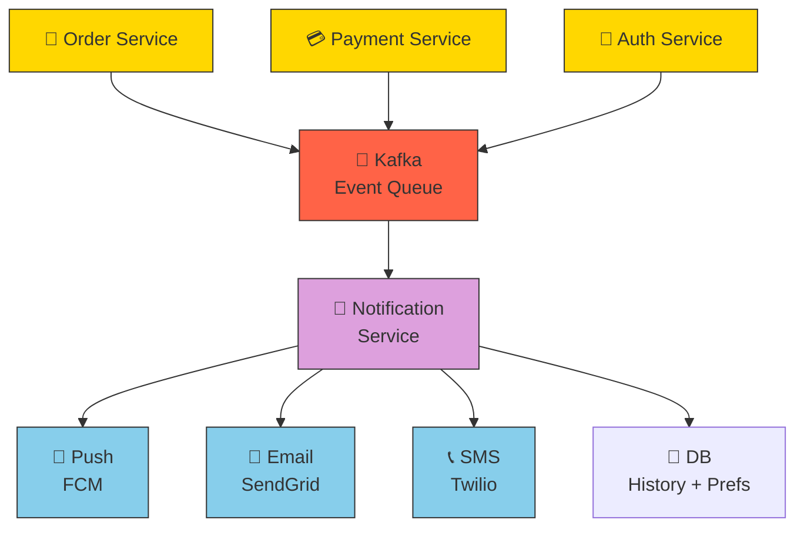
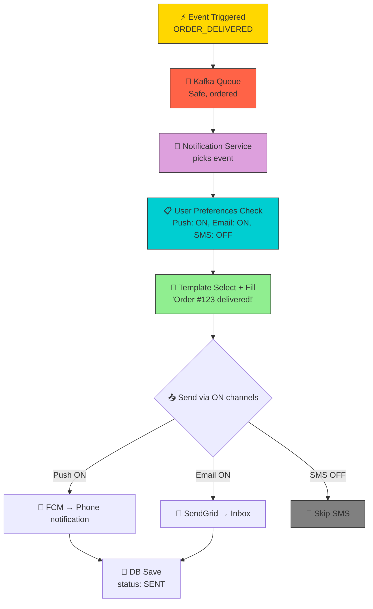
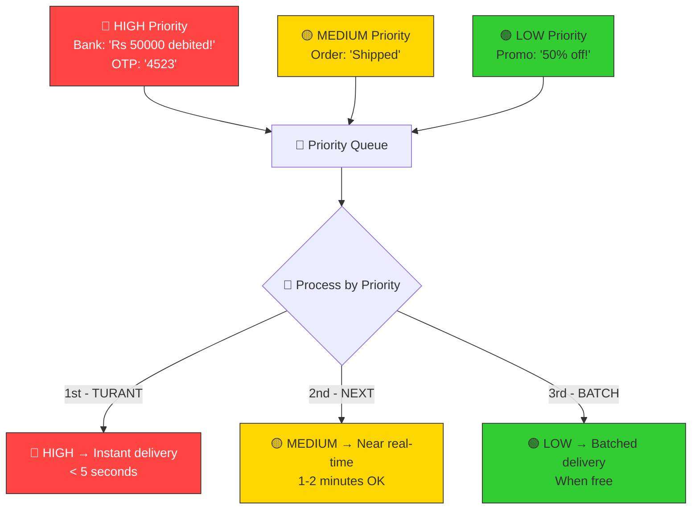

# HLD 03: Notification System
### By Arpan Maheshwari

---

## KYA KARNA HAI?
```
App mein kuch hua → user ko turant pata chale

Examples:
  Zomato: "Order out for delivery!" → Push notification
  Amazon: "Order shipped" → Email + SMS
  Bank: "Rs 5000 debited" → SMS + Email + Push

Multiple channels: PUSH, SMS, EMAIL
Priority: Bank alert = URGENT, promo = LOW
```

---

## VISUALIZE 1 — PROBLEM KYA HAI?

```
GALAT TARIKA:
  OrderService mein:
    order complete → email bhejo + sms bhejo + push bhejo
  PaymentService mein:
    payment hua → email bhejo + sms bhejo (SAME CODE DOBARA)

  PROBLEM:
    Same code 10 jagah copy paste
    Naya channel (WhatsApp) → 10 jagah change
    Email down → Order bhi slow
    SRP violation — Order ka kaam order hai, email nahi

SAHI TARIKA:
  OrderService → EVENT fire "ORDER_COMPLETED"
  NotificationService → event sune → sahi channel se bheje
  OrderService ko pata hi nahi KAUN bhejega KAISE bhejega
```

---

## VISUALIZE 2 — POORA SYSTEM

```
  ┌──────────────────────────────────────────────────────────────┐
  │                 NOTIFICATION SYSTEM                          │
  │                                                              │
  │  ┌────────────┐     ┌──────────┐     ┌──────────────────┐   │
  │  │ Order      │     │          │     │  NOTIFICATION    │   │
  │  │ Service    │────→│  KAFKA   │────→│  SERVICE         │   │
  │  ├────────────┤     │ (Queue)  │     │                  │   │
  │  │ Payment    │────→│          │     │  Event padho →   │   │
  │  │ Service    │     │          │     │  Template banao →│   │
  │  ├────────────┤     │          │     │  Channel choose →│   │
  │  │ Auth       │────→│          │     │  Bhej do         │   │
  │  │ Service    │     └──────────┘     └────────┬─────────┘   │
  │  └────────────┘                               │              │
  │                                    ┌──────────┼──────────┐   │
  │                                    ↓          ↓          ↓   │
  │                              ┌─────────┐┌─────────┐┌───────┐│
  │                              │  PUSH   ││  EMAIL  ││  SMS  ││
  │                              │ (FCM)   ││(SendGrid││(Twilio││
  │                              │         ││ )       ││)      ││
  │                              └─────────┘└─────────┘└───────┘│
  │                                                              │
  │  💾 DB: notification history + user preferences              │
  └──────────────────────────────────────────────────────────────┘
```

---

## VISUALIZE 3 — PIZZA DELIVERY ANALOGY

```
  ┌──────────────────────────────────────────────────────────┐
  │              PIZZA SHOP                                   │
  │                                                          │
  │  👨‍🍳 KITCHEN (Services)                                   │
  │   "Pizza ready!" → slip counter pe rakh do               │
  │   Kitchen ko nahi pata kaun deliver karega                │
  │   │                                                      │
  │   ↓                                                      │
  │  📋 ORDER COUNTER (Kafka Queue)                           │
  │   Slips line mein lagti. Order wise. Miss nahi hogi.      │
  │   │                                                      │
  │   ↓                                                      │
  │  👷 MANAGER (Notification Service)                        │
  │   Slip padhe → address dekhe → delivery method choose:    │
  │   │                                                      │
  │   ├──→ 🏍️ BIKE (Push) — fast, nearby                     │
  │   ├──→ 🚗 CAR (Email) — detailed, documents              │
  │   └──→ 📞 PHONE (SMS) — urgent, short                    │
  │                                                          │
  │   Customer ne bola "sirf bike se" → preferences save      │
  │   Kitchen ko FARAK NAHI padta — wo sirf slip rakhta       │
  └──────────────────────────────────────────────────────────┘
```

---

## VISUALIZE 4 — NOTIFICATION KA SAFAR

```
  Step 1: 🛒 OrderService
          "Order #123 delivered!"
          Event: { type: ORDER_DELIVERED, userId: 5, orderId: 123 }
                │
                ↓
  Step 2: 📢 KAFKA topic: "notifications"
          Event queue mein safe. Miss nahi hoga.
                │
                ↓
  Step 3: 🧠 NOTIFICATION SERVICE picks event
          "ORDER_DELIVERED, userId 5 ke liye"
                │
                ↓
  Step 4: 📋 USER PREFERENCES check (DB)
          userId 5 → { push: ON, email: ON, sms: OFF }
                │
                ↓
  Step 5: 📝 TEMPLATE select + fill
          "Your order #{{orderId}} has been delivered!"
          → "Your order #123 has been delivered!"
                │
                ↓
  Step 6: 📤 SEND (parallel)
          ├──→ 📱 FCM (Push) → phone pe dikha
          └──→ 📧 SendGrid (Email) → inbox mein
                │
                ↓
  Step 7: 💾 DB save (history)
          { userId: 5, type: PUSH, status: SENT }
```

---

## VISUALIZE 5 — KAFKA KYUN?

```
  BINA QUEUE:
    ┌───────────┐     ┌──────────────┐
    │  Order    │────→│ Notification │  DOWN!
    │  Service  │  ✗  │  Service     │
    └───────────┘     └──────────────┘
    Notification down → Order bhi fail. GALAT.

  WITH KAFKA:
    ┌───────────┐     ┌──────────┐     ┌──────────────┐
    │  Order    │────→│  KAFKA   │────→│ Notification │
    │  Service  │     │  (safe)  │     │  Service     │
    └───────────┘     └──────────┘     └──────────────┘
    Notification down? Event Kafka mein SAFE.
    Wapas aaye → pending process. KUCH MISS NAHI.

  ANALOGY:
    Bina queue = seedha phone. Busy? MISS.
    With queue = voicemail. Free ho ke sune.
```

---

## VISUALIZE 6 — 3 CHANNELS

```
  ┌─────────────────────────────────────────────────┐
  │  Channel    │ Speed   │ Cost    │ Use Case       │
  ├─────────────┼─────────┼─────────┼────────────────┤
  │ 📱 PUSH    │ Instant │ Free    │ App updates    │
  │  (FCM)     │         │         │                │
  ├─────────────┼─────────┼─────────┼────────────────┤
  │ 📧 EMAIL   │ Seconds │ Cheap   │ Invoices, docs │
  │ (SendGrid) │         │         │                │
  ├─────────────┼─────────┼─────────┼────────────────┤
  │ 📞 SMS     │ Instant │ $$$$    │ OTP, urgent    │
  │ (Twilio)   │         │         │                │
  └─────────────────────────────────────────────────┘
```

---

## VISUALIZE 7 — USER PREFERENCES

```
  DB TABLE: user_preferences

  ┌─────────┬──────┬───────┬─────┐
  │ userId  │ push │ email │ sms │
  ├─────────┼──────┼───────┼─────┤
  │    1    │  ON  │  ON   │ OFF │
  │    2    │  ON  │  OFF  │ ON  │
  │    3    │  OFF │  ON   │ ON  │
  └─────────┴──────┴───────┴─────┘

  Event aaya → userId check → sirf ON channels pe bhejo
  User ne sms OFF kiya → SMS KABHI nahi jaayega
```

---

## VISUALIZE 8 — PRIORITY

```
  🔴 HIGH (urgent):
     Bank: "Rs 50000 debited!" → TURANT
     OTP: "4523" → 5 sec mein

  🟡 MEDIUM:
     Order: "Shipped" → 1-2 min theek

  🟢 LOW:
     Promo: "50% off!" → jab bhi. Batch mein.

  PRIORITY QUEUE:
  ┌──────────────────────────────────┐
  │  🔴 HIGH   │ process FIRST      │
  ├──────────────────────────────────┤
  │  🟡 MEDIUM │ process NEXT       │
  ├──────────────────────────────────┤
  │  🟢 LOW    │ process LAST/BATCH │
  └──────────────────────────────────┘
```

---

## VISUALIZE 9 — SCALE + RETRY

```
  10M users:
  ┌──────────┐
  │  KAFKA   │
  │partitions│
  └────┬─────┘
       │
  ┌────┼────┬────┬────┐
  ↓    ↓    ↓    ↓    ↓
  NS1  NS2  NS3  NS4  NS5   (5 instances)
  2M   2M   2M   2M   2M    each handles 2M

  RETRY (fail hua toh):
    1 min → 5 min → 30 min → GIVE UP
    = EXPONENTIAL BACKOFF
    Har baar wait BADHAO — server ko time do
```

---

## INTERVIEW MEIN YE BOLO (6 lines)
```
1. Kafka queue — services decouple, events miss nahi
2. 3 channels — Push (FCM), Email (SendGrid), SMS (Twilio)
3. User preferences — user decide kare kya receive
4. Priority queue — urgent pehle, promo baad mein
5. Templates — reusable, variables fill
6. Retry + exponential backoff — fail toh retry, 3 baar fail = give up
```

---

## EK PICTURE MEIN
```
  🛒 Service ──→ 📢 Kafka ──→ 🧠 NotificationService
                                     │
                                📋 Preferences
                                📝 Template
                                     │
                            ┌────────┼────────┐
                            ↓        ↓        ↓
                          📱Push   📧Email   📞SMS
                                     │
                                💾 DB save
```

---

## MERMAID DIAGRAMS

### System Architecture



### Notification Flow



### Priority Queue Flow



---

*HLD 03 — Notification System | by Arpan Maheshwari*
*"Pizza Shop — Kitchen slip rakhta, Manager deliver kare, Customer choose kare."*
