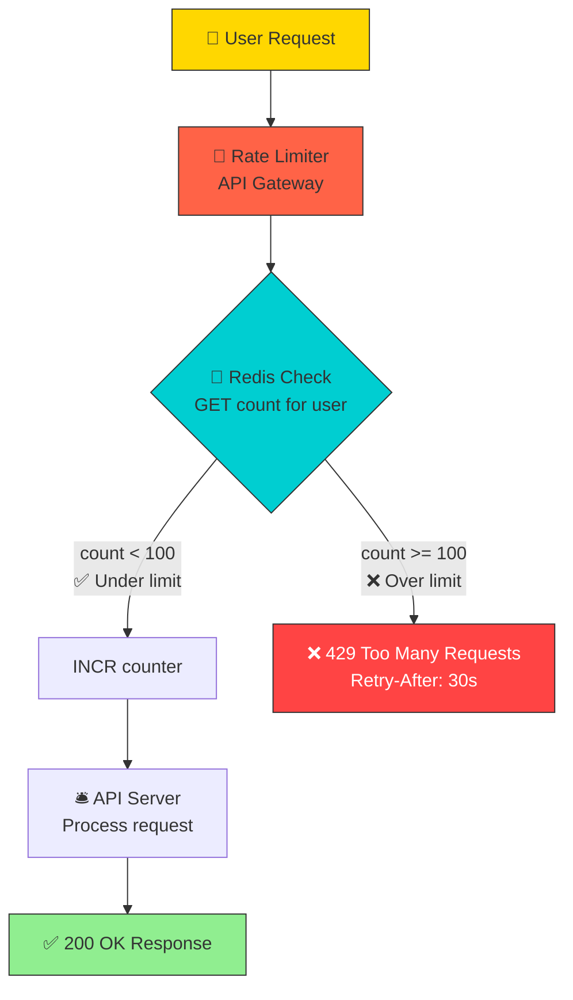
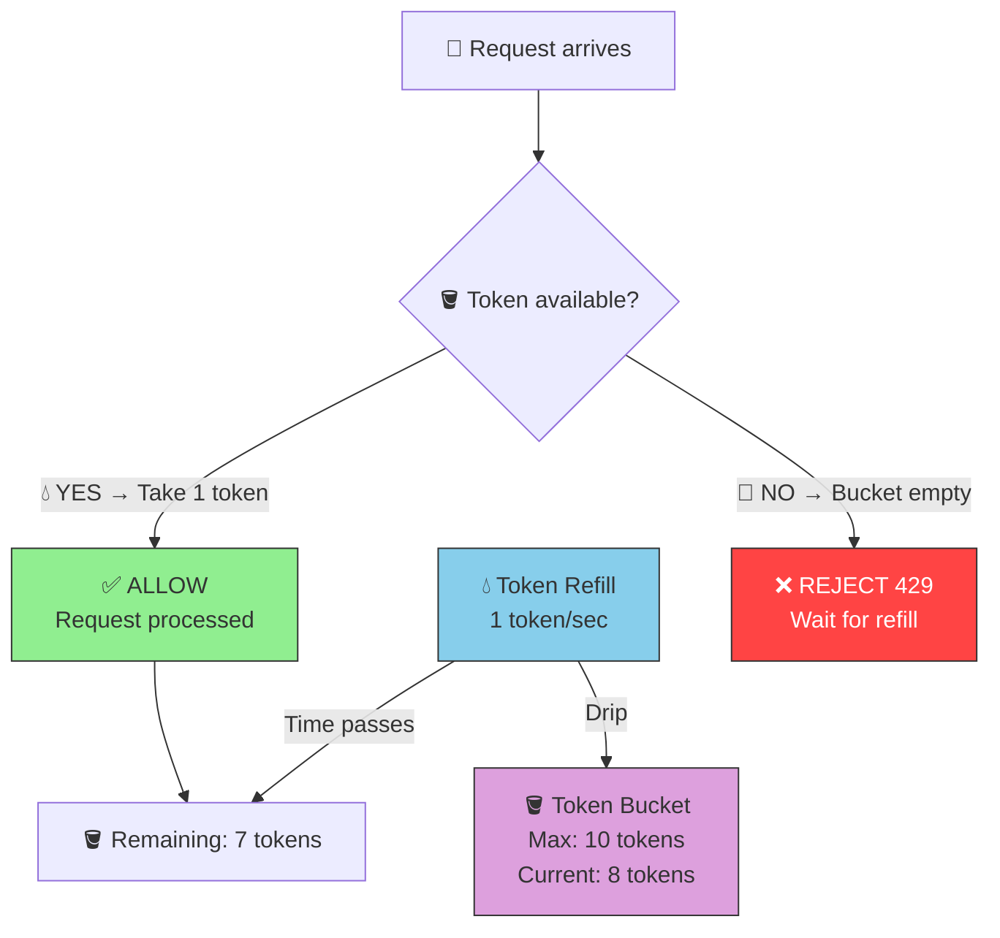
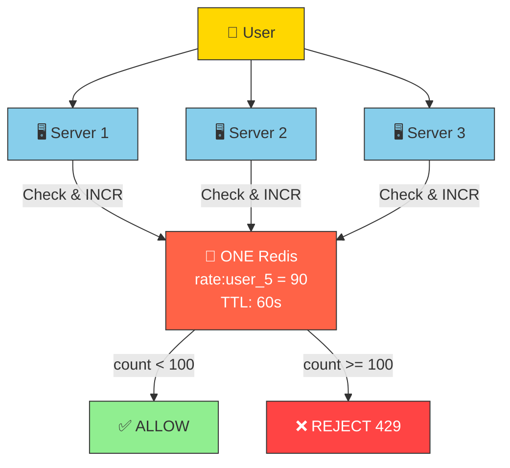

# HLD 04: Rate Limiter
### By Arpan Maheshwari

---

## KYA KARNA HAI?
```
Ek user zyada requests bheje → ROKO.
"Bhai 1 minute mein 100 requests hi allowed. Baaki reject."

Examples:
  Login: 5 attempts/min (brute force roko)
  API: 100 requests/min per user
  OTP: 3 requests/hour
  Twitter: 300 tweets/3 hours
```

---

## VISUALIZE 1 — TRAFFIC POLICE ANALOGY

```
  ┌──────────────────────────────────────────────────────┐
  │              HIGHWAY (API Server)                     │
  │                                                      │
  │  🚗🚗🚗🚗🚗 Normal traffic → JAAO                   │
  │                                                      │
  │  🚦 TRAFFIC POLICE (Rate Limiter)                    │
  │   "100 requests/min allowed"                         │
  │                                                      │
  │  🚗 User A: 50 req/min → "JAAO" ✓                   │
  │  🚗 User B: 80 req/min → "JAAO" ✓                   │
  │  🏎️ User C: 500 req/min → "RUKO! CHALLAN!" ✗        │
  │     → 429 Too Many Requests                          │
  │     → "1 min wait karo phir aana"                    │
  └──────────────────────────────────────────────────────┘
```

---

## VISUALIZE 2 — POORA SYSTEM

```
  ┌──────┐     ┌──────────────┐     ┌──────────────┐     ┌──────────┐
  │ USER │────→│ RATE LIMITER │────→│ API SERVER   │────→│ Response │
  │      │     │              │     │              │     │          │
  │      │     │ Allow? YES──→│────→│ Process      │     │ 200 OK   │
  │      │     │ Allow? NO───→│ ✗   │              │     │ 429 WAIT │
  └──────┘     └──────┬───────┘     └──────────────┘     └──────────┘
                      │
                      ↓
                ┌──────────┐
                │  REDIS   │
                │ (counter)│
                └──────────┘
```

---

## VISUALIZE 3 — TOKEN BUCKET (Best Algorithm)

```
  PAANI KI BALTI:

  💧💧💧 Tokens refill hote (per sec)
     ↓
  ┌──────────┐
  │  BUCKET  │  Max 10 tokens
  │  💧💧💧  │
  │  💧💧💧  │  Har request = 1 token
  │  💧💧    │
  └────┬─────┘
       │
  Token hai? → ALLOW
  Token nahi? → REJECT (429)

  EXAMPLE:
    Bucket: 10 tokens. Refill: 1/sec.
    
    Time 0: 10 tokens. 5 requests → 5 allow. 5 left.
    Time 1: 5+1=6. 3 requests → 3 allow. 3 left.
    Time 2: 3+1=4. 8 requests → 4 allow, 4 REJECT.
```

---

## VISUALIZE 4 — 3 ALGORITHMS COMPARISON

```
  TOKEN BUCKET:                    SLIDING WINDOW:
  ┌──────────┐                    |---- 60 sec ----|
  │  💧💧💧  │ Tokens refill     ←────────────────→
  │  Bucket  │ Burst OK          Count in window
  └──────────┘                    Smooth, no burst

  FIXED WINDOW:
  |12:00──────12:01|12:01──────12:02|
  Counter reset every minute
  PROBLEM: 99 at 12:00:59 + 99 at 12:01:00 = 198 in 2 sec!

  ┌──────────────────┬─────────┬───────────┐
  │  Algorithm       │ Burst?  │ Best For  │
  ├──────────────────┼─────────┼───────────┤
  │ Token Bucket     │ YES(OK) │ API rate  │
  │ Sliding Window   │ NO      │ Strict    │
  │ Fixed Window     │ YES(BAD)│ Simple    │
  └──────────────────┴─────────┴───────────┘

  Interview: "Token Bucket — AWS, Stripe sab use karte."
```

---

## VISUALIZE 5 — REDIS MEIN KAISE?

```
  ┌──────────────────────────────────────┐
  │  REDIS                               │
  │                                      │
  │  KEY: "rate:user_5"                  │
  │  VALUE: 47                           │
  │  TTL: 60 seconds (auto expire)      │
  │                                      │
  │  Request aaya:                       │
  │    GET "rate:user_5" → 47            │
  │    47 < 100? → ALLOW                │
  │    INCR → 48                        │
  │                                      │
  │  100th request:                      │
  │    GET → 100. 100 >= 100 → REJECT   │
  │    Return 429                        │
  │                                      │
  │  60 sec → TTL expire → key gone     │
  │  Fresh start.                        │
  └──────────────────────────────────────┘

  REDIS KYUN? Fast (0.1ms), TTL, Atomic INCR, Distributed
```

---

## VISUALIZE 6 — REQUEST KA SAFAR

```
  👤 Request aaya
       │
       ↓
  🚦 Rate Limiter
  Redis: GET count
       │
  ┌────┴────┐
  ↓         ↓
 < 100    >= 100
  │         │
  ↓         ↓
 ✅ ALLOW  ❌ 429
 INCR      "Wait 30 sec"
  │
  ↓
 🛎️ API Server → 200 OK
```

---

## VISUALIZE 7 — DISTRIBUTED (Multiple Servers)

```
  PROBLEM:
    3 servers, har ek apna counter → limit bypass!
    S1: 90 + S2: 90 + S3: 90 = 270! Limit 100 thi!

  FIX — EK REDIS:
    ┌──────────┐
    │ Server 1 │──┐
    │ Server 2 │──┼──→ 🔴 REDIS (EK counter)
    │ Server 3 │──┘    count = 90
    └──────────┘
    
    Kisi bhi server pe jaao → SAME counter
    = Accurate. Bypass nahi.

  ANALOGY:
    3 counters → EK register
    Total ALWAYS accurate
```

---

## VISUALIZE 8 — DIFFERENT LIMITS

```
  Ek user pe MULTIPLE limits:

  Login:   5/min      "rate:login:user_5"  → 3/5
  Search:  100/min    "rate:search:user_5" → 45/100
  Tweet:   300/3hr    "rate:tweet:user_5"  → 120/300
  OTP:     3/hr       "rate:otp:user_5"    → 1/3

  Alag keys. Ek hit → doosra affected nahi.
```

---

## INTERVIEW MEIN YE BOLO (6 lines)
```
1. Token Bucket algorithm — burst allow, industry standard
2. Redis counter — centralized, fast, TTL auto expire
3. 429 Too Many Requests + Retry-After header
4. Distributed — multiple servers, ek Redis, accurate
5. Per-API limits — login 5/min, search 100/min
6. API Gateway pe lagao — application code mein nahi
```

---

## EK PICTURE MEIN
```
  👤 User
   │
   ↓
  🚦 Rate Limiter (API Gateway)
   │
   ├──→ Redis: count < limit? → ✅ ALLOW → API → 200
   │    count >= limit? → ❌ 429 "Wait"
   │
   └──→ Multiple servers → SAME Redis → accurate
```

---

## MERMAID DIAGRAMS

### System Flow



### Token Bucket Concept



### Distributed Rate Limiting



---

*HLD 04 — Rate Limiter | by Arpan Maheshwari*
*"Traffic Police — speed limit todha toh challan. Token Bucket + Redis."*
