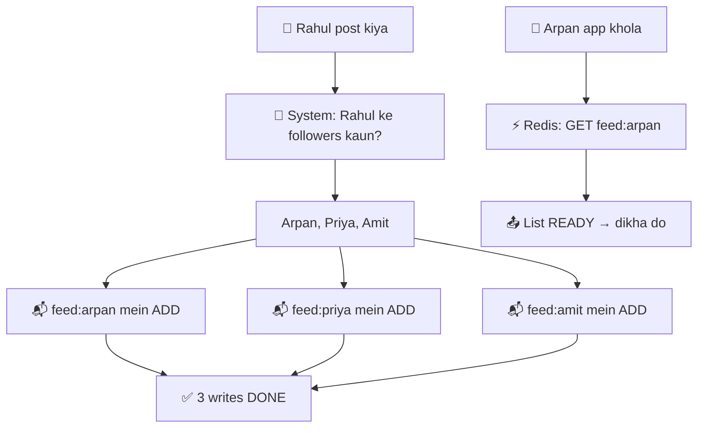
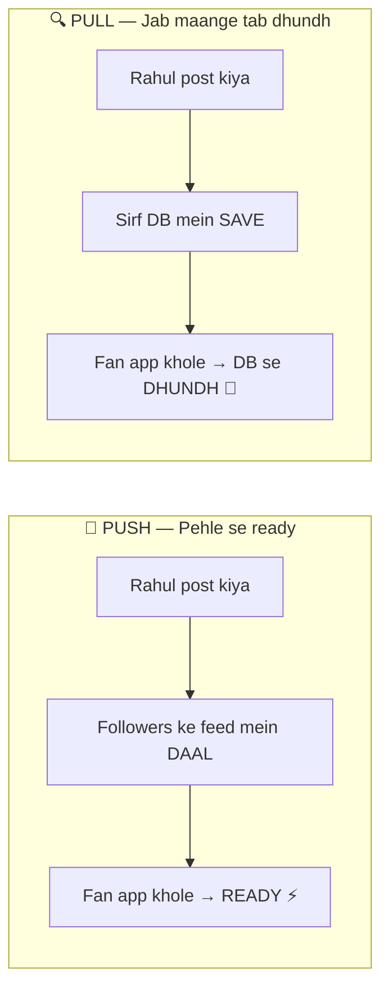
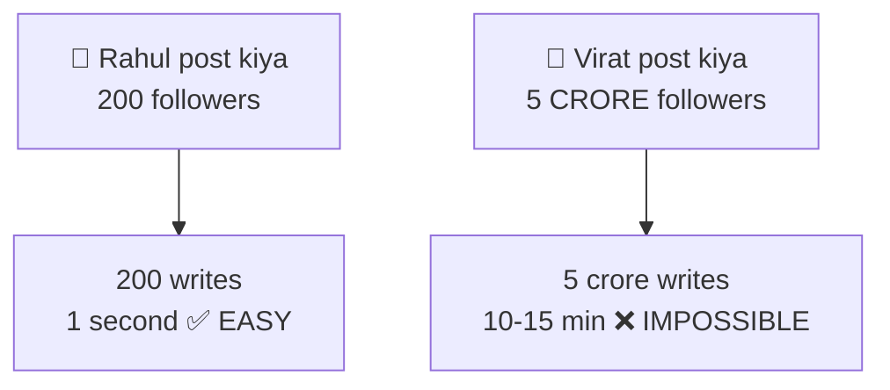
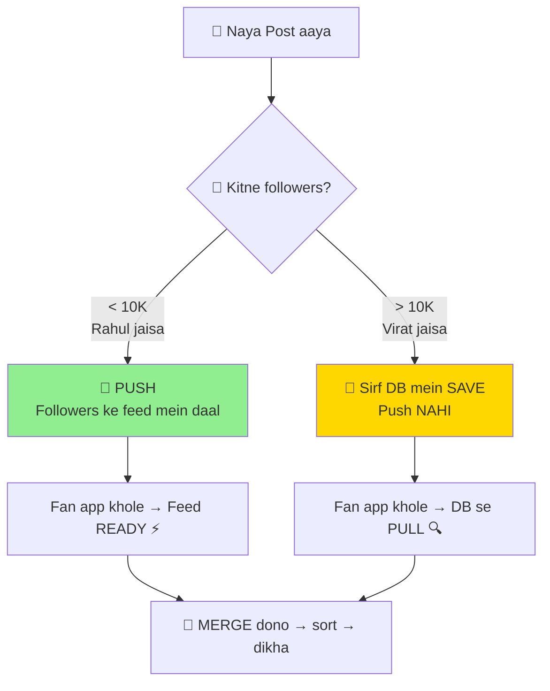
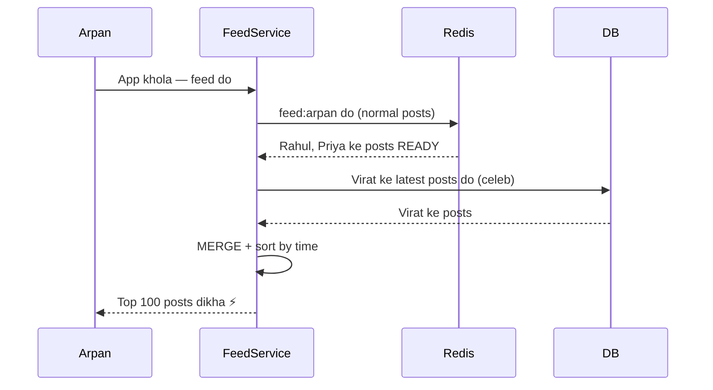
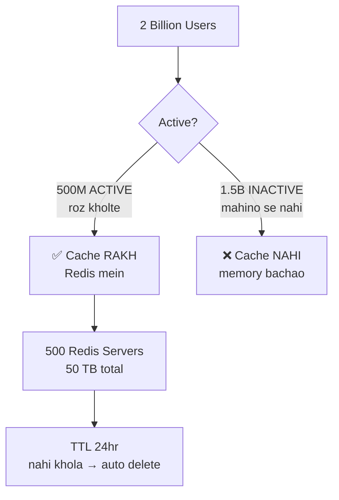
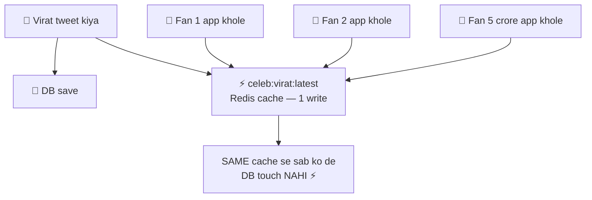
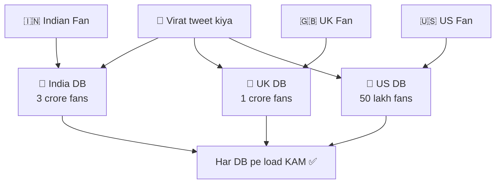
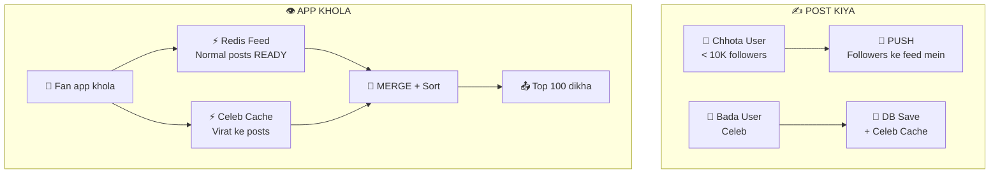

# HLD 05: Twitter Feed (Timeline)
### By Arpan Maheshwari

---

## KYA KARNA HAI?
```
Tu Instagram/Twitter kholta → posts dikhti
Jo follow kiya unki posts — sorted, fast

Tu 500 log follow karta
Sab milake 10,000 posts/day
Tujhe TOP relevant dikhane — fast
```

---

## FEED KYA HAI?

```
Feed = ek LIST. Bas. ArrayList jaisa.

ArrayList<Post> feed = new ArrayList<>();

feed = [
  { Rahul: "nayi bike", time: 12:05 },
  { Priya: "beach trip", time: 12:03 },
  { Amit: "new job", time: 12:01 }
]

Ye list REDIS mein stored hai:
  KEY:   "feed:arpan"
  VALUE: [ Rahul ki post, Priya ki post, Amit ki post ]

Tu app kholta → Redis se ye list le → dikha do. YEHI FEED HAI.
```

---

## "FEED MEIN DAAL" KA MATLAB?

```
Rahul ne post kiya: "nayi bike"

System kya karta:
  Rahul ke followers kaun? → Arpan, Priya, Amit

  Redis mein jaake:
    "feed:arpan" ki list mein ADD → { Rahul: "nayi bike" }
    "feed:priya" ki list mein ADD → { Rahul: "nayi bike" }
    "feed:amit"  ki list mein ADD → { Rahul: "nayi bike" }

  = 3 followers → 3 writes. Done.

Ab Arpan app khole:
  Redis se GET "feed:arpan" → list READY → dikha do
  FAST. Dhundhna nahi. Pehle se pada hai.
```



---

## 2 TARIKE — PUSH vs PULL

```
PUSH (pehle se daal do):
  Rahul post kiya → TURANT followers ke feed mein daal
  Fan app khole → READY hai
  
  WhatsApp jaisa — message AATA hai. Tu dhundhta nahi.

PULL (jab maange tab de):
  Rahul post kiya → sirf DB mein save
  Fan app khole → TAB DB se dhundh ke la
  
  Jaise tu khud restaurant jaake khana leke aaye.
```



---

## VIRAT WALA PROBLEM

```
Rahul ke 200 followers.
Rahul post kiya → 200 logon ke feed mein daal.
200 writes. 1 second. EASY.

Virat ke 5 CRORE followers.
Virat post kiya → 5 crore logon ke feed mein daal?
5 crore writes = 10-15 MINUTE lagega.
System pe BHAARIYA load. PROBLEM.
```



---

## SOLUTION — DB SE FETCH KARO (Tera idea!)

```
Virat ka tweet → PUSH mat kar (5 crore writes bekar)
Virat ka tweet → DB mein SAVE kar bas. 1 write.

Jab fan app khole TAB:
  DB se Virat ke latest tweets le lo
  = PULL. On demand. Jab chahiye tab.

Rule:
  Chhota user (< 10K followers) → PUSH
  Bada user (> 10K followers)   → PULL (DB se jab chahiye)
```



---

## FAN APP KHOLE TAB KYA HOTA?

```
Arpan app khola:
  Step 1: Redis se feed le
          (Rahul, Priya ke posts READY — push se aaye)
  
  Step 2: DB se Virat ke posts le
          (abhi nikale — pull)
  
  Step 3: Dono MIX kar → time se sort → Top 100 dikha

= HYBRID. Push + Pull dono.
```



---

## 2 BILLION USERS KA CACHE? CRASH NAHI?

```
Instagram: 2 billion users
Sab ka cache? = 200 PETABYTE. EK Redis? IMPOSSIBLE.

TRICK — SAB KA CACHE NAHI RAKHTE:

2 billion mein se:
  500 million ACTIVE (roz kholte) → cache RAKH
  1.5 billion INACTIVE (mahino se nahi khola) → cache NAHI

500 million × 100 KB = 50 TB
50 TB / 100 GB per server = 500 Redis servers

500 servers. Manageable.

AUR — TTL (Time to Live):
  "feed:arpan" → TTL: 24 hours
  Arpan roz kholta → cache refresh
  Koi 7 din se nahi khola → cache AUTO DELETE
  = Memory save
```



---

## CELEBRITY CACHE TRICK

```
Virat ka tweet = SAB ko SAME dikhta.
5 crore log same tweet dekhenge.

Toh 5 crore baar DB query kyun?

TRICK:
  Virat tweet kiya → "celeb:virat:latest" Redis mein cache (1 write)
  5 crore log app khole → SAME cache se le
  DB query ZERO. 1 cache = 5 crore reads serve.

Jaise YouTube video — 10 crore views
Har view pe DB nahi — CDN cache se.
```



---

## REGION WISE SHARDING (Tera idea!)

```
Virat ke 5 crore followers:
  3 crore India
  1 crore UK
  50 lakh US
  50 lakh rest

Region wise DB shard:
  India DB → sirf Indian followers serve
  UK DB → sirf UK followers serve

  India ka user → India DB se Virat ka tweet
  UK ka user → UK DB se

  Har DB pe load KAM. Fast.
```



---

## POORA SYSTEM — EK PICTURE

```
  WRITE (post kiya):
    Chhota user → Push → followers ke Redis feed mein daal
    Bada user → DB save + celeb cache (1 write)

  READ (app khola):
    Redis se feed (normal posts — push se ready)
    + Celeb cache se (bade users ke posts)
    + MERGE → sort → Top 100 dikha
```



---

## INTERVIEW MEIN YE BOLO (6 lines)
```
1. Hybrid — Push for normal users, Pull for celebrities
2. Feed = Redis Sorted Set — pre-computed list per user
3. Sirf active users ka cache — inactive ka nahi (TTL 24hr)
4. Celebrity cache — 1 write, crore reads serve
5. Region wise sharding — India/UK/US alag DB
6. Merge at read — cache + celeb posts mix → sort → dikha
```

---

*HLD 05 — Twitter Feed | by Arpan Maheshwari*
*"Feed = Redis mein list. Chhota user → push. Bada user → DB se pull + celeb cache. Dono merge → dikha."*
