# Java Backend Quick Revision — 180 Pages in Diagrams
### By Arpan Maheshwari | Padh liya = 180 pages padh liye

---

# GROUP 1: CORE JAVA

---

## 1. OOP — 4 Pillars

### REAL WORLD ANALOGY
Ghar chalane ke 4 core principles sochke dekh:
- **ATM** — button dabao, andar kya hota nahi pata (Encapsulation)
- **Baap ka ghar beta ko free mein** (Inheritance)
- **Rahul — ghar/office/dosto mein alag** (Polymorphism)
- **Zomato — order dabao, delivery process nahi pata** (Abstraction)
OOP = ye 4 pillars jo real duniya ki cheezein code mein represent karte.

### YE KYA HAI?
So technically, OOP (Object-Oriented Programming) = programming paradigm jahan code real-world "objects" ke around design hota. 4 pillars = Encapsulation (hiding), Inheritance (reuse), Polymorphism (many forms), Abstraction (what-not-how). Java FULL OOP language.

### Encapsulation — ATM Machine
```java
ATM machine:
  Andar circuit, password, cash — tujhe nahi pata
  Tu sirf BUTTON dabata

  private fields + public methods = Encapsulation

  class ATM {
      private int cash;        ← tu access nahi kar sakta
      public void withdraw()   ← tu sirf ye use karta
  }
```

### Inheritance — Baap ka Ghar
```java
Tera baap ke paas ghar, gaadi
Tu paida hua → tujhe bhi mil gaya — bina mehnat

  class Papa { String ghar = "3BHK"; }
  class Tu extends Papa {
      // ghar already hai — inherit hua
  }
```

### Polymorphism — Tera Dost Rahul
```java
Rahul:
  Ghar pe → seedha, shareef
  Dosto ke saath → masti, alag
  Office mein → professional, alag

SAME naam "Rahul" — ALAG behavior

  shape.draw() → Circle toh circle, Square toh square
  Same method naam, alag kaam
```

### Abstraction — Zomato Order
```java
Tu "Order" dabata
Tujhe pata nahi:
  Restaurant ko kaise gaya
  Delivery boy kaise assign
  Payment kaise process

WHAT dikha (button), HOW chhupa = Abstraction
```

### Runnable Code — All 4 Pillars

```java
// === ENCAPSULATION ===
class ATM {
    private int cash = 50000;
    private String pin = "1234";
    
    public boolean withdraw(String inputPin, int amount) {
        if (!pin.equals(inputPin)) return false;
        if (amount > cash) return false;
        cash -= amount;
        return true; // andar kya hua tujhe nahi pata
    }
    public int getBalance(String inputPin) {
        return pin.equals(inputPin) ? cash : -1;
    }
}

// === INHERITANCE ===
class Papa {
    String ghar = "3BHK";
    void blessings() { System.out.println("Khush reh beta"); }
}
class Beta extends Papa {
    // ghar + blessings() FREE mein mila — bina mehnat
    void show() { System.out.println("Ghar: " + ghar); }
}

// === POLYMORPHISM ===
class Shape {
    void draw() { System.out.println("Drawing Shape"); }
}
class Circle extends Shape {
    @Override void draw() { System.out.println("Drawing Circle"); }
}
class Square extends Shape {
    @Override void draw() { System.out.println("Drawing Square"); }
}
// Shape s = new Circle(); s.draw() → "Drawing Circle" (Runtime decide)

// === ABSTRACTION ===
abstract class Zomato {
    abstract void prepareFood();    // HOW = hidden
    abstract void assignDelivery(); // HOW = hidden
    
    public void placeOrder() {      // WHAT = visible
        prepareFood();
        assignDelivery();
        System.out.println("Order placed!");
    }
}
class PizzaHut extends Zomato {
    void prepareFood() { System.out.println("Making Pizza"); }
    void assignDelivery() { System.out.println("Sending Rider"); }
}
// new PizzaHut().placeOrder(); → user ko sirf "Order placed" dikha
```

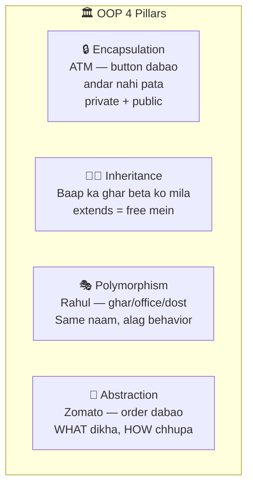

---

## 2. String Pool

### REAL WORLD ANALOGY
School ka ek naam board — "DPS" likha ek board pe. Sab students USE karte — apna alag board nahi banate. Agar har student alag board banaye = waste. Ek shared board = memory efficient. `new String()` = zabardasti apna alag board banana (faltu).

### YE KYA HAI?
So technically, String Pool = JVM ke heap ke andar ek special area jahan Java strings ko **deduplicate** karke rakhta. `String s = "Arpan"` likha → Java pehle pool check karta "Arpan hai kya?" → hai toh SAME reference de deta, nahi toh naya banake pool mein rakhta. `new String("Arpan")` = pool skip karke heap mein ALAG object.

### KYUN CHAHIYE?
- **Memory bachao** — "Arpan" 1000 jagah use → sirf EK object pool mein
- String HAMESHA use hoti — hardcoded literals ("name", "OK", "ERROR")
- Duplicate objects = memory waste → String pool = reuse
- Performance boost — identical strings ka `==` fast check

### NAHI HUA TO KYA HOGA?
- Har `String s = "X"` **naya object** banta → heap full → **OutOfMemoryError**
- 1 crore "INFO" log statements = 1 crore objects → JVM crash
- `s1 == s2` comparison unpredictable (kabhi true, kabhi false)
- Old Java code mein yahi issue tha → String pool aaya

```java
  String s1 = "Arpan";
  String s2 = "Arpan";
  Java: "Arpan" pehle se hai. SAME de deta."
  s1 == s2 → TRUE (same object)

  String s3 = new String("Arpan");
  "new" bola → NAYA bana diya zabardasti
  s1 == s3 → FALSE (alag object)
  s1.equals(s3) → TRUE (value same)

RULE: == object check. .equals() value check.
      HAMESHA .equals() use karo.
```

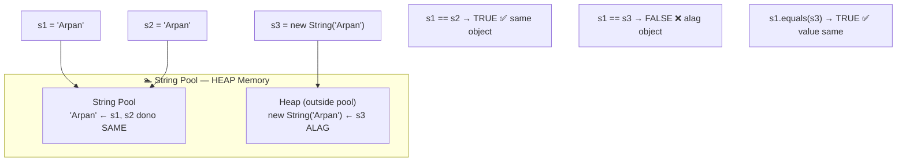

```java
String vs StringBuilder vs StringBuffer:
  String       = Immutable. Har change = naya object. Loop = waste.
  StringBuilder = Mutable. Fast. Thread safe NAHI.
  StringBuffer  = Mutable. Slow. Thread safe HAI.
  
  Loop mein concatenation? → StringBuilder
  Multi-threaded? → StringBuffer
  Normal use? → String
```

---

## 3. static keyword — Sab Share Karte

### REAL WORLD ANALOGY
School mein 1000 students. Sab ka school naam SAME — "DPS". Har student ke ID card pe 1000 baar "DPS" print karo = waste of ink, waste of memory. School ka naam ek hi jagah likha school gate pe — sab students us board se SHARE karte.

### YE KYA HAI?
So technically, `static` = class-level member (field/method/block) jo sab instances SHARE karte, ek baar memory mein hai. Object banane ki zaroorat nahi — `Math.sqrt(25)` direct call. `this` nahi milta static method mein (kyunki object bana hi nahi).

```java
School mein sab students ka school naam SAME — "DPS".
Har student mein alag store = BEKAR. 1000 baar "DPS".

static = class ka. Sab SHARE. Ek baar memory.

  class Student {
      static String school = "DPS";  ← sab ka SAME
      String name;                    ← har ek ka APNA
  }
  
  Student.school → bina object banaye access
  Math.sqrt(25) → bina new Math() ke

static method mein "this" nahi.
  Kyun? this = object ka reference. Static = object bana hi nahi.
```

---

## 4. final keyword — 3 Jagah LOCK

### REAL WORLD ANALOGY
Ghar ka address card — likha hua, ink mein — **final variable**. Change nahi kar sakta.
Dadaji ka fixed rule ("9 baje pehle ghar aao") — beta override nahi karega — **final method**.
Royal family ka title "King" — aap inherit karke "King Jr" nahi bana sakte — **final class**.

### YE KYA HAI?
So technically, `final` = Java ka LOCK keyword. 3 jagah lagta aur har jagah LOCK ka matlab alag: variable pe lagaya = value reassign NAHI, method pe = override NAHI, class pe = extend NAHI. Ek bar "final" bola = pathar pe lakeer.

### KYUN CHAHIYE?
- **Constants banane ke liye** — `final int MAX_USERS = 100;`
- **Security** — sensitive class extend nahi karne dena (String is final)
- **Thread safety** — final fields auto-synchronized across threads
- **Optimization** — JVM final methods ko inline kar sakta

### NAHI HUA TO KYA HOGA?
- Koi bhi code `MAX_USERS = 999` kar dega → **constant ka matlab khatam**
- String class final nahi → koi `EvilString extends String` bana ke security bypass kar sakta
- Multi-threaded bug — non-final fields visibility issue
- Immutable class banana impossible (`final class` nahi to extend karke mutable bana sakta)

```java
1. final VARIABLE = value lock
   final int PI = 3.14;
   PI = 4; → ERROR. Badal nahi sakta.
   
   TRAP: final List → reference lock, andar NAHI.
   list.add("OK") → ✓ (andar badla)
   list = new ArrayList() → ✗ (reference nahi badlega)
   Ghar ka address final — furniture rearrange OK.

2. final METHOD = override lock
   Papa ne bola "ye rule FIXED." Beta badle nahi.

3. final CLASS = extend lock
   final class String → MyString extends String → ERROR.
```

---

## 5. this vs super + Constructor Chaining

### REAL WORLD ANALOGY
`this` = "MERA ghar" — apna reference. `super` = "PAPA ka ghar" — parent reference. Ghar mein dono Arpan naam ke — tu apne aap ko "main" bolta (this), papa ko "Papa" bolta (super) — confusion nahi.
Constructor chaining = call center ka IVR — "Press 1 for basic info, 2 for full details" — sab option ek root menu pe delegate. 3 alag flows alag likhne ki zaroorat nahi.

### YE KYA HAI?
So technically, `this` = current object ka reference, `super` = immediate parent class ka reference. Java ko batata kaunsa field/method chahiye — apna ya parent ka. Constructor chaining = ek constructor doosre ko `this()` ya `super()` se call kare — duplicate init code ek hi jagah rahe.

### KYUN CHAHIYE?
- **Name conflict** resolve — local variable vs instance variable (`this.name = name;`)
- **Parent ka access** — override karne ke baad original behavior chahiye (`super.method()`)
- **Constructor chaining** — code duplication bachao, 3 constructors → ek common mein delegate

### NAHI HUA TO KYA HOGA?
- `this` nahi lagaya → `name = name;` → parameter ko parameter mein assign → **instance field never set**
- `super()` bhool gaye → parent ka default constructor fail → compile error
- Constructor chaining nahi → 3 constructors mein SAME init code → DRY violation, bug ek jagah fix karo baki bhool jao

```java
this = APNA. super = BAAP.

  class Dog extends Animal {
      this.name  → "Dog" (apna)
      super.name → "Animal" (baap ka)
  }

Constructor Chaining:
  Student(name) { this(name, 18); }          ← doosra call
  Student(name, age) { this(name, age, "Java"); } ← teesra
  Student(name, age, course) { /* actual */ }

  this() ya super() = PEHLI LINE.
  Dono ek saath NAHI. COMPILE ERROR.
```

---

## 6. Access Modifiers — Ghar ki Privacy

### REAL WORLD ANALOGY
Tere ghar ke 4 zones — privacy ka level alag alag:
- **BEDROOM** — sirf tu. Koi entry nahi. = `private`
- **DRAWING ROOM** — padosi aa sakte (same society). = `default` (package-private)
- **RELATIVES ka room** — padosi + rishtedar jo family line mein hain. = `protected`
- **DUKAN** — sadak pe open, koi bhi aaye. = `public`

Rule: sabse strict (bedroom) se start karo, zaroorat pade toh loosen karo.

### YE KYA HAI?
So technically, access modifiers = Java ke 4 keywords (`private`, default, `protected`, `public`) jo decide karte kaunsa class/method/field kahan se access kiya ja sakta. Yahi encapsulation ka foundation — internal state chhupao, controlled access do.

### KYUN CHAHIYE?
- **Encapsulation** — internal state chhupao, sirf safe methods expose
- **Security** — password/balance jaise fields bahar se access block
- **Maintenance** — private = future mein change safe (koi bahar use nahi kar raha)
- **API design** — user sirf required methods dekhe, internal complexity hide

### NAHI HUA TO KYA HOGA?
- Sab **public** kar diya → koi bhi `account.balance = -1000000` → **disaster**
- Internal helper method bhi public → user galti se call karega → inconsistent state
- Future refactor impossible — method rename kiya → 100 jagah break (sab public use kar rahe)
- **Security holes** — password field public → plain text accessible

```java
private   = BEDROOM. Sirf tu. Same class only.
default   = DRAWING ROOM. Padosi (same package).
protected = RELATIVES. Padosi + rishtedar (subclass).
public    = DUKAN. Koi bhi aaye.

  private → default → protected → public
  STRICT ←────────────────────→ OPEN
  
  Rule: SABSE STRICT pehle. Zaroorat ho toh badhao.
```

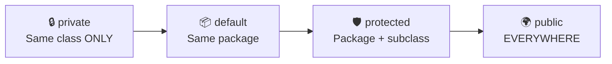

---

## 7. abstract keyword — Menu Card

### REAL WORLD ANALOGY
Restaurant ka menu card — "Pasta" likha hai, but kaunsa? Red sauce? White sauce? Pink sauce? Menu card khud nahi banata — **chef (child class)** decide karega recipe. Menu bolta "ye item hona chahiye" — chef deliver karta.
Menu card se seedha khana nahi kha sakte — chef chahiye. Wahi abstract class — directly instantiate nahi, child chahiye.

### YE KYA HAI?
So technically, `abstract class` = partially built blueprint. Kuch methods body ke saath (common logic), kuch sirf signature (child implement karega). `new Shape()` = ERROR (menu card khud dish nahi). Abstract = "KYA HAI" (IS-A relationship). Interface = "KYA KAR SAKTA" (CAN-DO contract).

### KYUN CHAHIYE?
- **Template pattern** — parent bole "ye method hona chahiye" — implementation child pe chhod
- **Partial implementation** — kuch methods concrete (common), kuch abstract (specific)
- **Prevent instantiation** — `new Shape()` meaningless → force child class
- **Contract** enforce — child MUST implement abstract methods

### NAHI HUA TO KYA HOGA?
- Interface lete → MULTIPLE implement ho jaata BUT common code reuse nahi kar sakta
- Concrete class lete → `new Shape()` possible but area() ka matlab? → **meaningless object**
- Child implement nahi kiya to? Abstract nahi hai → compile pass → runtime pe weird behavior

```java
Menu mein "Pasta" likha. Kaunsa? Recipe child decide.

  abstract class Shape {
      abstract double area();  ← body NAHI
      void display() { }      ← normal bhi OK
  }
  class Circle extends Shape {
      double area() { return 3.14 * r * r; }
  }
  
  new Shape() → ERROR. Menu card se khana nahi kha sakta.
  new Circle() → OK.

Abstract Class = "KYA HAI" (IS-A). Shared code. Ek extend.
Interface = "KYA KAR SAKTA" (CAN-DO). Multiple implement.

TRAP: static abstract → COMPILE ERROR (contradictory).
```

---

## 8. Enum — Fixed Constants

### REAL WORLD ANALOGY
Exam mein 2 question types:
- **MCQ** — options A/B/C/D fixed. "E" likh nahi sakta. Compiler (examiner) reject karega. = Enum.
- **Fill-in-the-blank** — kuch bhi likh sakta. "ABCDE", "xyz", random. Typo bhi accept. = Plain int/String.

MCQ safer — galti sambhav kam. Fixed options = predictable system.

### YE KYA HAI?
So technically, `enum` = Java ka special type jo fixed set of constants represent karta. `PaymentType.CASH`, `PaymentType.CARD`, `PaymentType.UPI` — bas ye 3 valid. Compiler check karta — `PaymentType.EMI` = COMPILE ERROR. Behind the scenes = final class with private constructor + predefined instances.

### KYUN CHAHIYE?
- **Type safety** — `PaymentType.CASH` ≠ random int → compile time check
- **Fixed set of values** — Status (ACTIVE/INACTIVE), Day (MON-SUN) — sirf ye valid
- **Singleton pattern** best way — enum ek JVM mein EK hi instance guarantee
- **Switch case** clean — readability +10x

### NAHI HUA TO KYA HOGA?
- `int status` use kiya → koi `status = 99` set kare → **invalid state** → bug
- `String status = "ACTIVE"` use kiya → typo "ACTVE" compile pass → runtime bug
- Constants class banaye (`public static final int CASH = 1`) → type safety kam
- Singleton manually implement kiya → reflection/serialization attack possible

```java
int type = 1 (CASH). Kisi ne 99 diya → compiler nahi roka → BUG.

  enum PaymentType { CASH, CARD, UPI }
  PaymentType.EMI → COMPILE ERROR. Type safe.

Enum constructor = PRIVATE only.
Enum compare = == use karo (singleton hai).
ordinal() pe depend MAT — order shift hoga.

Singleton best way = Enum.
  enum AppConfig { INSTANCE; }
  JVM guarantee. Reflection safe.
```

---

## 9. Wrapper Classes + Integer Cache

### REAL WORLD ANALOGY
Primitive `int` = **open paani** — seedha jug mein, no packaging, label nahi, supermarket shelf pe rakh nahi sakte.
Integer wrapper = **bottled water** — label, brand, barcode, shelf pe rakhne ke liye ready.
Supermarket (Collections) mein sab item **packaged/bottled** chahiye — tabhi ja sakta. `List<int>` = open paani shelf pe = ERROR. `List<Integer>` = bottled = OK.

### YE KYA HAI?
So technically, wrapper classes (`Integer`, `Long`, `Double`, `Boolean`...) = primitives ko object banane wali classes. Java generics sirf objects ke saath kaam karti (type erasure reason) — isliye primitives ko wrap karna padta. Autoboxing = Java khud `int → Integer` convert kar deta. Integer Cache = -128 se 127 tak Integer objects pre-created pool mein hain (performance).

### KYUN CHAHIYE?
- **Collections support** — `List<int>` ERROR. `List<Integer>` OK (generics sirf objects)
- **Null value** — primitive `int` NULL nahi ho sakta, `Integer` ho sakta
- **Utility methods** — `Integer.parseInt()`, `Integer.MAX_VALUE`, `.compare()`
- **Autoboxing** — Java khud convert karta → syntactic sugar

### NAHI HUA TO KYA HOGA?
- Collections use nahi kar sakte — `ArrayList<int>` compile error
- Database column NULL → primitive `int` mein map nahi hoga → NPE-like issue
- `==` use kiya on Integer → **-128 to 127 TRUE, 128+ FALSE** (Integer cache bug)
- Old Java code pre-autoboxing → manual `Integer.valueOf(10)` har jagah → ugly

```java
int = primitive. Dabba mein seedha value.
Integer = wrapper. Gift wrap mein value.

Collections mein primitive nahi jaata:
  List<int> → ERROR
  List<Integer> → OK

Java khud convert karta:
  Integer a = 10;  ← Autoboxing (Java ne kiya Integer.valueOf(10))
  int b = a;       ← Unboxing (Java ne kiya a.intValue())

TRAP — Integer Cache:
  Integer a = 127; Integer b = 127;
  a == b → TRUE ✓ (cache se SAME object)
  
  Integer a = 128; Integer b = 128;
  a == b → FALSE ✗ (cache BAHAR — naya object)
  
  -128 to 127 = cache. Bahar = naya object.
  HAMESHA .equals() use karo.
```

---

## 10. Immutable Class — Bank Cheque

### REAL WORLD ANALOGY
Bank **cheque** — ek baar ink mein ₹5000 likha → mitate nahi, naya cheque banate. Old cheque evidence mein rehta. Cheque pe "cancel" lagao → naya issue karo. Kabhi overwrite nahi.
Mutable = **pencil notes** — likho, mitao, badal lo. Immutable = **ink signature** — FINAL, permanent.
HashMap key mein mutable object = pencil se likhi key → tu badla diya → system confused, kahan rakha tha ab bhool gaya.

### YE KYA HAI?
So technically, immutable class = woh class jiska object ek baar banne ke baad STATE change NAHI ho sakti. `String`, `Integer`, `LocalDate` — sab immutable. Change chahiye? Naya object banao. 4 rules: `final class` + `private final` fields + no setters + constructor se init. Defensive copy for mutable fields (List, Date).

### KYUN CHAHIYE?
- **Thread safe by default** — state change nahi hoti → no race condition, no lock needed
- **HashMap key** ke liye perfect — key change ho gayi → hashCode mismatch → lookup fail
- **Caching safe** — value change nahi hogi → cache invalidation nahi
- **Secure** — parameter pass kiya → koi modify nahi kar sakta → defensive copy nahi chahiye

### NAHI HUA TO KYA HOGA?
- **Mutable class as HashMap key** → put karne ke baad key change → `map.get(key)` returns null (SILENT bug!)
- Multi-threaded mein share kiya → race condition → corrupted state
- Parameter pass kiya → callee ne modify kar diya → caller confused → **hard-to-find bug**
- Cache mein store kiya → original object modify → cache stale

```java
Ek baar likha — badal nahi sakta. Naya banao.

4 RULES:
  1. final class         ← extend nahi
  2. private final fields ← access/reassign nahi
  3. No setters          ← badalne ka raasta nahi
  4. Constructor se set  ← banate waqt value do

TRAP: List field hai toh DEFENSIVE COPY:
  Constructor: this.list = new ArrayList<>(list);
  Getter: return new ArrayList<>(this.list);
  Nahi toh reference se andar badal lega.
```

---

## 11. instanceof + Type Casting

### REAL WORLD ANALOGY
Zoo ka guard — naya animal aaya, label missing. Guard ka kaam: "DOG hi enclosure 5 mein bhejna." Guard pehle CHECK karta — "Ye dog hai?" → haan → enclosure 5. Nahi → "Ye kuch aur hai, wrong enclosure bhejunga to chaos."
Bina check forcefully dog enclosure mein cat daal diya → cat ne meow mara → dogs confused → zoo CRASH. Yahi `ClassCastException`.

### YE KYA HAI?
So technically, `instanceof` = runtime type check operator. `obj instanceof Dog` → true/false batata. Type casting = ek type se doosre mein convert. Upcasting (child → parent) auto + safe. Downcasting (parent → child) manual + risky — isliye pehle `instanceof` check. Java 16+ pattern matching: `if (a instanceof Dog d)` — check + cast ek line.

### KYUN CHAHIYE?
- **Safe downcasting** — `Animal a = new Dog(); Dog d = (Dog) a;` — pehle check karo
- **Polymorphism runtime check** — list mein Animal hain, sirf Dogs pe kaam
- **API design** — received object ka actual type check karke decision
- Java 16+ **pattern matching**: `if (a instanceof Dog d)` — check + cast ek line mein

### NAHI HUA TO KYA HOGA?
- Bina check directly `Dog d = (Dog) a;` → agar `a` Cat nikla → **ClassCastException CRASH**
- Runtime error — compile time pass, production pe crash
- Null object pe instanceof → FALSE return hota (safe) → null check redundant nahi
- Legacy code mein **reflection** use karte the — slow + ugly. instanceof clean way.

```java
Zoo mein guard: "Jo DOG hai wo bhonko."
Pehle CHECK — ye dog hai ya nahi?

  a instanceof Dog → TRUE/FALSE

Upcasting (Child → Parent):
  Animal a = new Dog();  ← AUTOMATIC. Safe.
  a.bark() → ERROR. Animal mein bark nahi.
  
Downcasting (Parent → Child):
  Dog d = (Dog) a;  ← MANUAL. Risky.
  
  SAFE: if (a instanceof Dog) { Dog d = (Dog) a; }
  
  Bina check? → ClassCastException CRASH.
```

---

## 12. Pass by Value

### REAL WORLD ANALOGY
Dost ko apni notebook ki **PHOTOCOPY** di. Dost ne photocopy pe likha — teri original SAFE.
Lekin agar teri notebook ka ADDRESS (locker number) diya — dost usi locker ka address use karke SAME notebook pe likh sakta → teri notebook badal jaayegi.
Java mein: primitive = photocopy (value copy). Object = address ki photocopy (reference copy — same object point karte).

### YE KYA HAI?
So technically, Java = HAMESHA pass by value. Primitive case: actual value ki copy pass. Object case: **reference ki copy** pass (dono reference same object ko point karte). `s.name = "X"` = same object modify → original bhi badla. `s = new Student()` = sirf copy ne naya point kiya → original safe. Pass-by-reference Java mein EXIST NAHI KARTA.

```java
Dost ko apni notebook ki PHOTOCOPY di.
Dost ne photocopy pe kuch likha.
Teri ORIGINAL notebook SAFE.

Java = HAMESHA pass by value.
  Primitive: actual value ki copy. Original safe.
  Object: reference ki COPY. Dono SAME object point.
  
  s.name = "X" → andar change → original BHI badla (same object)
  s = new Student() → sirf COPY ne naya point kiya → original SAFE
```

```java
// CASE 1: Primitive — value ki copy. Original SAFE.
public static void changePrimitive(int x) {
    x = 100; // sirf COPY badli
}
int a = 10;
changePrimitive(a);
System.out.println(a); // 10 — ORIGINAL SAFE

// CASE 2: Object — reference ki copy. SAME object point karte.
public static void changeObject(Student s) {
    s.name = "Changed"; // SAME object modify — original BHI badla
}
Student s1 = new Student("Arpan");
changeObject(s1);
System.out.println(s1.name); // "Changed" — ORIGINAL BADAL GAYA

// CASE 3: Object reassign — sirf COPY ne naya point kiya.
public static void reassignObject(Student s) {
    s = new Student("New"); // COPY ne naya point kiya, original SAFE
}
Student s2 = new Student("Arpan");
reassignObject(s2);
System.out.println(s2.name); // "Arpan" — ORIGINAL SAFE
```

```mermaid
graph TD
    subgraph PRIM["Case 1: Primitive"]
        A1["a = 10"] -->|"copy"| B1["x = 10"]
        B1 -->|"x = 100"| C1["a still 10 -- SAFE"]
    end
    subgraph OBJ["Case 2: Object modify"]
        A2["s1 -----> Student(Arpan)"] -->|"copy ref"| B2["s -----> SAME Student"]
        B2 -->|"s.name = Changed"| C2["s1.name = Changed -- BADLA"]
    end
    subgraph REASSIGN["Case 3: Object reassign"]
        A3["s2 -----> Student(Arpan)"] -->|"copy ref"| B3["s -----> Student(Arpan)"]
        B3 -->|"s = new Student"| C3["s2 still Arpan -- SAFE"]
    end
```

---

## 13. Exception Handling

### REAL WORLD ANALOGY
Restaurant mein kitchen fire lag gayi:
- **try** = risky operation (gas stove chalaya)
- **catch** = fire extinguisher + alarm (emergency response)
- **finally** = restaurant band karte waqt gas off, light off, AC off — **HAMESHA** karna, fire ho ya na ho
- **throw** = bhai chhota fire nahi sambhal raha, manager ko bula (propagate upward)

Bina fire response plan = crash (restaurant burn). Controlled response = safe exit, customers protected.

### YE KYA HAI?
So technically, Exception Handling = Java ka mechanism jo runtime errors ko gracefully handle karta. 2 types: **Checked** (compile-time force, IOException) aur **Unchecked** (runtime surprise, NullPointerException). `try-catch-finally` block + `throw`/`throws` keywords. Java 7+ `try-with-resources` auto-close karta.

### KYUN CHAHIYE?
- **Graceful failure** — crash ke bajaye controlled error response
- **Resource cleanup** — file/connection close (try-with-resources)
- **User-friendly errors** — "File not found" vs stack trace dump
- **Debugging** — root cause pata chale (stack trace + custom messages)

### NAHI HUA TO KYA HOGA?
- Exception catch nahi kiya → **application crash** → user confused, data loss
- Checked exception declare nahi → **compile fail**
- Finally block nahi → file open rehti → **file handle leak** → "Too many open files" error
- Generic `catch (Exception e)` → bug hide ho jaata, specific handling nahi

```java
Checked = Compiler ka darwaan. Handle karo ya declare karo.
  IOException, FileNotFoundException.
  
Unchecked = Runtime ka dhoka. Compiler nahi pakdta.
  NullPointerException, ArrayIndexOutOfBounds.

try { risky } catch { handle } finally { HAMESHA — cleanup }
  finally HAMESHA chalta. Sirf System.exit() rokta.
  
TRAP: finally mein return mat likho — try ka return overwrite ho jaata!
```

```java
// === TRY-CATCH-FINALLY ===
public class ExceptionDemo {
    public static void main(String[] args) {
        // 1. Basic try-catch-finally
        try {
            int result = 10 / 0; // ArithmeticException
        } catch (ArithmeticException e) {
            System.out.println("Caught: " + e.getMessage());
        } finally {
            System.out.println("HAMESHA chalta — cleanup yahan");
        }

        // 2. Multi-catch
        try {
            String s = null;
            s.length(); // NullPointerException
        } catch (NullPointerException | ArrayIndexOutOfBoundsException e) {
            System.out.println("Caught: " + e.getClass().getSimpleName());
        }

        // 3. try-with-resources (auto close)
        try (var br = new java.io.BufferedReader(
                new java.io.FileReader("file.txt"))) {
            System.out.println(br.readLine());
        } catch (java.io.IOException e) {
            System.out.println("File issue: " + e.getMessage());
        }
        // br.close() AUTOMATICALLY — finally ki zaroorat nahi

        // 4. Custom Exception
        // throw new UserNotFoundException("User 101 not found");
    }
}

class UserNotFoundException extends RuntimeException {
    public UserNotFoundException(String msg) { super(msg); }
}

// TRAP: finally mein return — TRY ka return OVERWRITE ho jaata!
// public int test() {
//     try { return 1; }
//     finally { return 2; } // 2 return hoga — KABHI mat likh!
// }
```

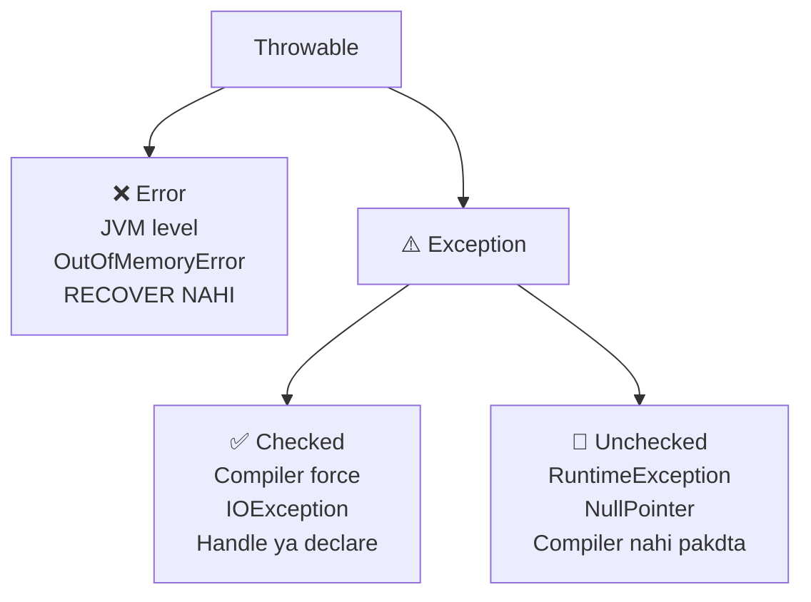

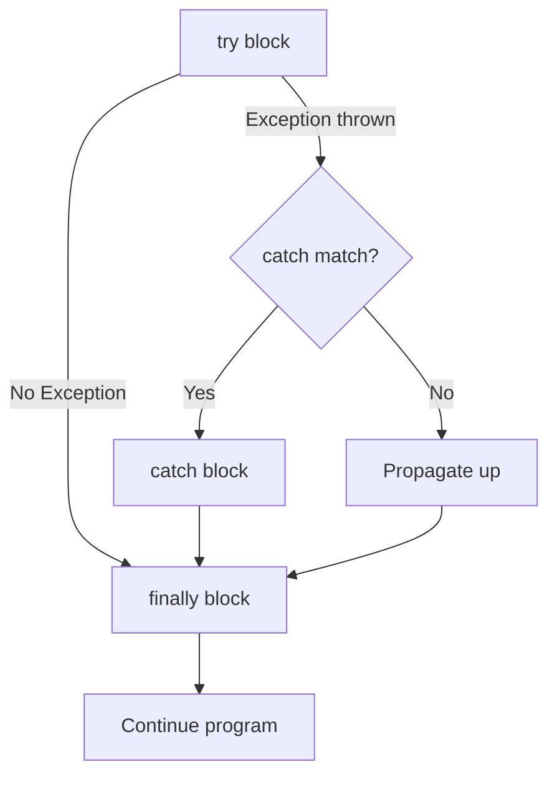

---

## 14. Overloading vs Overriding

### REAL WORLD ANALOGY
**Overloading** = Chef ka menu — "Maggi" do tareeke se banta: `maggi()` plain, `maggi(eggs)` with egg, `maggi(eggs, cheese)` deluxe. SAME chef, SAME name, different ingredients (parameters). Order ke time chef decide karega.

**Overriding** = Papa ka rule "9 baje ghar aao." Beta bada hua, **apna version** — "10 baje tak chalega." SAME rule name, different implementation. Runtime pe kaun execute karega depend on kaun object (papa ya beta).

### YE KYA HAI?
So technically:
- **Overloading** = SAME class mein SAME method name but different parameters. Compile-time decide. Polymorphism ka compile-time form.
- **Overriding** = CHILD class mein parent ka method SAME signature ke saath rewrite. Runtime decide. Polymorphism ka runtime form. `@Override` annotation use karo — typo bug bachaoge.

### KYUN CHAHIYE?
- **Overloading** — user friendly API: `print(int)`, `print(String)`, `print(Object)` sab ek hi naam
- **Overriding** — polymorphism ka base: parent type reference se child behavior
- **Code reuse** — parent generic, child specialized
- **Runtime flexibility** — list mein Animals, runtime pe har ek apna sound nikale

### NAHI HUA TO KYA HOGA?
- Overloading nahi → har param type ke liye alag naam (`printInt`, `printString`, `printObject`) → **ugly API**
- Overriding nahi → parent ka generic behavior sab jagah → **child specialization impossible**
- `@Override` bhoola → typo kiya to method name → naya method banega → override nahi hoga → **silent bug**
- Private method override nahi hota — samjha nahi → subclass mein rewrite → confusion

```java
Overloading = SAME class. SAME naam. ALAG params. Compile time.
  send(msg)
  send(msg, phone)
  send(msg, email, priority)
  Compiler decide kaunsa chale.

Overriding = CHILD class. SAME naam. SAME params. Runtime.
  Employee.bonus() → 10%
  Manager.bonus() → 25% (override)
  Runtime decide kaunsa chale.

@Override HAMESHA lagao — typo compiler pakdega.

TRAPS:
  Private method override NAHI hota.
  Static method override NAHI (hide hota).
```

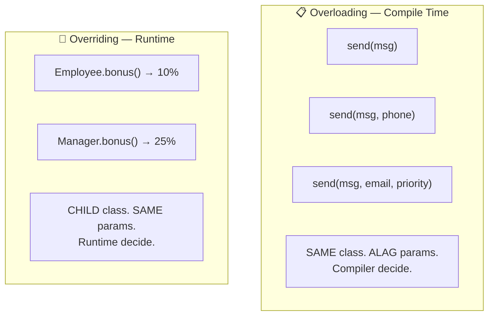

---

## 15. Collections Framework

### REAL WORLD ANALOGY
**Array** = steel ka dabba. Size fix — 10 items ka banaya toh 11va item daalne pe DABBA PHUT. Fixed size, no flexibility.
**Collections** = rubber ka dabba. Item daalo, dabba khud stretch hota. 10 se 100 ho jaaye — automatic.
Alag types (List, Set, Map, Queue) = alag shape ke dabbe (tiffin, water bottle, lunchbox) — use case ke hisab se choose karo.

### YE KYA HAI?
So technically, Collections Framework = `java.util` package ke andar built-in dynamic data structures — List, Set, Queue, Map. Interfaces + concrete classes (ArrayList, HashSet, HashMap, etc.) ka hierarchy. Auto-resize, iteration support, utility methods (`Collections.sort`, etc.).

```java
Array = dabba. Fixed size. 11vi item? CRASH.
Collections = rubber dabba. Khud bada hota.
```

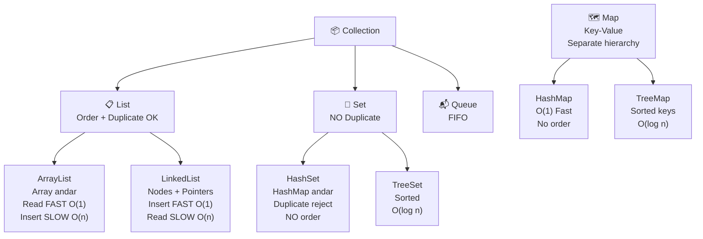

```java
ArrayList:
  Andar Array hai. Default size 10.
  Full hua → 1.5x naya array → purana copy.
  get(index) = O(1) FAST. Beech mein insert = O(n) SLOW (shift).
  
LinkedList:
  Nodes + pointers. Har node: prev | data | next.
  Insert/delete = O(1) FAST (pointer change).
  get(index) = O(n) SLOW (traverse).
  
  READ zyada → ArrayList. INSERT zyada → LinkedList.
  Real world mein 90% ArrayList better (cache friendly).

HashSet:
  Andar HashMap hai. Element = key. Value = dummy.
  Same key dobara? Replace. Isliye duplicate NAHI.
  Custom class mein hashCode() + equals() DONO override karo.
  Sirf equals()? → alag bucket → duplicate aa jaayega.

Comparable vs Comparator:
  Comparable = class ke ANDAR. compareTo(). EK rule.
  Comparator = class ke BAHAR. compare(). MULTIPLE rules.
  Integer.compare() use karo — overflow safe.
```

---

## 16. Collections Utility Class

### REAL WORLD ANALOGY
**Swiss Army Knife** — ek chhota dabba, andar 20+ tools: bottle opener, scissors, knife, file, screwdriver. Kitchen ke liye alag cutlery box kholne ki zaroorat nahi — ek hi tool sab kaam.
Manually sort likhna = kitchen mein **patthar se subzi katna** — technically possible but stupid. Swiss Army Knife (`Collections.sort`) use kar — 1 line, Tim Sort hybrid already optimized, bug-free.

### YE KYA HAI?
So technically, `Collections` (note: plural) = `java.util` ka utility class with **static methods** for common operations on collections — sort, reverse, shuffle, min, max, frequency, unmodifiable wrappers. Internal sort algo = Tim Sort (merge + insertion hybrid, O(n log n)). `Comparator.thenComparing()` = chained sort.

### KYUN CHAHIYE?
- **Ready-made algorithms** — sort, reverse, shuffle, min, max — manually implement karne ki zaroorat nahi
- **DRY** — har developer Collections.sort() use kare, apna algorithm nahi likhe
- **Optimized** — internal Tim Sort (merge + insertion hybrid) — O(n log n)
- **Unmodifiable wrappers** — read-only views banana easy

### NAHI HUA TO KYA HOGA?
- Manually sort likhte → bugs, edge cases miss → wheel reinvent
- `unmodifiableList()` nahi hota → parameter pass kiya → callee modify kar de → **bug**
- `thenComparing()` nahi → multi-level sort ugly code (nested if-else or manual compareTo)
- `frequency()`, `min()`, `max()` manually → 5 line ka code har jagah

```java
Collections class = toolkit for collections.
  Sort, reverse, shuffle, min, max, frequency — sab ready-made.

TRAP: Collections.unmodifiableList(list)
  WRAPPER banta. Original badla → wrapper BHI badla.
  Deep copy NAHI. Sirf wrapper read-only.
  
thenComparing() = chained sorting.
  Pehle city se sort, phir age se, phir name se.
  Multi-level sorting ek line mein.
```

```java
import java.util.*;
import java.util.stream.*;

public class CollectionsUtilDemo {
    public static void main(String[] args) {
        List<Integer> nums = new ArrayList<>(List.of(5, 3, 8, 1, 9, 3));

        // === Basic Utility Methods ===
        Collections.sort(nums);     // [1, 3, 3, 5, 8, 9]
        Collections.reverse(nums);  // [9, 8, 5, 3, 3, 1]
        Collections.shuffle(nums);  // random order
        
        int min = Collections.min(nums);        // 1
        int max = Collections.max(nums);        // 9
        int freq = Collections.frequency(nums, 3); // 2 (3 appears twice)

        // === Unmodifiable List TRAP ===
        List<String> original = new ArrayList<>(List.of("A", "B"));
        List<String> unmod = Collections.unmodifiableList(original);
        // unmod.add("C"); → UnsupportedOperationException
        original.add("C"); // ORIGINAL mein add kiya → unmod mein BHI dikhega!
        System.out.println(unmod); // [A, B, C] — TRAP! Wrapper only!
        
        // SAFE: List.copyOf(original) — Java 10+ true immutable copy

        // === Chained Sorting with thenComparing ===
        List<Employee> emps = List.of(
            new Employee("Arpan", "Delhi", 25),
            new Employee("Rahul", "Delhi", 22),
            new Employee("Amit", "Mumbai", 25),
            new Employee("Zara", "Mumbai", 22)
        );

        List<Employee> sorted = emps.stream()
            .sorted(Comparator.comparing(Employee::getCity)       // 1st: city
                .thenComparing(Employee::getAge)                  // 2nd: age
                .thenComparing(Employee::getName))                // 3rd: name
            .collect(Collectors.toList());
        // Delhi-22-Rahul, Delhi-25-Arpan, Mumbai-22-Zara, Mumbai-25-Amit
    }
}

class Employee {
    String name, city;
    int age;
    Employee(String n, String c, int a) { name=n; city=c; age=a; }
    String getName() { return name; }
    String getCity() { return city; }
    int getAge() { return age; }
}
```

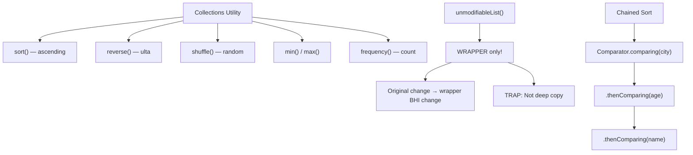

---

## 17. HashMap — Library System

### REAL WORLD ANALOGY
Library — 10,000 books. Tu "Harry Potter" dhundhne aaya:
- **Bina index** — rack 1 dekho, rack 2 dekho... 9,999 rack baad mila. SLOW. = List/Array search O(n).
- **Library index system** — catalog khol, "Harry Potter → Shelf 42" likha mila → seedha shelf 42 jao. FAST. = HashMap O(1).

Library index = HashMap. Rack without labels = plain array.

### YE KYA HAI?
So technically, HashMap yehi karta — key (like "Harry Potter") ko `hashCode()` function se number mein convert karta → array index mila (Shelf 42) → value store/retrieve. `put(key, value)` = index pe store. `get(key)` = same hashCode → same index → value mili. O(1) constant time lookup. Collision (2 keys same index)? → LinkedList, Java 8 mein 8+ items ho gaye toh Red-Black Tree.

### KYUN CHAHIYE?
- **O(1) lookup** — 10 lakh items mein search constant time
- **Key-value storage** — "arpan@email.com" → User object. Direct access.
- **Caching** — Redis jaise in-memory cache ka base concept
- **Frequency count** — `map.getOrDefault(key, 0) + 1` pattern
- Sabse common data structure — interview mein TOP 5 questions HashMap ke

### NAHI HUA TO KYA HOGA?
- List use karte → har lookup **O(n)** → 10 lakh items pe 1 second → user angry
- Linear search → database query slow → API latency high
- `put/get` nahi hota → manually bucket management → bug-prone code
- **HashMap multi-thread** mein → Java 7 tak **infinite loop bug** (resize race) → app hang. Java 8 fix but still not safe — **ConcurrentHashMap** use karo.

```java
Library. 10,000 books.
"Harry Potter" chahiye → ek ek check? SLOW.

Library system:
  "Harry Potter" → Shelf 42 → seedha jao
  = O(1). Instant.

HashMap YEHI karta:
  put("name", "Arpan"):
    "name".hashCode() → number → index → store
  get("name"):
    SAME hashCode → SAME index → "Arpan" mila

COLLISION:
  2 books ka same shelf → LinkedList bana
  Java 8: 8+ items → Red-Black Tree
  O(1) → worst O(log n)
```

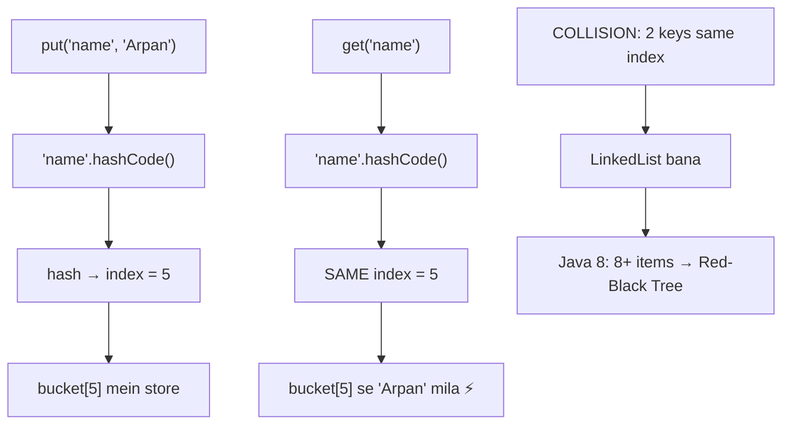

```java
HashMap vs LinkedHashMap vs TreeMap:
  HashMap       = Fast O(1). NO order.
  LinkedHashMap = Fast O(1). INSERTION order maintain.
  TreeMap       = Slow O(log n). SORTED by key.
  
  Speed chahiye? HashMap.
  Order chahiye? LinkedHashMap.
  Sorted chahiye? TreeMap.

TRAP: HashMap null key ALLOWED (1 only).
      TreeMap null key NOT ALLOWED (compareTo crash).
      ConcurrentHashMap null key/value NOT ALLOWED.
```

---

## 18. Multithreading

### REAL WORLD ANALOGY
Restaurant = CPU. Waiter = Thread. Tables = Tasks.
- **1 waiter 100 tables** — sequential, ek ek table, customers timeout, orders late. SLOW.
- **10 waiters parallel** — sab tables ek saath cover, fast service. FAST.
- **2 waiters SAME bill pe likh rahe** — kaun final number? bill corrupt. = **race condition**.
- **Synchronized** = rule "Ek time pe ek waiter hi bill touch kare." Safe but slow.

### YE KYA HAI?
So technically, Multithreading = ek JVM process ke andar multiple threads parallel chalane ki technique. Har thread apna stack, shared heap. Modern CPUs mein 8-16 cores — threads parallel run kar sakte hain. Challenges: race condition (shared data corruption), deadlock (circular waiting), visibility (cache vs main memory). Tools: `synchronized`, `volatile`, `AtomicInteger`, `ExecutorService`.

### KYUN CHAHIYE?
- **Parallel work** — 5 tasks 5 threads mein → 5x fast (ideally)
- **Responsive UI** — heavy task background mein, main thread user input handle kare
- **CPU utilization** — modern CPUs mein 8-16 cores → single thread sirf 1 core use
- **I/O wait bypass** — ek thread DB call par wait, doosra compute → idle time usable

### NAHI HUA TO KYA HOGA?
- Single thread = **1 waiter 100 tables** → sequential → SLOW → user timeout
- Blocking I/O → main thread hang → UI freeze → app unresponsive
- Race conditions (synchronization nahi) → **data corruption** — counter wrong value, bill wrong amount
- Deadlock (wrong lock order) → threads stuck forever → application hang

```java
Restaurant mein EK waiter → 5 table ek ek karke → SLOW.
5 WAITERS → sab PARALLEL → FAST.

Thread = waiter. Multiple threads = fast.
```

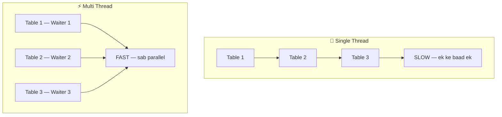

```java
Race Condition:
  2 waiters SAME bill pe likhe → bill CORRUPT
  Fix: synchronized — ek time pe ek thread

volatile vs synchronized vs AtomicInteger:
  volatile     = "Fresh value padh MAIN MEMORY se" (visibility)
                 count++ ke liye NAHI (atomicity nahi)
  synchronized = "Ek time pe ek thread" (visibility + atomicity)
                 SLOW lekin SAFE
  AtomicInteger = Hardware level atomic. count++ safe. FASTEST.

Thread Lifecycle:
  NEW → start() → RUNNABLE → CPU mila → RUNNING
    → wait()/sleep() → BLOCKED/WAITING  
    → notify()/done → RUNNABLE
    → run() complete → DEAD
    
  DEAD thread dobara start() → IllegalThreadStateException

wait() vs sleep():
  sleep() = "Main thak gaya, rest. Lock NAHI chhodunga."
  wait()  = "Main wait kar raha doosre ka. Lock CHHOD deta."
  
Deadlock:
  A ke paas Lock 1, chahiye Lock 2.
  B ke paas Lock 2, chahiye Lock 1.
  Dono wait. Koi release nahi. = DEADLOCK.
  Fix: same order mein lock lo (A pehle, B baad).
```

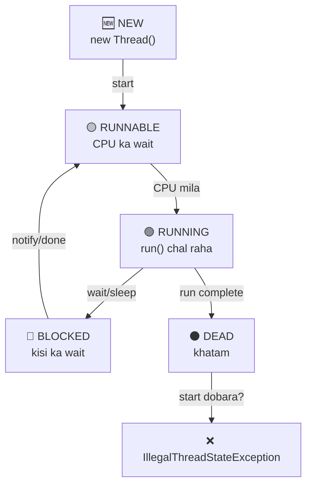

---

## 19. Thread Creation 2 Ways

### REAL WORLD ANALOGY
Naya waiter hire karna restaurant mein 2 ways:
- **Way 1**: Bureaucratic — waiter ki family background check (`extends Thread`). Ek baar family pakdi, doosri family mein nahi ja sakta (Java single inheritance).
- **Way 2**: Contract based — waiter sign kare "main waitering kaam karunga" (`implements Runnable`). Multiple contracts sign kar sakta (multiple interfaces).

Way 2 better — flexible, future mein kuch aur extend karna ho toh option open.

### YE KYA HAI?
So technically, Java mein thread banane ke 2 tareeke:
1. **`extends Thread`** — Thread class extend karo, `run()` override. Problem: Java single inheritance — doosra class extend NAHI kar sakte.
2. **`implements Runnable`** — Runnable interface implement karo, `run()` override. BETTER — multiple interfaces allowed, Lambda support. Modern code HAMESHA ye use karta.

Both ways mein `start()` naya thread banata. `run()` direct call = sirf method call, NO new thread.

```java
2 tarike thread banana:

WAY 1: extends Thread
  class MyThread extends Thread { run() { ... } }
  new MyThread().start();
  
  PROBLEM: Java mein single inheritance.
  Thread extend kiya → aur kuch extend NAHI kar sakta.

WAY 2: implements Runnable (BETTER)
  class MyTask implements Runnable { run() { ... } }
  new Thread(new MyTask()).start();
  
  BETTER: Interface. Multiple implement OK. Flexible.
  Lambda: new Thread(() -> ...).start();

TRAP: t.run() vs t.start()
  t.run()   = SAME thread mein chala. Normal method call. Threading NAHI.
  t.start() = NAYA thread create karke run(). ASLI threading.
  
  HAMESHA start() use karo. run() se thread NAHI banta.
```

```java
// === WAY 1: extends Thread ===
class MyThread extends Thread {
    @Override
    public void run() {
        System.out.println("Thread: " + Thread.currentThread().getName());
    }
}

// === WAY 2: implements Runnable (BETTER) ===
class MyTask implements Runnable {
    @Override
    public void run() {
        System.out.println("Runnable: " + Thread.currentThread().getName());
    }
}

public class ThreadDemo {
    public static void main(String[] args) {
        // Way 1
        MyThread t1 = new MyThread();
        t1.start(); // NAYA thread — SAHI

        // Way 2
        Thread t2 = new Thread(new MyTask());
        t2.start(); // NAYA thread — SAHI

        // Way 3: Lambda (shortest)
        Thread t3 = new Thread(() ->
            System.out.println("Lambda: " + Thread.currentThread().getName()));
        t3.start();

        // TRAP: run() vs start()
        Thread t4 = new Thread(() -> System.out.println("Who am I?"));
        t4.run();   // MAIN thread mein — NO new thread!
        t4.start(); // NEW thread banta — SAHI!
    }
}
```

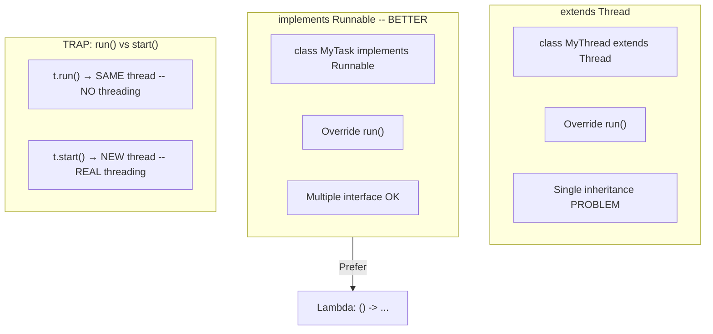

---

## 20. Deadlock 4 Conditions

### REAL WORLD ANALOGY
Do cars narrow bridge pe aamne saamne aa gayi. Dono driver ka ego: "Main nahi hatunga, tu hat." Dono wait. **Koi nahi hatega.** Traffic jam forever. = **Deadlock**.
Similarly thread A ne Lock1 pakda, Lock2 chahiye. Thread B ne Lock2 pakda, Lock1 chahiye. Dono wait. STUCK forever.
**Fix**: "East-bound ko hamesha priority" — same rule sab follow kare → koi bridge pe clash nahi. Code mein: HAMESHA `LOCK_A` pehle, `LOCK_B` baad — sab threads same order → circular wait impossible.

### YE KYA HAI?
So technically, Deadlock = multi-threaded state jahan 2+ threads ek doosre ke resources ke liye infinitely wait kar rahe. Compile time detect nahi hota — sirf runtime pe manifest. **4 necessary conditions** (sab chahiye): Mutual Exclusion, Hold & Wait, No Preemption, Circular Wait. Ek bhi break karo → deadlock impossible.

### KYUN CHAHIYE samjhna?
- **Production bug** — deadlock hua to app HANG, restart hi solution → bad
- **Interview favorite** — har multi-threading interview mein deadlock question
- **Detection impossible** at compile time → code review + pattern se pata karna padta
- **Prevention** = disciplined lock order → bug avoid karne ka ek hi tarika

### NAHI SAMJHA TO KYA HOGA?
- Random locks lena start kiya → 2 threads criss-cross lock pakdte → **DEADLOCK**
- Production mein deadlock → **app hang** → users stuck → manual restart only fix
- Thread dump padhna nahi aata → deadlock identify nahi kar sakte → debug hours lagte
- Lock order discipline nahi → team mein har dev alag order lagata → **random deadlocks**

### 4 CONDITIONS (sab chahiye deadlock ke liye):
| # | Condition | Matlab |
|---|-----------|--------|
| 1 | **Mutual Exclusion** | Ek resource ek time pe EK thread ka |
| 2 | **Hold & Wait** | Thread ek lock hold kiye doosra wait |
| 3 | **No Preemption** | Koi force se lock chheen nahi sakta |
| 4 | **Circular Wait** | A→B ka wait, B→A ka wait (circle) |

**BREAK ANY ONE = NO DEADLOCK.** Easiest: **lock order fix karo** → circular wait break.

```java
Deadlock = 2 threads dono WAIT. Koi release nahi. STUCK forever.

4 CONDITIONS (sab chahiye deadlock ke liye):

1. Mutual Exclusion
   Resource ek time pe EK thread use.
   Lock 1 pe sirf Thread A.

2. Hold & Wait
   Thread ek lock HOLD karke doosra WAIT karta.
   A holds Lock1, waits for Lock2.

3. No Preemption
   Koi cheenke nahi le sakta.
   A ka Lock1 forcefully le nahi sakte.

4. Circular Wait
   A → Lock2 wait. B → Lock1 wait. CIRCLE.

BREAK ANY ONE = NO DEADLOCK.
  Easiest: Break Circular Wait → SAME ORDER mein lock lo.
  A: Lock1 → Lock2
  B: Lock1 → Lock2 (SAME order!)
  B pehle Lock1 ka wait karega → circular nahi banega.
```

```java
public class DeadlockDemo {
    private static final Object LOCK_A = new Object();
    private static final Object LOCK_B = new Object();

    public static void main(String[] args) {
        // === DEADLOCK EXAMPLE ===
        Thread t1 = new Thread(() -> {
            synchronized (LOCK_A) {                    // Lock A pakda
                System.out.println("T1: holding A, waiting B");
                try { Thread.sleep(100); } catch (Exception e) {}
                synchronized (LOCK_B) {                // Lock B chahiye
                    System.out.println("T1: got both");
                }
            }
        });

        Thread t2 = new Thread(() -> {
            synchronized (LOCK_B) {                    // Lock B pakda
                System.out.println("T2: holding B, waiting A");
                try { Thread.sleep(100); } catch (Exception e) {}
                synchronized (LOCK_A) {                // Lock A chahiye
                    System.out.println("T2: got both");
                }
            }
        });

        t1.start();
        t2.start();
        // DEADLOCK! T1 waits B, T2 waits A. Dono stuck.

        // === FIX: Same order mein lock lo ===
        Thread t3 = new Thread(() -> {
            synchronized (LOCK_A) {       // A pehle
                synchronized (LOCK_B) {   // B baad mein
                    System.out.println("T3: got both — SAFE");
                }
            }
        });

        Thread t4 = new Thread(() -> {
            synchronized (LOCK_A) {       // A pehle (SAME order!)
                synchronized (LOCK_B) {   // B baad mein
                    System.out.println("T4: got both — SAFE");
                }
            }
        });
        // NO deadlock — same order = no circular wait
    }
}
```

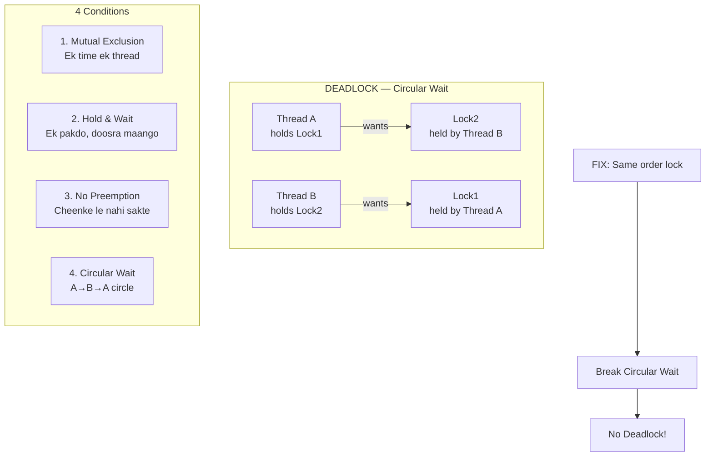

---

## 21. Java 8 — Lambda, Streams, Optional

### REAL WORLD ANALOGY
Pehle zamaane mein chai banana = 10 steps (paani lo, gas chalao, patila rakh, doodh daalo...). Modern "Chai Point" app mein = bas "Masala Chai" button dabao, ek line mein kaam. Java 8 ne wahi revolution laaya:
- **Lambda** = purane 10-line anonymous class ki jagah 1-line arrow function.
- **Streams** = assembly line / conveyor belt — data ek end se dalo, dusre end se processed nikle (filter → map → sort → collect).
- **Optional** = "wrapper with safety net" — null ka risk check karta, NullPointerException se bachata.

### YE KYA HAI?
So technically, Java 8 = massive functional programming upgrade. **Lambda expressions** = anonymous function shorthand. **Functional Interface** = 1 abstract method wala interface (`@FunctionalInterface`). **Streams API** = lazy pipeline for collection processing. **Optional<T>** = null-safe wrapper. PFCS shortcut: Predicate (filter), Function (transform), Consumer (action), Supplier (factory).

```java
Lambda = anonymous function. Naam nahi, class nahi, seedha logic.
  Purana: new Comparator<>() { @Override compare... } = 10 lines
  Lambda: (a, b) -> Integer.compare(a.age, b.age) = 1 line

Functional Interface = sirf 1 abstract method.
  @FunctionalInterface check. 2 methods = compile error.

PFCS (yaad rakh):
  Predicate = Filter (haan ya nahi)     → test()
  Function  = Convert (A se B)          → apply()
  Consumer  = Action (karo, return nahi) → accept()
  Supplier  = Factory (banao, input nahi)→ get()

Streams = pipeline.
  list.stream().filter().map().sorted().collect()
  LAZY — terminal op ke bina execute NAHI.
  
Optional = null safe wrapper.
  Optional.of(value). .orElse(default). .orElseThrow().
  NullPointerException se bachao.
```

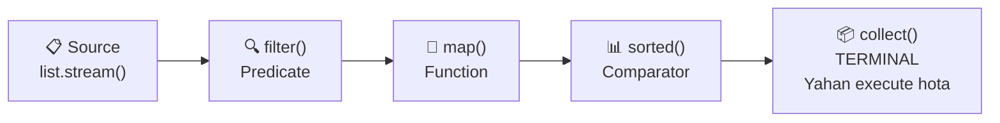

---

## 22. Method Reference (::) — Lambda Shortcut

### REAL WORLD ANALOGY
Friend ka naam save karna phone mein — 2 ways:
- **Full form**: "call karo → number dial karo → +91-98765-..." (long lambda)
- **Shortcut**: "Rahul" bolo, phone auto dial kar deta (method reference `Rahul::call`)

Method reference = speed dial. Lambda jab sirf ek existing method call kar raha = speed dial button laga de.

### YE KYA HAI?
So technically, Method Reference (`::`) = lambda ki shortcut syntax jab lambda body mein sirf ek existing method call ho raha. 3 types:
1. **Static**: `Integer::parseInt` = `s -> Integer.parseInt(s)`
2. **Instance**: `String::toUpperCase` = `s -> s.toUpperCase()`
3. **Constructor**: `Student::new` = `s -> new Student(s)`

```java
Lambda mein ek hi method call? → :: se shortcut.

3 TYPES:

1. Static Method Reference
   str -> Integer.parseInt(str)   →  Integer::parseInt

2. Instance Method Reference
   s -> s.toUpperCase()           →  String::toUpperCase
   s -> printer.print(s)          →  printer::print

3. Constructor Reference
   () -> new Student()            →  Student::new

TRAP: Java mein -> use hota hai. => NAHI.
  -> = Java lambda
  => = JavaScript arrow function
  Interview mein => bol diya = "Ye Java nahi jaanta."
```

```java
import java.util.*;
import java.util.stream.*;
import java.util.function.*;

public class MethodRefDemo {
    public static void main(String[] args) {
        List<String> names = List.of("arpan", "rahul", "amit");
        List<String> nums = List.of("1", "2", "3");

        // === 1. Static Method Reference ===
        // Lambda:  nums.stream().map(s -> Integer.parseInt(s))
        List<Integer> ints = nums.stream()
            .map(Integer::parseInt) // Static :: shortcut
            .collect(Collectors.toList());
        // [1, 2, 3]

        // === 2. Instance Method Reference ===
        // Lambda:  names.stream().map(s -> s.toUpperCase())
        List<String> upper = names.stream()
            .map(String::toUpperCase) // Instance :: shortcut
            .collect(Collectors.toList());
        // [ARPAN, RAHUL, AMIT]

        // Instance on specific object
        Printer printer = new Printer();
        // Lambda:  names.forEach(s -> printer.print(s))
        names.forEach(printer::print);

        // === 3. Constructor Reference ===
        // Lambda:  names.stream().map(name -> new Student(name))
        List<Student> students = names.stream()
            .map(Student::new) // Constructor :: shortcut
            .collect(Collectors.toList());
    }
}

class Printer {
    void print(String s) { System.out.println("Printing: " + s); }
}

class Student {
    String name;
    Student(String name) { this.name = name; }
}
```

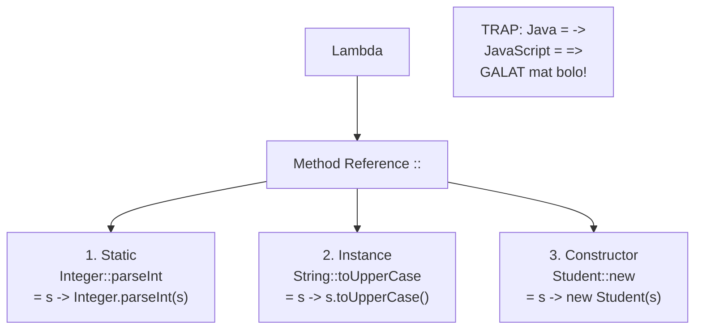

---

## 23. CompletableFuture — Pizza Order

### REAL WORLD ANALOGY
Pizza shop pe 2 ways:
- **BLOCKING**: Counter pe khade raho, pizza banne tak wait, kuch aur mat karo. 20 min barbaad.
- **NON-BLOCKING (CompletableFuture)**: Order diya → token liya → jao apna kaam karo → pizza ready → bell bajegi → pick up. Tu free tha 20 min, call lagayi, doosra kaam kiya.

Pizza order flow = `supplyAsync` (order place) → `thenApply` (add extra cheese) → `thenAccept` (khao) → `exceptionally` (pizza jal gaya, refund).

### YE KYA HAI?
So technically, `CompletableFuture` = Java 8+ ka async/non-blocking computation API. Background mein task run karta, callbacks chain kar sakte (`thenApply`, `thenAccept`, `thenCombine`). Exception handling bhi chainable (`exceptionally`). JavaScript Promises jaisa concept.

```java
BLOCKING: Counter pe khade raho. Wait. BEKAR.
NON-BLOCKING: Order diya → token liya → apna kaam karo.
  Pizza ready → bell bajegi.

  CompletableFuture.supplyAsync(() -> fetchFromDB())
    .thenApply(data -> data.toUpperCase())
    .thenAccept(result -> print(result))
    .exceptionally(e -> "Error!")

  supplyAsync()   = background task, result return
  thenApply()     = transform (map)
  thenAccept()    = use karo, return nahi
  thenCombine()   = 2 futures combine
  exceptionally() = error fallback

TRAP: thenApply = simple transform.
      thenCompose = naya future banao (flatMap).
```

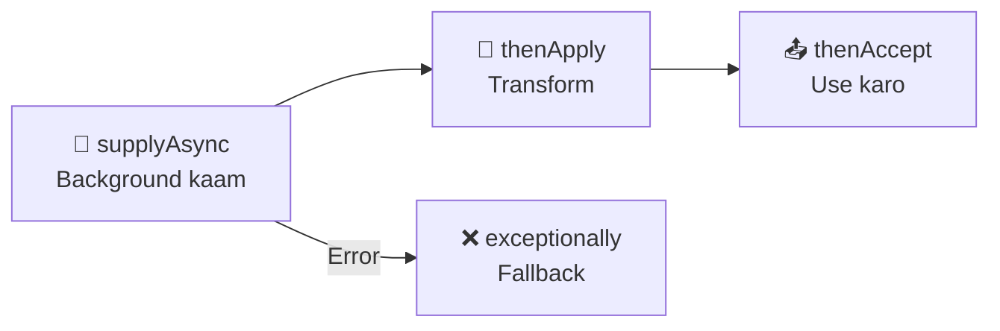

---

## 24. ExecutorService — Hospital Doctors

### REAL WORLD ANALOGY
Hospital OPD mein har naye patient ke liye NAYA doctor hire karna? Pagalpan — hiring slow, expensive, patient timeout. Real hospital model: **5 doctors pehle se duty pe ready** — patient aaya, koi free doctor uthaye, kaam khatam → wapas pool mein. Next patient ke liye doctor reuse.
Yahi Thread Pool concept: threads pre-create karo, tasks aate rahen, threads reuse.

### YE KYA HAI?
So technically, `ExecutorService` = Java ka thread pool management API. Threads create karna expensive (memory, CPU). Pool mein pre-created threads → tasks `submit()` karo → thread pool allocate karta. `shutdown()` MUST — nahi toh JVM band nahi hogi. 4 types: Fixed, SingleThread, Cached, Scheduled.

```java
Har patient ke liye NAYA doctor? BEKAR.
5 doctors PEHLE SE ready = Thread Pool.

  ExecutorService pool = Executors.newFixedThreadPool(5);
  pool.submit(() -> doTask());
  pool.shutdown();  ← ZAROORI. Nahi toh app band nahi hogi.

4 Types:
  FixedThreadPool(5)      = exactly 5. Extra wait.
  SingleThreadExecutor()  = 1 thread. Order guaranteed.
  CachedThreadPool()      = zaroorat pe naya. 60s idle → destroy.
  ScheduledThreadPool(3)  = delayed/repeating. Cron jaisa.

  shutdown()    = pending complete, naye nahi. Graceful.
  shutdownNow() = sab roko. Force.
```

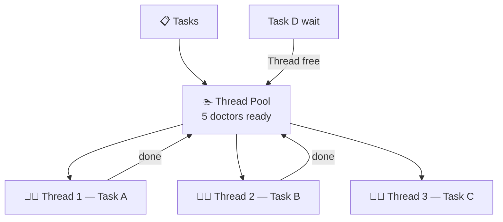

---

## 25. Garbage Collection — Hotel Checkout

### REAL WORLD ANALOGY
Hotel mein tu check-in kiya (object create hua). Hotel staff ko pata hai "Room 201 mein guest hai." Tu checkout kiya → staff automatic check karega: "Room 201 mein koi guest hai?" Nahi → room SAAF karo, next guest ready. Yahi Garbage Collection — jab koi reference nahi (guest gaya) → JVM auto memory free karta.
Tere zimme nahi room saaf karna — hotel housekeeping (JVM) khud karti.

### YE KYA HAI?
So technically, Garbage Collection (GC) = JVM ka automatic memory management. Heap mein unused objects (no references) auto-detect karke memory free karta. C/C++ mein manual `free()` karna padta, Java mein automatic. 3 GC eligibility cases: null assign, reassign, scope end. `System.gc()` = hint only, guarantee nahi.

```java
Hotel room. Tujhe check-in kiya. Tu checkout kiya → room SAAF karo.
Koi guest nahi → room saaf = Garbage Collection.

GC = JVM automatically memory free karta un objects ki jo koi use nahi kar raha.

3 CASES jab object GC eligible:

  CASE 1: null assign
    Student s = new Student();
    s = null;  // ab koi point nahi karta → GC eligible

  CASE 2: reassign
    Student s = new Student("A");
    s = new Student("B");  // "A" wala orphan → GC eligible

  CASE 3: scope end
    void method() {
        Student s = new Student();
    }
    // method khatam → s out of scope → GC eligible

System.gc() = "Bhai saaf kar de" — HINT hai, GUARANTEE nahi.
  JVM chahe toh ignore kare.

finalize() = DEPRECATED (Java 9+). Unpredictable. Use mat karo.
  Replacement: try-with-resources for cleanup.
```

```java
public class GarbageCollectionDemo {
    public static void main(String[] args) {
        // CASE 1: null assign — reference hataya
        Student s1 = new Student("Arpan");
        s1 = null; // Student("Arpan") ab orphan → GC eligible

        // CASE 2: reassign — purana chhoda, naya pakda
        Student s2 = new Student("Rahul");
        s2 = new Student("Amit"); // Student("Rahul") orphan → GC eligible

        // CASE 3: scope end — method ke baad object dead
        createAndForget();
        // Student("Temp") scope se bahar → GC eligible

        // System.gc() — HINT, guarantee NAHI
        System.gc(); // JVM may or may not run GC

        System.out.println("GC demo done");
    }

    static void createAndForget() {
        Student temp = new Student("Temp");
        // method end → temp out of scope
    }
}

class Student {
    String name;
    Student(String name) { this.name = name; }
}
```

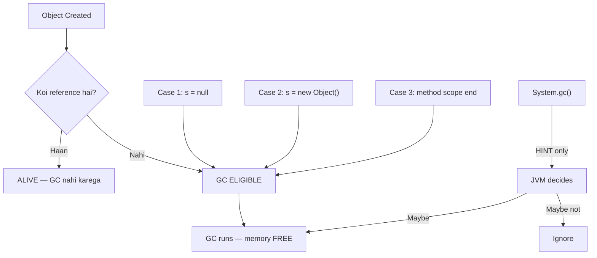

---

## 26. JDK vs JRE vs JVM — Bada Dabba Chhota Dabba

### REAL WORLD ANALOGY
**Russian nesting dolls** — bada ke andar chhota, chhote ke andar aur chhota.
- **JDK** (sabse bada doll) = Developer kit — compile, debug, run sab tools.
- **JRE** (beech wala) = Runtime — sirf run karne ke tools.
- **JVM** (sabse chhota) = Actual execution engine — bytecode chalata.

Developer = JDK chahiye (full box). End user = JRE kaafi (sirf run). JVM = core execution.

### YE KYA HAI?
So technically:
- **JVM** (Java Virtual Machine) = bytecode execute karne wali virtual machine. OS-specific.
- **JRE** (Java Runtime Environment) = JVM + standard libraries (java.util, java.io, etc.).
- **JDK** (Java Development Kit) = JRE + development tools (javac compiler, debugger, jar).

Flow: `.java` → `javac` (JDK tool) → `.class` bytecode → JVM executes → machine code → OS run. "Write once, run anywhere" ka magic JVM ka hai.

```java
Russian nesting dolls — bada ke andar chhota.

JDK (Java Development Kit) — BADA DABBA
  = JRE + compiler (javac) + debugger + tools
  DEVELOPER ke liye. Code likhna + compile + run.

JRE (Java Runtime Environment) — MEDIUM DABBA
  = JVM + libraries (java.util, java.io, etc.)
  USER ke liye. Compiled code RUN karna.

JVM (Java Virtual Machine) — SABSE CHHOTA DABBA
  = bytecode execute karta. Platform specific.
  "Write once, run anywhere" — JVM har OS pe alag, bytecode SAME.

Flow:
  HelloWorld.java → javac (compiler) → HelloWorld.class (bytecode)
  → JVM reads .class → machine code → RUN

Developer = JDK install karo (sab milta)
User = JRE kaafi (sirf run karna)
Execute = JVM karta (har platform pe)
```

```java
// Step 1: Write (JDK needed — developer tool)
// File: HelloWorld.java
public class HelloWorld {
    public static void main(String[] args) {
        System.out.println("Hello from JVM!");
        
        // JVM info
        System.out.println("JVM: " + System.getProperty("java.vm.name"));
        System.out.println("JRE: " + System.getProperty("java.runtime.version"));
        System.out.println("JDK: " + System.getProperty("java.version"));
    }
}

// Step 2: Compile (javac — JDK tool)
// Terminal: javac HelloWorld.java → HelloWorld.class banta

// Step 3: Run (java — JVM execute karta)
// Terminal: java HelloWorld → "Hello from JVM!"
```

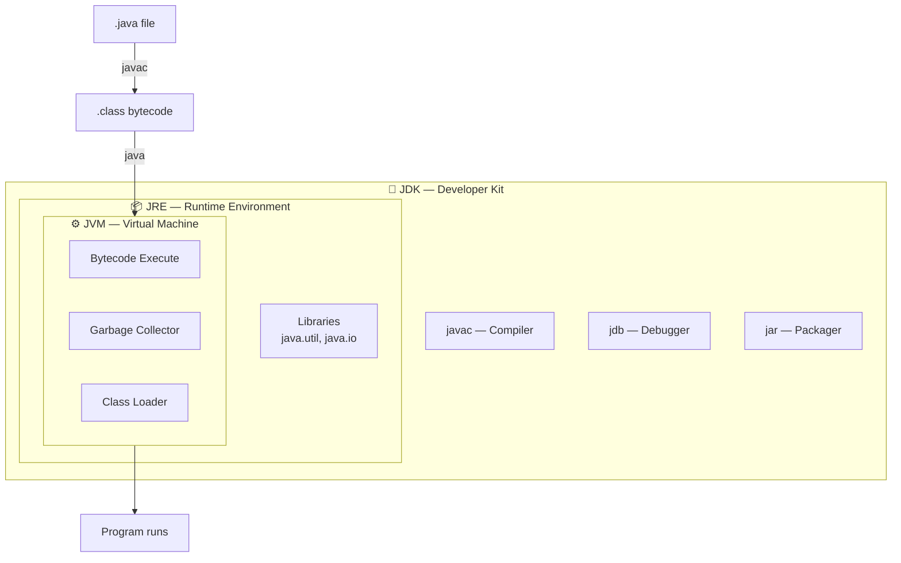

---

# GROUP 2: JDBC + HIBERNATE

---

## 27. JDBC vs Hibernate vs JPA

### REAL WORLD ANALOGY
Khana khane ke evolution:
- **JDBC** = Khud market jao → sabzi kaato → pakao → bartan dho. Full manual control, but 10 lines for one SELECT. Har step code karo.
- **Hibernate** = Zomato app — tu bola "paneer tikka", kitchen khud bana ke bheji. 1 line, auto-mapping.
- **JPA** = Zomato ka **interface standard** — aaj Zomato, kal Swiggy, code same rahega. Abstraction layer.
- **Spring Data JPA** = Alexa: "Paneer tikka order karo" — sirf bola, baaki sab Alexa handle. `findAll()` free mein mila.

### YE KYA HAI?
So technically:
- **JDBC** (Java Database Connectivity) = low-level API for DB. Manual SQL, manual mapping.
- **Hibernate** = ORM (Object-Relational Mapping) framework. Auto SQL generation, auto mapping.
- **JPA** (Java Persistence API) = specification/interface. Hibernate implements JPA. DB independent.
- **Spring Data JPA** = Spring ka wrapper on JPA. Repository interface likho, CRUD automatic.

```java
Khana banana 3 tarike:

JDBC = khud market ja, bana, bartan dho. 10 lines ek SELECT ka.
Hibernate = Zomato order. Tu bola, kitchen ne banaya. 1 line.
JPA = Zomato ka interface. Zomato ya Swiggy — code same.
Spring Data JPA = Alexa se order. Interface likha, FREE milta.
```

```mermaid
graph TD
    A["🔧 JDBC<br/>30 lines<br/>Manual SQL<br/>Manual mapping"] -->|"bahut mehnat"| B["🤖 Hibernate<br/>5 lines<br/>Auto SQL<br/>Auto mapping"]
    B -->|"standard banao"| C["📋 JPA<br/>Specification<br/>Interface<br/>DB independent"]
    C -->|"aur easy"| D["✨ Spring Data JPA<br/>1 line<br/>repo.findAll()<br/>FREE CRUD"]
```

```java
Hibernate Persistence Lifecycle:
  TRANSIENT  = new object. Hibernate ko pata nahi. Camera OFF.
  PERSISTENT = session mein. Hibernate WATCH karta. Camera ON.
  DETACHED   = session band. DB mein hai lekin untracked. Camera OFF phir se.
  REMOVED    = delete marked. Next commit pe DB se hata.

get() vs load():
  get()  = turant DB hit. Nahi mila → null. SAFE.
  load() = proxy return. Access pe DB hit. Nahi mila → Exception. RISKY.
  Default: get() use karo.
  
save() vs persist() vs merge():
  save()   = Hibernate specific. ID return turant.
  persist() = JPA standard. void return.
  merge()  = detached object wapas attach. SAFE. Hamesha use karo.
  update() = same ID session mein hai toh → NonUniqueObjectException. AVOID.
```

---

## 28. JDBC DEEP — RAT-RACE

### REAL WORLD ANALOGY
Bank ATM se paisa nikalne ke 6 steps: Card daalo → PIN dalo → amount enter → transaction → paisa nikla → card wapas lo. Ek step skip? Card stuck ya paisa nahi mila.
JDBC ka 6 steps ka flow wahi: **R-A-T-R-A-C** — Register, Acquire, Transform, Run, Access, Close. Last step "Close" bhoole toh connection leak — bank ATM mein card chhod ke chale gaye jaise.

### YE KYA HAI?
So technically, JDBC = Java ka low-level DB API. 6 steps: Register driver → Acquire connection → Transform (PreparedStatement banao) → Run query → Access results → Close resources. PreparedStatement HAMESHA (SQL injection bachao). HikariCP = default connection pool in Spring Boot (reuse connections, fast).

```java
6 steps yaad: R-A-T-R-A-C

  R = Register driver (Class.forName)
  A = Acquire connection (DriverManager.getConnection)
  T = Transform statement (PreparedStatement)
  R = Run query (executeQuery)
  A = Access results (ResultSet)
  C = Close resources (rs, ps, conn CLOSE)

  Close bhool gaya → CONNECTION LEAK → pool khatam → app DEAD.

Statement vs PreparedStatement:
  Statement: input SEEDHA SQL mein → SQL INJECTION.
  PreparedStatement: ? placeholder → input = DATA only → SAFE.
  HAMESHA PreparedStatement.

HikariCP — Connection Pool:
  Har request pe naya connection = SLOW (50ms).
  Pool mein 10 ready → le → use → wapas → REUSE. FAST.
  Spring Boot DEFAULT = HikariCP.
```

```mermaid
graph TD
    A["R — Register<br/>Driver load"] --> B["A — Acquire<br/>Connection"]
    B --> C["T — Transform<br/>PreparedStatement"]
    C --> D["R — Run<br/>executeQuery"]
    D --> E["A — Access<br/>ResultSet"]
    E --> F["C — Close<br/>rs, ps, conn"]
    F -->|"BHOOL GAYA?"| G["💀 Connection LEAK"]
```

```mermaid
graph TD
    subgraph POOL["🏊 HikariCP Connection Pool"]
        P1["🔗 Conn 1"]
        P2["🔗 Conn 2"]
        P3["🔗 Conn 3"]
    end
    
    A["📨 Request 1"] -->|"le"| P1
    P1 -->|"use → wapas"| POOL
    B["📨 Request 2"] -->|"le"| P2
    C["📨 Request 3"] -->|"le"| P3
    D["📨 Request 4"] -->|"sab busy"| E["⏳ WAIT"]
```

---

## 29. HQL — Class Naam, Table Nahi

### REAL WORLD ANALOGY
Dukaan ke board pe likha hai — ya toh "Rahul Sharma" (asli naam) ya "The Cloth Store" (brand naam). Agar brand naam use karte rahe, to Rahul ka naam badlega toh board wahi. Agar asli naam pe depend kiye, to naam change hote hi confusion.
SQL = asli table/column naam use karta (DB-tied). HQL = Java class/field naam use karta (code-tied) — DB badla, class same, query same.

### YE KYA HAI?
So technically, HQL (Hibernate Query Language) = Hibernate ka object-oriented query language. SQL ki jagah entity class names + field names use karta. DB independent — MySQL se PostgreSQL migrate kiya, queries TOOT nahi. Case-sensitive on class names. `JOIN FETCH` = N+1 problem ka solution.

```java
SQL = table/column naam. DB specific.
  SELECT * FROM students WHERE age > 18
  Table rename? QUERY TOOT GAYI.

HQL = class/field naam. DB independent.
  FROM Student WHERE age > 18
  Student = CLASS naam. age = FIELD naam.
  DB badle → query SAME.

  FROM Student                         ← sab
  FROM Student WHERE age > 18          ← filter
  FROM Student WHERE id = :sid         ← named param
  FROM Student s JOIN FETCH s.courses  ← N+1 FIX!

TRAP: HQL CASE SENSITIVE class naam pe.
  "from student" → FAIL
  "FROM Student" → OK
```

---

## 30. Hibernate Caching L1 vs L2

### REAL WORLD ANALOGY
Office mein 2 tarah ki diary:
- **Personal diary (L1)** — tere desk drawer mein. Sirf tu padhe/likhe. Office se ghar gaya = diary locker mein, kal naya din naya diary. = Session-scoped.
- **Shared diary on notice board (L2)** — poore office ka. Sab log padh sakte, update kar sakte. Ghar gaya bhi → diary wahi rahegi kal ke liye bhi. = SessionFactory-scoped, multi-session.

L1 default ON. L2 manually enable karna padta (EhCache, Redis).

### YE KYA HAI?
So technically, Hibernate 2-level caching:
- **L1 Cache** = Session-scoped. Auto-enabled. Har `session.get()` pehle L1 check. Session close = L1 gone.
- **L2 Cache** = SessionFactory-scoped. Manual setup (EhCache/Redis). Multiple sessions share. Survives session close.

`evict()` = ek entry hatao. `clear()` = poora cache saaf. `close()` = session band (L1 gone).

```java
L1 = PERSONAL diary. Sirf tera. Session level. Auto ON.
  get(Student, 1) → DB hit → diary mein likha
  get(Student, 1) DOBARA → diary se → DB NAHI
  session.close() → diary FAAD di. Gone.

L2 = OFFICE shared diary. Sab ka. SessionFactory level. Manual.
  Session A: get(Student, 1) → DB → L2 mein rakha
  Session B: get(Student, 1) → L2 mein hai → DB NAHI
  Session band → L2 SAFE rehta.

  evict(student) = ek entry hatao
  clear()        = poori diary saaf
  close()        = diary band

TRAP: L2 sirf session.get() ke saath.
      HQL? ALAG Query Cache chahiye.
      query.setCacheable(true)
```

```mermaid
graph TD
    subgraph L1["📓 L1 Cache — Personal Diary"]
        A1["Session level"]
        A2["Auto ON"]
        A3["Session close = GONE"]
    end
    
    subgraph L2["📚 L2 Cache — Office Shared Diary"]
        B1["SessionFactory level"]
        B2["Manual enable (EhCache)"]
        B3["Session close = SAFE"]
    end
    
    C["get(Student, 1)"] --> L1
    L1 -->|MISS| L2
    L2 -->|MISS| D["💾 Database"]
```

---

## 31. N+1 Problem — School

### REAL WORLD ANALOGY
Principal ka order: "Sab 10 teachers ki list aur har teacher ke students ki list lao."
- **Galat way**: Pehle office jao → teachers list lao (1 trip). Fir har teacher ke liye classroom jao (10 alag trips). **Total 11 trips**.
- **Sahi way**: Ek hi time pe office mein bolo "sab teachers + students combined list do." Ek query, ek trip. **Total 1 trip**.

11 trips vs 1 trip. DB query pe bhi wahi — network latency add hoti har query pe.

### YE KYA HAI?
So technically, N+1 Problem = Hibernate lazy loading anti-pattern. Parent entities ki list li (1 query), phir har child collection access karne pe alag-alag query (N queries). Total = 1 + N = N+1 queries. Fix: `JOIN FETCH` ya `@EntityGraph` — ek query mein sab aa jaaye.

```java
10 teachers. Har ek ke 30 students.
"Sab teachers + students ki list do"

GALAT:
  1 query → 10 teachers
  10 queries → har teacher ke students
  = 11 queries = N+1

SAHI:
  1 query → "FROM Teacher t JOIN FETCH t.students"
  = 1 query. Sab ek saath.
```

```mermaid
graph TD
    subgraph BAD["❌ N+1 Problem — 11 Queries"]
        A1["SELECT teachers"] --> B1["10 teachers mile"]
        B1 --> C1["Teacher 1 ke students → query"]
        B1 --> C2["Teacher 2 ke students → query"]
        B1 --> C3["... 10 queries"]
    end
    
    subgraph GOOD["✅ JOIN FETCH — 1 Query"]
        A2["SELECT teachers JOIN FETCH students"] --> B2["Sab ek saath ⚡"]
    end
```

```java
LazyInitializationException:
  Session band → lazy data access → CRASH
  Fix: @Transactional service pe → session open rahegi
```

---

## 32. Cascade Types — Department Delete

### REAL WORLD ANALOGY
Ghar ka head (papa) decide kare "ab naya ghar mein shift karna hai" — automatically family (wife, kids) bhi shift hoti. Head ka action → family pe bhi lage = cascade.
Par danger bhi hai — papa ne bol diya "mera naam mita do records se" → family ka naam bhi mit jaaye? Rishtedari lose. Isliye CASCADE choice sochke karo.
Department → Employees case mein: CASCADE.ALL laga diya → department delete → sab employees BHI DELETE. Sochna padega — kya wo sachchi intention tha?

### YE KYA HAI?
So technically, Cascade = JPA/Hibernate mein parent entity ka action automatically children pe apply hota. 5 types: PERSIST (save), REMOVE (delete), MERGE (update), REFRESH (reload), ALL (sab). Relationship annotation mein set hota: `@OneToMany(cascade = CascadeType.PERSIST)`. **CascadeType.ALL includes REMOVE — danger**.

```java
Department mein 10 Employees.
Department DELETE kiya → employees ka kya?

Cascade = parent ka action CHILD pe bhi lage.

5 CASCADE TYPES:
  PERSIST   → parent save → children bhi save
  REMOVE    → parent delete → children bhi delete
  MERGE     → parent update → children bhi update
  REFRESH   → parent refresh → children bhi refresh from DB
  ALL       → sab upar wale ek saath

TRAP: CascadeType.ALL = REMOVE bhi include!
  Department delete kiya → sab employees BHI delete.
  Sochna padega — kya sachchi mein sab delete karna hai?
  
  SAFE: PERSIST + MERGE usually enough.
  DANGEROUS: ALL without thinking.
```

```java
@Entity
public class Department {
    @Id @GeneratedValue
    private Long id;
    private String name;

    // SAFE: sirf save + update cascade
    @OneToMany(mappedBy = "department",
               cascade = {CascadeType.PERSIST, CascadeType.MERGE})
    private List<Employee> employees = new ArrayList<>();

    public void addEmployee(Employee e) {
        employees.add(e);
        e.setDepartment(this); // bidirectional set karo
    }
}

@Entity
public class Employee {
    @Id @GeneratedValue
    private Long id;
    private String name;

    @ManyToOne
    @JoinColumn(name = "department_id")
    private Department department;
}

// === Usage ===
// Department + Employees ek saath save (CASCADE PERSIST)
Department dept = new Department();
dept.setName("Engineering");
dept.addEmployee(new Employee("Arpan"));
dept.addEmployee(new Employee("Rahul"));
departmentRepo.save(dept); // 3 INSERTs — dept + 2 employees

// TRAP: CascadeType.ALL ke saath
// departmentRepo.delete(dept); → sab employees BHI DELETE!
```

```mermaid
graph TD
    P["Parent: Department"] -->|"PERSIST"| C1["Save children too"]
    P -->|"REMOVE"| C2["Delete children too"]
    P -->|"MERGE"| C3["Update children too"]
    P -->|"REFRESH"| C4["Refresh children too"]
    P -->|"ALL"| C5["Sab upar wale<br/>DANGER: REMOVE bhi!"]
    
    C5 -->|"Department DELETE"| D["Employees BHI DELETE!"]
    D --> E["TRAP: Think before ALL"]
```

---

## 33. @Transactional — ATM Transfer

### REAL WORLD ANALOGY
ATM se A ke account se B ke account ko 1000 transfer:
- Step 1: A se 1000 nikala (debit) ✓
- Step 2: B mein 1000 daalna... ERROR! Network fail ✗
- Result: A ke 1000 GAYE, B ko nahi mile. **Bank ka nuksan, customer angry**.

Fix: Donon steps ek "transaction" mein wrap karo — ya toh dono successful, ya dono rollback. **All or nothing**. Yahi bank hamesha karta — partial transfer kabhi nahi.

### YE KYA HAI?
So technically, `@Transactional` = Spring ka annotation jo method ko database transaction mein wrap karta. ACID guarantees: Atomicity (all or nothing), Consistency, Isolation, Durability. RuntimeException pe auto-rollback. Checked exception (IOException) = no rollback by default — `rollbackFor` explicitly batao.

```java
ATM pe A se B ko 1000 bhejna:
  Step 1: A se 1000 nikala ✓
  Step 2: B mein daalna — ERROR ✗
  
  A ke 1000 GAYE. B ko nahi mile. BUG.

@Transactional:
  Step 1 + Step 2 → ek unit.
  Ek fail → ROLLBACK → A ke 1000 wapas.
  Sab ya kuch nahi. All or nothing.
```

```mermaid
flowchart TD
    A["@Transactional<br/>transfer(A, B, 1000)"] --> B["Step 1: A se 1000 nikala"]
    B --> C["Step 2: B mein 1000 daala"]
    C -->|SUCCESS| D["✅ COMMIT<br/>Dono save"]
    C -->|ERROR| E["❌ ROLLBACK<br/>A ke 1000 WAPAS"]
```

```java
TRAPS:
  RuntimeException → ROLLBACK hota ✓
  IOException → ROLLBACK NAHI by default ✗
  Fix: @Transactional(rollbackFor = IOException.class)
  
  Same class mein method call → Proxy BYPASS → @Transactional DEAD
  Fix: alag class se call kar
  
  try-catch mein exception swallow kiya → proxy ko pata nahi → COMMIT
  Fix: catch mein throw karo wapas
```

---

## 34. @Transactional Propagation — All 7 Types (Car Analogy)

### REAL WORLD ANALOGY
Tu travel pe ja raha — friend ke ghar pahunchna. Friend ke paas CAR hai ya nahi ka situation:
- "Car hai? Baith jao. Nahi? Naya book karo." = **REQUIRED** (90% default)
- "HAMESHA naya car, purana parking mein chhodo" = **REQUIRES_NEW**
- "Car MUST ho, nahi hai to EXCEPTION" = **MANDATORY**
- "Same car mein but savepoint banake" = **NESTED**
- "Car se utro, paidal chalo" = **NOT_SUPPORTED**
- "Car hai to baitho, nahi hai bhi chalega" = **SUPPORTS**
- "Car bilkul nahi chahiye, dikhegi to EXCEPTION" = **NEVER**

### YE KYA HAI?
So technically, Propagation = `@Transactional` ka behavior jab transactional method doosre transactional method ko call kare. "Naya transaction banau ya purane mein ghus jaau?" ka decision. 7 types = 7 different rules. 90% cases REQUIRED (default). Audit/log = REQUIRES_NEW (independent rollback).

```java
2 methods dono @Transactional. Ek doosre ko call kare.
"Naya transaction banau ya purane mein ghus jaau?"

ALL 7 TYPES — Car Analogy:

1. REQUIRED (default) — "Car hai? Baith jao. Nahi? Naya lo."
   Transaction hai? → usme ghus jao.
   Nahi hai? → naya banao.
   placeOrder() calls pay() → SAME transaction.
   pay() fail → placeOrder() BHI rollback.
   = 90% cases yehi use.

2. REQUIRES_NEW — "HAMESHA naya car. Purana parking mein."
   HAMESHA naya transaction. Purana SUSPEND.
   placeOrder() calls logAudit()
   logAudit() ALAG transaction.
   placeOrder() fail → logAudit() SAFE (already committed).
   Audit log, notification — HAMESHA save hona chahiye.

3. MANDATORY — "Car MUST ho. Nahi hai? EXCEPTION."
   Transaction ALREADY honi chahiye.
   Nahi hai? → IllegalTransactionStateException.
   Use: inner method jo KABHI akela nahi chalna chahiye.

4. NESTED — "Same car mein SAVEPOINT. Rollback partial OK."
   Existing transaction ke ANDAR savepoint.
   Nested fail → sirf savepoint tak rollback. Outer safe.
   Outer fail → sab rollback (nested bhi).

5. NOT_SUPPORTED — "Car se UTRO. Paidal chalo."
   Transaction SUSPEND. Non-transactional execute.
   Logging, read-only queries jo transaction nahi chahiye.

6. SUPPORTS — "Car hai toh baitho. Nahi toh paidal."
   Transaction hai? Use karo. Nahi hai? Bina chalo.
   Flexible — dono mein kaam karta.

7. NEVER — "Car NAHI chahiye. Dikhegi toh EXCEPTION."
   Transaction hai? → IllegalTransactionStateException.
   Use: method jo GUARANTEED non-transactional hona chahiye.

TRAP: Same class mein call = PROXY BYPASS = transaction DEAD.
  Fix: alag class se call karo.
```

```java
// === REQUIRED (default) ===
@Service
public class OrderService {
    @Autowired private PaymentService paymentService;
    
    @Transactional // REQUIRED by default
    public void placeOrder(Order order) {
        orderRepo.save(order);
        paymentService.pay(order); // SAME transaction mein
        // pay() fail → dono ROLLBACK
    }
}

// === REQUIRES_NEW ===
@Service
public class AuditService {
    @Transactional(propagation = Propagation.REQUIRES_NEW)
    public void logAudit(String action) {
        auditRepo.save(new AuditLog(action));
        // ALAG transaction — main fail bhi ho, ye SAVE
    }
}

// === MANDATORY ===
@Transactional(propagation = Propagation.MANDATORY)
public void deductStock(Item item) {
    // Transaction ALREADY honi chahiye
    // Akela call kiya bina transaction → EXCEPTION
    item.setStock(item.getStock() - 1);
}

// === NESTED ===
@Transactional(propagation = Propagation.NESTED)
public void applyDiscount(Order order) {
    // Savepoint banta — fail hua toh sirf ye rollback
    order.setDiscount(10);
}

// === NEVER ===
@Transactional(propagation = Propagation.NEVER)
public List<User> readOnlyReport() {
    // Transaction mein call kiya → EXCEPTION
    return userRepo.findAll();
}
```

```mermaid
graph TD
    subgraph REQ["1. REQUIRED — Same car baitho"]
        A1["placeOrder()"] -->|"same txn"| A2["pay()"]
        A3["pay fail → DONO rollback"]
    end
    
    subgraph RN["2. REQUIRES_NEW — Naya car"]
        B1["placeOrder()"] -->|"naya txn"| B2["logAudit()"]
        B3["placeOrder fail → audit SAFE"]
    end
    
    subgraph MAN["3. MANDATORY — Car MUST"]
        C1["Outer txn MUST exist"]
        C2["No txn? EXCEPTION"]
    end
    
    subgraph NEST["4. NESTED — Savepoint"]
        D1["Outer txn"] -->|"savepoint"| D2["Inner"]
        D3["Inner fail → partial rollback"]
    end
    
    subgraph NS["5. NOT_SUPPORTED — Paidal"]
        E1["Txn SUSPEND"]
        E2["Non-transactional run"]
    end
    
    subgraph SUP["6. SUPPORTS — Flexible"]
        F1["Txn hai? Use karo"]
        F2["Nahi? Bina chalo"]
    end
    
    subgraph NEV["7. NEVER — No car allowed"]
        G1["Txn hai? EXCEPTION"]
        G2["Bina txn hi chalo"]
    end
```

---

## 35. @Transactional Propagation — All 7 Types (Extended)

> This section extends Section 34 with detailed examples. See Section 34 for the car analogy and code.

```java
Quick Reference Table:

| Propagation    | Txn exists?  | Txn nahi hai?  | Car Analogy            |
|----------------|-------------|----------------|------------------------|
| REQUIRED       | Join karo   | Naya banao     | Car hai? Baitho. Nahi? Naya. |
| REQUIRES_NEW   | Suspend+New | Naya banao     | HAMESHA naya car       |
| MANDATORY      | Join karo   | EXCEPTION      | Car MUST ho            |
| NESTED         | Savepoint   | Naya banao     | Same car, checkpoint   |
| NOT_SUPPORTED  | Suspend     | Bina chalo     | Car se utro, paidal    |
| SUPPORTS       | Join karo   | Bina chalo     | Car hai? Baitho. Nahi? OK |
| NEVER          | EXCEPTION   | Bina chalo     | Car dikhi? EXCEPTION   |

90% time = REQUIRED.
Audit/Log = REQUIRES_NEW.
Baaki = rare but interview mein poochte hain.
```

---

# GROUP 3: SPRING

---

## 36. Spring Core — Dependency Injection

### REAL WORLD ANALOGY
Naya restaurant khola — chef chahiye. 2 tarike:
- **Bina DI**: Tu khud naya chef banaya (`new Chef()`). Specific chef se bandhe gaye. Chef ko change karna? Code rewrite. Test mein dummy chef? Mushkil — real Chef class hi use hogi.
- **With DI**: Staffing agency (Spring) se bolo "chef chahiye" → `@Autowired Chef chef`. Agency dhoondh ke de deti. Chef change karna ho? Agency ko bolo, code same. Test mein mock chef? Easy.

**DI = Tu bolta "chahiye". Spring dhundh ke de deta.** Tight coupling → loose coupling.

### YE KYA HAI?
So technically, Dependency Injection (DI) = Design pattern jahan object apni dependencies khud nahi banata, bahar se inject hoti hain. Spring IoC (Inversion of Control) container beans manage karta, inject karta. 3 types: Constructor (best), Field (`@Autowired`), Setter. Loose coupling, testability, flexibility ka foundation.

```java
Naya restaurant. Chef chahiye.

Bina DI: class Restaurant { Chef chef = new Chef(); }
  Tu khud banaya → tightly coupled → test mushkil

With DI: @Autowired Chef chef;
  Spring de dega → loosely coupled → mock easy
  
DI = Tu bolta "chahiye". Spring dhundhta de deta.
```

```mermaid
graph TD
    subgraph BAD["❌ Bina DI — Tight Coupling"]
        A1["Restaurant"] -->|"new Chef()"| B1["Chef"]
        A1 -->|"badalna ho → code change"| C1["😤 MUSHKIL"]
    end
    
    subgraph GOOD["✅ With DI — Loose Coupling"]
        A2["Restaurant"] -->|"@Autowired"| SP["🏭 Spring Container"]
        SP -->|"inject"| B2["Chef"]
        SP -->|"badalna ho → config change"| C2["😊 EASY"]
    end
```

```java
3 Tarike:
  Field:       @Autowired private Chef chef;     → BAD (test mushkil)
  Constructor: Restaurant(Chef chef)              → BEST (final, testable)
  Setter:      @Autowired void setChef(Chef c)   → RARE (optional dep)

BeanFactory vs ApplicationContext:
  BeanFactory      = basic. Lazy loading. Rare use.
  ApplicationContext = BeanFactory + Events + AOP + i18n + Eager loading.
  Spring Boot = HAMESHA ApplicationContext.

@Component vs @Service vs @Repository:
  Teeno @Component hain. Functionally SAME.
  @Service    = business logic layer (intent batata)
  @Repository = DB layer + exception translation (bonus)
  
Bean Lifecycle:
  Create → Inject (@Autowired) → @PostConstruct → USE → @PreDestroy → Destroy
  Employee: Hire → laptop do → training → kaam → farewell → nikal
  
Bean Scopes:
  Singleton (default) = EK object poori app. Office printer — sab share.
  Prototype = har baar NAYA. Disposable cup.
  Request = ek HTTP request pe naya.
  Session = ek user session pe naya.
  
  TRAP: Singleton + mutable state = thread safety issue!
```

---

## 37. AOP — CCTV Camera

### REAL WORLD ANALOGY
Mall ke 50 rooms mein security chahiye. 2 tarike:
- **Har room mein guard**: 50 guards, costly, inconsistent (kaunsa guard kaise karega), salary + training barbaad.
- **CCTV cameras**: central room se sab cover. Ek policy (camera recording) → sab rooms pe apply. DRY.

Code mein bhi: 50 methods mein "log before + log after" copy-paste = 50 guards. **AOP** = CCTV — ek jagah `@Aspect` class likho, sab methods pe cross-cutting concern lag jaayega.

### YE KYA HAI?
So technically, AOP (Aspect-Oriented Programming) = cross-cutting concerns (logging, security, transactions) ko business logic se separate karne ka paradigm. Spring AOP proxy-based. 5 advice types: `@Before`, `@After`, `@AfterReturning`, `@AfterThrowing`, `@Around`. Pointcut = kahan apply karna. `@Transactional` internally AOP use karta.

```java
50 methods mein same logging copy paste? DRY violation.
AOP = ek jagah likho, SAB methods pe chale.
CCTV camera — har room mein guard nahi, camera laga → sab cover.

  @Aspect @Component
  class LoggingAspect {
      @Before("execution(* com.example.service.*.*(..))")
      void logBefore() { log.info("start"); }
      
      @After("execution(* com.example.service.*.*(..))")
      void logAfter() { log.info("end"); }
  }

5 Advice Types:
  @Before         — method se PEHLE
  @After          — method ke BAAD
  @AfterReturning — SUCCESS pe
  @AfterThrowing  — EXCEPTION pe
  @Around         — DONO (pehle + baad, time measure)

Pointcut = KAHAN lagana:
  execution(* com.example.service.*.*(..))
  = service ke SAB methods pe

Proxy: Spring object WRAP karta.
  Call → proxy → @Before → actual method → @After

TRAP: Same class method call = proxy BYPASS = AOP DEAD.
```

```mermaid
graph TD
    A["📨 Method Call"] --> B["🛡️ AOP Proxy"]
    B --> C["@Before<br/>Log start"]
    C --> D["🎯 Actual Method"]
    D --> E["@After<br/>Log end"]
    E --> F["📤 Response"]
    D -->|Exception| G["@AfterThrowing<br/>Error log"]
```

---

## 38. Spring MVC — DispatcherServlet

### REAL WORLD ANALOGY
Bada call center. Customer phone karta — 100+ departments possible. Customer kisko call kare? Direct department ka number share nahi karte.
**Ek central operator** — sab calls uska number pe. Operator sunta "Complaint" → Complaint dept route. "Order" → Order dept route. Operator = single entry point, routing logic uska.
Yahi DispatcherServlet — Spring MVC ka "front operator." Sab HTTP requests pehle uske paas, phir sahi controller ko route karta.

### YE KYA HAI?
So technically, DispatcherServlet = Spring MVC ka "front controller." Sab incoming HTTP requests ka single entry point. Flow: Browser → DispatcherServlet → HandlerMapping (kaunsa controller?) → Controller method → ViewResolver (JSON/HTML format) → Response. `@Controller` = HTML return, `@RestController` = JSON return.

```java
Call center. Customer phone kare.
OPERATOR (DispatcherServlet) utha:
  "Complaint hai" → Complaint dept
  "Order karna" → Order dept
  
  Sab requests PEHLE operator ke paas.
  Wo ROUTE karta sahi department ko.
```

```mermaid
graph TD
    A["🌐 Browser<br/>Request"] --> B["📞 DispatcherServlet<br/>OPERATOR"]
    B --> C["🗺️ HandlerMapping<br/>Kaunsa Controller?"]
    C --> D["🛎️ Controller<br/>Method chale"]
    D --> E["📋 ViewResolver<br/>JSON ya HTML"]
    E --> F["📤 Response"]
```

```java
@Controller vs @RestController:
  @Controller     = HTML return. ViewResolver use.
  @RestController = @Controller + @ResponseBody = JSON return.
  REST API = @RestController. Web pages = @Controller.

@PathVariable vs @RequestParam:
  /users/101        → @PathVariable (URL ka hissa)
  /users?id=101     → @RequestParam (? ke baad)
```

---

## 39. Spring Data JPA Deep

### REAL WORLD ANALOGY
Alexa/Google Home — tu bolta "mera favorite gaana chalao" — interface jaisa tha. Alexa backend mein implement karti (Amazon Music, Spotify, etc.). Tujhe code nahi likhna, sirf INTERFACE declare karni hai.
Spring Data JPA wahi: tu `UserRepository extends JpaRepository<User, Long>` interface declare kar → Spring khud implementation de deta. `findByEmail()` likha → Spring ne SQL generate + execute kiya. Magic nahi — convention.

### YE KYA HAI?
So technically, Spring Data JPA = Spring ka wrapper on JPA. Repository interface likho → Spring Data runtime pe implementation provide karta. **Derived queries** (method naam se auto query), **@Query** (custom JPQL), **@Modifying + @Transactional** (UPDATE/DELETE), **Pagination** (Pageable). `JpaRepository` hierarchy: CrudRepository → PagingAndSortingRepository → JpaRepository.

```java
Repository hierarchy:
  CrudRepository (basic CRUD)
    → PagingAndSortingRepository (+ pagination)
      → JpaRepository (+ flush, batch)
  
  HAMESHA JpaRepository use karo.

Derived Queries (method naam se auto):
  findByEmail(email)           → WHERE email = ?
  findByNameAndAge(name, age)  → WHERE name = ? AND age = ?
  findByAgeGreaterThan(age)    → WHERE age > ?
  findByNameContaining("rp")   → WHERE name LIKE '%rp%'
  existsByEmail(email)         → boolean
  countByCity(city)            → SELECT COUNT(*)

@Query (complex):
  @Query("SELECT u FROM User u WHERE u.city = :city AND u.age > :age")
  JPQL → class/field naam. DB independent.
  
  @Query(value = "SELECT * FROM users WHERE city = ?1", nativeQuery = true)
  Native → table naam. DB specific.

@Modifying + @Transactional (UPDATE/DELETE):
  @Modifying @Transactional
  @Query("UPDATE User u SET u.active = false WHERE u.lastLogin < :date")
  Bina @Modifying → ERROR. Bina @Transactional → rollback nahi.

Pagination:
  Pageable pageable = PageRequest.of(0, 10, Sort.by("name"));
  Page<User> page = repo.findAll(pageable);
  10 lakh rows bina pagination = OutOfMemoryError.
```

---

## 40. @Valid + DTO Validation

### REAL WORLD ANALOGY
Airport security check — passport hai? valid date? photo match? Agar kuch galat — **aage entry ban**. Bina check let kiya = smuggler/fake passport andar → national security fail.
Similarly API mein user ne bheja: name blank, email "abc" (galat format), age -5. Bina validation? Sab DB mein garbage data jaayega. `@Valid` = airport security — pehle check, galat data reject, sahi data hi controller tak pahunche.

### YE KYA HAI?
So technically, `@Valid` = Jakarta Bean Validation ka Spring integration. DTO class pe annotations lagao: `@NotBlank`, `@Email`, `@Min`, `@Size`. Controller method parameter pe `@Valid` = Spring pehle validate karta, galat data → `MethodArgumentNotValidException` → 400 Bad Request. `@RestControllerAdvice` se global handling.

```java
User ne naam blank bheja, email galat, age -5.
Bina validation? DB mein garbage jaayega.
@Valid = Spring se bolo "pehle check karo, phir accept."

DTO pe annotations lagao:
  @NotBlank  = null/empty/spaces NAHI
  @Email     = valid email format
  @Min(18)   = 18 se kam NAHI
  @Size(min=2, max=50) = length range

Controller mein @Valid lagao.
Galat data aaya? → MethodArgumentNotValidException → 400 Bad Request.

TRAP: @Valid bhool gaye = DEAD. Koi validation nahi hogi.
  DTO pe annotations lage but controller mein @Valid nahi → sab accept.
```

```java
// === DTO with Validation Annotations ===
public class UserDTO {
    @NotBlank(message = "Name is required")
    @Size(min = 2, max = 50, message = "Name 2-50 chars")
    private String name;

    @NotBlank(message = "Email is required")
    @Email(message = "Invalid email format")
    private String email;

    @Min(value = 18, message = "Age must be >= 18")
    private int age;

    @NotBlank(message = "Password is required")
    @Size(min = 8, message = "Password min 8 chars")
    private String password;
    
    // getters + setters
}

// === Controller with @Valid ===
@RestController
@RequestMapping("/api/users")
public class UserController {

    @PostMapping
    public ResponseEntity<User> create(@Valid @RequestBody UserDTO dto) {
        // @Valid bhool gaye? → validation DEAD, garbage accept
        User user = userService.save(dto);
        return ResponseEntity.status(HttpStatus.CREATED).body(user);
    }
}

// === Global Exception Handler ===
@RestControllerAdvice
public class GlobalExceptionHandler {

    @ExceptionHandler(MethodArgumentNotValidException.class)
    public ResponseEntity<Map<String, String>> handleValidation(
            MethodArgumentNotValidException ex) {
        Map<String, String> errors = new HashMap<>();
        ex.getBindingResult().getFieldErrors().forEach(err ->
            errors.put(err.getField(), err.getDefaultMessage()));
        return ResponseEntity.badRequest().body(errors);
        // Response: {"name":"Name is required","email":"Invalid email format"}
    }
}
```

```mermaid
flowchart TD
    A["Client sends POST /api/users"] --> B["@Valid checks DTO"]
    B -->|"All valid"| C["Controller method runs"]
    C --> D["Service → Repository → DB"]
    D --> E["201 Created"]
    
    B -->|"Validation fails"| F["MethodArgumentNotValidException"]
    F --> G["@RestControllerAdvice catches"]
    G --> H["400 Bad Request + field errors JSON"]
    
    I["TRAP: @Valid missing?"] --> J["No validation — garbage in DB!"]
```

---

## 41. @ControllerAdvice — Global Exception Handler

### REAL WORLD ANALOGY
Housing society mein har flat ka apna watchman? Costly, inconsistent. **Ek main gate ka watchman** = sab complaints/emergencies central handle. Fire? Watchman fire brigade call karta. Theft? Police.
Similarly 50 controllers mein har method mein try-catch copy-paste = 50 watchmen. `@RestControllerAdvice` = ek main watchman — sab exceptions yahan catch, appropriate response bhejta.

### YE KYA HAI?
So technically, `@RestControllerAdvice` = Spring ka global exception handler. Sab `@RestController` throws kiye exceptions yahan handle hote. `@ExceptionHandler(XXX.class)` ke saath specific exception classes map hote. DRY — try-catch har jagah nahi. Specific exceptions pehle, catch-all (`Exception.class`) last mein.

```java
50 controllers mein try-catch = copy paste. DRY violation.
@RestControllerAdvice = EK jagah sab exceptions handle.

  Controller throw → @RestControllerAdvice CATCH →
  @ExceptionHandler match → clean JSON response

  RuntimeException → 404
  MethodArgumentNotValidException → 400 (field errors)
  Exception (catch-all) → 500

TRAP: catch-all (Exception.class) LAST mein rakho.
      Pehle specific, phir generic.
      Stack trace KABHI client ko mat bhejo — security risk.
```

---

## 42. REST API

### REAL WORLD ANALOGY
Restaurant mein waiter se 5 tarah ke interactions:
- "Menu le aao" = **GET** (read, data fetch)
- "Ek order book kar" = **POST** (create, naya entry)
- "Mera order POORA replace kar — aur sab hata ke naya menu" = **PUT** (full update)
- "Mere order mein SIRF salt add kar" = **PATCH** (partial update)
- "Mera order cancel kar" = **DELETE** (remove)

Waiter response: "200 OK" (ho gaya), "404" (wo dish nahi hai), "500" (kitchen band), "401" (tu customer nahi, andar nahi).

### YE KYA HAI?
So technically, REST (Representational State Transfer) = HTTP-based architecture for APIs. Resources ko URLs se represent karte (`/api/users/101`). HTTP methods (GET/POST/PUT/PATCH/DELETE) = operations. Status codes = result. Stateless (har request independent). Idempotent = GET/PUT/DELETE (2 baar = same result), POST NOT idempotent.

```java
HTTP Methods:
  GET    = data LAAO (read)
  POST   = naya BANAO (create)
  PUT    = poora UPDATE
  PATCH  = partial UPDATE
  DELETE = HATAO

Status Codes:
  200 = OK
  201 = Created
  400 = Bad Request (client galat)
  401 = Unauthorized (login nahi)
  403 = Forbidden (permission nahi)
  404 = Not Found
  500 = Server Error

Idempotent:
  GET, PUT, DELETE = idempotent (2 baar = same result)
  POST = NOT idempotent (2 baar = 2 records)
```

```java
@RestController
@RequestMapping("/api/users")
public class UserController {

    @Autowired
    private UserService userService;

    // GET — sab laao
    @GetMapping
    public ResponseEntity<List<User>> getAll() {
        return ResponseEntity.ok(userService.findAll());
    }

    // GET by ID — ek laao
    @GetMapping("/{id}")
    public ResponseEntity<User> getById(@PathVariable Long id) {
        return ResponseEntity.ok(userService.findById(id));
    }

    // POST — naya banao
    @PostMapping
    public ResponseEntity<User> create(@Valid @RequestBody UserDTO dto) {
        User saved = userService.save(dto);
        return ResponseEntity.status(HttpStatus.CREATED).body(saved);
    }

    // PUT — poora update
    @PutMapping("/{id}")
    public ResponseEntity<User> update(@PathVariable Long id,
                                        @Valid @RequestBody UserDTO dto) {
        return ResponseEntity.ok(userService.update(id, dto));
    }

    // DELETE — hatao
    @DeleteMapping("/{id}")
    public ResponseEntity<Void> delete(@PathVariable Long id) {
        userService.delete(id);
        return ResponseEntity.noContent().build(); // 204
    }

    // GET with pagination
    @GetMapping("/page")
    public ResponseEntity<Page<User>> getPage(
            @RequestParam(defaultValue = "0") int page,
            @RequestParam(defaultValue = "10") int size) {
        Pageable pageable = PageRequest.of(page, size, Sort.by("name"));
        return ResponseEntity.ok(userService.findAll(pageable));
    }
}
```

```mermaid
graph TD
    A["Client"] -->|"GET /api/users"| B["Controller"]
    A -->|"POST /api/users"| B
    A -->|"PUT /api/users/1"| B
    A -->|"DELETE /api/users/1"| B
    B --> C["Service"]
    C --> D["Repository"]
    D --> E["Database"]
    
    B -->|"200 OK"| A
    B -->|"201 Created"| A
    B -->|"204 No Content"| A
    B -->|"404 Not Found"| A
```

---

## 43. MySQL Quick

### REAL WORLD ANALOGY
Shaadi mein 2 guest lists:
- **INNER JOIN** = "Jo DOOLHA + DULHAN DONO side mein invited hain." Strict intersection. Sirf common guests.
- **LEFT JOIN** = "Doolha side ke SAB guests + jo dulhan side mein bhi hain." Left list complete, right se match jo hoga.
- **INDEX** = guest list ka alphabetical index book. Bina index 1000 naam scan. Index se 3 seconds.

`@Transactional` = "Shaadi ceremony — ya complete ho ya CANCEL, adha adha nahi."

### YE KYA HAI?
So technically:
- **JOIN** = 2+ tables combine karne ka SQL operation. INNER (both match), LEFT (all from left), RIGHT, FULL.
- **INDEX** = DB ka fast-lookup structure (B-tree typically). WHERE/JOIN/ORDER BY columns pe lagao. Trade-off: read fast, write slow.
- **ACID** = Atomicity, Consistency, Isolation, Durability — DB transaction guarantees.

```java
JOIN:
  INNER JOIN = dono mein match. Customer + Order dono mein hai.
  LEFT JOIN  = left sab + right se match. Customer hai, order nahi bhi chalega.

INDEX:
  Bina index = 10 lakh rows scan. SLOW.
  Index = seedha jump. FAST.
  WHERE, JOIN, ORDER BY columns pe lagao.

@Transactional:
  Sab ya kuch nahi. Fail → rollback.
  ACID: Atomicity, Consistency, Isolation, Durability.
```

```sql
-- === JOIN Examples ===
-- INNER JOIN: dono mein match hona chahiye
SELECT c.name, o.order_date, o.total
FROM customers c
INNER JOIN orders o ON c.id = o.customer_id;

-- LEFT JOIN: left sab + right se match (null bhi OK)
SELECT c.name, o.order_date
FROM customers c
LEFT JOIN orders o ON c.id = o.customer_id;
-- Customer hai lekin order nahi? Row dikhega, order columns NULL

-- === INDEX ===
CREATE INDEX idx_email ON users(email);  -- 10 lakh rows, email search FAST
CREATE INDEX idx_city_age ON users(city, age);  -- composite index

-- === Aggregation ===
SELECT city, COUNT(*) as total, AVG(age) as avg_age
FROM users
GROUP BY city
HAVING COUNT(*) > 5
ORDER BY total DESC;

-- === Subquery ===
SELECT name FROM users
WHERE id IN (SELECT user_id FROM orders WHERE total > 1000);

-- === Pagination (Spring JPA generates this) ===
SELECT * FROM users ORDER BY name LIMIT 10 OFFSET 0;  -- page 0, size 10
```

```mermaid
graph LR
    subgraph INNER["INNER JOIN"]
        A1["Customer"] -->|"match"| B1["Order"]
        C1["Dono mein hona chahiye"]
    end
    subgraph LEFT["LEFT JOIN"]
        A2["Customer (SAB)"] -->|"match ya NULL"| B2["Order"]
        C2["Left sab dikhega"]
    end
```

---

## 44. Spring Security — Airport

### REAL WORLD ANALOGY
Airport pe flight pakdi — 4 gates cross karne padte:
- **Gate 1: TICKET check** — valid ticket hai? = CORS Filter
- **Gate 2: PASSPORT check** — tu asli hai? Nakli = BAHAR (401) = JWT Filter
- **Gate 3: BOARDING PASS** — is flight ke liye permission hai? Nahi = BAHAR (403) = Authorization
- **Gate 4: PLANE** — sab clear, andar = Controller

Ek bhi gate fail = flight miss. Order matters. 401 = "Tu kaun hai?" (authentication). 403 = "Tujhe permission nahi" (authorization).

### YE KYA HAI?
So technically, Spring Security = Spring ka authentication + authorization framework. Filter chain-based architecture — har request multiple filters se pass hoti. JWT filter = token verify. `UsernamePasswordAuthenticationFilter` = login. BCrypt = password hashing (slow + salt). CSRF disabled for JWT (header-based, no cookie).

```java
Airport. Flight pakadni.

Gate 1: TICKET CHECK (CORS Filter)
Gate 2: PASSPORT CHECK (JWT Filter) — nakli? BAHAR 401
Gate 3: BOARDING PASS (Authorization) — permission nahi? 403
Gate 4: PLANE (Controller) — sab clear → kaam karo

Ek bhi gate fail = andar nahi.

401 = "TU KAUN HAI?" (Authentication fail)
403 = "TUJHE PERMISSION NAHI" (Authorization fail)
```

```mermaid
graph TD
    A["🌐 Request"] --> B["🎫 CORS Filter"]
    B --> C["🛂 JWT Filter<br/>Passport check"]
    C -->|Invalid| X["❌ 401 Unauthorized"]
    C -->|Valid| D["🔑 Authorization<br/>Permission check"]
    D -->|No permission| Y["❌ 403 Forbidden"]
    D -->|OK| E["🛎️ Controller"]
```

```java
BCrypt vs SHA256:
  SHA256 = Mixer. FAST. Same input = same output. Rainbow table = CRACK.
  BCrypt = Chakki. SLOW + random salt. Same input = ALAG output.
  
  Passwords = HAMESHA BCrypt. SHA256 KABHI nahi.

CSRF disable kyun?
  JWT header mein jaata. Cookie mein NAHI.
  CSRF = cookie auto-send attack.
  Cookie nahi → attack nahi → disable.
```

---

## 45. JWT — Movie Ticket

### REAL WORLD ANALOGY
PVR movie ticket:
- **NAAM**: Arpan (payload — user info)
- **SHOW**: 7PM (issued at time)
- **VALID TILL**: 10PM (expiry)
- **PVR SEAL/STAMP**: asli hai? Nakli ticket banana mushkil. (signature)

Guard check karta — seal asli? Time baaki? Naam match? Sab haan → andar. JWT wahi — user ka "ticket" jo server verify karta har request pe.
**Important**: ticket pe "seat: A5" likha = kisi ko bhi padh sakta. Encrypted nahi, sirf signed. Password KABHI payload mein mat daal.

### YE KYA HAI?
So technically, JWT (JSON Web Token) = stateless authentication token. 3 parts (dot-separated): **Header** (algorithm) + **Payload** (user data/claims) + **Signature** (server-signed, tamper-proof). Base64 encoded — encrypted NAHI. Signature verify karke trust banta. Access Token (short-lived) + Refresh Token (long-lived) pattern.

```java
Ticket pe likha:
  NAAM: Arpan (payload — subject)
  SHOW: 7PM (issued at)
  VALID TILL: 10PM (expiry)
  STAMP: PVR seal (signature — nakli nahi bana sakta)

Guard check:
  Seal asli? Signature ✓
  Time baaki? Expiry ✓
  Naam match? Username ✓
  → ANDAR JAAO

Payload ENCRYPTED nahi — Base64 ENCODED.
Koi bhi decode kar sakta. Passwords KABHI mat daalo.
```

```mermaid
graph TD
    A["👤 Login"] --> B["🔐 Verify password"]
    B -->|Sahi| C["🎫 JWT Token generate<br/>Header.Payload.Signature"]
    B -->|Galat| D["❌ 401"]
    
    E["👤 API Request<br/>Authorization: Bearer token"] --> F["🛂 JwtFilter"]
    F --> G{"Signature valid?<br/>Expired nahi?<br/>Username match?"}
    G -->|All YES| H["✅ Controller access"]
    G -->|Any NO| I["❌ 403 Forbidden"]
```

```java
Access Token vs Refresh Token:
  Access = Metro token. 15 min valid. Expire → naya lo.
  Refresh = Monthly pass. 30 days. HttpOnly cookie.
  
  Logout: client se delete + DB se Refresh Token revoke.
```

---

## 46. Redis DEEP — Fridge

### REAL WORLD ANALOGY
Doodh chahiye — 2 options:
- **DB** = Market jao (slow, 5 minute trip). Fresh but har baar trip.
- **Redis (fridge)** = Ghar ke fridge mein doodh (0.1 sec access). Already stored, instant. Pehli baar market se laaya, fridge mein rakh diya — next time turant mila.

Fridge ka limitation: space kam, expire time, restart (power cut) = data safe rakhna hai toh enterprise Redis setup.

### YE KYA HAI?
So technically, Redis = in-memory key-value store. Database ke saamne "fast cache layer" ki tarah use hota. 50x faster than DB. Spring Boot annotations: `@Cacheable` (cache lookup + DB fallback), `@CachePut` (update cache), `@CacheEvict` (remove). `@EnableCaching` MUST. Redis = distributed (multiple servers share), restart-safe.

```java
DB = market (slow 5ms). Redis = fridge (fast 0.1ms). 50x FAST.
In-memory key-value store.

Spring Boot:
  Dependency: spring-boot-starter-data-redis
  @EnableCaching main class pe. Bina iske = DEAD.

3 Annotations:
  @Cacheable  → cache mein hai? de do. Nahi? DB → cache rakh.
  @CachePut   → HAMESHA DB + cache dono update.
  @CacheEvict → cache se hatao.

Redis vs Default (ConcurrentHashMap):
  Default = restart → GONE. Single server.
  Redis   = restart → SAFE. Multiple servers SHARE.

TRAP: Same class call → proxy bypass → cache DEAD.
```

```mermaid
flowchart TD
    A["GET request"] --> B{"⚡ Redis Cache?"}
    B -->|HIT| C["Return instant 0.1ms"]
    B -->|MISS| D["💾 DB query 5ms"]
    D --> E["Redis mein rakh"]
    E --> C
    
    F["UPDATE request"] --> G["@CachePut"]
    G --> H["DB update + Cache update"]
    
    I["DELETE request"] --> J["@CacheEvict"]
    J --> K["Cache se hatao"]
```

---

## 47. @Async + Profiles + Actuator

### REAL WORLD ANALOGY
Office mein 3 real scenarios:
- **@Async** = Courier bhejna. Tu courier diya courier guy ko → apna kaam wapas karne laga. Courier delivery background mein ho rahi. Tu wait nahi karta.
- **Profiles** = Office mein casual day vs formal day — dress code "profile" change → same tu, different config.
- **Actuator** = Office ka CCTV monitor — server room kaisa chal raha? Temperature, power, network — sab dashboard pe dikhta.

### YE KYA HAI?
So technically:
- **`@Async`** = method ko background thread mein chalane ka annotation. `@EnableAsync` MUST. Same class call = proxy bypass = sync execute.
- **Spring Profiles** = environment-specific config (dev/prod/test). `application-{profile}.yml`. `@Profile("dev")` = conditional beans.
- **Actuator** = Spring Boot ka monitoring module. `/actuator/health`, `/metrics` endpoints. Production mein selectively expose karo.

```java
3 important Spring features ek saath:

@Async = "Ye kaam background mein karo. Main aage badha."
  Email bhejni → 5 sec lagta → user WAIT kare?
  @Async laga → background mein jaye → user ko turant response.
  
  TRAP: @Async SAME class mein call = PROXY BYPASS = sync chalega!
  Fix: alag class/bean se call karo.

Profiles = dev/prod SWITCH.
  Local mein H2 DB. Production mein MySQL.
  spring.profiles.active=dev → dev config load.
  @Profile("dev") → sirf dev mein active.

Actuator = app ki HEALTH MONITORING.
  /actuator/health → UP ya DOWN
  /actuator/metrics → memory, threads, etc.
  Production mein MUST: expose sirf health. Baki lock karo.
```

```java
// === @Async — Background Task ===
@Configuration
@EnableAsync  // MUST — bina iske @Async DEAD
public class AsyncConfig { }

@Service
public class EmailService {
    @Async  // background mein chalega
    public void sendWelcomeEmail(String email) {
        // 5 sec lagta — but user ko wait nahi karna padega
        System.out.println("Sending email to: " + email);
        // Thread: async-executor-1 (naya thread)
    }
}

@Service
public class UserService {
    @Autowired private EmailService emailService;
    
    public User register(UserDTO dto) {
        User user = userRepo.save(dto.toEntity());
        emailService.sendWelcomeEmail(user.getEmail()); // ALAG class se call
        // TRAP: this.sendEmail() → same class → PROXY BYPASS → sync!
        return user; // turant return — email background mein
    }
}

// === Spring Profiles ===
// application-dev.yml
// spring:
//   datasource:
//     url: jdbc:h2:mem:testdb    <-- local H2
//     driver-class-name: org.h2.Driver

// application-prod.yml
// spring:
//   datasource:
//     url: jdbc:mysql://prod-server:3306/mydb  <-- production MySQL
//     driver-class-name: com.mysql.cj.jdbc.Driver

@Configuration
@Profile("dev")  // sirf dev profile mein active
public class DevConfig {
    @Bean
    public DataLoader dataLoader() {
        return new DataLoader(); // dev mein dummy data load karo
    }
}
// Run: java -jar app.jar --spring.profiles.active=prod

// === Actuator — Health Monitoring ===
// pom.xml: spring-boot-starter-actuator
// application.yml:
// management:
//   endpoints:
//     web:
//       exposure:
//         include: health,info,metrics   <-- sirf ye expose
//   endpoint:
//     health:
//       show-details: always
//
// GET /actuator/health → {"status":"UP"}
// GET /actuator/metrics/jvm.memory.used → memory usage
```

```mermaid
graph TD
    subgraph ASYNC["@Async — Background"]
        A1["User register()"] -->|"@Async"| A2["sendEmail() — background thread"]
        A1 --> A3["Return turant — user wait nahi"]
        A4["TRAP: same class call = sync!"]
    end
    
    subgraph PROFILE["Profiles — Config Switch"]
        B1["application-dev.yml<br/>H2 + debug logs"]
        B2["application-prod.yml<br/>MySQL + info logs"]
        B3["spring.profiles.active=dev"]
        B3 --> B1
    end
    
    subgraph ACT["Actuator — Health"]
        C1["/actuator/health → UP/DOWN"]
        C2["/actuator/metrics → memory, threads"]
        C3["Production: expose sirf health"]
    end
```

---

## 48. Code Visualization — Full Runnable Blocks

### SecurityFilterChain — Full Code

```java
@Configuration
@EnableWebSecurity
public class SecurityConfig {

    @Autowired
    private JwtFilter jwtFilter; // custom JWT filter

    @Bean
    public SecurityFilterChain filterChain(HttpSecurity http) throws Exception {
        return http
            .csrf(csrf -> csrf.disable())            // JWT = no cookie = CSRF off
            .sessionManagement(session -> session
                .sessionCreationPolicy(SessionCreationPolicy.STATELESS)) // no session — JWT stateless
            .authorizeHttpRequests(auth -> auth
                .requestMatchers("/api/auth/**").permitAll()  // login/register = open
                .requestMatchers("/api/admin/**").hasRole("ADMIN") // admin only
                .anyRequest().authenticated())                // baaki sab = login chahiye
            .addFilterBefore(jwtFilter,                       // JWT filter PEHLE
                UsernamePasswordAuthenticationFilter.class)    // before default auth
            .build();
    }

    @Bean
    public PasswordEncoder passwordEncoder() {
        return new BCryptPasswordEncoder(); // BCrypt = slow + salt = SAFE
    }

    @Bean
    public AuthenticationManager authManager(AuthenticationConfiguration config) 
            throws Exception {
        return config.getAuthenticationManager();
    }
}
```

### JwtFilter — Full Code (6 Steps)

```java
@Component
public class JwtFilter extends OncePerRequestFilter {

    @Autowired private JwtUtil jwtUtil;
    @Autowired private UserDetailsService userDetailsService;

    @Override
    protected void doFilterInternal(HttpServletRequest request,
                                     HttpServletResponse response,
                                     FilterChain chain) 
            throws ServletException, IOException {

        // STEP 1: Header se token nikalo
        String authHeader = request.getHeader("Authorization");
        if (authHeader == null || !authHeader.startsWith("Bearer ")) {
            chain.doFilter(request, response); // no token → aage bhadho
            return;
        }

        // STEP 2: "Bearer " hatao → pure token
        String token = authHeader.substring(7);

        // STEP 3: Token se username nikalo
        String username = jwtUtil.extractUsername(token);

        // STEP 4: Already authenticated nahi hai toh check karo
        if (username != null && SecurityContextHolder.getContext()
                .getAuthentication() == null) {

            // STEP 5: DB se user load + token validate
            UserDetails userDetails = userDetailsService
                .loadUserByUsername(username);

            if (jwtUtil.isTokenValid(token, userDetails)) {
                // STEP 6: SecurityContext mein set karo → authenticated
                UsernamePasswordAuthenticationToken authToken =
                    new UsernamePasswordAuthenticationToken(
                        userDetails, null, userDetails.getAuthorities());
                authToken.setDetails(
                    new WebAuthenticationDetailsSource()
                        .buildDetails(request));
                SecurityContextHolder.getContext()
                    .setAuthentication(authToken);
            }
        }
        chain.doFilter(request, response); // aage bhadho
    }
}
```

### @ControllerAdvice + Custom Exception — Full Code

```java
// === Custom Exception ===
public class ResourceNotFoundException extends RuntimeException {
    public ResourceNotFoundException(String message) {
        super(message); // "User with id 101 not found"
    }
}

// === Error Response DTO ===
public class ErrorResponse {
    private int status;
    private String message;
    private LocalDateTime timestamp;
    
    public ErrorResponse(int status, String message) {
        this.status = status;
        this.message = message;
        this.timestamp = LocalDateTime.now();
    }
    // getters
}

// === Global Exception Handler ===
@RestControllerAdvice
public class GlobalExceptionHandler {

    // 404 — Resource not found
    @ExceptionHandler(ResourceNotFoundException.class)
    public ResponseEntity<ErrorResponse> handleNotFound(
            ResourceNotFoundException ex) {
        ErrorResponse error = new ErrorResponse(404, ex.getMessage());
        return ResponseEntity.status(HttpStatus.NOT_FOUND).body(error);
    }

    // 400 — Validation errors
    @ExceptionHandler(MethodArgumentNotValidException.class)
    public ResponseEntity<Map<String, String>> handleValidation(
            MethodArgumentNotValidException ex) {
        Map<String, String> errors = new HashMap<>();
        ex.getBindingResult().getFieldErrors().forEach(err ->
            errors.put(err.getField(), err.getDefaultMessage()));
        return ResponseEntity.badRequest().body(errors);
    }

    // 500 — Catch-all (LAST mein rakho)
    @ExceptionHandler(Exception.class)
    public ResponseEntity<ErrorResponse> handleAll(Exception ex) {
        ErrorResponse error = new ErrorResponse(500, "Internal server error");
        // Stack trace KABHI client ko mat bhejo — security risk
        return ResponseEntity.status(HttpStatus.INTERNAL_SERVER_ERROR)
            .body(error);
    }
}
```

### docker-compose.yml — Full YAML

```yaml
version: '3.8'

services:
  # MySQL Database
  mysql:
    image: mysql:8.0                    # MySQL 8 image
    container_name: myapp-mysql
    environment:
      MYSQL_ROOT_PASSWORD: root         # root password
      MYSQL_DATABASE: myappdb           # auto create DB
    ports:
      - "3306:3306"                     # host:container port
    volumes:
      - mysql-data:/var/lib/mysql       # data persist — restart pe safe
    healthcheck:
      test: ["CMD", "mysqladmin", "ping", "-h", "localhost"]
      interval: 10s
      timeout: 5s
      retries: 5

  # Redis Cache
  redis:
    image: redis:7-alpine               # lightweight Redis
    container_name: myapp-redis
    ports:
      - "6379:6379"

  # Spring Boot Application
  app:
    build: .                            # Dockerfile se build
    container_name: myapp-backend
    ports:
      - "8080:8080"                     # API port
    environment:
      SPRING_DATASOURCE_URL: jdbc:mysql://mysql:3306/myappdb  # "mysql" = container naam
      SPRING_DATASOURCE_USERNAME: root
      SPRING_DATASOURCE_PASSWORD: root
      SPRING_REDIS_HOST: redis          # "redis" = container naam
    depends_on:
      mysql:
        condition: service_healthy      # MySQL ready hone ka wait
      redis:
        condition: service_started

volumes:
  mysql-data:                           # named volume — data persist
```

---

# GROUP 4: MICROSERVICES

---

## 49. Microservices

### REAL WORLD ANALOGY
**Monolith** = Ek bada joint family ghar — ek kitchen, ek bathroom. Kitchen mein leak = SAB pe affect. Ek member bimar = poora ghar rukta. Scale karna mushkil (bada ghar banana = big renovation).
**Microservices** = Colony mein 10 alag flats. Har flat apna kitchen, bathroom. Ek flat mein leak = us flat tak limited. Ek family shift ja rahi = sirf unka flat affected. Scale easy — naya flat add karo.

### YE KYA HAI?
So technically, Microservices = architecture pattern jahan ek bada app multiple small, independent services mein split hota. Har service apna DB, apna deploy, apni team. REST/FeignClient (sync) + Kafka (async) communication. Challenges: network latency, data consistency, service discovery. Tools: Eureka, API Gateway, Circuit Breaker.

```java
Monolith = EK dabba. Sab andar. Ek fail = SAB fail.
Microservices = ALAG ALAG dabbe. Ek fail = baaki chalu.

  Auth Service → alag
  Order Service → alag  
  Payment Service → alag
  
  Kafka se baat karte. REST API se baat karte.
  Independently deploy, independently scale.
```

```mermaid
graph TD
    A["👤 Client"] --> B["🚪 API Gateway"]
    B --> C["🛒 Order Service"]
    B --> D["💳 Payment Service"]
    B --> E["👤 User Service"]
    C -->|"FeignClient sync"| D
    C -->|"Kafka async"| F["📢 Notification Service"]
    C --> G["📋 Eureka"]
    D --> G
    E --> G
    C --> H["🔴 Circuit Breaker"]
    C --> I["💾 Order DB"]
    D --> J["💾 Payment DB"]
    E --> K["💾 User DB"]
    C --> L["⚡ Redis Cache"]
```

> See Section 50 for the full detailed Microservices Architecture diagram.

---

## 50. Microservices Architecture — Complete Picture

```mermaid
graph TD
    A["👤 Client"] --> B["🚪 API Gateway<br/>Auth + Route + Rate Limit"]
    B --> C["🛒 Order Service"]
    B --> D["💳 Payment Service"]
    B --> E["👤 User Service"]
    
    C -->|"Feign"| D
    C -->|"Kafka event"| F["📢 Kafka"]
    F --> G["📧 Notification Service"]
    
    C --> H["🔴 Circuit Breaker<br/>Payment down? Fallback"]
    
    C --> I["📋 Eureka<br/>Service Discovery"]
    D --> I
    E --> I
    G --> I
    
    C --> J["💾 Order DB"]
    D --> K["💾 Payment DB"]
    E --> L["💾 User DB"]
    
    C --> M["⚡ Redis Cache"]
```

```java
Complete Microservices Stack:
  API Gateway     = Spring Cloud Gateway (routing + auth)
  Discovery       = Eureka (service register + find)
  Communication   = FeignClient (sync) + Kafka (async)
  Resilience      = Resilience4j Circuit Breaker
  Cache           = Redis
  Database        = har service APNA DB (DB per service)
  Docker          = har service APNA container
  Monitoring      = Prometheus + Grafana
```

---

## 51. Eureka + Service Discovery — Google Maps

### REAL WORLD ANALOGY
Naye sheher mein pahuncha. Doctor chahiye — address kaise mile? 2 options:
- **Phone diary mein doctor ka address** (hardcoded IP) — doctor ne clinic shift kiya to tera diary galat, gaadi ghumake khali aaya.
- **Google Maps** — live data, doctor ne location update ki, tu turant nayi location dekh ke pahuncha.

Microservices mein bhi — Order Service ko Payment Service chahiye. Payment Service restart hua, new IP. Hardcoded? Toot gaya. **Eureka = Google Maps for services** — har service register karti "main yahan hoon", heartbeat se alive batati. Order Service pooche "Payment kahan?" → Eureka batata.

### YE KYA HAI?
So technically, Eureka = Netflix OSS / Spring Cloud ka Service Discovery tool. Microservices startup pe Eureka mein register hoti (URL + instance info). Har 30 sec heartbeat. Heartbeat band = dead, Eureka list se hata. FeignClient + Eureka = dynamic service-to-service communication (no hardcoded URLs).

```java
Naye sheher mein doctor chahiye → Google Maps → address mila → gaya.

Microservices mein Order Service ko Payment Service chahiye.
IP hardcode? Restart pe badla → TOOT GAYA.

Eureka = Google Maps for services.
  Service start → Eureka mein register ("main yahan hoon")
  Har 30 sec → heartbeat ("main jeeta hoon")
  Heartbeat band → "ye mar gaya, list se hatao"

FeignClient:
  @FeignClient("payment-service")
  interface PaymentClient {
      @PostMapping("/pay")
      Response pay(@RequestBody req);
  }
  URL nahi diya. Feign + Eureka dhundh ke call karenge.
```

```mermaid
graph TD
    A["🏥 Order Service<br/>START"] -->|Register| E["📋 EUREKA<br/>Service Registry"]
    B["💳 Payment Service<br/>START"] -->|Register| E
    C["👤 User Service<br/>START"] -->|Register| E
    
    A -->|"Payment kahan?"| E
    E -->|"192.168.1.5:8080"| A
    A -->|FeignClient call| B
    
    B -->|"Heartbeat 30s"| E
    B -->|"Heartbeat STOP"| F["❌ Eureka: Dead. Hatao."]
```

---

## 52. API Gateway — Mall ka Main Gate

### REAL WORLD ANALOGY
Mall mein 50 shops. Client ko 50 shops ka exact location pata nahi. Har shop ka alag entrance banao = chaos, security tough.
**Ek main gate** — sab clients yahan aate. Guard check karta (ID verify), rate limit (Sunday ko crowd limit), route karta sahi shop ki taraf. One entry point, uniform security + routing.
API Gateway = mall ka main gate. Client → Gateway → sahi microservice.

### YE KYA HAI?
So technically, API Gateway = microservices architecture ka single entry point. Spring Cloud Gateway / Netflix Zuul. Responsibilities: routing (URL patterns), authentication (JWT verify), rate limiting, load balancing, logging, CORS. `lb://` prefix = Eureka + load balance integration.

```java
Mall mein 50 shops. Tu seedha shop nahi jaata.
Main gate → guard → route kare.

Client ko 50 services ka address nahi pata.
EK address: gateway. Gateway route kare.

  Client → API Gateway → Order Service
                       → Payment Service
                       → User Service

Kya karta:
  ROUTING:     /api/orders → Order Service
  AUTH:        JWT verify har request pe
  RATE LIMIT:  100 req/min per user
  LOAD BALANCE: 3 instances mein baanto
  LOGGING:     sab requests log

  spring.cloud.gateway.routes:
    - id: order-service
      uri: lb://ORDER-SERVICE
      predicates:
        - Path=/api/orders/**

  lb:// = Eureka se dhundho, load balance.
```

```mermaid
graph TD
    A["👤 Client"] --> B["🚪 API Gateway<br/>Auth + Rate Limit + Route"]
    B -->|"/api/orders"| C["🛒 Order Service"]
    B -->|"/api/payments"| D["💳 Payment Service"]
    B -->|"/api/users"| E["👤 User Service"]
    
    C --> F["📋 Eureka"]
    D --> F
    E --> F
```

---

## 53. Circuit Breaker — Bijli ka Fuse

### REAL WORLD ANALOGY
Ghar mein AC + heater + oven ek saath chalaya → load zyada → **FUSE TRIP**. Ek circuit ki bijli gayi — poore ghar ki nahi. Safe isolation. Fuse nahi hota? Poora ghar burn, sab appliances damage.
Microservices mein: Payment Service down → Order Service call karta, wait karta, timeout → Order Service bhi slow → cascade failure → poora app down. **Circuit Breaker = fuse** — 5 fail hue to tripped, fallback de do, baki services safe.

### YE KYA HAI?
So technically, Circuit Breaker = resilience pattern (Resilience4j/Hystrix). 3 states: **CLOSED** (normal, calls pass), **OPEN** (tripped, fallback only), **HALF-OPEN** (test call to check recovery). `@CircuitBreaker(name="payment", fallbackMethod="fallback")`. Cascading failure prevention.

```java
AC + heater + oven → overload → FUSE trip.
Ek circuit ki bijli gayi — poore GHAR ki nahi.

Payment Service DOWN → Order Service wait → sab SLOW → sab DOWN.
= CASCADING FAILURE. Ek gira sab gire.

Circuit Breaker = FUSE. Fast fail. Baaki safe.

3 STATES:
  CLOSED  = normal. Calls jaate. Fuse OK.
  OPEN    = tripped. Calls JAATE NAHI. Seedha fallback.
  HALF-OPEN = test. 1-2 call bhejo. Kaam kiya? CLOSED. Nahi? OPEN.

  @CircuitBreaker(name="payment", fallbackMethod="fallback")
  public Response pay(req) {
      return paymentClient.pay(req);
  }
  public Response fallback(req, Exception e) {
      return new Response("Payment down. Try later.");
  }
  
  5 fail → OPEN → fallback seedha
  30 sec → HALF-OPEN → 1 test
  Success → CLOSED. Fail → OPEN.
```

```mermaid
graph LR
    A["🟢 CLOSED<br/>Normal — calls jaate"] -->|"5 failures"| B["🔴 OPEN<br/>Tripped — seedha fallback"]
    B -->|"30 sec wait"| C["🟡 HALF-OPEN<br/>1-2 test calls"]
    C -->|"Success"| A
    C -->|"Fail"| B
```

---

## 54. Kafka — WhatsApp Group

### REAL WORLD ANALOGY
WhatsApp group "Office Updates" banaya. Admin message bhejta "Today meeting at 3PM" → sab members ka phone ding! Members JAB FREE HO padhte.
- Admin = **Producer** (message bhejta)
- Members = **Consumers** (padhte)
- Group naam "Office Updates" = **Topic**
- WhatsApp server jo message store kare = **Broker**

Admin ko member padha ya nahi — intezaar nahi. Async. Sync phone call mein tu wait karta doosra uthaye. Kafka = WhatsApp, REST = phone call.

### YE KYA HAI?
So technically, Apache Kafka = distributed streaming platform for async messaging. Producer → Topic (Broker store) → Consumer pattern. **Partitions** = topic ke andar parallel lanes (scale). **Consumer Group** = multiple consumers share load. Order guarantee only within same partition. Use cases: event-driven architecture, decoupling services, log aggregation.

```java
WhatsApp group. Admin SEND karta. Sab members RECEIVE karte.

Producer = message BHEJNE wala (Admin)
Consumer = message PADHNE wala (Members)
Topic    = group naam (e.g., "order-events")
Broker   = WhatsApp server (message store karta)

Sync (REST) vs Async (Kafka):
  REST: Tu phone karta. Doosra UTHAYE tab baat.
        Order Service → Payment Service call → WAIT → response.
  
  Kafka: Tu message CHHOR deta. Doosra JABB padhe.
         Order Service → "order placed" event → Kafka
         Payment Service JABB chahe padhe.
  
  REST = tightly coupled. Kafka = loosely coupled.

Partition: topic ke andar parallel lanes.
  3 partitions → 3 consumers parallel padh sakte.

Consumer Group: ek message EK consumer ko (load balancing).
  5 messages, 5 consumers → 1-1 baante.

TRAP: Message order guarantee sirf SAME partition mein.
  Alag partitions = order random.
  Order matters? → same key use karo (key = same partition).
```

```java
// === Kafka Producer — message bhejta ===
@Service
public class OrderEventProducer {
    @Autowired
    private KafkaTemplate<String, String> kafkaTemplate;

    public void sendOrderEvent(String orderId) {
        kafkaTemplate.send("order-events", orderId, 
            "{\"orderId\":\"" + orderId + "\",\"status\":\"PLACED\"}");
        // Topic: order-events, Key: orderId, Value: JSON
        // Key same → same partition → order guaranteed
    }
}

// === Kafka Consumer — message padhta ===
@Service
public class NotificationConsumer {
    @KafkaListener(topics = "order-events", groupId = "notification-group")
    public void handleOrderEvent(String message) {
        System.out.println("Notification: " + message);
        // Email bhejo, SMS bhejo, etc.
        // Async — Order Service ko wait nahi karna padta
    }
}

// === application.yml ===
// spring:
//   kafka:
//     bootstrap-servers: localhost:9092
//     consumer:
//       group-id: notification-group
//       auto-offset-reset: earliest
//     producer:
//       key-serializer: org.apache.kafka.common.serialization.StringSerializer
//       value-serializer: org.apache.kafka.common.serialization.StringSerializer
```

```mermaid
graph TD
    A["🛒 Order Service<br/>PRODUCER"] -->|"order-events"| B["📢 Kafka Broker<br/>Topic: order-events"]
    B -->|"Partition 0"| C["📧 Notification Consumer"]
    B -->|"Partition 1"| D["💳 Payment Consumer"]
    B -->|"Partition 2"| E["📊 Analytics Consumer"]
    
    F["REST = Sync<br/>Call + WAIT"] -.->|"vs"| G["Kafka = Async<br/>Send + MOVE ON"]
```

```mermaid
graph TD
    subgraph SYNC["Sync (REST) — Phone call"]
        S1["Order Service"] -->|"call"| S2["Payment Service"]
        S2 -->|"wait..."| S3["Response"]
        S4["TIGHTLY coupled"]
    end
    
    subgraph ASYNC["Async (Kafka) — WhatsApp message"]
        A1["Order Service"] -->|"message"| A2["Kafka Topic"]
        A2 -->|"jabb chahe"| A3["Payment Service"]
        A2 -->|"jabb chahe"| A4["Notification Service"]
        A5["LOOSELY coupled"]
    end
```

---

## 55. Docker DEEP

### REAL WORLD ANALOGY
Shipping container ka revolution — pehle har port pe alag pack karte, alag trucks, waste. Standard container (fixed size) = kahi bhi load karo, kahi bhi unload karo — same container, same rules.
Docker wahi revolution software mein: **"Mere laptop pe chalta tha, server pe nahi"** — classic bug. Docker container = app + dependencies + OS config ek package mein → kahi bhi chalao, same behavior.

### YE KYA HAI?
So technically:
- **Dockerfile** = recipe/blueprint text file.
- **Image** = Dockerfile ke instructions se bana blueprint (read-only).
- **Container** = Image se running instance.
- **docker-compose** = multi-container orchestration (MySQL + Redis + App ek saath).

Benefits: environment consistency, easy deployment, isolation, scalability.

```java
"Mere machine pe chal raha" → Docker se KAHI BHI same chalega.

Dockerfile = recipe:
  FROM openjdk:17-jdk-slim    ← Java wala mini OS
  WORKDIR /app                 ← kaam ki jagah
  COPY build/libs/*.jar app.jar
  EXPOSE 8080
  ENTRYPOINT ["java","-jar","app.jar"]

Image = recipe (read-only). Container = running instance.
1 image → 10 containers.

docker-compose = multiple containers:
  services:
    mysql:  → DB
    redis:  → Cache
    app:    → Spring Boot
  
  docker-compose up → TEENO start
  docker-compose down → sab band

Container mein "mysql" naam se connect — localhost NAHI.
depends_on → pehle MySQL, phir app.

Commands:
  docker build -t myapp .
  docker run -p 8080:8080 myapp
  docker ps / stop / logs
```

```mermaid
graph TD
    A["📝 Dockerfile"] -->|"docker build"| B["📦 Image<br/>(recipe)"]
    B -->|"docker run"| C["🐳 Container 1<br/>(running)"]
    B -->|"docker run"| D["🐳 Container 2<br/>(running)"]
    
    subgraph COMPOSE["🐳 docker-compose up"]
        E["🗄️ MySQL :3306"]
        F["⚡ Redis :6379"]
        G["🚀 App :8080"]
        G -->|depends_on| E
        G -->|depends_on| F
    end
```

---

# GROUP 5: PATTERNS

---

## 56. SOLID Principles

### REAL WORLD ANALOGY
Restaurant chalane ke 5 golden rules:
- **S** — Chef khana banaye, waiter serve kare. Ek kaam ek banda. (Single Responsibility)
- **O** — Menu mein naya item ADD karo, purana page RE-PRINT nahi karna padta. (Open/Closed)
- **L** — Papa ki jagah beta baithe, sab rules same kaam. (Liskov Substitution)
- **I** — Veg menu alag, non-veg alag — har customer ko sab menu force nahi. (Interface Segregation)
- **D** — Restaurant supplier se depend, specific brand pe nahi. Brand change = easy. (Dependency Inversion)

### YE KYA HAI?
So technically, SOLID = Robert C. Martin (Uncle Bob) ke 5 OOP design principles. Maintainable, flexible, testable code ke liye. **S**ingle Responsibility (ek class = ek reason to change), **O**pen/Closed (extension open, modification closed), **L**iskov Substitution (child parent ko replace kar sake), **I**nterface Segregation (chhote focused interfaces), **D**ependency Inversion (abstractions pe depend, concrete nahi).

```mermaid
graph TD
    subgraph SOLID["🏗️ SOLID"]
        S["S — Single Responsibility<br/>Chef khana banaye<br/>Waiter serve kare<br/>EK kaam EK class"]
        O["O — Open/Closed<br/>Menu mein naya page ADD<br/>Purana page CHANGE nahi<br/>Extend OPEN, modify CLOSED"]
        L["L — Liskov Substitution<br/>Papa ki jagah beta baithe<br/>Sab methods chale<br/>Child = Parent replace"]
        I["I — Interface Segregation<br/>Veg menu alag, Non-veg alag<br/>Fat interface mat banao<br/>Chhoti focused interfaces"]
        D["D — Dependency Inversion<br/>Zomato se order<br/>Restaurant nahi jaanta<br/>Interface pe depend, class nahi"]
    end
```

```java
TRAPS:
  SRP ≠ "one method per class" → "ONE REASON TO CHANGE"
  OCP ≠ "never change existing code" → "Closed for modification, OPEN for extension"
  DIP ≠ Dependency Injection → DIP = PRINCIPLE, DI = TECHNIQUE
```

---

## 57. SOLID in Spring Boot Mapping

```java
| SOLID Principle       | Spring Boot Mapping                        | Example                     |
|-----------------------|--------------------------------------------|-----------------------------|
| S — Single Resp.      | @Service = business logic ONLY             | UserService = user logic    |
| O — Open/Closed       | New @Repository implement, old untouched   | MongoRepo extends base      |
| L — Liskov            | Same interface, swap implementation         | JpaRepo ↔ MongoRepo swap   |
| I — Interface Segreg. | CrudRepo / JpaRepo / PagingRepo separated  | Need pagination? Extend it  |
| D — Dependency Inv.   | @Autowired on interface, not concrete class | private UserRepo repo;      |

Real World:
  S → OrderService sirf order logic. Email alag service.
  O → New PaymentGateway add? Interface implement, old code untouched.
  L → UserService expects UserRepository interface. JPA ya Mongo — koi bhi de do.
  I → CrudRepository mein findAll nahi chahiye? Chhota interface banao.
  D → @Autowired UserRepository → interface pe depend. Implementation Spring de.
```

```java
// === S — Single Responsibility ===
@Service
public class OrderService {
    // SIRF order logic. Email? EmailService mein.
    public Order placeOrder(OrderDTO dto) { /* order logic */ return null; }
}

@Service
public class EmailService {
    // SIRF email. Order? OrderService mein.
    public void sendConfirmation(String email) { /* email logic */ }
}

// === O — Open/Closed ===
public interface PaymentGateway {
    void pay(double amount);
}
// Naya gateway? IMPLEMENT. Purana code TOUCH NAHI.
@Service class RazorpayGateway implements PaymentGateway { /* ... */ }
@Service class StripeGateway implements PaymentGateway { /* ... */ }

// === L — Liskov Substitution ===
// UserRepository interface — JPA ya Mongo, koi bhi de do
public interface UserRepository extends JpaRepository<User, Long> { }

// === I — Interface Segregation ===
// CrudRepository = basic. JpaRepository = batch + flush extra.
// Zaroorat ke hisaab se extend karo — fat interface mat lo.

// === D — Dependency Inversion ===
@Service
public class UserService {
    private final UserRepository repo; // INTERFACE pe depend
    // NOT: private final JpaUserRepositoryImpl repo; ← GALAT
    
    public UserService(UserRepository repo) { // constructor injection
        this.repo = repo;
    }
}
```

```mermaid
graph TD
    S["S — @Service<br/>Ek kaam ek class<br/>OrderService != EmailService"]
    O["O — Interface implement<br/>New gateway? Implement.<br/>Old code untouched."]
    L["L — Swap implementation<br/>JpaRepo ↔ MongoRepo<br/>Interface same."]
    I["I — CrudRepo / JpaRepo<br/>Zaroorat ke hisaab se<br/>Fat interface mat lo."]
    D["D — @Autowired interface<br/>Concrete class pe depend NAHI<br/>Spring inject kare."]
    
    S --> O --> L --> I --> D
```

---

## 58. Design Patterns — Quick Visual

### REAL WORLD ANALOGY
Rojmarra ki zindagi mein 7 reusable patterns:
- **Singleton** = Desh ka PM — ek hi hota, sab ek hi ko refer karte.
- **Factory** = Pizza counter — "cheese pizza" bolo, counter wala type ke hisab se bana ke de.
- **Builder** = Subway sandwich — step by step custom banao.
- **Strategy** = Google Maps — Car/Bike/Walk mode switch, algorithm badla.
- **Observer** = YouTube subscribe — channel post kare, sab subscribers ko notification.
- **Adapter** = iPhone charger Samsung mein — translator beech mein.
- **Proxy** = Building security guard — har visitor yahan pehle, phir andar.

### YE KYA HAI?
So technically, Design Patterns = common software problems ke tested solutions (Gang of Four, 1994). 3 categories: **Creational** (Singleton, Factory, Builder — object creation), **Behavioral** (Strategy, Observer — communication), **Structural** (Adapter, Proxy — composition). Interview favorite — recognize pattern in question.

```mermaid
graph TD
    subgraph CREATIONAL["🔨 Creational"]
        S1["Singleton<br/>Desh ka PM — ek hi<br/>@Bean default"]
        F1["Factory<br/>Pizza counter — type bolo<br/>@Bean method"]
        B1["Builder<br/>Subway sandwich — step by step<br/>Lombok @Builder"]
    end
    
    subgraph BEHAVIORAL["🎭 Behavioral"]
        ST["Strategy<br/>Google Maps — mode badlo<br/>if-else hatao, interface"]
        OB["Observer<br/>YouTube subscribe<br/>@EventListener"]
    end
    
    subgraph STRUCTURAL["🏗️ Structural"]
        AD["Adapter<br/>iPhone charger Samsung mein<br/>Translator beech mein"]
        PR["Proxy<br/>@Transactional ka guard<br/>Spring wrapper"]
    end
```

```java
Singleton: Ek instance. Best = Enum. JVM guarantee.
Factory: Client type bolo, factory object de. @Bean.
Builder: Step by step. .name().age().build(). Null pass band.
Strategy: Runtime pe algorithm badlo. if-else ki jagah interface.
Observer: Event fire → subscribers react. @EventListener.
Adapter: 2 incompatible connect. Translator beech mein.
Proxy: @Transactional. Spring wrapper. Guard gate pe.

TRAP: @Bean = Factory. Singleton NAHI.
      "event/listener" = Observer. "mode swap" = Strategy.
```

---

## 59. fail-fast vs fail-safe

### REAL WORLD ANALOGY
Tu library mein book padh raha:
- **fail-fast**: Koi aaya, page faada → librarian instant alarm: "CHHEDA!" Exception throw. Problem turant pata. = ArrayList, HashMap iteration.
- **fail-safe**: Librarian photocopy de di. Original kisi ne bhi chheda, teri copy SAFE. Silent chaltein raho. Extra memory lagti (photocopy cost). = CopyOnWriteArrayList, ConcurrentHashMap.

### YE KYA HAI?
So technically, **fail-fast** iterators = collection modify hui during iteration → `ConcurrentModificationException` throw. `ArrayList`, `HashMap`. **fail-safe** iterators = collection ki copy/snapshot pe iterate karte. No exception. `CopyOnWriteArrayList`, `ConcurrentHashMap`. Safe but higher memory overhead.

```java
fail-fast (ArrayList, HashMap):
  Tu book padh raha. Koi page faade.
  "RUKO! Chheda!" → ConcurrentModificationException
  
  for (String s : list) {
      list.remove(s); → CRASH! CME.
  }
  FIX: it.remove() use karo — SAFE.

fail-safe (CopyOnWriteArrayList, ConcurrentHashMap):
  Tu PHOTOCOPY padh raha. Original faade — teri copy SAFE.
  Exception NAHI. Extra memory lagti.

  list.remove() = bahar se modify = CME
  it.remove()   = iterator se = SAFE
```

```mermaid
graph TD
    subgraph FF["💥 fail-fast"]
        A1["ArrayList / HashMap"]
        A2["Loop mein modify → CRASH"]
        A3["ConcurrentModificationException"]
        A4["Fix: it.remove()"]
    end
    
    subgraph FS["🛡️ fail-safe"]
        B1["CopyOnWriteArrayList"]
        B2["Copy pe iterate"]
        B3["Exception NAHI"]
        B4["Extra memory"]
    end
```

---

## 60. Iterator vs ListIterator

### REAL WORLD ANALOGY
Train mein seat number dhundhna:
- **Iterator** = train ke entry se chal rahe — sirf aage ja sakte. Back nahi. Seat 15 cross kiya, ab 10 pe jaana? NAHI, wapas nahi ja sakte. Sirf next, next, next.
- **ListIterator** = platform pe chal rahe — aage/peeche dono taraf ja sakte. Seat 10 pe jaana hai? Peeche mudo, jao.

ListIterator zyada flexible but sirf `List` pe kaam. Iterator sab Collections pe.

### YE KYA HAI?
So technically:
- **Iterator** = unidirectional (forward only). Methods: `hasNext()`, `next()`, `remove()`. All Collections pe kaam karta.
- **ListIterator** = bidirectional (forward + backward). Extra methods: `hasPrevious()`, `previous()`, `add()`, `set()`. Only `List` pe kaam karta (`LinkedList`, `ArrayList`).

```java
Iterator = ek taraf. AAGE hi ja.
  hasNext(), next(), remove(). Bas.
  Sab Collections pe kaam (List, Set, Queue).

ListIterator = dono taraf. AAGE + PEECHE.
  hasNext(), next(), hasPrevious(), previous()
  add(), set(), remove() — sab kar sakta.
  SIRF List pe kaam.

  S103 pe ho, S102 pe jaana?
  Iterator → NAHI. Sirf aage.
  ListIterator → HAAN. previous() se peeche.
```

```mermaid
graph LR
    subgraph IT["➡️ Iterator — ek taraf"]
        A1["hasNext()"] --> A2["next()"] --> A3["remove()"]
        A4["Sab Collections pe"]
    end
    
    subgraph LIT["↔️ ListIterator — dono taraf"]
        B1["previous()"] --> B2["next()"]
        B3["add() set() remove()"]
        B4["SIRF List pe"]
    end
```

---

## 61. PriorityQueue — Hospital Emergency

### REAL WORLD ANALOGY
Hospital emergency ward. 2 queue types:
- **Normal queue (FIFO)**: Pehle aaya pehle treat. Cough wala 9 AM aaya, 12 PM ka heart attack wala last mein. = Normal Queue.
- **PriorityQueue**: Heart attack pehle, urgent, fir minor cases. Order aane ka nahi — **priority** matters.

Hospital triage = PriorityQueue ka real-life example.

### YE KYA HAI?
So technically, `PriorityQueue` = heap-based data structure jahan elements priority order mein process hote. Default = min-heap (smallest first). `poll()` = priority wala nikalo + remove. `peek()` = sirf dekho. Custom priority = Comparator provide karo. O(log n) insert/poll.

```java
Normal queue = pehle aaya pehle.
PriorityQueue = PRIORITY se. Heart attack wala PEHLE.

  Default = min-heap. Sabse CHHOTA pehle.
  pq.add(30); pq.add(10); pq.add(20);
  pq.poll() → 10 → 20 → 30

  Max-heap: new PriorityQueue<>(Comparator.reverseOrder())
  pq.poll() → 30 (sabse BADA pehle)

  add(x) = daalo
  poll()  = priority wala NIKALO + hatao
  peek()  = sirf DEKHO, hatao nahi

TRAP: for-each loop SORTED nahi deta!
  for(int x : pq) → random order.
  Sorted chahiye? poll() ek ek karke.
```

---

# GROUP 6: INTERVIEW READY

---

## 62. Power Phrases — Interview Mein Bolo

```java
Q: BeanFactory vs ApplicationContext?
→ "ApplicationContext extends BeanFactory. Adds Events, AOP, i18n,
   eager loading. Spring Boot = always ApplicationContext."

Q: N+1 Problem?
→ "1+N queries from lazy loading in a loop.
   Fix = JOIN FETCH. 11 queries → 1."

Q: Dependency Injection?
→ "Spring injects from outside. No new keyword.
   Loose coupling. Easy to mock in tests."

Q: @Component vs @Service vs @Repository?
→ "All three are @Component internally.
   Real difference: @Repository has exception translation."

Q: BCrypt vs SHA256?
→ "BCrypt: one-way, random salt, intentionally slow.
   SHA256 fast = NOT for passwords."

Q: @Transactional?
→ "All or nothing. RuntimeException = rollback by default.
   rollbackFor for checked exceptions."

Q: Authentication vs Authorization?
→ "Authentication = WHO are you (401).
   Authorization = WHAT can you do (403).
   Auth always comes first."
```

---

## 63. Introduction Template

```java
"Hi, I am Arpan Maheshwari.
 I have 4 years of experience as a Java Backend Developer,
 primarily working with Java, Spring Boot, and Microservices
 in the healthcare domain.
 
 Currently I work at Konovo on the Product Support Team.
 My day-to-day involves building and debugging REST APIs,
 AWS Lambda and API Gateway, and managing data in MySQL and MongoDB.
 
 One thing I am proud of —
 I identified a production bug where our system was capturing
 AWS IPs instead of client IPs for survey responses.
 The team dismissed it initially,
 but I proved it with CloudWatch and Papertrail logs, fixed it,
 and received recognition from our VP and CTO.
 
 I have a strong foundation in Core Java, Spring ecosystem,
 Hibernate, and JWT-based security.
 Looking for a mid-level backend role to work on complex
 distributed systems and grow technically."

4 Lines:
  Line 1: Naam + Years + Stack    → Who you are
  Line 2: Company + Role + Daily  → Real experience
  Line 3: IP bug + VP/CTO         → Concrete achievement
  Line 4: Skills + What you want  → Growth mindset
```

---

## 64. Introduction Practice Rules

```java
5 RULES for mock interview prep:

RULE 1: Read 5 times — LOUDLY
  Pehli baar padh. Doosri baar samajh. Teesri baar flow.
  4th aur 5th baar = NATURAL lage. Script nahi, conversation.

RULE 2: Record on phone
  Phone ka voice recorder ON karo. Apna intro record.
  Suno — kahan ruka? Kahan "umm"? Kahan boring?
  3 recordings baad SMOOTH ho jaayega.

RULE 3: Structure, NOT memorize
  4 PILLARS yaad karo, lines NAHI:
    1. Naam + Years + Stack
    2. Company + Role + Daily work
    3. Achievement (IP bug story)
    4. Skills + What you want
  Pillars yaad → har baar thoda alag bolo → NATURAL.

RULE 4: 2 minute target
  < 1 min = too short. > 3 min = boring.
  2 min = PERFECT. Timer lagao practice mein.

RULE 5: Strong start
  "Hi, I am Arpan Maheshwari." — CONFIDENT. Clear. Loud.
  Pehle 5 seconds = first impression.
  Dheema bola? Interviewer already disinterested.
  
  Record → Listen → Fix → Repeat.
  5 practice mein SOLID ho jaayega.
```

```mermaid
graph TD
    A["Introduction Practice"] --> B["Rule 1: Read 5 times LOUDLY"]
    A --> C["Rule 2: Record on phone"]
    A --> D["Rule 3: Structure NOT memorize"]
    A --> E["Rule 4: 2 minute target"]
    A --> F["Rule 5: Strong start"]
    
    D --> G["4 Pillars:<br/>1.Name+Stack<br/>2.Company+Daily<br/>3.Achievement<br/>4.Skills+Growth"]
    
    C --> H["Listen → Fix → Re-record"]
    H --> I["3 recordings = SMOOTH"]
```

---

## 65. Interview Traps — Complete Table

```java
| Topic      | Trap Question                    | Sahi Answer                        |
|------------|----------------------------------|------------------------------------|
| String     | s1="Java" s2="Java" s1==s2?      | TRUE — same pool object            |
| String     | new String("Java") pool mein?    | Heap mein NAYA. Pool bypass.       |
| HashMap    | duplicate key?                   | Old value REPLACED.                |
| HashMap    | null key allowed?                | HashMap YES(1). TreeMap NO.        |
| Core Java  | finally after return?            | HAMESHA. Sirf System.exit() rokta. |
| Core Java  | finally mein return?             | try ka return OVERWRITE. MAT KAR.  |
| Integer    | a=128 b=128 a==b?                | FALSE. Cache -128 to 127 only.     |
| Integer    | a=127 b=127 a==b?                | TRUE. Cache se same object.        |
| final      | final List mein add?             | OK. Reference lock, andar nahi.    |
| JDBC       | Statement security?              | SQL injection. PreparedStatement.  |
| Hibernate  | get() not found?                 | null. SAFE.                        |
| Hibernate  | load() not found?                | ObjectNotFoundException. RISKY.    |
| Hibernate  | @OneToMany default?              | LAZY.                              |
| Hibernate  | @ManyToOne default?              | EAGER.                             |
| Hibernate  | @Entity requirement?             | No-arg constructor MUST.           |
| Hibernate  | update() vs merge()?            | merge() SAFE. update() risk.       |
| Hibernate  | evict() = DB delete?             | NO! Sirf L1 se hata. DETACHED.    |
| Spring     | @Transient vs @Transactional?    | COMPLETELY different!              |
| Spring     | @Transactional IOException?      | NO rollback! rollbackFor add.      |
| Spring     | @Repository vs @Component?       | Extra = exception translation.     |
| Spring     | @PostConstruct exist nahi?       | @PostConstruct HAI. Galat!         |
| Spring     | Singleton + mutable state?       | Thread safety issue!               |
| MVC        | /users/101 annotation?           | @PathVariable                      |
| MVC        | /users?id=101 annotation?        | @RequestParam                      |
| Security   | 401 vs 403?                      | 401=who are you. 403=no permission.|
| Security   | BCrypt vs SHA256?                | BCrypt slow+salt. SHA256=NAHI.     |
| Security   | CSRF for JWT?                    | DISABLE. Header, no cookie.        |
| JWT        | Payload encrypted?               | NO! Base64 only. Password NEVER.   |
| JWT        | Logout = client delete?          | NO! DB se Refresh Token revoke.    |
| Caching    | L2 with HQL?                    | NO! Query Cache alag chahiye.      |
| N+1        | 10 students + lazy courses?      | 11 queries. Fix: JOIN FETCH → 1.   |
```

---

## 66. Brain Ticklers — Deep Traps

```java
Q: String s = "a" + "b" + "c"; Kitne objects?
→ EK. Compiler optimize → "abc". Pool mein.

Q: new String("hello"); Kitne objects?
→ DO. "hello" pool + new String() heap.

Q: HashMap key ka hashCode badal jaaye?
→ Object LOST. Index badla → get() dhundh nahi paayega.
   Key HAMESHA immutable rakh.

Q: finally mein return?
→ try ka return OVERWRITE. KABHI mat likh.

Q: static method override?
→ NAHI. HIDE hota. Polymorphism nahi.

Q: interface mein variables?
→ public static final HAMESHA. Chahe likho ya na.

Q: try bina catch?
→ VALID. try-finally chalega.

Q: Singleton mein clone()?
→ Naya object → Singleton TOOT GAYA.
   Fix: throw CloneNotSupportedException.

Q: ArrayList vs LinkedList memory?
→ LinkedList ZYADA (prev + next pointer extra).
   90% cases ArrayList better (cache friendly).

Q: @Transactional private method pe?
→ KAAM NAHI karega. Proxy public method hi intercept karta.

Q: @Value inject kab hota?
→ Constructor ke BAAD. Constructor mein use → NULL.
```

---

## 67. Quiz Galtiyan — Teri Recurring Mistakes

```java
GALTI 1: == vs .equals()
  Integer a=128, b=128; a==b → FALSE!
  HAMESHA .equals() for objects. == sirf primitives/enum/null.

GALTI 2: @Value in constructor
  Constructor mein @Value field use kiya → NULL.
  @Value inject hota BAAD mein. @PostConstruct mein use karo.

GALTI 3: @OneToMany default LAZY
  Interview mein EAGER bol diya → GALAT.
  @OneToMany = LAZY (default). @ManyToOne = EAGER.
  Golden rule: MANY = LAZY. ONE = EAGER.

GALTI 4: SecurityFilterChain order
  JwtFilter ko UsernamePasswordAuth se PEHLE lagao.
  .addFilterBefore(jwtFilter, UsernamePasswordAuthenticationFilter.class)
  BAAD mein lagaya → JWT check hi nahi hoga.
```

---

## 68. Quick-Fire Questions (17 Q&A)

```java
| #  | Question                                    | Answer (1 line)                                              |
|----|---------------------------------------------|--------------------------------------------------------------|
| 1  | What is Spring Boot?                        | Auto-configured Spring. Embedded server. Production ready.   |
| 2  | What does @Bean do?                         | Tells Spring "ye object TU manage kar."                      |
| 3  | Singleton vs Prototype scope?               | Singleton=1 object. Prototype=har baar NAYA.                 |
| 4  | What is CORS?                               | Cross-Origin Resource Sharing. Frontend alag domain se call. |
| 5  | How pagination works?                       | PageRequest.of(page, size) + repo.findAll(pageable).         |
| 6  | What is DTO?                                | Data Transfer Object. Entity expose mat karo.                |
| 7  | @Component vs @Bean?                        | @Component=class pe. @Bean=method pe (3rd party config).     |
| 8  | What is Actuator?                           | /health, /metrics. App monitoring endpoints.                 |
| 9  | @PostConstruct use?                         | Bean create hone ke BAAD init logic. DB load, cache warm.    |
| 10 | What is @Qualifier?                         | Multiple beans same type → specify kaunsa chahiye.           |
| 11 | Lazy vs Eager loading?                      | Lazy=jab access. Eager=turant. Default: Many=Lazy, One=Eager.|
| 12 | What is Circuit Breaker?                    | Service down? Fast fail + fallback. Cascading failure rokta. |
| 13 | What is FeignClient?                        | Declarative REST client. Interface likho, Spring call kare.  |
| 14 | Monolith vs Microservice?                   | Mono=ek dabba. Micro=alag dabbe, independent deploy/scale.   |
| 15 | What is @Transient?                         | Field DB mein SAVE mat karo. Skip column.                    |
| 16 | What is @Modifying?                         | UPDATE/DELETE query ke saath MUST lagao warna error.         |
| 17 | Why constructor injection best?             | Final fields, testable, no circular dependency at startup.   |
```

---

## 69. Scenario-Based Questions

```java
SCENARIO 1: API slow — kya kare? (5 steps)
  Step 1: Check DB queries → N+1 problem? → JOIN FETCH
  Step 2: Add index → WHERE/JOIN columns pe
  Step 3: Add Redis cache → frequently accessed data
  Step 4: Pagination → 10 lakh rows ek saath mat lo
  Step 5: Async → heavy tasks background mein (email, report)
  BONUS: Profiling → Spring Boot Actuator + DB query logs ON
```

```java
// Scenario 1 FIX example:
// BEFORE (slow — N+1 + no cache + no pagination):
List<Teacher> teachers = teacherRepo.findAll(); // N+1!

// AFTER (fast):
@Cacheable("teachers")                                    // Step 3: Redis cache
@Query("SELECT t FROM Teacher t JOIN FETCH t.students")   // Step 1: JOIN FETCH
Page<Teacher> findAllPaged(Pageable pageable);             // Step 4: Pagination
```

```java
SCENARIO 2: OutOfMemoryError — kya kare?
  Step 1: Heap dump analyze (jmap -dump:format=b,file=heap.hprof <pid>)
  Step 2: Check memory leak — objects release nahi ho rahe
  Step 3: Static collections growing? → clear karo ya WeakReference
  Step 4: Pagination missing? → 10 lakh rows memory mein
  Step 5: Increase heap? → -Xmx512m (temporary fix, root cause dhundho)

SCENARIO 3: Race condition — fix kare
  Step 1: Identify shared mutable state
  Step 2: synchronized block → critical section lock
  Step 3: AtomicInteger → simple counters ke liye (fastest)
  Step 4: ConcurrentHashMap → thread-safe map
  Step 5: DB level: @Version (optimistic locking) ya SELECT FOR UPDATE

SCENARIO 4: Microservice down — cascading failure fix
  Step 1: Circuit Breaker lagao → @CircuitBreaker + fallback
  Step 2: Timeout set karo → 3 sec max wait
  Step 3: Retry with backoff → 3 tries, increasing delay
  Step 4: Bulkhead pattern → alag thread pool for each service
  Step 5: Kafka for async → sync dependency hatao

SCENARIO 5: JWT leak ho gaya — kya kare?
  Step 1: Refresh token REVOKE karo DB mein
  Step 2: Token blacklist maintain karo (Redis mein)
  Step 3: Access token expiry CHHOTA rakho (15 min)
  Step 4: User ko force re-login karo
  Step 5: Investigate → kaise leak hua? Logs check.

SCENARIO 6: DB connection pool exhaust — kya kare?
  Step 1: Check long-running transactions → @Transactional scope chhota karo
  Step 2: Connection leak? → close nahi kiya → try-with-resources
  Step 3: Pool size badhao → spring.datasource.hikari.maximum-pool-size=20
  Step 4: Slow queries optimize → EXPLAIN ANALYZE
  Step 5: Connection timeout set → spring.datasource.hikari.connection-timeout=30000
```

```mermaid
graph TD
    subgraph SLOW["API Slow Fix"]
        A1["1. JOIN FETCH"] --> A2["2. Add Index"]
        A2 --> A3["3. Redis Cache"]
        A3 --> A4["4. Pagination"]
        A4 --> A5["5. @Async"]
    end
    
    subgraph CASCADE["Cascading Failure Fix"]
        B1["1. Circuit Breaker"] --> B2["2. Timeout"]
        B2 --> B3["3. Retry + Backoff"]
        B3 --> B4["4. Bulkhead"]
        B4 --> B5["5. Kafka Async"]
    end
    
    subgraph JWT["JWT Leak Fix"]
        C1["1. Revoke Refresh Token"]
        C2["2. Blacklist in Redis"]
        C3["3. Short Access Token"]
        C4["4. Force Re-login"]
    end
```

---

## 70. Annotations Quick Reference Table

```java
| Annotation       | Kya karta                                   | Kahan lagata        |
|------------------|---------------------------------------------|---------------------|
| @Autowired       | Dependency inject karo                      | Field/Constructor   |
| @Bean            | Method ka return = Spring managed object    | @Configuration mein |
| @Configuration   | Class = config source, @Bean methods yahan   | Class pe            |
| @Primary         | Multiple beans → ye DEFAULT use karo         | Bean/Component pe   |
| @Qualifier       | Multiple beans → specific naam se inject     | @Autowired ke saath |
| @PostConstruct   | Bean ready hone ke BAAD ek baar chale        | Method pe           |
| @PreDestroy      | Bean destroy hone se PEHLE chale (cleanup)   | Method pe           |
| @Transient       | DB mein SAVE mat karo (skip column)          | Entity field pe     |
| @Transactional   | All or nothing. Fail → rollback.             | Service method pe   |
| @Valid           | DTO validation trigger karo                  | Controller param pe |
| @NotBlank        | Null/empty/spaces NAHI                       | DTO field pe        |
| @Email           | Valid email format check                     | DTO field pe        |
| @PathVariable    | URL ka hissa: /users/{id}                    | Controller param pe |
| @RequestParam    | Query param: /users?id=1                     | Controller param pe |
| @RequestBody     | JSON body → Java object                      | Controller param pe |
| @ResponseBody    | Java object → JSON response                  | Controller/Method   |
| @RestController  | @Controller + @ResponseBody (JSON default)   | Class pe            |
| @Service         | Business logic layer marker                  | Class pe            |
| @Repository      | DB layer + exception translation             | Class pe            |
| @Component       | Generic Spring bean                          | Class pe            |
| @Scope           | Bean scope (singleton/prototype/etc.)        | Bean/Component pe   |
| @Lazy            | Bean tab banao jab zaroorat ho               | Bean/Component pe   |
| @Value           | Properties file se value inject              | Field pe            |
| @Profile         | Specific profile mein hi active              | Class/Method pe     |
| @Async           | Method background thread mein chale          | Method pe           |
| @EnableAsync     | @Async activate karo                         | Config class pe     |
| @Cacheable       | Cache se return. Miss? DB → cache.           | Method pe           |
| @CachePut        | HAMESHA DB + cache update                    | Method pe           |
| @CacheEvict      | Cache se hatao                               | Method pe           |
| @Modifying       | UPDATE/DELETE query ke saath MUST             | Repository method pe|
| @Query           | Custom JPQL/SQL query                        | Repository method pe|
```

---

*Java Quick Revision — by Arpan Maheshwari*
*"180 pages ka POORA essence. 70 sections. 6 groups. Analogies + Code + Diagrams. Padh liya = sab yaad."*